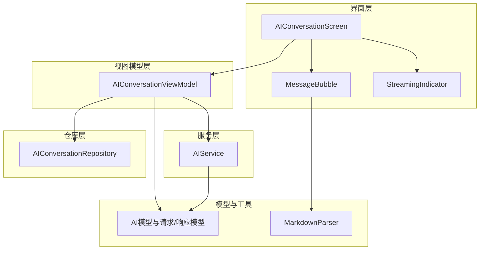
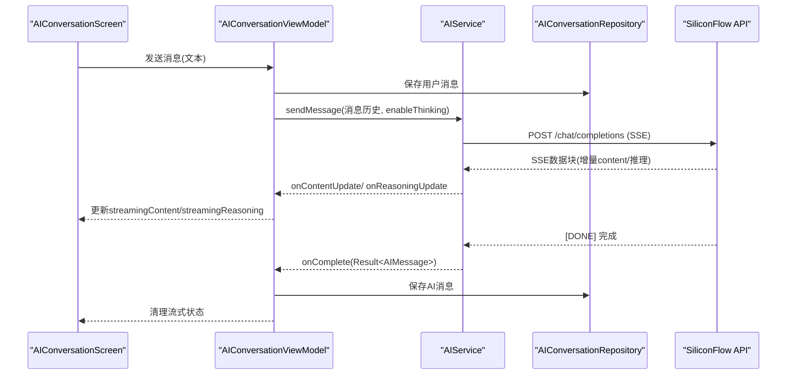
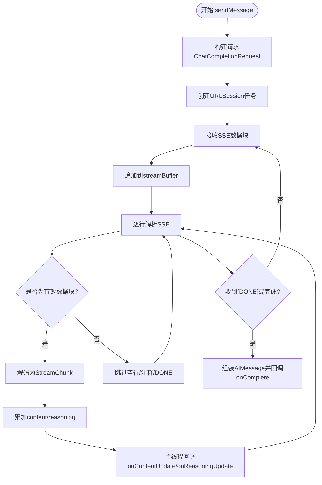
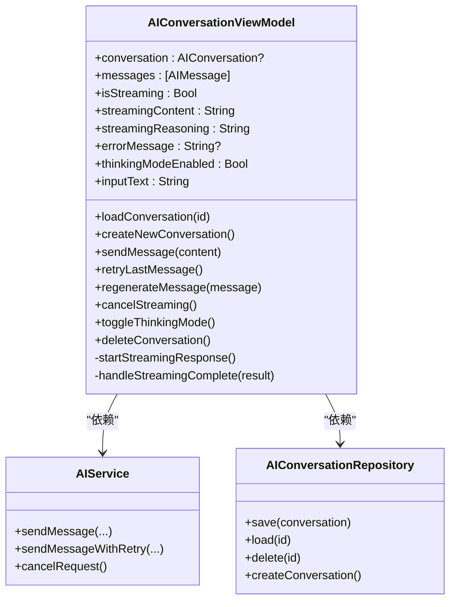
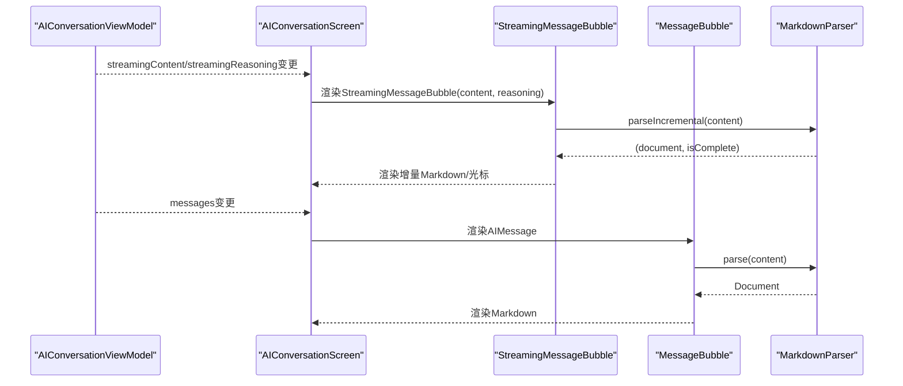
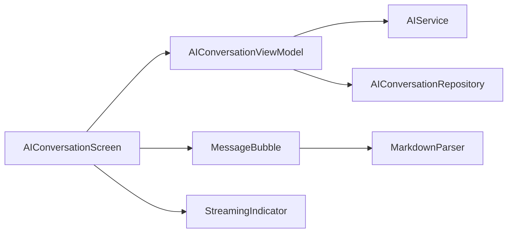

# AI对话服务

<cite>
**本文引用的文件**
- [AIService.swift](file://guanji0.34/DataLayer/SystemServices/AIService.swift)
- [AIConversationViewModel.swift](file://guanji0.34/Features/AIConversation/AIConversationViewModel.swift)
- [MessageBubble.swift](file://guanji0.34/Features/AIConversation/Views/MessageBubble.swift)
- [StreamingIndicator.swift](file://guanji0.34/Features/AIConversation/Views/StreamingIndicator.swift)
- [AIConversationScreen.swift](file://guanji0.34/Features/AIConversation/AIConversationScreen.swift)
- [AIConversationRepository.swift](file://guanji0.34/DataLayer/Repositories/AIConversationRepository.swift)
- [AIServiceModels.swift](file://guanji0.34/Core/Models/AIServiceModels.swift)
- [AIConversationModels.swift](file://guanji0.34/Core/Models/AIConversationModels.swift)
- [MarkdownParser.swift](file://guanji0.34/Core/Utilities/MarkdownParser.swift)
- [ai-conversation.md](file://Docs/features/ai-conversation.md)
- [AppState.swift](file://guanji0.34/App/AppState.swift)
</cite>

## 目录
1. [简介](#简介)
2. [项目结构](#项目结构)
3. [核心组件](#核心组件)
4. [架构总览](#架构总览)
5. [详细组件分析](#详细组件分析)
6. [依赖关系分析](#依赖关系分析)
7. [性能考量](#性能考量)
8. [故障排查指南](#故障排查指南)
9. [结论](#结论)
10. [附录](#附录)

## 简介
本文件面向开发者与产品人员，系统化阐述AI对话服务的技术实现，重点覆盖以下方面：
- AIService如何通过流式API与后端通信，包括SSE解析、增量缓冲与回调分发
- onChunk、onThinking、onComplete等回调机制的实现原理
- 在AIConversationViewModel中如何协调这些事件以驱动UI更新
- 消息序列化、错误重试策略、会话状态管理
- 结合MessageBubble与StreamingIndicator组件说明渐进式响应的用户体验实现
- 提供Swift代码示例路径，展示如何发起AI请求、处理流式数据并渲染到界面
- 服务与ViewModel之间的依赖注入方式与生命周期管理

## 项目结构
AI对话模块位于Features/AIConversation目录，包含屏幕、视图模型与UI组件；数据层由DataLayer/SystemServices与DataLayer/Repositories提供；核心模型与工具位于Core目录。

图表来源
- [AIConversationScreen.swift](file://guanji0.34/Features/AIConversation/AIConversationScreen.swift#L1-L238)
- [AIConversationViewModel.swift](file://guanji0.34/Features/AIConversation/AIConversationViewModel.swift#L1-L227)
- [AIService.swift](file://guanji0.34/DataLayer/SystemServices/AIService.swift#L1-L384)
- [AIConversationRepository.swift](file://guanji0.34/DataLayer/Repositories/AIConversationRepository.swift#L1-L201)
- [AIConversationModels.swift](file://guanji0.34/Core/Models/AIConversationModels.swift#L1-L170)
- [AIServiceModels.swift](file://guanji0.34/Core/Models/AIServiceModels.swift#L1-L210)
- [MarkdownParser.swift](file://guanji0.34/Core/Utilities/MarkdownParser.swift#L1-L46)

章节来源
- [AIConversationScreen.swift](file://guanji0.34/Features/AIConversation/AIConversationScreen.swift#L1-L238)
- [AIConversationViewModel.swift](file://guanji0.34/Features/AIConversation/AIConversationViewModel.swift#L1-L227)
- [AIService.swift](file://guanji0.34/DataLayer/SystemServices/AIService.swift#L1-L384)
- [AIConversationRepository.swift](file://guanji0.34/DataLayer/Repositories/AIConversationRepository.swift#L1-L201)
- [AIConversationModels.swift](file://guanji0.34/Core/Models/AIConversationModels.swift#L1-L170)
- [AIServiceModels.swift](file://guanji0.34/Core/Models/AIServiceModels.swift#L1-L210)
- [MarkdownParser.swift](file://guanji0.34/Core/Utilities/MarkdownParser.swift#L1-L46)

## 核心组件
- AIService：封装与SiliconFlow API的交互，支持流式响应与同步响应，内置SSE解析、增量缓冲、错误处理与指数退避重试。
- AIConversationViewModel：MVVM中的ViewModel，协调消息发送、流式状态管理、错误处理与UI更新。
- AIConversationScreen：主界面，根据消息状态渲染消息列表、空状态、流式指示器与错误提示。
- MessageBubble：消息气泡组件，支持Markdown渲染、长按菜单、复制与重新生成。
- StreamingIndicator：流式指示器，显示“正在输入”动画。
- AIConversationRepository：对话与消息持久化，基于JSON文件与内存缓存。
- AIServiceModels与AIConversationModels：请求/响应模型、消息与会话模型。
- MarkdownParser：Markdown解析器，支持增量解析与不完整语法检测，用于流式渲染。

章节来源
- [AIService.swift](file://guanji0.34/DataLayer/SystemServices/AIService.swift#L1-L384)
- [AIConversationViewModel.swift](file://guanji0.34/Features/AIConversation/AIConversationViewModel.swift#L1-L227)
- [AIConversationScreen.swift](file://guanji0.34/Features/AIConversation/AIConversationScreen.swift#L1-L238)
- [MessageBubble.swift](file://guanji0.34/Features/AIConversation/Views/MessageBubble.swift#L1-L403)
- [StreamingIndicator.swift](file://guanji0.34/Features/AIConversation/Views/StreamingIndicator.swift#L1-L209)
- [AIConversationRepository.swift](file://guanji0.34/DataLayer/Repositories/AIConversationRepository.swift#L1-L201)
- [AIServiceModels.swift](file://guanji0.34/Core/Models/AIServiceModels.swift#L1-L210)
- [AIConversationModels.swift](file://guanji0.34/Core/Models/AIConversationModels.swift#L1-L170)
- [MarkdownParser.swift](file://guanji0.34/Core/Utilities/MarkdownParser.swift#L1-L46)

## 架构总览
AI对话服务采用MVVM架构，界面层通过ViewModel暴露状态，ViewModel通过AIService发起网络请求，使用AIConversationRepository进行持久化，界面组件根据状态进行渲染。

图表来源
- [AIConversationScreen.swift](file://guanji0.34/Features/AIConversation/AIConversationScreen.swift#L47-L86)
- [AIConversationViewModel.swift](file://guanji0.34/Features/AIConversation/AIConversationViewModel.swift#L76-L199)
- [AIService.swift](file://guanji0.34/DataLayer/SystemServices/AIService.swift#L45-L78)
- [AIConversationRepository.swift](file://guanji0.34/DataLayer/Repositories/AIConversationRepository.swift#L31-L41)

## 详细组件分析

### AIService：流式API与回调机制
- 流式请求构建：将AIMessage转换为ChatCompletionRequest，启用stream=true与可选enableThinking。
- SSE解析：维护streamBuffer，按行解析"data: ..."格式，解码为StreamChunk，分别累加content与reasoningContent。
- 回调分发：主线程异步触发onContentUpdate与onReasoningUpdate，最终在didCompleteWithError中汇总生成AIMessage并触发onComplete。
- 错误处理：网络错误、取消、API错误、解码错误均有明确枚举类型与错误描述。
- 重试策略：sendMessageWithRetry实现指数退避重试，避免对取消与API错误进行重试。

图表来源
- [AIService.swift](file://guanji0.34/DataLayer/SystemServices/AIService.swift#L262-L321)
- [AIService.swift](file://guanji0.34/DataLayer/SystemServices/AIService.swift#L212-L260)

章节来源
- [AIService.swift](file://guanji0.34/DataLayer/SystemServices/AIService.swift#L45-L78)
- [AIService.swift](file://guanji0.34/DataLayer/SystemServices/AIService.swift#L212-L260)
- [AIService.swift](file://guanji0.34/DataLayer/SystemServices/AIService.swift#L262-L321)
- [AIService.swift](file://guanji0.34/DataLayer/SystemServices/AIService.swift#L336-L382)
- [AIServiceModels.swift](file://guanji0.34/Core/Models/AIServiceModels.swift#L137-L166)
- [AIServiceModels.swift](file://guanji0.34/Core/Models/AIServiceModels.swift#L181-L209)

### AIConversationViewModel：事件协调与状态管理
- 会话状态：@Published的conversation、messages、isStreaming、streamingContent、streamingReasoning、errorMessage、thinkingModeEnabled、inputText。
- 发送消息：校验输入与流式状态，创建/保存用户消息，必要时自动生成标题，调用AIService.startStreamingResponse。
- 流式完成：根据结果添加AI消息至会话，保存并清理流式状态；错误时设置errorMessage。
- 重试与取消：retryLastMessage与cancelStreaming直接委托给AIService。
- 再生消息：删除指定AI消息及其后续消息，保存并重新发起流式请求。

图表来源
- [AIConversationViewModel.swift](file://guanji0.34/Features/AIConversation/AIConversationViewModel.swift#L8-L227)
- [AIService.swift](file://guanji0.34/DataLayer/SystemServices/AIService.swift#L45-L78)
- [AIConversationRepository.swift](file://guanji0.34/DataLayer/Repositories/AIConversationRepository.swift#L31-L41)

章节来源
- [AIConversationViewModel.swift](file://guanji0.34/Features/AIConversation/AIConversationViewModel.swift#L76-L199)
- [AIConversationViewModel.swift](file://guanji0.34/Features/AIConversation/AIConversationViewModel.swift#L201-L225)

### MessageBubble与StreamingIndicator：渐进式响应体验
- MessageBubble：区分用户/AI消息，渲染Markdown（长消息异步解析），支持长按菜单（复制、重新生成、复制含思考），显示时间戳与操作按钮。
- StreamingIndicator：显示“正在输入”的点阵动画；StreamingMessageBubble在流式过程中展示增量Markdown与光标动画，支持不完整语法的容错渲染。

图表来源
- [AIConversationScreen.swift](file://guanji0.34/Features/AIConversation/AIConversationScreen.swift#L47-L86)
- [StreamingIndicator.swift](file://guanji0.34/Features/AIConversation/Views/StreamingIndicator.swift#L49-L141)
- [MessageBubble.swift](file://guanji0.34/Features/AIConversation/Views/MessageBubble.swift#L9-L154)
- [MarkdownParser.swift](file://guanji0.34/Core/Utilities/MarkdownParser.swift#L15-L27)

章节来源
- [StreamingIndicator.swift](file://guanji0.34/Features/AIConversation/Views/StreamingIndicator.swift#L49-L141)
- [MessageBubble.swift](file://guanji0.34/Features/AIConversation/Views/MessageBubble.swift#L9-L154)
- [MarkdownParser.swift](file://guanji0.34/Core/Utilities/MarkdownParser.swift#L15-L27)

### 会话状态管理与持久化
- 会话模型：AIConversation包含id、title、messages、dayId、associatedDays、createdAt、updatedAt；提供生成标题、添加消息与排序等方法。
- 仓库层：AIConversationRepository负责文件存储（Documents/ai_conversations/）、索引管理、缓存与通知广播。
- ViewModel与仓库协作：发送消息前保存用户消息，完成后保存AI消息；删除会话时清理文件并更新索引。

章节来源
- [AIConversationModels.swift](file://guanji0.34/Core/Models/AIConversationModels.swift#L86-L156)
- [AIConversationRepository.swift](file://guanji0.34/DataLayer/Repositories/AIConversationRepository.swift#L31-L41)
- [AIConversationRepository.swift](file://guanji0.34/DataLayer/Repositories/AIConversationRepository.swift#L178-L200)

### 消息序列化与模型映射
- 请求模型：ChatCompletionRequest支持stream、maxTokens、enableThinking、thinkingBudget、temperature、topP等参数；当模型非QwQ-32B时才编码思考相关字段。
- 响应模型：ChatCompletionResponse与StreamChunk定义choices/delta结构，支持reasoning_content与content增量。
- AIMessage：统一的消息载体，支持reasoningContent与附件。

章节来源
- [AIServiceModels.swift](file://guanji0.34/Core/Models/AIServiceModels.swift#L5-L86)
- [AIServiceModels.swift](file://guanji0.34/Core/Models/AIServiceModels.swift#L92-L133)
- [AIServiceModels.swift](file://guanji0.34/Core/Models/AIServiceModels.swift#L137-L166)
- [AIConversationModels.swift](file://guanji0.34/Core/Models/AIConversationModels.swift#L57-L80)

### 错误重试策略
- AIService.sendMessageWithRetry：对网络错误与解码错误进行最多N次重试，采用线性递增延迟；对取消与API错误不再重试。
- ViewModel层：在错误时显示错误视图与“重试”按钮，点击后调用retryLastMessage重新发起流式请求。

章节来源
- [AIService.swift](file://guanji0.34/DataLayer/SystemServices/AIService.swift#L336-L382)
- [AIConversationScreen.swift](file://guanji0.34/Features/AIConversation/AIConversationScreen.swift#L89-L120)
- [AIConversationViewModel.swift](file://guanji0.34/Features/AIConversation/AIConversationViewModel.swift#L113-L116)

## 依赖关系分析
- 依赖注入：ViewModel通过单例共享实例依赖AIService与AIConversationRepository，确保全局一致性与简单注入。
- 生命周期：ViewModel在屏幕出现时初始化，随屏幕销毁释放；AIService维持当前任务引用，取消时清理回调。
- 状态传播：ViewModel通过@Published属性向界面层推送状态变化，界面层自动刷新。

图表来源
- [AIConversationViewModel.swift](file://guanji0.34/Features/AIConversation/AIConversationViewModel.swift#L38-L39)
- [AIConversationScreen.swift](file://guanji0.34/Features/AIConversation/AIConversationScreen.swift#L7-L8)
- [MessageBubble.swift](file://guanji0.34/Features/AIConversation/Views/MessageBubble.swift#L1-L403)
- [StreamingIndicator.swift](file://guanji0.34/Features/AIConversation/Views/StreamingIndicator.swift#L1-L209)
- [MarkdownParser.swift](file://guanji0.34/Core/Utilities/MarkdownParser.swift#L1-L46)

章节来源
- [AIConversationViewModel.swift](file://guanji0.34/Features/AIConversation/AIConversationViewModel.swift#L38-L39)
- [AIConversationScreen.swift](file://guanji0.34/Features/AIConversation/AIConversationScreen.swift#L7-L8)

## 性能考量
- Markdown解析：长消息采用后台任务异步解析，避免阻塞主线程；短消息同步解析，提升即时性。
- 流式渲染：parseIncremental与hasIncompleteSyntax保证不完整语法也能安全渲染，减少闪烁。
- 缓存与持久化：仓库层使用内存缓存与后台写入，降低I/O开销。
- 网络超时与重试：URLSession超时控制与指数退避重试平衡稳定性与用户体验。

## 故障排查指南
- 网络错误：检查API密钥配置与网络连通性；确认AIService.isConfigured与setAPIKey正确设置。
- 解码错误：核对响应格式与模型兼容性；关注APIErrorResponse的错误信息。
- 取消与超时：调用cancelStreaming清理回调；合理设置超时时间。
- 重试无效：若错误为取消或API错误，不会触发重试；检查错误类型分支。

章节来源
- [AIService.swift](file://guanji0.34/DataLayer/SystemServices/AIService.swift#L169-L177)
- [AIService.swift](file://guanji0.34/DataLayer/SystemServices/AIService.swift#L357-L365)
- [AIServiceModels.swift](file://guanji0.34/Core/Models/AIServiceModels.swift#L181-L209)

## 结论
本AI对话服务通过清晰的分层设计与稳健的流式处理机制，实现了低延迟、高可用的对话体验。AIService负责底层网络与SSE解析，AIConversationViewModel协调状态与UI，MessageBubble与StreamingIndicator提供渐进式反馈。配合完善的错误处理与重试策略，系统在复杂网络环境下仍能保持稳定与流畅。

## 附录

### Swift代码示例路径（不展示具体代码内容）
- 发起AI请求与流式处理
  - [AIService.sendMessage](file://guanji0.34/DataLayer/SystemServices/AIService.swift#L45-L78)
  - [AIConversationViewModel.startStreamingResponse](file://guanji0.34/Features/AIConversation/AIConversationViewModel.swift#L169-L199)
  - [AIConversationViewModel.handleStreamingComplete](file://guanji0.34/Features/AIConversation/AIConversationViewModel.swift#L201-L225)
- 错误重试
  - [AIService.sendMessageWithRetry](file://guanji0.34/DataLayer/SystemServices/AIService.swift#L336-L382)
- 消息序列化与模型
  - [ChatCompletionRequest](file://guanji0.34/Core/Models/AIServiceModels.swift#L5-L86)
  - [ChatCompletionResponse/StreamChunk](file://guanji0.34/Core/Models/AIServiceModels.swift#L92-L166)
  - [AIMessage](file://guanji0.34/Core/Models/AIConversationModels.swift#L57-L80)
- UI渲染与增量解析
  - [StreamingMessageBubble.parseIncrementally](file://guanji0.34/Features/AIConversation/Views/StreamingIndicator.swift#L125-L140)
  - [MarkdownParser.parseIncremental](file://guanji0.34/Core/Utilities/MarkdownParser.swift#L15-L22)
- 依赖注入与生命周期
  - [AIConversationViewModel.init/dependencies](file://guanji0.34/Features/AIConversation/AIConversationViewModel.swift#L43-L46)
  - [AIConversationScreen.StateObject](file://guanji0.34/Features/AIConversation/AIConversationScreen.swift#L7)
  - [AppState.currentMode/currentConversationId](file://guanji0.34/App/AppState.swift#L30-L34)