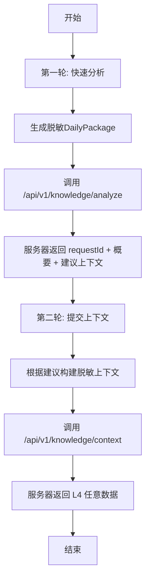
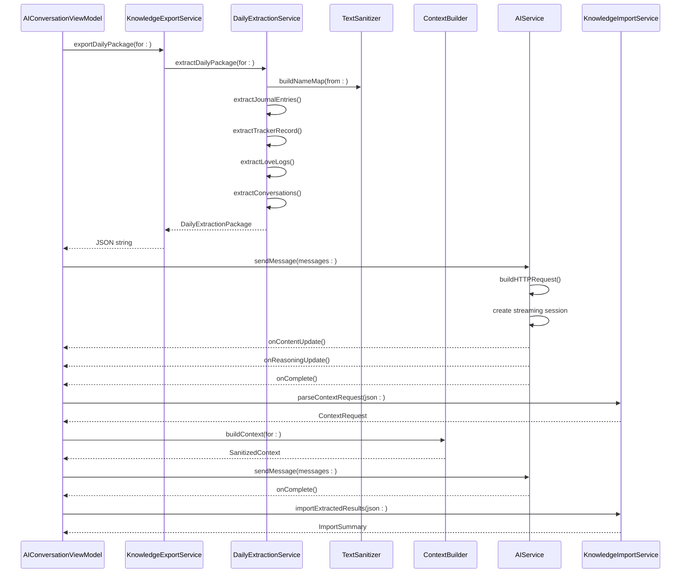

# AI服务集成

<cite>
**本文档引用文件**   
- [API_KNOWLEDGE_EXTRACTION.md](file://Docs/API_KNOWLEDGE_EXTRACTION.md)
- [AIService.swift](file://guanji0.34/DataLayer/SystemServices/AIService.swift)
- [DailyExtractionService.swift](file://guanji0.34/DataLayer/SystemServices/DailyExtractionService.swift)
- [ContextBuilder.swift](file://guanji0.34/DataLayer/SystemServices/ContextBuilder.swift)
- [KnowledgeExportService.swift](file://guanji0.34/DataLayer/SystemServices/KnowledgeExportService.swift)
- [KnowledgeImportService.swift](file://guanji0.34/DataLayer/SystemServices/KnowledgeImportService.swift)
- [TextSanitizer.swift](file://guanji0.34/Core/Utilities/TextSanitizer.swift)
- [AIConversationViewModel.swift](file://guanji0.34/Features/AIConversation/AIConversationViewModel.swift)
- [KnowledgeAPIModels.swift](file://guanji0.34/Core/Models/KnowledgeAPIModels.swift)
- [DailyExtractionModels.swift](file://guanji0.34/Core/Models/DailyExtractionModels.swift)
</cite>

## 目录
1. [简介](#简介)
2. [AI服务通信机制](#ai服务通信机制)
3. [AI知识提取流程](#ai知识提取流程)
4. [核心数据结构与公式](#核心数据结构与公式)
5. [文本脱敏规则](#文本脱敏规则)
6. [上下文构建逻辑](#上下文构建逻辑)
7. [调用序列图](#调用序列图)
8. [Swift代码示例](#swift代码示例)
9. [数据导出与结果导入](#数据导出与结果导入)
10. [错误码与认证](#错误码与认证)

## 简介
本文档全面阐述了AI服务集成的深度技术实现，重点覆盖从数据准备到知识提取的完整流程。文档详细说明了AIService如何通过流式API与后端通信，处理`onChunk`、`onThinking`等回调以实现渐进式响应。核心内容聚焦于AI知识提取的两轮交互流程：第一轮通过DailyExtractionService生成脱敏的DailyPackage并调用`/api/v1/knowledge/analyze`获取分析建议；第二轮由ContextBuilder根据建议构建脱敏的上下文数据，并通过`/api/v1/knowledge/context`提交以获取L4层知识节点。文档还详细描述了TextSanitizer的脱敏规则和ContextBuilder的上下文构建逻辑，并提供了完整的调用序列图和Swift代码示例，帮助开发者完整理解端到端的AI知识提取机制。

## AI服务通信机制
AIService是与SiliconFlow API集成的核心组件，支持流式响应和思考模式。它通过`sendMessage`方法发送消息并接收流式响应，该方法接受消息历史、是否启用思考模式以及多个回调函数作为参数。

当启用思考模式时，AIService会请求模型的`reasoning_content`，并在接收到新的推理内容时调用`onReasoningUpdate`回调。对于流式响应，AIService实现了`URLSessionDataDelegate`协议，通过`urlSession(_:dataTask:didReceive:)`方法接收数据块，并在`processStreamBuffer`方法中解析SSE格式的数据流，将内容和推理内容分别累积并触发相应的回调。

AIService还提供了重试机制，通过`sendMessageWithRetry`方法在请求失败时进行指数退避重试，最多重试3次。此外，`cancelRequest`方法允许取消当前的请求，确保用户可以中断长时间运行的AI响应。

**Section sources**
- [AIService.swift](file://guanji0.34/DataLayer/SystemServices/AIService.swift#L38-L383)

## AI知识提取流程
AI知识提取采用高效的两轮交互流程，旨在节省带宽和Token消耗。第一轮交互中，客户端通过`DailyExtractionService`生成脱敏的每日数据包（DailyPackage），并将其发送到`/api/v1/knowledge/analyze`端点。服务器返回一个包含`requestId`、概要和建议上下文维度的快速分析结果。

在第二轮交互中，客户端根据第一轮返回的`requestId`和`suggestedContexts`，使用`ContextBuilder`构建脱敏的上下文数据，并将其与`requestId`一起发送到`/api/v1/knowledge/context`端点。服务器利用`requestId`关联缓存的DailyPackage，仅需补充上下文数据即可进行完整提取，最终返回L4层的任意数据，如知识节点、关系更新或用户画像洞察。

这种两轮交互流程的优势在于，第二轮不需要重复发送DailyPackage，从而节省了带宽和Token，同时服务器已缓存原始数据，仅需补充上下文，提高了处理效率。



**Diagram sources**
- [API_KNOWLEDGE_EXTRACTION.md](file://Docs/API_KNOWLEDGE_EXTRACTION.md#L70-L94)
- [DailyExtractionService.swift](file://guanji0.34/DataLayer/SystemServices/DailyExtractionService.swift#L16-L40)
- [ContextBuilder.swift](file://guanji0.34/DataLayer/SystemServices/ContextBuilder.swift#L19-L36)

## 核心数据结构与公式
文档定义了AI知识提取的核心公式和数据结构。核心公式包括：

1. **快速定位（第一轮）**: `DailyPackage → AI → QuickAnalysis`
   - 输入：每日数据包（已脱敏）
   - 输出：快速分析结果 + 需要的上下文列表

2. **提交上下文（第二轮）**: `requestId + RequestedContext → AI → L4Data[]`
   - 输入：请求ID（关联缓存的 DailyPackage）+ 请求的上下文
   - 输出：L4层任意数据

3. **灵活输出**: 服务端返回的数据结构灵活，符合iOS定义的规范即可。

数据结构方面，`DailyExtractionPackage`包含了脱敏的日记条目、追踪记录、爱表记录和AI对话摘要。`ContextRequest`定义了服务器需要的上下文类型，如用户画像或特定关系。`ExtractionResponse`则封装了提取结果，包括成功状态、日期和结果数组。

**Section sources**
- [API_KNOWLEDGE_EXTRACTION.md](file://Docs/API_KNOWLEDGE_EXTRACTION.md#L11-L724)
- [KnowledgeAPIModels.swift](file://guanji0.34/Core/Models/KnowledgeAPIModels.swift#L9-L284)
- [DailyExtractionModels.swift](file://guanji0.34/Core/Models/DailyExtractionModels.swift#L7-L277)

## 文本脱敏规则
TextSanitizer是负责文本脱敏的核心工具，其主要功能是统一人物标识和脱敏敏感数字。它通过`buildNameMap(from:)`方法从关系列表构建名称映射表，将真实姓名、显示名称和别名映射到统一的标识符格式`[REL_ID:displayName]`。

在脱敏过程中，`sanitize(_:)`方法首先替换已知关系名称为统一标识符，然后通过正则表达式脱敏敏感数字，如手机号、身份证、邮箱和银行卡号，分别替换为`[PHONE]`、`[ID_CARD]`、`[EMAIL]`和`[BANK_CARD]`占位符。

对于人名字段的脱敏，`sanitizeName(_:)`方法检查是否为已知关系，若是则返回统一标识符；若为"Me"或"我"，则保留原样；否则标记为未知人物。这种脱敏机制确保了用户隐私的同时，保留了AI分析所需的上下文信息。

**Section sources**
- [TextSanitizer.swift](file://guanji0.34/Core/Utilities/TextSanitizer.swift#L6-L140)

## 上下文构建逻辑
ContextBuilder负责构建脱敏的上下文数据，用于第二轮AI知识提取。它通过`buildContext(for:)`方法根据服务器的上下文请求构建上下文，支持用户画像和特定关系两种类型。

构建用户画像时，`buildUserProfile()`方法移除敏感字段如家乡和当前城市，仅保留性别、出生年月、职业、行业、教育和自定义标签等静态核心信息。同时，它将知识节点转换为摘要形式，仅包含ID、类型、名称、描述、置信度和标签。

构建关系时，`buildRelationship(id:)`方法移除真实姓名，保留显示名称和别名，并将关系属性转换为摘要形式。它还构建脱敏的事实锚点，如首次见面日期和共同经历，确保上下文数据的完整性和隐私性。

**Section sources**
- [ContextBuilder.swift](file://guanji0.34/DataLayer/SystemServices/ContextBuilder.swift#L19-L146)

## 调用序列图
以下序列图展示了AI知识提取的完整调用流程，从生成每日数据包到最终导入提取结果。



**Diagram sources**
- [AIConversationViewModel.swift](file://guanji0.34/Features/AIConversation/AIConversationViewModel.swift#L76-L227)
- [KnowledgeExportService.swift](file://guanji0.34/DataLayer/SystemServices/KnowledgeExportService.swift#L21-L82)
- [DailyExtractionService.swift](file://guanji0.34/DataLayer/SystemServices/DailyExtractionService.swift#L19-L262)
- [TextSanitizer.swift](file://guanji0.34/Core/Utilities/TextSanitizer.swift#L20-L44)
- [ContextBuilder.swift](file://guanji0.34/DataLayer/SystemServices/ContextBuilder.swift#L20-L36)
- [AIService.swift](file://guanji0.34/DataLayer/SystemServices/AIService.swift#L38-L383)
- [KnowledgeImportService.swift](file://guanji0.34/DataLayer/SystemServices/KnowledgeImportService.swift#L57-L89)

## Swift代码示例
以下Swift代码示例展示了如何在AIConversationViewModel中协调各服务进行AI知识提取。

```swift
// 1. 准备请求数据
let package = try await DailyExtractionService.shared.extractDailyPackage(for: "2024.12.22")
let userProfile = NarrativeUserProfileRepository.shared.load()
let relationships = NarrativeRelationshipRepository.shared.loadAll()

// 2. 构建请求体
let requestBody: [String: Any] = [
    "dayId": package.dayId,
    "extractedAt": ISO8601DateFormatter().string(from: package.extractedAt),
    "data": [
        "journalEntries": package.journalEntries.map { $0.toDictionary() },
        "trackerRecord": package.trackerRecord?.toDictionary(),
        "loveLogs": package.loveLogs.map { $0.toDictionary() },
        "aiConversations": package.aiConversations.map { $0.toDictionary() }
    ],
    "context": [
        "userProfile": [
            "staticCore": userProfile.staticCore.toDictionary(),
            "existingNodes": userProfile.knowledgeNodes.map { $0.toSummary() }
        ],
        "relationships": relationships.map { rel in
            [
                "id": rel.id,
                "ref": PersonIdentifier(relationshipId: rel.id, displayName: rel.displayName).formatted,
                "type": rel.type.rawValue,
                "displayName": rel.displayName,
                "aliases": rel.aliases,
                "existingAttributes": rel.attributes.map { $0.toSummary() }
            ]
        }
    ]
]
```

**Section sources**
- [AIConversationViewModel.swift](file://guanji0.34/Features/AIConversation/AIConversationViewModel.swift#L76-L227)

## 数据导出与结果导入
KnowledgeExportService和KnowledgeImportService分别负责数据导出与结果导入。KnowledgeExportService提供`exportDailyPackage(for:)`和`exportContext(for:)`方法，将每日数据包和上下文数据导出为JSON字符串，便于通过网络传输。

KnowledgeImportService则负责解析服务器响应并更新本地L4数据。`parseExtractionResponse(json:)`方法解析提取响应，`importExtractedResults(json:)`方法导入提取结果，并根据结果类型更新用户画像或关系属性。导入过程中，它会检查重复项以避免数据冗余，并返回导入摘要，包括成功导入、跳过和错误的数量。

这两个服务共同实现了端到端的数据导出与结果导入机制，确保了AI知识提取的完整性和数据一致性。

**Section sources**
- [KnowledgeExportService.swift](file://guanji0.34/DataLayer/SystemServices/KnowledgeExportService.swift#L21-L120)
- [KnowledgeImportService.swift](file://guanji0.34/DataLayer/SystemServices/KnowledgeImportService.swift#L57-L236)

## 错误码与认证
AI知识提取接口使用Bearer Token进行认证，请求头中需包含`Authorization: Bearer {user_token}`。接口定义了多种错误响应，包括400 Bad Request（请求格式错误）、401 Unauthorized（认证失败）、429 Too Many Requests（请求过多）和500 Internal Server Error（服务器错误）。

错误响应包含错误代码、消息和详细信息，如`INVALID_REQUEST`表示缺少必填字段，`UNAUTHORIZED`表示令牌无效或过期，`RATE_LIMIT_EXCEEDED`表示请求过多，`INTERNAL_ERROR`表示服务器内部错误。客户端应根据错误码进行相应的错误处理和用户提示。

**Section sources**
- [API_KNOWLEDGE_EXTRACTION.md](file://Docs/API_KNOWLEDGE_EXTRACTION.md#L668-L722)