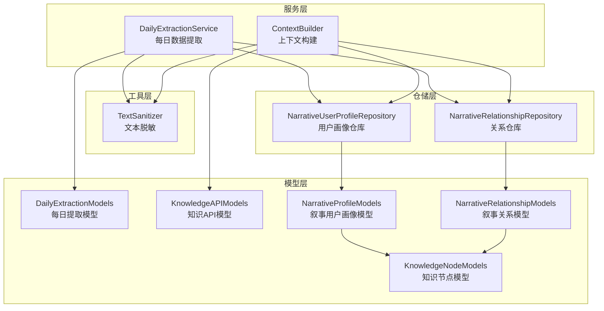
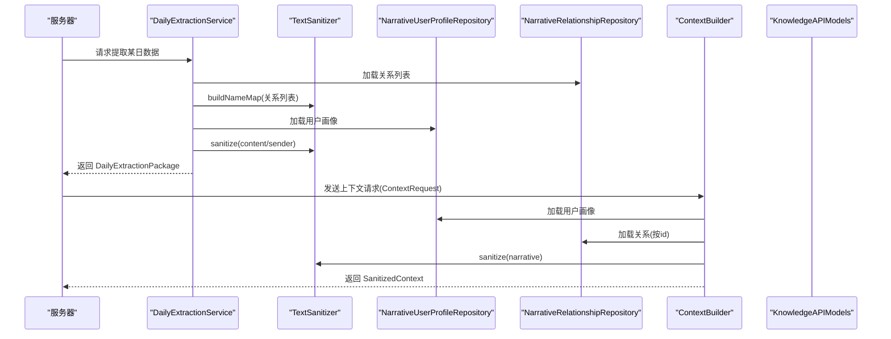
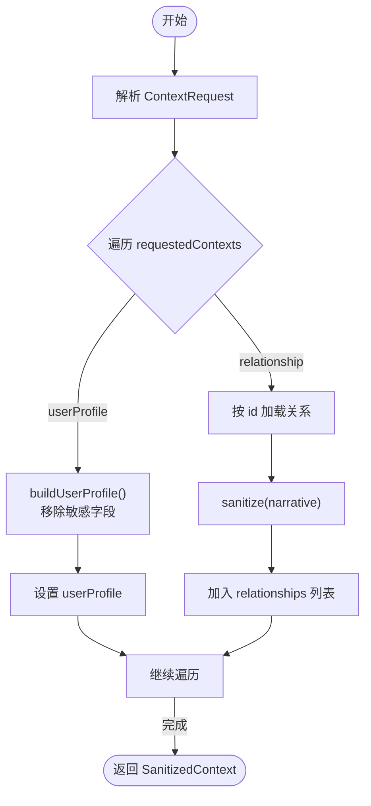
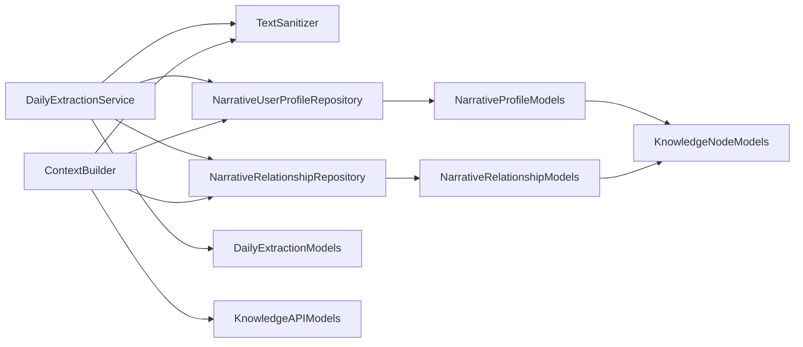

# 数据脱敏与上下文构建

<cite>
**本文档引用的文件**
- [TextSanitizer.swift](file://guanji0.34/Core/Utilities/TextSanitizer.swift)
- [DailyExtractionService.swift](file://guanji0.34/DataLayer/SystemServices/DailyExtractionService.swift)
- [ContextBuilder.swift](file://guanji0.34/DataLayer/SystemServices/ContextBuilder.swift)
- [NarrativeUserProfileRepository.swift](file://guanji0.34/DataLayer/Repositories/NarrativeUserProfileRepository.swift)
- [NarrativeRelationshipRepository.swift](file://guanji0.34/DataLayer/Repositories/NarrativeRelationshipRepository.swift)
- [DailyExtractionModels.swift](file://guanji0.34/Core/Models/DailyExtractionModels.swift)
- [KnowledgeAPIModels.swift](file://guanji0.34/Core/Models/KnowledgeAPIModels.swift)
- [NarrativeProfileModels.swift](file://guanji0.34/Core/Models/NarrativeProfileModels.swift)
- [NarrativeRelationshipModels.swift](file://guanji0.34/Core/Models/NarrativeRelationshipModels.swift)
- [KnowledgeNodeModels.swift](file://guanji0.34/Core/Models/KnowledgeNodeModels.swift)
- [API_KNOWLEDGE_EXTRACTION.md](file://Docs/API_KNOWLEDGE_EXTRACTION.md)
</cite>

## 目录
1. [简介](#简介)
2. [项目结构](#项目结构)
3. [核心组件](#核心组件)
4. [架构总览](#架构总览)
5. [详细组件分析](#详细组件分析)
6. [依赖关系分析](#依赖关系分析)
7. [性能考量](#性能考量)
8. [故障排查指南](#故障排查指南)
9. [结论](#结论)

## 简介
本文件围绕“数据脱敏与上下文构建”主题，系统阐述以下内容：
- TextSanitizer 的脱敏规则与实现机制：包括人名统一为 [REL_ID:displayName]、手机号/邮箱/身份证等敏感信息的占位符处理；以及在 DailyExtractionService 中的触发时机与作用范围。
- ContextBuilder 如何根据第一轮返回的 suggestedContexts，从 NarrativeUserProfileRepository 与 NarrativeRelationshipRepository 加载相关画像数据，并构建符合 API 要求的上下文结构。
- 脱敏前后数据对比示例、上下文构建的条件逻辑判断，以及如何确保数据一致性与隐私安全。

## 项目结构
该功能涉及的核心模块包括：
- 工具层：TextSanitizer（文本脱敏）
- 服务层：DailyExtractionService（每日数据提取）、ContextBuilder（上下文构建）
- 仓储层：NarrativeUserProfileRepository、NarrativeRelationshipRepository（画像与关系数据持久化）
- 模型层：DailyExtractionModels、KnowledgeAPIModels、NarrativeProfileModels、NarrativeRelationshipModels、KnowledgeNodeModels（数据结构定义）

图表来源
- [TextSanitizer.swift](file://guanji0.34/Core/Utilities/TextSanitizer.swift#L1-L157)
- [DailyExtractionService.swift](file://guanji0.34/DataLayer/SystemServices/DailyExtractionService.swift#L1-L262)
- [ContextBuilder.swift](file://guanji0.34/DataLayer/SystemServices/ContextBuilder.swift#L1-L147)
- [NarrativeUserProfileRepository.swift](file://guanji0.34/DataLayer/Repositories/NarrativeUserProfileRepository.swift#L1-L131)
- [NarrativeRelationshipRepository.swift](file://guanji0.34/DataLayer/Repositories/NarrativeRelationshipRepository.swift#L1-L201)
- [DailyExtractionModels.swift](file://guanji0.34/Core/Models/DailyExtractionModels.swift#L1-L277)
- [KnowledgeAPIModels.swift](file://guanji0.34/Core/Models/KnowledgeAPIModels.swift#L1-L330)
- [NarrativeProfileModels.swift](file://guanji0.34/Core/Models/NarrativeProfileModels.swift#L1-L186)
- [NarrativeRelationshipModels.swift](file://guanji0.34/Core/Models/NarrativeRelationshipModels.swift#L1-L194)
- [KnowledgeNodeModels.swift](file://guanji0.34/Core/Models/KnowledgeNodeModels.swift#L1-L707)

章节来源
- [TextSanitizer.swift](file://guanji0.34/Core/Utilities/TextSanitizer.swift#L1-L157)
- [DailyExtractionService.swift](file://guanji0.34/DataLayer/SystemServices/DailyExtractionService.swift#L1-L262)
- [ContextBuilder.swift](file://guanji0.34/DataLayer/SystemServices/ContextBuilder.swift#L1-L147)
- [NarrativeUserProfileRepository.swift](file://guanji0.34/DataLayer/Repositories/NarrativeUserProfileRepository.swift#L1-L131)
- [NarrativeRelationshipRepository.swift](file://guanji0.34/DataLayer/Repositories/NarrativeRelationshipRepository.swift#L1-L201)
- [DailyExtractionModels.swift](file://guanji0.34/Core/Models/DailyExtractionModels.swift#L1-L277)
- [KnowledgeAPIModels.swift](file://guanji0.34/Core/Models/KnowledgeAPIModels.swift#L1-L330)
- [NarrativeProfileModels.swift](file://guanji0.34/Core/Models/NarrativeProfileModels.swift#L1-L186)
- [NarrativeRelationshipModels.swift](file://guanji0.34/Core/Models/NarrativeRelationshipModels.swift#L1-L194)
- [KnowledgeNodeModels.swift](file://guanji0.34/Core/Models/KnowledgeNodeModels.swift#L1-L707)

## 核心组件
- TextSanitizer：提供统一的人名映射与敏感信息脱敏能力，支持从关系列表构建名称映射表，并对文本进行人名替换与敏感数字掩码。
- DailyExtractionService：负责按日期提取 L1 数据，调用 TextSanitizer 完成脱敏，组装为 DailyExtractionPackage。
- ContextBuilder：接收服务器返回的上下文请求，按 requestedContexts 从仓库加载用户画像与关系数据，构建 SanitizedContext。
- 仓储层：NarrativeUserProfileRepository 与 NarrativeRelationshipRepository 提供画像与关系的持久化读写。
- 模型层：定义每日提取包、上下文结构、知识节点等数据模型。

章节来源
- [TextSanitizer.swift](file://guanji0.34/Core/Utilities/TextSanitizer.swift#L1-L157)
- [DailyExtractionService.swift](file://guanji0.34/DataLayer/SystemServices/DailyExtractionService.swift#L1-L262)
- [ContextBuilder.swift](file://guanji0.34/DataLayer/SystemServices/ContextBuilder.swift#L1-L147)
- [NarrativeUserProfileRepository.swift](file://guanji0.34/DataLayer/Repositories/NarrativeUserProfileRepository.swift#L1-L131)
- [NarrativeRelationshipRepository.swift](file://guanji0.34/DataLayer/Repositories/NarrativeRelationshipRepository.swift#L1-L201)
- [DailyExtractionModels.swift](file://guanji0.34/Core/Models/DailyExtractionModels.swift#L1-L277)
- [KnowledgeAPIModels.swift](file://guanji0.34/Core/Models/KnowledgeAPIModels.swift#L1-L330)
- [NarrativeProfileModels.swift](file://guanji0.34/Core/Models/NarrativeProfileModels.swift#L1-L186)
- [NarrativeRelationshipModels.swift](file://guanji0.34/Core/Models/NarrativeRelationshipModels.swift#L1-L194)
- [KnowledgeNodeModels.swift](file://guanji0.34/Core/Models/KnowledgeNodeModels.swift#L1-L707)

## 架构总览
下图展示脱敏与上下文构建在整体流程中的位置与交互：

图表来源
- [DailyExtractionService.swift](file://guanji0.34/DataLayer/SystemServices/DailyExtractionService.swift#L1-L262)
- [ContextBuilder.swift](file://guanji0.34/DataLayer/SystemServices/ContextBuilder.swift#L1-L147)
- [TextSanitizer.swift](file://guanji0.34/Core/Utilities/TextSanitizer.swift#L1-L157)
- [KnowledgeAPIModels.swift](file://guanji0.34/Core/Models/KnowledgeAPIModels.swift#L1-L330)

## 详细组件分析

### TextSanitizer 脱敏规则与实现机制
- 名称映射与统一标识
  - 通过 buildNameMap 从关系列表构建 nameMap，覆盖 displayName、realName、aliases。
  - sanitizeName 将已知名称替换为 [REL_{id}:{displayName}]，未知人物标记为 [UNKNOWN_PERSON:{name}]，保留“Me/我”不变。
  - sanitize 在 replaceKnownNames 后再执行 maskSensitiveNumbers。
- 敏感信息掩码
  - 手机号：1[3-9]xxxxxxxxx
  - 身份证：18位数字（末位可为X/x）
  - 邮箱：标准邮箱正则
  - 银行卡：16-19位数字（使用负向断言避免误匹配手机号）
- 关系上下文生成
  - generateRelationshipContexts 输出 RelationshipContext 列表，ref 使用 [REL_{id}:{displayName}] 格式，aliases 不包含 realName。

脱敏前后对比示例（基于模型定义与实现逻辑）
- 输入文本包含真实姓名“张三”、手机号“13812345678”、邮箱“zhangsan@example.com”、身份证“11010119900307XXXX”、银行卡“1234567890123456789”。
- 脱敏后：
  - 姓名统一为 [REL_{id}:displayName]（若存在对应关系）
  - 手机号、邮箱、身份证、银行卡分别被替换为占位符
- 人名替换策略
  - 若 nameMap 中存在该名称，则替换为 [REL_{id}:displayName]
  - 若为“Me/我”，保持不变
  - 未知人物标记为 [UNKNOWN_PERSON:{name}]

章节来源
- [TextSanitizer.swift](file://guanji0.34/Core/Utilities/TextSanitizer.swift#L1-L157)
- [DailyExtractionModels.swift](file://guanji0.34/Core/Models/DailyExtractionModels.swift#L194-L215)

### DailyExtractionService 的触发时机与作用范围
- 触发时机
  - 外部通过 extractDailyPackage(for:dayId) 触发，内部首先加载关系列表并构建名称映射表，随后异步提取各类 L1 数据。
- 作用范围
  - 日记条目：对 content 执行 sanitize，sender 执行 sanitizeName，past 类型附加 targetDate。
  - 每日追踪：对 details 执行 sanitize，companionDetails 转换为 [REL_{id}:displayName]。
  - 爱表：sender/receiver 执行 sanitizeName，content 执行 sanitize。
  - AI 对话：过滤 user/assistant 消息，保留有序消息序列。
  - 问题表：按创建时间或投递日期筛选当日问题。
- 时间戳处理
  - extractTime 支持“yyyy.MM.dd HH:mm”与 ISO8601 两种格式解析，统一输出 HH:mm。

脱敏触发点汇总
- 日记条目：journalEntries 中 content 与 sender
- 每日追踪：activities.details 与 companionDetails
- 爱表：loveLogs.senderRef/receiverRef/content
- AI 对话：messages.content（由上游决定是否脱敏）
- 问题表：不涉及文本脱敏

章节来源
- [DailyExtractionService.swift](file://guanji0.34/DataLayer/SystemServices/DailyExtractionService.swift#L1-L262)
- [DailyExtractionModels.swift](file://guanji0.34/Core/Models/DailyExtractionModels.swift#L1-L277)

### ContextBuilder 的上下文构建逻辑
- 输入：ContextRequest（包含 summary、detectedPersons、requestedContexts）
- 条件逻辑
  - requestedContexts 中的每一项：
    - userProfile：调用 buildUserProfile，移除敏感字段（如 hometown、currentCity），仅保留 gender、birthYearMonth、occupation、industry、education、selfTags 等。
    - relationship：按 id 调用 buildRelationship，移除 realName，对 narrative 执行 sanitize。
- 输出：SanitizedContext（userProfile 与 relationships 列表）
- 关系属性与事实锚点
  - attributes 转换为 KnowledgeNodeSummary（仅保留 id、nodeType、name、description、confidence、tags）
  - factAnchors 转换为 SanitizedFactAnchors（firstMeetingDate、sharedExperiences）

上下文构建流程图

图表来源
- [ContextBuilder.swift](file://guanji0.34/DataLayer/SystemServices/ContextBuilder.swift#L1-L147)
- [KnowledgeAPIModels.swift](file://guanji0.34/Core/Models/KnowledgeAPIModels.swift#L1-L330)

章节来源
- [ContextBuilder.swift](file://guanji0.34/DataLayer/SystemServices/ContextBuilder.swift#L1-L147)
- [KnowledgeAPIModels.swift](file://guanji0.34/Core/Models/KnowledgeAPIModels.swift#L1-L330)

### 仓储层与模型支撑
- 仓储层
  - NarrativeUserProfileRepository：提供 load/save/addRelationship/removeRelationship 等方法，支持默认画像创建与磁盘持久化。
  - NarrativeRelationshipRepository：提供 loadAll/load/id/loadByType/save/delete/search/getActiveRelationships 等方法，支持关系的增删改查与提及记录管理。
- 模型层
  - 用户画像与关系模型：包含静态核心、动态知识节点、关系事实锚点、提及记录等。
  - 知识节点模型：通用的 L4 层数据结构，支持多类型属性与变更历史跟踪。

章节来源
- [NarrativeUserProfileRepository.swift](file://guanji0.34/DataLayer/Repositories/NarrativeUserProfileRepository.swift#L1-L131)
- [NarrativeRelationshipRepository.swift](file://guanji0.34/DataLayer/Repositories/NarrativeRelationshipRepository.swift#L1-L201)
- [NarrativeProfileModels.swift](file://guanji0.34/Core/Models/NarrativeProfileModels.swift#L1-L186)
- [NarrativeRelationshipModels.swift](file://guanji0.34/Core/Models/NarrativeRelationshipModels.swift#L1-L194)
- [KnowledgeNodeModels.swift](file://guanji0.34/Core/Models/KnowledgeNodeModels.swift#L1-L707)

## 依赖关系分析
- DailyExtractionService 依赖 TextSanitizer、NarrativeUserProfileRepository、NarrativeRelationshipRepository、DailyExtractionModels。
- ContextBuilder 依赖 TextSanitizer、NarrativeUserProfileRepository、NarrativeRelationshipRepository、KnowledgeAPIModels。
- 仓储层依赖模型层（用户画像、关系、知识节点）。
- API 文档定义了第一轮与第二轮交互协议，ContextRequest 中的 suggestedContexts 决定第二轮上下文构建的具体范围。

图表来源
- [DailyExtractionService.swift](file://guanji0.34/DataLayer/SystemServices/DailyExtractionService.swift#L1-L262)
- [ContextBuilder.swift](file://guanji0.34/DataLayer/SystemServices/ContextBuilder.swift#L1-L147)
- [TextSanitizer.swift](file://guanji0.34/Core/Utilities/TextSanitizer.swift#L1-L157)
- [DailyExtractionModels.swift](file://guanji0.34/Core/Models/DailyExtractionModels.swift#L1-L277)
- [KnowledgeAPIModels.swift](file://guanji0.34/Core/Models/KnowledgeAPIModels.swift#L1-L330)
- [NarrativeUserProfileRepository.swift](file://guanji0.34/DataLayer/Repositories/NarrativeUserProfileRepository.swift#L1-L131)
- [NarrativeRelationshipRepository.swift](file://guanji0.34/DataLayer/Repositories/NarrativeRelationshipRepository.swift#L1-L201)
- [NarrativeProfileModels.swift](file://guanji0.34/Core/Models/NarrativeProfileModels.swift#L1-L186)
- [NarrativeRelationshipModels.swift](file://guanji0.34/Core/Models/NarrativeRelationshipModels.swift#L1-L194)
- [KnowledgeNodeModels.swift](file://guanji0.34/Core/Models/KnowledgeNodeModels.swift#L1-L707)

章节来源
- [API_KNOWLEDGE_EXTRACTION.md](file://Docs/API_KNOWLEDGE_EXTRACTION.md#L143-L213)

## 性能考量
- 正则表达式匹配
  - TextSanitizer 使用 NSRegularExpression 执行敏感信息识别与替换，建议在高频场景中考虑缓存编译后的正则对象以减少重复编译开销。
- 名称替换顺序
  - 按名称长度降序排序，避免短名称优先匹配导致的误替换，提升准确性的同时保持性能稳定。
- 异步提取
  - DailyExtractionService 对各数据源采用异步提取，减少主线程阻塞，提高整体吞吐。
- 上下文构建
  - ContextBuilder 仅按 requestedContexts 构建所需数据，避免不必要的全量加载，降低内存占用与计算成本。

## 故障排查指南
- 脱敏结果异常
  - 检查关系列表是否正确加载并传入 buildNameMap；确认 nameMap 是否包含目标名称键。
  - 若手机号未被识别，检查输入格式是否符合 1[3-9]xxxxxxxxx。
- 上下文缺失
  - 确认 ContextRequest 中 requestedContexts 是否包含 userProfile 或 relationship 项，且 relationship 的 id 是否有效。
  - 检查仓库层 load/load(id) 是否返回预期数据。
- 时间戳解析失败
  - DailyExtractionService 的 extractTime 对“yyyy.MM.dd HH:mm”与 ISO8601 两种格式进行解析，若解析失败，可能为格式不匹配或时区问题。
- API 协议错误
  - 参考 API 文档，确认第一轮返回的 suggestedContexts 与第二轮提交的上下文结构一致。

章节来源
- [TextSanitizer.swift](file://guanji0.34/Core/Utilities/TextSanitizer.swift#L1-L157)
- [DailyExtractionService.swift](file://guanji0.34/DataLayer/SystemServices/DailyExtractionService.swift#L1-L262)
- [ContextBuilder.swift](file://guanji0.34/DataLayer/SystemServices/ContextBuilder.swift#L1-L147)
- [API_KNOWLEDGE_EXTRACTION.md](file://Docs/API_KNOWLEDGE_EXTRACTION.md#L143-L213)

## 结论
- TextSanitizer 提供了可靠的人名统一与敏感信息掩码能力，结合 DailyExtractionService 的异步提取流程，确保每日数据在进入 AI 知识提取前完成脱敏。
- ContextBuilder 基于服务器返回的 suggestedContexts，精准加载用户画像与关系数据，构建符合 API 要求的 SanitizedContext，保障隐私安全与数据一致性。
- 通过模型层的统一抽象与仓储层的持久化支持，系统实现了从 L1 到 L4 的平滑扩展，满足隐私保护与智能分析的双重需求。