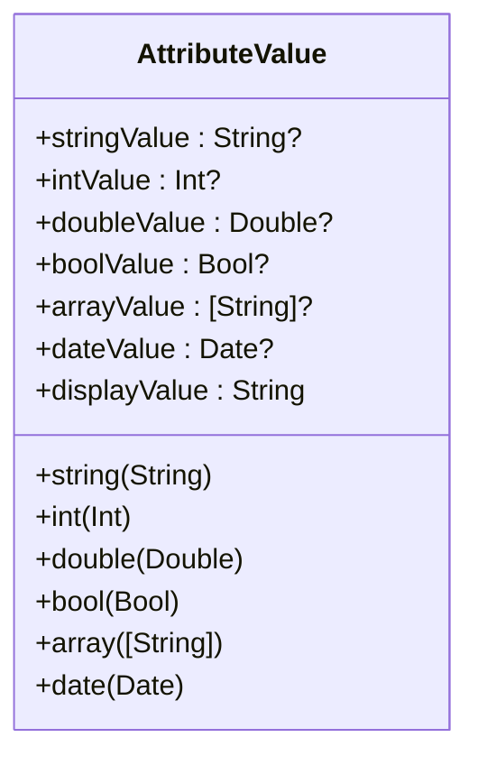
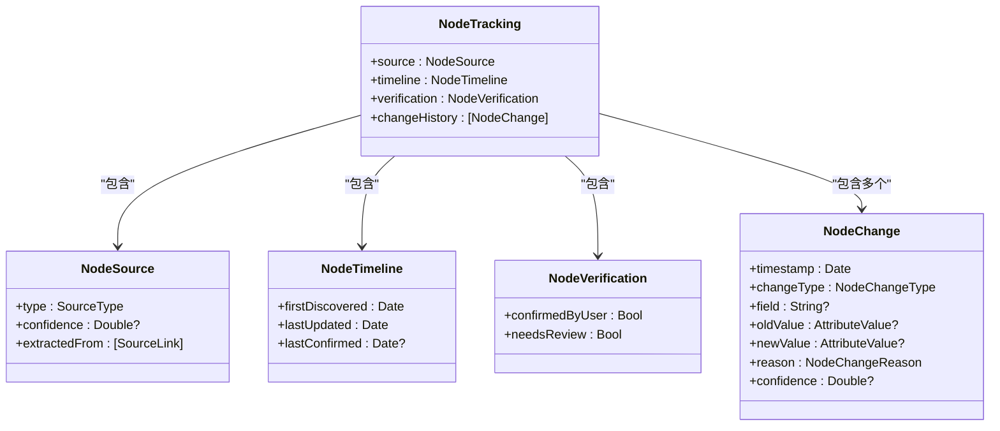
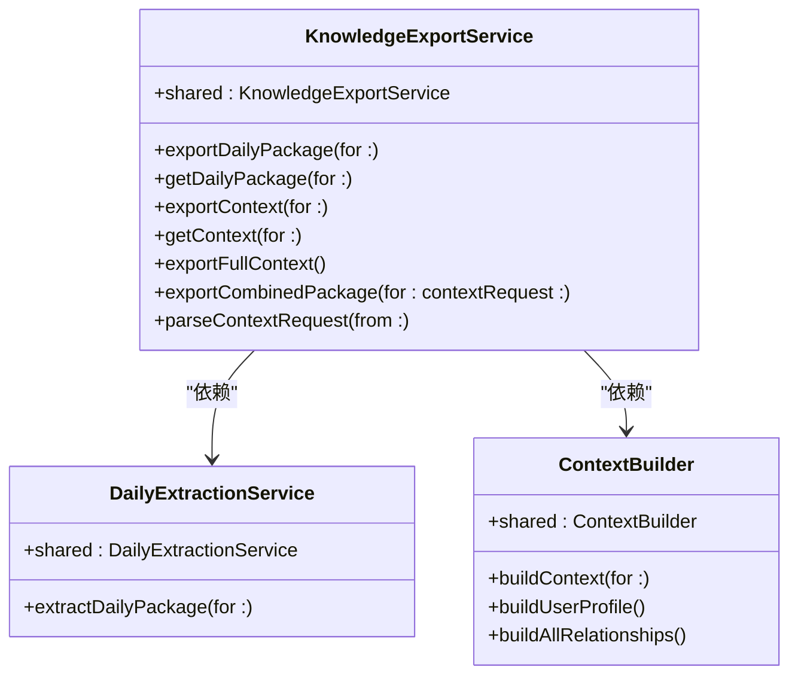
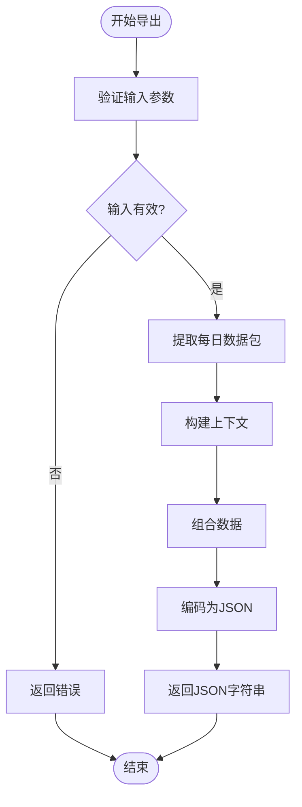
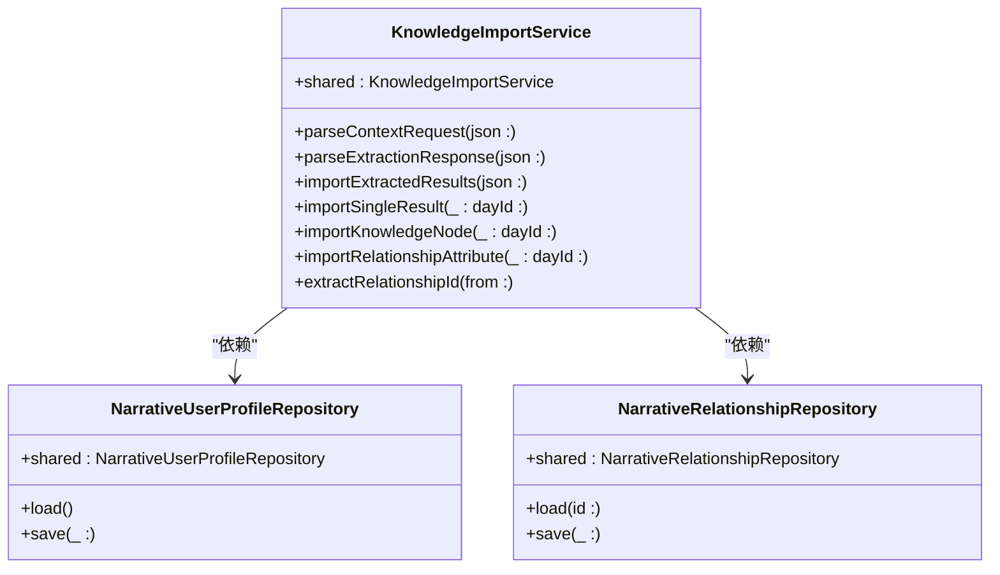
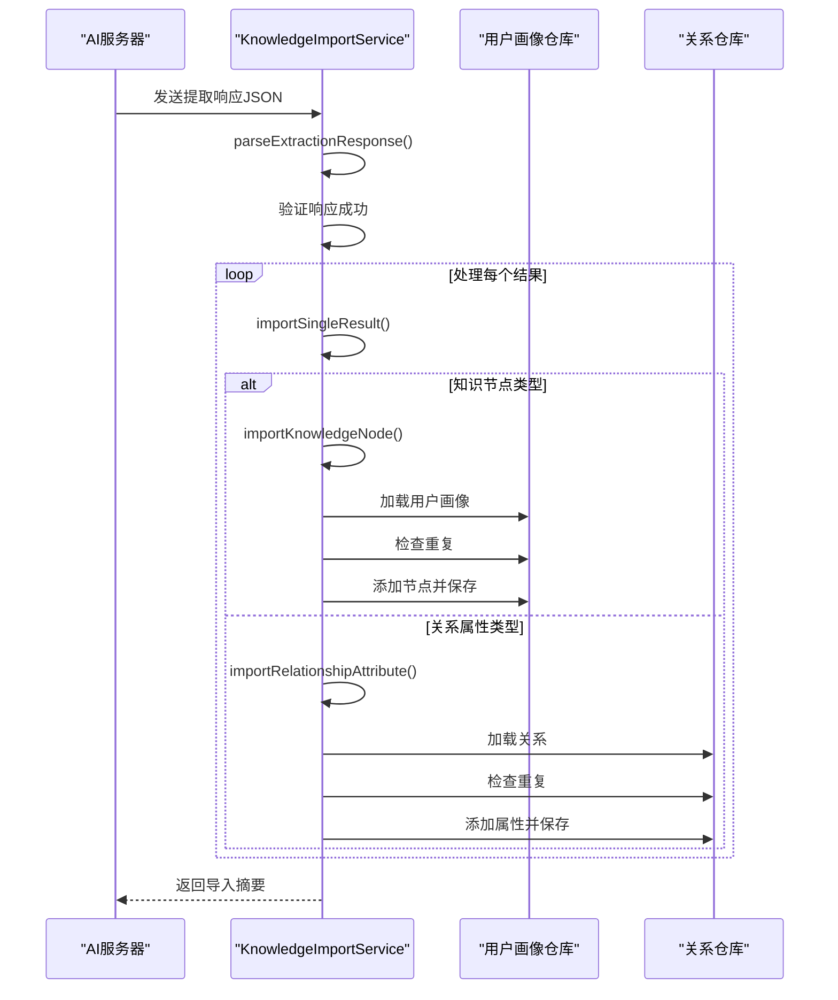
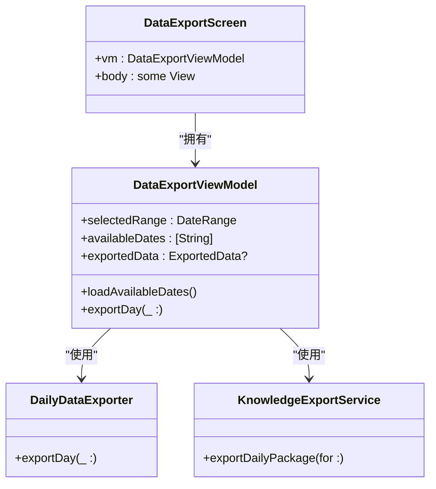
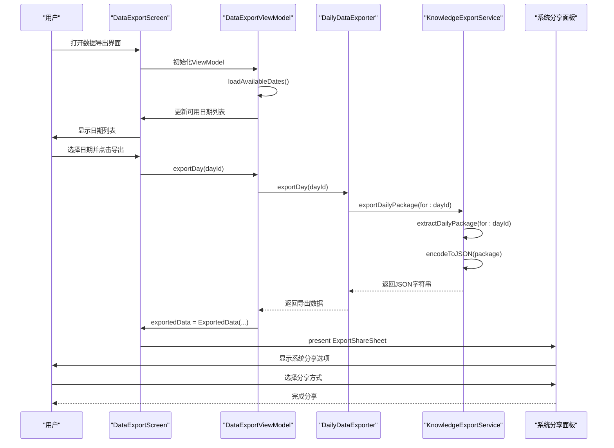
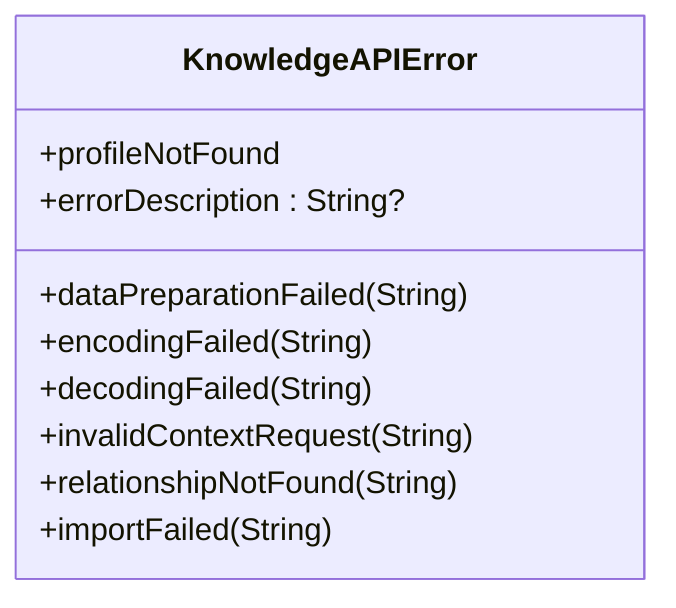
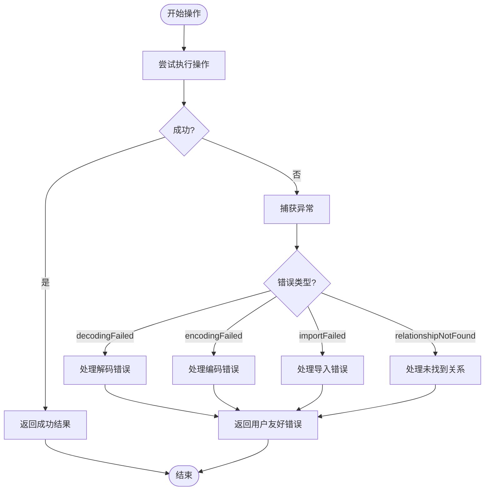

# 知识导入与导出

<cite>
**本文档引用的文件**   
- [KnowledgeExportService.swift](file://guanji0.34/DataLayer/SystemServices/KnowledgeExportService.swift)
- [KnowledgeImportService.swift](file://guanji0.34/DataLayer/SystemServices/KnowledgeImportService.swift)
- [DataExportScreen.swift](file://guanji0.34/Features/Profile/DataExportScreen.swift)
- [DataExportViewModel.swift](file://guanji0.34/Features/Profile/DataExportViewModel.swift)
- [KnowledgeNodeModels.swift](file://guanji0.34/Core/Models/KnowledgeNodeModels.swift)
- [NarrativeRelationshipModels.swift](file://guanji0.34/Core/Models/NarrativeRelationshipModels.swift)
- [KnowledgeAPIModels.swift](file://guanji0.34/Core/Models/KnowledgeAPIModels.swift)
- [DailyDataExporter.swift](file://guanji0.34/Core/Utilities/DailyDataExporter.swift)
- [DailyPackageFormatter.swift](file://guanji0.34/Core/Utilities/DailyPackageFormatter.swift)
- [DATA_FORMAT_STANDARD.md](file://Docs/DATA_FORMAT_STANDARD.md)
- [NarrativeUserProfileRepository.swift](file://guanji0.34/DataLayer/Repositories/NarrativeUserProfileRepository.swift)
- [NarrativeRelationshipRepository.swift](file://guanji0.34/DataLayer/Repositories/NarrativeRelationshipRepository.swift)
- [DailyExtractionService.swift](file://guanji0.34/DataLayer/SystemServices/DailyExtractionService.swift)
- [ContextBuilder.swift](file://guanji0.34/DataLayer/SystemServices/ContextBuilder.swift)
</cite>

## 目录
1. [简介](#简介)
2. [数据格式规范](#数据格式规范)
3. [知识导出服务](#知识导出服务)
4. [知识导入服务](#知识导入服务)
5. [用户操作流程](#用户操作流程)
6. [冲突解决与版本管理](#冲突解决与版本管理)
7. [错误处理与验证](#错误处理与验证)
8. [代码示例](#代码示例)
9. [结论](#结论)

## 简介

知识导入与导出服务是观己应用的核心功能之一，它实现了用户本地知识节点（KnowledgeNode）和关系属性（RelationshipAttribute）等L4层数据的序列化、导出与导入。该系统通过标准JSON格式在本地与AI服务器之间交换数据，支持用户通过系统分享面板导出数据，并安全地将AI分析结果合并到现有用户画像中。

导出服务负责将本地数据序列化为标准格式，而导入服务则解析服务器返回的数据包，验证数据完整性，并根据预定义的规则安全地合并到现有数据结构中。整个流程通过DataExportScreen与后台服务的协作机制实现无缝的用户体验。

**Section sources**
- [KnowledgeExportService.swift](file://guanji0.34/DataLayer/SystemServices/KnowledgeExportService.swift#L1-L141)
- [KnowledgeImportService.swift](file://guanji0.34/DataLayer/SystemServices/KnowledgeImportService.swift#L1-L236)
- [DataExportScreen.swift](file://guanji0.34/Features/Profile/DataExportScreen.swift#L1-L146)

## 数据格式规范

### 日期格式标准

系统统一采用 `yyyy.MM.dd` 格式作为所有日期字段的标准格式，该格式具有以下优势：

- **可读性**: 点号分隔比短横线更清晰
- **排序友好**: 字符串排序等于时间排序
- **国际化**: 年-月-日顺序符合ISO 8601逻辑顺序
- **一致性**: 整个系统使用同一格式

```swift
"2024.12.18"  // ✅ 正确
"2024-12-18"  // ❌ 错误
```

### L4数据模型结构

#### 知识节点（KnowledgeNode）

知识节点是L4层的核心数据结构，用于存储用户画像和关系属性的各种维度信息。其主要组成部分包括：

- **唯一标识**: `id` (String)
- **节点类型**: `nodeType` (String) - 如"skill"、"value"、"goal"等
- **核心内容**: `name` (String), `description` (String?)
- **动态属性**: `attributes` ([String: AttributeValue]) - 支持多种数据类型
- **跟踪信息**: `tracking` (NodeTracking) - 包含来源、置信度、变更历史
- **关系**: `relations` ([NodeRelation]) - 节点间的关系

#### 属性值类型（AttributeValue）

属性值支持多种数据类型，通过枚举实现：



**Diagram sources **
- [KnowledgeNodeModels.swift](file://guanji0.34/Core/Models/KnowledgeNodeModels.swift#L73-L187)

#### 节点跟踪信息（NodeTracking）

包含节点的来源、时间线、验证状态和变更历史：



**Diagram sources **
- [KnowledgeNodeModels.swift](file://guanji0.34/Core/Models/KnowledgeNodeModels.swift#L192-L344)

**Section sources**
- [KnowledgeNodeModels.swift](file://guanji0.34/Core/Models/KnowledgeNodeModels.swift#L9-L707)
- [DATA_FORMAT_STANDARD.md](file://Docs/DATA_FORMAT_STANDARD.md#L1-L174)

## 知识导出服务

### 服务架构

KnowledgeExportService是负责数据导出的单例服务，它通过组合DailyExtractionService和ContextBuilder来构建完整的数据包。



**Diagram sources **
- [KnowledgeExportService.swift](file://guanji0.34/DataLayer/SystemServices/KnowledgeExportService.swift#L7-L141)
- [DailyExtractionService.swift](file://guanji0.34/DataLayer/SystemServices/DailyExtractionService.swift#L6-L262)
- [ContextBuilder.swift](file://guanji0.34/DataLayer/SystemServices/ContextBuilder.swift#L7-L147)

### 导出流程

知识导出服务的主要工作流程如下：



**Diagram sources **
- [KnowledgeExportService.swift](file://guanji0.34/DataLayer/SystemServices/KnowledgeExportService.swift#L21-L82)

### 核心功能

#### 导出每日数据包

`exportDailyPackage(for:)` 方法负责导出指定日期的完整数据包：

1. 调用DailyExtractionService提取每日数据
2. 使用JSONEncoder将数据编码为JSON字符串
3. 设置ISO8601日期编码策略和格式化选项
4. 返回UTF-8编码的JSON字符串

#### 导出上下文信息

`exportContext(for:)` 方法根据服务器的上下文请求构建并导出用户画像和关系数据：

1. 解析ContextRequest中的请求项
2. 根据请求类型构建用户画像或关系数据
3. 返回脱敏后的SanitizedContext对象

#### 组合导出包

`exportCombinedPackage(for:contextRequest:)` 方法创建包含每日数据和上下文信息的组合包，用于AI分析的第二轮请求。

**Section sources**
- [KnowledgeExportService.swift](file://guanji0.34/DataLayer/SystemServices/KnowledgeExportService.swift#L18-L121)
- [DailyExtractionService.swift](file://guanji0.34/DataLayer/SystemServices/DailyExtractionService.swift#L19-L40)
- [ContextBuilder.swift](file://guanji0.34/DataLayer/SystemServices/ContextBuilder.swift#L20-L36)

## 知识导入服务

### 服务架构

KnowledgeImportService负责解析和导入AI服务器返回的分析结果，它通过Repository模式与数据存储层交互。



**Diagram sources **
- [KnowledgeImportService.swift](file://guanji0.34/DataLayer/SystemServices/KnowledgeImportService.swift#L7-L236)
- [NarrativeUserProfileRepository.swift](file://guanji0.34/DataLayer/Repositories/NarrativeUserProfileRepository.swift#L4-L131)
- [NarrativeRelationshipRepository.swift](file://guanji0.34/DataLayer/Repositories/NarrativeRelationshipRepository.swift#L4-L201)

### 导入流程

知识导入服务的处理流程如下：



**Diagram sources **
- [KnowledgeImportService.swift](file://guanji0.34/DataLayer/SystemServices/KnowledgeImportService.swift#L57-L89)

### 核心功能

#### 解析提取响应

`parseExtractionResponse(json:)` 方法将服务器返回的JSON字符串解析为ExtractionResponse对象，包含成功状态、结果列表和错误信息。

#### 导入单个结果

`importSingleResult(_:dayId:)` 方法根据结果类型分发处理：

- **knowledgeNode**: 导入到用户画像
- **relationshipAttribute**: 导入到指定关系
- **profileInsight**: 仅记录信息，不存储
- **custom**: 记录自定义数据

#### 知识节点导入

`importKnowledgeNode(_:dayId:)` 方法处理知识节点的导入：

1. 验证必要字段（nodeType, name）
2. 构建来源链接（SourceLink）
3. 创建KnowledgeNode对象
4. 根据目标（user或关系）决定存储位置
5. 检查重复后添加到相应集合
6. 保存更新后的数据

#### 关系属性导入

`importRelationshipAttribute(_:dayId:)` 方法专门处理关系属性的导入，流程与知识节点类似，但目标是特定关系的attributes数组。

**Section sources**
- [KnowledgeImportService.swift](file://guanji0.34/DataLayer/SystemServices/KnowledgeImportService.swift#L57-L213)
- [NarrativeUserProfileRepository.swift](file://guanji0.34/DataLayer/Repositories/NarrativeUserProfileRepository.swift#L22-L38)
- [NarrativeRelationshipRepository.swift](file://guanji0.34/DataLayer/Repositories/NarrativeRelationshipRepository.swift#L28-L31)

## 用户操作流程

### 系统架构

用户通过DataExportScreen发起导出操作，该操作与后台服务协同工作：



**Diagram sources **
- [DataExportScreen.swift](file://guanji0.34/Features/Profile/DataExportScreen.swift#L5-L146)
- [DataExportViewModel.swift](file://guanji0.34/Features/Profile/DataExportViewModel.swift#L20-L145)
- [DailyDataExporter.swift](file://guanji0.34/Core/Utilities/DailyDataExporter.swift#L4-L305)

### 操作流程

用户通过数据导出界面执行导出操作的完整流程：



**Diagram sources **
- [DataExportScreen.swift](file://guanji0.34/Features/Profile/DataExportScreen.swift#L57-L68)
- [DataExportViewModel.swift](file://guanji0.34/Features/Profile/DataExportViewModel.swift#L57-L66)
- [DailyDataExporter.swift](file://guanji0.34/Core/Utilities/DailyDataExporter.swift#L11-L69)

### 核心组件

#### 数据导出视图（DataExportScreen）

用户界面组件，提供日期选择和导出功能：

- **日期范围选择器**: 允许用户选择最近7天、30天、90天或所有时间
- **可用日期列表**: 显示有数据记录的日期
- **导出按钮**: 每个日期项都有导出按钮
- **分享面板**: 导出后自动弹出系统分享面板

#### 数据导出视图模型（DataExportViewModel）

MVVM模式中的视图模型，负责业务逻辑：

- **状态管理**: 管理选中范围、可用日期、加载状态等
- **数据获取**: 异步加载可用日期列表
- **导出操作**: 调用DailyDataExporter执行导出
- **错误处理**: 管理导出过程中的错误状态

#### 日常数据导出器（DailyDataExporter）

负责将每日数据格式化为可读文本的工具类：

- **多数据源整合**: 从时间轴、AI对话、问题记录等多个仓库获取数据
- **文本格式化**: 将结构化数据转换为格式化的纯文本
- **导出内容**: 包含标题、时间轴、AI对话、问题、心境记录和每日追踪等

**Section sources**
- [DataExportScreen.swift](file://guanji0.34/Features/Profile/DataExportScreen.swift#L5-L146)
- [DataExportViewModel.swift](file://guanji0.34/Features/Profile/DataExportViewModel.swift#L20-L145)
- [DailyDataExporter.swift](file://guanji0.34/Core/Utilities/DailyDataExporter.swift#L4-L305)

## 冲突解决与版本管理

### 冲突解决策略

系统采用严格的冲突检测机制来避免数据重复：

#### 同名节点处理

当导入新节点时，系统会检查是否存在相同类型和名称的节点：

- **用户画像中的知识节点**: 检查`knowledgeNodes`数组中是否存在相同`nodeType`和`name`的节点
- **关系中的属性节点**: 检查`attributes`数组中是否存在相同`nodeType`和`name`的节点

```swift
// 检查用户画像中的重复节点
if !profile.knowledgeNodes.contains(where: { $0.nodeType == nodeType && $0.name == name }) {
    profile.knowledgeNodes.append(node)
    userProfileRepo.save(profile)
}

// 检查关系属性中的重复节点
if !relationship.attributes.contains(where: { $0.nodeType == nodeType && $0.name == name }) {
    relationship.attributes.append(node)
    relationshipRepo.save(relationship)
}
```

#### 置信度管理

系统根据节点来源和用户确认状态管理置信度：

- **用户输入**: 置信度为1.0
- **AI提取**: 初始置信度由服务器提供，通常为0.8
- **需要审查**: 当置信度低于0.8时，标记为需要用户审查
- **置信度衰减**: 未确认的AI节点会随时间衰减置信度（180天周期，最大衰减30%）

### 版本兼容性管理

系统通过以下机制确保版本兼容性：

#### 数据模型版本控制

所有数据模型都遵循Codable协议，支持JSON序列化和反序列化：

- **向前兼容**: 新版本可以读取旧版本数据（通过可选字段）
- **向后兼容**: 旧版本忽略新字段（通过Codable的灵活性）
- **字段验证**: 在反序列化时验证必要字段

#### API错误处理

定义了详细的错误类型，便于客户端处理不同情况：



**Diagram sources **
- [KnowledgeAPIModels.swift](file://guanji0.34/Core/Models/KnowledgeAPIModels.swift#L302-L328)

#### 数据验证

在导入过程中进行多层次验证：

- **JSON解析验证**: 确保输入JSON格式正确
- **必要字段验证**: 检查nodeType、name等必要字段
- **数据完整性验证**: 通过KnowledgeNodeValidator验证节点结构
- **业务逻辑验证**: 检查关系ID是否存在等

**Section sources**
- [KnowledgeImportService.swift](file://guanji0.34/DataLayer/SystemServices/KnowledgeImportService.swift#L140-L145)
- [KnowledgeNodeModels.swift](file://guanji0.34/Core/Models/KnowledgeNodeModels.swift#L666-L706)
- [KnowledgeAPIModels.swift](file://guanji0.34/Core/Models/KnowledgeAPIModels.swift#L302-L328)

## 错误处理与验证

### 错误类型

系统定义了多种错误类型，涵盖导出和导入过程中的各种异常情况：

| 错误类型 | 描述 | 示例 |
|---------|------|------|
| `decodingFailed` | JSON解码失败 | 无效的UTF-8字符串或格式错误 |
| `encodingFailed` | 数据编码失败 | 无法将数据转换为UTF-8字符串 |
| `importFailed` | 导入失败 | 缺少必要字段或数据格式错误 |
| `relationshipNotFound` | 关系不存在 | 指定的关系ID在系统中不存在 |
| `profileNotFound` | 用户画像不存在 | 用户画像文件丢失或损坏 |
| `dataPreparationFailed` | 数据准备失败 | 无法从仓库获取必要数据 |

### 错误处理流程



**Diagram sources **
- [KnowledgeExportService.swift](file://guanji0.34/DataLayer/SystemServices/KnowledgeExportService.swift#L97-L119)
- [KnowledgeImportService.swift](file://guanji0.34/DataLayer/SystemServices/KnowledgeImportService.swift#L29-L49)

### 验证机制

#### 输入验证

在导出和导入过程中对输入数据进行严格验证：

- **日期格式验证**: 确保日期字符串符合`yyyy.MM.dd`格式
- **JSON格式验证**: 检查JSON字符串是否为有效的UTF-8编码
- **必要字段验证**: 确保KnowledgeNode的nodeType和name字段存在

#### 数据完整性验证

使用KnowledgeNodeValidator对节点结构进行验证：

- **ID验证**: 确保id不为空
- **类型验证**: 确保nodeType为非空字符串
- **名称验证**: 确保name为非空字符串
- **置信度验证**: 确保confidence在0.0~1.0范围内
- **时间戳验证**: 确保createdAt不晚于updatedAt

**Section sources**
- [KnowledgeExportService.swift](file://guanji0.34/DataLayer/SystemServices/KnowledgeExportService.swift#L90-L119)
- [KnowledgeImportService.swift](file://guanji0.34/DataLayer/SystemServices/KnowledgeImportService.swift#L22-L49)
- [KnowledgeNodeModels.swift](file://guanji0.34/Core/Models/KnowledgeNodeModels.swift#L666-L706)

## 代码示例

### 导出请求示例

发起知识导出请求的Swift代码示例：

```swift
// 获取今天的日期
let today = DateUtilities.today // "2024.12.18"

// 异步导出每日数据包
Task {
    do {
        let jsonString = try await KnowledgeExportService.shared.exportDailyPackage(for: today)
        // 在这里处理导出的JSON字符串
        print("成功导出数据包: \(jsonString)")
        
        // 可以通过系统分享面板分享
        let activityVC = UIActivityViewController(
            activityItems: [jsonString],
            applicationActivities: nil
        )
        // present activityVC...
        
    } catch {
        // 处理导出错误
        print("导出失败: \(error.localizedDescription)")
    }
}
```

**Section sources**
- [KnowledgeExportService.swift](file://guanji0.34/DataLayer/SystemServices/KnowledgeExportService.swift#L21-L24)

### 导入结果处理示例

处理知识导入结果的Swift代码示例：

```swift
// 假设从服务器获取了AI分析结果的JSON字符串
let jsonResponse = """
{
    "success": true,
    "dayId": "2024.12.18",
    "results": [
        {
            "type": "knowledge_node",
            "target": "user",
            "data": {
                "nodeType": "skill",
                "name": "Swift编程",
                "description": "熟练掌握Swift语言和iOS开发",
                "confidence": 0.85,
                "sourceLinks": [
                    {
                        "sourceType": "diary",
                        "sourceId": "entry_123",
                        "dayId": "2024.12.18",
                        "snippet": "今天学习了Swift的并发特性..."
                    }
                ]
            }
        }
    ]
}
"""

// 导入分析结果
do {
    let importSummary = try KnowledgeImportService.shared.importExtractedResults(json: jsonResponse)
    
    // 处理导入结果
    if importSummary.isSuccess {
        print("导入成功: \(importSummary.description)")
        // 可以刷新UI显示新导入的知识
    } else {
        print("导入完成但有错误: \(importSummary.description)")
        // 处理导入过程中的错误
        for error in importSummary.errors {
            print("错误: \(error)")
        }
    }
    
} catch {
    // 处理导入过程中的异常
    print("导入失败: \(error.localizedDescription)")
}
```

**Section sources**
- [KnowledgeImportService.swift](file://guanji0.34/DataLayer/SystemServices/KnowledgeImportService.swift#L57-L89)
- [KnowledgeAPIModels.swift](file://guanji0.34/Core/Models/KnowledgeAPIModels.swift#L273-L285)

## 结论

知识导入与导出服务为观己应用提供了强大的数据交换能力，实现了本地知识与AI分析之间的无缝连接。通过标准化的JSON格式和清晰的服务接口，系统能够安全、高效地导出L4层数据并导入AI分析结果。

核心优势包括：

1. **结构化数据模型**: KnowledgeNode的灵活设计支持无限扩展的用户画像维度
2. **安全的数据交换**: 通过脱敏处理保护用户隐私，仅传输必要的上下文信息
3. **智能的冲突解决**: 自动检测重复节点，避免数据冗余
4. **完善的错误处理**: 详细的错误类型和验证机制确保数据完整性
5. **流畅的用户体验**: 通过DataExportScreen与系统分享面板的集成，提供直观的操作流程

该服务架构不仅满足了当前的AI知识提取需求，还为未来的功能扩展提供了坚实的基础，如跨设备数据同步、第三方应用集成等。