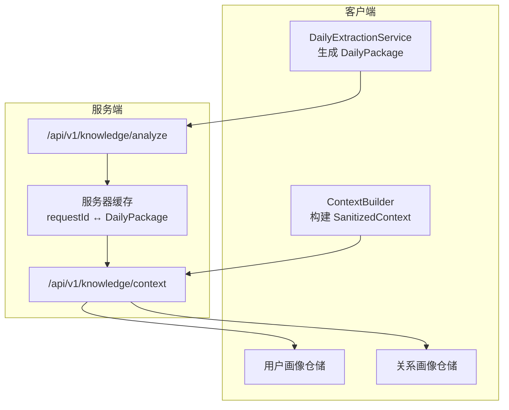
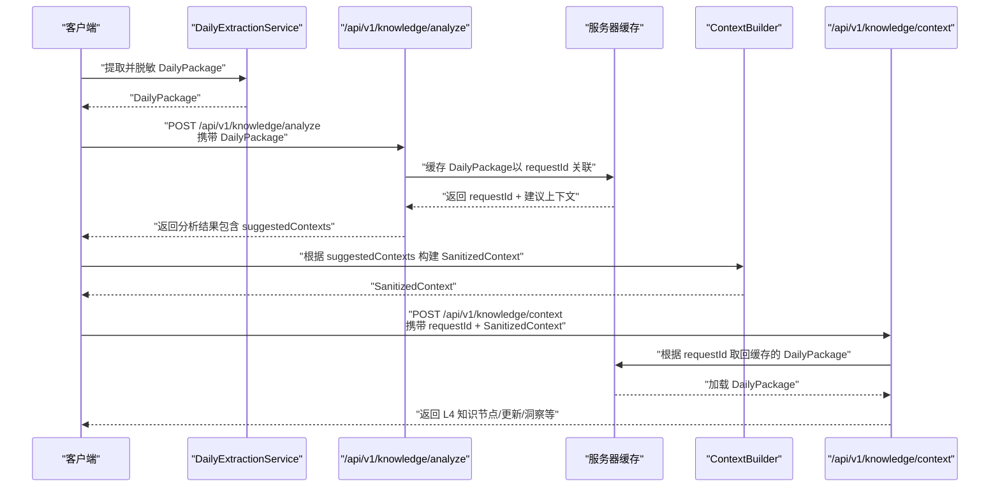
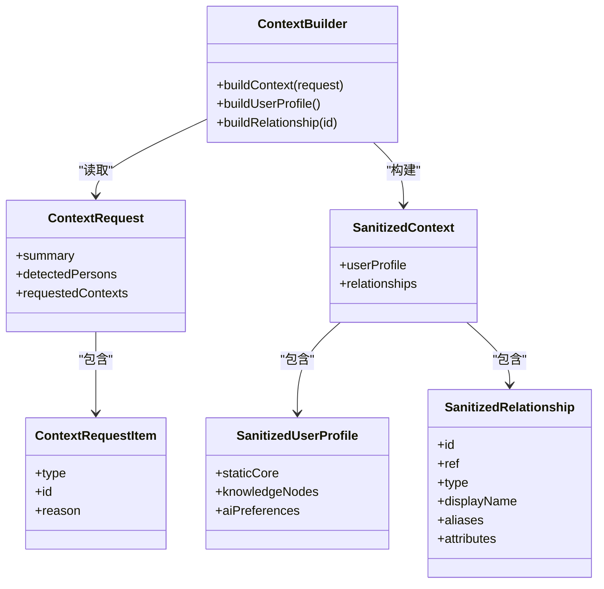
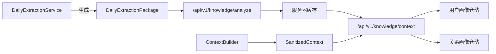

# 知识提取流程

<cite>
**本文引用的文件**
- [API_KNOWLEDGE_EXTRACTION.md](file://Docs/API_KNOWLEDGE_EXTRACTION.md)
- [AI-KNOWLEDGE-EXTRACTION-PLAN.md](file://Docs/architecture/AI-KNOWLEDGE-EXTRACTION-PLAN.md)
- [DailyExtractionService.swift](file://guanji0.34/DataLayer/SystemServices/DailyExtractionService.swift)
- [ContextBuilder.swift](file://guanji0.34/DataLayer/SystemServices/ContextBuilder.swift)
- [KnowledgeAPIModels.swift](file://guanji0.34/Core/Models/KnowledgeAPIModels.swift)
- [DailyExtractionModels.swift](file://guanji0.34/Core/Models/DailyExtractionModels.swift)
- [KnowledgeNodeModels.swift](file://guanji0.34/Core/Models/KnowledgeNodeModels.swift)
- [NarrativeProfileModels.swift](file://guanji0.34/Core/Models/NarrativeProfileModels.swift)
- [NarrativeRelationshipModels.swift](file://guanji0.34/Core/Models/NarrativeRelationshipModels.swift)
- [NarrativeUserProfileRepository.swift](file://guanji0.34/DataLayer/Repositories/NarrativeUserProfileRepository.swift)
- [NarrativeRelationshipRepository.swift](file://guanji0.34/DataLayer/Repositories/NarrativeRelationshipRepository.swift)
</cite>

## 目录
1. [简介](#简介)
2. [项目结构](#项目结构)
3. [核心组件](#核心组件)
4. [架构总览](#架构总览)
5. [详细组件分析](#详细组件分析)
6. [依赖关系分析](#依赖关系分析)
7. [性能考量](#性能考量)
8. [故障排查指南](#故障排查指南)
9. [结论](#结论)
10. [附录](#附录)

## 简介
本文件深入解析“AI知识提取”的两轮交互流程：第一轮由 DailyExtractionService 生成脱敏的 DailyPackage，并调用 /api/v1/knowledge/analyze 获取分析建议；第二轮由 ContextBuilder 根据建议构建上下文数据，并通过 /api/v1/knowledge/context 提交以获取 L4 层知识节点。文档覆盖核心公式、请求/响应格式、认证机制、错误码、服务器缓存策略、客户端动态准备上下文的机制，以及完整的调用时序图与 Swift 代码示例路径。

## 项目结构
围绕知识提取的关键模块包括：
- 数据准备层：DailyExtractionService 负责从 L1 数据抽取并脱敏，形成 DailyPackage
- 上下文准备层：ContextBuilder 基于服务器返回的上下文请求，构建脱敏后的 SanitizedContext
- API 模型层：KnowledgeAPIModels 定义与服务端交互的数据结构
- L4 知识节点层：KnowledgeNodeModels 定义 L4 层节点结构与追踪信息
- 画像模型层：NarrativeProfileModels、NarrativeRelationshipModels 提供用户/关系画像结构
- 仓储层：NarrativeUserProfileRepository、NarrativeRelationshipRepository 提供本地持久化与查询

图表来源
- [DailyExtractionService.swift](file://guanji0.34/DataLayer/SystemServices/DailyExtractionService.swift#L1-L262)
- [ContextBuilder.swift](file://guanji0.34/DataLayer/SystemServices/ContextBuilder.swift#L1-L147)
- [KnowledgeAPIModels.swift](file://guanji0.34/Core/Models/KnowledgeAPIModels.swift#L1-L330)
- [API_KNOWLEDGE_EXTRACTION.md](file://Docs/API_KNOWLEDGE_EXTRACTION.md#L101-L117)

章节来源
- [DailyExtractionService.swift](file://guanji0.34/DataLayer/SystemServices/DailyExtractionService.swift#L1-L262)
- [ContextBuilder.swift](file://guanji0.34/DataLayer/SystemServices/ContextBuilder.swift#L1-L147)
- [KnowledgeAPIModels.swift](file://guanji0.34/Core/Models/KnowledgeAPIModels.swift#L1-L330)
- [API_KNOWLEDGE_EXTRACTION.md](file://Docs/API_KNOWLEDGE_EXTRACTION.md#L101-L117)

## 核心组件
- DailyExtractionService：从 L1 数据（日记、追踪、爱表、AI对话、问题）抽取并脱敏，生成 DailyExtractionPackage
- ContextBuilder：依据服务器的上下文请求，构建 SanitizedContext（用户画像 + 关系画像）
- KnowledgeAPIModels：定义上下文请求/响应、脱敏上下文、提取结果等模型
- KnowledgeNodeModels：L4 层知识节点结构、属性值编码、追踪与变更历史
- 画像模型：NarrativeUserProfile、NarrativeRelationship 提供用户/关系画像结构
- 仓储：用户画像与关系画像的本地持久化与查询

章节来源
- [DailyExtractionModels.swift](file://guanji0.34/Core/Models/DailyExtractionModels.swift#L1-L277)
- [KnowledgeAPIModels.swift](file://guanji0.34/Core/Models/KnowledgeAPIModels.swift#L1-L330)
- [KnowledgeNodeModels.swift](file://guanji0.34/Core/Models/KnowledgeNodeModels.swift#L1-L707)
- [NarrativeProfileModels.swift](file://guanji0.34/Core/Models/NarrativeProfileModels.swift#L1-L186)
- [NarrativeRelationshipModels.swift](file://guanji0.34/Core/Models/NarrativeRelationshipModels.swift#L1-L194)

## 架构总览
两轮交互的核心在于“requestId”关联缓存的 DailyPackage，从而在第二轮仅提交上下文，减少 Token 与带宽消耗。

图表来源
- [API_KNOWLEDGE_EXTRACTION.md](file://Docs/API_KNOWLEDGE_EXTRACTION.md#L70-L117)
- [DailyExtractionService.swift](file://guanji0.34/DataLayer/SystemServices/DailyExtractionService.swift#L19-L40)
- [ContextBuilder.swift](file://guanji0.34/DataLayer/SystemServices/ContextBuilder.swift#L19-L36)
- [KnowledgeAPIModels.swift](file://guanji0.34/Core/Models/KnowledgeAPIModels.swift#L9-L43)

## 详细组件分析

### 第一轮：快速分析（/api/v1/knowledge/analyze）
- 输入：DailyPackage（已脱敏）
- 输出：包含 requestId、摘要、建议上下文维度（suggestedContexts）与潜在节点类型
- 服务器行为：缓存 DailyPackage，以 requestId 关联，供后续第二轮使用

核心公式（第一轮）
- DailyPackage → AI → QuickAnalysis
- QuickAnalysis = { summary, detectedPersons, suggestedContexts, potentialNodes }

请求/响应格式
- 请求体：包含 dayId、extractedAt、data（journalEntries/trackerRecord/loveLogs/aiConversations）、knownRelationships
- 响应体：success、requestId、analysis（summary/detectedPersons/suggestedContexts/potentialNodes）

章节来源
- [API_KNOWLEDGE_EXTRACTION.md](file://Docs/API_KNOWLEDGE_EXTRACTION.md#L101-L162)
- [DailyExtractionModels.swift](file://guanji0.34/Core/Models/DailyExtractionModels.swift#L7-L45)

### 第二轮：提交上下文（/api/v1/knowledge/context）
- 输入：requestId + SanitizedContext（用户画像/关系画像）
- 输出：L4 任意数据（KnowledgeNode、RelationshipAttribute、ProfileInsight 等）
- 服务器行为：根据 requestId 从缓存中取出 DailyPackage，结合上下文进行完整提取

核心公式（第二轮）
- requestId + RequestedContext → AI → L4Data[]
- L4Data = KnowledgeNode | RelationshipAttribute | ProfileInsight | ...

请求/响应格式
- 请求体：requestId + context（userProfile + relationships）
- 响应体：success、requestId、results（userNodes/relationshipUpdates）、metadata

章节来源
- [API_KNOWLEDGE_EXTRACTION.md](file://Docs/API_KNOWLEDGE_EXTRACTION.md#L169-L211)
- [KnowledgeAPIModels.swift](file://guanji0.34/Core/Models/KnowledgeAPIModels.swift#L45-L285)

### 上下文请求与构建（ContextRequest ↔ SanitizedContext）
- 服务器返回的 ContextRequestItem 包含 type（user_profile/relationship）与 id（关系类型时必填）
- 客户端根据 suggestedContexts 调用 ContextBuilder.buildContext 构建 SanitizedContext
- SanitizedContext 仅包含脱敏后的用户画像与关系画像，避免敏感信息泄露

图表来源
- [KnowledgeAPIModels.swift](file://guanji0.34/Core/Models/KnowledgeAPIModels.swift#L9-L43)
- [ContextBuilder.swift](file://guanji0.34/DataLayer/SystemServices/ContextBuilder.swift#L19-L36)
- [KnowledgeAPIModels.swift](file://guanji0.34/Core/Models/KnowledgeAPIModels.swift#L47-L185)

章节来源
- [KnowledgeAPIModels.swift](file://guanji0.34/Core/Models/KnowledgeAPIModels.swift#L9-L43)
- [ContextBuilder.swift](file://guanji0.34/DataLayer/SystemServices/ContextBuilder.swift#L19-L36)
- [KnowledgeAPIModels.swift](file://guanji0.34/Core/Models/KnowledgeAPIModels.swift#L47-L185)

### 客户端动态准备上下文数据
- 根据 suggestedContexts 的类型与 id，ContextBuilder 仅构建必要的脱敏上下文
- 用户画像：构建 SanitizedUserProfile（去除敏感字段，仅保留必要静态信息与已有知识节点摘要）
- 关系画像：构建 SanitizedRelationship（去除真实姓名，保留 ref、类型、别名、属性摘要与事实锚点）

章节来源
- [ContextBuilder.swift](file://guanji0.34/DataLayer/SystemServices/ContextBuilder.swift#L19-L102)
- [KnowledgeAPIModels.swift](file://guanji0.34/Core/Models/KnowledgeAPIModels.swift#L61-L185)

### 服务器缓存策略
- 服务器在第一轮成功后，以 requestId 为键缓存 DailyPackage
- 第二轮请求仅携带 requestId + 上下文，服务器据此恢复原始数据，避免重复传输
- 优势：节省带宽与 Token，提升响应速度

章节来源
- [API_KNOWLEDGE_EXTRACTION.md](file://Docs/API_KNOWLEDGE_EXTRACTION.md#L37-L53)

### 认证机制与错误码
- 认证：Authorization: Bearer {user_token}
- 错误码示例：
  - 400：INVALID_REQUEST（缺少必填字段）
  - 401：UNAUTHORIZED（令牌无效或过期）
  - 429：RATE_LIMIT_EXCEEDED（请求过于频繁）
  - 500：INTERNAL_ERROR（内部错误，附带 requestId）

章节来源
- [API_KNOWLEDGE_EXTRACTION.md](file://Docs/API_KNOWLEDGE_EXTRACTION.md#L113-L117)
- [API_KNOWLEDGE_EXTRACTION.md](file://Docs/API_KNOWLEDGE_EXTRACTION.md#L668-L722)

### 数据结构与 L4 节点
- L4 知识节点：支持多种 nodeType（技能、价值观、目标、性格、恐惧、事实、生活方式、信念、偏好等）
- 属性值：AttributeValue 支持 string/int/double/bool/array/date
- 追踪与变更：NodeTracking、SourceLink、NodeChange 记录来源、置信度、变更历史
- 画像模型：NarrativeUserProfile、NarrativeRelationship 提供用户/关系画像结构

章节来源
- [KnowledgeNodeModels.swift](file://guanji0.34/Core/Models/KnowledgeNodeModels.swift#L1-L707)
- [NarrativeProfileModels.swift](file://guanji0.34/Core/Models/NarrativeProfileModels.swift#L24-L64)
- [NarrativeRelationshipModels.swift](file://guanji0.34/Core/Models/NarrativeRelationshipModels.swift#L6-L69)

### Swift 代码示例路径（从数据包生成到最终结果处理）
- 准备 DailyPackage：DailyExtractionService.extractDailyPackage
- 构建请求体：参考 API 文档中的 Swift 示例（包含 data 与 context）
- 发送请求与解析响应：参考 API 文档中的 Swift 示例（解析 ExtractionResponse）
- 存储结果：将 userNodes 与 relationshipUpdates 写入本地仓储

章节来源
- [DailyExtractionService.swift](file://guanji0.34/DataLayer/SystemServices/DailyExtractionService.swift#L19-L40)
- [API_KNOWLEDGE_EXTRACTION.md](file://Docs/API_KNOWLEDGE_EXTRACTION.md#L768-L840)
- [NarrativeUserProfileRepository.swift](file://guanji0.34/DataLayer/Repositories/NarrativeUserProfileRepository.swift#L22-L38)
- [NarrativeRelationshipRepository.swift](file://guanji0.34/DataLayer/Repositories/NarrativeRelationshipRepository.swift#L39-L56)

## 依赖关系分析
- DailyExtractionService 依赖 TextSanitizer 构建名称映射并统一人物标识，确保数据一致性
- ContextBuilder 依赖用户画像与关系画像仓储，构建脱敏上下文
- API 模型层与服务端接口保持一致，确保序列化/反序列化正确
- L4 节点模型与画像模型相互配合，支撑知识节点的存储与查询

图表来源
- [DailyExtractionService.swift](file://guanji0.34/DataLayer/SystemServices/DailyExtractionService.swift#L10-L22)
- [ContextBuilder.swift](file://guanji0.34/DataLayer/SystemServices/ContextBuilder.swift#L11-L13)
- [API_KNOWLEDGE_EXTRACTION.md](file://Docs/API_KNOWLEDGE_EXTRACTION.md#L101-L117)

章节来源
- [DailyExtractionService.swift](file://guanji0.34/DataLayer/SystemServices/DailyExtractionService.swift#L10-L22)
- [ContextBuilder.swift](file://guanji0.34/DataLayer/SystemServices/ContextBuilder.swift#L11-L13)
- [API_KNOWLEDGE_EXTRACTION.md](file://Docs/API_KNOWLEDGE_EXTRACTION.md#L101-L117)

## 性能考量
- Token 估算：单日数据平均约 1500 tokens（日记 + 追踪 + 上下文），最大可达 5000 tokens（完整数据 + 多个关系）
- 两轮交互显著降低第二轮 Token 与带宽消耗，提升整体吞吐
- 服务器缓存基于 requestId，避免重复解析与传输原始数据

章节来源
- [API_KNOWLEDGE_EXTRACTION.md](file://Docs/API_KNOWLEDGE_EXTRACTION.md#L726-L743)

## 故障排查指南
- 400 INVALID_REQUEST：检查请求体字段完整性（dayId、data、context 等）
- 401 UNAUTHORIZED：确认 Authorization 头中的 Bearer Token 有效
- 429 RATE_LIMIT_EXCEEDED：遵循限流策略，等待 retryAfter 秒后重试
- 500 INTERNAL_ERROR：记录服务端返回的 requestId，便于定位问题

章节来源
- [API_KNOWLEDGE_EXTRACTION.md](file://Docs/API_KNOWLEDGE_EXTRACTION.md#L668-L722)

## 结论
两轮交互流程通过 requestId 关联服务器缓存的 DailyPackage，实现了“先快速定位、再精准补上下文”的高效知识提取。客户端在第一轮获得建议后，仅提交必要的脱敏上下文，大幅降低 Token 与带宽成本；服务端基于统一标识的脱敏数据与上下文，稳定产出 L4 知识节点，支撑用户画像与关系画像的持续扩展。

## 附录
- 数据脱敏策略：统一人物标识符 [REL_ID:displayName]，敏感数字占位符，未知人物标记 [UNKNOWN_PERSON:name]
- 提示词工程参考：实体识别、知识提取、关系分析、置信度评估、溯源标注
- 模型文件索引：核心模型、L1 原始数据模型、服务层文件

章节来源
- [AI-KNOWLEDGE-EXTRACTION-PLAN.md](file://Docs/architecture/AI-KNOWLEDGE-EXTRACTION-PLAN.md#L197-L512)
- [API_KNOWLEDGE_EXTRACTION.md](file://Docs/API_KNOWLEDGE_EXTRACTION.md#L852-L886)
- [API_KNOWLEDGE_EXTRACTION.md](file://Docs/API_KNOWLEDGE_EXTRACTION.md#L1080-L1124)