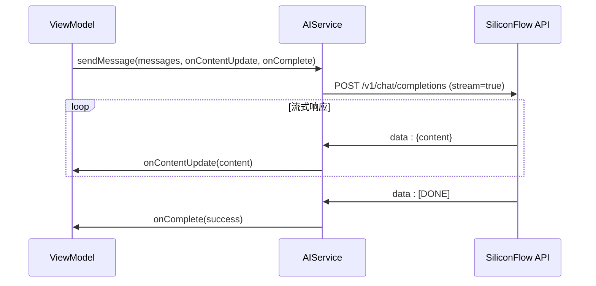
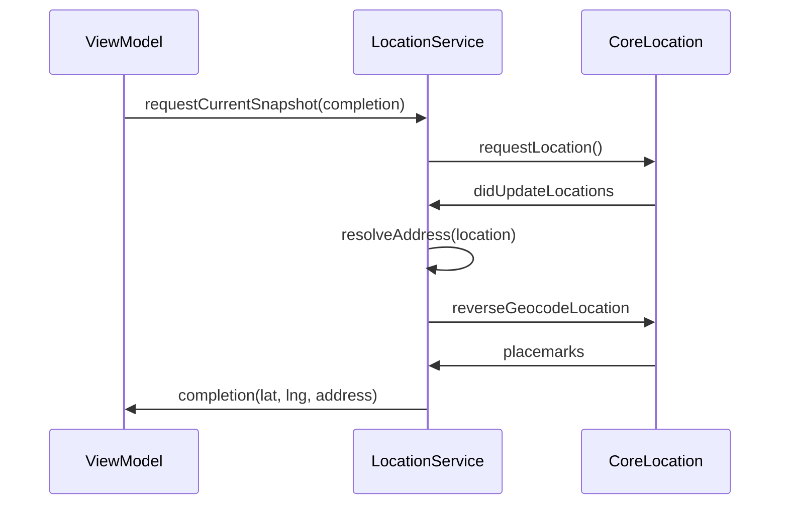
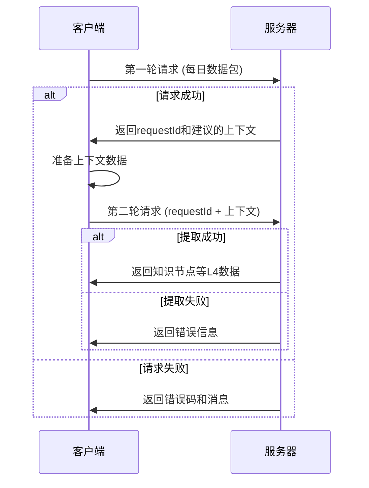
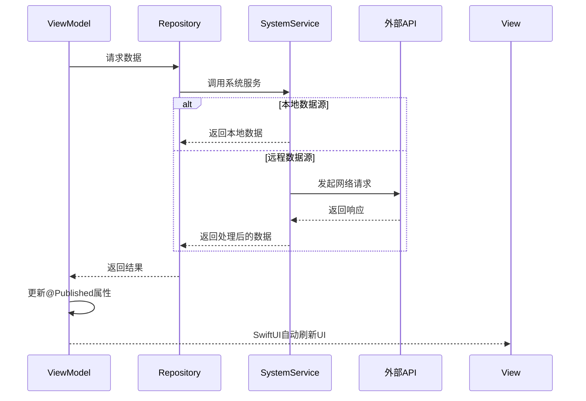

# API与服务集成

<cite>
**本文档引用的文件**  
- [system-architecture.md](file://Docs/architecture/system-architecture.md)
- [data-architecture.md](file://Docs/architecture/data-architecture.md)
- [API_KNOWLEDGE_EXTRACTION.md](file://Docs/API_KNOWLEDGE_EXTRACTION.md)
- [AIService.swift](file://guanji0.34/DataLayer/SystemServices/AIService.swift)
- [LocationService.swift](file://guanji0.34/DataLayer/SystemServices/LocationService.swift)
- [HealthKitService.swift](file://guanji0.34/DataLayer/SystemServices/HealthKitService.swift)
- [WeatherService.swift](file://guanji0.34/DataLayer/SystemServices/WeatherService.swift)
- [DailyExtractionService.swift](file://guanji0.34/DataLayer/SystemServices/DailyExtractionService.swift)
- [KnowledgeExportService.swift](file://guanji0.34/DataLayer/SystemServices/KnowledgeExportService.swift)
- [KnowledgeImportService.swift](file://guanji0.34/DataLayer/SystemServices/KnowledgeImportService.swift)
- [AIConversationModels.swift](file://guanji0.34/Core/Models/AIConversationModels.swift)
- [AIServiceModels.swift](file://guanji0.34/Core/Models/AIServiceModels.swift)
- [LocationModel.swift](file://guanji0.34/Core/Models/LocationModel.swift)
</cite>

## 目录
1. [统一数据访问抽象](#统一数据访问抽象)
2. [SystemService实现](#systemservice实现)
3. [AI知识提取API](#ai知识提取api)
4. [调用序列图](#调用序列图)
5. [错误码说明](#错误码说明)
6. [认证机制](#认证机制)
7. [性能优化建议](#性能优化建议)

## 统一数据访问抽象

观己应用采用Repository模式实现统一的数据访问抽象，有效解耦了业务逻辑与数据源。该模式通过在数据层（Data Layer）中定义Repository组件，为上层业务逻辑提供一致的数据访问接口，屏蔽了底层数据源（如本地文件、系统服务、网络API）的差异。

Repository模式的核心职责包括：
- **数据封装**：将数据访问逻辑集中管理，提供统一的CRUD操作接口
- **缓存管理**：维护内存缓存，减少重复的磁盘或网络访问
- **数据转换**：将底层数据格式转换为上层业务模型
- **事件通知**：通过`NotificationCenter`发布数据变更事件

以`AIConversationRepository`为例，它负责管理AI对话的持久化，使用JSON文件存储在Documents目录下，并维护内存缓存。当数据发生变化时，会通过`gj_ai_conversation_updated`通知事件通知相关组件更新UI。

**Section sources**
- [system-architecture.md](file://Docs/architecture/system-architecture.md#L106-L107)
- [AIConversationRepository.swift](file://guanji0.34/DataLayer/Repositories/AIConversationRepository.swift#L5-L201)

## SystemService实现

### AIService

`AIService`是观己应用中与AI后端通信的核心服务，负责处理与SiliconFlow API的交互。该服务支持流式响应和思考模式，能够与Qwen/QwQ-32B等大模型进行通信。

**核心功能**：
- **流式响应处理**：通过`URLSessionDataDelegate`实现SSE（Server-Sent Events）流式响应处理，实时接收AI生成的内容
- **思考模式支持**：可选择启用`thinking_content`，获取AI的思考过程
- **错误处理与重试**：内置网络错误处理和指数退避重试机制
- **API密钥管理**：从`UserDefaults`读取用户配置的API密钥

服务通过`sendMessage`方法发起流式请求，接收方通过回调函数实时获取内容更新。对于非流式请求，提供`sendMessageSync`方法获取完整响应。



**Diagram sources**
- [AIService.swift](file://guanji0.34/DataLayer/SystemServices/AIService.swift#L5-L384)
- [AIServiceModels.swift](file://guanji0.34/Core/Models/AIServiceModels.swift#L5-L210)

**Section sources**
- [AIService.swift](file://guanji0.34/DataLayer/SystemServices/AIService.swift#L5-L384)

### LocationService

`LocationService`负责获取和解析地理位置信息，基于`CoreLocation`框架实现。该服务提供连续位置更新、地理编码和区域监控功能。

**核心功能**：
- **位置监控**：通过`startMonitoring`方法启动位置更新，支持后台位置更新
- **地理编码**：将经纬度坐标转换为人类可读的地址名称
- **区域监控**：监控地理围栏的进入和退出事件
- **权限管理**：处理位置服务的授权状态变更

服务通过`requestCurrentSnapshot`方法获取当前位置快照，并通过`resolveAddress`方法解析地址。`suggestMappings`方法可根据当前位置查找匹配的用户自定义地点。



**Diagram sources**
- [LocationService.swift](file://guanji0.34/DataLayer/SystemServices/LocationService.swift#L5-L146)
- [LocationModel.swift](file://guanji0.34/Core/Models/LocationModel.swift#L3-L76)

**Section sources**
- [LocationService.swift](file://guanji0.34/DataLayer/SystemServices/LocationService.swift#L5-L146)

### HealthKitService

`HealthKitService`用于读取健康数据，如步数、睡眠等。该服务基于Apple HealthKit框架，提供健康数据访问的统一接口。

**核心功能**：
- **可用性检查**：通过`isAvailable`属性检查HealthKit是否可用
- **权限请求**：通过`requestAuthorization`方法请求健康数据访问权限
- **条件编译**：使用`#if canImport(HealthKit)`确保代码兼容性

服务目前实现了基础框架，但具体健康数据读取功能需根据iOS版本和用户授权情况进行扩展。

**Section sources**
- [HealthKitService.swift](file://guanji0.34/DataLayer/SystemServices/HealthKitService.swift#L1-L25)

### WeatherService

`WeatherService`集成天气信息，基于Apple WeatherKit框架。该服务提供当前天气的获取功能，并包含缓存机制以减少API调用。

**核心功能**：
- **天气获取**：通过`fetchCurrentWeather`方法获取指定坐标的天气信息
- **缓存机制**：对相同位置的请求进行10分钟内的缓存，避免频繁调用
- **并发控制**：防止同一时间发起多个请求
- **降级处理**：在WeatherKit不可用时提供模拟数据

服务返回天气符号名称和温度字符串，供UI组件显示。

**Section sources**
- [WeatherService.swift](file://guanji0.34/DataLayer/SystemServices/WeatherService.swift#L7-L75)

## AI知识提取API

AI知识提取API是观己应用的核心功能，采用两轮交互流程实现高效的知识提取。该流程设计旨在节省带宽和Token消耗，同时确保提取质量。

### 请求格式

API采用JSON格式进行通信，包含以下核心组件：

**第一轮请求（快速分析）**：
```json
{
  "dayId": "2024.12.22",
  "extractedAt": "2024-12-22T10:30:00Z",
  "data": {
    "journalEntries": [...],
    "trackerRecord": {...},
    "loveLogs": [...],
    "aiConversations": [...]
  },
  "knownRelationships": [...]
}
```

**第二轮请求（提交上下文）**：
```json
{
  "requestId": "req_abc123",
  "context": {
    "userProfile": {...},
    "relationships": [...]
  }
}
```

### 响应解析

**第一轮响应**：
```json
{
  "success": true,
  "requestId": "req_abc123",
  "analysis": {
    "summary": "今日概要",
    "detectedPersons": ["[REL_001:妈妈]"],
    "suggestedContexts": [
      { "type": "user_profile", "reason": "检测到技能相关内容" }
    ]
  }
}
```

**第二轮响应**：
```json
{
  "success": true,
  "requestId": "req_abc123",
  "results": [
    {
      "type": "knowledge_node",
      "target": "user",
      "data": { ... }
    }
  ]
}
```

### 错误处理机制

API定义了完善的错误处理机制，包括：

- **网络错误**：处理连接失败、超时等情况
- **认证错误**：处理无效或过期的Token
- **请求错误**：验证请求格式和必填字段
- **服务器错误**：处理内部服务器异常

错误响应包含错误代码、消息和详细信息，便于客户端进行针对性处理。



**Diagram sources**
- [API_KNOWLEDGE_EXTRACTION.md](file://Docs/API_KNOWLEDGE_EXTRACTION.md#L1-L1124)
- [KnowledgeExportService.swift](file://guanji0.34/DataLayer/SystemServices/KnowledgeExportService.swift#L7-L141)
- [KnowledgeImportService.swift](file://guanji0.34/DataLayer/SystemServices/KnowledgeImportService.swift#L7-L236)

**Section sources**
- [API_KNOWLEDGE_EXTRACTION.md](file://Docs/API_KNOWLEDGE_EXTRACTION.md#L1-L1124)

## 调用序列图



**Diagram sources**
- [system-architecture.md](file://Docs/architecture/system-architecture.md#L125-L139)
- [AIService.swift](file://guanji0.34/DataLayer/SystemServices/AIService.swift#L5-L384)

## 错误码说明

| 错误码 | 说明 | 处理建议 |
|--------|------|----------|
| INVALID_REQUEST | 请求格式错误 | 检查必填字段是否缺失 |
| UNAUTHORIZED | 认证失败 | 检查API密钥是否有效 |
| RATE_LIMIT_EXCEEDED | 请求过多 | 等待一段时间后重试 |
| INTERNAL_ERROR | 服务器内部错误 | 记录错误日志，稍后重试 |
| NETWORK_ERROR | 网络连接错误 | 检查网络连接状态 |
| DECODING_ERROR | 响应解码失败 | 检查API响应格式 |

**Section sources**
- [API_KNOWLEDGE_EXTRACTION.md](file://Docs/API_KNOWLEDGE_EXTRACTION.md#L667-L722)
- [AIServiceModels.swift](file://guanji0.34/Core/Models/AIServiceModels.swift#L182-L208)

## 认证机制

系统采用Bearer Token认证机制，通过HTTP头部传递认证信息：

```
Authorization: Bearer {user_token}
```

API密钥存储在`UserDefaults`中，由用户在设置界面配置。服务端验证Token的有效性，无效或过期的Token将返回401错误。

**Section sources**
- [API_KNOWLEDGE_EXTRACTION.md](file://Docs/API_KNOWLEDGE_EXTRACTION.md#L113-L117)
- [AIService.swift](file://guanji0.34/DataLayer/SystemServices/AIService.swift#L187)

## 性能优化建议

1. **数据脱敏**：在发送数据前进行脱敏处理，保护用户隐私
2. **缓存策略**：对频繁访问的数据进行内存和磁盘缓存
3. **批量操作**：合并多个小请求为批量操作，减少网络开销
4. **异步处理**：所有网络请求和文件操作使用异步方式，避免阻塞主线程
5. **资源管理**：及时释放不再使用的资源，避免内存泄漏
6. **错误重试**：实现指数退避重试机制，提高请求成功率

**Section sources**
- [data-architecture.md](file://Docs/architecture/data-architecture.md#L747-L765)
- [AIService.swift](file://guanji0.34/DataLayer/SystemServices/AIService.swift#L326-L382)