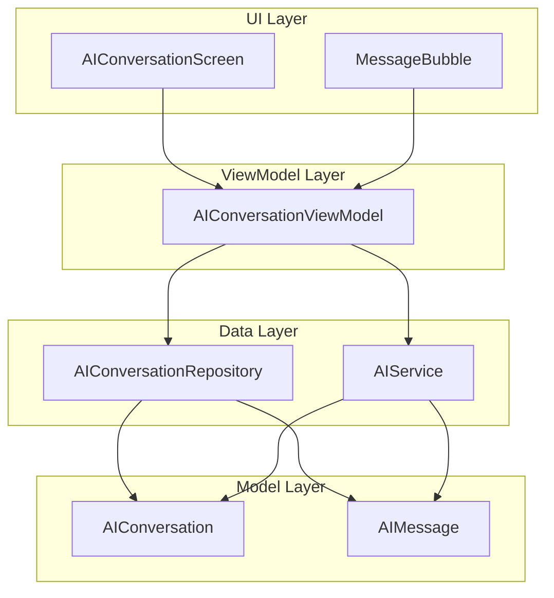
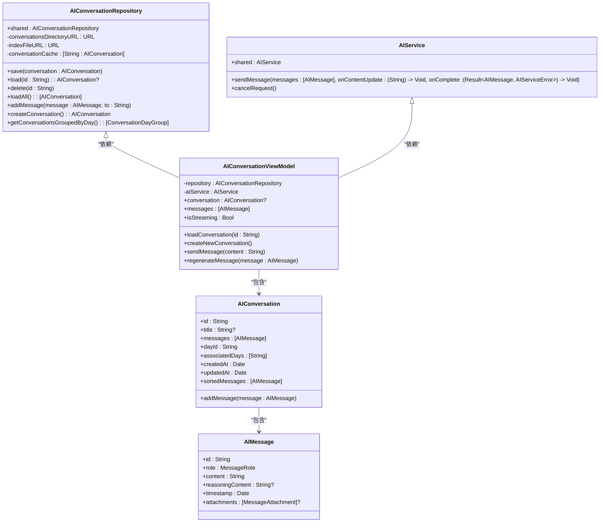
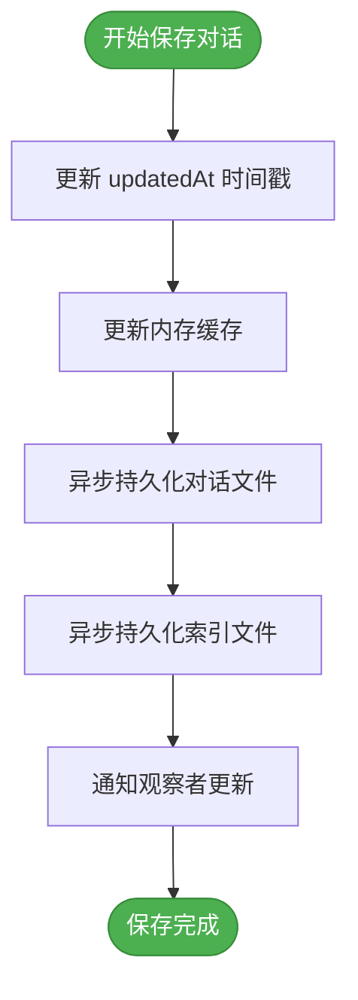
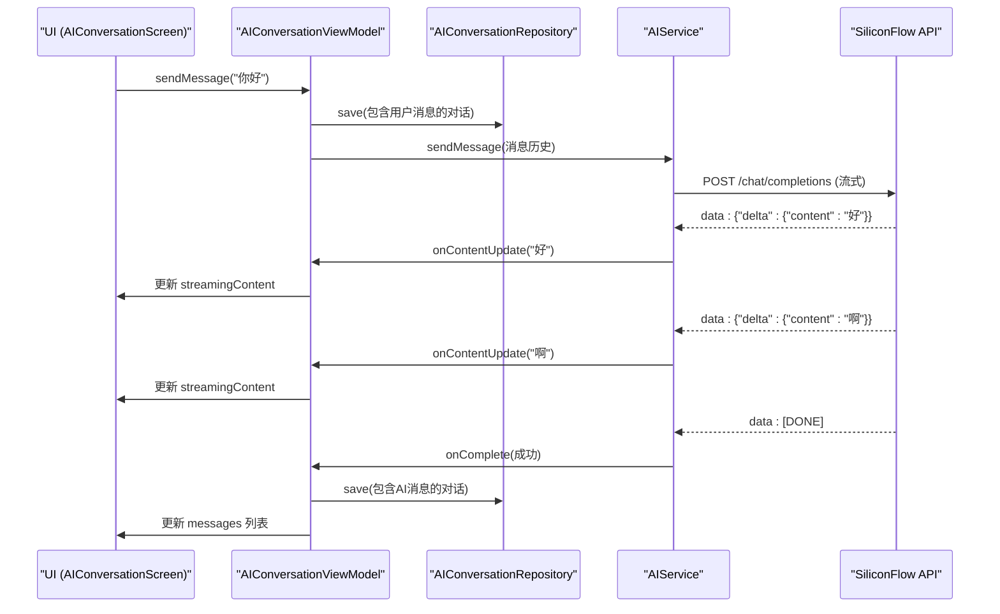
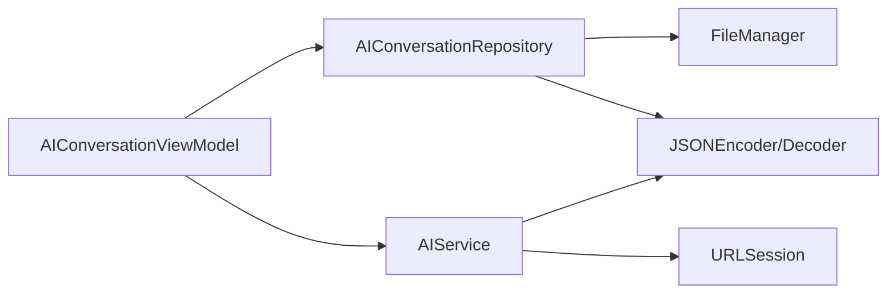

# AI对话仓库

<cite>
**本文档引用的文件**
- [AIConversationRepository.swift](file://guanji0.34/DataLayer/Repositories/AIConversationRepository.swift)
- [AIConversationViewModel.swift](file://guanji0.34/Features/AIConversation/AIConversationViewModel.swift)
- [AIConversationModels.swift](file://guanji0.34/Core/Models/AIConversationModels.swift)
- [AIService.swift](file://guanji0.34/DataLayer/SystemServices/AIService.swift)
- [ContextBuilder.swift](file://guanji0.34/DataLayer/SystemServices/ContextBuilder.swift)
- [DateUtilities.swift](file://guanji0.34/Core/Utilities/DateUtilities.swift)
- [ai-conversation.md](file://Docs/features/ai-conversation.md)
- [repositories.md](file://Docs/api/repositories.md)
</cite>

## 目录
1. [简介](#简介)
2. [项目结构](#项目结构)
3. [核心组件](#核心组件)
4. [架构概述](#架构概述)
5. [详细组件分析](#详细组件分析)
6. [依赖分析](#依赖分析)
7. [性能考虑](#性能考虑)
8. [故障排除指南](#故障排除指南)
9. [结论](#结论)

## 简介
AI对话仓库（AIConversationRepository）是应用程序的核心数据持久化组件，负责管理所有AI对话历史记录的存储与检索。该仓库采用JSON文件存储方案，将对话数据持久化在用户设备的文档目录中，确保数据的安全性和可靠性。仓库通过内存缓存机制优化读写性能，结合后台队列实现非阻塞式数据持久化，为用户提供流畅的AI交互体验。它与AI服务（AIService）和视图模型（AIConversationViewModel）紧密协作，形成完整的AI对话处理闭环，支持流式响应、会话上下文管理、对话分组与历史回顾等高级功能。

## 项目结构
AI对话仓库位于`DataLayer/Repositories`目录下，是数据层的核心组成部分。其设计遵循单一职责原则，专注于对话数据的CRUD操作。仓库与`Core/Models`中的数据模型紧密耦合，并通过`Features/AIConversation`中的视图模型暴露给UI层。整个功能模块采用MVVM架构模式，实现了清晰的关注点分离。

**图源**
- [AIConversationScreen.swift](file://guanji0.34/Features/AIConversation/AIConversationScreen.swift)
- [AIConversationViewModel.swift](file://guanji0.34/Features/AIConversation/AIConversationViewModel.swift)
- [AIConversationRepository.swift](file://guanji0.34/DataLayer/Repositories/AIConversationRepository.swift)
- [AIService.swift](file://guanji0.34/DataLayer/SystemServices/AIService.swift)
- [AIConversationModels.swift](file://guanji0.34/Core/Models/AIConversationModels.swift)

**章节源**
- [AIConversationRepository.swift](file://guanji0.34/DataLayer/Repositories/AIConversationRepository.swift)
- [AIConversationViewModel.swift](file://guanji0.34/Features/AIConversation/AIConversationViewModel.swift)

## 核心组件
AI对话仓库的核心是`AIConversationRepository`类，它是一个单例，通过`shared`静态属性提供全局访问点。仓库内部维护一个内存缓存`conversationCache`，用于存储已加载的对话对象，避免频繁的磁盘I/O操作。所有对话数据以独立的JSON文件形式存储在`Documents/ai_conversations/`目录下，每个对话文件以其ID命名。一个名为`index.json`的索引文件记录了所有存在的对话ID，使得仓库在启动时能够快速加载所有对话的元数据。仓库的公共API提供了保存、加载、删除对话以及添加消息等基本操作，并支持按天分组获取对话的高级查询功能。

**章节源**
- [AIConversationRepository.swift](file://guanji0.34/DataLayer/Repositories/AIConversationRepository.swift#L1-L200)
- [AIConversationModels.swift](file://guanji0.34/Core/Models/AIConversationModels.swift#L86-L156)

## 架构概述
AI对话仓库的架构设计体现了分层与解耦的思想。在数据模型层，`AIConversation`和`AIMessage`结构体定义了对话和消息的数据结构，实现了`Codable`协议以支持JSON序列化。在数据访问层，`AIConversationRepository`封装了所有持久化逻辑，包括文件路径管理、缓存策略和错误处理。在业务逻辑层，`AIConversationViewModel`作为协调者，调用仓库的API来管理对话状态，并与`AIService`交互以获取AI响应。这种分层架构确保了数据访问逻辑与业务逻辑的分离，提高了代码的可维护性和可测试性。

**图源**
- [AIConversationRepository.swift](file://guanji0.34/DataLayer/Repositories/AIConversationRepository.swift)
- [AIConversationViewModel.swift](file://guanji0.34/Features/AIConversation/AIConversationViewModel.swift)
- [AIService.swift](file://guanji0.34/DataLayer/SystemServices/AIService.swift)
- [AIConversationModels.swift](file://guanji0.34/Core/Models/AIConversationModels.swift)

## 详细组件分析

### AIConversationRepository 分析
`AIConversationRepository`是对话数据的持久化中心。其初始化过程会创建必要的文件目录，并从磁盘加载所有对话到内存缓存中。`save`方法在保存对话时，会更新`updatedAt`时间戳，将对话存入缓存，并异步地将其持久化到对应的JSON文件中，同时更新索引文件。`load`方法首先检查内存缓存，如果未命中则从磁盘读取并解码JSON文件。`addMessage`方法体现了仓库的智能性：它不仅将消息添加到对话中，还会根据消息的时间戳自动更新对话的`associatedDays`数组，确保对话能正确地关联到多个日期。

#### 对话持久化流程

**图源**
- [AIConversationRepository.swift](file://guanji0.34/DataLayer/Repositories/AIConversationRepository.swift#L31-L38)

**章节源**
- [AIConversationRepository.swift](file://guanji0.34/DataLayer/Repositories/AIConversationRepository.swift#L1-L200)

### AIConversationViewModel 分析
`AIConversationViewModel`是连接UI与数据层的桥梁。它持有一个`AIConversationRepository`和一个`AIService`的实例。当用户发送消息时，`sendMessage`方法会先创建一个用户消息并立即保存到当前对话中，然后调用`AIService`的`sendMessage`方法发起网络请求。`AIService`通过流式响应（SSE）接收AI的回复，并通过回调函数将部分响应内容实时传递给`AIConversationViewModel`，后者更新`streamingContent`状态，驱动UI实时显示AI正在“思考”和“打字”的过程。当完整响应到达后，`handleStreamingComplete`方法会创建一个AI消息，将其添加到对话中并再次调用`repository.save`进行持久化。

#### AI响应处理序列图

**图源**
- [AIConversationViewModel.swift](file://guanji0.34/Features/AIConversation/AIConversationViewModel.swift#L76-L110)
- [AIService.swift](file://guanji0.34/DataLayer/SystemServices/AIService.swift#L38-L78)

**章节源**
- [AIConversationViewModel.swift](file://guanji0.34/Features/AIConversation/AIConversationViewModel.swift#L1-L227)

## 依赖分析
AI对话仓库的依赖关系清晰且松散。它直接依赖于`FileManager`和`JSONEncoder/Decoder`等系统框架进行文件I/O和序列化。在应用内部，它被`AIConversationViewModel`所依赖，但不直接依赖`AIService`。`AIConversationViewModel`则同时依赖`AIConversationRepository`和`AIService`，扮演着协调者的角色。`AIService`本身依赖于`URLSession`进行网络通信，并使用`JSONDecoder`解析API响应。这种依赖结构避免了循环依赖，确保了模块的独立性。

**图源**
- [AIConversationRepository.swift](file://guanji0.34/DataLayer/Repositories/AIConversationRepository.swift)
- [AIConversationViewModel.swift](file://guanji0.34/Features/AIConversation/AIConversationViewModel.swift)
- [AIService.swift](file://guanji0.34/DataLayer/SystemServices/AIService.swift)

**章节源**
- [AIConversationRepository.swift](file://guanji0.34/DataLayer/Repositories/AIConversationRepository.swift)
- [AIConversationViewModel.swift](file://guanji0.34/Features/AIConversation/AIConversationViewModel.swift)
- [AIService.swift](file://guanji0.34/DataLayer/SystemServices/AIService.swift)

## 性能考虑
AI对话仓库在设计时充分考虑了性能优化。首先，内存缓存机制极大地减少了对磁盘的访问频率，使得频繁的对话加载操作非常迅速。其次，所有持久化操作（`persistConversation`和`persistIndex`）都在后台全局队列中异步执行，避免了阻塞主线程，保证了UI的流畅性。对于大型对话的加载，仓库目前采用全量加载策略，未来可引入分页加载机制以优化内存占用。此外，`getConversationsGroupedByDay`等聚合查询方法在内存中完成，利用了已缓存的数据，避免了多次磁盘读取。

## 故障排除指南
在数据损坏的情况下，AI对话仓库的恢复策略主要依赖于其健壮的错误处理。在`loadFromDisk`和`load`方法中，使用了`try?`来安全地处理JSON解码和文件读取错误。如果某个对话文件损坏，`load`方法会返回`nil`，而`loadFromDisk`会跳过该文件，确保其他完好的对话仍可正常加载。对于索引文件损坏，最坏的情况是需要重新扫描整个目录来重建索引，但由于每个对话文件都独立存在，核心数据不会丢失。开发者可以通过检查控制台日志中的“AI Conversation Persistence Error”来诊断具体的持久化错误。

**章节源**
- [AIConversationRepository.swift](file://guanji0.34/DataLayer/Repositories/AIConversationRepository.swift#L161-L176)
- [AIConversationRepository.swift](file://guanji0.34/DataLayer/Repositories/AIConversationRepository.swift#L183-L185)

## 结论
AI对话仓库是一个设计精良、职责明确的数据持久化组件。它通过JSON文件存储提供了可靠的数据持久化方案，并通过内存缓存和异步I/O优化了性能。其与`AIConversationViewModel`和`AIService`的协作模式清晰，构成了一个高效、响应式的AI对话系统。仓库的扩展性良好，未来可以轻松地集成数据加密、跨设备同步等功能。整体而言，该仓库是应用程序AI功能稳定运行的基石。