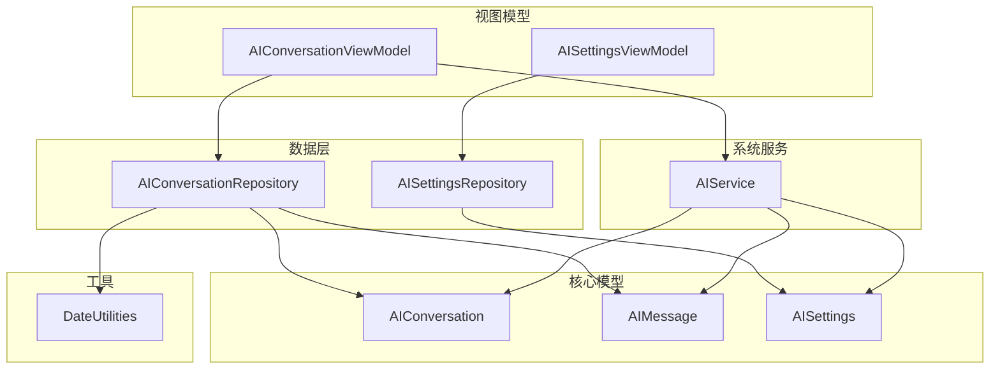
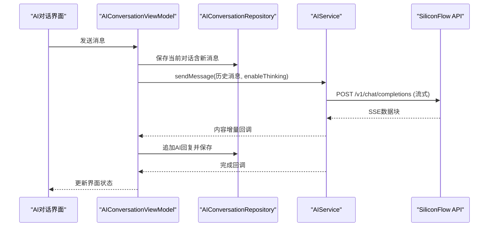
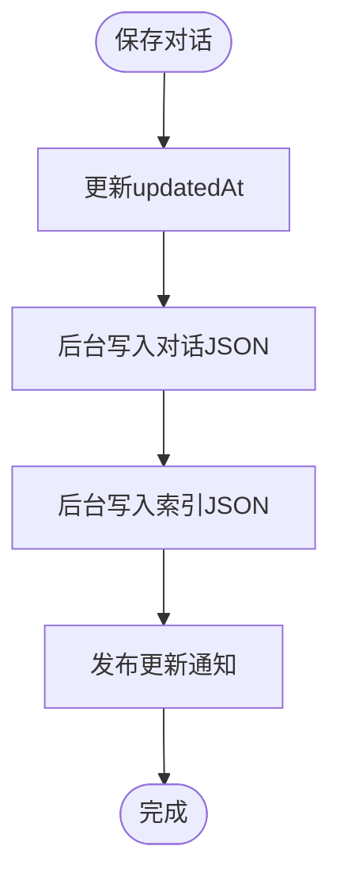
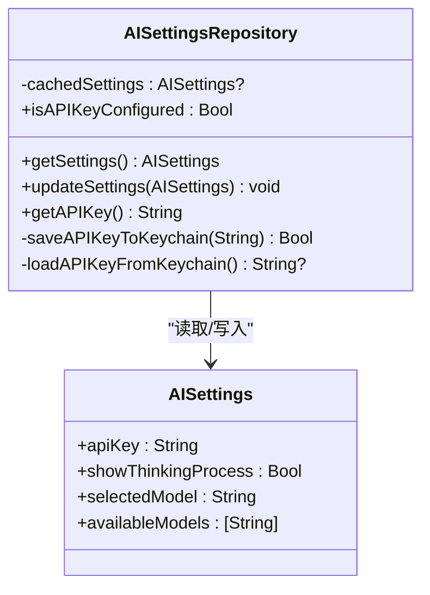
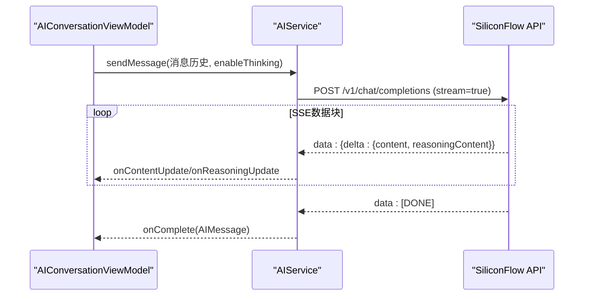
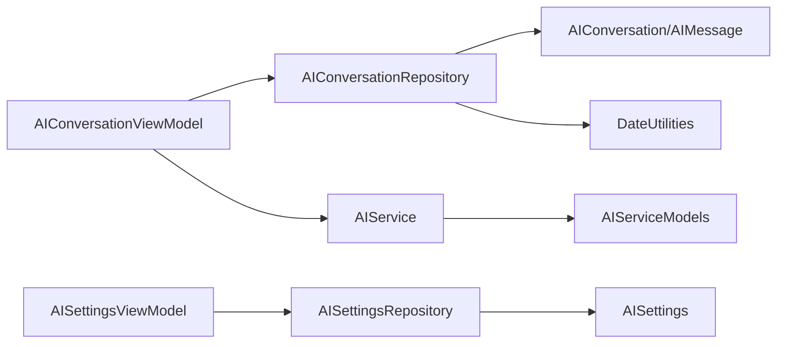

# AI相关数据仓库

<cite>
**本文引用的文件**
- [AIConversationRepository.swift](file://guanji0.34/DataLayer/Repositories/AIConversationRepository.swift)
- [AISettingsRepository.swift](file://guanji0.34/DataLayer/Repositories/AISettingsRepository.swift)
- [AIConversationModels.swift](file://guanji0.34/Core/Models/AIConversationModels.swift)
- [AISettingsModels.swift](file://guanji0.34/Core/Models/AISettingsModels.swift)
- [AIService.swift](file://guanji0.34/DataLayer/SystemServices/AIService.swift)
- [AIServiceModels.swift](file://guanji0.34/Core/Models/AIServiceModels.swift)
- [AIConversationViewModel.swift](file://guanji0.34/Features/AIConversation/AIConversationViewModel.swift)
- [AISettingsViewModel.swift](file://guanji0.34/Features/Profile/AISettingsViewModel.swift)
- [DateUtilities.swift](file://guanji0.34/Core/Utilities/DateUtilities.swift)
- [AIConversationModelsTests.swift](file://Tests/AIConversationModelsTests.swift)
- [AISettingsTests.swift](file://Tests/AISettingsTests.swift)
</cite>

## 目录
1. [简介](#简介)
2. [项目结构](#项目结构)
3. [核心组件](#核心组件)
4. [架构总览](#架构总览)
5. [组件详解](#组件详解)
6. [依赖关系分析](#依赖关系分析)
7. [性能考量](#性能考量)
8. [故障排查指南](#故障排查指南)
9. [结论](#结论)
10. [附录](#附录)

## 简介
本文件系统性梳理并解读本项目的AI相关数据仓库：AIConversationRepository与AISettingsRepository。重点覆盖以下方面：
- AIConversationRepository如何管理AI对话历史记录的持久化，包括消息序列化、会话上下文保存、多日关联与索引管理，以及与AIService的流式响应协作。
- AISettingsRepository如何安全地存储与同步用户AI偏好设置（如模型选择、思考模式开关），并兼容旧版用户偏好。
- JSON文件存储结构、数据加密策略（Keychain）、跨设备同步现状与限制。
- 使用示例：AI对话界面如何通过仓库加载历史记录；设置界面如何读取与更新AI参数。
- 错误恢复机制（如配置重置）、性能优化（如后台异步写入、内存缓存、索引维护）与与AIService的协作关系。

## 项目结构
围绕AI功能的关键目录与文件如下：
- 数据层仓库：AIConversationRepository、AISettingsRepository
- 核心模型：AIConversation、AIMessage、AISettings等
- 系统服务：AIService（负责与SiliconFlow API交互）
- 视图模型：AIConversationViewModel、AISettingsViewModel（UI层协调者）
- 工具类：DateUtilities（日期格式化与“跨日”逻辑）
- 测试：AIConversationModelsTests、AISettingsTests（属性测试与单元测试）

图表来源
- [AIConversationRepository.swift](file://guanji0.34/DataLayer/Repositories/AIConversationRepository.swift#L1-L201)
- [AISettingsRepository.swift](file://guanji0.34/DataLayer/Repositories/AISettingsRepository.swift#L1-L136)
- [AIConversationModels.swift](file://guanji0.34/Core/Models/AIConversationModels.swift#L1-L170)
- [AISettingsModels.swift](file://guanji0.34/Core/Models/AISettingsModels.swift#L1-L98)
- [AIService.swift](file://guanji0.34/DataLayer/SystemServices/AIService.swift#L1-L384)
- [AIConversationViewModel.swift](file://guanji0.34/Features/AIConversation/AIConversationViewModel.swift#L1-L227)
- [AISettingsViewModel.swift](file://guanji0.34/Features/Profile/AISettingsViewModel.swift#L1-L126)
- [DateUtilities.swift](file://guanji0.34/Core/Utilities/DateUtilities.swift#L1-L55)

章节来源
- [AIConversationRepository.swift](file://guanji0.34/DataLayer/Repositories/AIConversationRepository.swift#L1-L201)
- [AISettingsRepository.swift](file://guanji0.34/DataLayer/Repositories/AISettingsRepository.swift#L1-L136)
- [AIConversationModels.swift](file://guanji0.34/Core/Models/AIConversationModels.swift#L1-L170)
- [AISettingsModels.swift](file://guanji0.34/Core/Models/AISettingsModels.swift#L1-L98)
- [AIService.swift](file://guanji0.34/DataLayer/SystemServices/AIService.swift#L1-L384)
- [AIConversationViewModel.swift](file://guanji0.34/Features/AIConversation/AIConversationViewModel.swift#L1-L227)
- [AISettingsViewModel.swift](file://guanji0.34/Features/Profile/AISettingsViewModel.swift#L1-L126)
- [DateUtilities.swift](file://guanji0.34/Core/Utilities/DateUtilities.swift#L1-L55)

## 核心组件
- AIConversationRepository：单例，负责AI对话的增删改查、按日分组、索引维护与后台持久化，采用内存缓存提升访问性能。
- AISettingsRepository：单例，负责AI设置的读取、更新与安全存储（API Key使用Keychain），并与AIService同步。
- AIConversation/AIMessage：对话与消息的数据模型，支持序列化、预览文本生成、标题自动生成、按时间排序等。
- AISettings：用户AI偏好设置模型，包含可用模型列表与默认值。
- AIService：与SiliconFlow API交互，支持流式响应、重试、取消与错误处理。
- DateUtilities：统一日期格式（yyyy.MM.dd）与“跨日”逻辑，用于对话日关联与分组。
- 视图模型：AIConversationViewModel与AISettingsViewModel分别协调UI与仓库/服务交互。

章节来源
- [AIConversationRepository.swift](file://guanji0.34/DataLayer/Repositories/AIConversationRepository.swift#L1-L201)
- [AISettingsRepository.swift](file://guanji0.34/DataLayer/Repositories/AISettingsRepository.swift#L1-L136)
- [AIConversationModels.swift](file://guanji0.34/Core/Models/AIConversationModels.swift#L1-L170)
- [AISettingsModels.swift](file://guanji0.34/Core/Models/AISettingsModels.swift#L1-L98)
- [AIService.swift](file://guanji0.34/DataLayer/SystemServices/AIService.swift#L1-L384)
- [AIConversationViewModel.swift](file://guanji0.34/Features/AIConversation/AIConversationViewModel.swift#L1-L227)
- [AISettingsViewModel.swift](file://guanji0.34/Features/Profile/AISettingsViewModel.swift#L1-L126)
- [DateUtilities.swift](file://guanji0.34/Core/Utilities/DateUtilities.swift#L1-L55)

## 架构总览
AI对话与设置的端到端流程如下：
- 对话界面通过AIConversationViewModel调用AIConversationRepository加载/保存对话，并通过AIService发起请求。
- 设置界面通过AISettingsViewModel调用AISettingsRepository读取/更新设置，并同步给AIService。
- AIService解析SiliconFlow API响应，支持流式增量更新与错误处理。
- 仓库负责数据持久化与一致性维护（索引、缓存、多日关联）。

图表来源
- [AIConversationViewModel.swift](file://guanji0.34/Features/AIConversation/AIConversationViewModel.swift#L76-L110)
- [AIConversationRepository.swift](file://guanji0.34/DataLayer/Repositories/AIConversationRepository.swift#L28-L41)
- [AIService.swift](file://guanji0.34/DataLayer/SystemServices/AIService.swift#L38-L78)

章节来源
- [AIConversationViewModel.swift](file://guanji0.34/Features/AIConversation/AIConversationViewModel.swift#L1-L227)
- [AIConversationRepository.swift](file://guanji0.34/DataLayer/Repositories/AIConversationRepository.swift#L1-L201)
- [AIService.swift](file://guanji0.34/DataLayer/SystemServices/AIService.swift#L1-L384)

## 组件详解

### AIConversationRepository 设计与实现
- 单例与初始化
  - 在Documents目录下创建ai_conversations子目录与index.json索引文件。
  - 启动时从磁盘加载索引与所有对话至内存缓存。
- 公共接口
  - 保存/加载/删除对话；批量加载全部对话并按updatedAt倒序。
  - 添加消息并自动更新关联日期与更新时间。
  - 创建新对话并自动关联当天日期。
  - 按日分组：将多日对话在每一天的分组中均出现，且按updatedAt倒序。
- 持久化策略
  - 对话文件：每个对话一个独立JSON文件（id.json）。
  - 索引文件：index.json保存所有对话ID数组，便于快速重建缓存。
  - 写入策略：使用后台队列进行JSON编码与文件写入，避免阻塞主线程。
- 缓存与通知
  - 内存缓存：以ID为键缓存对话对象，优先从缓存读取。
  - 通知：每次保存/删除后发布通知，触发观察者刷新UI。
- 多日关联与一致性
  - 新消息加入时，若消息时间属于新日期，则自动添加到associatedDays并更新dayId。
  - 分组逻辑确保多日对话在所有关联日期的分组中均可见。

图表来源
- [AIConversationRepository.swift](file://guanji0.34/DataLayer/Repositories/AIConversationRepository.swift#L28-L41)
- [AIConversationRepository.swift](file://guanji0.34/DataLayer/Repositories/AIConversationRepository.swift#L178-L199)

章节来源
- [AIConversationRepository.swift](file://guanji0.34/DataLayer/Repositories/AIConversationRepository.swift#L1-L201)
- [AIConversationModels.swift](file://guanji0.34/Core/Models/AIConversationModels.swift#L86-L156)
- [DateUtilities.swift](file://guanji0.34/Core/Utilities/DateUtilities.swift#L1-L55)

### AISettingsRepository 设计与实现
- 单例与缓存
  - 初始化时从存储加载设置到缓存，后续读取优先返回缓存。
- 存储策略
  - API Key：使用Keychain（Generic Password项）安全存储，避免明文UserDefaults。
  - 其他设置：UserDefaults存储（如是否显示思考过程、选中的模型）。
- 同步机制
  - 更新设置后同步到AIService（设置API Key），并兼容旧版UserPreferencesRepository（思维模式开关）。
- 查询能力
  - isAPIKeyConfigured：检查Keychain中是否存在有效Key。
  - getAPIKey：从Keychain读取API Key（兼容旧键名迁移）。

图表来源
- [AISettingsRepository.swift](file://guanji0.34/DataLayer/Repositories/AISettingsRepository.swift#L1-L136)
- [AISettingsModels.swift](file://guanji0.34/Core/Models/AISettingsModels.swift#L1-L98)

章节来源
- [AISettingsRepository.swift](file://guanji0.34/DataLayer/Repositories/AISettingsRepository.swift#L1-L136)
- [AISettingsModels.swift](file://guanji0.34/Core/Models/AISettingsModels.swift#L1-L98)

### AIService 与流式响应处理
- 请求构建
  - 将AIMessage转换为ChatCompletionRequest，支持启用思考模式（对非QwQ-32B模型生效）。
  - Authorization头使用Bearer Token，超时60秒。
- 流式处理
  - 基于SSE（Server-Sent Events）格式解析数据块，增量累积content与reasoningContent。
  - 支持取消请求与错误回调。
- 同步与重试
  - 提供sendMessageSync（一次性响应）与sendMessageWithRetry（指数退避重试）。
- 错误处理
  - 统一的AIServiceError枚举，包含网络错误、解码错误、API错误、超时、取消等。

图表来源
- [AIService.swift](file://guanji0.34/DataLayer/SystemServices/AIService.swift#L38-L78)
- [AIService.swift](file://guanji0.34/DataLayer/SystemServices/AIService.swift#L262-L321)

章节来源
- [AIService.swift](file://guanji0.34/DataLayer/SystemServices/AIService.swift#L1-L384)
- [AIServiceModels.swift](file://guanji0.34/Core/Models/AIServiceModels.swift#L1-L210)

### 视图模型与仓库协作
- AIConversationViewModel
  - 负责加载/创建对话、发送消息、流式响应处理、错误提示、思维模式切换、对话删除与消息再生。
  - 与AIConversationRepository交互以持久化对话，与AIService交互以获取流式响应。
- AISettingsViewModel
  - 负责加载/保存设置、API Key格式校验、默认值重置、与AISettingsRepository交互。

章节来源
- [AIConversationViewModel.swift](file://guanji0.34/Features/AIConversation/AIConversationViewModel.swift#L1-L227)
- [AISettingsViewModel.swift](file://guanji0.34/Features/Profile/AISettingsViewModel.swift#L1-L126)

## 依赖关系分析
- 低耦合高内聚
  - 仓库仅依赖模型与工具类，不直接依赖UI层。
  - AIService作为系统服务，被视图模型调用，不反向依赖UI。
- 关键依赖链
  - AIConversationViewModel → AIConversationRepository + AIService
  - AISettingsViewModel → AISettingsRepository + AIService
  - AIConversationRepository → AIConversation/AIMessage + DateUtilities
  - AISettingsRepository → AISettings + Keychain
  - AIService → AIServiceModels + AISettings

图表来源
- [AIConversationViewModel.swift](file://guanji0.34/Features/AIConversation/AIConversationViewModel.swift#L1-L227)
- [AISettingsViewModel.swift](file://guanji0.34/Features/Profile/AISettingsViewModel.swift#L1-L126)
- [AIConversationRepository.swift](file://guanji0.34/DataLayer/Repositories/AIConversationRepository.swift#L1-L201)
- [AISettingsRepository.swift](file://guanji0.34/DataLayer/Repositories/AISettingsRepository.swift#L1-L136)
- [AIService.swift](file://guanji0.34/DataLayer/SystemServices/AIService.swift#L1-L384)
- [AIConversationModels.swift](file://guanji0.34/Core/Models/AIConversationModels.swift#L1-L170)
- [AISettingsModels.swift](file://guanji0.34/Core/Models/AISettingsModels.swift#L1-L98)
- [AIServiceModels.swift](file://guanji0.34/Core/Models/AIServiceModels.swift#L1-L210)
- [DateUtilities.swift](file://guanji0.34/Core/Utilities/DateUtilities.swift#L1-L55)

章节来源
- [AIConversationViewModel.swift](file://guanji0.34/Features/AIConversation/AIConversationViewModel.swift#L1-L227)
- [AISettingsViewModel.swift](file://guanji0.34/Features/Profile/AISettingsViewModel.swift#L1-L126)
- [AIConversationRepository.swift](file://guanji0.34/DataLayer/Repositories/AIConversationRepository.swift#L1-L201)
- [AISettingsRepository.swift](file://guanji0.34/DataLayer/Repositories/AISettingsRepository.swift#L1-L136)
- [AIService.swift](file://guanji0.34/DataLayer/SystemServices/AIService.swift#L1-L384)
- [AIConversationModels.swift](file://guanji0.34/Core/Models/AIConversationModels.swift#L1-L170)
- [AISettingsModels.swift](file://guanji0.34/Core/Models/AISettingsModels.swift#L1-L98)
- [AIServiceModels.swift](file://guanji0.34/Core/Models/AIServiceModels.swift#L1-L210)
- [DateUtilities.swift](file://guanji0.34/Core/Utilities/DateUtilities.swift#L1-L55)

## 性能考量
- 后台持久化
  - 仓库在后台队列进行JSON编码与文件写入，避免阻塞主线程。
- 内存缓存
  - 通过字典缓存对话对象，优先从缓存读取，减少磁盘IO。
- 索引维护
  - 通过index.json快速重建缓存，启动时无需逐个扫描文件。
- 流式响应
  - AIService基于SSE增量推送，UI可即时渲染，降低等待感。
- 分组与排序
  - 按日分组与按updatedAt排序在内存中完成，复杂度与缓存大小线性相关。
- 可扩展建议
  - 对话记录分页加载：可引入分页索引或游标，避免一次性加载过多历史。
  - 增量索引更新：在新增/删除对话时只更新index.json的部分段落，减少全量写入。

章节来源
- [AIConversationRepository.swift](file://guanji0.34/DataLayer/Repositories/AIConversationRepository.swift#L178-L199)
- [AIConversationRepository.swift](file://guanji0.34/DataLayer/Repositories/AIConversationRepository.swift#L161-L176)
- [AIService.swift](file://guanji0.34/DataLayer/SystemServices/AIService.swift#L262-L321)

## 故障排查指南
- API Key未配置
  - 症状：AIService不可用或请求失败。
  - 排查：确认AISettingsRepository.isAPIKeyConfigured为true；检查Keychain中是否存在API Key；必要时通过设置界面重新输入并保存。
- 流式响应异常
  - 症状：内容不完整或无回调。
  - 排查：查看AIService日志与状态码；确认enableThinking参数与模型兼容性；检查网络连接与超时设置。
- 对话加载失败
  - 症状：无法打开历史对话。
  - 排查：检查Documents/ai_conversations目录下的对应JSON文件是否存在；确认index.json是否损坏；尝试重启应用触发缓存重建。
- 错误恢复
  - 配置重置：通过设置界面重置默认值；或在仓库层清空Keychain与UserDefaults相关键，使系统回到默认状态。
- 测试验证
  - 使用属性测试与单元测试验证序列化一致性、默认值、安全存储与模型有效性。

章节来源
- [AISettingsRepository.swift](file://guanji0.34/DataLayer/Repositories/AISettingsRepository.swift#L58-L67)
- [AIService.swift](file://guanji0.34/DataLayer/SystemServices/AIService.swift#L181-L209)
- [AIConversationRepository.swift](file://guanji0.34/DataLayer/Repositories/AIConversationRepository.swift#L47-L61)
- [AISettingsTests.swift](file://Tests/AISettingsTests.swift#L120-L151)
- [AIConversationModelsTests.swift](file://Tests/AIConversationModelsTests.swift#L88-L154)

## 结论
本项目通过清晰的分层设计实现了AI对话与设置的可靠持久化与高效交互：
- AIConversationRepository以索引+缓存+后台写入保障了历史记录的快速加载与稳定持久化。
- AISettingsRepository结合Keychain与UserDefaults，既保证了敏感信息的安全，又提供了良好的用户体验。
- AIService与视图模型协同，实现了流畅的流式响应与完善的错误处理。
- 属性测试与单元测试为系统的正确性提供了坚实保障。

## 附录

### JSON文件存储结构
- 目录结构
  - Documents/ai_conversations/
    - index.json：字符串数组，包含所有对话ID。
    - {id}.json：每个对话的完整JSON表示。
- 对话文件字段
  - id、title、messages、dayId、associatedDays、createdAt、updatedAt。
- 设置文件
  - API Key：Keychain（Generic Password）。
  - 其他设置：UserDefaults（布尔与字符串键）。

章节来源
- [AIConversationRepository.swift](file://guanji0.34/DataLayer/Repositories/AIConversationRepository.swift#L8-L24)
- [AISettingsRepository.swift](file://guanji0.34/DataLayer/Repositories/AISettingsRepository.swift#L10-L16)

### 数据加密策略
- API Key：Keychain Generic Password项，访问级别为“解锁后可用”，避免明文存储在UserDefaults中。
- 迁移兼容：Keychain读取失败时回退到旧键名（siliconflow_api_key）以兼容旧版本。

章节来源
- [AISettingsRepository.swift](file://guanji0.34/DataLayer/Repositories/AISettingsRepository.swift#L84-L134)
- [AISettingsModels.swift](file://guanji0.34/Core/Models/AISettingsModels.swift#L35-L97)

### 跨设备同步机制
- 当前实现：仓库未内置跨设备同步逻辑。
- 建议方案：可引入iCloud Drive或云存储服务，将index.json与对话文件上传/下载，并在冲突时合并或保留最新版本。

章节来源
- [AIConversationRepository.swift](file://guanji0.34/DataLayer/Repositories/AIConversationRepository.swift#L1-L201)
- [AISettingsRepository.swift](file://guanji0.34/DataLayer/Repositories/AISettingsRepository.swift#L1-L136)

### 使用示例路径
- AI对话界面加载历史记录
  - 路径：[AIConversationViewModel.swift](file://guanji0.34/Features/AIConversation/AIConversationViewModel.swift#L50-L62)
  - 步骤：调用repository.load(id:)获取对话，更新本地messages并排序。
- 设置界面读取与更新AI参数
  - 路径：[AISettingsViewModel.swift](file://guanji0.34/Features/Profile/AISettingsViewModel.swift#L47-L54)、[AISettingsViewModel.swift](file://guanji0.34/Features/Profile/AISettingsViewModel.swift#L56-L82)
  - 步骤：repository.getSettings()读取；更新后repository.updateSettings()并同步到AIService。

章节来源
- [AIConversationViewModel.swift](file://guanji0.34/Features/AIConversation/AIConversationViewModel.swift#L50-L62)
- [AISettingsViewModel.swift](file://guanji0.34/Features/Profile/AISettingsViewModel.swift#L47-L82)

### 错误恢复与测试
- 错误恢复
  - 配置重置：通过设置界面重置默认值；或清理Keychain与UserDefaults相关键。
- 测试验证
  - 属性测试：验证序列化往返、消息顺序、唯一ID、日关联一致性、分组完整性等。
  - 单元测试：验证设置持久化往返、安全存储、默认值、模型有效性等。

章节来源
- [AIConversationModelsTests.swift](file://Tests/AIConversationModelsTests.swift#L88-L154)
- [AIConversationModelsTests.swift](file://Tests/AIConversationModelsTests.swift#L215-L280)
- [AISettingsTests.swift](file://Tests/AISettingsTests.swift#L69-L118)
- [AISettingsTests.swift](file://Tests/AISettingsTests.swift#L120-L151)