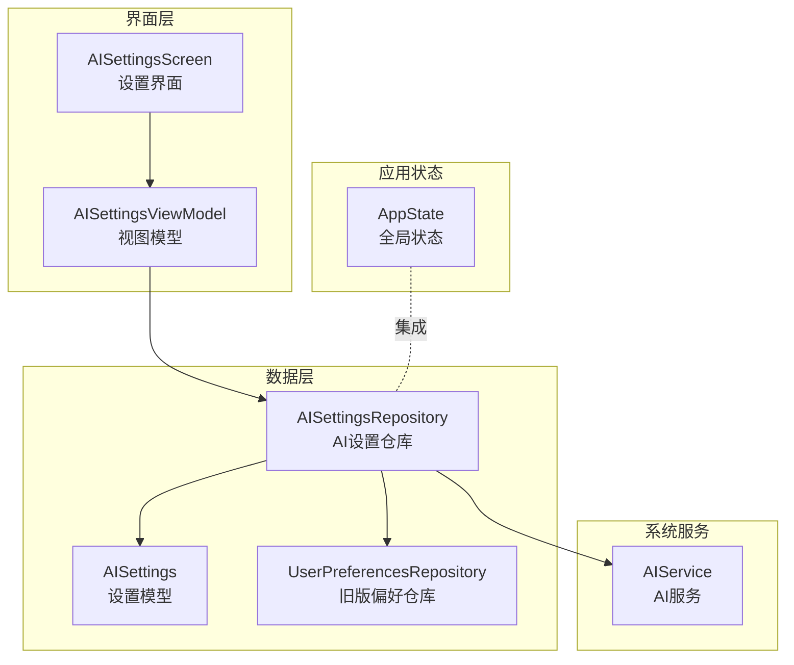
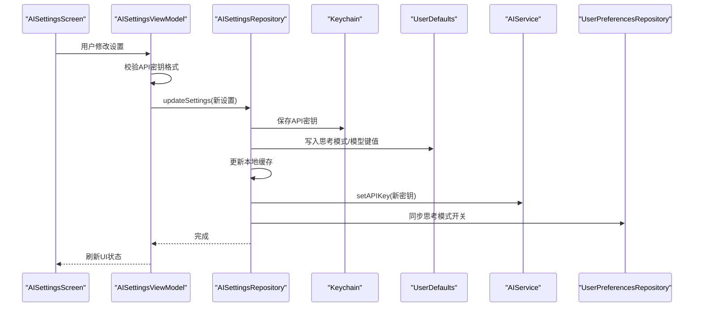
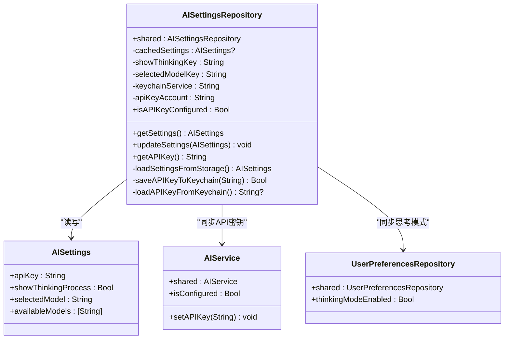
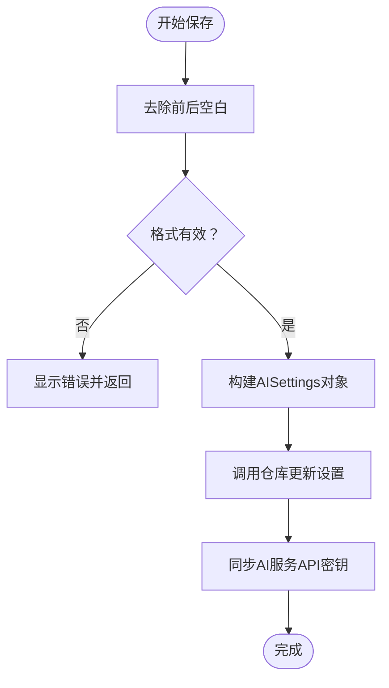
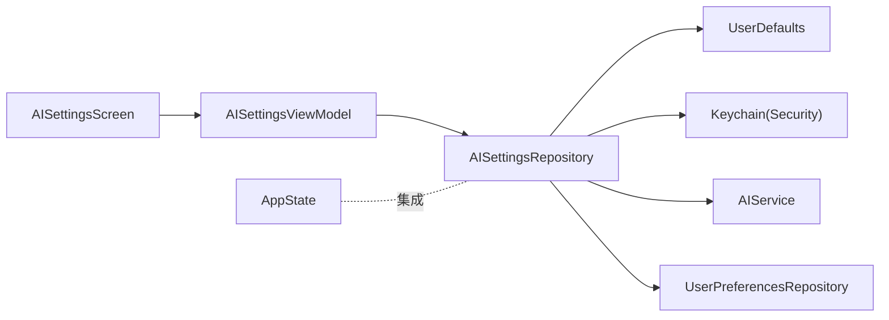

# AI设置仓库

<cite>
**本文引用的文件**
- [AISettingsRepository.swift](file://guanji0.34/DataLayer/Repositories/AISettingsRepository.swift)
- [AISettingsViewModel.swift](file://guanji0.34/Features/Profile/AISettingsViewModel.swift)
- [AISettingsModels.swift](file://guanji0.34/Core/Models/AISettingsModels.swift)
- [AISettingsScreen.swift](file://guanji0.34/Features/Profile/AISettingsScreen.swift)
- [AppState.swift](file://guanji0.34/App/AppState.swift)
- [AIService.swift](file://guanji0.34/DataLayer/SystemServices/AIService.swift)
- [UserPreferencesRepository.swift](file://guanji0.34/DataLayer/Repositories/UserPreferencesRepository.swift)
- [AISettingsTests.swift](file://Tests/AISettingsTests.swift)
- [guanji0_34App.swift](file://guanji0.34/guanji0_34App.swift)
- [ContentView.swift](file://guanji0.34/ContentView.swift)
</cite>

## 目录
1. [简介](#简介)
2. [项目结构](#项目结构)
3. [核心组件](#核心组件)
4. [架构总览](#架构总览)
5. [详细组件分析](#详细组件分析)
6. [依赖关系分析](#依赖关系分析)
7. [性能考量](#性能考量)
8. [故障排查指南](#故障排查指南)
9. [结论](#结论)
10. [附录](#附录)

## 简介
本文件面向开发者与产品团队，系统化阐述“AI设置仓库”（AISettingsRepository）的设计与实现，涵盖以下关键主题：
- 存储与管理模式：如何持久化用户AI偏好（API密钥、思考模式开关、模型选择），以及默认值策略与异常恢复机制
- 数据持久化机制：UserDefaults与Keychain的组合使用、迁移策略与安全存储
- 变更通知与同步：如何将设置变更同步至AI服务与全局状态
- 初始化流程：应用启动时的加载顺序与一致性保障
- 与全局AppState的集成：确保AI设置在整个应用生命周期内保持一致

## 项目结构
围绕AI设置仓库的关键模块分布如下：
- 数据层仓库：AISettingsRepository（负责设置的读写、缓存、Keychain操作）
- 视图模型：AISettingsViewModel（负责UI交互、校验、与仓库交互）
- 屏幕视图：AISettingsScreen（提供设置界面）
- 核心模型：AISettings（定义设置字段与可用模型列表）
- 全局状态：AppState（应用级状态，包含AI模式与思考模式等）
- 系统服务：AIService（与AI服务交互，接收API密钥）
- 兼容仓库：UserPreferencesRepository（兼容旧版设置，用于向后兼容）

图表来源
- [AISettingsScreen.swift](file://guanji0.34/Features/Profile/AISettingsScreen.swift#L1-L91)
- [AISettingsViewModel.swift](file://guanji0.34/Features/Profile/AISettingsViewModel.swift#L1-L126)
- [AISettingsRepository.swift](file://guanji0.34/DataLayer/Repositories/AISettingsRepository.swift#L1-L136)
- [AISettingsModels.swift](file://guanji0.34/Core/Models/AISettingsModels.swift#L1-L98)
- [UserPreferencesRepository.swift](file://guanji0.34/DataLayer/Repositories/UserPreferencesRepository.swift#L1-L70)
- [AIService.swift](file://guanji0.34/DataLayer/SystemServices/AIService.swift#L1-L384)
- [AppState.swift](file://guanji0.34/App/AppState.swift#L1-L52)

章节来源
- [AISettingsRepository.swift](file://guanji0.34/DataLayer/Repositories/AISettingsRepository.swift#L1-L136)
- [AISettingsViewModel.swift](file://guanji0.34/Features/Profile/AISettingsViewModel.swift#L1-L126)
- [AISettingsModels.swift](file://guanji0.34/Core/Models/AISettingsModels.swift#L1-L98)
- [AISettingsScreen.swift](file://guanji0.34/Features/Profile/AISettingsScreen.swift#L1-L91)
- [AppState.swift](file://guanji0.34/App/AppState.swift#L1-L52)
- [AIService.swift](file://guanji0.34/DataLayer/SystemServices/AIService.swift#L1-L384)
- [UserPreferencesRepository.swift](file://guanji0.34/DataLayer/Repositories/UserPreferencesRepository.swift#L1-L70)

## 核心组件
- AISettingsRepository：单例仓库，负责设置的读取、写入、缓存与Keychain安全存储；提供API密钥配置检查与读取能力
- AISettingsViewModel：MVVM中的ViewModel，封装设置的UI状态、校验规则与保存逻辑，并与仓库交互
- AISettings：设置数据模型，包含API密钥、思考模式开关、模型选择字段及可用模型列表
- AISettingsScreen：设置界面，提供API密钥输入、思考模式开关与模型选择
- AIService：AI服务，接收API密钥并发起请求
- UserPreferencesRepository：兼容旧版设置，用于向后兼容
- AppState：应用全局状态，包含AI模式与思考模式等

章节来源
- [AISettingsRepository.swift](file://guanji0.34/DataLayer/Repositories/AISettingsRepository.swift#L1-L136)
- [AISettingsViewModel.swift](file://guanji0.34/Features/Profile/AISettingsViewModel.swift#L1-L126)
- [AISettingsModels.swift](file://guanji0.34/Core/Models/AISettingsModels.swift#L1-L98)
- [AISettingsScreen.swift](file://guanji0.34/Features/Profile/AISettingsScreen.swift#L1-L91)
- [AIService.swift](file://guanji0.34/DataLayer/SystemServices/AIService.swift#L1-L384)
- [UserPreferencesRepository.swift](file://guanji0.34/DataLayer/Repositories/UserPreferencesRepository.swift#L1-L70)
- [AppState.swift](file://guanji0.34/App/AppState.swift#L1-L52)

## 架构总览
AI设置仓库采用“模型-仓库-服务-界面”的分层架构，结合UserDefaults与Keychain实现安全持久化。设置变更通过仓库同步到AI服务与旧版偏好仓库，确保跨模块一致性。

图表来源
- [AISettingsScreen.swift](file://guanji0.34/Features/Profile/AISettingsScreen.swift#L1-L91)
- [AISettingsViewModel.swift](file://guanji0.34/Features/Profile/AISettingsViewModel.swift#L1-L126)
- [AISettingsRepository.swift](file://guanji0.34/DataLayer/Repositories/AISettingsRepository.swift#L1-L136)
- [AIService.swift](file://guanji0.34/DataLayer/SystemServices/AIService.swift#L1-L384)
- [UserPreferencesRepository.swift](file://guanji0.34/DataLayer/Repositories/UserPreferencesRepository.swift#L1-L70)

## 详细组件分析

### AISettingsRepository：AI设置仓库
职责与特性
- 单例设计，懒加载并缓存当前设置
- 使用Keychain安全存储API密钥，使用UserDefaults存储非敏感设置（思考模式、模型选择）
- 提供设置读取、更新、API密钥配置检查与读取方法
- 在更新设置时同步到AI服务与旧版偏好仓库，保证一致性

数据持久化机制
- API密钥：Keychain通用密码项，服务名与账户名固定，访问属性为“解锁后可见”
- 思考模式与模型：UserDefaults字符串/布尔键值
- 迁移策略：从旧版UserDefaults键名读取API密钥（兼容历史版本）

默认值策略
- 思考模式默认开启
- 模型默认选择“Qwen/QwQ-32B”

异常恢复机制
- Keychain读取失败时回退到旧版UserDefaults键名
- 设置加载失败时使用默认值构造AISettings对象

变更同步
- 更新设置后立即调用AI服务设置API密钥
- 同步思考模式到旧版偏好仓库，维持向后兼容

图表来源
- [AISettingsRepository.swift](file://guanji0.34/DataLayer/Repositories/AISettingsRepository.swift#L1-L136)
- [AISettingsModels.swift](file://guanji0.34/Core/Models/AISettingsModels.swift#L1-L98)
- [AIService.swift](file://guanji0.34/DataLayer/SystemServices/AIService.swift#L1-L384)
- [UserPreferencesRepository.swift](file://guanji0.34/DataLayer/Repositories/UserPreferencesRepository.swift#L1-L70)

章节来源
- [AISettingsRepository.swift](file://guanji0.34/DataLayer/Repositories/AISettingsRepository.swift#L1-L136)
- [AISettingsModels.swift](file://guanji0.34/Core/Models/AISettingsModels.swift#L1-L98)

### AISettingsViewModel：AI设置视图模型
职责与特性
- 封装UI状态（API密钥、思考模式、模型、错误提示、保存状态）
- 提供可用模型列表与API密钥格式校验
- 负责从仓库加载设置、保存设置并触发同步

保存流程
- 去除前后空白字符后进行基础格式校验
- 构造AISettings对象并调用仓库更新
- 同步AI服务API密钥

图表来源
- [AISettingsViewModel.swift](file://guanji0.34/Features/Profile/AISettingsViewModel.swift#L1-L126)
- [AISettingsRepository.swift](file://guanji0.34/DataLayer/Repositories/AISettingsRepository.swift#L1-L136)
- [AIService.swift](file://guanji0.34/DataLayer/SystemServices/AIService.swift#L1-L384)

章节来源
- [AISettingsViewModel.swift](file://guanji0.34/Features/Profile/AISettingsViewModel.swift#L1-L126)

### AISettingsScreen：AI设置界面
职责与特性
- 提供API密钥输入（安全文本框）、思考模式开关与模型选择
- 支持错误提示与工具栏按钮（保存/取消）
- 保存时调用ViewModel保存设置并关闭界面

章节来源
- [AISettingsScreen.swift](file://guanji0.34/Features/Profile/AISettingsScreen.swift#L1-L91)

### AISettings模型与可用模型
- 字段：API密钥、思考模式开关、模型名称
- 默认值：API密钥空串、思考模式开启、模型默认“Qwen/QwQ-32B”
- 可用模型：包含多个预设模型，供用户选择

章节来源
- [AISettingsModels.swift](file://guanji0.34/Core/Models/AISettingsModels.swift#L1-L98)

### 全局AppState与AI设置集成
- 应用启动时由ContentView创建AppState并注入环境
- AppState维护AI模式与思考模式等全局状态
- AISettingsRepository在更新设置时同步思考模式到旧版偏好仓库，间接影响全局状态

章节来源
- [AppState.swift](file://guanji0.34/App/AppState.swift#L1-L52)
- [ContentView.swift](file://guanji0.34/ContentView.swift#L1-L19)
- [guanji0_34App.swift](file://guanji0.34/guanji0_34App.swift#L1-L18)

## 依赖关系分析
- AISettingsRepository依赖：
  - Keychain（Security框架）进行API密钥安全存储
  - UserDefaults进行非敏感设置持久化
  - AIService进行API密钥同步
  - UserPreferencesRepository进行向后兼容
- AISettingsViewModel依赖：
  - AISettingsRepository进行设置读写
  - AIService进行API密钥同步
- AISettingsScreen依赖：
  - AISettingsViewModel进行UI交互

图表来源
- [AISettingsViewModel.swift](file://guanji0.34/Features/Profile/AISettingsViewModel.swift#L1-L126)
- [AISettingsRepository.swift](file://guanji0.34/DataLayer/Repositories/AISettingsRepository.swift#L1-L136)
- [AIService.swift](file://guanji0.34/DataLayer/SystemServices/AIService.swift#L1-L384)
- [UserPreferencesRepository.swift](file://guanji0.34/DataLayer/Repositories/UserPreferencesRepository.swift#L1-L70)
- [AISettingsScreen.swift](file://guanji0.34/Features/Profile/AISettingsScreen.swift#L1-L91)
- [AppState.swift](file://guanji0.34/App/AppState.swift#L1-L52)

## 性能考量
- 缓存策略：仓库在初始化时加载一次设置并缓存，后续读取直接返回缓存，减少重复IO
- Keychain操作：仅在更新设置时进行，避免频繁写入
- UserDefaults批量写入：将多个设置键值一次性写入，降低写入开销
- UI线程：ViewModel在主线程处理UI状态，避免阻塞

## 故障排查指南
常见问题与定位建议
- API密钥未生效
  - 检查仓库是否成功写入Keychain
  - 确认AI服务已同步最新API密钥
- 设置未持久化
  - 检查UserDefaults键值是否存在
  - 确认仓库缓存是否被正确更新
- 向后兼容问题
  - 检查旧版UserDefaults键名是否存在
  - 确认UserPreferencesRepository的思考模式同步是否正常

测试覆盖点
- 设置持久化往返测试（含空API密钥与特殊字符）
- API密钥安全存储测试（应存储于Keychain而非UserDefaults）
- 默认值正确性测试
- 模型选择有效性测试
- 仓库单元测试（默认设置、保存/加载、API密钥配置检查）
- ViewModel单元测试（初始化加载、API密钥校验、可用模型、保存、重置默认）

章节来源
- [AISettingsTests.swift](file://Tests/AISettingsTests.swift#L1-L567)

## 结论
AISettingsRepository通过“Keychain+UserDefaults”的组合实现了安全且可靠的AI设置持久化，配合ViewModel与屏幕提供了直观的用户交互体验。其在更新设置时同步到AI服务与旧版偏好仓库，确保了跨模块一致性与向后兼容。测试用例覆盖了关键路径，保障了默认值、安全存储与模型选择的有效性。

## 附录

### 关键流程：应用启动与初始化
- 应用启动：guanji0_34App创建WindowGroup并渲染ContentView
- ContentView创建AppState并注入环境
- AppState在初始化时加载默认模式与思考模式（来自UserPreferencesRepository）
- AISettingsRepository在初始化时加载设置并缓存
- AISettingsViewModel在初始化时从仓库加载设置

章节来源
- [guanji0_34App.swift](file://guanji0.34/guanji0_34App.swift#L1-L18)
- [ContentView.swift](file://guanji0.34/ContentView.swift#L1-L19)
- [AppState.swift](file://guanji0.34/App/AppState.swift#L1-L52)
- [AISettingsRepository.swift](file://guanji0.34/DataLayer/Repositories/AISettingsRepository.swift#L1-L136)
- [AISettingsViewModel.swift](file://guanji0.34/Features/Profile/AISettingsViewModel.swift#L1-L126)