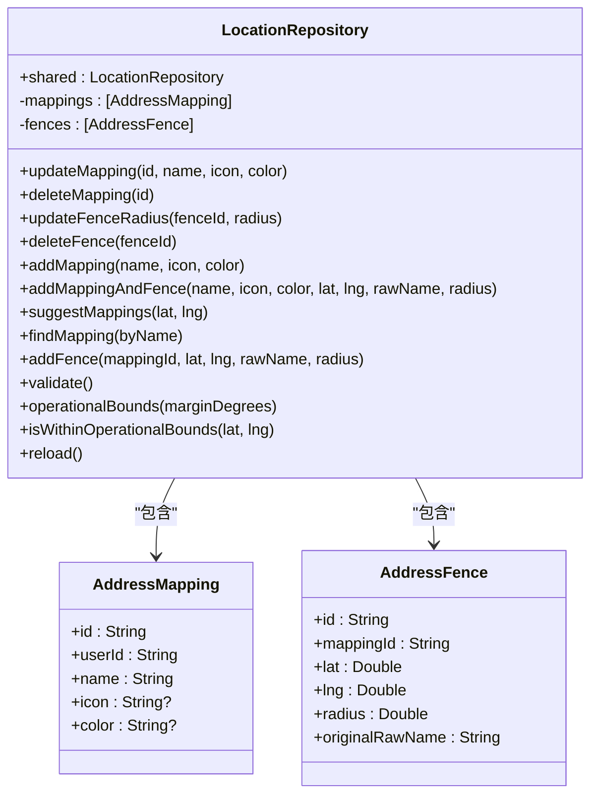
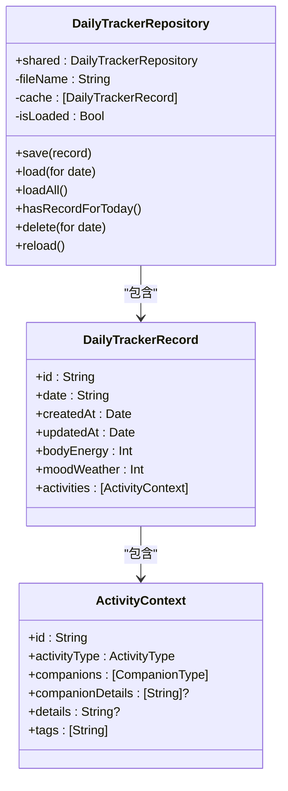
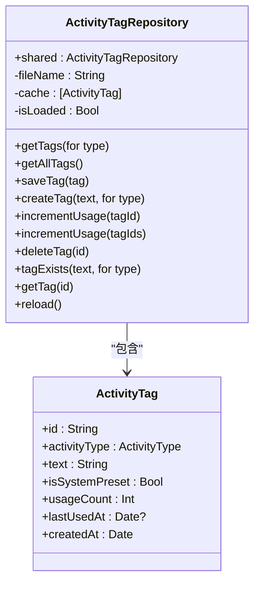
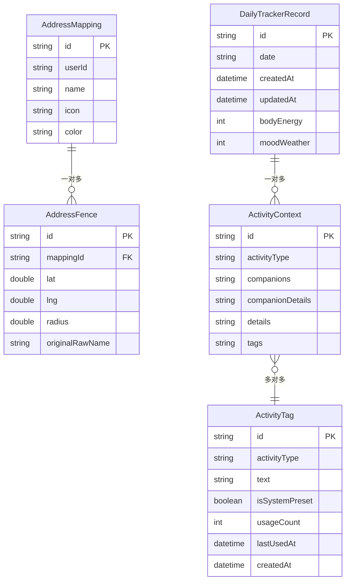
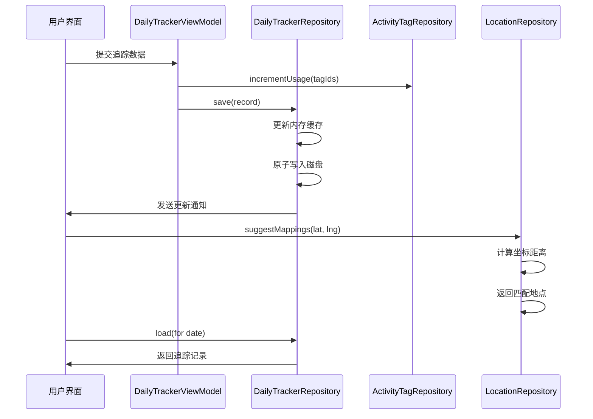
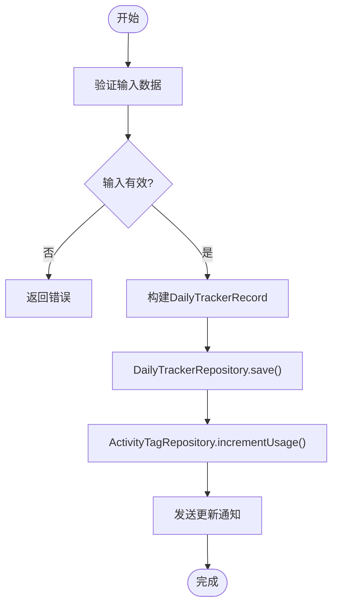
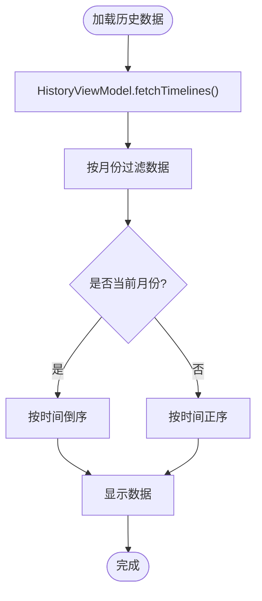
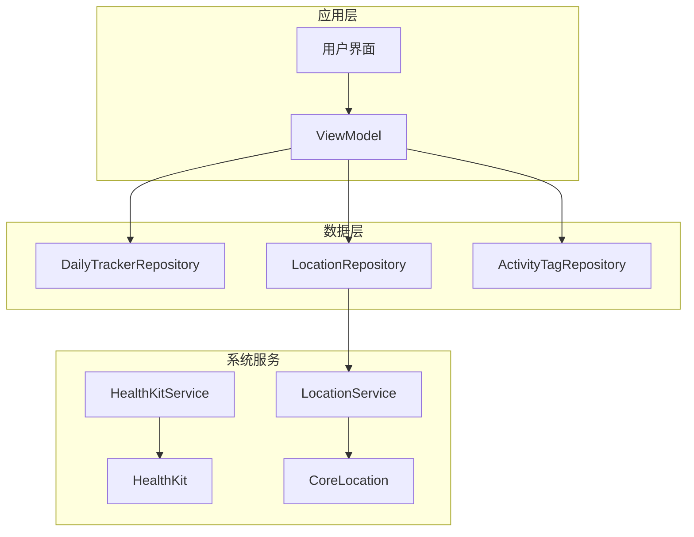

# 位置与追踪数据仓库

<cite>
**本文档引用文件**   
- [LocationRepository.swift](file://guanji0.34/DataLayer/Repositories/LocationRepository.swift)
- [DailyTrackerRepository.swift](file://guanji0.34/DataLayer/Repositories/DailyTrackerRepository.swift)
- [ActivityTagRepository.swift](file://guanji0.34/DataLayer/Repositories/ActivityTagRepository.swift)
- [LocationModel.swift](file://guanji0.34/Core/Models/LocationModel.swift)
- [DailyTrackerModels.swift](file://guanji0.34/Core/Models/DailyTrackerModels.swift)
- [HealthKitService.swift](file://guanji0.34/DataLayer/SystemServices/HealthKitService.swift)
- [LocationService.swift](file://guanji0.34/DataLayer/SystemServices/LocationService.swift)
- [MockDataService.swift](file://guanji0.34/DataLayer/DataSources/MockDataService.swift)
- [DailyTrackerViewModel.swift](file://guanji0.34/Features/DailyTracker/DailyTrackerViewModel.swift)
- [DailyDataExporter.swift](file://guanji0.34/Core/Utilities/DailyDataExporter.swift)
- [DateUtilities.swift](file://guanji0.34/Core/Utilities/DateUtilities.swift)
</cite>

## 目录
1. [位置与追踪数据仓库](#位置与追踪数据仓库)
2. [核心仓库功能概述](#核心仓库功能概述)
3. [LocationRepository 详解](#locationrepository-详解)
4. [DailyTrackerRepository 详解](#dailytrackerrepository-详解)
5. [ActivityTagRepository 详解](#activitytagrepository-详解)
6. [数据结构设计](#数据结构设计)
7. [时间序列存储优化](#时间序列存储优化)
8. [跨仓库关联查询](#跨仓库关联查询)
9. [数据写入与批量处理](#数据写入与批量处理)
10. [历史视图与聚合分析](#历史视图与聚合分析)
11. [数据同步冲突解决](#数据同步冲突解决)
12. [系统服务集成](#系统服务集成)

## 核心仓库功能概述

位置与追踪数据仓库是应用程序的核心数据管理模块，负责处理地理位置、日常健康追踪和活动标签的持久化与查询。该系统由三个主要仓库组成：LocationRepository 管理地理位置标签和地理围栏，DailyTrackerRepository 处理睡眠、运动、饮食等每日健康数据的记录与查询，ActivityTagRepository 维护用户自定义的活动标签体系。这些仓库通过统一的数据模型和优化的存储策略，实现了高效的数据管理和跨维度分析能力。

**本文档引用文件**   
- [LocationRepository.swift](file://guanji0.34/DataLayer/Repositories/LocationRepository.swift)
- [DailyTrackerRepository.swift](file://guanji0.34/DataLayer/Repositories/DailyTrackerRepository.swift)
- [ActivityTagRepository.swift](file://guanji0.34/DataLayer/Repositories/ActivityTagRepository.swift)

## LocationRepository 详解

LocationRepository 负责管理地理位置标签、场所命名和地理围栏数据的持久化。该仓库通过 AddressMapping 和 AddressFence 两个核心数据模型，实现了用户自定义地点与地理坐标的映射关系。仓库支持添加、更新、删除地点映射和地理围栏等 CRUD 操作，并通过 suggestMappings 方法根据坐标建议匹配的地点。

仓库采用多级存储策略，优先从 AddressRepository 文件存储加载数据，若失败则回退到 UserDefaults。数据变更时，仓库会通过 NotificationCenter 发送 "gj_addresses_changed" 通知，确保 UI 组件能够及时更新。此外，仓库还提供了数据验证功能，检查围栏坐标范围、半径有效性以及地点名称重复等问题。

**图示来源**
- [LocationRepository.swift](file://guanji0.34/DataLayer/Repositories/LocationRepository.swift#L3-L169)
- [LocationModel.swift](file://guanji0.34/Core/Models/LocationModel.swift#L3-L18)

**本节来源**
- [LocationRepository.swift](file://guanji0.34/DataLayer/Repositories/LocationRepository.swift#L3-L169)
- [LocationModel.swift](file://guanji0.34/Core/Models/LocationModel.swift#L3-L18)
- [MockDataService.swift](file://guanji0.34/DataLayer/DataSources/MockDataService.swift#L11-L51)

## DailyTrackerRepository 详解

DailyTrackerRepository 负责处理睡眠、运动、饮食等每日健康数据的记录与查询。该仓库以 DailyTrackerRecord 为核心数据模型，存储每日的身体能量、心情天气和活动记录。仓库采用文件存储策略，将数据持久化到 Documents 目录下的 "daily_tracker_records.json" 文件中。

仓库实现了内存缓存机制，通过 isLoaded 标志位控制数据的懒加载。当首次访问数据时，仓库会从磁盘加载所有记录到内存缓存中，后续操作均在内存中进行，最后通过原子写入方式持久化到磁盘。这种设计既保证了数据访问的高效性，又确保了数据存储的可靠性。

**图示来源**
- [DailyTrackerRepository.swift](file://guanji0.34/DataLayer/Repositories/DailyTrackerRepository.swift#L3-L99)
- [DailyTrackerModels.swift](file://guanji0.34/Core/Models/DailyTrackerModels.swift#L74-L133)

**本节来源**
- [DailyTrackerRepository.swift](file://guanji0.34/DataLayer/Repositories/DailyTrackerRepository.swift#L3-L99)
- [DailyTrackerModels.swift](file://guanji0.34/Core/Models/DailyTrackerModels.swift#L74-L133)

## ActivityTagRepository 详解

ActivityTagRepository 负责维护用户自定义的活动标签体系。该仓库通过 ActivityTag 数据模型，支持用户为不同活动类型创建个性化标签。每个标签包含活动类型、文本内容、使用次数、最后使用时间等属性，并按使用频率排序显示。

仓库采用文件存储策略，将数据持久化到 Documents 目录下的 "activity_tags.json" 文件中。与 DailyTrackerRepository 类似，该仓库也实现了内存缓存和懒加载机制。仓库提供了丰富的查询接口，支持按活动类型获取标签、获取所有标签、检查标签是否存在等功能。

**图示来源**
- [ActivityTagRepository.swift](file://guanji0.34/DataLayer/Repositories/ActivityTagRepository.swift#L3-L143)
- [DailyTrackerModels.swift](file://guanji0.34/Core/Models/DailyTrackerModels.swift#L261-L288)

**本节来源**
- [ActivityTagRepository.swift](file://guanji0.34/DataLayer/Repositories/ActivityTagRepository.swift#L3-L143)
- [DailyTrackerModels.swift](file://guanji0.34/Core/Models/DailyTrackerModels.swift#L261-L288)

## 数据结构设计

位置与追踪数据仓库的数据结构设计遵循清晰的层次化原则，通过多个相互关联的数据模型实现复杂的数据管理需求。核心数据模型包括 AddressMapping、AddressFence、DailyTrackerRecord、ActivityContext 和 ActivityTag，这些模型通过标识符进行关联，形成了完整的数据关系网络。

数据模型采用 Codable 协议实现序列化，确保数据能够在内存和磁盘之间高效转换。每个模型都包含必要的属性和初始化方法，同时遵循 Swift 的最佳实践，如使用 let 声明不可变属性，通过 computed properties 提供额外的功能等。

**图示来源**
- [LocationModel.swift](file://guanji0.34/Core/Models/LocationModel.swift#L3-L18)
- [DailyTrackerModels.swift](file://guanji0.34/Core/Models/DailyTrackerModels.swift#L74-L288)

**本节来源**
- [LocationModel.swift](file://guanji0.34/Core/Models/LocationModel.swift#L3-L18)
- [DailyTrackerModels.swift](file://guanji0.34/Core/Models/DailyTrackerModels.swift#L74-L288)

## 时间序列存储优化

位置与追踪数据仓库采用了多种时间序列存储优化策略，以提高数据访问效率和系统性能。对于 DailyTrackerRepository，仓库采用按日分片的存储策略，将每日的追踪记录作为一个独立的实体进行存储。这种设计使得按日期查询数据变得非常高效，避免了全量数据扫描的开销。

仓库还实现了内存缓存机制，通过懒加载策略减少磁盘 I/O 操作。当应用程序启动或首次访问数据时，仓库会将所有记录加载到内存中，后续的读写操作都在内存缓存中进行。只有在数据变更时，才会通过原子写入方式将整个缓存持久化到磁盘，这种批量写入策略显著减少了磁盘操作次数。

此外，仓库利用 JSON 格式进行数据序列化，这种格式既具有良好的可读性，又支持高效的解析和生成。通过将多个记录存储在同一个 JSON 数组中，仓库实现了数据的紧凑存储，减少了文件系统的碎片化。

**本节来源**
- [DailyTrackerRepository.swift](file://guanji0.34/DataLayer/Repositories/DailyTrackerRepository.swift#L7-L99)
- [DailyDataExporter.swift](file://guanji0.34/Core/Utilities/DailyDataExporter.swift#L11-L305)

## 跨仓库关联查询

位置与追踪数据仓库支持跨仓库的关联查询，实现了位置与活动的深度关联分析。通过 LocationRepository 的 suggestMappings 方法，系统可以根据当前坐标建议匹配的地点，然后在 DailyTrackerRepository 中查询该地点相关的活动记录。

这种关联查询能力在历史视图和数据分析功能中得到了广泛应用。例如，系统可以查询用户在"家"这个地点的所有活动记录，分析在不同地点的活动模式差异，或者统计特定活动在不同地点的发生频率。

**图示来源**
- [DailyTrackerViewModel.swift](file://guanji0.34/Features/DailyTracker/DailyTrackerViewModel.swift#L6-L258)
- [DailyTrackerRepository.swift](file://guanji0.34/DataLayer/Repositories/DailyTrackerRepository.swift#L3-L99)
- [ActivityTagRepository.swift](file://guanji0.34/DataLayer/Repositories/ActivityTagRepository.swift#L3-L143)
- [LocationRepository.swift](file://guanji0.34/DataLayer/Repositories/LocationRepository.swift#L3-L169)

**本节来源**
- [DailyTrackerViewModel.swift](file://guanji0.34/Features/DailyTracker/DailyTrackerViewModel.swift#L6-L258)
- [LocationRepository.swift](file://guanji0.34/DataLayer/Repositories/LocationRepository.swift#L106-L126)

## 数据写入与批量处理

位置与追踪数据仓库提供了高效的数据写入和批量处理机制。在追踪界面中，用户可以通过 DailyTrackerViewModel 批量写入数据，系统会自动处理相关的标签使用统计和数据持久化。

DailyTrackerViewModel 的 save 方法实现了完整的数据写入流程：首先调用 finalize 方法构建 DailyTrackerRecord 对象，然后通过 DailyTrackerRepository 的 save 方法持久化记录，最后调用 ActivityTagRepository 的 incrementUsage 方法更新相关标签的使用次数。这种批量处理设计确保了数据的一致性和完整性。

**图示来源**
- [DailyTrackerViewModel.swift](file://guanji0.34/Features/DailyTracker/DailyTrackerViewModel.swift#L211-L249)
- [DailyTrackerRepository.swift](file://guanji0.34/DataLayer/Repositories/DailyTrackerRepository.swift#L21-L33)
- [ActivityTagRepository.swift](file://guanji0.34/DataLayer/Repositories/ActivityTagRepository.swift#L61-L84)

**本节来源**
- [DailyTrackerViewModel.swift](file://guanji0.34/Features/DailyTracker/DailyTrackerViewModel.swift#L211-L249)

## 历史视图与聚合分析

位置与追踪数据仓库支持复杂的历史视图和聚合分析功能。通过 HistoryViewModel，系统可以按月加载和显示历史数据，并根据当前月份自动调整排序方式：当前月份按时间倒序显示，过去月份按时间正序显示。

DailyDataExporter 组件提供了全面的数据导出功能，能够将特定日期的所有数据（包括时间轴、AI对话、问题记录、心境记录和每日追踪）导出为结构化的纯文本。这种设计不仅方便用户备份和分享数据，也为后续的数据分析提供了基础。

**图示来源**
- [HistoryViewModel.swift](file://guanji0.34/Features/History/HistoryViewModel.swift#L4-L82)
- [DailyDataExporter.swift](file://guanji0.34/Core/Utilities/DailyDataExporter.swift#L11-L305)

**本节来源**
- [HistoryViewModel.swift](file://guanji0.34/Features/History/HistoryViewModel.swift#L4-L82)
- [DailyDataExporter.swift](file://guanji0.34/Core/Utilities/DailyDataExporter.swift#L11-L305)

## 数据同步冲突解决

位置与追踪数据仓库目前主要采用本地存储策略，数据同步冲突解决机制相对简单。由于所有数据操作都在单一线程中进行，并且通过内存缓存和原子写入保证了数据一致性，因此避免了常见的并发冲突问题。

对于数据加载过程中的异常情况，仓库采用了优雅的降级策略：如果从磁盘加载数据失败，仓库会使用空数组作为默认值，确保系统能够继续运行。这种设计虽然牺牲了部分数据可靠性，但提高了系统的健壮性和用户体验。

未来如果引入云同步功能，可能需要实现更复杂的冲突解决策略，如基于时间戳的最后写入获胜、基于版本号的向量时钟，或者提供手动冲突解决界面等。

**本节来源**
- [DailyTrackerRepository.swift](file://guanji0.34/DataLayer/Repositories/DailyTrackerRepository.swift#L77-L84)
- [ActivityTagRepository.swift](file://guanji0.34/DataLayer/Repositories/ActivityTagRepository.swift#L122-L128)

## 系统服务集成

位置与追踪数据仓库与多个系统服务紧密集成，实现了丰富的功能扩展。LocationService 与 LocationRepository 协同工作，通过 CoreLocation 框架获取设备位置，并利用地理围栏技术实现基于位置的场景识别。

HealthKitService 提供了与苹果健康框架的集成能力，虽然当前实现较为基础，但为未来同步健康数据（如步数、心率、睡眠质量等）奠定了基础。这种集成模式遵循了依赖倒置原则，通过定义清晰的接口边界，使得系统服务的替换和测试变得更加容易。

**图示来源**
- [LocationService.swift](file://guanji0.34/DataLayer/SystemServices/LocationService.swift#L5-L146)
- [HealthKitService.swift](file://guanji0.34/DataLayer/SystemServices/HealthKitService.swift#L4-L25)
- [LocationRepository.swift](file://guanji0.34/DataLayer/Repositories/LocationRepository.swift#L3-L169)

**本节来源**
- [LocationService.swift](file://guanji0.34/DataLayer/SystemServices/LocationService.swift#L5-L146)
- [HealthKitService.swift](file://guanji0.34/DataLayer/SystemServices/HealthKitService.swift#L4-L25)