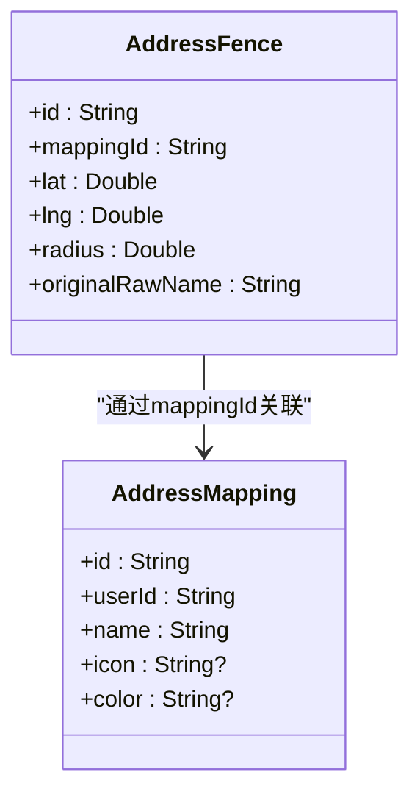
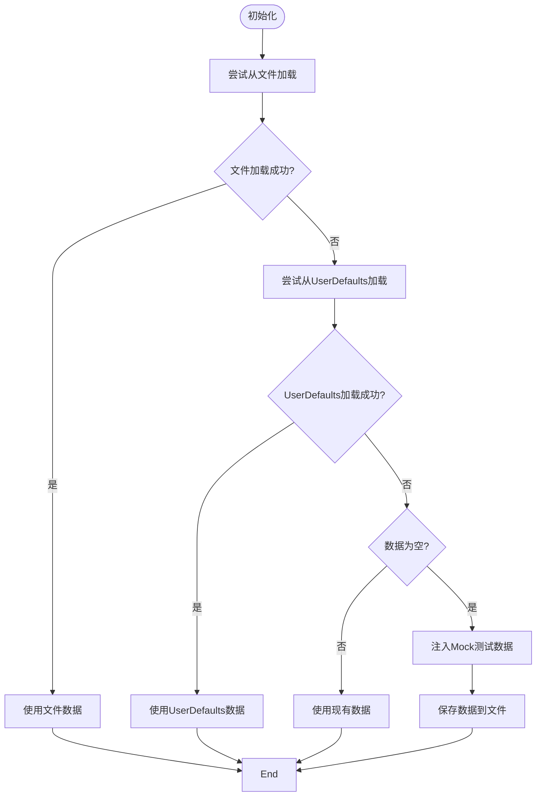
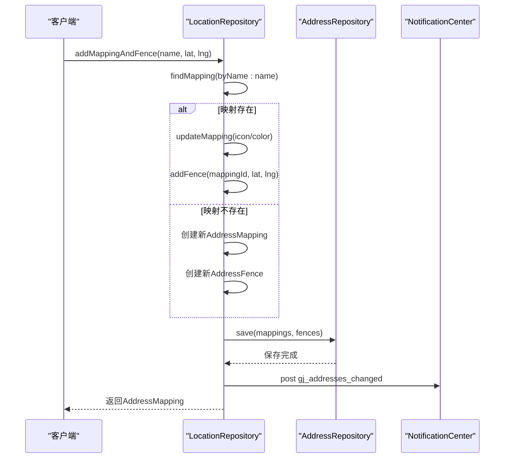
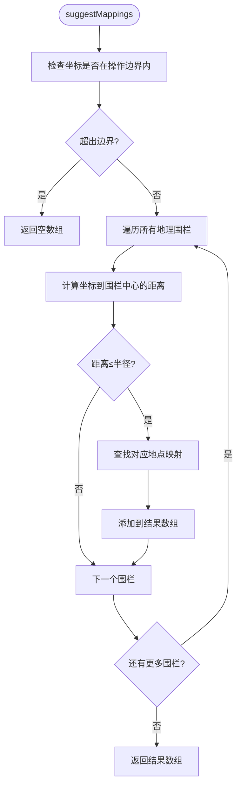

# 位置管理仓库

<cite>
**本文档引用文件**   
- [LocationRepository.swift](file://guanji0.34/DataLayer/Repositories/LocationRepository.swift)
- [LocationModel.swift](file://guanji0.34/Core/Models/LocationModel.swift)
- [MockDataService.swift](file://guanji0.34/DataLayer/DataSources/MockDataService.swift)
- [AddressRepository.swift](file://guanji0.34/DataLayer/Repositories/AddressRepository.swift)
- [LocationListScreen.swift](file://guanji0.34/Features/Profile/LocationListScreen.swift)
- [ProfileViewModel.swift](file://guanji0.34/Features/Profile/ProfileViewModel.swift)
- [LocationService.swift](file://guanji0.34/DataLayer/SystemServices/LocationService.swift)
- [repositories.md](file://Docs/api/repositories.md)
</cite>

## 目录
1. [简介](#简介)
2. [核心数据模型](#核心数据模型)
3. [数据持久化与加载机制](#数据持久化与加载机制)
4. [关键操作方法](#关键操作方法)
5. [数据验证机制](#数据验证机制)
6. [UI集成与实时更新](#ui集成与实时更新)
7. [边界计算与地理匹配](#边界计算与地理匹配)
8. [最佳实践指南](#最佳实践指南)

## 简介
位置管理仓库（LocationRepository）是应用程序中地理位置数据的核心管理者，负责统一管理场所命名、地理围栏和位置标签的持久化存储。作为单例模式实现的中央数据枢纽，该仓库通过AddressMapping和AddressFence两个核心模型，实现了用户自定义地点与地理坐标的映射关系管理。仓库采用多层级数据存储策略，优先从文件系统加载数据，降级到UserDefaults，并在无数据时注入测试数据，确保应用始终具备可用的位置数据集。通过NotificationCenter机制，仓库实现了数据变更的实时通知，支持UI组件的动态更新。

## 核心数据模型
位置管理仓库依赖于两个核心数据模型：AddressMapping和AddressFence，分别代表地点映射和地理围栏。



**Diagram sources**
- [LocationModel.swift](file://guanji0.34/Core/Models/LocationModel.swift#L3-L18)

**Section sources**
- [LocationModel.swift](file://guanji0.34/Core/Models/LocationModel.swift#L3-L18)

## 数据持久化与加载机制
位置管理仓库实现了复杂的数据加载和持久化策略，确保数据的可靠性和可用性。

### 双重加载策略
仓库在初始化时通过`load()`方法执行双重加载策略：
1. **优先从文件存储加载**：首先尝试通过AddressRepository从Documents目录下的Addresses.json文件加载数据
2. **降级到UserDefaults**：如果文件加载失败，则从UserDefaults中读取gj_location_mappings和gj_location_fences键对应的JSON数据

### 测试数据注入
当加载的数据为空时，仓库会通过`seedMockData()`方法从MockDataService注入预设的测试数据，确保应用在首次启动或数据丢失时仍具备基本的功能完整性。测试数据包含"Home / 静安"、"WestBund AI Tower"等六个常用地点及其对应的地理围栏。

### 持久化机制
所有数据变更操作最终都会调用`save()`方法，该方法不仅将数据同步到文件存储，还会发布`gj_addresses_changed`通知，通知所有监听者数据已变更。



**Diagram sources**
- [LocationRepository.swift](file://guanji0.34/DataLayer/Repositories/LocationRepository.swift#L13-L37)
- [AddressRepository.swift](file://guanji0.34/DataLayer/Repositories/AddressRepository.swift#L10-L18)
- [MockDataService.swift](file://guanji0.34/DataLayer/DataSources/MockDataService.swift#L11-L28)

**Section sources**
- [LocationRepository.swift](file://guanji0.34/DataLayer/Repositories/LocationRepository.swift#L13-L37)
- [AddressRepository.swift](file://guanji0.34/DataLayer/Repositories/AddressRepository.swift#L10-L18)
- [MockDataService.swift](file://guanji0.34/DataLayer/DataSources/MockDataService.swift#L11-L28)

## 关键操作方法
位置管理仓库提供了一系列关键方法，支持对位置数据的完整CRUD操作。

### 一体化创建
`addMappingAndFence()`方法实现了位置与围栏的一体化创建逻辑。该方法首先检查是否存在同名地点，如果存在则更新其图标和颜色，并为该地点添加新的地理围栏；如果不存在则创建新的地点映射和对应的地理围栏。这种设计确保了地点名称的唯一性，避免了重复数据的产生。

### 批量操作
仓库提供了`updateMapping()`和`deleteMapping()`等方法，这些方法在执行操作后会自动调用`save()`方法，确保数据变更立即持久化。特别地，`deleteMapping()`方法会同时删除与该地点关联的所有地理围栏，维护了数据的完整性。



**Diagram sources**
- [LocationRepository.swift](file://guanji0.34/DataLayer/Repositories/LocationRepository.swift#L86-L103)
- [LocationRepository.swift](file://guanji0.34/DataLayer/Repositories/LocationRepository.swift#L34-L37)

**Section sources**
- [LocationRepository.swift](file://guanji0.34/DataLayer/Repositories/LocationRepository.swift#L86-L103)

## 数据验证机制
位置管理仓库内置了全面的数据验证机制，通过`validate()`方法检测并报告数据完整性问题。

### 验证规则
验证方法执行多项检查：
1. **围栏映射完整性**：确保每个地理围栏都能找到对应的地点映射
2. **坐标范围检查**：验证经纬度是否在有效范围内（纬度±90°，经度±180°）
3. **围栏半径校验**：确保围栏半径大于0
4. **操作边界检查**：验证围栏坐标是否在系统定义的操作边界内
5. **重复名称检测**：检查是否存在同名的地点映射

### 验证结果
验证方法返回字符串数组，每个字符串代表一个发现的问题，格式为"问题类型:问题详情"。开发者可以利用此方法在数据导入或用户编辑后进行完整性检查，确保数据质量。

**Section sources**
- [LocationRepository.swift](file://guanji0.34/DataLayer/Repositories/LocationRepository.swift#L128-L146)

## UI集成与实时更新
位置管理仓库与UI层通过ProfileViewModel实现了无缝集成，支持界面的实时更新。

### 通知订阅机制
LocationListScreen通过ProfileViewModel订阅`gj_addresses_changed`通知。当位置数据发生变更时，ProfileViewModel的`onAddressChanged()`方法会被调用，触发`loadAddresses()`重新加载最新数据，从而实现UI的自动刷新。

### 数据绑定
ProfileViewModel使用@Published属性包装器暴露`addressMappings`和`addressFences`数组，这些属性与SwiftUI视图直接绑定。当数据更新时，SwiftUI的响应式系统会自动重新渲染相关视图，确保用户界面始终显示最新状态。

```swift
// LocationListScreen中订阅通知的代码示例
@objc private func onAddressChanged() {
    loadAddresses()
}

// 在init中注册通知观察者
NotificationCenter.default.addObserver(self, 
                                     selector: #selector(onAddressChanged), 
                                     name: Notification.Name("gj_addresses_changed"), 
                                     object: nil)
```

**Section sources**
- [ProfileViewModel.swift](file://guanji0.34/Features/Profile/ProfileViewModel.swift#L59-L67)
- [LocationListScreen.swift](file://guanji0.34/Features/Profile/LocationListScreen.swift#L14-L32)

## 边界计算与地理匹配
位置管理仓库提供了强大的地理计算功能，支持地图视图初始化和位置匹配。

### 操作边界计算
`operationalBounds()`方法根据现有地理围栏的坐标范围，计算出包含所有围栏的最小边界矩形。该方法在地图视图初始化时被调用，用于设置合适的缩放级别和中心点，确保所有已定义的地点都能在地图上可见。

### 地理匹配算法
`suggestMappings()`方法实现了基于距离计算的地理匹配算法。该方法遍历所有地理围栏，使用近似距离公式`hypot((f.lat - lat) * 111_000, (f.lng - lng) * 111_000)`计算目标坐标与围栏中心的距离（单位：米），如果距离小于或等于围栏半径，则认为目标坐标位于该围栏内，返回对应的地点映射。



**Diagram sources**
- [LocationRepository.swift](file://guanji0.34/DataLayer/Repositories/LocationRepository.swift#L148-L168)
- [LocationRepository.swift](file://guanji0.34/DataLayer/Repositories/LocationRepository.swift#L106-L114)

**Section sources**
- [LocationRepository.swift](file://guanji0.34/DataLayer/Repositories/LocationRepository.swift#L148-L168)
- [LocationRepository.swift](file://guanji0.34/DataLayer/Repositories/LocationRepository.swift#L106-L114)

## 最佳实践指南
为确保位置数据管理的稳定性和可靠性，开发者应遵循以下最佳实践：

### 处理数据冲突
- **名称冲突**：在创建新地点前，使用`findMapping(byName:)`检查是否存在同名地点，避免重复数据
- **围栏重叠**：虽然系统允许围栏重叠，但应尽量避免创建大面积重叠的围栏，以免造成位置识别混乱
- **并发访问**：由于LocationRepository是单例，多个线程同时访问时应确保操作的原子性

### 边界情况处理
- **空数据集**：应用启动时应检查数据是否为空，必要时调用`reload()`重新加载
- **无效坐标**：在添加新围栏前，应验证坐标的有效性，避免添加超出地球范围的坐标
- **权限变更**：当定位权限变更时，应重新评估位置数据的有效性，必要时清除或标记相关数据

### 性能优化
- **批量操作**：对于多个连续的数据变更操作，应考虑在操作完成后统一保存，减少I/O操作次数
- **缓存策略**：对于频繁访问的数据，可在内存中维护缓存，减少对仓库的重复查询
- **异步处理**：对于耗时的数据验证或计算操作，应考虑在后台线程执行，避免阻塞主线程

**Section sources**
- [LocationRepository.swift](file://guanji0.34/DataLayer/Repositories/LocationRepository.swift)
- [ProfileViewModel.swift](file://guanji0.34/Features/Profile/ProfileViewModel.swift)