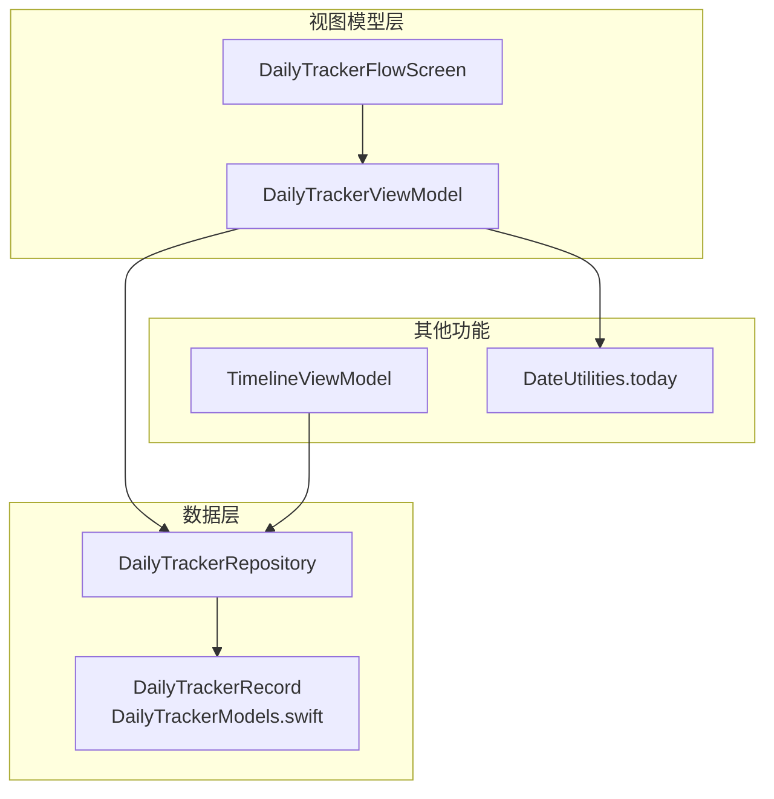
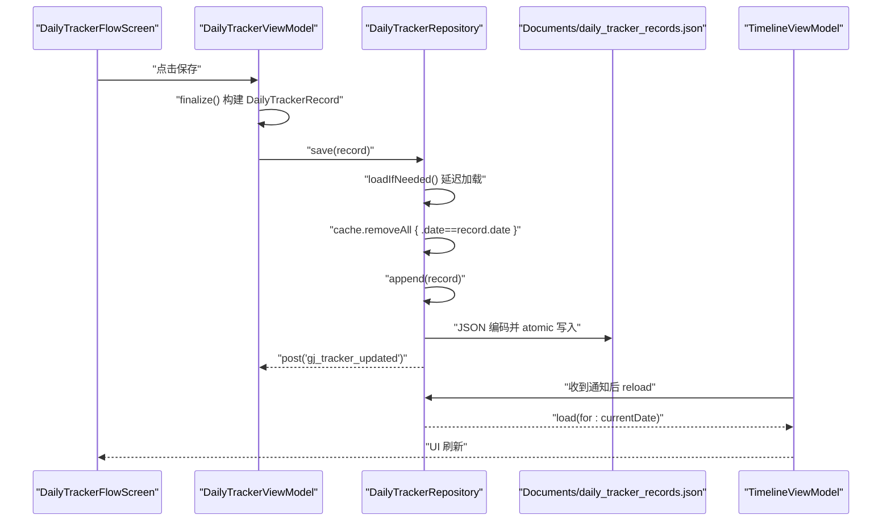
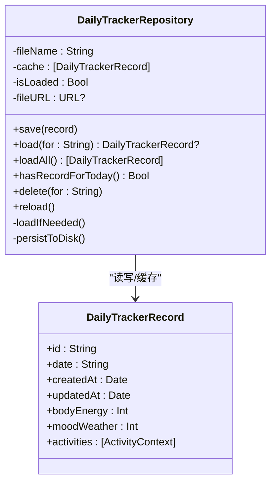
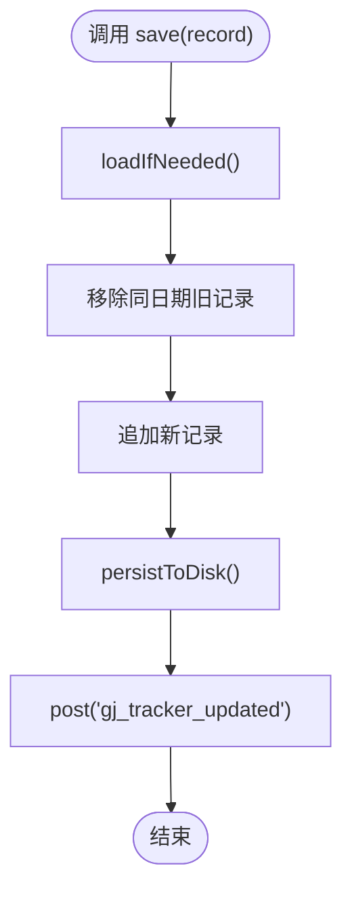
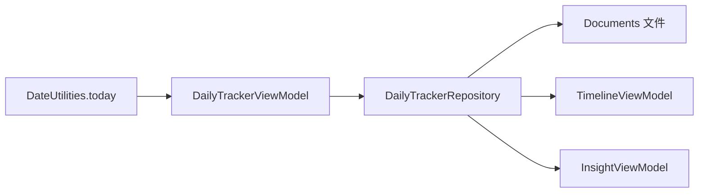

# 每日追踪数据仓库

<cite>
**本文引用的文件**
- [DailyTrackerRepository.swift](file://guanji0.34/DataLayer/Repositories/DailyTrackerRepository.swift)
- [DailyTrackerModels.swift](file://guanji0.34/Core/Models/DailyTrackerModels.swift)
- [DailyTrackerViewModel.swift](file://guanji0.34/Features/DailyTracker/DailyTrackerViewModel.swift)
- [DailyTrackerFlowScreen.swift](file://guanji0.34/Features/DailyTracker/DailyTrackerFlowScreen.swift)
- [DateUtilities.swift](file://guanji0.34/Core/Utilities/DateUtilities.swift)
- [TimelineViewModel.swift](file://guanji0.34/Features/Timeline/TimelineViewModel.swift)
- [daily-tracker.md](file://Docs/features/daily-tracker.md)
- [tracker-models.md](file://Docs/data/tracker-models.md)
</cite>

## 目录
1. [简介](#简介)
2. [项目结构](#项目结构)
3. [核心组件](#核心组件)
4. [架构总览](#架构总览)
5. [组件详细分析](#组件详细分析)
6. [依赖关系分析](#依赖关系分析)
7. [性能考量](#性能考量)
8. [故障排查指南](#故障排查指南)
9. [结论](#结论)
10. [附录](#附录)

## 简介
本文件面向开发者，系统性解析 DailyTrackerRepository 的设计与实现，重点说明其作为健康数据持久化层的职责与行为，包括：
- 以 DailyTrackerRecord 管理每日健康与活动数据
- 基于日期字符串（date）作为唯一键的去重与覆盖机制
- Documents 目录下的 JSON 文件存储与原子写入保障
- 延迟加载与磁盘持久化的 loadIfNeeded/persistToDisk 模式及其对应用启动的影响
- save 方法的覆盖逻辑与 NotificationCenter 通知驱动 UI 更新
- hasRecordForToday 等便捷查询方法的使用场景
- 数据加载失败的容错策略与性能优化建议

## 项目结构
DailyTrackerRepository 属于数据层（DataLayer），围绕 DailyTrackerRecord 模型提供读写与缓存能力；上层由 DailyTrackerViewModel 与 DailyTrackerFlowScreen 提供交互与保存；时间轴 TimelineViewModel 通过通知监听更新。

图表来源
- [DailyTrackerRepository.swift](file://guanji0.34/DataLayer/Repositories/DailyTrackerRepository.swift#L1-L102)
- [DailyTrackerModels.swift](file://guanji0.34/Core/Models/DailyTrackerModels.swift#L75-L105)
- [DailyTrackerViewModel.swift](file://guanji0.34/Features/DailyTracker/DailyTrackerViewModel.swift#L1-L258)
- [DailyTrackerFlowScreen.swift](file://guanji0.34/Features/DailyTracker/DailyTrackerFlowScreen.swift#L1-L197)
- [TimelineViewModel.swift](file://guanji0.34/Features/Timeline/TimelineViewModel.swift#L17-L46)
- [DateUtilities.swift](file://guanji0.34/Core/Utilities/DateUtilities.swift#L10-L40)

章节来源
- [DailyTrackerRepository.swift](file://guanji0.34/DataLayer/Repositories/DailyTrackerRepository.swift#L1-L102)
- [DailyTrackerModels.swift](file://guanji0.34/Core/Models/DailyTrackerModels.swift#L75-L105)
- [DailyTrackerViewModel.swift](file://guanji0.34/Features/DailyTracker/DailyTrackerViewModel.swift#L1-L258)
- [DailyTrackerFlowScreen.swift](file://guanji0.34/Features/DailyTracker/DailyTrackerFlowScreen.swift#L1-L197)
- [TimelineViewModel.swift](file://guanji0.34/Features/Timeline/TimelineViewModel.swift#L17-L46)
- [DateUtilities.swift](file://guanji0.34/Core/Utilities/DateUtilities.swift#L10-L40)

## 核心组件
- DailyTrackerRepository：单例仓库，负责 JSON 文件读写、缓存、去重与通知
- DailyTrackerRecord：每日追踪记录模型，包含日期、状态、活动上下文等
- DailyTrackerViewModel：三步流程的业务逻辑与保存入口
- DateUtilities：提供“今日”日期字符串，统一日期格式
- TimelineViewModel：监听 gij tracker 更新通知，刷新 UI

章节来源
- [DailyTrackerRepository.swift](file://guanji0.34/DataLayer/Repositories/DailyTrackerRepository.swift#L4-L11)
- [DailyTrackerModels.swift](file://guanji0.34/Core/Models/DailyTrackerModels.swift#L75-L105)
- [DailyTrackerViewModel.swift](file://guanji0.34/Features/DailyTracker/DailyTrackerViewModel.swift#L213-L249)
- [DateUtilities.swift](file://guanji0.34/Core/Utilities/DateUtilities.swift#L10-L40)
- [TimelineViewModel.swift](file://guanji0.34/Features/Timeline/TimelineViewModel.swift#L28-L36)

## 架构总览
仓库采用“内存缓存 + 原子文件写入”的轻量持久化方案，避免频繁 IO 并确保数据一致性。上层通过通知解耦，实现跨界面的实时同步。

图表来源
- [DailyTrackerFlowScreen.swift](file://guanji0.34/Features/DailyTracker/DailyTrackerFlowScreen.swift#L99-L104)
- [DailyTrackerViewModel.swift](file://guanji0.34/Features/DailyTracker/DailyTrackerViewModel.swift#L237-L249)
- [DailyTrackerRepository.swift](file://guanji0.34/DataLayer/Repositories/DailyTrackerRepository.swift#L21-L33)
- [TimelineViewModel.swift](file://guanji0.34/Features/Timeline/TimelineViewModel.swift#L28-L36)

## 组件详细分析

### DailyTrackerRepository 设计与实现
- 单例与文件定位
  - 通过 Documents 目录定位文件名，避免硬编码路径
  - 使用 lazy 加载标记 isLoaded，首次访问才触发磁盘读取
- 缓存策略
  - 内存数组 cache 存储所有记录，避免重复 IO
  - 读取时 JSON 解码，失败则清空缓存并打印错误
- 去重与覆盖
  - save/delete 前先 loadIfNeeded
  - 以 date 为键移除旧记录，再追加新记录，天然实现同日期覆盖
- 原子写入
  - persistToDisk 使用 .atomic 写入，保证写入过程中的文件一致性
- 通知机制
  - 保存/删除后发送 gij_tracker_updated，驱动观察者刷新 UI

图表来源
- [DailyTrackerRepository.swift](file://guanji0.34/DataLayer/Repositories/DailyTrackerRepository.swift#L4-L99)
- [DailyTrackerModels.swift](file://guanji0.34/Core/Models/DailyTrackerModels.swift#L75-L105)

章节来源
- [DailyTrackerRepository.swift](file://guanji0.34/DataLayer/Repositories/DailyTrackerRepository.swift#L4-L11)
- [DailyTrackerRepository.swift](file://guanji0.34/DataLayer/Repositories/DailyTrackerRepository.swift#L69-L87)
- [DailyTrackerRepository.swift](file://guanji0.34/DataLayer/Repositories/DailyTrackerRepository.swift#L89-L98)

### DailyTrackerRecord 模型与数据结构
- 字段设计
  - id：唯一标识
  - date：字符串日期（yyyy.MM.dd），作为唯一键
  - bodyEnergy/moodWeather：连续 0-100 数值，映射到离散等级
  - activities：活动上下文数组，含活动类型、同伴、标签、备注等
- 日期格式与 today 对齐
  - DateUtilities.today 提供统一格式，确保跨模块一致

章节来源
- [DailyTrackerModels.swift](file://guanji0.34/Core/Models/DailyTrackerModels.swift#L75-L105)
- [DateUtilities.swift](file://guanji0.34/Core/Utilities/DateUtilities.swift#L10-L40)

### 保存流程与覆盖逻辑
- finalize 构建记录：从 ViewModel 收集状态与活动上下文，生成 DailyTrackerRecord
- save 流程：
  - loadIfNeeded
  - 移除同日期旧记录
  - 追加新记录
  - persistToDisk
  - 发送通知

图表来源
- [DailyTrackerViewModel.swift](file://guanji0.34/Features/DailyTracker/DailyTrackerViewModel.swift#L237-L249)
- [DailyTrackerRepository.swift](file://guanji0.34/DataLayer/Repositories/DailyTrackerRepository.swift#L21-L33)

章节来源
- [DailyTrackerViewModel.swift](file://guanji0.34/Features/DailyTracker/DailyTrackerViewModel.swift#L213-L249)
- [DailyTrackerRepository.swift](file://guanji0.34/DataLayer/Repositories/DailyTrackerRepository.swift#L21-L33)

### 延迟加载与磁盘持久化模式
- loadIfNeeded
  - 仅在未加载时读取文件，失败则清空缓存并记录错误
  - 首次访问后 isLoaded=true，后续直接走内存
- persistToDisk
  - JSON 编码后以 .atomic 写入，避免部分写入导致损坏
- 性能影响
  - 应用启动时若未访问仓库，不会产生 IO
  - 首次访问时一次性读取全部记录，后续读写 O(1) 查找/追加

章节来源
- [DailyTrackerRepository.swift](file://guanji0.34/DataLayer/Repositories/DailyTrackerRepository.swift#L69-L87)
- [DailyTrackerRepository.swift](file://guanji0.34/DataLayer/Repositories/DailyTrackerRepository.swift#L89-L98)

### 便捷查询方法与使用场景
- hasRecordForToday
  - 基于 DateUtilities.today 查询是否存在记录，用于禁用重复录入按钮等
- load(for:) / loadAll
  - 供 TimelineViewModel、导出服务等模块使用，统一从仓库读取

章节来源
- [DailyTrackerRepository.swift](file://guanji0.34/DataLayer/Repositories/DailyTrackerRepository.swift#L47-L50)
- [TimelineViewModel.swift](file://guanji0.34/Features/Timeline/TimelineViewModel.swift#L33-L36)

### 通知驱动的 UI 更新
- DailyTrackerRepository 在 save/delete 后发送 gij_tracker_updated
- TimelineViewModel 注册观察者，收到通知后重新加载当前日期记录
- InsightViewModel 等也订阅该通知，触发重新计算

章节来源
- [DailyTrackerRepository.swift](file://guanji0.34/DataLayer/Repositories/DailyTrackerRepository.swift#L31-L32)
- [TimelineViewModel.swift](file://guanji0.34/Features/Timeline/TimelineViewModel.swift#L28-L36)
- [daily-tracker.md](file://Docs/features/daily-tracker.md#L201-L203)

## 依赖关系分析
- 低耦合：仓库只暴露简单 API，不依赖上层 UI
- 通知解耦：上层通过通知感知变更，无需直接依赖仓库
- 日期一致性：DateUtilities.today 统一日期格式，避免跨模块差异

图表来源
- [DateUtilities.swift](file://guanji0.34/Core/Utilities/DateUtilities.swift#L10-L40)
- [DailyTrackerViewModel.swift](file://guanji0.34/Features/DailyTracker/DailyTrackerViewModel.swift#L229-L233)
- [DailyTrackerRepository.swift](file://guanji0.34/DataLayer/Repositories/DailyTrackerRepository.swift#L21-L33)
- [TimelineViewModel.swift](file://guanji0.34/Features/Timeline/TimelineViewModel.swift#L28-L36)

章节来源
- [DateUtilities.swift](file://guanji0.34/Core/Utilities/DateUtilities.swift#L10-L40)
- [DailyTrackerViewModel.swift](file://guanji0.34/Features/DailyTracker/DailyTrackerViewModel.swift#L229-L233)
- [DailyTrackerRepository.swift](file://guanji0.34/DataLayer/Repositories/DailyTrackerRepository.swift#L21-L33)
- [TimelineViewModel.swift](file://guanji0.34/Features/Timeline/TimelineViewModel.swift#L28-L36)

## 性能考量
- 延迟加载与内存缓存
  - 首次访问才读取文件，后续读写走内存，降低 IO 开销
- 原子写入
  - .atomic 写入避免部分写入，提升可靠性
- 去重策略
  - 以 date 为键的线性移除与追加，适合中小规模数据集
- 建议
  - 若记录数量增长，可考虑：
    - 引入字典索引（按 date 映射到记录）以 O(1) 查找
    - 分页或分片存储，减少单文件体积
    - 增加后台写入队列，避免主线程阻塞
  - 对于频繁启动场景，可在应用空闲时预热缓存（如 App 初始化阶段）

[本节为通用性能建议，不直接分析具体文件]

## 故障排查指南
- 数据加载失败
  - 现象：首次访问仓库时无记录或报错
  - 原因：文件不存在或 JSON 解码失败
  - 处理：仓库会捕获错误并清空缓存，继续运行；检查 Documents 权限与文件完整性
- 覆盖无效
  - 现象：保存后仍出现两条同日期记录
  - 原因：未调用 loadIfNeeded 或 date 格式不一致
  - 处理：确认使用 DateUtilities.today 生成日期字符串，且调用 save 前未手动绕过 loadIfNeeded
- UI 不刷新
  - 现象：保存后时间轴未显示最新记录
  - 原因：未收到 gij_tracker_updated 通知或未注册观察者
  - 处理：确认 TimelineViewModel 等已注册通知，或在需要时调用 reload

章节来源
- [DailyTrackerRepository.swift](file://guanji0.34/DataLayer/Repositories/DailyTrackerRepository.swift#L78-L84)
- [DailyTrackerRepository.swift](file://guanji0.34/DataLayer/Repositories/DailyTrackerRepository.swift#L21-L33)
- [TimelineViewModel.swift](file://guanji0.34/Features/Timeline/TimelineViewModel.swift#L28-L36)

## 结论
DailyTrackerRepository 以极简设计实现了可靠的每日健康数据持久化：通过内存缓存与原子写入平衡性能与可靠性；以日期字符串作为唯一键，自然实现覆盖与去重；借助通知机制实现跨界面实时同步。对于中小规模数据，该方案高效稳定；随着数据增长，可按性能建议引入索引与分片策略。

[本节为总结性内容，不直接分析具体文件]

## 附录
- 相关文档
  - [每日追踪功能文档](file://Docs/features/daily-tracker.md)
  - [追踪器模型详解](file://Docs/data/tracker-models.md)

[本节为参考链接，不直接分析具体文件]