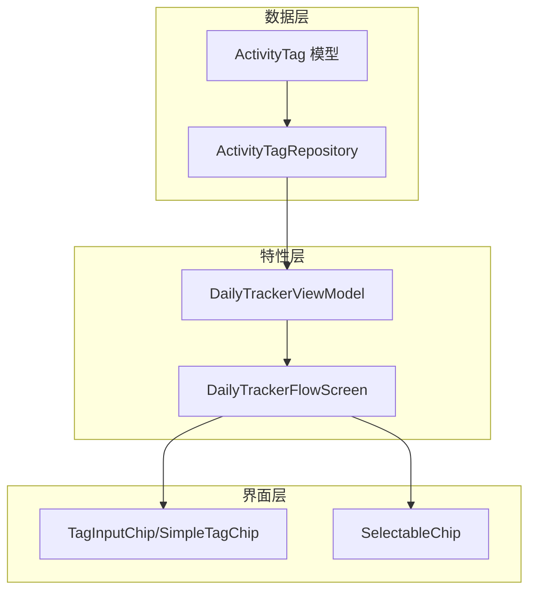
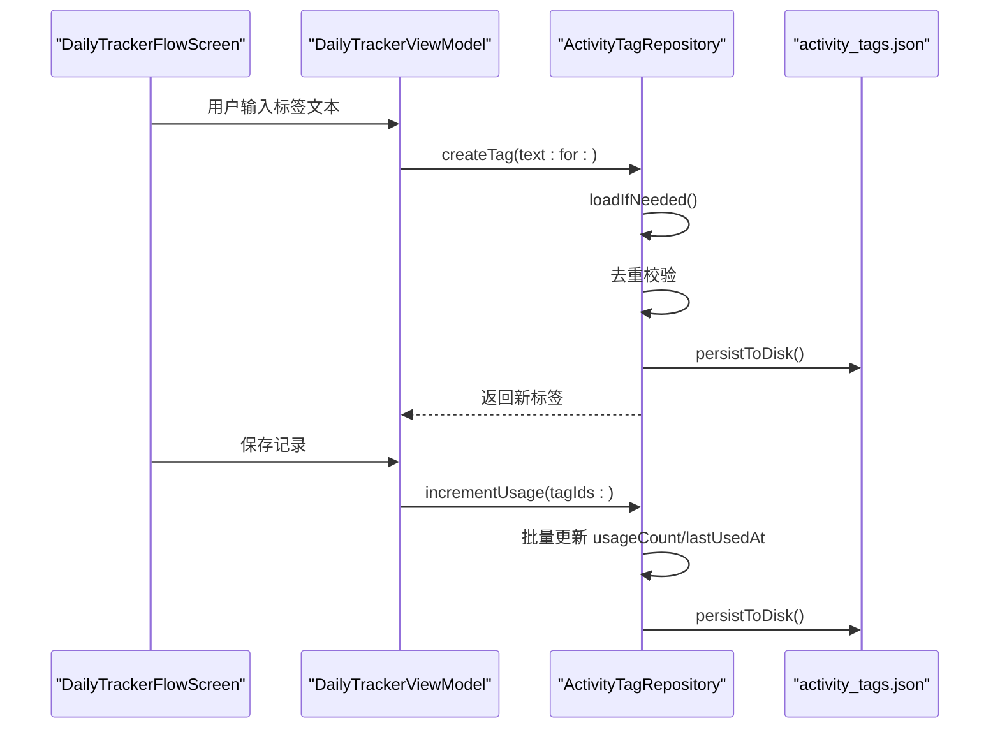
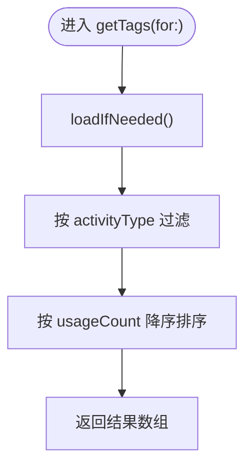
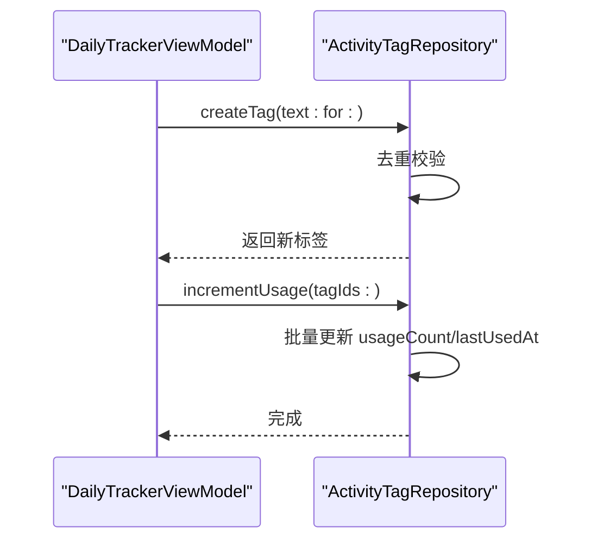
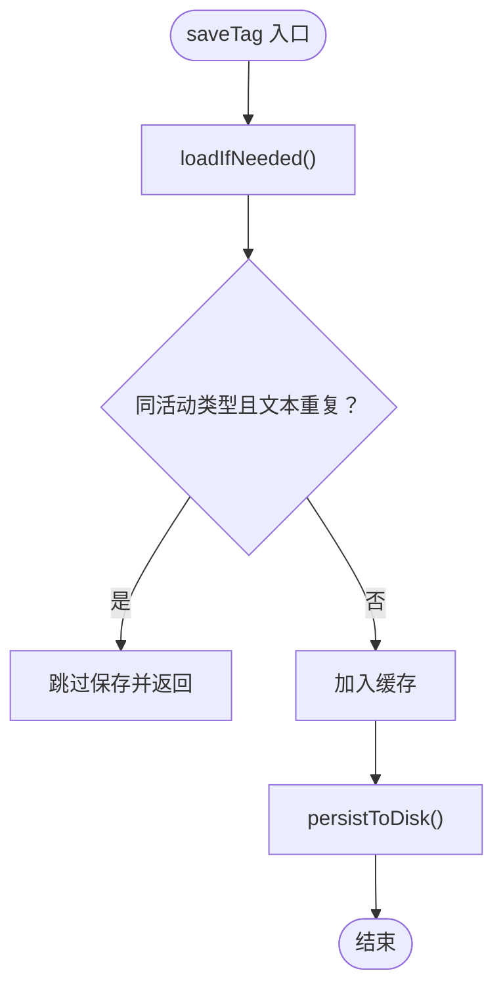
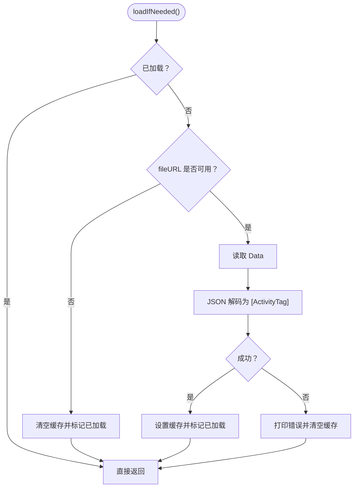
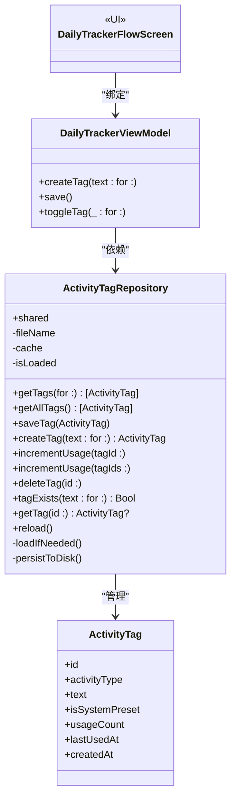

# 活动标签仓库

<cite>
**本文引用的文件列表**
- [ActivityTagRepository.swift](file://guanji0.34/DataLayer/Repositories/ActivityTagRepository.swift)
- [DailyTrackerModels.swift](file://guanji0.34/Core/Models/DailyTrackerModels.swift)
- [DailyTrackerViewModel.swift](file://guanji0.34/Features/DailyTracker/DailyTrackerViewModel.swift)
- [DailyTrackerFlowScreen.swift](file://guanji0.34/Features/DailyTracker/DailyTrackerFlowScreen.swift)
- [TagInputChip.swift](file://guanji0.34/UI/Atoms/TagInputChip.swift)
- [SelectableChip.swift](file://guanji0.34/UI/Atoms/SelectableChip.swift)
</cite>

## 目录
1. [简介](#简介)
2. [项目结构](#项目结构)
3. [核心组件](#核心组件)
4. [架构总览](#架构总览)
5. [组件详解](#组件详解)
6. [依赖关系分析](#依赖关系分析)
7. [性能考量](#性能考量)
8. [故障排查指南](#故障排查指南)
9. [结论](#结论)
10. [附录：在DailyTracker界面集成标签推荐的代码示例](#附录在dailytracker界面集成标签推荐的代码示例)

## 简介
本文件围绕 ActivityTagRepository 的实现进行深度技术解析，重点覆盖以下主题：
- ActivityTag 模型字段的业务语义（activityType、usageCount、lastUsedAt）与用途
- 仓库通过 JSON 文件（activity_tags.json）实现标签数据的持久化存储
- getTags(for:) 方法按活动类型过滤并按使用频率降序排列的实现逻辑
- createTag 与 incrementUsage 构成的标签使用行为追踪系统
- saveTag 中防止同一活动类型下重复标签文本的校验机制
- 批量 incrementUsage(tagIds:) 在记录复合活动时的性能优势
- 标签缓存管理策略与惰性加载 loadIfNeeded 的设计权衡
- 在 DailyTracker 界面集成标签推荐功能的实践建议与用户体验优化

## 项目结构
ActivityTagRepository 属于数据层仓库（DataLayer/Repositories），与模型层（Core/Models）和特性层（Features/DailyTracker）协作，形成“模型-仓库-视图模型-界面”的清晰分层。

图表来源
- [ActivityTagRepository.swift](file://guanji0.34/DataLayer/Repositories/ActivityTagRepository.swift#L1-L144)
- [DailyTrackerModels.swift](file://guanji0.34/Core/Models/DailyTrackerModels.swift#L259-L288)
- [DailyTrackerViewModel.swift](file://guanji0.34/Features/DailyTracker/DailyTrackerViewModel.swift#L1-L258)
- [DailyTrackerFlowScreen.swift](file://guanji0.34/Features/DailyTracker/DailyTrackerFlowScreen.swift#L1-L197)
- [TagInputChip.swift](file://guanji0.34/UI/Atoms/TagInputChip.swift#L1-L110)
- [SelectableChip.swift](file://guanji0.34/UI/Atoms/SelectableChip.swift#L1-L124)

章节来源
- [ActivityTagRepository.swift](file://guanji0.34/DataLayer/Repositories/ActivityTagRepository.swift#L1-L144)
- [DailyTrackerModels.swift](file://guanji0.34/Core/Models/DailyTrackerModels.swift#L259-L288)

## 核心组件
- ActivityTagRepository：单例仓库，负责标签的增删改查、去重校验、持久化与缓存控制
- ActivityTag：用户可自定义的活动标签实体，包含活动类型、文本、是否系统预设、使用次数、最近使用时间、创建时间等
- DailyTrackerViewModel：在每日追踪流程中协调标签创建、切换与保存后的使用计数更新
- DailyTrackerFlowScreen：承载标签推荐与输入的界面容器
- TagInputChip/SimpleTagChip：展示标签的 UI 组件
- SelectableChip：通用胶囊按钮组件，可用于标签推荐列表

章节来源
- [ActivityTagRepository.swift](file://guanji0.34/DataLayer/Repositories/ActivityTagRepository.swift#L1-L144)
- [DailyTrackerModels.swift](file://guanji0.34/Core/Models/DailyTrackerModels.swift#L259-L288)
- [DailyTrackerViewModel.swift](file://guanji0.34/Features/DailyTracker/DailyTrackerViewModel.swift#L1-L258)
- [DailyTrackerFlowScreen.swift](file://guanji0.34/Features/DailyTracker/DailyTrackerFlowScreen.swift#L1-L197)
- [TagInputChip.swift](file://guanji0.34/UI/Atoms/TagInputChip.swift#L1-L110)
- [SelectableChip.swift](file://guanji0.34/UI/Atoms/SelectableChip.swift#L1-L124)

## 架构总览
ActivityTagRepository 采用“内存缓存 + 原子写入磁盘”的设计，通过惰性加载避免启动时的 IO 开销；对外暴露简洁的 API，供 DailyTrackerViewModel 在标签创建与保存时调用，最终由界面组件呈现给用户。

图表来源
- [DailyTrackerViewModel.swift](file://guanji0.34/Features/DailyTracker/DailyTrackerViewModel.swift#L192-L208)
- [DailyTrackerViewModel.swift](file://guanji0.34/Features/DailyTracker/DailyTrackerViewModel.swift#L237-L249)
- [ActivityTagRepository.swift](file://guanji0.34/DataLayer/Repositories/ActivityTagRepository.swift#L36-L59)
- [ActivityTagRepository.swift](file://guanji0.34/DataLayer/Repositories/ActivityTagRepository.swift#L72-L84)
- [ActivityTagRepository.swift](file://guanji0.34/DataLayer/Repositories/ActivityTagRepository.swift#L113-L142)

## 组件详解

### ActivityTag 模型与业务语义
- id：唯一标识
- activityType：所属活动类型，用于标签按活动维度隔离
- text：标签文本
- isSystemPreset：是否为系统预设标签（用户不可删除）
- usageCount：使用计数，用于排序与推荐
- lastUsedAt：最近使用时间，用于排序与统计
- createdAt：创建时间

这些字段共同支撑“按活动类型隔离 + 使用频率驱动”的标签体系。

章节来源
- [DailyTrackerModels.swift](file://guanji0.34/Core/Models/DailyTrackerModels.swift#L259-L288)

### 仓库职责与持久化策略
- 单例共享实例，避免多份缓存
- JSON 文件名固定为 activity_tags.json，位于文档目录
- 惰性加载：首次访问才从磁盘读取，后续复用内存缓存
- 原子写入：编码后写入临时位置再替换，降低损坏风险
- 提供 getTags(for:)、getAllTags()、saveTag()、createTag()、incrementUsage()、incrementUsage(tagIds:)、deleteTag()、tagExists()、getTag()、reload() 等 API

章节来源
- [ActivityTagRepository.swift](file://guanji0.34/DataLayer/Repositories/ActivityTagRepository.swift#L1-L144)

### getTags(for:) 实现逻辑
- 惰性加载后，先按 activityType 过滤，再按 usageCount 降序排序
- 该顺序确保“同类标签中高频优先”，提升用户输入效率

图表来源
- [ActivityTagRepository.swift](file://guanji0.34/DataLayer/Repositories/ActivityTagRepository.swift#L21-L27)

章节来源
- [ActivityTagRepository.swift](file://guanji0.34/DataLayer/Repositories/ActivityTagRepository.swift#L21-L27)

### createTag 与 incrementUsage 的使用追踪
- createTag：构造新标签（usageCount 初始为 1，lastUsedAt 为当前时间），随后调用 saveTag
- saveTag：去重校验（同活动类型下不允许重复文本），然后追加到缓存并落盘
- incrementUsage(tagId:)：单个标签使用计数 +1 并更新 lastUsedAt，立即落盘
- incrementUsage(tagIds:)：批量更新多个标签的使用计数与最近使用时间，最后统一落盘，适合复合活动场景

图表来源
- [DailyTrackerViewModel.swift](file://guanji0.34/Features/DailyTracker/DailyTrackerViewModel.swift#L192-L208)
- [DailyTrackerViewModel.swift](file://guanji0.34/Features/DailyTracker/DailyTrackerViewModel.swift#L237-L249)
- [ActivityTagRepository.swift](file://guanji0.34/DataLayer/Repositories/ActivityTagRepository.swift#L49-L59)
- [ActivityTagRepository.swift](file://guanji0.34/DataLayer/Repositories/ActivityTagRepository.swift#L72-L84)

章节来源
- [ActivityTagRepository.swift](file://guanji0.34/DataLayer/Repositories/ActivityTagRepository.swift#L49-L59)
- [ActivityTagRepository.swift](file://guanji0.34/DataLayer/Repositories/ActivityTagRepository.swift#L61-L84)
- [DailyTrackerViewModel.swift](file://guanji0.34/Features/DailyTracker/DailyTrackerViewModel.swift#L192-L208)
- [DailyTrackerViewModel.swift](file://guanji0.34/Features/DailyTracker/DailyTrackerViewModel.swift#L237-L249)

### saveTag 的重复校验机制
- 同一 activityType 下，若已存在相同 text 的标签，则直接返回，不重复保存
- 该机制保证“同类活动下的标签文本唯一”，避免用户重复输入造成冗余

图表来源
- [ActivityTagRepository.swift](file://guanji0.34/DataLayer/Repositories/ActivityTagRepository.swift#L36-L46)

章节来源
- [ActivityTagRepository.swift](file://guanji0.34/DataLayer/Repositories/ActivityTagRepository.swift#L36-L46)

### getAllTags 的排序策略与用户体验
- getAllTags() 对所有标签按 usageCount 降序排序，便于全局查看高频标签
- 在输入体验上，高频标签靠前显示，减少用户输入成本，提升效率

章节来源
- [ActivityTagRepository.swift](file://guanji0.34/DataLayer/Repositories/ActivityTagRepository.swift#L29-L33)

### 惰性加载与缓存管理：loadIfNeeded 设计
- 首次访问时尝试从磁盘读取 JSON 并解码为 [ActivityTag]，失败则清空缓存并记录错误
- 成功后设置 isLoaded 标记，后续不再重复加载，直到调用 reload() 强制刷新
- 优点：启动性能好、内存占用低；缺点：多线程并发访问时需注意外部同步

图表来源
- [ActivityTagRepository.swift](file://guanji0.34/DataLayer/Repositories/ActivityTagRepository.swift#L113-L131)

章节来源
- [ActivityTagRepository.swift](file://guanji0.34/DataLayer/Repositories/ActivityTagRepository.swift#L113-L131)

### 在 DailyTracker 中的集成点
- 标签创建：当用户在界面输入新标签并确认时，调用 DailyTrackerViewModel.createTag，内部委托 ActivityTagRepository.createTag 并自动添加到当前活动上下文
- 保存记录：DailyTrackerViewModel.save() 最终调用 ActivityTagRepository.incrementUsage(tagIds:)，批量更新使用计数与最近使用时间
- 标签展示：界面通过 TagInputChip/SimpleTagChip 渲染标签，SelectableChip 可用于推荐列表

章节来源
- [DailyTrackerViewModel.swift](file://guanji0.34/Features/DailyTracker/DailyTrackerViewModel.swift#L192-L208)
- [DailyTrackerViewModel.swift](file://guanji0.34/Features/DailyTracker/DailyTrackerViewModel.swift#L237-L249)
- [TagInputChip.swift](file://guanji0.34/UI/Atoms/TagInputChip.swift#L1-L110)
- [SelectableChip.swift](file://guanji0.34/UI/Atoms/SelectableChip.swift#L1-L124)

## 依赖关系分析

图表来源
- [ActivityTagRepository.swift](file://guanji0.34/DataLayer/Repositories/ActivityTagRepository.swift#L1-L144)
- [DailyTrackerModels.swift](file://guanji0.34/Core/Models/DailyTrackerModels.swift#L259-L288)
- [DailyTrackerViewModel.swift](file://guanji0.34/Features/DailyTracker/DailyTrackerViewModel.swift#L1-L258)
- [DailyTrackerFlowScreen.swift](file://guanji0.34/Features/DailyTracker/DailyTrackerFlowScreen.swift#L1-L197)

章节来源
- [ActivityTagRepository.swift](file://guanji0.34/DataLayer/Repositories/ActivityTagRepository.swift#L1-L144)
- [DailyTrackerModels.swift](file://guanji0.34/Core/Models/DailyTrackerModels.swift#L259-L288)
- [DailyTrackerViewModel.swift](file://guanji0.34/Features/DailyTracker/DailyTrackerViewModel.swift#L1-L258)
- [DailyTrackerFlowScreen.swift](file://guanji0.34/Features/DailyTracker/DailyTrackerFlowScreen.swift#L1-L197)

## 性能考量
- 惰性加载与内存缓存：避免应用启动时的磁盘 IO，显著降低冷启动时间
- 原子写入：JSON 编码后写入临时位置再替换，降低崩溃导致的数据损坏概率
- 批量更新：incrementUsage(tagIds:) 将多次更新合并为一次落盘，适合复合活动场景，减少磁盘写入次数
- 排序复杂度：getTags(for:) 与 getAllTags() 使用稳定排序，时间复杂度 O(n log n)，空间复杂度 O(n)

章节来源
- [ActivityTagRepository.swift](file://guanji0.34/DataLayer/Repositories/ActivityTagRepository.swift#L113-L142)
- [ActivityTagRepository.swift](file://guanji0.34/DataLayer/Repositories/ActivityTagRepository.swift#L21-L33)
- [ActivityTagRepository.swift](file://guanji0.34/DataLayer/Repositories/ActivityTagRepository.swift#L72-L84)

## 故障排查指南
- 无法加载或保存：检查 fileURL 是否可用（文档目录权限），查看控制台输出的错误信息
- 标签未生效：确认是否调用了 incrementUsage(tagIds:) 或单个 incrementUsage(tagId:)，以及是否触发了 persistToDisk()
- 重复标签未出现：确认 saveTag 的去重逻辑是否命中（同一活动类型下文本重复会被忽略）
- 高频标签不显示：检查 usageCount 是否正确递增，以及排序逻辑是否被覆盖

章节来源
- [ActivityTagRepository.swift](file://guanji0.34/DataLayer/Repositories/ActivityTagRepository.swift#L113-L142)
- [ActivityTagRepository.swift](file://guanji0.34/DataLayer/Repositories/ActivityTagRepository.swift#L36-L46)
- [ActivityTagRepository.swift](file://guanji0.34/DataLayer/Repositories/ActivityTagRepository.swift#L61-L84)

## 结论
ActivityTagRepository 以轻量、可靠的方式实现了用户自定义活动标签的全生命周期管理：从创建、去重、使用追踪到持久化。其惰性加载与原子写入策略兼顾了启动性能与数据安全；批量更新接口在复合活动场景下提供了良好的性能表现。结合 DailyTracker 的界面与视图模型，形成了“高频优先”的标签推荐体验，有助于提升用户的输入效率与使用满意度。

## 附录：在DailyTracker界面集成标签推荐的代码示例
以下示例展示了如何在 DailyTracker 的上下文中集成标签推荐与输入交互（仅提供路径与思路，不直接粘贴代码）：

- 在 DailyTrackerFlowScreen 中渲染标签推荐区域，使用 SelectableChip 展示高频标签
  - 参考路径：[DailyTrackerFlowScreen.swift](file://guanji0.34/Features/DailyTracker/DailyTrackerFlowScreen.swift#L170-L193)
  - 推荐思路：调用 ActivityTagRepository.getAllTags() 获取全局高频标签，或调用 getTags(for:) 获取特定活动类型的高频标签，再映射为 SelectableChip 列表

- 在 DailyTrackerViewModel 中处理标签创建与切换
  - 创建新标签：调用 createTag(text:for:)，内部完成去重与添加到当前上下文
    - 参考路径：[DailyTrackerViewModel.swift](file://guanji0.34/Features/DailyTracker/DailyTrackerViewModel.swift#L192-L208)
  - 切换标签：toggleTag(_:, for:) 控制标签选中状态
    - 参考路径：[DailyTrackerViewModel.swift](file://guanji0.34/Features/DailyTracker/DailyTrackerViewModel.swift#L179-L190)

- 在界面中展示标签与输入
  - 使用 TagInputChip 展示已有标签
    - 参考路径：[TagInputChip.swift](file://guanji0.34/UI/Atoms/TagInputChip.swift#L1-L38)
  - 使用 SimpleTagChip 展示候选标签
    - 参考路径：[TagInputChip.swift](file://guanji0.34/UI/Atoms/TagInputChip.swift#L40-L79)
  - 使用 AddTagButton 触发“保存为标签”
    - 参考路径：[TagInputChip.swift](file://guanji0.34/UI/Atoms/TagInputChip.swift#L81-L110)

- 保存记录时更新使用计数
  - 调用 incrementUsage(tagIds:) 批量更新高频标签
    - 参考路径：[DailyTrackerViewModel.swift](file://guanji0.34/Features/DailyTracker/DailyTrackerViewModel.swift#L237-L249)

- 排序策略对输入体验的优化
  - getAllTags() 与 getTags(for:) 均按 usageCount 降序排列，使高频标签优先出现，减少用户输入成本
    - 参考路径：[ActivityTagRepository.swift](file://guanji0.34/DataLayer/Repositories/ActivityTagRepository.swift#L21-L33)