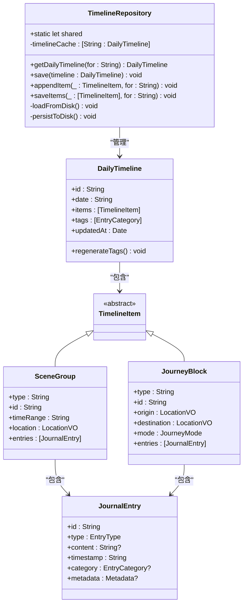
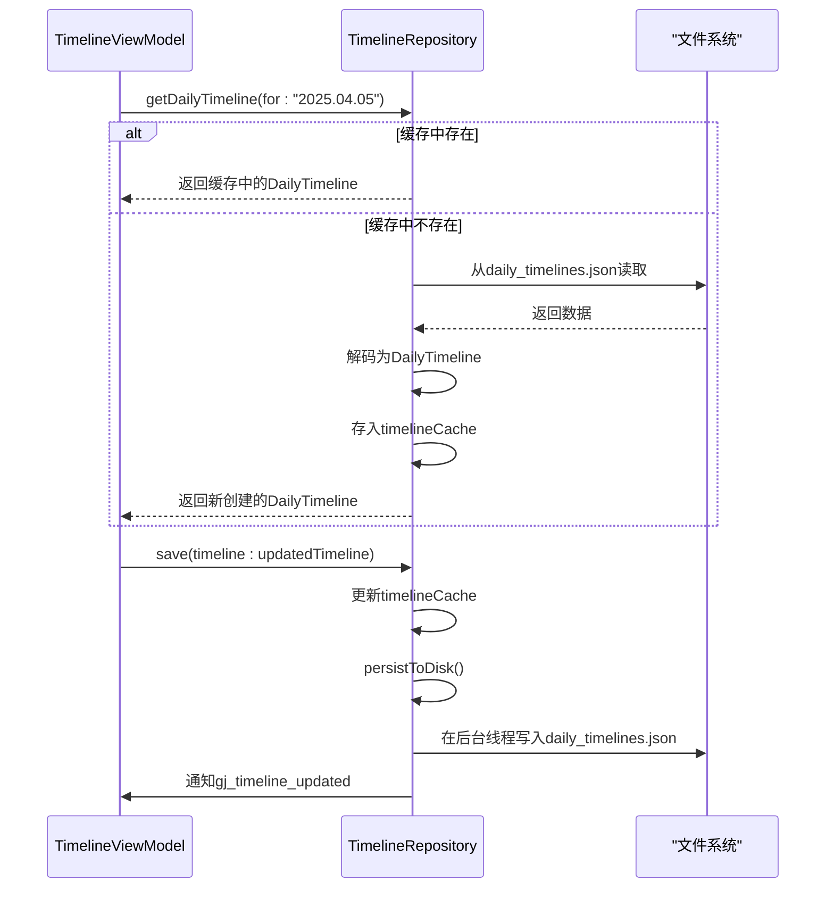

# 数据仓库接口

<cite>
**本文档引用的文件**   
- [TimelineRepository.swift](file://guanji0.34/DataLayer/Repositories/TimelineRepository.swift)
- [LocationRepository.swift](file://guanji0.34/DataLayer/Repositories/LocationRepository.swift)
- [MindStateRepository.swift](file://guanji0.34/DataLayer/Repositories/MindStateRepository.swift)
- [AIConversationRepository.swift](file://guanji0.34/DataLayer/Repositories/AIConversationRepository.swift)
- [DailyTrackerRepository.swift](file://guanji0.34/DataLayer/Repositories/DailyTrackerRepository.swift)
- [DailyTimeline.swift](file://guanji0.34/Core/Models/DailyTimeline.swift)
- [MindStateRecord.swift](file://guanji0.34/Core/Models/MindStateRecord.swift)
- [DailyTrackerModels.swift](file://guanji0.34/Core/Models/DailyTrackerModels.swift)
- [AIConversationModels.swift](file://guanji0.34/Core/Models/AIConversationModels.swift)
- [TimelineViewModel.swift](file://guanji0.34/Features/Timeline/TimelineViewModel.swift)
- [mvvm-pattern.md](file://Docs/architecture/mvvm-pattern.md)
</cite>

## 目录
1. [简介](#简介)
2. [架构概述](#架构概述)
3. [核心组件](#核心组件)
   - [单例模式与内存缓存](#单例模式与内存缓存)
   - [异步持久化机制](#异步持久化机制)
   - [通知机制](#通知机制)
4. [详细组件分析](#详细组件分析)
   - [TimelineRepository](#timelinerepository)
   - [LocationRepository](#locationrepository)
   - [MindStateRepository](#mindstaterepository)
   - [AIConversationRepository](#aiconversationrepository)
   - [DailyTrackerRepository](#dailytrackerrepository)
5. [在ViewModel中的使用](#在viewmodel中的使用)
6. [错误处理策略](#错误处理策略)
7. [结论](#结论)

## 简介
数据仓库层（Repository Layer）是观己应用的核心数据访问抽象层，它实现了业务逻辑与具体数据源的完全解耦。通过Repository模式，上层组件（如ViewModel）无需关心数据的存储位置（内存、文件系统、网络等）和具体实现细节，只需通过统一的接口进行数据的读写操作。该层采用单例模式设计，确保整个应用中只有一个实例存在，从而保证数据的一致性和全局可访问性。同时，它结合了内存缓存与异步持久化机制，在保证数据访问高性能的同时，确保数据的持久化安全。Repository层在MVVM架构中扮演着至关重要的桥梁角色，连接着视图模型（ViewModel）与底层数据模型（Model），极大地提升了代码的可维护性和可测试性。

## 架构概述
数据仓库层是观己应用MVVM架构中的关键组成部分，位于视图模型（ViewModel）与数据模型（Model）之间。它作为统一的数据访问入口，封装了所有与数据持久化相关的复杂逻辑，包括文件读写、缓存管理、数据转换等。这种分层设计使得ViewModel可以专注于业务逻辑和状态管理，而无需处理底层的I/O操作。Repository层通过提供清晰、简洁的API，实现了关注点的分离，使得应用的各个部分职责分明，降低了模块间的耦合度。

```mermaid
graph LR
subgraph "视图层"
V[SwiftUI 视图]
end
subgraph "视图模型层"
VM[ViewModel]
AS[AppState]
end
subgraph "模型层"
M[数据模型]
R[数据仓库]
end
V --> |用户操作| VM
VM --> |@Published| V
VM --> |读写数据| R
R --> |返回| M
V -.->|@EnvironmentObject| AS
VM -.->|访问| AS
```

**图表来源**
- [mvvm-pattern.md](file://Docs/architecture/mvvm-pattern.md)

## 核心组件

### 单例模式与内存缓存
数据仓库层的所有Repository均采用单例模式（Singleton Pattern）实现，通过`public static let shared = RepositoryName()`的方式提供全局唯一的访问点。这种设计确保了在整个应用生命周期内，对同一数据源的访问都通过同一个实例进行，避免了数据不一致的问题。同时，每个Repository内部都维护了一个内存缓存（in-memory cache），例如`TimelineRepository`中的`timelineCache`字典，用于存储从磁盘加载的数据。当上层组件请求数据时，Repository会首先检查内存缓存，如果存在则直接返回，避免了频繁的磁盘I/O操作，从而显著提升了数据访问性能。

**组件来源**
- [TimelineRepository.swift](file://guanji0.34/DataLayer/Repositories/TimelineRepository.swift#L3-L4)
- [LocationRepository.swift](file://guanji0.34/DataLayer/Repositories/LocationRepository.swift#L3-L4)
- [AIConversationRepository.swift](file://guanji0.34/DataLayer/Repositories/AIConversationRepository.swift#L6)

### 异步持久化机制
为了防止数据持久化操作阻塞主线程，影响用户界面的响应性，所有Repository都采用了异步持久化机制。当数据发生变更时，Repository会将更新后的数据先写入内存缓存，然后立即返回，确保上层组件的调用是快速的。随后，通过`DispatchQueue.global(qos: .background)`将实际的文件写入操作调度到后台线程执行。例如，`TimelineRepository`的`persistToDisk()`方法和`AIConversationRepository`的`persistConversation(_:)`方法都使用了此模式。这种设计保证了即使在大量数据写入的情况下，用户界面依然能够保持流畅。

**组件来源**
- [TimelineRepository.swift](file://guanji0.34/DataLayer/Repositories/TimelineRepository.swift#L157-L164)
- [AIConversationRepository.swift](file://guanji0.34/DataLayer/Repositories/AIConversationRepository.swift#L179-L186)

### 通知机制
数据仓库层通过`NotificationCenter`实现了松耦合的观察者模式。当某个Repository中的数据发生变更并完成持久化后，它会发布一个特定的通知（Notification），通知所有对该数据感兴趣的观察者。例如，`TimelineRepository`在成功保存数据后会发布名为`gj_timeline_updated`的通知，`DailyTrackerRepository`则会发布`gj_tracker_updated`通知。其他ViewModel（如`InsightViewModel`）可以订阅这些通知，以便在数据更新时及时刷新自身的状态和UI。这种方式避免了组件间的直接依赖，提高了系统的灵活性和可扩展性。

**组件来源**
- [TimelineRepository.swift](file://guanji0.34/DataLayer/Repositories/TimelineRepository.swift#L53)
- [DailyTrackerRepository.swift](file://guanji0.34/DataLayer/Repositories/DailyTrackerRepository.swift#L32)
- [InsightViewModel.swift](file://guanji0.34/Features/Insight/InsightViewModel.swift#L128-L142)

## 详细组件分析

### TimelineRepository
`TimelineRepository`是管理时间轴数据的核心组件，负责`DailyTimeline`对象的增删改查。它以日期字符串（如"2025.04.05"）作为键，将每日的时间轴数据存储在内存缓存中。其核心方法包括`getDailyTimeline(for:)`用于获取指定日期的时间轴（若不存在则创建一个空骨架），`save(timeline:)`用于保存或更新时间轴数据。该Repository还提供了便捷的辅助方法，如`appendItem(_:for:)`用于向指定日期的时间轴追加条目。其数据模型`DailyTimeline`包含日期、创建/更新时间、标题、天气以及一个`TimelineItem`数组，该数组可以是`SceneGroup`（场景）或`JourneyBlock`（旅程），每个条目下又包含多个`JournalEntry`（日记条目）。



**图表来源**
- [TimelineRepository.swift](file://guanji0.34/DataLayer/Repositories/TimelineRepository.swift)
- [DailyTimeline.swift](file://guanji0.34/Core/Models/DailyTimeline.swift)

**组件来源**
- [TimelineRepository.swift](file://guanji0.34/DataLayer/Repositories/TimelineRepository.swift)
- [DailyTimeline.swift](file://guanji0.34/Core/Models/DailyTimeline.swift)

### LocationRepository
`LocationRepository`负责管理地点映射（AddressMapping）和地理围栏（AddressFence）。它通过`AddressRepository`将地点数据持久化到`Addresses.json`文件中，同时也支持从`UserDefaults`迁移旧数据。其核心功能包括`addMappingAndFence(name:icon:color:lat:lng:rawName:radius:)`用于添加新的地点和围栏，`suggestMappings(lat:lng:)`用于根据经纬度查询匹配的地点（即地理围栏触发），以及`updateMapping(id:name:icon:color:)`用于更新地点信息。该Repository还实现了数据验证逻辑，确保围栏坐标在有效范围内且无重复的地点名称。

**组件来源**
- [LocationRepository.swift](file://guanji0.34/DataLayer/Repositories/LocationRepository.swift)
- [AddressRepository.swift](file://guanji0.34/DataLayer/Repositories/AddressRepository.swift)

### MindStateRepository
`MindStateRepository`是管理心境记录的简单Repository，它将`MindStateRecord`对象数组以JSON格式存储在`UserDefaults`中。其核心方法非常简洁：`save(_:)`用于保存一条新的心境记录，`loadAll()`用于加载所有记录，`load(for:)`用于加载指定日期的所有心境记录。`MindStateRecord`数据模型包含ID、日期、情绪值（valenceValue）、标签（labels）和影响因素（influences）等字段，用于记录用户在特定时刻的心理状态。

**组件来源**
- [MindStateRepository.swift](file://guanji0.34/DataLayer/Repositories/MindStateRepository.swift)
- [MindStateRecord.swift](file://guanji0.34/Core/Models/MindStateRecord.swift)

### AIConversationRepository
`AIConversationRepository`专门用于管理AI对话历史。它采用文件系统存储，每个对话（`AIConversation`）作为一个独立的JSON文件存储在`Documents/ai_conversations/`目录下，并通过一个`index.json`文件来索引所有对话的ID。其核心方法包括`createConversation()`用于创建新对话，`save(_:)`和`load(id:)`用于对话的持久化和加载，`addMessage(_:to:)`用于向指定对话添加消息。该Repository还提供了`getConversationsGroupedByDay()`方法，将所有对话按关联的日期进行分组，便于在UI中展示。其数据模型`AIConversation`包含ID、消息列表、创建/更新时间以及关联的日期列表。



**图表来源**
- [AIConversationRepository.swift](file://guanji0.34/DataLayer/Repositories/AIConversationRepository.swift)
- [AIConversationModels.swift](file://guanji0.34/Core/Models/AIConversationModels.swift)

**组件来源**
- [AIConversationRepository.swift](file://guanji0.34/DataLayer/Repositories/AIConversationRepository.swift)
- [AIConversationModels.swift](file://guanji0.34/Core/Models/AIConversationModels.swift)

### DailyTrackerRepository
`DailyTrackerRepository`负责处理每日追踪数据，其数据模型为`DailyTrackerRecord`，包含身体能量、心情天气、活动记录等。它将所有记录序列化为一个JSON数组，存储在`daily_tracker_records.json`文件中。核心方法包括`save(_:)`用于保存某一天的追踪记录（会覆盖同一天的旧记录），`load(for:)`用于加载指定日期的记录，以及`loadAll()`用于加载所有记录。该Repository还实现了懒加载机制，通过`isLoaded`标志位确保数据只在首次需要时从磁盘加载一次，之后的操作都在内存中进行，提高了效率。

**组件来源**
- [DailyTrackerRepository.swift](file://guanji0.34/DataLayer/Repositories/DailyTrackerRepository.swift)
- [DailyTrackerModels.swift](file://guanji0.34/Core/Models/DailyTrackerModels.swift)

## 在ViewModel中的使用
在ViewModel中，通过调用Repository的静态`shared`实例来访问数据。例如，在`TimelineViewModel`中，`load(date:)`方法会调用`TimelineRepository.shared.getDailyTimeline(for: targetDate)`来获取指定日期的时间轴数据，并将其赋值给`@Published`属性，从而触发UI更新。当用户提交新条目时，`addEntry(_:)`方法会调用`TimelineRepository.shared.saveItems(items, for: currentDate)`来持久化数据。ViewModel通过订阅Repository发布的通知（如`gj_timeline_updated`）来监听数据变化，确保UI与数据状态保持同步。这种模式使得ViewModel的代码清晰、职责单一，易于测试和维护。

**组件来源**
- [TimelineViewModel.swift](file://guanji0.34/Features/Timeline/TimelineViewModel.swift#L56)
- [TimelineViewModel.swift](file://guanji0.34/Features/Timeline/TimelineViewModel.swift#L322)
- [TimelineScreen.swift](file://guanji0.34/Features/Timeline/TimelineScreen.swift#L313)

## 错误处理策略
数据仓库层的错误处理策略主要体现在对文件I/O操作的容错上。在加载数据时，Repository会使用`try?`来捕获可能的异常，如果文件不存在或读取失败，则返回一个空的数据集或默认值，而不是抛出错误导致应用崩溃。例如，`DailyTrackerRepository`的`loadIfNeeded()`方法在`do-catch`块中读取文件，如果失败则将`cache`置为空数组。在保存数据时，虽然也使用了`try?`，但会通过`print()`语句将错误信息输出到控制台，便于开发和调试。这种“静默失败，返回安全默认值”的策略，保证了应用的健壮性和用户体验。

**组件来源**
- [DailyTrackerRepository.swift](file://guanji0.34/DataLayer/Repositories/DailyTrackerRepository.swift#L79-L84)
- [TimelineRepository.swift](file://guanji0.34/DataLayer/Repositories/TimelineRepository.swift#L149-L152)

## 结论
数据仓库层作为观己应用的统一数据访问抽象，成功地实现了业务逻辑与数据源的解耦。通过单例模式、内存缓存和异步持久化，它在保证数据一致性的同时，提供了高性能的数据访问体验。各个Repository职责分明，接口清晰，配合通知机制，构建了一个松耦合、高内聚的架构体系。它在MVVM模式中扮演着不可或缺的桥梁角色，不仅极大地提升了代码的可维护性和可测试性，也为应用的稳定运行提供了坚实的基础。