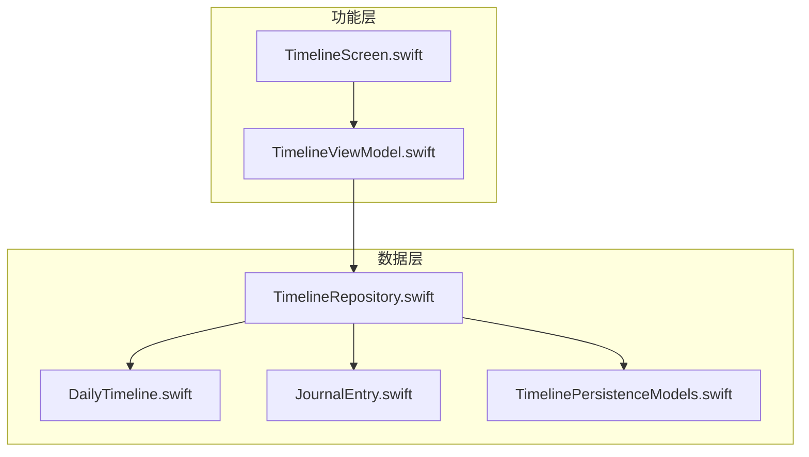
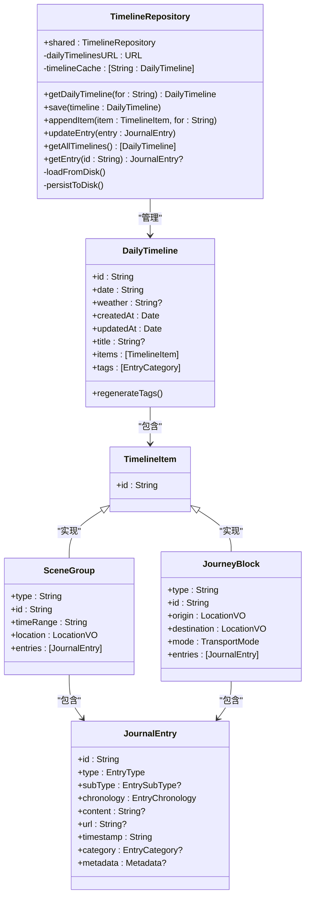
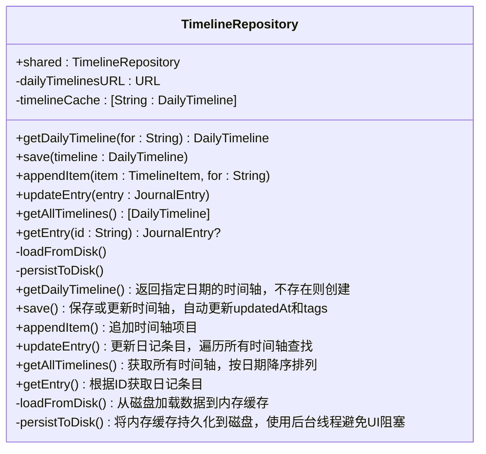
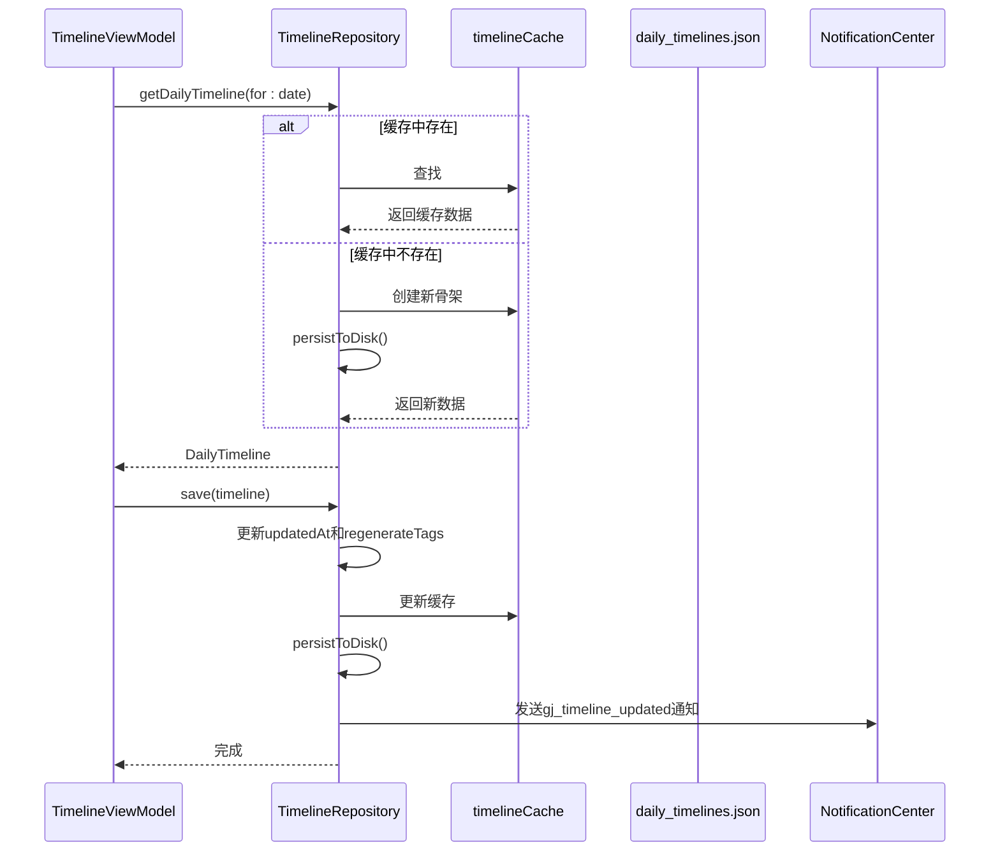
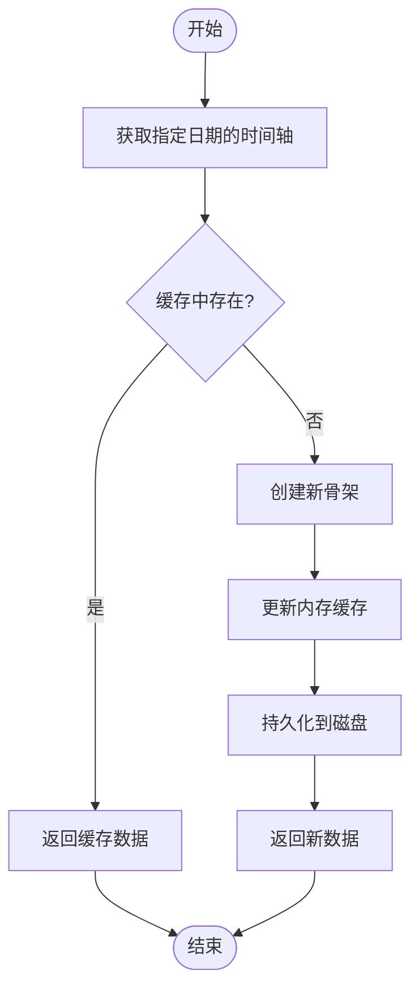
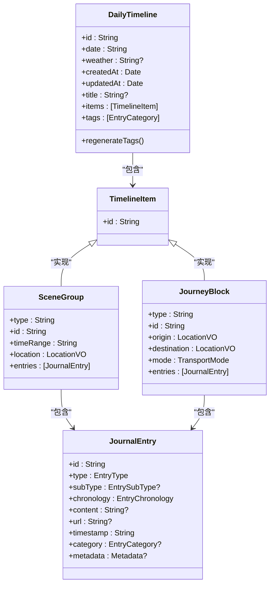
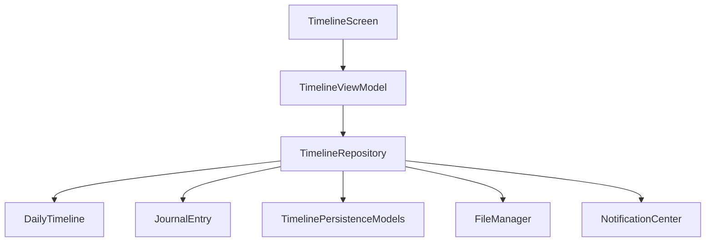

# 时间轴数据仓库

<cite>
**本文档引用文件**  
- [TimelineRepository.swift](file://guanji0.34/DataLayer/Repositories/TimelineRepository.swift)
- [DailyTimeline.swift](file://guanji0.34/Core/Models/DailyTimeline.swift)
- [JournalEntry.swift](file://guanji0.34/Core/Models/JournalEntry.swift)
- [TimelinePersistenceModels.swift](file://guanji0.34/Core/Models/TimelinePersistenceModels.swift)
- [TimelineViewModel.swift](file://guanji0.34/Features/Timeline/TimelineViewModel.swift)
- [LocationModel.swift](file://guanji0.34/Core/Models/LocationModel.swift)
</cite>

## 目录
1. [简介](#简介)
2. [项目结构](#项目结构)
3. [核心组件](#核心组件)
4. [架构概述](#架构概述)
5. [详细组件分析](#详细组件分析)
6. [依赖分析](#依赖分析)
7. [性能考量](#性能考量)
8. [故障排除指南](#故障排除指南)
9. [结论](#结论)

## 简介
时间轴数据仓库（TimelineRepository）是关机应用中负责管理时间轴数据的核心组件。它作为时间轴数据的访问接口，实现了日记条目（JournalEntry）和时间线持久化模型的增删改查操作。该仓库采用基于文件系统的JSON持久化机制与内存缓存策略，确保数据的高效存取。通过NotificationCenter机制实现数据变更通知（如gj_timeline_updated），并采用线程安全的异步持久化策略。在MVVM架构中，它为TimelineViewModel提供数据支持，实现视图与数据的分离。

## 项目结构
时间轴数据仓库位于DataLayer/Repositories目录下，与其他数据仓库共同构成数据访问层。其核心功能依赖于Core/Models中的数据模型，并通过Features/Timeline中的视图模型与用户界面交互。

**图表来源**  
- [TimelineRepository.swift](file://guanji0.34/DataLayer/Repositories/TimelineRepository.swift)
- [DailyTimeline.swift](file://guanji0.34/Core/Models/DailyTimeline.swift)
- [JournalEntry.swift](file://guanji0.34/Core/Models/JournalEntry.swift)
- [TimelinePersistenceModels.swift](file://guanji0.34/Core/Models/TimelinePersistenceModels.swift)
- [TimelineViewModel.swift](file://guanji0.34/Features/Timeline/TimelineViewModel.swift)

**章节来源**
- [TimelineRepository.swift](file://guanji0.34/DataLayer/Repositories/TimelineRepository.swift#L1-L207)
- [TimelineViewModel.swift](file://guanji0.34/Features/Timeline/TimelineViewModel.swift#L1-L1005)

## 核心组件
时间轴数据仓库的核心组件包括DailyTimeline、JournalEntry和TimelineItem。DailyTimeline作为每日时间轴的容器，包含日期、创建时间、更新时间、标题和时间轴项目列表。JournalEntry是日记的原子单元，包含内容、时间戳、类别和元数据。TimelineItem是场景块（SceneGroup）或旅程块（JourneyBlock）的枚举类型，代表时间轴上的一个单元。仓库通过内存缓存和文件持久化机制管理这些组件，确保数据的一致性和可靠性。

**章节来源**
- [DailyTimeline.swift](file://guanji0.34/Core/Models/DailyTimeline.swift#L1-L59)
- [JournalEntry.swift](file://guanji0.34/Core/Models/JournalEntry.swift#L1-L62)
- [LocationModel.swift](file://guanji0.34/Core/Models/LocationModel.swift#L1-L76)

## 架构概述
时间轴数据仓库采用单例模式，确保全局唯一实例。它通过内存缓存（timelineCache）提高数据访问速度，同时将数据持久化到文件系统（daily_timelines.json）。仓库的公共API提供getDailyTimeline、save、appendItem等方法，支持对时间轴数据的增删改查操作。数据变更时，通过NotificationCenter发送gj_timeline_updated通知，通知相关组件更新UI。这种架构实现了数据访问的高效性、线程安全性和松耦合。

**图表来源**  
- [TimelineRepository.swift](file://guanji0.34/DataLayer/Repositories/TimelineRepository.swift#L3-L207)
- [DailyTimeline.swift](file://guanji0.34/Core/Models/DailyTimeline.swift#L1-L59)
- [JournalEntry.swift](file://guanji0.34/Core/Models/JournalEntry.swift#L1-L62)
- [LocationModel.swift](file://guanji0.34/Core/Models/LocationModel.swift#L1-L76)

## 详细组件分析
### 时间轴仓库分析
时间轴仓库是管理时间轴数据的核心组件，负责日记条目和时间线持久化模型的增删改查操作。

#### 对象导向组件

**图表来源**  
- [TimelineRepository.swift](file://guanji0.34/DataLayer/Repositories/TimelineRepository.swift#L3-L207)

#### API/服务组件

**图表来源**  
- [TimelineRepository.swift](file://guanji0.34/DataLayer/Repositories/TimelineRepository.swift#L44-L54)
- [TimelineViewModel.swift](file://guanji0.34/Features/Timeline/TimelineViewModel.swift#L56-L60)

#### 复杂逻辑组件

**图表来源**  
- [TimelineRepository.swift](file://guanji0.34/DataLayer/Repositories/TimelineRepository.swift#L30-L41)

**章节来源**
- [TimelineRepository.swift](file://guanji0.34/DataLayer/Repositories/TimelineRepository.swift#L3-L207)

### 数据模型分析
时间轴数据仓库依赖于多个数据模型，包括DailyTimeline、JournalEntry和TimelineItem。

#### 对象导向组件

**图表来源**  
- [DailyTimeline.swift](file://guanji0.34/Core/Models/DailyTimeline.swift#L1-L59)
- [JournalEntry.swift](file://guanji0.34/Core/Models/JournalEntry.swift#L1-L62)
- [LocationModel.swift](file://guanji0.34/Core/Models/LocationModel.swift#L1-L76)

**章节来源**
- [DailyTimeline.swift](file://guanji0.34/Core/Models/DailyTimeline.swift#L1-L59)
- [JournalEntry.swift](file://guanji0.34/Core/Models/JournalEntry.swift#L1-L62)
- [LocationModel.swift](file://guanji0.34/Core/Models/LocationModel.swift#L1-L76)

## 依赖分析
时间轴数据仓库依赖于多个组件，包括数据模型、文件系统和通知中心。它与TimelineViewModel紧密耦合，为视图模型提供数据支持。通过NotificationCenter实现与其他组件的松耦合通信。

**图表来源**  
- [TimelineRepository.swift](file://guanji0.34/DataLayer/Repositories/TimelineRepository.swift#L1-L207)
- [TimelineViewModel.swift](file://guanji0.34/Features/Timeline/TimelineViewModel.swift#L1-L1005)

**章节来源**
- [TimelineRepository.swift](file://guanji0.34/DataLayer/Repositories/TimelineRepository.swift#L1-L207)
- [TimelineViewModel.swift](file://guanji0.34/Features/Timeline/TimelineViewModel.swift#L1-L1005)

## 性能考量
时间轴数据仓库采用内存缓存策略，提高数据访问速度。持久化操作在后台线程执行，避免阻塞UI线程。通过分表存储策略优化存储和查询性能。批量更新和增量加载策略减少磁盘I/O操作，提高整体性能。

## 故障排除指南
当遇到数据不一致或持久化失败时，首先检查文件系统权限和磁盘空间。确保NotificationCenter通知正确发送和接收。在调试时，可以检查内存缓存和磁盘数据的一致性。对于文件损坏情况，可以尝试从备份恢复或重建数据。

**章节来源**
- [TimelineRepository.swift](file://guanji0.34/DataLayer/Repositories/TimelineRepository.swift#L159-L163)

## 结论
时间轴数据仓库是关机应用中关键的数据管理组件。它通过内存缓存和文件持久化机制，实现了高效、可靠的数据访问。其设计遵循MVVM架构，与视图模型紧密协作，为用户提供流畅的用户体验。通过合理的错误处理和性能优化，确保了应用的稳定性和响应性。