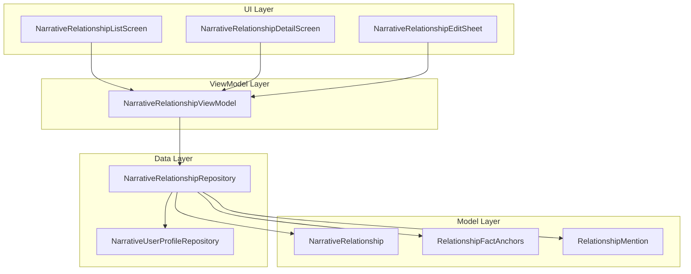
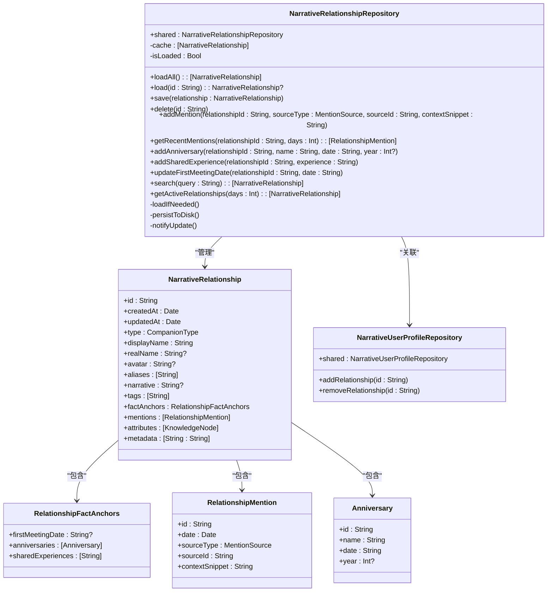
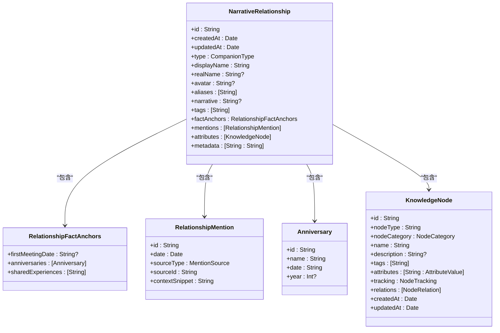
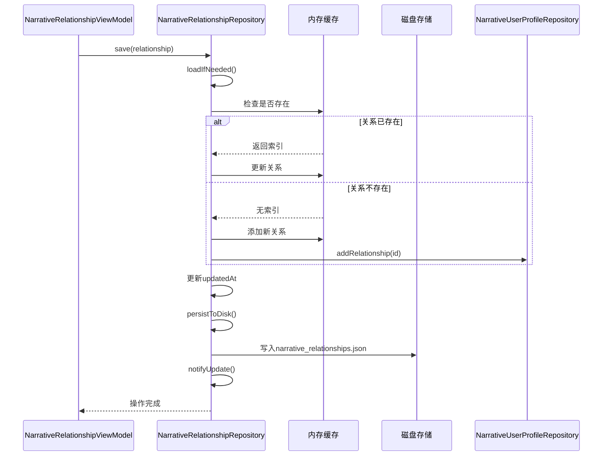
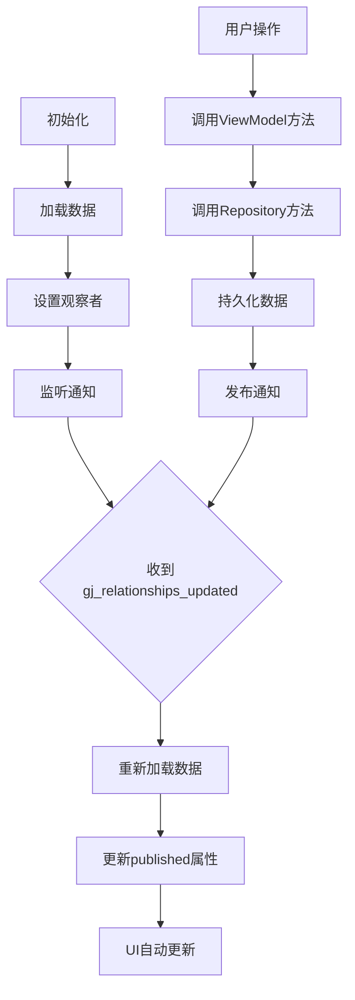
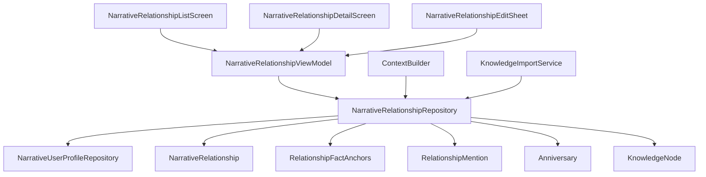

# 关系管理仓库

<cite>
**本文档中引用的文件**  
- [NarrativeRelationshipRepository.swift](file://guanji0.34/DataLayer/Repositories/NarrativeRelationshipRepository.swift)
- [NarrativeRelationshipModels.swift](file://guanji0.34/Core/Models/NarrativeRelationshipModels.swift)
- [NarrativeRelationshipViewModel.swift](file://guanji0.34/Features/Profile/NarrativeRelationshipViewModel.swift)
- [NarrativeRelationshipListScreen.swift](file://guanji0.34/Features/Profile/NarrativeRelationshipListScreen.swift)
- [NarrativeRelationshipEditSheet.swift](file://guanji0.34/Features/Profile/NarrativeRelationshipEditSheet.swift)
- [NarrativeUserProfileRepository.swift](file://guanji0.34/DataLayer/Repositories/NarrativeUserProfileRepository.swift)
- [ContextBuilder.swift](file://guanji0.34/DataLayer/SystemServices/ContextBuilder.swift)
- [KnowledgeNodeModels.swift](file://guanji0.34/Core/Models/KnowledgeNodeModels.swift)
</cite>

## 目录
1. [简介](#简介)
2. [项目结构](#项目结构)
3. [核心组件](#核心组件)
4. [架构概述](#架构概述)
5. [详细组件分析](#详细组件分析)
6. [依赖分析](#依赖分析)
7. [性能考虑](#性能考虑)
8. [故障排除指南](#故障排除指南)
9. [结论](#结论)

## 简介
本文档全面阐述了`NarrativeRelationshipRepository`在用户社交关系网络管理中的作用。该仓库是系统中负责维护用户关系图谱的核心组件，通过叙事性而非评分的方式管理人际关系。文档详细描述了关系模型的数据结构、JSON序列化格式、双向关系处理机制以及图谱遍历算法（如最近联系人排序）。同时涵盖了事务性操作保障、冲突解决策略、隐私权限控制（如关系可见性设置）和与AI功能的集成（如用于个性化对话上下文生成）等关键特性。

## 项目结构
`NarrativeRelationshipRepository`位于数据层的仓库目录中，是管理用户社交关系的核心持久化组件。该仓库与模型、视图模型和UI组件协同工作，形成完整的MVC架构。关系数据以JSON文件形式存储在文档目录中，通过单例模式提供全局访问。

**图源**  
- [NarrativeRelationshipRepository.swift](file://guanji0.34/DataLayer/Repositories/NarrativeRelationshipRepository.swift)
- [NarrativeRelationshipViewModel.swift](file://guanji0.34/Features/Profile/NarrativeRelationshipViewModel.swift)
- [NarrativeRelationshipListScreen.swift](file://guanji0.34/Features/Profile/NarrativeRelationshipListScreen.swift)

## 核心组件
`NarrativeRelationshipRepository`是管理叙事关系持久化的单例类，负责所有与关系数据相关的CRUD操作。该仓库通过内存缓存和磁盘持久化相结合的方式，确保数据访问的高效性和持久性。仓库还负责维护与`NarrativeUserProfileRepository`的关系，确保用户画像与关系网络的一致性。

**节源**  
- [NarrativeRelationshipRepository.swift](file://guanji0.34/DataLayer/Repositories/NarrativeRelationshipRepository.swift)
- [NarrativeRelationshipModels.swift](file://guanji0.34/Core/Models/NarrativeRelationshipModels.swift)

## 架构概述
`NarrativeRelationshipRepository`采用分层架构设计，将数据访问、业务逻辑和持久化机制分离。仓库通过`NotificationCenter`发布更新通知，实现组件间的松耦合通信。关系数据的加载采用懒加载策略，确保应用启动时的性能表现。

**图源**  
- [NarrativeRelationshipRepository.swift](file://guanji0.34/DataLayer/Repositories/NarrativeRelationshipRepository.swift)
- [NarrativeRelationshipModels.swift](file://guanji0.34/Core/Models/NarrativeRelationshipModels.swift)
- [NarrativeUserProfileRepository.swift](file://guanji0.34/DataLayer/Repositories/NarrativeUserProfileRepository.swift)

## 详细组件分析
### 关系模型分析
`NarrativeRelationship`模型采用叙事性设计，摒弃了传统的评分机制，通过事实锚点和提及记录来客观反映关系状态。这种设计避免了主观评分的偏差，提供了更真实的关系表示。

#### 关系模型类图

**图源**  
- [NarrativeRelationshipModels.swift](file://guanji0.34/Core/Models/NarrativeRelationshipModels.swift)
- [KnowledgeNodeModels.swift](file://guanji0.34/Core/Models/KnowledgeNodeModels.swift)

### 仓库操作分析
`NarrativeRelationshipRepository`提供了丰富的API来管理关系数据，包括基本的CRUD操作、提及管理、事实锚点管理和查询操作。

#### 仓库操作序列图

**图源**  
- [NarrativeRelationshipRepository.swift](file://guanji0.34/DataLayer/Repositories/NarrativeRelationshipRepository.swift)
- [NarrativeUserProfileRepository.swift](file://guanji0.34/DataLayer/Repositories/NarrativeUserProfileRepository.swift)

### 视图模型分析
`NarrativeRelationshipViewModel`作为UI与数据仓库之间的桥梁，提供了可观察的属性和计算属性，支持响应式UI更新。

#### 视图模型数据流

**图源**  
- [NarrativeRelationshipViewModel.swift](file://guanji0.34/Features/Profile/NarrativeRelationshipViewModel.swift)
- [NarrativeRelationshipRepository.swift](file://guanji0.34/DataLayer/Repositories/NarrativeRelationshipRepository.swift)

**节源**  
- [NarrativeRelationshipViewModel.swift](file://guanji0.34/Features/Profile/NarrativeRelationshipViewModel.swift)
- [NarrativeRelationshipRepository.swift](file://guanji0.34/DataLayer/Repositories/NarrativeRelationshipRepository.swift)

## 依赖分析
`NarrativeRelationshipRepository`与多个组件存在依赖关系，形成了复杂但清晰的依赖网络。这些依赖关系确保了数据的一致性和系统的可维护性。

**图源**  
- [NarrativeRelationshipRepository.swift](file://guanji0.34/DataLayer/Repositories/NarrativeRelationshipRepository.swift)
- [NarrativeUserProfileRepository.swift](file://guanji0.34/DataLayer/Repositories/NarrativeUserProfileRepository.swift)
- [ContextBuilder.swift](file://guanji0.34/DataLayer/SystemServices/ContextBuilder.swift)

**节源**  
- [NarrativeRelationshipRepository.swift](file://guanji0.34/DataLayer/Repositories/NarrativeRelationshipRepository.swift)
- [NarrativeUserProfileRepository.swift](file://guanji0.34/DataLayer/Repositories/NarrativeUserProfileRepository.swift)
- [ContextBuilder.swift](file://guanji0.34/DataLayer/SystemServices/ContextBuilder.swift)

## 性能考虑
`NarrativeRelationshipRepository`在设计时充分考虑了性能因素，采用了多种优化策略来确保数据访问的高效性。

### 缓存策略
仓库采用内存缓存机制，避免了频繁的磁盘I/O操作。数据在首次加载后会被缓存在内存中，后续访问直接从内存读取，显著提高了访问速度。

### 懒加载
数据加载采用懒加载策略，只有在首次调用加载方法时才会从磁盘读取数据。这避免了应用启动时的性能瓶颈，提高了启动速度。

### 原子写入
数据持久化采用原子写入模式（`.atomic`选项），确保了写入操作的完整性，防止了数据损坏的风险。

### 分页与搜索优化
虽然当前实现中没有显式的分页机制，但通过`search`方法和`getActiveRelationships`方法提供了高效的查询能力，支持用户快速定位特定关系。

**节源**  
- [NarrativeRelationshipRepository.swift](file://guanji0.34/DataLayer/Repositories/NarrativeRelationshipRepository.swift)

## 故障排除指南
### 数据加载失败
如果`NarrativeRelationshipRepository`无法加载数据，通常会在控制台输出错误信息。可能的原因包括：
- 文件路径无效
- JSON格式错误
- 磁盘权限问题

可以通过调用`reload()`方法强制重新加载数据。

### 数据不一致
由于`NarrativeRelationshipRepository`与`NarrativeUserProfileRepository`之间存在双向引用，需要确保两个仓库的数据一致性。当添加或删除关系时，两个仓库会自动同步。

### 通知机制失效
`NarrativeRelationshipRepository`通过`NotificationCenter`发布更新通知。如果UI没有正确更新，检查`NarrativeRelationshipViewModel`中的观察者设置是否正确。

**节源**  
- [NarrativeRelationshipRepository.swift](file://guanji0.34/DataLayer/Repositories/NarrativeRelationshipRepository.swift)
- [NarrativeRelationshipViewModel.swift](file://guanji0.34/Features/Profile/NarrativeRelationshipViewModel.swift)

## 结论
`NarrativeRelationshipRepository`是一个功能完整、设计良好的关系管理组件，通过叙事性而非评分的方式管理用户社交关系。该仓库采用分层架构，具有良好的可维护性和扩展性。通过内存缓存和磁盘持久化的结合，确保了数据访问的高效性和持久性。与AI功能的深度集成，使得关系数据能够为个性化对话提供上下文支持。整体设计体现了现代移动应用开发的最佳实践。