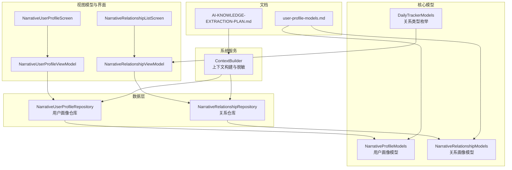
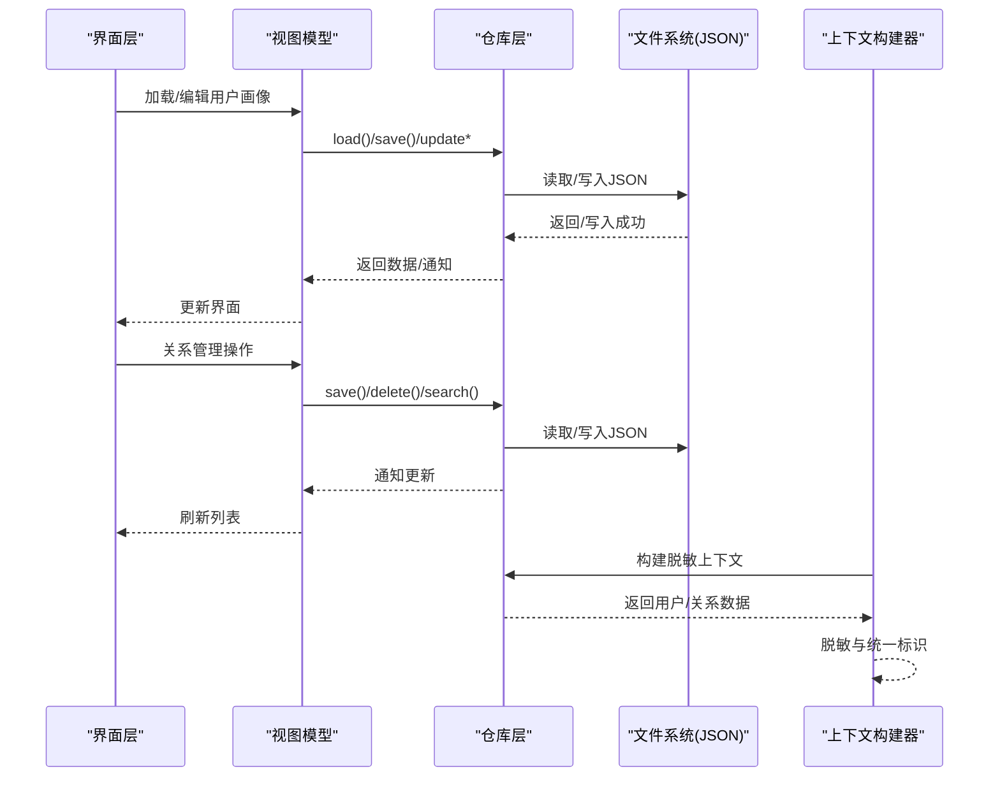
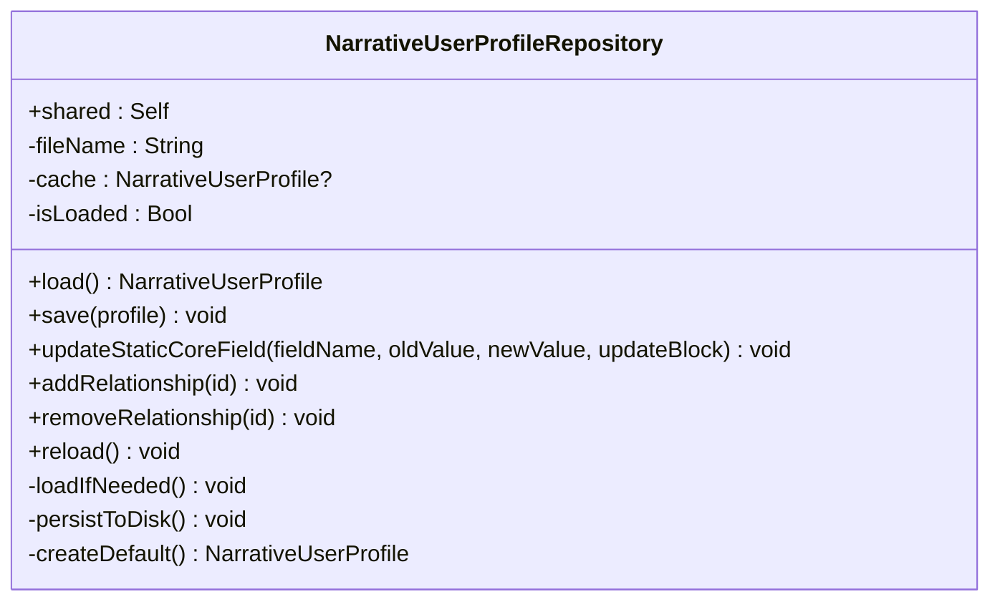
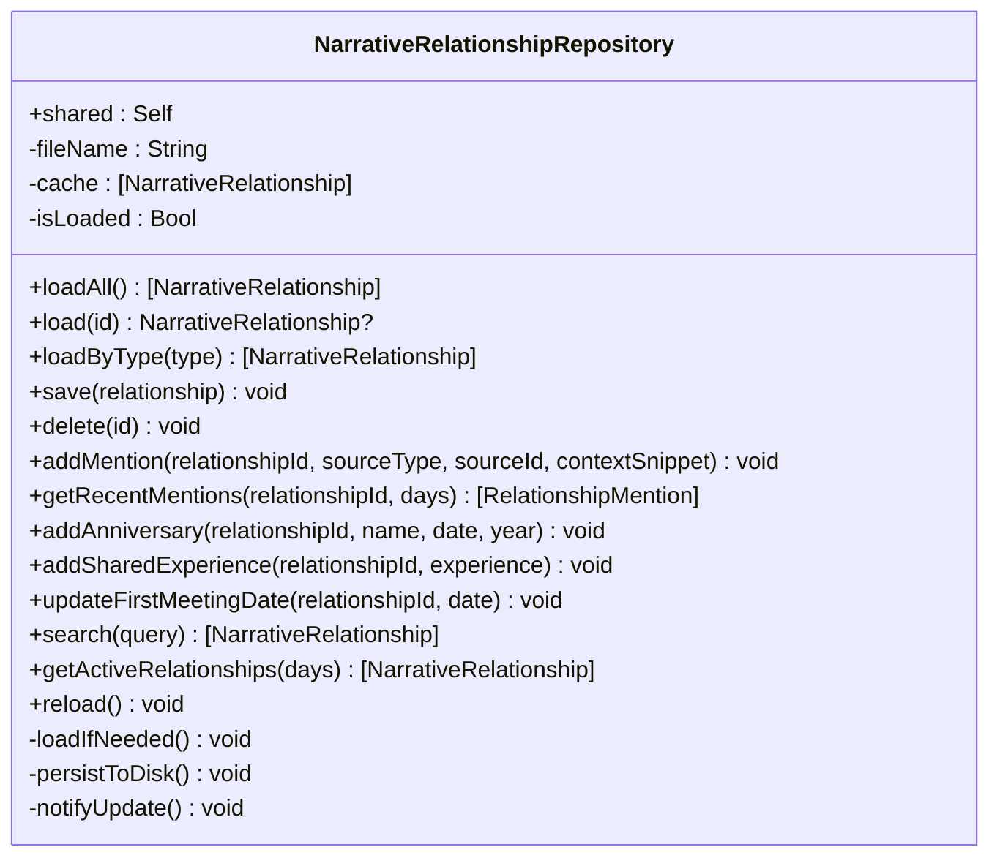
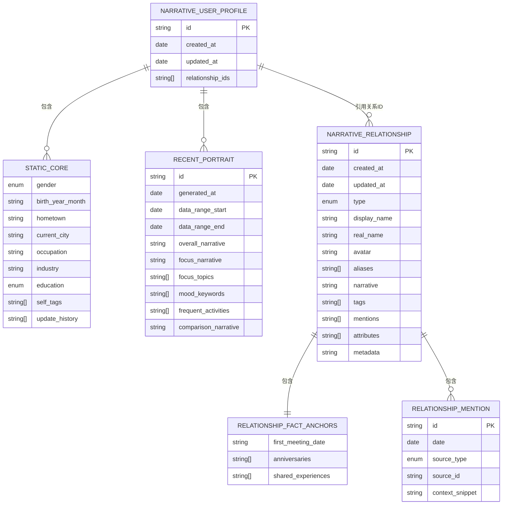
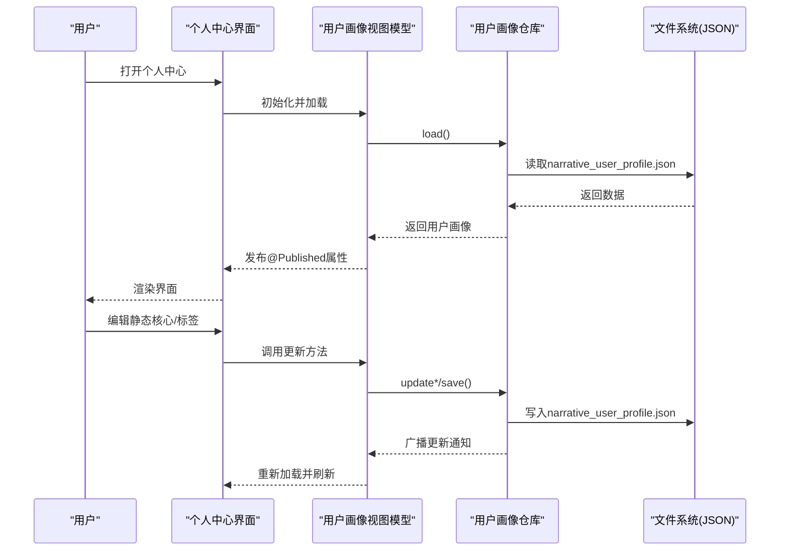
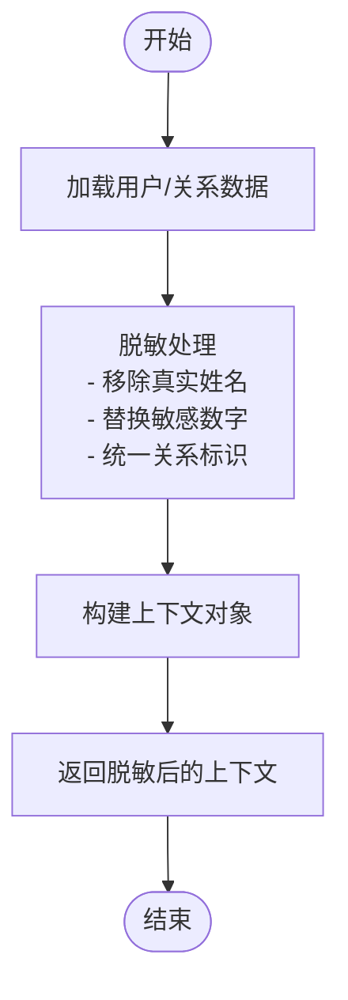
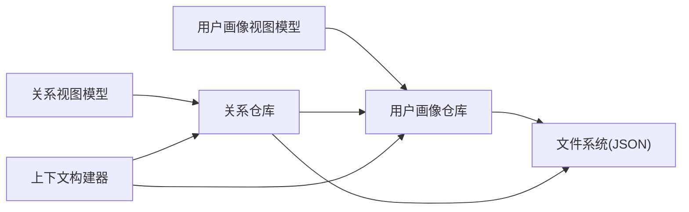

# 用户画像与关系仓库

<cite>
**本文引用的文件**
- [NarrativeUserProfileRepository.swift](file://guanji0.34/DataLayer/Repositories/NarrativeUserProfileRepository.swift)
- [NarrativeRelationshipRepository.swift](file://guanji0.34/DataLayer/Repositories/NarrativeRelationshipRepository.swift)
- [NarrativeProfileModels.swift](file://guanji0.34/Core/Models/NarrativeProfileModels.swift)
- [NarrativeRelationshipModels.swift](file://guanji0.34/Core/Models/NarrativeRelationshipModels.swift)
- [NarrativeUserProfileViewModel.swift](file://guanji0.34/Features/Profile/NarrativeUserProfileViewModel.swift)
- [NarrativeRelationshipViewModel.swift](file://guanji0.34/Features/Profile/NarrativeRelationshipViewModel.swift)
- [NarrativeUserProfileScreen.swift](file://guanji0.34/Features/Profile/NarrativeUserProfileScreen.swift)
- [NarrativeRelationshipListScreen.swift](file://guanji0.34/Features/Profile/NarrativeRelationshipListScreen.swift)
- [ContextBuilder.swift](file://guanji0.34/DataLayer/SystemServices/ContextBuilder.swift)
- [DailyTrackerModels.swift](file://guanji0.34/Core/Models/DailyTrackerModels.swift)
- [user-profile-models.md](file://Docs/data/user-profile-models.md)
- [AI-KNOWLEDGE-EXTRACTION-PLAN.md](file://Docs/architecture/AI-KNOWLEDGE-EXTRACTION-PLAN.md)
</cite>

## 目录
1. [简介](#简介)
2. [项目结构](#项目结构)
3. [核心组件](#核心组件)
4. [架构总览](#架构总览)
5. [详细组件分析](#详细组件分析)
6. [依赖分析](#依赖分析)
7. [性能考量](#性能考量)
8. [故障排查指南](#故障排查指南)
9. [结论](#结论)
10. [附录](#附录)

## 简介
本文件聚焦“用户画像与关系数据仓库”，系统性说明以下内容：
- NarrativeUserProfileRepository 如何管理用户个人画像（静态核心、近期画像、知识节点、AI偏好、关系ID集合）的持久化与读取。
- NarrativeRelationshipRepository 如何维护用户社交关系网络（关系类型、别名、事实锚点、提及记录、动态属性、元数据）。
- 数据模型结构、关系图谱的JSON存储格式与数据验证规则。
- 个人中心界面如何通过仓库加载与更新用户资料；关系管理界面如何操作关系数据。
- 数据一致性保障机制、隐私保护策略（如敏感信息脱敏）与AI对话上下文构建的集成方式。

## 项目结构
围绕用户画像与关系仓库的关键目录与文件如下：
- 数据层仓库：UserProfile与Relationship的持久化实现
- 核心模型：叙事版用户画像与关系画像的数据结构
- 视图模型与界面：个人中心与关系管理的UI逻辑
- 上下文构建：面向AI的知识抽取上下文构建与隐私脱敏
- 文档：模型设计与隐私策略说明

图表来源
- [NarrativeUserProfileRepository.swift](file://guanji0.34/DataLayer/Repositories/NarrativeUserProfileRepository.swift#L1-L131)
- [NarrativeRelationshipRepository.swift](file://guanji0.34/DataLayer/Repositories/NarrativeRelationshipRepository.swift#L1-L201)
- [NarrativeProfileModels.swift](file://guanji0.34/Core/Models/NarrativeProfileModels.swift#L1-L186)
- [NarrativeRelationshipModels.swift](file://guanji0.34/Core/Models/NarrativeRelationshipModels.swift#L1-L194)
- [DailyTrackerModels.swift](file://guanji0.34/Core/Models/DailyTrackerModels.swift#L231-L257)
- [NarrativeUserProfileViewModel.swift](file://guanji0.34/Features/Profile/NarrativeUserProfileViewModel.swift#L1-L194)
- [NarrativeRelationshipViewModel.swift](file://guanji0.34/Features/Profile/NarrativeRelationshipViewModel.swift#L1-L227)
- [NarrativeUserProfileScreen.swift](file://guanji0.34/Features/Profile/NarrativeUserProfileScreen.swift#L1-L473)
- [NarrativeRelationshipListScreen.swift](file://guanji0.34/Features/Profile/NarrativeRelationshipListScreen.swift#L1-L114)
- [ContextBuilder.swift](file://guanji0.34/DataLayer/SystemServices/ContextBuilder.swift#L1-L147)
- [user-profile-models.md](file://Docs/data/user-profile-models.md#L1-L428)
- [AI-KNOWLEDGE-EXTRACTION-PLAN.md](file://Docs/architecture/AI-KNOWLEDGE-EXTRACTION-PLAN.md#L81-L883)

章节来源
- [NarrativeUserProfileRepository.swift](file://guanji0.34/DataLayer/Repositories/NarrativeUserProfileRepository.swift#L1-L131)
- [NarrativeRelationshipRepository.swift](file://guanji0.34/DataLayer/Repositories/NarrativeRelationshipRepository.swift#L1-L201)
- [NarrativeProfileModels.swift](file://guanji0.34/Core/Models/NarrativeProfileModels.swift#L1-L186)
- [NarrativeRelationshipModels.swift](file://guanji0.34/Core/Models/NarrativeRelationshipModels.swift#L1-L194)
- [NarrativeUserProfileViewModel.swift](file://guanji0.34/Features/Profile/NarrativeUserProfileViewModel.swift#L1-L194)
- [NarrativeRelationshipViewModel.swift](file://guanji0.34/Features/Profile/NarrativeRelationshipViewModel.swift#L1-L227)
- [NarrativeUserProfileScreen.swift](file://guanji0.34/Features/Profile/NarrativeUserProfileScreen.swift#L1-L473)
- [NarrativeRelationshipListScreen.swift](file://guanji0.34/Features/Profile/NarrativeRelationshipListScreen.swift#L1-L114)
- [ContextBuilder.swift](file://guanji0.34/DataLayer/SystemServices/ContextBuilder.swift#L1-L147)
- [DailyTrackerModels.swift](file://guanji0.34/Core/Models/DailyTrackerModels.swift#L231-L257)
- [user-profile-models.md](file://Docs/data/user-profile-models.md#L1-L428)
- [AI-KNOWLEDGE-EXTRACTION-PLAN.md](file://Docs/architecture/AI-KNOWLEDGE-EXTRACTION-PLAN.md#L81-L883)

## 核心组件
- 用户画像仓库（UserProfileRepository）
  - 负责用户画像的加载、保存、字段级更新（带历史记录）、关系ID集合维护、强制重载。
  - 采用单例模式，基于文档目录下的JSON文件进行持久化，使用ISO8601日期编码策略。
- 关系仓库（RelationshipRepository）
  - 负责关系的CRUD、按类型查询、提及记录管理、事实锚点（初次相遇、纪念日、共同经历）维护、活跃关系查询、搜索。
  - 与用户画像仓库联动：新增关系时自动同步到用户画像的关系ID集合；删除关系时同步移除。
  - 采用单例模式，基于文档目录下的JSON文件进行持久化，使用ISO8601日期编码策略。
- 视图模型
  - 用户画像视图模型：封装静态核心字段更新、标签管理、更新历史、最近画像展示等。
  - 关系视图模型：封装关系列表、按类型分组、搜索、提及统计、动态属性（知识节点）管理等。
- 上下文构建器
  - 构建面向AI的知识抽取上下文，自动脱敏敏感字段（如真实姓名、地址等），生成统一的关系引用标识符，确保隐私与一致性。

章节来源
- [NarrativeUserProfileRepository.swift](file://guanji0.34/DataLayer/Repositories/NarrativeUserProfileRepository.swift#L1-L131)
- [NarrativeRelationshipRepository.swift](file://guanji0.34/DataLayer/Repositories/NarrativeRelationshipRepository.swift#L1-L201)
- [NarrativeUserProfileViewModel.swift](file://guanji0.34/Features/Profile/NarrativeUserProfileViewModel.swift#L1-L194)
- [NarrativeRelationshipViewModel.swift](file://guanji0.34/Features/Profile/NarrativeRelationshipViewModel.swift#L1-L227)
- [ContextBuilder.swift](file://guanji0.34/DataLayer/SystemServices/ContextBuilder.swift#L1-L147)

## 架构总览
用户画像与关系仓库的整体交互如下：

图表来源
- [NarrativeUserProfileRepository.swift](file://guanji0.34/DataLayer/Repositories/NarrativeUserProfileRepository.swift#L20-L85)
- [NarrativeRelationshipRepository.swift](file://guanji0.34/DataLayer/Repositories/NarrativeRelationshipRepository.swift#L21-L67)
- [ContextBuilder.swift](file://guanji0.34/DataLayer/SystemServices/ContextBuilder.swift#L20-L36)

## 详细组件分析

### 用户画像仓库（UserProfileRepository）
- 职责
  - 加载用户画像（默认创建）、保存、字段级更新（带历史记录）、关系ID集合维护、强制重载。
  - 保存时自动更新时间戳，并通过通知广播更新事件。
- 数据持久化
  - 文件名：narrative_user_profile.json
  - 存储位置：应用文档目录
  - 编码策略：ISO8601日期编码
- 关键方法
  - load(): 加载或创建默认用户画像
  - save(profile): 保存并广播更新
  - updateStaticCoreField(fieldName, oldValue, newValue, updateBlock): 字段级更新并记录历史
  - addRelationship/removeRelationship: 维护关系ID集合
  - reload(): 强制从磁盘重载
- 错误处理
  - 加载/保存失败时打印错误日志，避免崩溃

图表来源
- [NarrativeUserProfileRepository.swift](file://guanji0.34/DataLayer/Repositories/NarrativeUserProfileRepository.swift#L4-L128)

章节来源
- [NarrativeUserProfileRepository.swift](file://guanji0.34/DataLayer/Repositories/NarrativeUserProfileRepository.swift#L1-L131)

### 关系仓库（RelationshipRepository）
- 职责
  - 加载全部/按ID/按类型关系；保存（创建或更新）；删除；按天数查询近期提及；搜索；维护事实锚点与别名。
  - 与用户画像仓库联动：新增关系时同步加入用户画像的关系ID集合；删除关系时同步移除。
  - 通过通知广播关系更新事件。
- 数据持久化
  - 文件名：narrative_relationships.json
  - 存储位置：应用文档目录
  - 编码策略：ISO8601日期编码
- 关键方法
  - loadAll()/load(id)/loadByType(type)
  - save(relationship)/delete(id)
  - addMention/getRecentMentions
  - addAnniversary/addSharedExperience/updateFirstMeetingDate
  - search(query)/getActiveRelationships(days)
  - reload()

图表来源
- [NarrativeRelationshipRepository.swift](file://guanji0.34/DataLayer/Repositories/NarrativeRelationshipRepository.swift#L4-L198)

章节来源
- [NarrativeRelationshipRepository.swift](file://guanji0.34/DataLayer/Repositories/NarrativeRelationshipRepository.swift#L1-L201)

### 数据模型结构
- 用户画像（NarrativeUserProfile）
  - 标识、创建/更新时间
  - 静态核心（StaticCore）：性别、出生年月、家乡、当前城市、职业、行业、教育、自标签、更新历史
  - 近期画像（RecentPortrait）：AI生成的叙事摘要、关键词、活动频率、对比描述
  - 动态知识节点（KnowledgeNode[]）：技能、价值观、目标、性格、兴趣等
  - AI偏好（AIPreferences?）
  - 关系ID集合（relationshipIds）
- 关系画像（NarrativeRelationship）
  - 标识、创建/更新时间
  - 基本身份：关系类型、显示名、真实姓名（可选，文档中注明加密）、头像
  - 别名（aliases）：用于AI识别同一人的不同称呼
  - 叙述（narrative）与标签（tags）
  - 事实锚点（RelationshipFactAnchors）：初次相遇日期、纪念日、共同经历
  - 提及记录（RelationshipMention[]）：来源类型、来源ID、上下文片段
  - 动态属性（attributes：KnowledgeNode[]）：关系状态、互动模式、情感连接等
  - 元数据（metadata：字符串键值）

图表来源
- [NarrativeProfileModels.swift](file://guanji0.34/Core/Models/NarrativeProfileModels.swift#L24-L63)
- [NarrativeProfileModels.swift](file://guanji0.34/Core/Models/NarrativeProfileModels.swift#L69-L107)
- [NarrativeProfileModels.swift](file://guanji0.34/Core/Models/NarrativeProfileModels.swift#L139-L180)
- [NarrativeRelationshipModels.swift](file://guanji0.34/Core/Models/NarrativeRelationshipModels.swift#L6-L68)
- [NarrativeRelationshipModels.swift](file://guanji0.34/Core/Models/NarrativeRelationshipModels.swift#L84-L97)
- [NarrativeRelationshipModels.swift](file://guanji0.34/Core/Models/NarrativeRelationshipModels.swift#L125-L144)

章节来源
- [NarrativeProfileModels.swift](file://guanji0.34/Core/Models/NarrativeProfileModels.swift#L1-L186)
- [NarrativeRelationshipModels.swift](file://guanji0.34/Core/Models/NarrativeRelationshipModels.swift#L1-L194)

### 关系类型与别名机制
- 关系类型（CompanionType）
  - 预设七种关系类型：alone、partner、family、friends、colleagues、online_friends、pet
  - 提供图标与本地化键
- 别名（aliases）
  - 用于AI识别同一人的不同称呼，如“妈妈”、“母亲”、“那个女人”
  - allNames与matches方法支持统一识别与匹配

章节来源
- [DailyTrackerModels.swift](file://guanji0.34/Core/Models/DailyTrackerModels.swift#L234-L257)
- [NarrativeRelationshipModels.swift](file://guanji0.34/Core/Models/NarrativeRelationshipModels.swift#L180-L191)

### 个人中心界面与关系管理界面
- 个人中心界面（NarrativeUserProfileScreen）
  - 展示静态核心、自标签、关系星图、近期画像
  - 提供编辑静态核心字段与添加/删除自标签
  - 与用户画像视图模型绑定，响应仓库更新通知
- 关系管理界面（NarrativeRelationshipListScreen）
  - 展示全部关系，支持搜索、删除、跳转详情
  - 与关系视图模型绑定，响应仓库更新通知

图表来源
- [NarrativeUserProfileScreen.swift](file://guanji0.34/Features/Profile/NarrativeUserProfileScreen.swift#L15-L53)
- [NarrativeUserProfileViewModel.swift](file://guanji0.34/Features/Profile/NarrativeUserProfileViewModel.swift#L20-L32)
- [NarrativeUserProfileRepository.swift](file://guanji0.34/DataLayer/Repositories/NarrativeUserProfileRepository.swift#L22-L38)

章节来源
- [NarrativeUserProfileScreen.swift](file://guanji0.34/Features/Profile/NarrativeUserProfileScreen.swift#L1-L473)
- [NarrativeUserProfileViewModel.swift](file://guanji0.34/Features/Profile/NarrativeUserProfileViewModel.swift#L1-L194)
- [NarrativeRelationshipListScreen.swift](file://guanji0.34/Features/Profile/NarrativeRelationshipListScreen.swift#L1-L114)
- [NarrativeRelationshipViewModel.swift](file://guanji0.34/Features/Profile/NarrativeRelationshipViewModel.swift#L1-L227)

### 数据一致性保障与隐私保护
- 数据一致性
  - 统一人物标识符：将真实姓名统一为“[REL_ID:displayName]”形式，确保AI识别同一人时不重复建模。
  - 别名机制：aliases支持多称呼识别，避免同人异名导致的分裂。
- 隐私保护
  - 脱敏策略：构建上下文时移除敏感字段（如真实姓名、地址），并对敏感数字（手机号、身份证、邮箱、银行卡）进行占位替换。
  - 统一标识：未知人物标记为“[UNKNOWN_PERSON:原名]”，已知关系统一为“[REL_ID:displayName]”。

图表来源
- [ContextBuilder.swift](file://guanji0.34/DataLayer/SystemServices/ContextBuilder.swift#L106-L145)
- [AI-KNOWLEDGE-EXTRACTION-PLAN.md](file://Docs/architecture/AI-KNOWLEDGE-EXTRACTION-PLAN.md#L421-L460)
- [AI-KNOWLEDGE-EXTRACTION-PLAN.md](file://Docs/architecture/AI-KNOWLEDGE-EXTRACTION-PLAN.md#L624-L663)

章节来源
- [ContextBuilder.swift](file://guanji0.34/DataLayer/SystemServices/ContextBuilder.swift#L1-L147)
- [AI-KNOWLEDGE-EXTRACTION-PLAN.md](file://Docs/architecture/AI-KNOWLEDGE-EXTRACTION-PLAN.md#L81-L883)

### 与AI对话上下文构建的集成
- 上下文构建器（ContextBuilder）
  - 根据请求类型构建用户画像与关系画像的脱敏版本
  - 将关系画像转换为统一引用格式（如“[REL_001:妈妈]”），便于AI识别与更新
  - 对叙事内容进行脱敏，避免泄露真实身份
- 集成要点
  - 用户画像：移除敏感字段（如hometown、currentCity），保留性别、职业、教育、自标签、知识节点摘要、AI偏好摘要
  - 关系画像：移除真实姓名，保留显示名、别名、标签、事实锚点摘要、动态属性摘要

章节来源
- [ContextBuilder.swift](file://guanji0.34/DataLayer/SystemServices/ContextBuilder.swift#L20-L36)
- [ContextBuilder.swift](file://guanji0.34/DataLayer/SystemServices/ContextBuilder.swift#L41-L80)
- [ContextBuilder.swift](file://guanji0.34/DataLayer/SystemServices/ContextBuilder.swift#L85-L102)
- [ContextBuilder.swift](file://guanji0.34/DataLayer/SystemServices/ContextBuilder.swift#L106-L145)

## 依赖分析
- 组件耦合
  - 关系仓库与用户画像仓库存在直接协作：新增/删除关系时同步更新用户画像的关系ID集合
  - 视图模型依赖仓库，仓库依赖模型与文件系统
  - 上下文构建器同时依赖用户画像与关系画像仓库，用于构建脱敏上下文
- 外部依赖
  - JSON序列化/反序列化（Codable）
  - 通知中心（NotificationCenter）用于跨组件通信
  - 日期编码策略（ISO8601）

图表来源
- [NarrativeUserProfileViewModel.swift](file://guanji0.34/Features/Profile/NarrativeUserProfileViewModel.swift#L15-L32)
- [NarrativeRelationshipViewModel.swift](file://guanji0.34/Features/Profile/NarrativeRelationshipViewModel.swift#L16-L51)
- [NarrativeUserProfileRepository.swift](file://guanji0.34/DataLayer/Repositories/NarrativeUserProfileRepository.swift#L50-L78)
- [NarrativeRelationshipRepository.swift](file://guanji0.34/DataLayer/Repositories/NarrativeRelationshipRepository.swift#L40-L66)
- [ContextBuilder.swift](file://guanji0.34/DataLayer/SystemServices/ContextBuilder.swift#L11-L15)

章节来源
- [NarrativeUserProfileViewModel.swift](file://guanji0.34/Features/Profile/NarrativeUserProfileViewModel.swift#L1-L194)
- [NarrativeRelationshipViewModel.swift](file://guanji0.34/Features/Profile/NarrativeRelationshipViewModel.swift#L1-L227)
- [NarrativeUserProfileRepository.swift](file://guanji0.34/DataLayer/Repositories/NarrativeUserProfileRepository.swift#L1-L131)
- [NarrativeRelationshipRepository.swift](file://guanji0.34/DataLayer/Repositories/NarrativeRelationshipRepository.swift#L1-L201)
- [ContextBuilder.swift](file://guanji0.34/DataLayer/SystemServices/ContextBuilder.swift#L1-L147)

## 性能考量
- 缓存策略
  - 仓库内部维护内存缓存与加载标志，避免重复磁盘IO
- 序列化策略
  - 使用ISO8601日期编码，保证跨平台一致性
- 查询优化
  - 关系仓库提供按类型过滤、按天数筛选近期提及、全文检索等方法，满足常见查询场景
- 通知机制
  - 通过通知实现UI与仓库的解耦更新，减少不必要的重绘

## 故障排查指南
- 加载/保存失败
  - 现象：控制台打印“Failed to load/save”
  - 排查：检查文件权限、磁盘空间、JSON格式合法性
  - 修复：调用reload()强制重载；必要时重建默认数据
- 数据不一致
  - 现象：新增关系后用户画像未显示；删除关系后仍残留
  - 排查：确认仓库保存/删除流程是否正确调用用户画像仓库的add/removeRelationship
  - 修复：检查save/delete与用户画像仓库的联动逻辑
- UI未刷新
  - 现象：修改后界面未更新
  - 排查：确认通知名称是否正确、观察者是否注册
  - 修复：检查NotificationCenter的发布/订阅

章节来源
- [NarrativeUserProfileRepository.swift](file://guanji0.34/DataLayer/Repositories/NarrativeUserProfileRepository.swift#L98-L107)
- [NarrativeRelationshipRepository.swift](file://guanji0.34/DataLayer/Repositories/NarrativeRelationshipRepository.swift#L166-L177)
- [NarrativeUserProfileViewModel.swift](file://guanji0.34/Features/Profile/NarrativeUserProfileViewModel.swift#L25-L32)
- [NarrativeRelationshipViewModel.swift](file://guanji0.34/Features/Profile/NarrativeRelationshipViewModel.swift#L44-L51)

## 结论
本仓库以“叙事版用户画像与关系画像”为核心，结合通用知识节点与别名机制，实现了可验证、可扩展、可自动化的个人与关系数据管理。通过单例仓库、内存缓存、通知驱动与JSON持久化，保证了易用性与可靠性。配合上下文构建器的隐私脱敏与统一标识策略，有效平衡了隐私保护与AI语义理解需求。未来可在知识节点置信度、动态属性扩展与批量导入导出等方面持续演进。

## 附录
- JSON存储格式
  - 用户画像文件：narrative_user_profile.json
  - 关系文件：narrative_relationships.json
  - 编码策略：ISO8601日期编码
- 数据验证规则
  - 关系类型：CompanionType枚举限定
  - 提及记录：日期必填、来源类型枚举
  - 事实锚点：日期格式YYYY-MM-DD或YYYY-MM
  - 别名：去重、大小写不敏感匹配
- 代码示例路径
  - 用户画像加载与更新：[NarrativeUserProfileViewModel.swift](file://guanji0.34/Features/Profile/NarrativeUserProfileViewModel.swift#L20-L58)
  - 关系管理操作：[NarrativeRelationshipViewModel.swift](file://guanji0.34/Features/Profile/NarrativeRelationshipViewModel.swift#L89-L116)
  - 个人中心界面：[NarrativeUserProfileScreen.swift](file://guanji0.34/Features/Profile/NarrativeUserProfileScreen.swift#L15-L53)
  - 关系列表界面：[NarrativeRelationshipListScreen.swift](file://guanji0.34/Features/Profile/NarrativeRelationshipListScreen.swift#L13-L48)
  - 上下文构建与脱敏：[ContextBuilder.swift](file://guanji0.34/DataLayer/SystemServices/ContextBuilder.swift#L20-L36)