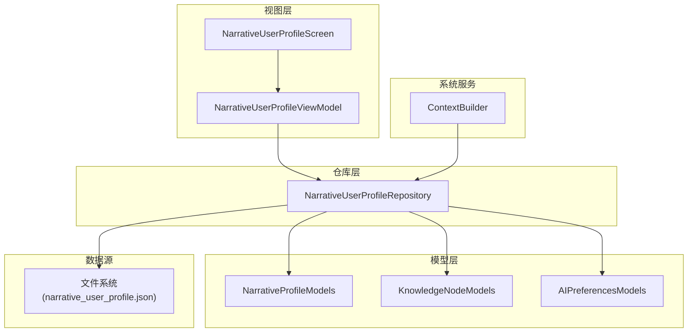
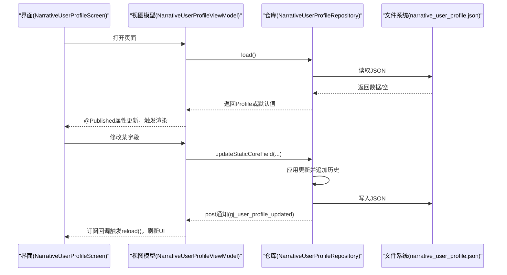
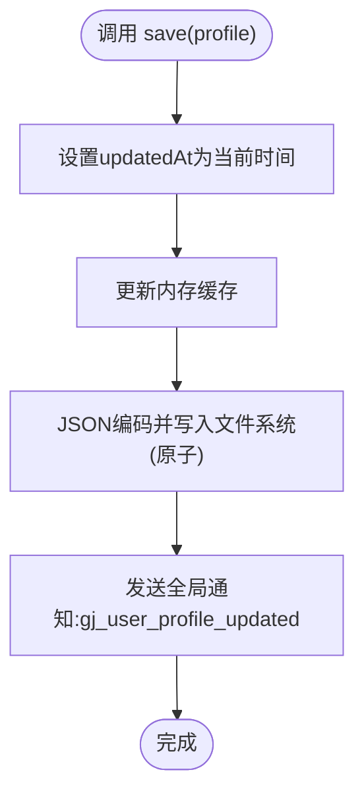
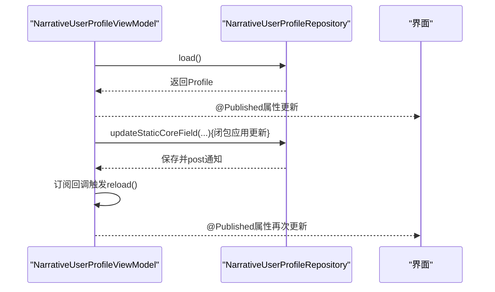
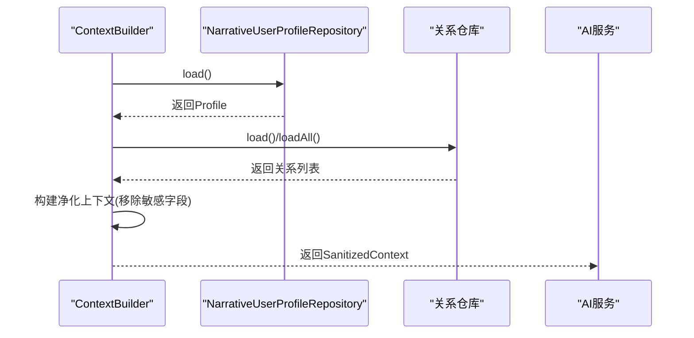
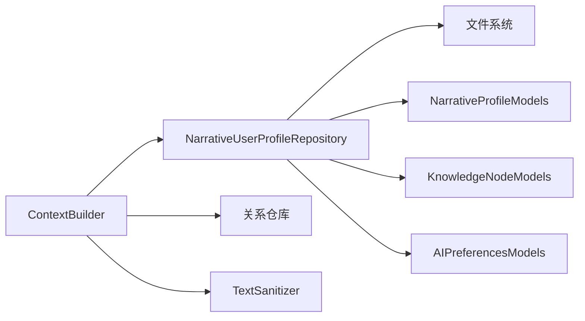
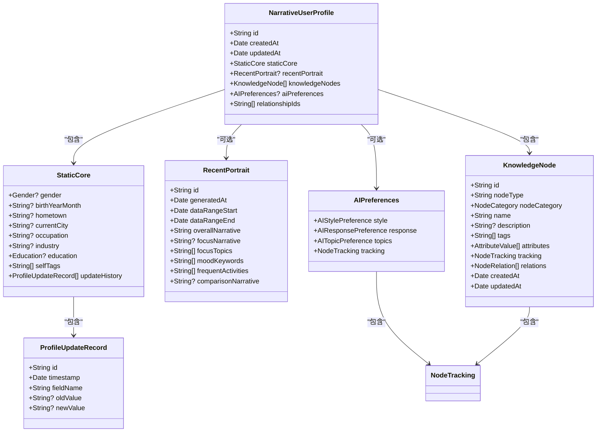

# 用户画像仓库

<cite>
**本文引用的文件**
- [NarrativeUserProfileRepository.swift](file://guanji0.34/DataLayer/Repositories/NarrativeUserProfileRepository.swift)
- [NarrativeProfileModels.swift](file://guanji0.34/Core/Models/NarrativeProfileModels.swift)
- [NarrativeUserProfileViewModel.swift](file://guanji0.34/Features/Profile/NarrativeUserProfileViewModel.swift)
- [ProfileViewModel.swift](file://guanji0.34/Features/Profile/ProfileViewModel.swift)
- [NarrativeUserProfileScreen.swift](file://guanji0.34/Features/Profile/NarrativeUserProfileScreen.swift)
- [AIPreferencesModels.swift](file://guanji0.34/Core/Models/AIPreferencesModels.swift)
- [KnowledgeNodeModels.swift](file://guanji0.34/Core/Models/KnowledgeNodeModels.swift)
- [ContextBuilder.swift](file://guanji0.34/DataLayer/SystemServices/ContextBuilder.swift)
- [user-profile-models.md](file://Docs/data/user-profile-models.md)
- [ProfileInsightModelsTests.swift](file://Tests/ProfileInsightModelsTests.swift)
</cite>

## 目录
1. [简介](#简介)
2. [项目结构](#项目结构)
3. [核心组件](#核心组件)
4. [架构总览](#架构总览)
5. [详细组件分析](#详细组件分析)
6. [依赖关系分析](#依赖关系分析)
7. [性能考量](#性能考量)
8. [故障排查指南](#故障排查指南)
9. [结论](#结论)
10. [附录](#附录)

## 简介
本文件围绕 NarrativeUserProfileRepository 的技术实现进行深入说明，重点阐述其作为用户画像数据访问层的核心职责与行为边界。文档覆盖以下方面：
- 用户画像数据模型结构与属性类型映射
- 增删改查操作的实现细节与数据验证规则
- 默认值初始化逻辑与持久化策略
- 与底层数据源（文件系统）的交互机制
- 与上层 ViewModel 的协作方式（Combine 发布者驱动 UI 刷新）
- 与 AI 上下文构建服务的数据共享与隐私保护
- 异常处理流程、性能优化建议与单元测试覆盖要点

## 项目结构
与用户画像仓库直接相关的模块分布如下：
- 数据层仓库：NarrativeUserProfileRepository
- 核心模型：NarrativeProfileModels（包含用户画像、静态核心、近期画像、更新记录等）
- 视图模型：NarrativeUserProfileViewModel（负责加载、更新与通知）
- 视图：NarrativeUserProfileScreen（展示与编辑）
- AI 偏好与知识节点模型：AIPreferencesModels、KnowledgeNodeModels
- 上下文构建服务：ContextBuilder（用于生成 AI 知识抽取的“净化”上下文）
- 文档：user-profile-models.md（模型设计与使用说明）

图表来源
- [NarrativeUserProfileRepository.swift](file://guanji0.34/DataLayer/Repositories/NarrativeUserProfileRepository.swift#L1-L131)
- [NarrativeProfileModels.swift](file://guanji0.34/Core/Models/NarrativeProfileModels.swift#L1-L186)
- [NarrativeUserProfileViewModel.swift](file://guanji0.34/Features/Profile/NarrativeUserProfileViewModel.swift#L1-L194)
- [NarrativeUserProfileScreen.swift](file://guanji0.34/Features/Profile/NarrativeUserProfileScreen.swift#L1-L473)
- [AIPreferencesModels.swift](file://guanji0.34/Core/Models/AIPreferencesModels.swift#L1-L203)
- [KnowledgeNodeModels.swift](file://guanji0.34/Core/Models/KnowledgeNodeModels.swift#L1-L707)
- [ContextBuilder.swift](file://guanji0.34/DataLayer/SystemServices/ContextBuilder.swift#L1-L147)

章节来源
- [NarrativeUserProfileRepository.swift](file://guanji0.34/DataLayer/Repositories/NarrativeUserProfileRepository.swift#L1-L131)
- [NarrativeProfileModels.swift](file://guanji0.34/Core/Models/NarrativeProfileModels.swift#L1-L186)
- [NarrativeUserProfileViewModel.swift](file://guanji0.34/Features/Profile/NarrativeUserProfileViewModel.swift#L1-L194)
- [NarrativeUserProfileScreen.swift](file://guanji0.34/Features/Profile/NarrativeUserProfileScreen.swift#L1-L473)
- [AIPreferencesModels.swift](file://guanji0.34/Core/Models/AIPreferencesModels.swift#L1-L203)
- [KnowledgeNodeModels.swift](file://guanji0.34/Core/Models/KnowledgeNodeModels.swift#L1-L707)
- [ContextBuilder.swift](file://guanji0.34/DataLayer/SystemServices/ContextBuilder.swift#L1-L147)

## 核心组件
- NarrativeUserProfileRepository：单例仓库，负责用户画像的加载、保存、字段级更新与关系管理；使用文件系统持久化，提供本地缓存与通知机制。
- NarrativeProfileModels：定义用户画像主结构、静态核心、近期画像、更新记录等核心数据模型。
- NarrativeUserProfileViewModel：MVVM 中的 ViewModel，订阅仓库更新通知，暴露发布属性驱动 UI，封装字段更新与标签管理。
- ContextBuilder：面向 AI 服务的上下文构建器，基于用户画像生成“净化”后的上下文，避免敏感信息泄露。
- AIPreferencesModels、KnowledgeNodeModels：支撑用户画像的动态知识节点与对话偏好，用于 AI 上下文与个性化交互。

章节来源
- [NarrativeUserProfileRepository.swift](file://guanji0.34/DataLayer/Repositories/NarrativeUserProfileRepository.swift#L1-L131)
- [NarrativeProfileModels.swift](file://guanji0.34/Core/Models/NarrativeProfileModels.swift#L21-L186)
- [NarrativeUserProfileViewModel.swift](file://guanji0.34/Features/Profile/NarrativeUserProfileViewModel.swift#L1-L194)
- [ContextBuilder.swift](file://guanji0.34/DataLayer/SystemServices/ContextBuilder.swift#L1-L147)
- [AIPreferencesModels.swift](file://guanji0.34/Core/Models/AIPreferencesModels.swift#L1-L203)
- [KnowledgeNodeModels.swift](file://guanji0.34/Core/Models/KnowledgeNodeModels.swift#L1-L707)

## 架构总览
仓库层通过单一文件进行持久化，结合内存缓存与通知机制，向上层提供一致的读写接口。上层 ViewModel 通过 Combine 订阅通知实现 UI 自动刷新；ContextBuilder 在需要与 AI 服务交互时，从仓库读取用户画像并生成净化上下文，确保隐私安全。

图表来源
- [NarrativeUserProfileRepository.swift](file://guanji0.34/DataLayer/Repositories/NarrativeUserProfileRepository.swift#L21-L85)
- [NarrativeUserProfileViewModel.swift](file://guanji0.34/Features/Profile/NarrativeUserProfileViewModel.swift#L20-L32)
- [NarrativeUserProfileScreen.swift](file://guanji0.34/Features/Profile/NarrativeUserProfileScreen.swift#L5-L53)

## 详细组件分析

### 数据模型与属性映射
- NarrativeUserProfile：包含唯一标识、创建/更新时间、静态核心、近期画像、动态知识节点、AI 偏好、关系 ID 列表等。
- StaticCore：静态核心信息，包含性别、出生年月、家乡、当前城市、职业、行业、教育、自标签数组、更新历史。
- RecentPortrait：近期画像（占位），包含叙事摘要、关键词、活动等。
- ProfileUpdateRecord：字段更新记录，包含字段名、旧值、新值、时间戳。
- AIPreferences：AI 对话偏好，包含风格、回复、话题偏好与追踪信息。
- KnowledgeNode：通用知识节点，支持多类型属性值、关系、追踪与变更历史。

章节来源
- [NarrativeProfileModels.swift](file://guanji0.34/Core/Models/NarrativeProfileModels.swift#L23-L180)
- [AIPreferencesModels.swift](file://guanji0.34/Core/Models/AIPreferencesModels.swift#L6-L31)
- [KnowledgeNodeModels.swift](file://guanji0.34/Core/Models/KnowledgeNodeModels.swift#L7-L60)

### 仓库职责与实现要点
- 加载与缓存：首次加载时从文件系统读取 JSON，解码为用户画像；若失败则返回空缓存并记录错误；后续重复调用直接返回缓存。
- 保存与通知：保存时更新 updatedAt，写入文件系统，使用原子写入保证一致性；完成后发送全局通知，触发 UI 刷新。
- 字段级更新：提供 updateStaticCoreField 方法，支持对静态核心字段进行更新并记录历史；内部通过闭包应用更新，保证事务性。
- 关系管理：提供添加/移除关系 ID 的便捷方法，避免重复。
- 强制重载：提供 reload 方法，清空加载标记后重新从磁盘加载。

图表来源
- [NarrativeUserProfileRepository.swift](file://guanji0.34/DataLayer/Repositories/NarrativeUserProfileRepository.swift#L27-L38)

章节来源
- [NarrativeUserProfileRepository.swift](file://guanji0.34/DataLayer/Repositories/NarrativeUserProfileRepository.swift#L21-L127)

### 与 ViewModel 的协作与 UI 刷新
- ViewModel 初始化时加载仓库中的用户画像，并订阅全局通知“gj_user_profile_updated”，收到通知后主动 reload，从而驱动 @Published 属性触发 UI 刷新。
- ViewModel 提供多个字段更新入口（如性别、出生年月、家乡、职业、行业、教育），均通过仓库的 updateStaticCoreField 完成，确保历史记录与一致性。
- 标签管理：addSelfTag/removeSelfTag 直接修改并保存，随后 reload 刷新。

图表来源
- [NarrativeUserProfileViewModel.swift](file://guanji0.34/Features/Profile/NarrativeUserProfileViewModel.swift#L20-L32)
- [NarrativeUserProfileRepository.swift](file://guanji0.34/DataLayer/Repositories/NarrativeUserProfileRepository.swift#L40-L63)

章节来源
- [NarrativeUserProfileViewModel.swift](file://guanji0.34/Features/Profile/NarrativeUserProfileViewModel.swift#L1-L194)

### 与 AI 上下文构建的数据共享与隐私保护
- ContextBuilder 从仓库读取用户画像，构建“净化”后的上下文：移除真实姓名、家乡、当前城市等敏感字段，保留性别、出生年月、职业、行业、教育、自标签、知识节点摘要与 AI 偏好摘要。
- 关系画像同样进行净化处理，移除真实姓名，保留引用标记、别名、叙事摘要、属性摘要与事实锚点（如存在）。

图表来源
- [ContextBuilder.swift](file://guanji0.34/DataLayer/SystemServices/ContextBuilder.swift#L20-L102)
- [NarrativeUserProfileRepository.swift](file://guanji0.34/DataLayer/Repositories/NarrativeUserProfileRepository.swift#L21-L25)

章节来源
- [ContextBuilder.swift](file://guanji0.34/DataLayer/SystemServices/ContextBuilder.swift#L1-L147)

### 数据验证规则与默认值初始化
- 默认值：用户画像构造函数提供默认参数，包括 id、createdAt、updatedAt、静态核心、知识节点、AI 偏好、关系 ID 列表等，确保首次使用无需外部注入。
- 验证规则（来自知识节点模型）：节点 id、nodeType、name 必须非空；置信度应在 0.0~1.0；时间戳 createdAt ≤ updatedAt。
- 字段长度与格式：仓库层面未显式限制字符串长度；静态核心字段为可选字符串，由上层视图控制输入格式（例如出生年月格式）。

章节来源
- [NarrativeProfileModels.swift](file://guanji0.34/Core/Models/NarrativeProfileModels.swift#L45-L63)
- [KnowledgeNodeModels.swift](file://guanji0.34/Core/Models/KnowledgeNodeModels.swift#L666-L706)

### 具体调用示例（路径指引）
- ProfileViewModel 如何调用仓库方法加载和更新用户资料（路径指引）：
  - 加载与保存：参考 [NarrativeUserProfileRepository.swift](file://guanji0.34/DataLayer/Repositories/NarrativeUserProfileRepository.swift#L21-L38)
  - 字段级更新：参考 [NarrativeUserProfileRepository.swift](file://guanji0.34/DataLayer/Repositories/NarrativeUserProfileRepository.swift#L40-L63)
  - 关系管理：参考 [NarrativeUserProfileRepository.swift](file://guanji0.34/DataLayer/Repositories/NarrativeUserProfileRepository.swift#L65-L79)
  - 强制重载：参考 [NarrativeUserProfileRepository.swift](file://guanji0.34/DataLayer/Repositories/NarrativeUserProfileRepository.swift#L81-L85)
- ViewModel 如何驱动 UI 刷新（路径指引）：
  - 订阅通知与 reload：参考 [NarrativeUserProfileViewModel.swift](file://guanji0.34/Features/Profile/NarrativeUserProfileViewModel.swift#L25-L32)
  - 字段更新入口：参考 [NarrativeUserProfileViewModel.swift](file://guanji0.34/Features/Profile/NarrativeUserProfileViewModel.swift#L46-L137)
  - 标签管理：参考 [NarrativeUserProfileViewModel.swift](file://guanji0.34/Features/Profile/NarrativeUserProfileViewModel.swift#L139-L155)

## 依赖关系分析
- 仓库依赖：
  - 文件系统：通过文档目录定位 JSON 文件，使用 ISO8601 日期编码策略。
  - 通知中心：保存后发出全局通知，供 ViewModel 订阅。
- 模型依赖：
  - 用户画像依赖静态核心、近期画像、知识节点、AI 偏好。
  - 知识节点依赖属性值、追踪信息、变更历史、关系等。
- 上下文构建依赖：
  - 依赖仓库读取用户画像，依赖关系仓库读取关系画像，依赖文本净化器进行敏感信息处理。

图表来源
- [NarrativeUserProfileRepository.swift](file://guanji0.34/DataLayer/Repositories/NarrativeUserProfileRepository.swift#L1-L131)
- [ContextBuilder.swift](file://guanji0.34/DataLayer/SystemServices/ContextBuilder.swift#L1-L147)

章节来源
- [NarrativeUserProfileRepository.swift](file://guanji0.34/DataLayer/Repositories/NarrativeUserProfileRepository.swift#L1-L131)
- [ContextBuilder.swift](file://guanji0.34/DataLayer/SystemServices/ContextBuilder.swift#L1-L147)

## 性能考量
- 懒加载与缓存：仓库在首次加载后缓存用户画像，避免重复 IO；可通过 reload 强制刷新。
- 原子写入：保存时使用原子写入，降低损坏风险并提升可靠性。
- 批量更新建议：对于频繁字段更新，建议合并为一次 save 调用，减少通知与 IO 次数。
- 大对象序列化：JSON 编码策略使用 ISO8601，适合跨平台传输；注意大型知识节点集合的序列化成本。
- UI 刷新：通过通知驱动 ViewModel reload，建议在高频更新场景下考虑节流或合并刷新。

[本节为通用性能建议，不直接分析具体文件]

## 故障排查指南
- 加载失败：仓库在加载失败时打印错误并返回空缓存；检查文件是否存在、权限是否正确、JSON 是否合法。
- 保存失败：保存失败时打印错误；检查磁盘空间、写入权限、文件锁定状态。
- UI 不刷新：确认 ViewModel 是否正确订阅通知名称“gj_user_profile_updated”，以及是否在回调中调用 reload。
- 上下文构建异常：检查 ContextBuilder 的请求类型与 ID 是否有效，确保仓库与关系仓库可正常加载数据。

章节来源
- [NarrativeUserProfileRepository.swift](file://guanji0.34/DataLayer/Repositories/NarrativeUserProfileRepository.swift#L98-L120)
- [NarrativeUserProfileViewModel.swift](file://guanji0.34/Features/Profile/NarrativeUserProfileViewModel.swift#L25-L32)

## 结论
NarrativeUserProfileRepository 以简洁的单例仓库模式实现了用户画像的持久化与一致性管理，结合内存缓存与通知机制，为上层 ViewModel 提供稳定的数据访问能力。通过 ContextBuilder 的“净化”上下文输出，既满足了 AI 服务对用户画像的需求，又有效保护了敏感信息。建议在高频更新场景下进行批量更新与 UI 刷新的优化，并完善单元测试覆盖以保障数据完整性与隐私安全。

[本节为总结性内容，不直接分析具体文件]

## 附录

### 数据模型类图（代码级）

图表来源
- [NarrativeProfileModels.swift](file://guanji0.34/Core/Models/NarrativeProfileModels.swift#L23-L180)
- [AIPreferencesModels.swift](file://guanji0.34/Core/Models/AIPreferencesModels.swift#L6-L31)
- [KnowledgeNodeModels.swift](file://guanji0.34/Core/Models/KnowledgeNodeModels.swift#L7-L60)

### 单元测试覆盖要点（与用户画像仓库相关）
- 仓库加载/保存：验证 load/save 的成功与失败分支，检查缓存命中与通知发送。
- 字段级更新：验证 updateStaticCoreField 的历史记录追加、闭包应用与保存流程。
- 关系管理：验证 addRelationship/removeRelationship 的幂等性与保存。
- 上下文构建：验证 ContextBuilder 在不同请求类型下的输出，确保敏感字段被移除。
- 模型编码/解码：参考 ProfileInsightModelsTests 中的 Codable 测试思路，对用户画像模型进行等价测试。

章节来源
- [ProfileInsightModelsTests.swift](file://Tests/ProfileInsightModelsTests.swift#L1-L389)
- [user-profile-models.md](file://Docs/data/user-profile-models.md#L1-L428)