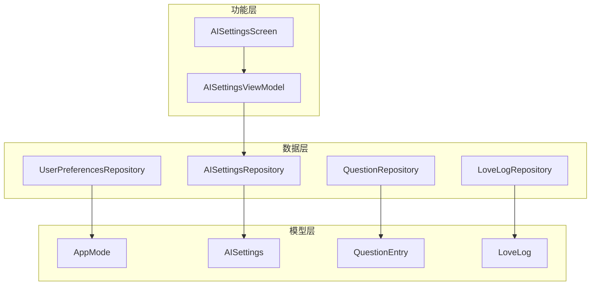
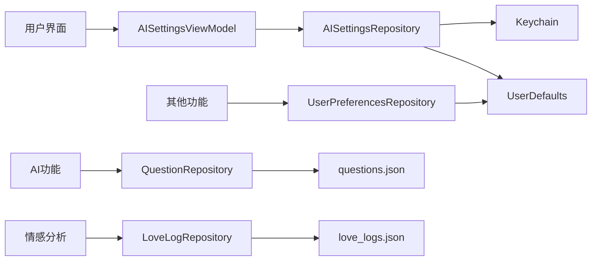
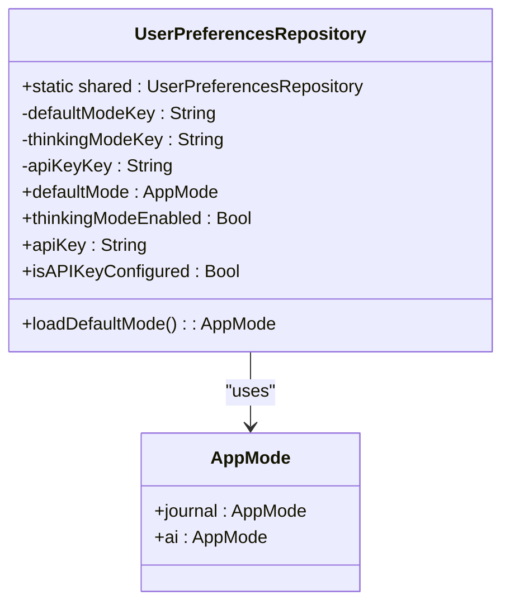
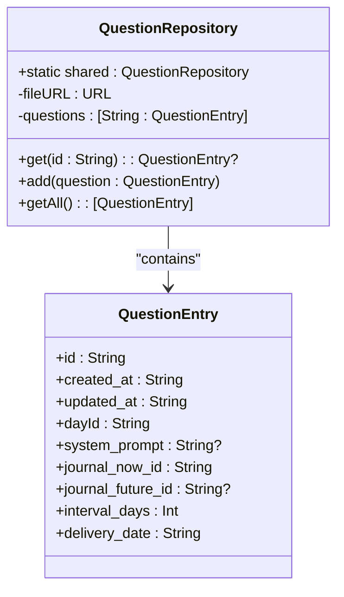
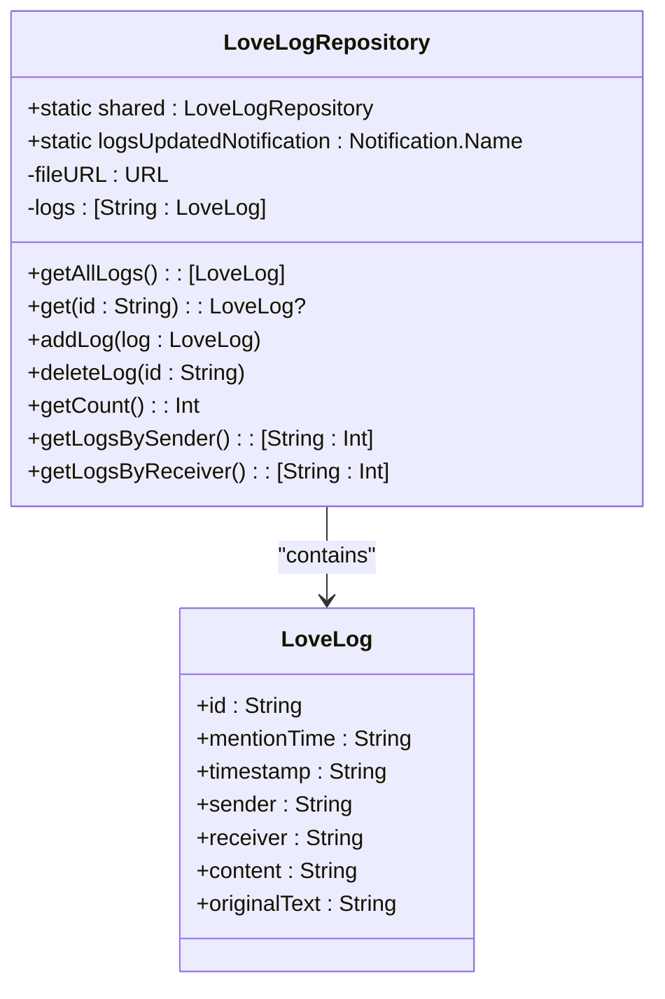

# 通用设置与偏好仓库

<cite>
**本文档引用的文件**
- [UserPreferencesRepository.swift](file://guanji0.34/DataLayer/Repositories/UserPreferencesRepository.swift)
- [QuestionRepository.swift](file://guanji0.34/DataLayer/Repositories/QuestionRepository.swift)
- [LoveLogRepository.swift](file://guanji0.34/DataLayer/Repositories/LoveLogRepository.swift)
- [AISettingsRepository.swift](file://guanji0.34/DataLayer/Repositories/AISettingsRepository.swift)
- [AISettingsModels.swift](file://guanji0.34/Core/Models/AISettingsModels.swift)
- [AIPreferencesModels.swift](file://guanji0.34/Core/Models/AIPreferencesModels.swift)
- [AISettingsScreen.swift](file://guanji0.34/Features/Profile/AISettingsScreen.swift)
- [AISettingsViewModel.swift](file://guanji0.34/Features/Profile/AISettingsViewModel.swift)
- [MockDataService.swift](file://guanji0.34/DataLayer/DataSources/MockDataService.swift)
- [AIConversationModels.swift](file://guanji0.34/Core/Models/AIConversationModels.swift)
</cite>

## 目录
1. [简介](#简介)
2. [项目结构](#项目结构)
3. [核心组件](#核心组件)
4. [架构概述](#架构概述)
5. [详细组件分析](#详细组件分析)
6. [依赖分析](#依赖分析)
7. [性能考虑](#性能考虑)
8. [故障排除指南](#故障排除指南)
9. [结论](#结论)

## 简介
本文档详细说明了“观己”应用中通用设置与偏好数据仓库的实现。重点涵盖三个核心仓库：UserPreferencesRepository、QuestionRepository 和 LoveLogRepository。文档将阐述这些仓库如何管理用户偏好、预设问题库和情感日志数据的持久化，包括其轻量级JSON存储方案、数据迁移策略和默认值处理机制。同时，文档将解释数据完整性校验、备份恢复流程以及与其他核心模块（如AI服务）的依赖关系。

## 项目结构
项目采用MVVM架构模式，数据层（DataLayer）中的Repositories目录包含了所有数据仓库的实现。UserPreferencesRepository使用UserDefaults进行简单偏好设置的存储，而QuestionRepository和LoveLogRepository则使用文件系统中的JSON文件进行更复杂数据结构的持久化。这种分层设计确保了数据访问的统一性和可维护性。



**图表来源**
- [UserPreferencesRepository.swift](file://guanji0.34/DataLayer/Repositories/UserPreferencesRepository.swift)
- [QuestionRepository.swift](file://guanji0.34/DataLayer/Repositories/QuestionRepository.swift)
- [LoveLogRepository.swift](file://guanji0.34/DataLayer/Repositories/LoveLogRepository.swift)
- [AISettingsRepository.swift](file://guanji0.34/DataLayer/Repositories/AISettingsRepository.swift)

**章节来源**
- [UserPreferencesRepository.swift](file://guanji0.34/DataLayer/Repositories/UserPreferencesRepository.swift)
- [QuestionRepository.swift](file://guanji0.34/DataLayer/Repositories/QuestionRepository.swift)
- [LoveLogRepository.swift](file://guanji0.34/DataLayer/Repositories/LoveLogRepository.swift)

## 核心组件
本节深入分析UserPreferencesRepository、QuestionRepository和LoveLogRepository这三个核心数据仓库的实现细节。

**章节来源**
- [UserPreferencesRepository.swift](file://guanji0.34/DataLayer/Repositories/UserPreferencesRepository.swift#L1-L70)
- [QuestionRepository.swift](file://guanji0.34/DataLayer/Repositories/QuestionRepository.swift#L1-L52)
- [LoveLogRepository.swift](file://guanji0.34/DataLayer/Repositories/LoveLogRepository.swift#L1-L99)

## 架构概述
系统架构遵循单一职责原则，每个仓库负责特定类型数据的持久化。UserPreferencesRepository通过UserDefaults提供快速、简单的键值存储，适用于布尔值和字符串等基本类型。QuestionRepository和LoveLogRepository则通过管理独立的JSON文件，实现了对复杂对象集合的持久化，支持数据的增删改查（CRUD）操作。AISettingsRepository作为一个更高级的设置仓库，结合了UserDefaults和Keychain，为API密钥等敏感信息提供了更安全的存储方案。



**图表来源**
- [AISettingsRepository.swift](file://guanji0.34/DataLayer/Repositories/AISettingsRepository.swift)
- [UserPreferencesRepository.swift](file://guanji0.34/DataLayer/Repositories/UserPreferencesRepository.swift)
- [QuestionRepository.swift](file://guanji0.34/DataLayer/Repositories/QuestionRepository.swift)
- [LoveLogRepository.swift](file://guanji0.34/DataLayer/Repositories/LoveLogRepository.swift)

## 详细组件分析
本节将对每个数据仓库进行详细的分析，包括其数据模型、持久化机制和公共API。

### UserPreferencesRepository 分析
UserPreferencesRepository是一个单例类，负责管理应用级的用户偏好设置，如默认模式和AI思考模式的启用状态。

#### 数据模型与持久化
该仓库使用`UserDefaults`作为其持久化后端。它定义了几个私有的键（如`defaultModeKey`和`thinkingModeKey`）来存储不同的偏好项。`defaultMode`属性的getter方法会从`UserDefaults`中读取原始值，并尝试将其转换为`AppMode`枚举。如果读取失败或值不存在，则返回默认值`.journal`，这体现了其默认值处理机制。



**图表来源**
- [UserPreferencesRepository.swift](file://guanji0.34/DataLayer/Repositories/UserPreferencesRepository.swift#L6-L70)
- [AIConversationModels.swift](file://guanji0.34/Core/Models/AIConversationModels.swift#L5-L8)

**章节来源**
- [UserPreferencesRepository.swift](file://guanji0.34/DataLayer/Repositories/UserPreferencesRepository.swift#L1-L70)

### QuestionRepository 分析
QuestionRepository负责存储和管理预设问题库以及用户自定义的问题。

#### 数据模型与持久化
该仓库使用一个私有的`[String: QuestionEntry]`字典来缓存所有问题。数据持久化通过一个名为`questions.json`的JSON文件实现，该文件存储在应用的文档目录下的`TimelineData`子目录中。初始化时，仓库会尝试从文件加载数据，如果文件不存在或为空，则会使用`MockDataService`中的预设数据进行“播种”（seed），这确保了应用始终有一组基础问题可用。



**图表来源**
- [QuestionRepository.swift](file://guanji0.34/DataLayer/Repositories/QuestionRepository.swift#L3-L52)
- [AuxiliaryModels.swift](file://guanji0.34/Core/Models/AuxiliaryModels.swift#L3-L34)
- [MockDataService.swift](file://guanji0.34/DataLayer/DataSources/MockDataService.swift#L53-L72)

**章节来源**
- [QuestionRepository.swift](file://guanji0.34/DataLayer/Repositories/QuestionRepository.swift#L1-L52)

### LoveLogRepository 分析
LoveLogRepository专门用于持久化用户的情感日志数据。

#### 数据模型与持久化
与QuestionRepository类似，LoveLogRepository也使用一个私有的`[String: LoveLog]`字典进行内存缓存，并通过名为`love_logs.json`的JSON文件进行持久化。其`save()`方法在后台队列中异步执行，以避免阻塞主线程。此外，该仓库在数据更新时会通过`NotificationCenter`发布一个名为`gj_love_logs_updated`的通知，这为其他模块提供了响应数据变化的机制。



**图表来源**
- [LoveLogRepository.swift](file://guanji0.34/DataLayer/Repositories/LoveLogRepository.swift#L5-L99)
- [AuxiliaryModels.swift](file://guanji0.34/Core/Models/AuxiliaryModels.swift#L37-L45)

**章节来源**
- [LoveLogRepository.swift](file://guanji0.34/DataLayer/Repositories/LoveLogRepository.swift#L1-L99)

## 依赖分析
各数据仓库之间存在明确的依赖关系。AISettingsRepository在更新设置时，会同步`UserPreferencesRepository`中的`thinkingModeEnabled`值，以确保向后兼容性。`DailyExtractionService`在生成每日报告时，会依赖`LoveLogRepository`来提取当天的情感日志数据。`TimelineViewModel`在创建新的时间胶囊条目时，会调用`QuestionRepository`来添加新的问题。这些依赖关系构成了应用数据流的基础。

```mermaid
graph TD
AISettingsRepository --> UserPreferencesRepository : "同步思考模式"
DailyExtractionService --> LoveLogRepository : "提取日志"
TimelineViewModel --> QuestionRepository : "添加问题"
AISettingsViewModel --> AISettingsRepository : "保存设置"
AISettingsScreen --> AISettingsViewModel : "用户交互"
```

**图表来源**
- [AISettingsRepository.swift](file://guanji0.34/DataLayer/Repositories/AISettingsRepository.swift#L54-L56)
- [DailyExtractionService.swift](file://guanji0.34/DataLayer/SystemServices/DailyExtractionService.swift#L129-L130)
- [TimelineViewModel.swift](file://guanji0.34/Features/Timeline/TimelineViewModel.swift#L709)

**章节来源**
- [AISettingsRepository.swift](file://guanji0.34/DataLayer/Repositories/AISettingsRepository.swift#L1-L136)
- [DailyExtractionService.swift](file://guanji0.34/DataLayer/SystemServices/DailyExtractionService.swift#L100-L139)
- [TimelineViewModel.swift](file://guanji0.34/Features/Timeline/TimelineViewModel.swift#L698-L723)

## 性能考虑
为了优化性能，QuestionRepository和LoveLogRepository都将数据加载到内存中，并在后台线程执行写入操作。这确保了UI的流畅性。UserPreferencesRepository使用`UserDefaults`，其读写操作非常轻量，适合频繁访问的简单偏好设置。AISettingsRepository还引入了缓存机制（`cachedSettings`），避免了每次获取设置时都进行磁盘或Keychain的读取，从而提高了访问速度。

## 故障排除指南
当遇到设置无法保存或数据丢失的问题时，应首先检查相关JSON文件的路径和权限。对于`AISettingsRepository`，需要确认Keychain访问是否正常。如果`QuestionRepository`或`LoveLogRepository`的`seed()`方法未能正确执行，可能导致数据为空，此时应检查`MockDataService`的初始化和数据完整性。此外，由于`save()`方法是异步的，应确保在应用终止前给予足够的时间完成写入。

**章节来源**
- [QuestionRepository.swift](file://guanji0.34/DataLayer/Repositories/QuestionRepository.swift#L24-L30)
- [LoveLogRepository.swift](file://guanji0.34/DataLayer/Repositories/LoveLogRepository.swift#L31-L38)
- [AISettingsRepository.swift](file://guanji0.34/DataLayer/Repositories/AISettingsRepository.swift#L19-L20)

## 结论
UserPreferencesRepository、QuestionRepository和LoveLogRepository共同构成了“观己”应用的通用设置与偏好数据管理核心。它们通过合理的设计模式和持久化策略，有效地分离了不同数据类型的管理职责。UserPreferencesRepository适用于简单的键值偏好，而基于文件的仓库则为更复杂的数据结构提供了灵活且可扩展的解决方案。AISettingsRepository的引入，展示了如何通过组合不同的存储技术（UserDefaults + Keychain）来满足更高级的安全和功能需求。整体设计清晰、高效，为应用的稳定运行提供了坚实的数据基础。