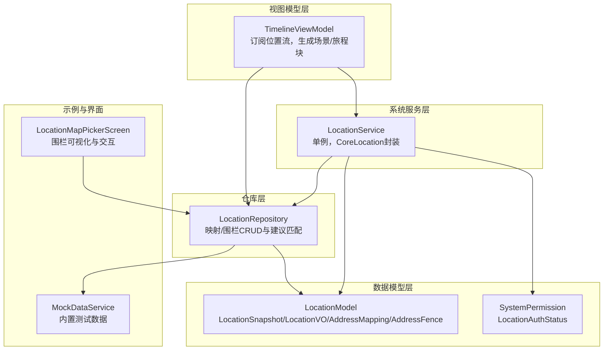
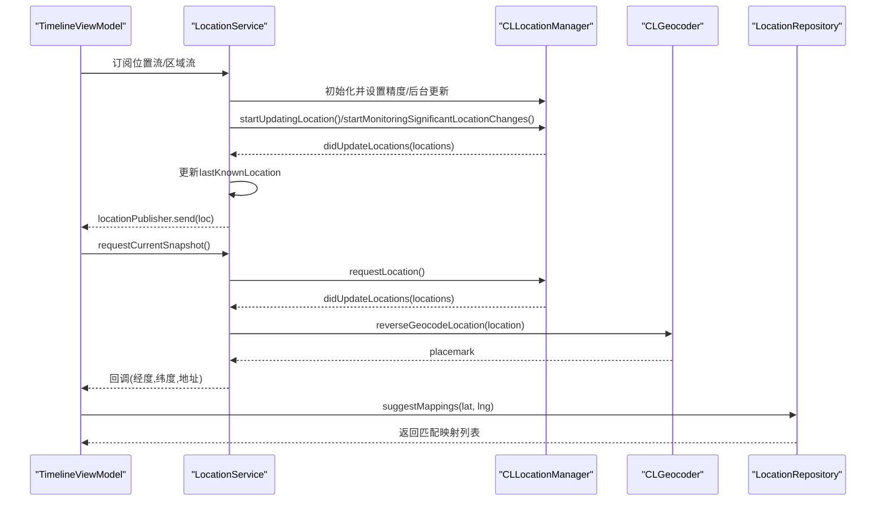
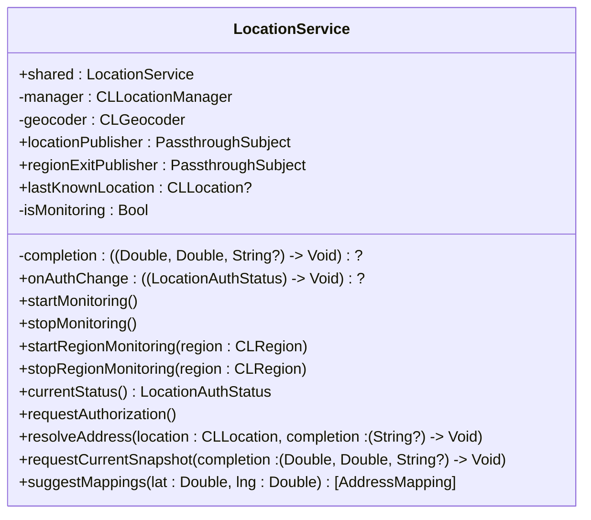
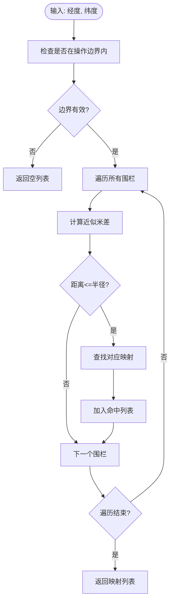
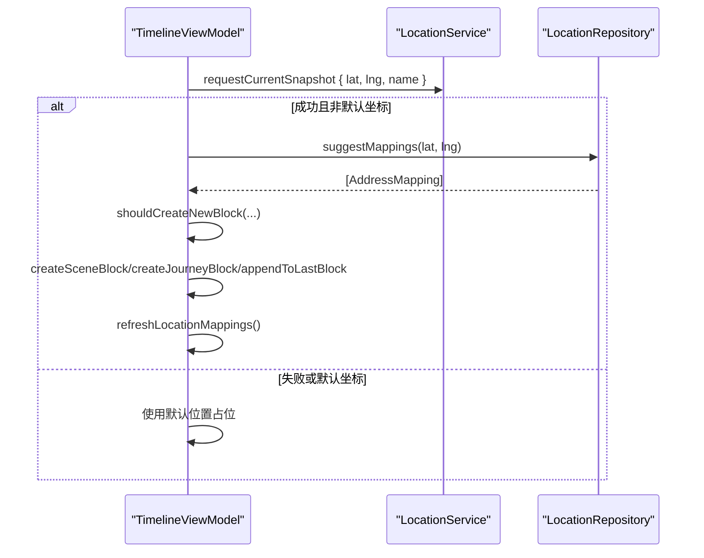
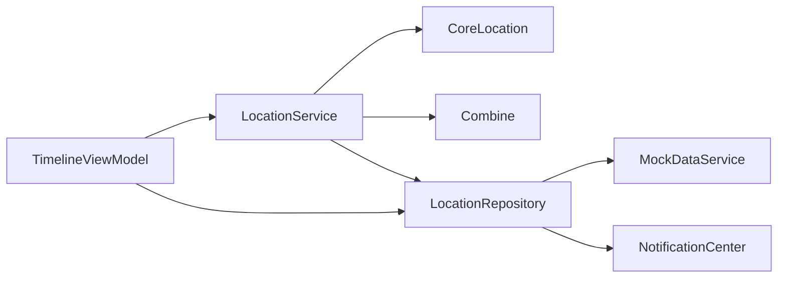

# 位置服务

<cite>
**本文引用的文件**
- [LocationService.swift](file://guanji0.34/DataLayer/SystemServices/LocationService.swift)
- [LocationModel.swift](file://guanji0.34/Core/Models/LocationModel.swift)
- [LocationRepository.swift](file://guanji0.34/DataLayer/Repositories/LocationRepository.swift)
- [TimelineViewModel.swift](file://guanji0.34/Features/Timeline/TimelineViewModel.swift)
- [SystemPermission.swift](file://guanji0.34/Core/Models/SystemPermission.swift)
- [MockDataService.swift](file://guanji0.34/DataLayer/DataSources/MockDataService.swift)
- [LocationMapPickerScreen.swift](file://guanji0.34/Features/Profile/LocationMapPickerScreen.swift)
</cite>

## 目录
1. [简介](#简介)
2. [项目结构](#项目结构)
3. [核心组件](#核心组件)
4. [架构总览](#架构总览)
5. [详细组件分析](#详细组件分析)
6. [依赖关系分析](#依赖关系分析)
7. [性能考量](#性能考量)
8. [故障排查指南](#故障排查指南)
9. [结论](#结论)
10. [附录](#附录)

## 简介
本文件系统性阐述位置服务的设计与实现，重点围绕单例 LocationService 如何管理 CoreLocation 的 GPS 定位、逆地理编码与区域监控；解释 locationPublisher 与 regionExitPublisher 如何通过 Combine 实现响应式编程；梳理 startMonitoring 与 requestCurrentSnapshot 等核心方法的工作机制；给出定位精度与后台定位的最佳实践；提供 TimelineViewModel 中订阅位置更新的实际路径与错误处理策略；并说明围栏监控的使用场景与 suggestMappings 的匹配逻辑。

## 项目结构
位置服务相关代码分布于以下模块：
- 系统服务层：LocationService（单例，封装 CoreLocation）
- 数据模型层：LocationModel（位置、围栏、映射等数据结构）
- 仓库层：LocationRepository（地点映射与围栏的持久化与查询）
- 视图模型层：TimelineViewModel（订阅位置流并驱动时间线）
- 权限模型：SystemPermission（授权状态枚举）
- 示例数据：MockDataService（内置测试数据）
- 地图选择器：LocationMapPickerScreen（围栏可视化与交互）

图表来源
- [LocationService.swift](file://guanji0.34/DataLayer/SystemServices/LocationService.swift#L1-L146)
- [LocationModel.swift](file://guanji0.34/Core/Models/LocationModel.swift#L1-L76)
- [LocationRepository.swift](file://guanji0.34/DataLayer/Repositories/LocationRepository.swift#L1-L170)
- [TimelineViewModel.swift](file://guanji0.34/Features/Timeline/TimelineViewModel.swift#L1-L1005)
- [SystemPermission.swift](file://guanji0.34/Core/Models/SystemPermission.swift#L1-L8)
- [MockDataService.swift](file://guanji0.34/DataLayer/DataSources/MockDataService.swift#L1-L212)
- [LocationMapPickerScreen.swift](file://guanji0.34/Features/Profile/LocationMapPickerScreen.swift#L1-L464)

章节来源
- [LocationService.swift](file://guanji0.34/DataLayer/SystemServices/LocationService.swift#L1-L146)
- [LocationModel.swift](file://guanji0.34/Core/Models/LocationModel.swift#L1-L76)
- [LocationRepository.swift](file://guanji0.34/DataLayer/Repositories/LocationRepository.swift#L1-L170)
- [TimelineViewModel.swift](file://guanji0.34/Features/Timeline/TimelineViewModel.swift#L1-L1005)
- [SystemPermission.swift](file://guanji0.34/Core/Models/SystemPermission.swift#L1-L8)
- [MockDataService.swift](file://guanji0.34/DataLayer/DataSources/MockDataService.swift#L1-L212)
- [LocationMapPickerScreen.swift](file://guanji0.34/Features/Profile/LocationMapPickerScreen.swift#L1-L464)

## 核心组件
- 单例 LocationService：负责定位初始化、权限管理、持续定位与区域监控、逆地理编码、发布位置与区域事件。
- LocationRepository：维护用户自定义的地点映射与围栏，提供建议匹配与数据校验。
- TimelineViewModel：订阅位置流，根据围栏与距离变化生成场景/旅程块，并刷新 UI。
- LocationModel：定义位置快照、显示文本、围栏与映射等数据结构。
- SystemPermission：定义授权状态枚举，用于统一授权状态判断。
- MockDataService：提供内置测试数据，便于演示围栏与映射效果。
- LocationMapPickerScreen：地图界面用于可视化围栏与交互式设置围栏。

章节来源
- [LocationService.swift](file://guanji0.34/DataLayer/SystemServices/LocationService.swift#L1-L146)
- [LocationRepository.swift](file://guanji0.34/DataLayer/Repositories/LocationRepository.swift#L1-L170)
- [TimelineViewModel.swift](file://guanji0.34/Features/Timeline/TimelineViewModel.swift#L1-L1005)
- [LocationModel.swift](file://guanji0.34/Core/Models/LocationModel.swift#L1-L76)
- [SystemPermission.swift](file://guanji0.34/Core/Models/SystemPermission.swift#L1-L8)
- [MockDataService.swift](file://guanji0.34/DataLayer/DataSources/MockDataService.swift#L1-L212)
- [LocationMapPickerScreen.swift](file://guanji0.34/Features/Profile/LocationMapPickerScreen.swift#L1-L464)

## 架构总览
LocationService 作为单例，内部持有 CLLocationManager 与 CLGeocoder，通过 Combine 的 PassthroughSubject 发布位置与区域事件。TimelineViewModel 订阅这些发布者以驱动 UI 更新。LocationRepository 负责围栏与映射的持久化与查询，支持 suggestMappings 基于距离阈值进行匹配。

图表来源
- [LocationService.swift](file://guanji0.34/DataLayer/SystemServices/LocationService.swift#L1-L146)
- [TimelineViewModel.swift](file://guanji0.34/Features/Timeline/TimelineViewModel.swift#L137-L150)
- [LocationRepository.swift](file://guanji0.34/DataLayer/Repositories/LocationRepository.swift#L106-L114)

## 详细组件分析

### LocationService：单例与响应式定位
- 单例模式：通过静态 shared 实例对外提供服务，避免重复初始化。
- 定位配置：
  - desiredAccuracy 设置为 kCLLocationAccuracyHundredMeters，兼顾能耗与精度。
  - allowsBackgroundLocationUpdates = true，允许后台更新。
  - pausesLocationUpdatesAutomatically = false，避免系统自动暂停。
- 发布者：
  - locationPublisher：持续推送 CLLocation，供订阅者实时消费。
  - regionExitPublisher：当系统检测到区域退出时推送 CLRegion。
- 核心方法：
  - startMonitoring/stopMonitoring：启动/停止持续定位与显著位置变化。
  - startRegionMonitoring/stopRegionMonitoring：针对指定 CLRegion 的围栏监控。
  - requestCurrentSnapshot：一次性请求当前位置与地址解析。
  - resolveAddress：逆地理编码，格式化地名。
  - suggestMappings：结合围栏与映射进行建议匹配。
- 委托回调：
  - didUpdateLocations：更新 lastKnownLocation 并向 locationPublisher 发布。
  - didExitRegion：向 regionExitPublisher 发布区域并恢复监控。
  - didFailWithError：触发一次性的定位失败回调。
  - locationManagerDidChangeAuthorization：通知授权状态变化。

图表来源
- [LocationService.swift](file://guanji0.34/DataLayer/SystemServices/LocationService.swift#L1-L146)

章节来源
- [LocationService.swift](file://guanji0.34/DataLayer/SystemServices/LocationService.swift#L1-L146)

### LocationRepository：围栏与映射管理
- 职责：维护 AddressMapping 与 AddressFence 列表，提供 CRUD、建议匹配、数据校验与边界计算。
- 关键能力：
  - suggestMappings：基于近似米差与半径阈值匹配围栏，再回查映射。
  - operationalBounds/isWithinOperationalBounds：计算并验证围栏操作边界。
  - addMappingAndFence：原子性添加映射与围栏并持久化。
  - validate：校验围栏与映射一致性、坐标范围与半径有效性。
- 通知：保存后通过通知中心广播“gj_addresses_changed”，驱动 UI 刷新。

图表来源
- [LocationRepository.swift](file://guanji0.34/DataLayer/Repositories/LocationRepository.swift#L106-L114)

章节来源
- [LocationRepository.swift](file://guanji0.34/DataLayer/Repositories/LocationRepository.swift#L1-L170)

### TimelineViewModel：订阅位置流与生成时间线块
- 订阅位置流：
  - 通过 LocationService.shared.requestCurrentSnapshot 获取当前位置与地址。
  - 在授权不足或失败时，使用默认坐标（0,0）避免崩溃。
- 生成场景/旅程块：
  - 根据围栏匹配与距离阈值（500 米）判断是否切换场景或旅程。
  - 若无围栏且有位置，则显示“Location”；若无权限则显示“Unknown Location”。
- 刷新映射：
  - 当有位置信息时，调用 refreshLocationMappings 以同步 UI。

图表来源
- [TimelineViewModel.swift](file://guanji0.34/Features/Timeline/TimelineViewModel.swift#L137-L196)
- [LocationRepository.swift](file://guanji0.34/DataLayer/Repositories/LocationRepository.swift#L106-L114)

章节来源
- [TimelineViewModel.swift](file://guanji0.34/Features/Timeline/TimelineViewModel.swift#L137-L196)

### 围栏监控与使用场景
- 围栏（Fence）由经纬度与半径构成，用于定义“地点边界”。
- 使用场景：
  - 自动识别进入/离开某地点（如家、公司、公园），触发相应 UI 或行为。
  - 与 TimelineViewModel 结合，实现从“移动”到“停留”的自动分段。
- 可视化与交互：
  - LocationMapPickerScreen 展示围栏圆与标注，支持搜索、定位与保存围栏。

章节来源
- [LocationModel.swift](file://guanji0.34/Core/Models/LocationModel.swift#L11-L18)
- [LocationMapPickerScreen.swift](file://guanji0.34/Features/Profile/LocationMapPickerScreen.swift#L1-L464)

### suggestMappings 的匹配机制
- 输入：经纬度坐标。
- 步骤：
  1) 检查是否在操作边界内；
  2) 遍历所有围栏，计算近似米差（按 111,000 米/度估算）；
  3) 若小于等于半径，查找对应映射并加入结果；
  4) 返回映射列表。
- 注意：该方法与 LocationService 的 suggestMappings 功能一致，均用于将坐标映射到用户自定义地点。

章节来源
- [LocationRepository.swift](file://guanji0.34/DataLayer/Repositories/LocationRepository.swift#L106-L114)
- [LocationService.swift](file://guanji0.34/DataLayer/SystemServices/LocationService.swift#L133-L144)

## 依赖关系分析
- LocationService 依赖 CoreLocation 与 Combine，向外暴露发布者与便捷方法。
- TimelineViewModel 依赖 LocationService 与 LocationRepository，用于生成时间线块与刷新 UI。
- LocationRepository 依赖本地存储与通知中心，提供数据持久化与变更广播。
- MockDataService 为 LocationRepository 提供初始数据，便于演示。

图表来源
- [LocationService.swift](file://guanji0.34/DataLayer/SystemServices/LocationService.swift#L1-L146)
- [TimelineViewModel.swift](file://guanji0.34/Features/Timeline/TimelineViewModel.swift#L1-L1005)
- [LocationRepository.swift](file://guanji0.34/DataLayer/Repositories/LocationRepository.swift#L1-L170)
- [MockDataService.swift](file://guanji0.34/DataLayer/DataSources/MockDataService.swift#L1-L212)

章节来源
- [LocationService.swift](file://guanji0.34/DataLayer/SystemServices/LocationService.swift#L1-L146)
- [TimelineViewModel.swift](file://guanji0.34/Features/Timeline/TimelineViewModel.swift#L1-L1005)
- [LocationRepository.swift](file://guanji0.34/DataLayer/Repositories/LocationRepository.swift#L1-L170)
- [MockDataService.swift](file://guanji0.34/DataLayer/DataSources/MockDataService.swift#L1-L212)

## 性能考量
- 定位精度与能耗平衡：kCLLocationAccuracyHundredMeters 在保证可用精度的同时降低功耗，适合后台持续定位。
- 后台定位：allowsBackgroundLocationUpdates = true 允许应用在后台接收位置更新，需配合后台任务与电池优化策略。
- 自动暂停：pausesLocationUpdatesAutomatically = false 避免系统在低速或静止状态下自动暂停，确保连续性。
- 逆地理编码：采用局部 geocoder 实例，避免状态冲突与线程安全问题。
- 建议匹配：使用近似米差估算，复杂度 O(N)，N 为围栏数量；建议在数据量较大时考虑空间索引或分片策略。

章节来源
- [LocationService.swift](file://guanji0.34/DataLayer/SystemServices/LocationService.swift#L18-L24)
- [LocationRepository.swift](file://guanji0.34/DataLayer/Repositories/LocationRepository.swift#L106-L114)

## 故障排查指南
- 定位失败或默认坐标：
  - 现象：requestCurrentSnapshot 回调返回 (0,0,nil)。
  - 原因：未授权、权限被拒绝、设备不支持或定位服务关闭。
  - 处理：在 TimelineViewModel 中对默认坐标进行兜底，显示“Unknown Location”或“Location”占位。
- 授权状态异常：
  - 使用 currentStatus() 判断授权状态，必要时调用 requestAuthorization()。
  - 监听 locationManagerDidChangeAuthorization，及时更新 UI。
- 区域监控无效：
  - 确认已调用 startRegionMonitoring 并传入有效 CLRegion。
  - 检查 didExitRegion 是否被触发，必要时恢复 startMonitoring。
- 逆地理编码失败：
  - 打印错误日志，回退到原始坐标或默认文案。

章节来源
- [TimelineViewModel.swift](file://guanji0.34/Features/Timeline/TimelineViewModel.swift#L142-L149)
- [LocationService.swift](file://guanji0.34/DataLayer/SystemServices/LocationService.swift#L47-L57)
- [LocationService.swift](file://guanji0.34/DataLayer/SystemServices/LocationService.swift#L109-L116)

## 结论
LocationService 通过单例与 Combine 发布者实现了对 CoreLocation 的统一管理，既满足持续定位与区域监控需求，又提供了简洁的 API 供上层使用。结合 LocationRepository 的围栏与映射能力，TimelineViewModel 能够智能地将用户的活动组织为场景与旅程，形成自然的时间线体验。建议在生产环境中进一步完善权限引导、错误重试与性能优化策略。

## 附录

### 最佳实践清单
- 定位精度：kCLLocationAccuracyHundredMeters 适用于大多数后台场景；需要更高精度时可按需调整。
- 后台定位：开启 allowsBackgroundLocationUpdates，并在 Info.plist 中配置后台模式。
- 自动暂停：保持 pausesLocationUpdatesAutomatically = false，确保连续性。
- 错误处理：定位失败时返回默认坐标并在 UI 中提示“未知位置”。
- 权限管理：在首次使用前主动请求授权，监听授权状态变化并更新 UI。

### 实际代码示例路径（不展示具体代码内容）
- 在 TimelineViewModel 中订阅位置更新与建议匹配：
  - 订阅路径参考：[TimelineViewModel.swift](file://guanji0.34/Features/Timeline/TimelineViewModel.swift#L137-L196)
- LocationService 的定位与逆地理编码：
  - 定位与发布：[LocationService.swift](file://guanji0.34/DataLayer/SystemServices/LocationService.swift#L84-L98)
  - 逆地理编码与地址格式化：[LocationService.swift](file://guanji0.34/DataLayer/SystemServices/LocationService.swift#L63-L75)
  - 授权状态与变更回调：[LocationService.swift](file://guanji0.34/DataLayer/SystemServices/LocationService.swift#L47-L57), [LocationService.swift](file://guanji0.34/DataLayer/SystemServices/LocationService.swift#L114-L116)
- 围栏与映射的数据结构：
  - [LocationModel.swift](file://guanji0.34/Core/Models/LocationModel.swift#L3-L18)
- 围栏可视化与交互：
  - [LocationMapPickerScreen.swift](file://guanji0.34/Features/Profile/LocationMapPickerScreen.swift#L1-L464)