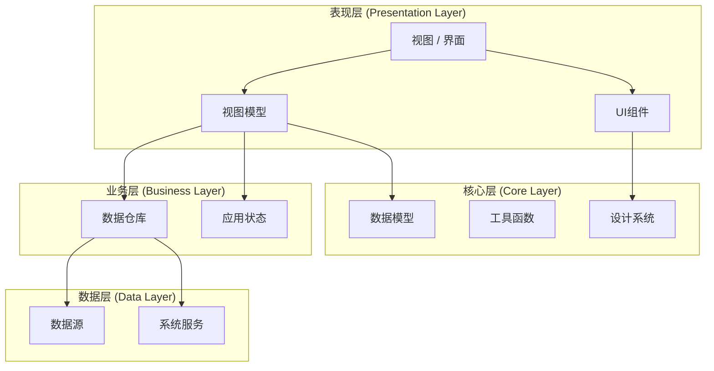
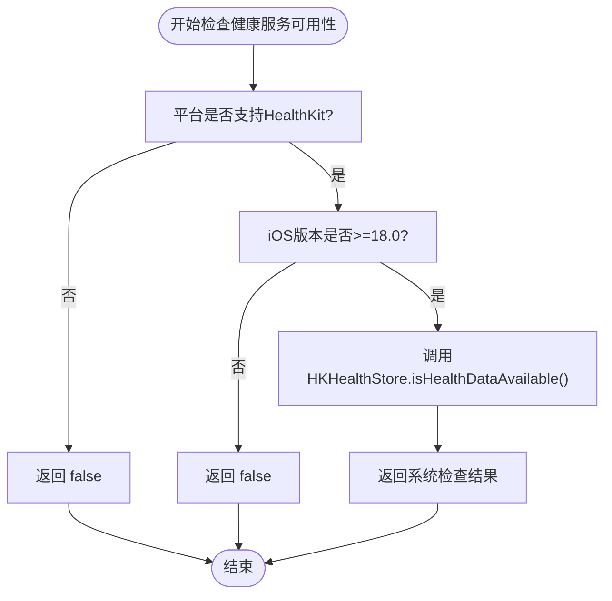
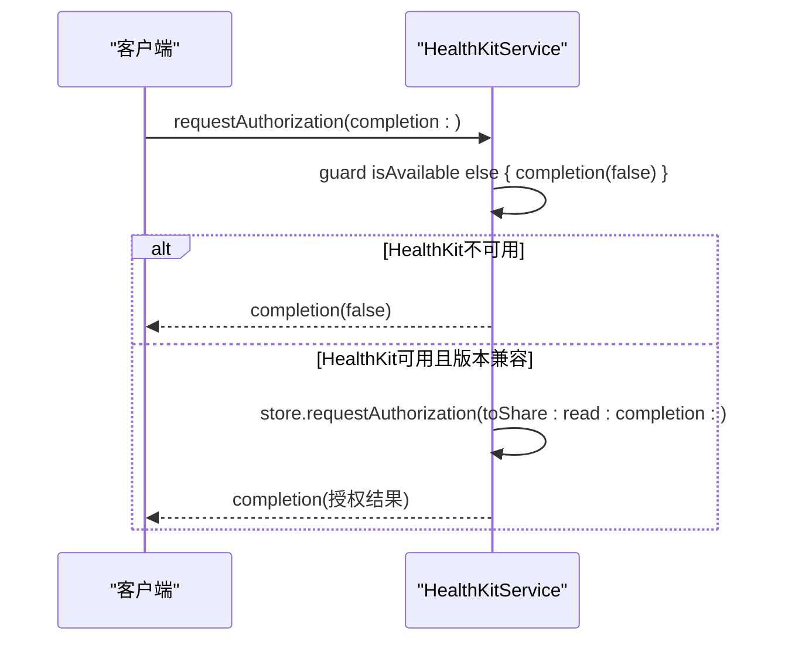
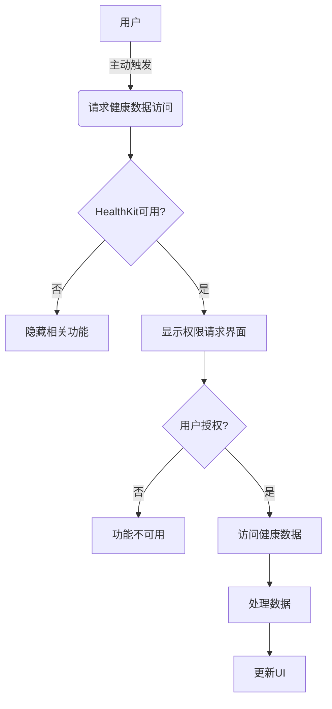

# 健康服务

<cite>
**本文档引用的文件**  
- [HealthKitService.swift](file://guanji0.34/DataLayer/SystemServices/HealthKitService.swift)
- [ProfileViewModel.swift](file://guanji0.34/Features/Profile/ProfileViewModel.swift)
- [ProfileScreen.swift](file://guanji0.34/Features/Profile/ProfileScreen.swift)
- [system-architecture.md](file://Docs/architecture/system-architecture.md)
- [AI-KNOWLEDGE-EXTRACTION-PLAN.md](file://Docs/architecture/AI-KNOWLEDGE-EXTRACTION-PLAN.md)
</cite>

## 目录
1. [简介](#简介)
2. [健康服务架构](#健康服务架构)
3. [核心组件分析](#核心组件分析)
4. [权限与隐私保护](#权限与隐私保护)
5. [系统兼容性与降级处理](#系统兼容性与降级处理)
6. [实际应用示例](#实际应用示例)
7. [结论](#结论)

## 简介

健康服务是本应用中负责与苹果HealthKit框架集成的核心模块，旨在安全、合规地访问用户的健康数据。该服务通过封装复杂的系统API，为上层应用提供简洁、可靠的健康数据访问接口。文档将深入分析HealthKitService的实现机制，重点阐述其在不同iOS版本下的兼容性处理、权限请求流程以及隐私保护原则。

**Section sources**
- [HealthKitService.swift](file://guanji0.34/DataLayer/SystemServices/HealthKitService.swift#L1-L24)

## 健康服务架构

健康服务采用分层架构设计，位于数据层的系统服务模块中，遵循MVVM架构模式与上层组件进行交互。服务通过Repository模式与ViewModel通信，确保业务逻辑与UI分离。整个架构严格遵循Apple的人机交互指南(HIG)，确保原生流畅的用户体验。



**Diagram sources**
- [system-architecture.md](file://Docs/architecture/system-architecture.md#L21-L53)

## 核心组件分析

### HealthKitService 实现细节

HealthKitService是封装HealthKit框架的核心类，负责处理所有与健康数据相关的系统交互。该服务采用单例模式设计，确保全局唯一实例，避免资源浪费和状态冲突。

#### 可用性检查机制

`isAvailable`属性是健康服务的核心检查点，通过双重条件编译确保在不同环境下的正确行为：

1. **平台可用性检查**：使用`#if canImport(HealthKit)`预处理指令，确保代码仅在支持HealthKit的平台上编译
2. **运行时版本检查**：使用`#available(iOS 18.0, *)`运行时检查，确保在iOS 18.0及以上版本才启用健康数据功能

当任一条件不满足时，服务会优雅降级，返回`false`表示健康数据不可用，避免在不支持的设备或系统上引发运行时错误。



**Diagram sources**
- [HealthKitService.swift](file://guanji0.34/DataLayer/SystemServices/HealthKitService.swift#L7-L9)

#### 权限请求流程

`requestAuthorization`方法实现了异步的权限请求机制，确保不会阻塞主线程。该方法包含以下关键步骤：

1. **前置检查**：首先调用`isAvailable`进行快速失败检查，避免在不支持的系统上执行不必要的操作
2. **版本适配**：使用`#available(iOS 18.0, *)`确保API调用的版本兼容性
3. **异步回调**：通过completion闭包返回请求结果，符合Swift的异步编程范式

当HealthKit不可用时，方法立即通过completion回调返回`false`，确保调用方能及时获知失败状态并采取相应措施。



**Diagram sources**
- [HealthKitService.swift](file://guanji0.34/DataLayer/SystemServices/HealthKitService.swift#L10-L16)

## 权限与隐私保护

### 隐私保护原则

本应用严格遵守隐私保护原则，确保用户对个人健康数据的完全控制权：

- **明确授权**：应用仅在用户明确授权后才可访问健康数据，遵循"最小权限"原则
- **透明告知**：在请求权限时，向用户清晰说明数据用途和访问范围
- **数据最小化**：仅请求必要的数据类型，避免过度收集



**Diagram sources**
- [AI-KNOWLEDGE-EXTRACTION-PLAN.md](file://Docs/architecture/AI-KNOWLEDGE-EXTRACTION-PLAN.md#L865-L883)

### UI响应策略

当HealthKit不可用时，UI应采取以下策略：

1. **功能隐藏**：相关健康数据功能应从界面中完全隐藏，避免用户困惑
2. **状态提示**：在适当位置显示系统不支持的提示信息
3. **降级体验**：提供替代功能或引导用户使用其他数据输入方式

**Section sources**
- [AI-KNOWLEDGE-EXTRACTION-PLAN.md](file://Docs/architecture/AI-KNOWLEDGE-EXTRACTION-PLAN.md#L771-L883)

## 系统兼容性与降级处理

### 编译时兼容性

HealthKitService通过条件编译指令`#if canImport(HealthKit)`实现了编译时的兼容性处理。这种设计确保：

- 在支持HealthKit的平台上，编译完整的功能实现
- 在不支持的平台上（如macOS），编译一个简化版本，所有方法都返回默认值

这种方法避免了在不支持的平台上出现编译错误，同时保持了代码的整洁性。

### 运行时兼容性

运行时兼容性通过`#available(iOS 18.0, *)`检查实现：

- 在iOS 18.0及以上版本，调用实际的HealthKit API
- 在低于iOS 18.0的版本，直接返回`false`，避免调用不存在的API

这种双重检查机制确保了应用在各种环境下的稳定运行。

**Section sources**
- [HealthKitService.swift](file://guanji0.34/DataLayer/SystemServices/HealthKitService.swift#L2-L24)

## 实际应用示例

### ProfileViewModel中的健康数据检查

在ProfileViewModel中，虽然当前代码未直接使用HealthKitService，但其设计模式为健康数据的集成提供了良好的基础。ViewModel通过发布者模式管理状态，可以轻松集成健康数据可用性检查。

```swift
// 示例代码结构
func checkHealthDataAvailability() {
    let healthService = HealthKitService()
    if healthService.isAvailable {
        // 健康数据可用，可以请求授权
        healthService.requestAuthorization { success in
            if success {
                // 用户已授权，可以访问健康数据
                DispatchQueue.main.async {
                    self.healthDataEnabled = true
                }
            }
        }
    } else {
        // HealthKit不可用，隐藏相关UI元素
        self.healthDataEnabled = false
    }
}
```

**Section sources**
- [ProfileViewModel.swift](file://guanji0.34/Features/Profile/ProfileViewModel.swift#L1-L132)
- [ProfileScreen.swift](file://guanji0.34/Features/Profile/ProfileScreen.swift#L1-L154)

## 结论

健康服务通过精心设计的架构和严格的隐私保护机制，为应用提供了安全可靠的健康数据访问能力。`isAvailable`属性和`requestAuthorization`方法的实现体现了对系统兼容性和用户体验的深入考虑。通过双重检查机制（编译时和运行时），服务能够在不同环境下优雅降级，确保应用的稳定运行。未来在ProfileViewModel中集成健康数据功能时，应遵循相同的隐私保护原则，确保用户对个人数据的完全控制权。