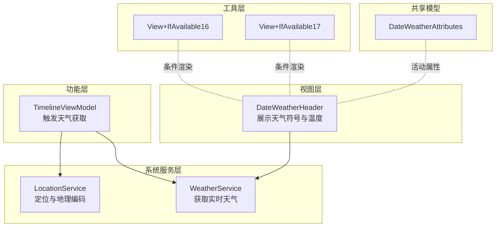
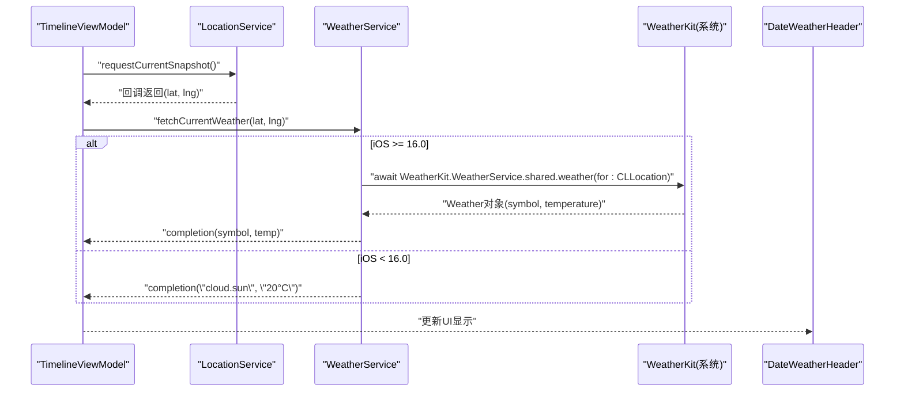
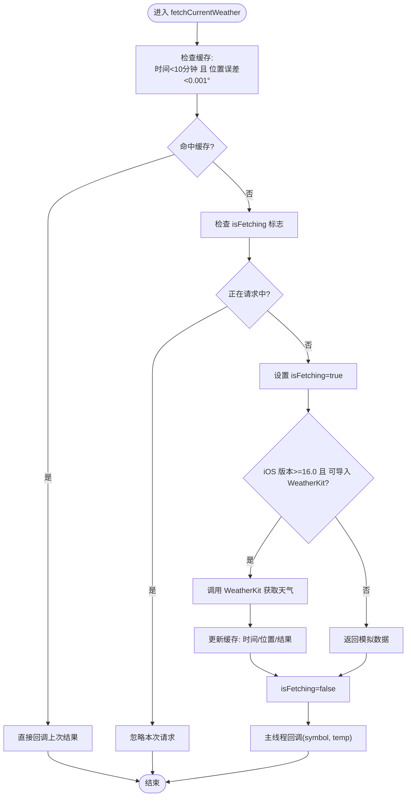
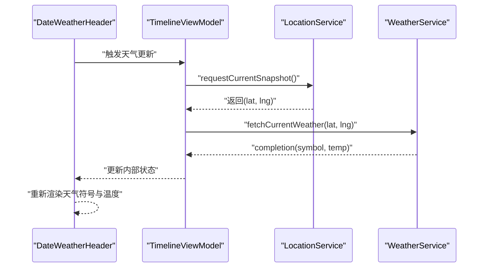
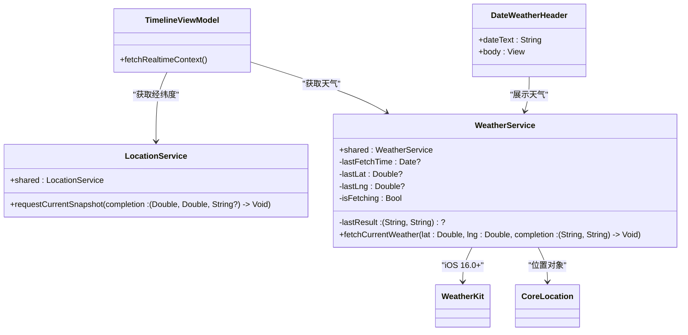

# 天气服务

<cite>
**本文引用的文件**
- [WeatherService.swift](file://guanji0.34/DataLayer/SystemServices/WeatherService.swift)
- [DateWeatherHeader.swift](file://guanji0.34/UI/Molecules/DateWeatherHeader.swift)
- [TimelineViewModel.swift](file://guanji0.34/Features/Timeline/TimelineViewModel.swift)
- [LocationService.swift](file://guanji0.34/DataLayer/SystemServices/LocationService.swift)
- [services.md](file://Docs/api/services.md)
- [View+IfAvailable16.swift](file://guanji0.34/Utils/View+IfAvailable16.swift)
- [View+IfAvailable17.swift](file://guanji0.34/Utils/View+IfAvailable17.swift)
- [DateWeatherAttributes.swift](file://guanji0.34/Shared/DateWeatherAttributes.swift)
</cite>

## 目录
1. [简介](#简介)
2. [项目结构](#项目结构)
3. [核心组件](#核心组件)
4. [架构总览](#架构总览)
5. [详细组件分析](#详细组件分析)
6. [依赖分析](#依赖分析)
7. [性能考虑](#性能考虑)
8. [故障排查指南](#故障排查指南)
9. [结论](#结论)
10. [附录](#附录)

## 简介
本文件围绕天气服务进行深入技术文档化，重点说明 WeatherService 如何利用 WeatherKit 框架获取实时天气信息；详细阐述其缓存策略的实现机制（10 分钟内相同位置的请求复用逻辑与 isFetching 标志防止并发请求）；解释 iOS 版本兼容性处理（iOS 16.0 及以上使用 WeatherKit，低于该版本返回模拟数据）；并提供在 DateWeatherHeader 中调用 fetchCurrentWeather 方法获取天气符号和温度的实际使用示例。同时给出性能优化建议与天气获取失败时的降级处理方案。

## 项目结构
与天气服务相关的关键模块分布如下：
- 系统服务层：WeatherService（天气获取）、LocationService（定位与地理编码）
- 视图层：DateWeatherHeader（展示天气符号与温度）
- 功能层：TimelineViewModel（触发天气获取）
- 工具层：View+IfAvailable16/17（iOS 版本条件渲染辅助）
- 共享模型：DateWeatherAttributes（天气活动属性）

图表来源
- [WeatherService.swift](file://guanji0.34/DataLayer/SystemServices/WeatherService.swift#L1-L75)
- [LocationService.swift](file://guanji0.34/DataLayer/SystemServices/LocationService.swift#L1-L146)
- [DateWeatherHeader.swift](file://guanji0.34/UI/Molecules/DateWeatherHeader.swift#L1-L38)
- [TimelineViewModel.swift](file://guanji0.34/Features/Timeline/TimelineViewModel.swift#L140-L150)
- [View+IfAvailable16.swift](file://guanji0.34/Utils/View+IfAvailable16.swift#L1-L13)
- [View+IfAvailable17.swift](file://guanji0.34/Utils/View+IfAvailable17.swift#L1-L13)
- [DateWeatherAttributes.swift](file://guanji0.34/Shared/DateWeatherAttributes.swift#L1-L27)

章节来源
- [WeatherService.swift](file://guanji0.34/DataLayer/SystemServices/WeatherService.swift#L1-L75)
- [LocationService.swift](file://guanji0.34/DataLayer/SystemServices/LocationService.swift#L1-L146)
- [DateWeatherHeader.swift](file://guanji0.34/UI/Molecules/DateWeatherHeader.swift#L1-L38)
- [TimelineViewModel.swift](file://guanji0.34/Features/Timeline/TimelineViewModel.swift#L140-L150)
- [View+IfAvailable16.swift](file://guanji0.34/Utils/View+IfAvailable16.swift#L1-L13)
- [View+IfAvailable17.swift](file://guanji0.34/Utils/View+IfAvailable17.swift#L1-L13)
- [DateWeatherAttributes.swift](file://guanji0.34/Shared/DateWeatherAttributes.swift#L1-L27)

## 核心组件
- WeatherService：单例类，负责获取当前天气（天气符号与温度），内置缓存与并发控制。
- LocationService：提供定位能力与地理编码，为 WeatherService 提供经纬度。
- DateWeatherHeader：展示日期与天气符号/温度的头部组件，可结合 WeatherService 更新显示。
- TimelineViewModel：在合适时机触发定位与天气获取。
- View+IfAvailable16/17：条件渲染工具，用于在不同 iOS 版本下启用特定功能。
- DateWeatherAttributes：用于天气相关活动的属性模型。

章节来源
- [WeatherService.swift](file://guanji0.34/DataLayer/SystemServices/WeatherService.swift#L7-L16)
- [LocationService.swift](file://guanji0.34/DataLayer/SystemServices/LocationService.swift#L5-L16)
- [DateWeatherHeader.swift](file://guanji0.34/UI/Molecules/DateWeatherHeader.swift#L3-L13)
- [TimelineViewModel.swift](file://guanji0.34/Features/Timeline/TimelineViewModel.swift#L140-L150)
- [View+IfAvailable16.swift](file://guanji0.34/Utils/View+IfAvailable16.swift#L3-L12)
- [View+IfAvailable17.swift](file://guanji0.34/Utils/View+IfAvailable17.swift#L3-L12)
- [DateWeatherAttributes.swift](file://guanji0.34/Shared/DateWeatherAttributes.swift#L1-L27)

## 架构总览
WeatherService 的工作流分为“定位获取经纬度”和“天气获取与缓存/并发控制”两个阶段。TimelineViewModel 在合适时机调用 LocationService 获取当前位置，再调用 WeatherService 获取天气。WeatherService 内部根据 iOS 版本选择 WeatherKit 或模拟数据，并通过缓存与并发标志避免重复请求与竞态。

图表来源
- [TimelineViewModel.swift](file://guanji0.34/Features/Timeline/TimelineViewModel.swift#L142-L149)
- [WeatherService.swift](file://guanji0.34/DataLayer/SystemServices/WeatherService.swift#L36-L65)
- [DateWeatherHeader.swift](file://guanji0.34/UI/Molecules/DateWeatherHeader.swift#L1-L38)

## 详细组件分析

### WeatherService 实现机制
- 单例与异步回调：通过静态 shared 单例对外提供 fetchCurrentWeather 接口，回调返回天气符号与温度字符串。
- 缓存策略：
  - 时间窗口：10 分钟内有效
  - 位置容差：纬度/经度误差小于 0.001° 视为相同位置
  - 缓存命中：直接回调上次结果，避免网络请求
- 并发控制：
  - isFetching 标志：防止同一时间多次并发请求
  - 并发请求会被直接忽略，确保资源与稳定性
- iOS 版本兼容性：
  - iOS 16.0+：使用 WeatherKit 获取真实天气
  - iOS < 16.0：返回模拟数据（如云彩符号与固定温度）
- 错误处理：
  - WeatherKit 请求异常：打印错误并返回模拟数据，避免崩溃
  - 未授权或定位失败：返回空坐标，WeatherService 直接忽略不发起请求

图表来源
- [WeatherService.swift](file://guanji0.34/DataLayer/SystemServices/WeatherService.swift#L19-L73)

章节来源
- [WeatherService.swift](file://guanji0.34/DataLayer/SystemServices/WeatherService.swift#L7-L75)

### iOS 版本兼容性处理
- 条件编译与平台检测：通过 #if canImport(WeatherKit) && os(iOS) 与 #available(iOS 16.0, *) 控制分支
- 16.0 以下版本：直接返回模拟数据，保证 UI 正常显示
- 16.0 及以上版本：使用 WeatherKit 获取真实天气，提升用户体验

章节来源
- [WeatherService.swift](file://guanji0.34/DataLayer/SystemServices/WeatherService.swift#L36-L65)
- [View+IfAvailable16.swift](file://guanji0.34/Utils/View+IfAvailable16.swift#L3-L12)
- [View+IfAvailable17.swift](file://guanji0.34/Utils/View+IfAvailable17.swift#L3-L12)

### 在 DateWeatherHeader 中调用 fetchCurrentWeather
- 调用时机：通常在页面出现或用户交互时触发
- 参数来源：通过 LocationService 获取当前经纬度
- 回调处理：将返回的天气符号与温度赋值到视图状态，驱动 UI 更新

图表来源
- [DateWeatherHeader.swift](file://guanji0.34/UI/Molecules/DateWeatherHeader.swift#L1-L38)
- [TimelineViewModel.swift](file://guanji0.34/Features/Timeline/TimelineViewModel.swift#L142-L149)
- [WeatherService.swift](file://guanji0.34/DataLayer/SystemServices/WeatherService.swift#L19-L73)

章节来源
- [DateWeatherHeader.swift](file://guanji0.34/UI/Molecules/DateWeatherHeader.swift#L1-L38)
- [TimelineViewModel.swift](file://guanji0.34/Features/Timeline/TimelineViewModel.swift#L140-L150)
- [services.md](file://Docs/api/services.md#L130-L138)

### DateWeatherAttributes 与天气活动
- 用于在 iOS 支持 ActivityKit 时，将日期与天气符号封装为活动属性，便于系统集成与动态岛展示。
- 在不支持的平台上提供兼容实现，避免编译错误。

章节来源
- [DateWeatherAttributes.swift](file://guanji0.34/Shared/DateWeatherAttributes.swift#L1-L27)

## 依赖分析
WeatherService 的依赖关系如下：
- WeatherKit：iOS 16.0+ 的天气数据来源
- CoreLocation：提供经纬度位置对象
- SwiftUI：UI 层调用 WeatherService 更新显示
- TimelineViewModel：触发定位与天气获取
- LocationService：提供经纬度快照

图表来源
- [WeatherService.swift](file://guanji0.34/DataLayer/SystemServices/WeatherService.swift#L1-L75)
- [LocationService.swift](file://guanji0.34/DataLayer/SystemServices/LocationService.swift#L1-L146)
- [TimelineViewModel.swift](file://guanji0.34/Features/Timeline/TimelineViewModel.swift#L140-L150)
- [DateWeatherHeader.swift](file://guanji0.34/UI/Molecules/DateWeatherHeader.swift#L1-L38)

章节来源
- [WeatherService.swift](file://guanji0.34/DataLayer/SystemServices/WeatherService.swift#L1-L75)
- [LocationService.swift](file://guanji0.34/DataLayer/SystemServices/LocationService.swift#L1-L146)
- [TimelineViewModel.swift](file://guanji0.34/Features/Timeline/TimelineViewModel.swift#L140-L150)
- [DateWeatherHeader.swift](file://guanji0.34/UI/Molecules/DateWeatherHeader.swift#L1-L38)

## 性能考虑
- 缓存时间与新鲜度平衡
  - 当前策略：10 分钟内相同位置复用缓存，兼顾数据新鲜度与网络请求频率
  - 建议：根据业务场景调整缓存时间（如 5/15 分钟），在数据时效性与网络开销之间权衡
- 并发控制
  - isFetching 标志有效避免重复请求，降低系统负载
  - 建议：在高频触发场景下，可引入队列或去抖策略进一步减少抖动
- 位置精度与电量
  - LocationService 使用百米级精度，平衡定位精度与耗电
  - 建议：在不需要高精度时保持现有精度，避免频繁高精度定位
- 错误降级
  - WeatherKit 失败时返回模拟数据，保证 UI 稳定
  - 建议：可增加指数退避或冷却时间，避免连续失败导致 UI 频繁闪烁

[本节为通用性能建议，不直接分析具体文件]

## 故障排查指南
- 天气获取失败
  - 现象：回调返回模拟数据（如云彩符号与占位温度）
  - 排查：确认 iOS 版本是否满足 WeatherKit 要求；检查定位权限与网络状态
- 定位失败
  - 现象：返回 (0, 0, nil)，WeatherService 忽略请求
  - 排查：检查 LocationService 授权状态与定位服务开关
- 并发请求异常
  - 现象：请求被忽略或 UI 未更新
  - 排查：确认 isFetching 标志是否正确重置；避免在回调中再次触发请求
- iOS 版本不兼容
  - 现象：始终返回模拟数据
  - 排查：确认工程是否正确链接 WeatherKit；检查目标最低系统版本

章节来源
- [WeatherService.swift](file://guanji0.34/DataLayer/SystemServices/WeatherService.swift#L55-L60)
- [services.md](file://Docs/api/services.md#L473-L482)

## 结论
WeatherService 通过简洁的缓存与并发控制策略，在 iOS 16.0+ 上利用 WeatherKit 提供真实天气数据，在低版本或不可用环境下返回模拟数据，保证了 UI 的稳定与一致性。结合 LocationService 的定位能力与 TimelineViewModel 的触发机制，实现了在合适时机获取天气并更新界面的目标。建议在实际部署中根据业务需求调整缓存时间与并发策略，并完善错误日志与监控，以获得更佳的用户体验与系统稳定性。

[本节为总结性内容，不直接分析具体文件]

## 附录
- API 使用示例（来自文档）
  - 在 TimelineViewModel 中触发天气获取
  - 在 DateWeatherHeader 中调用 WeatherService 获取天气符号与温度
- 相关文档
  - [服务接口文档（services.md）](file://Docs/api/services.md)

章节来源
- [services.md](file://Docs/api/services.md#L130-L138)
- [TimelineViewModel.swift](file://guanji0.34/Features/Timeline/TimelineViewModel.swift#L140-L150)
- [DateWeatherHeader.swift](file://guanji0.34/UI/Molecules/DateWeatherHeader.swift#L1-L38)