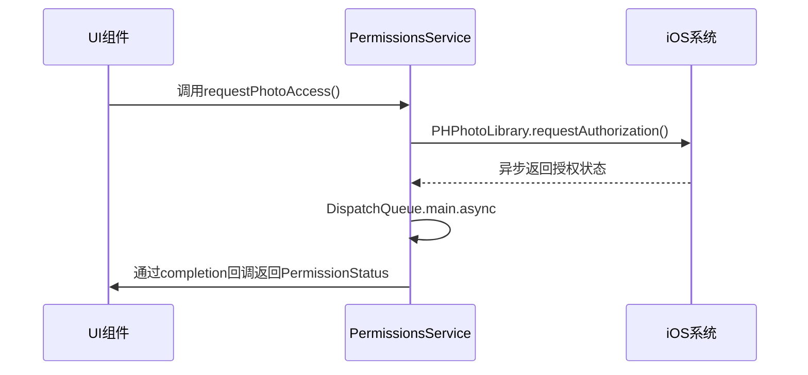
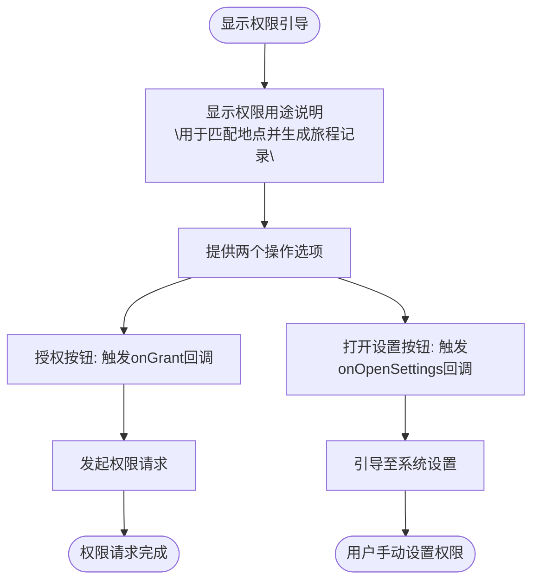
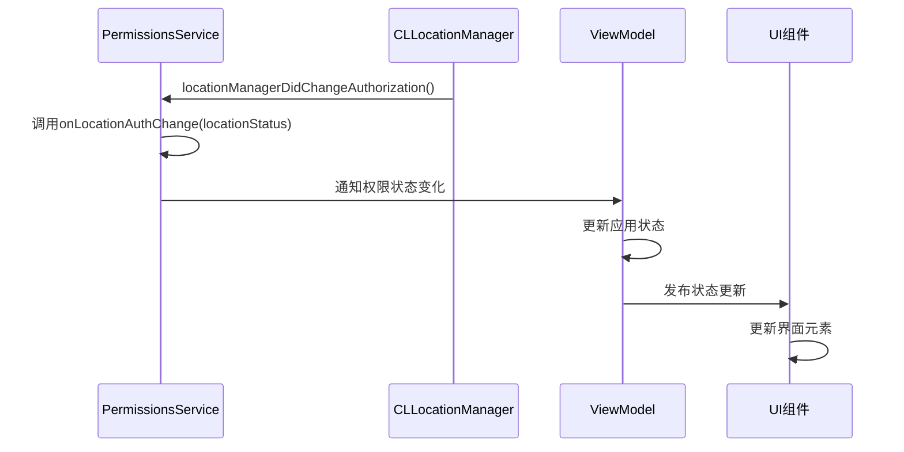

# 权限服务

<cite>
**本文档引用的文件**   
- [PermissionsService.swift](file://guanji0.34/DataLayer/SystemServices/PermissionsService.swift)
- [PermissionLocationSheet.swift](file://guanji0.34/UI/Organisms/PermissionLocationSheet.swift)
- [InputDock.swift](file://guanji0.34/UI/Organisms/InputDock.swift)
- [AppState.swift](file://guanji0.34/App/AppState.swift)
- [SystemPermission.swift](file://guanji0.34/Core/Models/SystemPermission.swift)
- [InfoPlist.strings](file://guanji0.34/Resources/zh-Hans.lproj/InfoPlist.strings)
- [Localizable.strings](file://guanji0.34/Resources/Localizable.strings)
</cite>

## 目录
1. [简介](#简介)
2. [权限状态枚举](#权限状态枚举)
3. [核心权限管理方法](#核心权限管理方法)
4. [定位权限状态检查与引导](#定位权限状态检查与引导)
5. [权限请求最佳实践](#权限请求最佳实践)
6. [响应式权限状态更新](#响应式权限状态更新)
7. [权限使用示例](#权限使用示例)

## 简介
权限服务（PermissionsService）是应用程序中统一管理相册、相机、麦克风和定位权限的核心组件。该服务通过封装iOS系统权限API，为应用提供了一致的权限管理接口。服务采用单例模式实现，确保在整个应用生命周期中权限状态的统一管理和协调。权限服务不仅负责检查当前权限状态，还处理权限请求流程，并通过回调机制通知UI层权限状态的变化，从而实现响应式的用户界面更新。

**Section sources**
- [PermissionsService.swift](file://guanji0.34/DataLayer/SystemServices/PermissionsService.swift#L1-L20)

## 权限状态枚举
`PermissionStatus` 枚举定义了五种权限状态，用于表示应用程序对特定系统资源的访问权限：

- **authorized**: 已授权状态，表示用户已明确授予应用程序访问相应资源的权限。
- **denied**: 拒绝状态，表示用户已明确拒绝授予应用程序访问相应资源的权限。
- **notDetermined**: 未确定状态，表示尚未向用户请求过权限，这是权限的初始状态。
- **restricted**: 受限状态，表示由于家长控制、设备管理策略或其他系统级限制，应用程序无法获得权限。
- **limited**: 有限状态，专用于相册权限，表示用户授予了有限访问权限，应用程序只能访问用户明确选择的特定照片。

这些状态为应用程序提供了精确的权限控制能力，使开发者能够根据不同的权限状态实施相应的业务逻辑和用户引导策略。

```mermaid
classDiagram
class PermissionStatus {
+authorized
+denied
+notDetermined
+restricted
+limited
}
note right of PermissionStatus : 五种权限状态枚举<br/>limited状态仅适用于相册权限
```

**Diagram sources**
- [PermissionsService.swift](file://guanji0.34/DataLayer/SystemServices/PermissionsService.swift#L6-L11)

## 核心权限管理方法
权限服务提供了四个核心方法来管理不同类型的系统权限，这些方法的实现机制具有统一的设计模式，同时针对不同权限类型进行了适当的调整。

### 相册权限管理
`requestPhotoAccess` 方法用于请求相册访问权限。该方法调用 `PHPhotoLibrary.requestAuthorization(for:)` API 向用户请求读写相册的权限。当系统弹出权限请求对话框后，用户的选择会通过异步回调返回。无论用户选择何种选项，回调都会通过 `DispatchQueue.main.async` 调度到主线程执行，确保UI更新的安全性。此方法支持 `limited` 状态，允许用户选择有限访问模式。

### 相机权限管理
`requestCameraAccess` 方法用于请求相机访问权限。与相册权限不同，相机权限采用布尔值授权模型，因此该方法的实现略有差异。它调用 `AVCaptureDevice.requestAccess(for:)` API 请求视频设备访问权限，回调返回一个布尔值表示授权结果。在内部实现中，该方法将布尔值转换为 `PermissionStatus` 枚举，授权成功对应 `.authorized` 状态，失败则对应 `.denied` 状态。

### 麦克风权限管理
`requestMicAccess` 方法的实现机制与相机权限管理完全相同，因为它同样基于 `AVCaptureDevice` 框架。该方法请求音频设备的访问权限，并将布尔型的授权结果转换为 `PermissionStatus` 枚举值。这种一致性设计简化了权限管理的复杂性，使开发者能够以统一的方式处理不同类型的媒体权限。

### 定位权限管理
`requestLocationAccess` 方法用于请求定位服务权限。与其他权限不同，该方法不接受完成回调，而是通过 `onLocationAuthChange` 回调属性来通知权限状态的变化。这是因为定位权限的状态变化可能不仅发生在初始请求时，还可能在用户后续在系统设置中更改权限时发生。该方法调用 `CLLocationManager` 的 `requestWhenInUseAuthorization()` 方法请求使用期间的定位权限。



**Diagram sources**
- [PermissionsService.swift](file://guanji0.34/DataLayer/SystemServices/PermissionsService.swift#L40-L53)
- [PermissionsService.swift](file://guanji0.34/DataLayer/SystemServices/PermissionsService.swift#L67-L73)
- [PermissionsService.swift](file://guanji0.34/DataLayer/SystemServices/PermissionsService.swift#L87-L93)
- [PermissionsService.swift](file://guanji0.34/DataLayer/SystemServices/PermissionsService.swift#L112-L114)

## 定位权限状态检查与引导
`PermissionLocationSheet` 组件是处理定位权限请求和引导的UI实现。该组件在用户需要定位功能但权限状态不明确或被拒绝时显示，提供清晰的用户引导。

该组件通过两个回调函数与外部逻辑交互：`onGrant` 和 `onOpenSettings`。当用户点击"授权"按钮时，触发 `onGrant` 回调，通常会调用 `PermissionsService.shared.requestLocationAccess()` 发起权限请求。当用户点击"打开设置"按钮时，触发 `onOpenSettings` 回调，引导用户前往系统设置页面手动开启权限。

组件的UI设计遵循隐私最佳实践，首先向用户解释为什么需要定位权限（"用于匹配地点并生成旅程记录"），然后提供两个明确的操作选项。这种设计尊重用户的选择权，提高了权限授予的成功率。



**Diagram sources**
- [PermissionLocationSheet.swift](file://guanji0.34/UI/Organisms/PermissionLocationSheet.swift#L3-L25)

## 权限请求最佳实践
在应用程序中实施权限管理时，应遵循以下最佳实践以优化用户体验和提高权限授予率。

### 适时请求权限
权限请求应在用户明确需要相关功能时发起，而不是在应用启动时立即请求。例如，在 `InputDock` 组件中，当用户点击图库或相机按钮时才请求相应的权限。这种"按需请求"的策略避免了在用户尚未理解功能价值时就提出权限要求，减少了用户拒绝的可能性。

### 处理用户拒绝后的引导
当用户拒绝授予权限时，应用程序不应反复弹出相同的权限请求对话框。相反，应提供清晰的解释和引导，帮助用户理解权限的重要性。如 `InputDock` 中的实现所示，当权限被拒绝时，会显示一个包含"打开设置"选项的提示，引导用户在系统设置中手动开启权限。这种渐进式的引导策略尊重用户的选择，同时保留了后续授权的机会。

### 权限状态检查
在请求权限之前，应先检查当前权限状态。如果权限已经授予，则无需再次请求；如果权限已被拒绝或受限，则应直接引导用户至设置页面。这种智能的状态检查避免了不必要的系统对话框弹出，提升了用户体验的流畅性。

**Section sources**
- [InputDock.swift](file://guanji0.34/UI/Organisms/InputDock.swift#L196-L218)

## 响应式权限状态更新
`onLocationAuthChange` 回调是实现定位权限状态响应式更新的关键机制。当定位权限状态发生变化时（无论是通过 `requestLocationAccess()` 请求还是用户在系统设置中更改），`CLLocationManagerDelegate` 的 `locationManagerDidChangeAuthorization(_:)` 方法会被调用，进而触发 `onLocationAuthChange` 回调。

这种设计模式实现了权限状态的被动监听，而不是主动轮询。其他组件可以订阅此回调，在权限状态变化时立即更新UI或调整功能可用性。例如，`TimelineScreen` 可以监听此回调，在获得定位权限后立即开始记录位置信息，或在权限被撤销时禁用相关功能。

通过将权限状态变化作为事件发布，应用程序实现了松耦合的架构，各个组件可以根据需要响应权限变化，而无需直接依赖权限服务的具体实现。



**Diagram sources**
- [PermissionsService.swift](file://guanji0.34/DataLayer/SystemServices/PermissionsService.swift#L20-L21)
- [PermissionsService.swift](file://guanji0.34/DataLayer/SystemServices/PermissionsService.swift#L116-L118)

## 权限使用示例
以下是在 `InputDock` 组件中使用权限服务的实际示例，展示了如何在用户界面中集成权限管理功能。

当用户点击图库按钮时，`handleGallery()` 方法被调用。该方法首先通过 `PermissionsService.shared.requestPhotoAccess()` 请求相册权限。在回调中，检查返回的权限状态：如果状态为 `.authorized` 或 `.limited`，则显示照片选择器；如果为其他状态，则显示权限被拒绝的提示。

类似地，当用户点击相机按钮时，`handleCamera()` 方法先检查相机源是否可用，然后通过 `PermissionsService.shared.requestCameraAccess()` 请求相机权限。根据授权结果，决定是显示相机界面还是错误提示。

这种模式确保了只有在获得必要权限后才启用相关功能，同时为用户提供了清晰的反馈和后续操作指引，体现了良好的用户体验设计原则。

**Section sources**
- [InputDock.swift](file://guanji0.34/UI/Organisms/InputDock.swift#L196-L218)