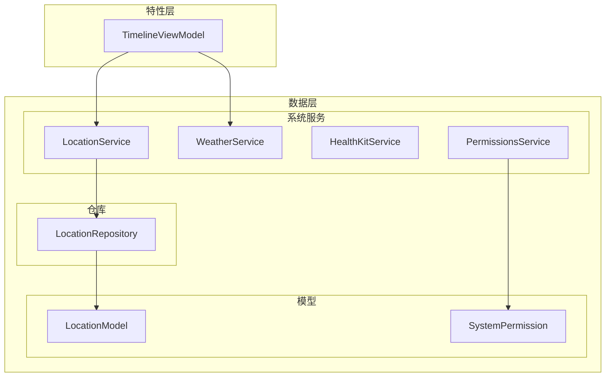
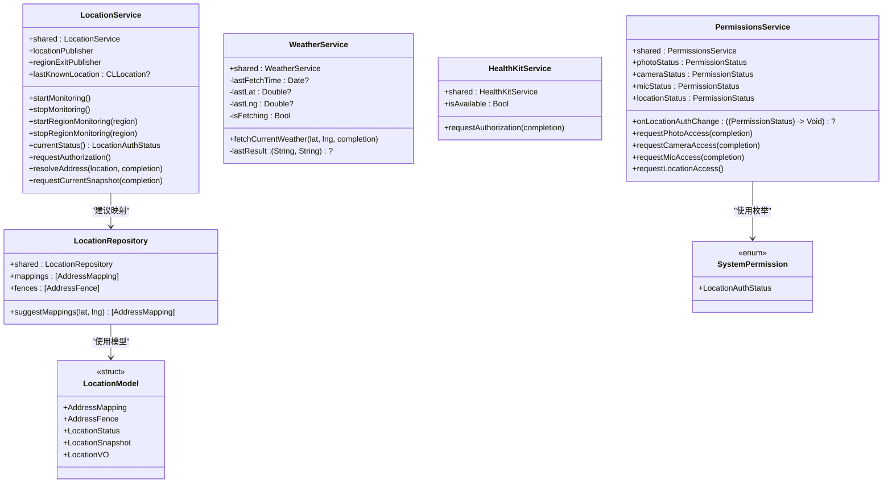
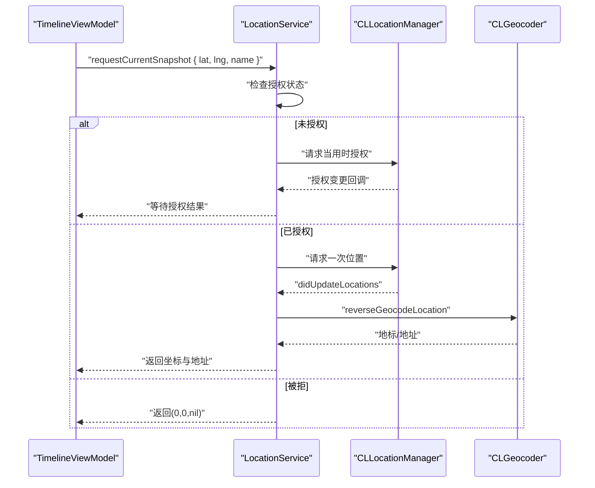
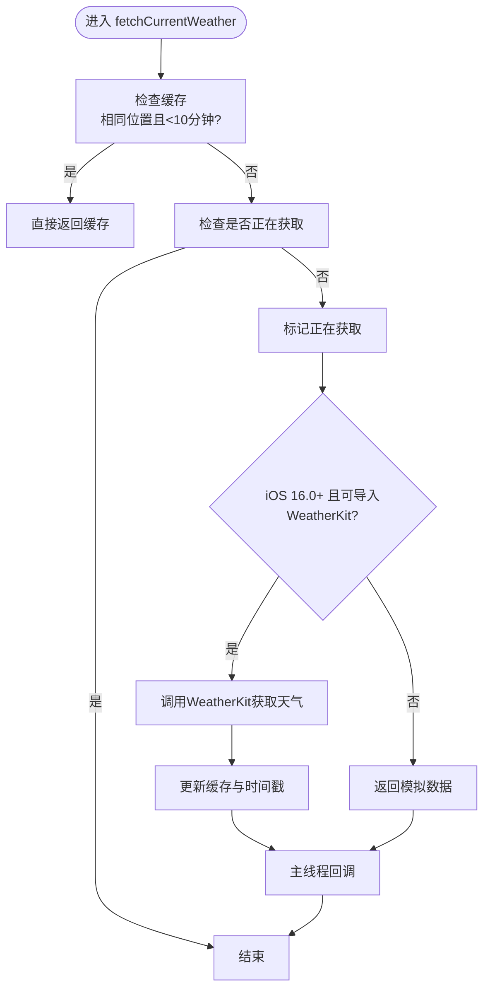
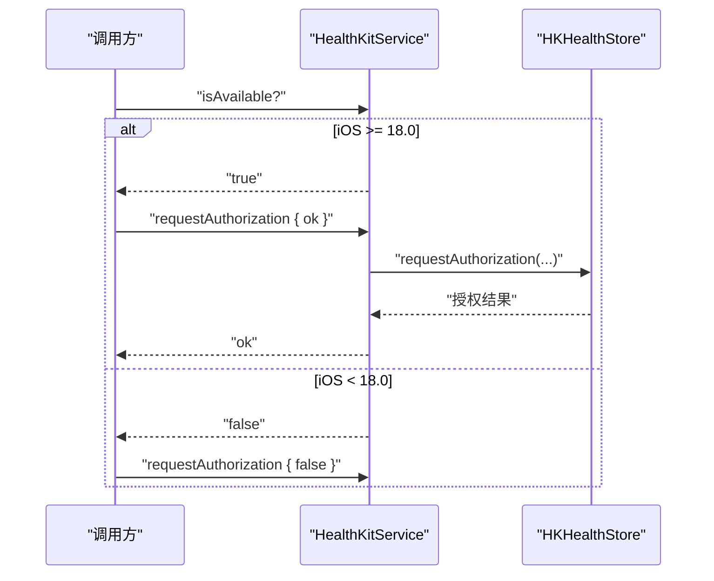
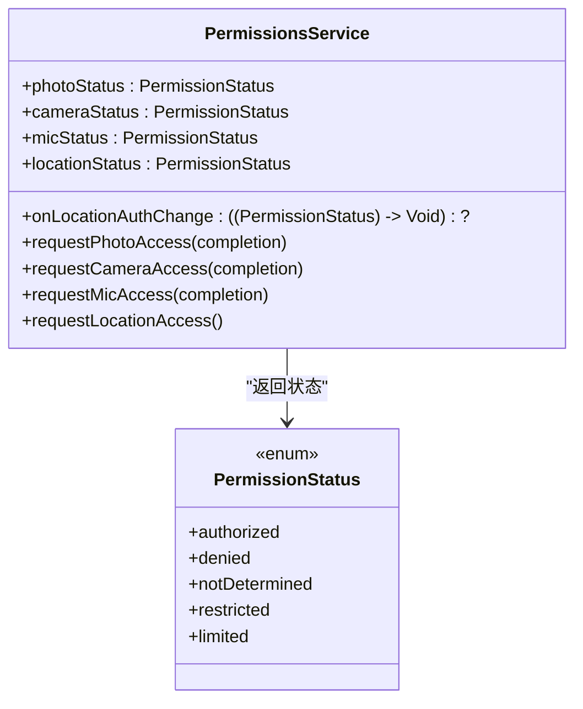
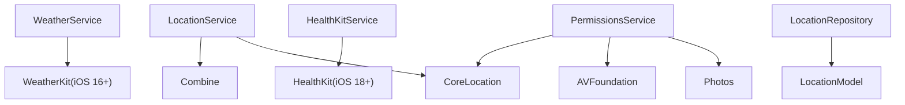

# 系统集成服务

<cite>
**本文引用的文件**
- [LocationService.swift](file://guanji0.34/DataLayer/SystemServices/LocationService.swift)
- [WeatherService.swift](file://guanji0.34/DataLayer/SystemServices/WeatherService.swift)
- [HealthKitService.swift](file://guanji0.34/DataLayer/SystemServices/HealthKitService.swift)
- [PermissionsService.swift](file://guanji0.34/DataLayer/SystemServices/PermissionsService.swift)
- [LocationModel.swift](file://guanji0.34/Core/Models/LocationModel.swift)
- [SystemPermission.swift](file://guanji0.34/Core/Models/SystemPermission.swift)
- [LocationRepository.swift](file://guanji0.34/DataLayer/Repositories/LocationRepository.swift)
- [TimelineViewModel.swift](file://guanji0.34/Features/Timeline/TimelineViewModel.swift)
- [services.md](file://Docs/api/services.md)
</cite>

## 目录
1. [简介](#简介)
2. [项目结构](#项目结构)
3. [核心组件](#核心组件)
4. [架构总览](#架构总览)
5. [详细组件分析](#详细组件分析)
6. [依赖关系分析](#依赖关系分析)
7. [性能考量](#性能考量)
8. [故障排查指南](#故障排查指南)
9. [结论](#结论)
10. [附录](#附录)

## 简介
本文件面向需要在iOS应用中安全、高效集成系统能力的开发者，系统性梳理四类系统服务：位置服务、天气服务、健康数据服务与权限服务。内容覆盖：
- 如何使用CoreLocation进行GPS定位、逆地理编码与区域监控
- 如何通过WeatherKit获取天气信息并实现缓存与平台兼容
- 如何请求与访问健康数据（步数、睡眠），以及在特定iOS版本下的降级处理
- 如何统一管理相册、相机、麦克风与定位权限，含状态枚举与回调机制

同时提供配置要点、错误处理策略与实际使用示例，帮助快速落地。

## 项目结构
系统服务位于数据层的系统服务模块，配合模型与仓库模块共同完成数据的采集、转换与持久化。

图表来源
- [LocationService.swift](file://guanji0.34/DataLayer/SystemServices/LocationService.swift#L1-L146)
- [WeatherService.swift](file://guanji0.34/DataLayer/SystemServices/WeatherService.swift#L1-L75)
- [HealthKitService.swift](file://guanji0.34/DataLayer/SystemServices/HealthKitService.swift#L1-L25)
- [PermissionsService.swift](file://guanji0.34/DataLayer/SystemServices/PermissionsService.swift#L1-L120)
- [LocationRepository.swift](file://guanji0.34/DataLayer/Repositories/LocationRepository.swift#L1-L126)
- [LocationModel.swift](file://guanji0.34/Core/Models/LocationModel.swift#L1-L76)
- [SystemPermission.swift](file://guanji0.34/Core/Models/SystemPermission.swift#L1-L10)
- [TimelineViewModel.swift](file://guanji0.34/Features/Timeline/TimelineViewModel.swift#L1-L200)

章节来源
- [LocationService.swift](file://guanji0.34/DataLayer/SystemServices/LocationService.swift#L1-L146)
- [WeatherService.swift](file://guanji0.34/DataLayer/SystemServices/WeatherService.swift#L1-L75)
- [HealthKitService.swift](file://guanji0.34/DataLayer/SystemServices/HealthKitService.swift#L1-L25)
- [PermissionsService.swift](file://guanji0.34/DataLayer/SystemServices/PermissionsService.swift#L1-L120)
- [LocationRepository.swift](file://guanji0.34/DataLayer/Repositories/LocationRepository.swift#L1-L126)
- [LocationModel.swift](file://guanji0.34/Core/Models/LocationModel.swift#L1-L76)
- [SystemPermission.swift](file://guanji0.34/Core/Models/SystemPermission.swift#L1-L10)
- [TimelineViewModel.swift](file://guanji0.34/Features/Timeline/TimelineViewModel.swift#L1-L200)

## 核心组件
- 位置服务（LocationService）：基于CoreLocation提供持续定位、区域监控、逆地理编码与发布者模式输出位置流。
- 天气服务（WeatherService）：基于WeatherKit按位置获取当前天气，内置10分钟缓存与iOS版本兼容处理。
- 健康数据服务（HealthKitService）：封装HealthKit授权请求，针对iOS 18.0及以上版本进行可用性判断与授权流程。
- 权限服务（PermissionsService）：统一管理相册、相机、麦克风与定位权限，提供状态查询与授权请求，并支持定位授权变更回调。

章节来源
- [LocationService.swift](file://guanji0.34/DataLayer/SystemServices/LocationService.swift#L1-L146)
- [WeatherService.swift](file://guanji0.34/DataLayer/SystemServices/WeatherService.swift#L1-L75)
- [HealthKitService.swift](file://guanji0.34/DataLayer/SystemServices/HealthKitService.swift#L1-L25)
- [PermissionsService.swift](file://guanji0.34/DataLayer/SystemServices/PermissionsService.swift#L1-L120)

## 架构总览
系统服务采用单例与委托模式，结合Combine发布者实现事件驱动的数据流；仓库模块负责地址映射与围栏的持久化与检索；模型层定义位置状态、位置快照与映射实体。

图表来源
- [LocationService.swift](file://guanji0.34/DataLayer/SystemServices/LocationService.swift#L1-L146)
- [WeatherService.swift](file://guanji0.34/DataLayer/SystemServices/WeatherService.swift#L1-L75)
- [HealthKitService.swift](file://guanji0.34/DataLayer/SystemServices/HealthKitService.swift#L1-L25)
- [PermissionsService.swift](file://guanji0.34/DataLayer/SystemServices/PermissionsService.swift#L1-L120)
- [LocationRepository.swift](file://guanji0.34/DataLayer/Repositories/LocationRepository.swift#L1-L126)
- [LocationModel.swift](file://guanji0.34/Core/Models/LocationModel.swift#L1-L76)
- [SystemPermission.swift](file://guanji0.34/Core/Models/SystemPermission.swift#L1-L10)

## 详细组件分析

### 位置服务（LocationService）
- 能力概述
  - 持续定位与显著位置变化唤醒：通过委托回调推送最新位置，支持后台更新与手动开关。
  - 区域监控：启动/停止对指定区域的监控，退出区域时触发事件并自动恢复高精度跟踪。
  - 逆地理编码：根据坐标解析地址文本，优先详细地址，回退到地标或行政区名称。
  - 发布者模式：提供位置流与区域退出流，便于订阅式消费。
  - 快照获取：一次性请求当前位置与地址，内部处理授权状态与回调。
  - 地址映射建议：基于围栏与映射表计算近似距离，返回匹配的地址映射集合。

- 关键配置
  - 定位精度：默认设置为百米级，兼顾能耗与精度。
  - 后台更新：允许后台定位更新，提升场景感知连续性。
  - 自动暂停：关闭自动暂停以保证持续跟踪。

- 核心方法与行为
  - startMonitoring/stopMonitoring：控制定位与显著位置变化的启停。
  - startRegionMonitoring/stopRegionMonitoring：区域监控启停。
  - requestCurrentSnapshot：一次性获取位置与地址，内部处理未授权与拒绝场景。
  - locationManager(_:didUpdateLocations:)：更新lastKnownLocation并发送位置流；若存在快照回调则解析地址后回调。
  - locationManager(_:didExitRegion:)：区域退出时发送区域退出流并恢复监控。
  - locationManager(_:didFailWithError:)：定位失败时清理快照回调。
  - locationManagerDidChangeAuthorization：授权状态变更时通知上层。

- 错误处理策略
  - 未授权或被拒时，快照回调返回空坐标与空地址，调用方可据此降级显示“未知位置”。
  - 逆地理编码失败时记录日志并返回nil，调用方应提供兜底文案。

- 实际使用示例
  - 订阅位置流并开始监控：
    - 参考路径：[TimelineViewModel.swift](file://guanji0.34/Features/Timeline/TimelineViewModel.swift#L95-L106)
  - 请求当前位置快照：
    - 参考路径：[TimelineViewModel.swift](file://guanji0.34/Features/Timeline/TimelineViewModel.swift#L142-L149)

- 与仓库与模型的关系
  - 通过LocationRepository的围栏与映射表，结合经纬度近似距离计算，给出地址映射建议。
  - 参考路径：[LocationRepository.swift](file://guanji0.34/DataLayer/Repositories/LocationRepository.swift#L106-L114)，[LocationModel.swift](file://guanji0.34/Core/Models/LocationModel.swift#L1-L76)

图表来源
- [LocationService.swift](file://guanji0.34/DataLayer/SystemServices/LocationService.swift#L77-L116)
- [TimelineViewModel.swift](file://guanji0.34/Features/Timeline/TimelineViewModel.swift#L142-L149)

章节来源
- [LocationService.swift](file://guanji0.34/DataLayer/SystemServices/LocationService.swift#L1-L146)
- [LocationRepository.swift](file://guanji0.34/DataLayer/Repositories/LocationRepository.swift#L106-L114)
- [LocationModel.swift](file://guanji0.34/Core/Models/LocationModel.swift#L1-L76)
- [TimelineViewModel.swift](file://guanji0.34/Features/Timeline/TimelineViewModel.swift#L95-L106)

### 天气服务（WeatherService）
- 能力概述
  - 获取当前天气：返回天气符号名与温度字符串。
  - 缓存策略：同一位置（经纬度误差阈值）且10分钟内直接命中缓存，避免频繁网络请求。
  - 并发保护：防止重复并发请求导致的资源竞争。
  - 平台兼容：iOS 16.0及以上使用WeatherKit，低于该版本返回模拟数据；非iOS环境也提供降级逻辑。

- 核心方法与行为
  - fetchCurrentWeather：执行缓存检查与并发保护，满足条件时异步获取天气并更新缓存，最终在主线程回调。
  - 异常处理：捕获WeatherKit错误，不缓存错误结果，回调兜底数据。

- 配置要点
  - 缓存时间：10分钟
  - 位置误差阈值：0.001度
  - 并发标志：isFetching

- 实际使用示例
  - 在时间线页面中，当有有效位置时触发天气获取：
    - 参考路径：[TimelineViewModel.swift](file://guanji0.34/Features/Timeline/TimelineViewModel.swift#L142-L149)

图表来源
- [WeatherService.swift](file://guanji0.34/DataLayer/SystemServices/WeatherService.swift#L19-L73)

章节来源
- [WeatherService.swift](file://guanji0.34/DataLayer/SystemServices/WeatherService.swift#L1-L75)
- [TimelineViewModel.swift](file://guanji0.34/Features/Timeline/TimelineViewModel.swift#L142-L149)

### 健康数据服务（HealthKitService）
- 能力概述
  - 可用性检测：仅在iOS 18.0及以上版本可用。
  - 授权请求：向用户发起读取与分享权限的授权，回调布尔结果。
  - 降级处理：在不可用或低版本时返回false，避免崩溃或异常行为。

- 配置要点
  - 版本门槛：iOS 18.0
  - 类型集合：当前示例为空集合，表示不请求具体类型，仅做可用性与授权检查。

- 实际使用示例
  - 在需要健康数据前先检查可用性与授权：
    - 参考路径：[HealthKitService.swift](file://guanji0.34/DataLayer/SystemServices/HealthKitService.swift#L7-L16)

图表来源
- [HealthKitService.swift](file://guanji0.34/DataLayer/SystemServices/HealthKitService.swift#L7-L16)

章节来源
- [HealthKitService.swift](file://guanji0.34/DataLayer/SystemServices/HealthKitService.swift#L1-L25)

### 权限服务（PermissionsService）
- 能力概述
  - 统一权限管理：相册（含受限/有限权限）、相机、麦克风与定位。
  - 状态枚举：包含已授权、被拒、未确定、受限、相册有限（仅相册）。
  - 回调机制：定位授权变更时通过闭包通知上层UI或业务逻辑。
  - 请求接口：分别提供相册、相机、麦克风与定位的授权请求。

- 核心属性与方法
  - photoStatus/cameraStatus/micStatus/locationStatus：查询当前授权状态。
  - onLocationAuthChange：定位授权变更回调。
  - requestPhotoAccess/requestCameraAccess/requestMicAccess/requestLocationAccess：发起授权请求。

- 实际使用示例
  - 查询相册权限并请求授权：
    - 参考路径：[PermissionsService.swift](file://guanji0.34/DataLayer/SystemServices/PermissionsService.swift#L28-L53)
  - 查询定位权限并请求授权：
    - 参考路径：[PermissionsService.swift](file://guanji0.34/DataLayer/SystemServices/PermissionsService.swift#L96-L114)

图表来源
- [PermissionsService.swift](file://guanji0.34/DataLayer/SystemServices/PermissionsService.swift#L6-L12)
- [PermissionsService.swift](file://guanji0.34/DataLayer/SystemServices/PermissionsService.swift#L14-L119)

章节来源
- [PermissionsService.swift](file://guanji0.34/DataLayer/SystemServices/PermissionsService.swift#L1-L120)
- [SystemPermission.swift](file://guanji0.34/Core/Models/SystemPermission.swift#L1-L10)

## 依赖关系分析
- 位置服务依赖CoreLocation与Combine，通过委托与发布者模式实现事件驱动。
- 天气服务依赖WeatherKit（iOS 16.0+），并在不可用时提供降级方案。
- 健康数据服务依赖HealthKit，但受iOS版本限制，低版本直接降级。
- 权限服务依赖Photos、AVFoundation与CoreLocation，统一状态与请求流程。
- 仓库模块提供地址映射与围栏数据，供位置服务建议映射使用。

图表来源
- [LocationService.swift](file://guanji0.34/DataLayer/SystemServices/LocationService.swift#L1-L146)
- [WeatherService.swift](file://guanji0.34/DataLayer/SystemServices/WeatherService.swift#L1-L75)
- [HealthKitService.swift](file://guanji0.34/DataLayer/SystemServices/HealthKitService.swift#L1-L25)
- [PermissionsService.swift](file://guanji0.34/DataLayer/SystemServices/PermissionsService.swift#L1-L120)
- [LocationRepository.swift](file://guanji0.34/DataLayer/Repositories/LocationRepository.swift#L1-L126)
- [LocationModel.swift](file://guanji0.34/Core/Models/LocationModel.swift#L1-L76)

章节来源
- [LocationService.swift](file://guanji0.34/DataLayer/SystemServices/LocationService.swift#L1-L146)
- [WeatherService.swift](file://guanji0.34/DataLayer/SystemServices/WeatherService.swift#L1-L75)
- [HealthKitService.swift](file://guanji0.34/DataLayer/SystemServices/HealthKitService.swift#L1-L25)
- [PermissionsService.swift](file://guanji0.34/DataLayer/SystemServices/PermissionsService.swift#L1-L120)
- [LocationRepository.swift](file://guanji0.34/DataLayer/Repositories/LocationRepository.swift#L1-L126)
- [LocationModel.swift](file://guanji0.34/Core/Models/LocationModel.swift#L1-L76)

## 性能考量
- 位置服务
  - 默认百米精度平衡能耗与精度；如需更高精度可在业务侧按需调整desiredAccuracy。
  - 后台更新开启可能增加电量消耗，建议在不需要时调用stopMonitoring降低功耗。
  - 显著位置变化作为唤醒机制，减少主动轮询带来的开销。
- 天气服务
  - 10分钟缓存与位置误差阈值有效降低请求频率，建议在高频场景下复用此策略。
  - 并发保护避免重复请求，提高稳定性。
- 健康数据服务
  - 仅在iOS 18.0+启用，避免低版本的兼容性问题与潜在异常。
- 权限服务
  - 通过状态枚举与回调减少UI与业务层的重复判断逻辑，提升响应效率。

## 故障排查指南
- 位置服务
  - 现象：requestCurrentSnapshot回调返回(0,0,nil)
  - 原因：未授权或被拒
  - 处理：引导用户授权或提示无权限
  - 参考路径：[LocationService.swift](file://guanji0.34/DataLayer/SystemServices/LocationService.swift#L77-L116)
- 天气服务
  - 现象：回调兜底数据或延迟
  - 原因：WeatherKit不可用或网络异常
  - 处理：检查iOS版本与网络；必要时重试
  - 参考路径：[WeatherService.swift](file://guanji0.34/DataLayer/SystemServices/WeatherService.swift#L36-L73)
- 健康数据服务
  - 现象：授权始终为false
  - 原因：iOS版本低于18.0或设备不支持
  - 处理：在UI中隐藏相关入口或提示降级
  - 参考路径：[HealthKitService.swift](file://guanji0.34/DataLayer/SystemServices/HealthKitService.swift#L7-L16)
- 权限服务
  - 现象：定位授权状态不更新
  - 原因：未设置delegate或未注册回调
  - 处理：确保设置delegate并监听授权变更
  - 参考路径：[PermissionsService.swift](file://guanji0.34/DataLayer/SystemServices/PermissionsService.swift#L14-L25)

章节来源
- [LocationService.swift](file://guanji0.34/DataLayer/SystemServices/LocationService.swift#L77-L116)
- [WeatherService.swift](file://guanji0.34/DataLayer/SystemServices/WeatherService.swift#L36-L73)
- [HealthKitService.swift](file://guanji0.34/DataLayer/SystemServices/HealthKitService.swift#L7-L16)
- [PermissionsService.swift](file://guanji0.34/DataLayer/SystemServices/PermissionsService.swift#L14-L25)

## 结论
本系统集成服务通过明确的职责划分与稳健的错误处理策略，实现了对iOS原生系统的安全、高效集成。位置服务提供连续与区域监控能力；天气服务在多平台环境下具备良好兼容性；健康数据服务遵循版本约束进行降级；权限服务统一管理各类系统权限。建议在实际开发中：
- 严格区分授权状态并提供清晰的用户引导
- 合理设置定位精度与后台更新策略
- 利用缓存与并发保护优化网络与系统资源
- 在低版本或不可用场景下提供明确的降级提示

## 附录
- 实际使用示例参考
  - 位置服务订阅与监控：[TimelineViewModel.swift](file://guanji0.34/Features/Timeline/TimelineViewModel.swift#L95-L106)
  - 位置快照获取与天气联动：[TimelineViewModel.swift](file://guanji0.34/Features/Timeline/TimelineViewModel.swift#L142-L149)
  - 天气服务缓存与平台兼容：[WeatherService.swift](file://guanji0.34/DataLayer/SystemServices/WeatherService.swift#L19-L73)
  - 权限状态与请求接口：[PermissionsService.swift](file://guanji0.34/DataLayer/SystemServices/PermissionsService.swift#L28-L114)
  - 健康数据可用性与授权：[HealthKitService.swift](file://guanji0.34/DataLayer/SystemServices/HealthKitService.swift#L7-L16)