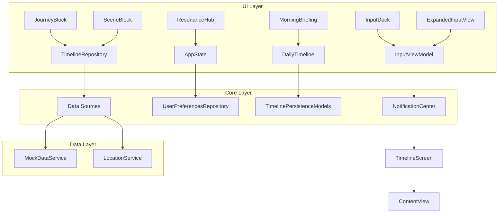

# 有机体组件

<cite>
**本文档引用文件**  
- [InputDock.swift](file://guanji0.34/UI/Organisms/InputDock.swift)
- [ResonanceHub.swift](file://guanji0.34/UI/Organisms/ResonanceHub.swift)
- [MorningBriefing.swift](file://guanji0.34/UI/Organisms/MorningBriefing.swift)
- [JourneyBlock.swift](file://guanji0.34/UI/Organisms/JourneyBlock.swift)
- [SceneBlock.swift](file://guanji0.34/UI/Organisms/SceneBlock.swift)
- [ExpandedInputView.swift](file://guanji0.34/UI/Organisms/ExpandedInputView.swift)
- [InputViewModel.swift](file://guanji0.34/Features/Input/InputViewModel.swift)
- [ResonanceDateStat.swift](file://guanji0.34/Core/Models/ResonanceDateStat.swift)
- [DailyTimeline.swift](file://guanji0.34/Core/Models/DailyTimeline.swift)
- [AppState.swift](file://guanji0.34/App/AppState.swift)
- [InputAtoms.swift](file://guanji0.34/UI/Atoms/InputAtoms.swift)
- [Colors.swift](file://guanji0.34/Core/DesignSystem/Colors.swift)
- [Typography.swift](file://guanji0.34/Core/DesignSystem/Typography.swift)
- [JournalAtoms.swift](file://guanji0.34/UI/Atoms/JournalAtoms.swift)
- [MediaAtoms.swift](file://guanji0.34/UI/Atoms/MediaAtoms.swift)
</cite>

## 目录
1. [输入坞 (InputDock)](#输入坞-inputdock)
2. [共鸣中心 (ResonanceHub)](#共鸣中心-resonancehub)
3. [晨间简报 (MorningBriefing)](#晨间简报-morningbriefing)
4. [旅程块 (JourneyBlock)](#旅程块-journeyblock)
5. [场景块 (SceneBlock)](#场景块-sceneblock)
6. [扩展输入视图 (ExpandedInputView)](#扩展输入视图-expandedinputview)
7. [组件通信与状态管理](#组件通信与状态管理)
8. [架构概览](#架构概览)

## 输入坞 (InputDock)

`InputDock` 是应用的核心输入入口，提供了一个功能丰富且直观的交互界面。它集成了文本输入、多媒体上传、语音录制和快速操作按钮，支持在“日记”和“AI”两种模式间切换。

该组件的布局结构分为三个主要区域：
1.  **上下文与附件栏**：位于顶部，显示回复上下文（`ReplyContextBar`）和已添加的附件列表（`AttachmentsBar`）。
2.  **可展开的快捷操作工具栏**：位于输入框上方，通过点击“+”按钮展开，包含相册、相机、录音、时间胶囊、心情记录和文件上传等按钮（`InputQuickActions`）。
3.  **主输入区域**：包含一个可自动聚焦的文本输入框和一个发送按钮（`SubmitButton`）。输入框具有动态背景、边框和阴影，以在视觉上与消息区域区分开来。

**按钮注册机制**通过 `InputQuickActions` 组件实现，每个按钮都绑定了一个闭包（closure），用于处理特定的用户操作，例如：
-   `handleGallery()`：请求相册权限并打开照片选择器。
-   `handleCamera()`：请求相机权限并打开相机捕捉界面。
-   `vm.toggleRecording()`：触发语音录制的开始或停止。
-   `handleModeToggle()`：切换应用模式（日记/ AI），并相应地更新全局状态。

**状态联动逻辑**是 `InputDock` 的核心。它通过 `@StateObject` 观察 `InputViewModel` 的状态，并通过 `@EnvironmentObject` 订阅 `AppState` 的全局状态。例如，当用户开始录音时，`InputViewModel` 的 `isRecording` 状态变为 `true`，这会触发 UI 切换到 `RecordingBar`；当用户切换到 AI 模式时，`AppState` 的 `currentMode` 发生变化，这会动态调整 `InputQuickActions` 中按钮的可见性（隐藏“时间胶囊”和“心情”按钮）和输入框的占位符文本。

**组件来源**
- [InputDock.swift](file://guanji0.34/UI/Organisms/InputDock.swift#L1-L331)
- [InputAtoms.swift](file://guanji0.34/UI/Atoms/InputAtoms.swift#L1-L366)
- [InputViewModel.swift](file://guanji0.34/Features/Input/InputViewModel.swift#L1-L215)
- [AppState.swift](file://guanji0.34/App/AppState.swift#L1-L52)

## 共鸣中心 (ResonanceHub)

`ResonanceHub` 是一个交互式的数据聚合与探索界面，旨在帮助用户发现跨时间维度的“共鸣”记忆。它通过聚合用户过去在相同日期（如“去年今日”）创建的内容，为用户提供一种情感和记忆上的连接。

该组件接收一个 `ResonanceDateStat` 对象数组作为输入，每个对象代表一个历史日期的统计信息。UI 设计简洁，以一个可折叠的卡片形式呈现。卡片顶部显示一个按钮，展示所有历史记忆的总数。点击该按钮会通过动画展开，列出所有符合条件的历史日期。

每个历史日期项都包含一个视觉标识（小圆点）和两行文本：第一行是相对时间标签（如“一年前”），第二行是该日期的标题（如果存在）。用户点击任意一项时，会通过 `AppState` 的 `selectedDate` 属性将应用的主视图导航到对应的历史日期，从而实现深度探索。

**组件来源**
- [ResonanceHub.swift](file://guanji0.34/UI/Organisms/ResonanceHub.swift#L1-L56)
- [ResonanceDateStat.swift](file://guanji0.34/Core/Models/ResonanceDateStat.swift#L1-L27)
- [AppState.swift](file://guanji0.34/App/AppState.swift#L1-L52)

## 晨间简报 (MorningBriefing)

`MorningBriefing` 组件负责展示个性化的数据汇总和 AI 生成的摘要。它以一个可折叠的卡片形式集成在主界面中，为用户提供当日的概览。

该组件接收一个 `JournalEntry` 对象数组作为数据源。其 UI 结构与 `ResonanceHub` 类似，顶部是一个带有“收件箱”标签和折叠箭头的按钮。默认情况下，内容区域是展开的。

当用户点击按钮时，内容区域会通过淡入淡出动画进行折叠或展开。展开状态下，它会使用 `JournalRow` 组件遍历并渲染传入的条目列表。这些条目可以是用户当天的输入、AI 生成的洞察或系统推送的提醒，从而形成一份个性化的“简报”。

**组件来源**
- [MorningBriefing.swift](file://guanji0.34/UI/Organisms/MorningBriefing.swift#L1-L31)
- [DailyTimeline.swift](file://guanji0.34/Core/Models/DailyTimeline.swift#L1-L59)

## 旅程块 (JourneyBlock)

`JourneyBlock` 是时间线中基于时空聚类的自动分组单元之一，代表一次移动轨迹（如从家到公司）。它与 `SceneBlock` 共同构成了时间线的主干。

该组件的视觉呈现由一个 `JourneyHeaderChip` 和多个 `JournalRow` 组成。`JourneyHeaderChip` 显示旅程的模式（如步行、驾车）和目的地。用户可以点击或长按目的地进行编辑。

`JourneyBlock` 的核心功能是管理其内部的 `JournalEntry` 条目。它通过 `ForEach` 循环渲染这些条目，但会过滤掉作为“回复”的条目，以避免在主时间线中重复显示。每个 `JournalRow` 都支持上下文菜单，提供编辑、分类和删除等操作。

**自动分组算法**的逻辑主要在数据层（`TimelineRepository`）实现。`JourneyBlock` 本身是一个展示层组件，它接收已经由后端服务根据地理位置、时间戳和移动速度等数据聚类好的 `JourneyBlock` 对象，并将其可视化。

**组件来源**
- [JourneyBlock.swift](file://guanji0.34/UI/Organisms/JourneyBlock.swift#L1-L137)
- [DailyTimeline.swift](file://guanji0.34/Core/Models/DailyTimeline.swift#L1-L59)

## 场景块 (SceneBlock)

`SceneBlock` 是时间线中的另一个核心分组单元，代表一个停留的地点（如在咖啡馆）。它与 `JourneyBlock` 在结构上相似，但语义和视觉上有所不同。

其布局包含一个 `SceneHeader` 和多个 `JournalRow`。`SceneHeader` 显示场景的地理位置信息，并支持编辑。

与 `JourneyBlock` 一样，`SceneBlock` 也负责渲染其内部的条目列表，并通过 `JournalRow` 提供丰富的交互功能，如回复、编辑和分类。其上下文菜单的逻辑与 `JourneyBlock` 高度一致。

`SceneBlock` 的分组算法同样由数据层完成。它根据用户在某个地理位置的停留时长和活动模式，将相关的 `JournalEntry` 聚合到一个 `SceneGroup` 对象中，`SceneBlock` 组件则负责将这个对象渲染为用户界面。

**组件来源**
- [SceneBlock.swift](file://guanji0.34/UI/Organisms/SceneBlock.swift#L1-L115)
- [DailyTimeline.swift](file://guanji0.34/Core/Models/DailyTimeline.swift#L1-L59)

## 扩展输入视图 (ExpandedInputView)

`ExpandedInputView` 是一个全屏覆盖的模态视图，为用户提供一个更宽敞的文本编辑环境，支持多媒体内容的集成。

该组件通过 `@ObservedObject` 绑定到 `InputViewModel`，并使用 `@Binding` 控制自身的显示与隐藏。其核心是一个 `TextEditor`，允许用户输入多行文本。

当视图出现时，它会将 `InputViewModel` 中的 `text` 内容同步到本地的 `localText` 状态变量中，并自动聚焦。用户完成编辑后，点击工具栏上的“确认”按钮，会将 `localText` 的内容写回 `InputViewModel`，并关闭视图。这种设计确保了数据的单向流动和状态的一致性。

**组件来源**
- [ExpandedInputView.swift](file://guanji0.34/UI/Organisms/ExpandedInputView.swift#L1-L52)
- [InputViewModel.swift](file://guanji0.34/Features/Input/InputViewModel.swift#L1-L215)

## 组件通信与状态管理

有机体组件的状态管理遵循 MVVM 模式，通过 `ObservableObject` 和 `@Published` 属性包装器实现。

-   **内部状态管理**：每个组件通过 `@State` 管理其私有状态（如 `InputDock` 的 `showPhotoPicker`，`ResonanceHub` 的 `expanded`）。这些状态的变化仅影响组件自身的 UI。
-   **与 ViewModel 通信**：组件通过 `@StateObject` 或 `@ObservedObject` 持有对 `ViewModel` 的引用。`ViewModel`（如 `InputViewModel`）封装了业务逻辑和数据状态。组件通过调用 `ViewModel` 的公共方法（如 `vm.submit()`）来触发操作，并通过 `@Published` 属性自动响应 `ViewModel` 状态的变化。
-   **与全局状态通信**：组件通过 `@EnvironmentObject` 订阅 `AppState`。`AppState` 作为单一数据源，管理跨组件的全局状态（如 `currentMode`、`selectedDate`）。当 `AppState` 变化时，所有订阅它的组件都会自动刷新。
-   **外部配置参数**：组件通过 `public let` 声明的初始化参数接收外部数据（如 `ResonanceHub` 的 `stats`，`MorningBriefing` 的 `items`）。这些参数是只读的，确保了组件的纯粹性。
-   **主界面嵌入方法**：这些有机体组件通常作为 `TimelineScreen` 或 `ContentView` 的子视图被直接调用。它们通过参数传递所需的数据，并通过 `@EnvironmentObject` 访问共享状态。

**组件来源**
- [InputViewModel.swift](file://guanji0.34/Features/Input/InputViewModel.swift#L1-L215)
- [AppState.swift](file://guanji0.34/App/AppState.swift#L1-L52)

## 架构概览

**图表来源**
- [InputDock.swift](file://guanji0.34/UI/Organisms/InputDock.swift#L1-L331)
- [ResonanceHub.swift](file://guanji0.34/UI/Organisms/ResonanceHub.swift#L1-L56)
- [MorningBriefing.swift](file://guanji0.34/UI/Organisms/MorningBriefing.swift#L1-L31)
- [JourneyBlock.swift](file://guanji0.34/UI/Organisms/JourneyBlock.swift#L1-L137)
- [SceneBlock.swift](file://guanji0.34/UI/Organisms/SceneBlock.swift#L1-L115)
- [ExpandedInputView.swift](file://guanji0.34/UI/Organisms/ExpandedInputView.swift#L1-L52)
- [InputViewModel.swift](file://guanji0.34/Features/Input/InputViewModel.swift#L1-L215)
- [AppState.swift](file://guanji0.34/App/AppState.swift#L1-L52)
- [DailyTimeline.swift](file://guanji0.34/Core/Models/DailyTimeline.swift#L1-L59)