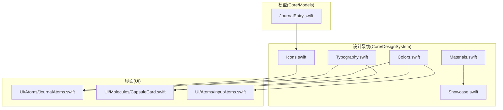
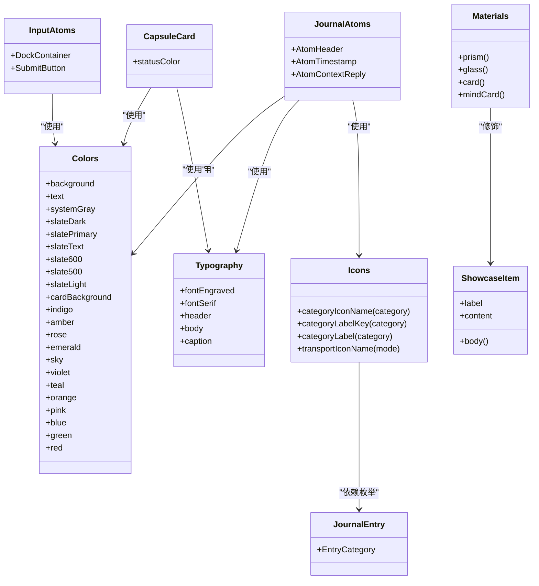
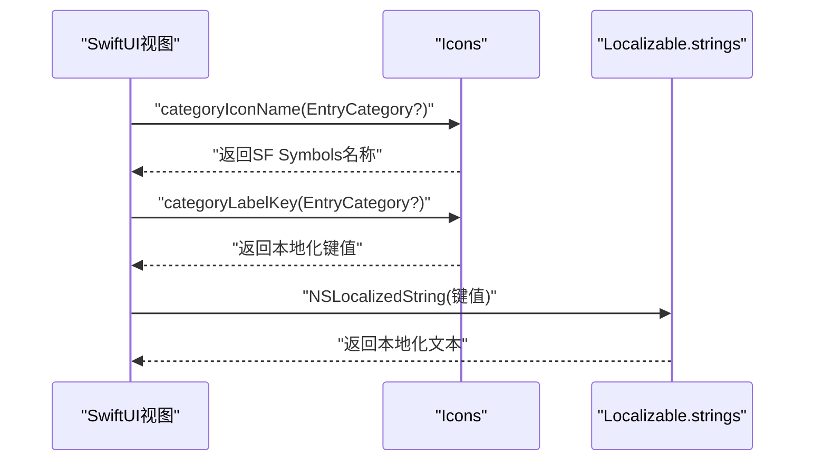
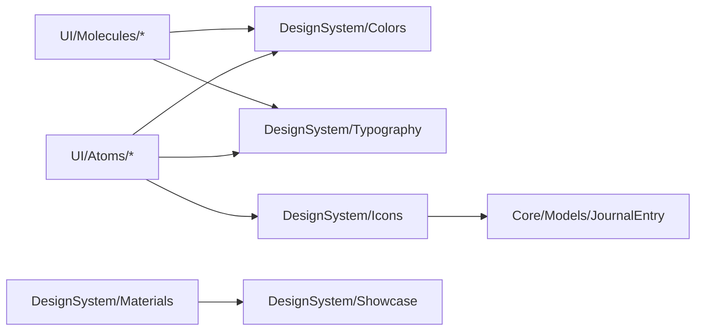

# 设计系统规范

<cite>
**本文引用的文件**
- [Colors.swift](file://guanji0.34/Core/DesignSystem/Colors.swift)
- [Typography.swift](file://guanji0.34/Core/DesignSystem/Typography.swift)
- [Icons.swift](file://guanji0.34/Core/DesignSystem/Icons.swift)
- [Materials.swift](file://guanji0.34/Core/DesignSystem/Materials.swift)
- [Showcase.swift](file://guanji0.34/Core/DesignSystem/Showcase.swift)
- [JournalEntry.swift](file://guanji0.34/Core/Models/JournalEntry.swift)
- [JournalAtoms.swift](file://guanji0.34/UI/Atoms/JournalAtoms.swift)
- [CapsuleCard.swift](file://guanji0.34/UI/Molecules/CapsuleCard.swift)
- [InputAtoms.swift](file://guanji0.34/UI/Atoms/InputAtoms.swift)
- [Localizable.strings](file://guanji0.34/Resources/Localizable.strings)
</cite>

## 目录
1. [简介](#简介)
2. [项目结构](#项目结构)
3. [核心组件](#核心组件)
4. [架构总览](#架构总览)
5. [详细组件分析](#详细组件分析)
6. [依赖关系分析](#依赖关系分析)
7. [性能考量](#性能考量)
8. [故障排查指南](#故障排查指南)
9. [结论](#结论)
10. [附录](#附录)

## 简介
本文件将设计系统作为UI组件库的“唯一真相源”，围绕颜色、字体与图标三大基础规范进行系统化说明。重点包括：
- 颜色：背景色、文本色、卡片背景与主题色（如indigo、emerald）的定义逻辑与暗黑模式适配策略；
- 字体：header、body、caption等文本样式的字号、字重与使用场景；
- 图标：categoryIconName等方法如何根据日记类别动态返回SF Symbols图标名称，并阐述本地化标签映射机制。

同时提供在SwiftUI视图中的实际调用示例路径，确保设计语言一致性。

## 项目结构
设计系统位于 Core/DesignSystem 目录，包含颜色、字体、图标、材质修饰器与展示容器等模块；相关使用贯穿 UI/Atoms 与 UI/Molecules 层。

**图表来源**
- [Colors.swift](file://guanji0.34/Core/DesignSystem/Colors.swift#L1-L31)
- [Typography.swift](file://guanji0.34/Core/DesignSystem/Typography.swift#L1-L10)
- [Icons.swift](file://guanji0.34/Core/DesignSystem/Icons.swift#L1-L43)
- [Materials.swift](file://guanji0.34/Core/DesignSystem/Materials.swift#L1-L51)
- [Showcase.swift](file://guanji0.34/Core/DesignSystem/Showcase.swift#L1-L18)
- [JournalEntry.swift](file://guanji0.34/Core/Models/JournalEntry.swift#L24-L32)
- [JournalAtoms.swift](file://guanji0.34/UI/Atoms/JournalAtoms.swift#L32-L59)
- [CapsuleCard.swift](file://guanji0.34/UI/Molecules/CapsuleCard.swift#L52-L56)
- [InputAtoms.swift](file://guanji0.34/UI/Atoms/InputAtoms.swift#L39-L82)

**章节来源**
- [Colors.swift](file://guanji0.34/Core/DesignSystem/Colors.swift#L1-L31)
- [Typography.swift](file://guanji0.34/Core/DesignSystem/Typography.swift#L1-L10)
- [Icons.swift](file://guanji0.34/Core/DesignSystem/Icons.swift#L1-L43)
- [Materials.swift](file://guanji0.34/Core/DesignSystem/Materials.swift#L1-L51)
- [Showcase.swift](file://guanji0.34/Core/DesignSystem/Showcase.swift#L1-L18)
- [JournalEntry.swift](file://guanji0.34/Core/Models/JournalEntry.swift#L24-L32)

## 核心组件
- 颜色体系：提供基础背景、文本、卡片背景与一组主题色，统一视觉语义与暗黑模式适配。
- 字体体系：提供header/body/caption等常用文本样式，确保排版一致性。
- 图标体系：提供类别图标与标签键值映射，支持本地化显示。
- 材质修饰器：提供毛玻璃、卡片等通用视觉修饰能力，便于复用。

**章节来源**
- [Colors.swift](file://guanji0.34/Core/DesignSystem/Colors.swift#L4-L30)
- [Typography.swift](file://guanji0.34/Core/DesignSystem/Typography.swift#L3-L9)
- [Icons.swift](file://guanji0.34/Core/DesignSystem/Icons.swift#L3-L42)
- [Materials.swift](file://guanji0.34/Core/DesignSystem/Materials.swift#L3-L8)

## 架构总览
设计系统通过枚举暴露静态属性与函数，供各层UI组件直接引用，形成“唯一真相源”的单向依赖关系：UI层依赖设计系统，设计系统不依赖UI层。

**图表来源**
- [Colors.swift](file://guanji0.34/Core/DesignSystem/Colors.swift#L4-L30)
- [Typography.swift](file://guanji0.34/Core/DesignSystem/Typography.swift#L3-L9)
- [Icons.swift](file://guanji0.34/Core/DesignSystem/Icons.swift#L3-L42)
- [Materials.swift](file://guanji0.34/Core/DesignSystem/Materials.swift#L3-L8)
- [Showcase.swift](file://guanji0.34/Core/DesignSystem/Showcase.swift#L3-L17)
- [JournalEntry.swift](file://guanji0.34/Core/Models/JournalEntry.swift#L24-L32)
- [JournalAtoms.swift](file://guanji0.34/UI/Atoms/JournalAtoms.swift#L32-L59)
- [CapsuleCard.swift](file://guanji0.34/UI/Molecules/CapsuleCard.swift#L52-L56)
- [InputAtoms.swift](file://guanji0.34/UI/Atoms/InputAtoms.swift#L39-L82)

## 详细组件分析

### 颜色规范（Colors）
- 基础语义色
  - 背景色：系统背景色，适配浅色/深色模式。
  - 文本色：主文本色，适配浅色/深色模式。
  - 系统灰：用于弱提示文本。
- 灰阶语义色（slate系列）
  - 用于不同层级的文本与背景，针对浅色/深色模式分别指定对比度与可读性。
- 卡片背景
  - 在深色模式下使用次级系统背景，在浅色模式下使用白色，保证卡片层级清晰。
- 主题色
  - 提供多组品牌/功能主题色，如indigo、emerald、rose等，用于强调、状态与品牌标识。

暗黑模式适配策略
- 使用系统接口风格回调，根据用户界面风格动态选择颜色，确保在浅色与深色模式下均具备良好的对比度与可读性。

调用示例（路径）
- 在日记头组件中使用系统灰与字体样式：[JournalAtoms.swift](file://guanji0.34/UI/Atoms/JournalAtoms.swift#L38-L58)
- 在胶囊卡片中使用主题色表示状态：[CapsuleCard.swift](file://guanji0.34/UI/Molecules/CapsuleCard.swift#L52-L56)
- 在输入区域中使用主题色强调焦点态：[InputAtoms.swift](file://guanji0.34/UI/Atoms/InputAtoms.swift#L49-L56)

**章节来源**
- [Colors.swift](file://guanji0.34/Core/DesignSystem/Colors.swift#L4-L30)
- [JournalAtoms.swift](file://guanji0.34/UI/Atoms/JournalAtoms.swift#L38-L58)
- [CapsuleCard.swift](file://guanji0.34/UI/Molecules/CapsuleCard.swift#L52-L56)
- [InputAtoms.swift](file://guanji0.34/UI/Atoms/InputAtoms.swift#L49-L56)

### 字体规范（Typography）
- 字体族与字号
  - header：标题类文本，字号较大，强调层级。
  - body：正文文本，字号适中，强调可读性。
  - caption：辅助信息，字号较小，强调细节。
  - fontEngraved：装饰性细小字重，常用于标签或徽记。
  - fontSerif：衬线字体，用于特定强调或装饰场景。
- 使用场景
  - 头部标签、时间戳、辅助说明等应遵循对应字号与字重，保持一致的阅读节奏。

调用示例（路径）
- 日记头组件使用装饰性细小字重：[JournalAtoms.swift](file://guanji0.34/UI/Atoms/JournalAtoms.swift#L42-L42)
- 胶囊卡片正文使用body字重：[CapsuleCard.swift](file://guanji0.34/UI/Molecules/CapsuleCard.swift#L73-L74)

**章节来源**
- [Typography.swift](file://guanji0.34/Core/DesignSystem/Typography.swift#L3-L9)
- [JournalAtoms.swift](file://guanji0.34/UI/Atoms/JournalAtoms.swift#L42-L42)
- [CapsuleCard.swift](file://guanji0.34/UI/Molecules/CapsuleCard.swift#L73-L74)

### 图标规范（Icons）
- 类别图标映射
  - categoryIconName：根据日记类别返回对应的SF Symbols名称，若类别为空则返回默认图标。
  - 支持的类别：dream、health、emotion、work、social、media、life。
- 本地化标签映射
  - categoryLabelKey：返回对应类别的本地化键值。
  - categoryLabel：通过NSLocalizedString获取本地化后的显示文本。
- 交通方式图标
  - transportIconName：根据出行方式返回对应SF Symbols名称。

调用示例（路径）
- 日记头组件使用类别图标与本地化标签：[JournalAtoms.swift](file://guanji0.34/UI/Atoms/JournalAtoms.swift#L39-L54)
- 本地化字符串键值参考：[Localizable.strings](file://guanji0.34/Resources/Localizable.strings#L191-L198)

**图表来源**
- [Icons.swift](file://guanji0.34/Core/DesignSystem/Icons.swift#L4-L32)
- [Localizable.strings](file://guanji0.34/Resources/Localizable.strings#L191-L198)

**章节来源**
- [Icons.swift](file://guanji0.34/Core/DesignSystem/Icons.swift#L4-L32)
- [JournalEntry.swift](file://guanji0.34/Core/Models/JournalEntry.swift#L24-L32)
- [Localizable.strings](file://guanji0.34/Resources/Localizable.strings#L191-L198)

### 材质与展示（Materials/Showcase）
- 材质修饰器
  - prism：超薄材质+描边圆角，适合强调层次。
  - glass：半透明背景+描边，适合信息层叠。
  - card：柔和背景+阴影，适合卡片容器。
  - mindCard：更精致的材质与描边组合，适合心智卡片。
- 展示容器
  - ShowcaseItem：统一的展示容器，内部使用材质修饰器，配合颜色与字体规范。

调用示例（路径）
- 展示容器使用card材质：[Showcase.swift](file://guanji0.34/Core/DesignSystem/Showcase.swift#L15-L15)

**章节来源**
- [Materials.swift](file://guanji0.34/Core/DesignSystem/Materials.swift#L3-L8)
- [Showcase.swift](file://guanji0.34/Core/DesignSystem/Showcase.swift#L15-L15)

## 依赖关系分析
- 设计系统对UI层的单向依赖：UI层只从设计系统取值，避免反向耦合。
- Icons依赖JournalEntry的EntryCategory枚举，确保图标映射与模型一致。
- Materials与Showcase共同构成展示层的统一外观。

**图表来源**
- [JournalAtoms.swift](file://guanji0.34/UI/Atoms/JournalAtoms.swift#L38-L58)
- [CapsuleCard.swift](file://guanji0.34/UI/Molecules/CapsuleCard.swift#L52-L56)
- [Icons.swift](file://guanji0.34/Core/DesignSystem/Icons.swift#L4-L32)
- [JournalEntry.swift](file://guanji0.34/Core/Models/JournalEntry.swift#L24-L32)
- [Materials.swift](file://guanji0.34/Core/DesignSystem/Materials.swift#L3-L8)
- [Showcase.swift](file://guanji0.34/Core/DesignSystem/Showcase.swift#L15-L15)

**章节来源**
- [JournalAtoms.swift](file://guanji0.34/UI/Atoms/JournalAtoms.swift#L38-L58)
- [CapsuleCard.swift](file://guanji0.34/UI/Molecules/CapsuleCard.swift#L52-L56)
- [Icons.swift](file://guanji0.34/Core/DesignSystem/Icons.swift#L4-L32)
- [JournalEntry.swift](file://guanji0.34/Core/Models/JournalEntry.swift#L24-L32)
- [Materials.swift](file://guanji0.34/Core/DesignSystem/Materials.swift#L3-L8)
- [Showcase.swift](file://guanji0.34/Core/DesignSystem/Showcase.swift#L15-L15)

## 性能考量
- 颜色与字体均为静态属性，访问成本极低，无需额外计算。
- 图标映射为简单switch分支，开销可忽略。
- 材质修饰器为轻量ViewModifier，建议在需要时按需应用，避免过度嵌套导致渲染复杂度上升。

## 故障排查指南
- 图标未显示或显示默认图标
  - 检查EntryCategory是否为nil或不在映射范围内；确认本地化键值是否存在。
  - 参考路径：[Icons.swift](file://guanji0.34/Core/DesignSystem/Icons.swift#L4-L15)，[Localizable.strings](file://guanji0.34/Resources/Localizable.strings#L191-L198)
- 文本颜色与背景对比度不足
  - 确认使用了系统灰或slate系列颜色；检查暗黑模式下的颜色选择。
  - 参考路径：[Colors.swift](file://guanji0.34/Core/DesignSystem/Colors.swift#L9-L16)
- 字体样式不一致
  - 确保在相应场景使用header/body/caption等预设样式。
  - 参考路径：[Typography.swift](file://guanji0.34/Core/DesignSystem/Typography.swift#L6-L8)

**章节来源**
- [Icons.swift](file://guanji0.34/Core/DesignSystem/Icons.swift#L4-L15)
- [Localizable.strings](file://guanji0.34/Resources/Localizable.strings#L191-L198)
- [Colors.swift](file://guanji0.34/Core/DesignSystem/Colors.swift#L9-L16)
- [Typography.swift](file://guanji0.34/Core/DesignSystem/Typography.swift#L6-L8)

## 结论
通过将颜色、字体与图标三大基础规范集中于设计系统，项目实现了跨组件的一致性与可维护性。暗黑模式适配、本地化映射与材质修饰器进一步提升了可用性与表现力。建议在新增UI组件时始终优先从设计系统取值，避免绕过“唯一真相源”。

## 附录
- 实际调用示例（路径）
  - 在SwiftUI视图中使用主题色：[CapsuleCard.swift](file://guanji0.34/UI/Molecules/CapsuleCard.swift#L52-L56)
  - 在SwiftUI视图中使用字体样式：[JournalAtoms.swift](file://guanji0.34/UI/Atoms/JournalAtoms.swift#L42-L42)
  - 在SwiftUI视图中使用图标与本地化标签：[JournalAtoms.swift](file://guanji0.34/UI/Atoms/JournalAtoms.swift#L39-L54)