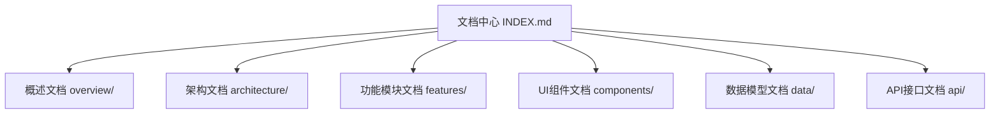
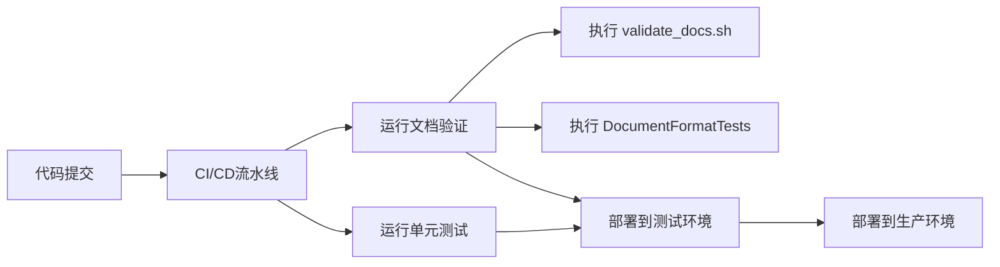

# 文档维护

<cite>
**本文档引用文件**  
- [INDEX.md](file://Docs/INDEX.md)
- [validate_docs.sh](file://Docs/validate_docs.sh)
- [DocumentFormatTests.swift.script](file://Docs/DocumentFormatTests.swift.script)
- [GIT_WORKFLOW.md](file://GIT_WORKFLOW.md)
</cite>

## 目录
1. [引言](#引言)
2. [文档结构组织原则](#文档结构组织原则)
3. [文档与代码同步规范](#文档与代码同步规范)
4. [validate_docs.sh 脚本使用指南](#validatedocssh-脚本使用指南)
5. [文档编写模板](#文档编写模板)
6. [文档状态管理](#文档状态管理)
7. [CI/CD 流程集成](#cicd-流程集成)

## 引言

本文档旨在制定观己(Guanji)项目的技术文档维护规范，确保文档与代码保持同步。通过建立标准化的文档结构、验证机制和更新流程，提升团队协作效率和知识传承质量。所有开发人员在进行功能开发或代码变更时，必须遵循本规范更新相应文档。

## 文档结构组织原则

观己项目的文档体系以 `Docs/INDEX.md` 作为统一的文档中心入口，所有文档均通过此文件进行导航和索引。文档目录采用分类组织方式，便于快速定位相关信息。



**Diagram sources**
- [INDEX.md](file://Docs/INDEX.md#L1-L132)

**Section sources**
- [INDEX.md](file://Docs/INDEX.md#L1-L132)

## 文档与代码同步规范

为确保文档与代码的一致性，项目制定了严格的同步更新规范。所有新功能开发或重大代码变更必须同时更新相应文档，且文档变更应与代码变更在同一次提交中完成。

### 更新责任矩阵

| 变更类型 | 需要更新的文档 |
|---------|---------------|
| 新增/修改数据模型 | [data/](file://Docs/data/) 目录下对应的模型文档 |
| 新增/修改 Repository | [api/repositories.md](file://Docs/api/repositories.md) |
| 新增/修改 Service | [api/services.md](file://Docs/api/services.md) |
| 新增/修改功能模块 | [features/](file://Docs/features/) 目录下对应的功能文档 |
| 新增/修改 UI 组件 | [components/](file://Docs/components/) 目录下对应的组件文档 |
| 架构调整 | [architecture/](file://Docs/architecture/) 目录下对应的架构文档 |

### 开发工作流程

1. **开发前**：查阅相关文档了解现有架构、数据模型和实现细节
2. **开发中**：按照文档规范进行编码实现
3. **开发后**：及时更新对应文档内容
4. **提交前**：运行文档验证脚本确保格式正确

**Section sources**
- [INDEX.md](file://Docs/INDEX.md#L74-L100)
- [GIT_WORKFLOW.md](file://GIT_WORKFLOW.md#L340-L343)

## validate_docs.sh 脚本使用指南

`validate_docs.sh` 脚本用于验证文档格式的完整性和一致性，通过正则表达式检查文档元数据是否符合规范要求。

### 脚本功能

该脚本会检查所有 Markdown 文档是否包含以下元数据字段：

```bash
#!/bin/bash

# 检查导航链接
check_navigation() {
    grep -qE "返回.*\[文档中心\]|返回.*README" "$file"
}

# 检查版本号
check_version() {
    grep -qE "\*\*版本\*\*:.*v?[0-9]+\.[0-9]+\.[0-9]+|版本:.*v?[0-9]+\.[0-9]+\.[0-9]+" "$file"
}

# 检查作者
check_author() {
    grep -qE "\*\*作者\*\*:|作者:|Author:" "$file"
}

# 检查更新日期
check_update_date() {
    grep -qE "\*\*更新日期\*\*:.*[0-9]{4}-[0-9]{2}-[0-9]{2}|\*\*最后更新\*\*:.*[0-9]{4}-[0-9]{2}-[0-9]{2}" "$file"
}

# 检查状态
check_status() {
    grep -qE "\*\*状态\*\*:.*(草稿|审核中|已发布|已废弃)|状态:.*(草稿|审核中|已发布|已废弃)" "$file"
}
```

### 验证规则说明

| 字段 | 正则表达式模式 | 示例值 |
|------|---------------|-------|
| 导航链接 | `返回.*\[文档中心\]|返回.*README` | `> 返回 [文档中心](../INDEX.md)` |
| 版本号 | `\*\*版本\*\*:.*v?[0-9]+\.[0-9]+\.[0-9]+` | `**版本**: v1.3.0` |
| 作者 | `\*\*作者\*\*:|作者:|Author:` | `**作者**: Kiro AI Assistant` |
| 更新日期 | `\*\*更新日期\*\*:.*[0-9]{4}-[0-9]{2}-[0-9]{2}` | `**更新日期**: 2024-12-22` |
| 状态 | `\*\*状态\*\*:.*(草稿|审核中|已发布|已废弃)` | `**状态**: 已发布` |

### 使用方法

```bash
# 快速验证（检查格式）
bash Docs/validate_docs.sh

# 完整测试（包括属性测试）
swift Docs/DocumentFormatTests.swift
```

**Section sources**
- [validate_docs.sh](file://Docs/validate_docs.sh#L1-L122)
- [DocumentFormatTests.swift.script](file://Docs/DocumentFormatTests.swift.script#L1-L800)

## 文档编写模板

为确保文档风格统一，提供标准的文档编写模板如下：

```markdown
# 文档标题

> 返回 [文档中心](../INDEX.md)

## 概述

文档概述内容...

## 详细说明

详细说明内容...

---
**版本**: v1.0.0  
**作者**: 作者姓名  
**更新日期**: 2024-12-17  
**状态**: 草稿
```

### 标准头部信息

所有文档必须在末尾包含以下元数据字段：

- **版本**：遵循语义化版本规范（v主版本.次版本.修订号）
- **作者**：文档编写者姓名或团队
- **更新日期**：最后修改日期（YYYY-MM-DD格式）
- **状态**：文档当前状态（草稿、审核中、已发布、已废弃）

### 结构化内容要求

1. 使用清晰的层级标题组织内容
2. 包含返回文档中心的导航链接
3. 使用表格、图表等可视化元素辅助说明
4. 提供相关文档的链接
5. 包含必要的代码示例路径

**Section sources**
- [INDEX.md](file://Docs/INDEX.md#L67-L71)
- [ai-conversation.md](file://Docs/features/ai-conversation.md#L1-L275)

## 文档状态管理

文档采用生命周期管理机制，通过状态字段标识文档的成熟度和可用性。

### 状态定义

| 状态 | 说明 | 处理流程 |
|------|------|---------|
| 草稿 | 文档正在编写中，内容不完整 | 允许编辑，但不作为参考依据 |
| 审核中 | 文档已完成，等待评审 | 提交代码审查，收集反馈意见 |
| 已发布 | 文档已通过审核，可作为正式参考 | 作为开发和维护的标准依据 |
| 已废弃 | 文档内容过时，不再适用 | 保留历史记录，添加废弃说明 |

### 废弃文档处理流程

1. 将文档状态更新为"已废弃"
2. 在文档开头添加废弃说明和替代文档链接
3. 从文档中心索引中移除或标记为已废弃
4. 保留文件以便历史追溯

**Section sources**
- [validate_docs.sh](file://Docs/validate_docs.sh#L53-L59)
- [INDEX.md](file://Docs/INDEX.md#L128-L132)

## CI/CD 流程集成

为确保文档质量，将文档验证集成到持续集成/持续部署(CI/CD)流程中。

### 集成方案



### 验证检查点

在CI/CD流程中设置以下验证检查点：

1. **代码提交前**：本地运行 `validate_docs.sh` 脚本
2. **Pull Request阶段**：自动执行文档格式验证
3. **构建阶段**：检查文档覆盖率和链接完整性
4. **部署前**：确认所有文档状态为"已发布"

通过将文档验证纳入CI/CD流程，可以有效防止格式不正确或缺失的文档进入生产环境，确保文档体系的完整性和一致性。

**Diagram sources**
- [DocumentFormatTests.swift.script](file://Docs/DocumentFormatTests.swift.script#L674-L684)

**Section sources**
- [DocumentFormatTests.swift.script](file://Docs/DocumentFormatTests.swift.script#L674-L684)
- [validate_docs.sh](file://Docs/validate_docs.sh#L102-L115)