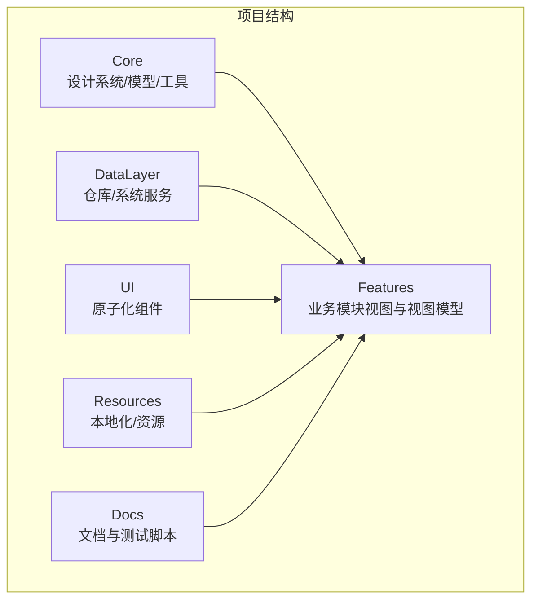
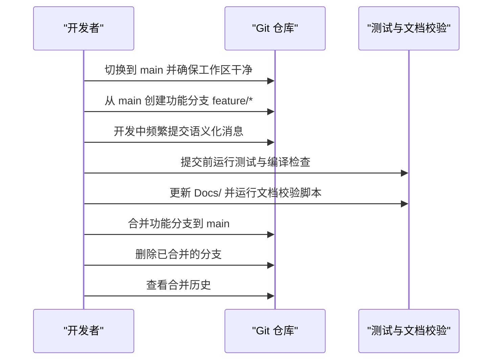
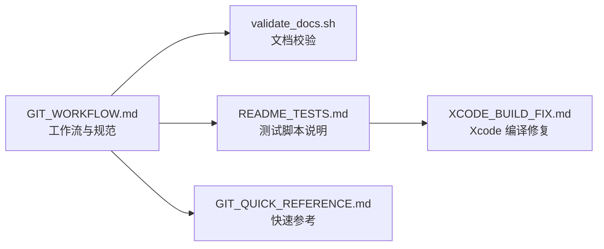

# 版本控制规范

<cite>
**本文引用的文件**
- [GIT_WORKFLOW.md](file://GIT_WORKFLOW.md)
- [GIT_QUICK_REFERENCE.md](file://GIT_QUICK_REFERENCE.md)
- [README.md](file://README.md)
- [validate_docs.sh](file://Docs/validate_docs.sh)
- [README_TESTS.md](file://Docs/README_TESTS.md)
- [XCODE_BUILD_FIX.md](file://Docs/XCODE_BUILD_FIX.md)
</cite>

## 目录
1. [简介](#简介)
2. [项目结构](#项目结构)
3. [核心组件](#核心组件)
4. [架构总览](#架构总览)
5. [详细组件分析](#详细组件分析)
6. [依赖关系分析](#依赖关系分析)
7. [性能考虑](#性能考虑)
8. [故障排查指南](#故障排查指南)
9. [结论](#结论)
10. [附录](#附录)

## 简介
本规范基于仓库内的版本控制工作流与快速参考文档，制定适用于本项目的 Git 使用标准，明确主分支作为“基地代码”的管理原则、功能分支与修复分支的创建与命名规范、标准工作流程、提交消息规范、紧急修复流程与安全点（标签）创建方法，并提供常用 Git 命令速查与每日工作流程示例，强调提交前的代码编译、测试通过与文档同步检查。

## 项目结构
本项目采用 MVVM + 原子化设计的模块化架构，主要目录包括 Features、UI、Core、DataLayer、Resources 与 Docs。版本控制规范围绕 main 分支展开，所有新功能与修复均通过分支进行，最终合并回 main。

图表来源
- [README.md](file://README.md#L13-L46)

章节来源
- [README.md](file://README.md#L1-L81)

## 核心组件
- 主分支（main）：基地代码，仅接收经测试与审查的合并提交。
- 功能分支（feature/*）：用于实现新功能，命名以 feature/ 开头。
- 修复分支（fix/*）：用于紧急或常规 bug 修复，命名以 fix/ 开头。
- 提交消息规范：统一采用类型前缀 + 简短描述，必要时补充详细说明与关联信息。
- 安全点（标签）：在重大变更前创建带注释的标签，便于回溯与审计。

章节来源
- [GIT_WORKFLOW.md](file://GIT_WORKFLOW.md#L9-L13)
- [GIT_WORKFLOW.md](file://GIT_WORKFLOW.md#L136-L156)
- [GIT_WORKFLOW.md](file://GIT_WORKFLOW.md#L208-L224)

## 架构总览
以下序列图展示从 main 分支创建功能分支、开发与合并的完整流程，以及提交消息规范与文档同步检查的关键节点。

图表来源
- [GIT_WORKFLOW.md](file://GIT_WORKFLOW.md#L13-L71)
- [GIT_WORKFLOW.md](file://GIT_WORKFLOW.md#L321-L342)

## 详细组件分析

### 主分支（main）管理原则
- 基地代码：所有新功能与修复必须从 main 分支创建分支，完成后合并回 main。
- 保护规则：禁止直接在 main 开发；禁止提交未测试代码；禁止提交调试代码；禁止提交无关更改；禁止强制推送；必须遵循提交消息规范。
- 合并策略：功能完成并通过测试与编译后方可合并；建议使用快进或线性提交以保持历史清晰。

章节来源
- [GIT_WORKFLOW.md](file://GIT_WORKFLOW.md#L187-L206)

### 分支命名规范与创建流程
- 功能分支：feature/[功能描述]，如 feature/ai-conversation-enhancement。
- 修复分支：fix/[问题描述]，如 fix/timeline-memory-leak。
- 创建步骤：切换到 main，执行 git checkout -b feature/xxx 或 fix/xxx，开发中频繁提交，完成后合并回 main 并删除分支。

章节来源
- [GIT_WORKFLOW.md](file://GIT_WORKFLOW.md#L136-L156)
- [GIT_WORKFLOW.md](file://GIT_WORKFLOW.md#L15-L31)

### 标准工作流程
- 开始新功能：从 main 创建 feature 分支，开发中多次提交，保持每个提交聚焦于单一逻辑单元。
- 开发过程：频繁使用 git status、git diff、git log 等命令检查状态与历史。
- 完成功能：运行测试与编译检查，更新 Docs/ 并执行文档校验脚本，合并到 main 并删除分支。

章节来源
- [GIT_WORKFLOW.md](file://GIT_WORKFLOW.md#L13-L71)
- [GIT_WORKFLOW.md](file://GIT_WORKFLOW.md#L321-L342)

### 提交消息规范
- 格式：类型: 简短描述
  - 可选详细说明
  - 可选关联信息
- 类型标签：
  - feat：新功能
  - fix：Bug 修复
  - refactor：重构
  - docs：文档
  - test：测试
  - style/perf/chore/revert：风格、性能、构建/工具、回滚
- 示例：简单与详细提交消息的写法，包含多行说明与关联信息。

章节来源
- [GIT_WORKFLOW.md](file://GIT_WORKFLOW.md#L93-L134)

### 紧急修复流程（Hotfix）
- 从 main 创建修复分支 fix/[问题名称]，修复后提交并合并回 main，删除修复分支。
- 适用场景：线上紧急问题，需尽快回退到稳定版本时可结合安全点标签使用。

章节来源
- [GIT_WORKFLOW.md](file://GIT_WORKFLOW.md#L73-L91)

### 安全点（标签）创建与使用
- 在重大更改前创建带注释的标签，如 v1.1-base，用于回溯与审计。
- 常用命令：查看标签列表、查看标签详情、切换到标签版本。

章节来源
- [GIT_WORKFLOW.md](file://GIT_WORKFLOW.md#L208-L224)

### 常用 Git 命令速查
- 状态与历史：git status、git log --oneline -10、git log --graph --oneline --all -20。
- 更改查看：git diff、git diff --staged、git show <commit-hash>、git log --follow <文件>。
- 分支管理：git branch -a、git branch --show-current。
- 合并与删除：git merge、git branch -d。
- 撤销与回退：git restore、git restore --staged、git reset、git revert。
- 标签管理：git tag -l、git show、git checkout <tag>。

章节来源
- [GIT_WORKFLOW.md](file://GIT_WORKFLOW.md#L158-L185)
- [GIT_QUICK_REFERENCE.md](file://GIT_QUICK_REFERENCE.md#L33-L39)

### 每日工作流程示例
- 早晨：进入项目目录，检查状态，切换到 main，开始新功能分支。
- 开发中：多次提交，每次聚焦单一逻辑单元。
- 完成后：运行测试与编译检查，更新 Docs/ 并执行文档校验脚本，合并到 main 并删除分支，查看当日历史。

章节来源
- [GIT_WORKFLOW.md](file://GIT_WORKFLOW.md#L288-L319)

### 提交前检查清单
- 代码能编译？
- 测试通过？（swift run_unit_tests.swift）
- 文档更新？（更新 Docs/ 并运行 bash Docs/validate_docs.sh）
- 本地化字符串添加？
- 无调试代码？

章节来源
- [GIT_WORKFLOW.md](file://GIT_WORKFLOW.md#L321-L342)
- [README_TESTS.md](file://Docs/README_TESTS.md#L11-L25)

### 冲突解决与回退策略
- 冲突解决：git status 查看冲突文件，手动编辑解决冲突标记，git add 标记为已解决，git commit 完成合并。
- 回退策略：git reset --soft/--hard 回退到上一提交；git revert 创建新提交撤销某次提交。
- 标签回退：git checkout <tag> 切换到标签版本。

章节来源
- [GIT_WORKFLOW.md](file://GIT_WORKFLOW.md#L369-L385)
- [GIT_WORKFLOW.md](file://GIT_WORKFLOW.md#L226-L247)

## 依赖关系分析
版本控制规范与项目文档、测试脚本存在紧密耦合关系：
- 提交前检查依赖测试脚本与文档校验脚本。
- Xcode 编译问题通过重命名测试脚本扩展名与调整文档索引避免编译错误。
- 文档校验脚本对 Markdown 元数据字段进行验证，确保文档标准化。

图表来源
- [GIT_WORKFLOW.md](file://GIT_WORKFLOW.md#L187-L206)
- [validate_docs.sh](file://Docs/validate_docs.sh#L1-L122)
- [README_TESTS.md](file://Docs/README_TESTS.md#L1-L38)
- [XCODE_BUILD_FIX.md](file://Docs/XCODE_BUILD_FIX.md#L1-L51)
- [GIT_QUICK_REFERENCE.md](file://GIT_QUICK_REFERENCE.md#L1-L83)

章节来源
- [validate_docs.sh](file://Docs/validate_docs.sh#L1-L122)
- [README_TESTS.md](file://Docs/README_TESTS.md#L1-L38)
- [XCODE_BUILD_FIX.md](file://Docs/XCODE_BUILD_FIX.md#L1-L51)

## 性能考虑
- 小步提交：每个提交聚焦单一逻辑单元，便于定位问题与减少合并冲突。
- 频繁状态检查：使用 git status、git diff、git log 等命令及时发现异常更改。
- 合并策略：优先使用快进或线性提交，保持历史清晰，降低后续回溯成本。
- 文档同步：在代码变更后同步更新 Docs/ 并执行校验脚本，避免后期集中处理导致的大量改动。

## 故障排查指南
- 编译错误：Xcode 报错 Multiple commands produce，需删除 .gitkeep、重命名测试脚本扩展名为 .swift.script、将 Docs/README.md 重命名为 Docs/INDEX.md。
- 文档校验失败：运行 bash Docs/validate_docs.sh，检查缺失的元数据字段（导航链接、版本号、作者、更新日期、状态）。
- 测试未通过：在项目根目录运行 swift Docs/DocumentFormatTests.swift.script 或 bash Docs/validate_docs.sh。
- 紧急回退：使用 git checkout <tag> 切换到安全点标签版本；必要时使用 git reset --hard 回退到指定提交。

章节来源
- [XCODE_BUILD_FIX.md](file://Docs/XCODE_BUILD_FIX.md#L1-L51)
- [validate_docs.sh](file://Docs/validate_docs.sh#L1-L122)
- [README_TESTS.md](file://Docs/README_TESTS.md#L11-L25)
- [GIT_WORKFLOW.md](file://GIT_WORKFLOW.md#L226-L247)

## 结论
本规范以 GIT_WORKFLOW.md 与 GIT_QUICK_REFERENCE.md 为核心依据，明确了主分支管理原则、分支命名与创建流程、提交消息规范、紧急修复与安全点标签使用方法，并配套常用命令速查与每日工作流程示例。通过严格的提交前检查（编译、测试、文档同步）与冲突解决策略，确保项目版本演进的稳定性与可追溯性。

## 附录
- 提交消息类型速查表
  - feat：新功能
  - fix：Bug 修复
  - refactor：重构
  - docs：文档
  - test：测试
  - style/perf/chore/revert：风格、性能、构建/工具、回滚
- 常用命令速查
  - 状态与历史：git status、git log --oneline -10、git log --graph --oneline --all -20
  - 更改查看：git diff、git diff --staged、git show <commit-hash>、git log --follow <文件>
  - 分支管理：git branch -a、git branch --show-current
  - 合并与删除：git merge、git branch -d
  - 撤销与回退：git restore、git restore --staged、git reset、git revert
  - 标签管理：git tag -l、git show、git checkout <tag>

章节来源
- [GIT_QUICK_REFERENCE.md](file://GIT_QUICK_REFERENCE.md#L41-L66)
- [GIT_WORKFLOW.md](file://GIT_WORKFLOW.md#L158-L185)
- [GIT_WORKFLOW.md](file://GIT_WORKFLOW.md#L226-L247)