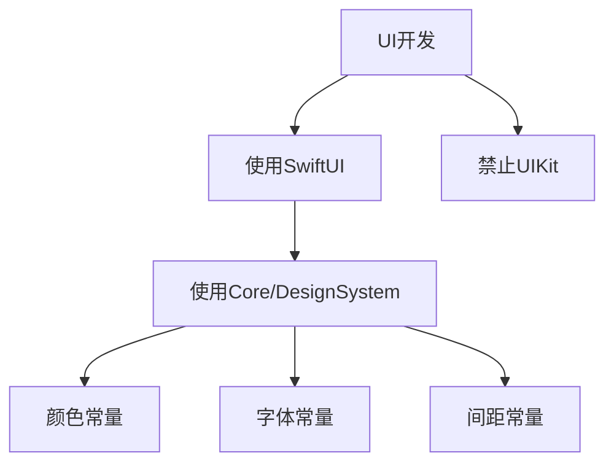
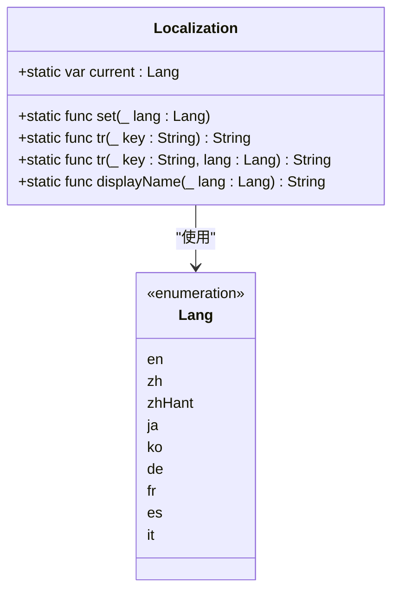
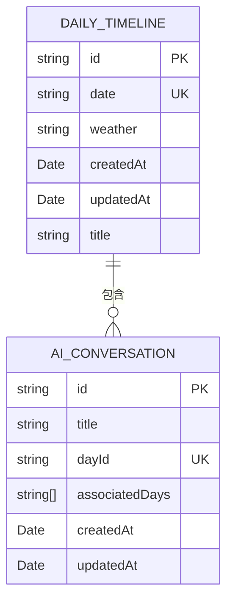
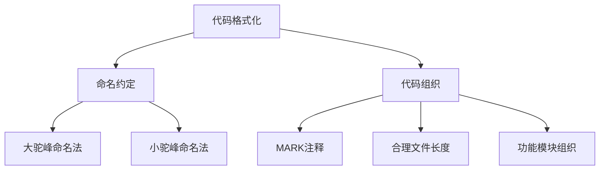

# 编码规范

<cite>
**本文档引用的文件**
- [DATA_FORMAT_STANDARD.md](file://Docs/DATA_FORMAT_STANDARD.md)
- [Colors.swift](file://guanji0.34/Core/DesignSystem/Colors.swift)
- [Typography.swift](file://guanji0.34/Core/DesignSystem/Typography.swift)
- [DateUtilities.swift](file://guanji0.34/Core/Utilities/DateUtilities.swift)
- [Localization.swift](file://guanji0.34/Utils/Localization.swift)
- [DailyTimeline.swift](file://guanji0.34/Core/Models/DailyTimeline.swift)
- [AIConversationModels.swift](file://guanji0.34/Core/Models/AIConversationModels.swift)
- [TimelineScreen.swift](file://guanji0.34/Features/Timeline/TimelineScreen.swift)
- [ProfileScreen.swift](file://guanji0.34/Features/Profile/ProfileScreen.swift)
- [InputAtoms.swift](file://guanji0.34/UI/Atoms/InputAtoms.swift)
- [Icons.swift](file://guanji0.34/Core/DesignSystem/Icons.swift)
- [DailyExportView.swift](file://guanji0.34/Features/Debug/DailyExportView.swift)
</cite>

## 目录
1. [引言](#引言)
2. [UI开发规范](#ui开发规范)
3. [国际化与本地化](#国际化与本地化)
4. [设计系统常量](#设计系统常量)
5. [日期时间处理](#日期时间处理)
6. [代码格式化标准](#代码格式化标准)
7. [总结](#总结)

## 引言
本编码规范文档旨在确保项目代码的一致性与可维护性。通过明确的开发准则，指导开发团队遵循统一的实践方法，提升代码质量，减少技术债务。本文档涵盖了UI开发、国际化、设计系统、日期处理和代码格式化等关键方面的规范要求。

## UI开发规范
项目UI开发必须严格遵循SwiftUI框架，禁止使用UIKit组件。所有界面元素应使用原生SwiftUI组件构建，确保跨平台一致性和现代化的开发体验。



**图源**
- [Colors.swift](file://guanji0.34/Core/DesignSystem/Colors.swift)
- [Typography.swift](file://guanji0.34/Core/DesignSystem/Typography.swift)
- [InputAtoms.swift](file://guanji0.34/UI/Atoms/InputAtoms.swift)

**本节来源**
- [TimelineScreen.swift](file://guanji0.34/Features/Timeline/TimelineScreen.swift)
- [ProfileScreen.swift](file://guanji0.34/Features/Profile/ProfileScreen.swift)

## 国际化与本地化
所有用户可见的字符串必须通过`Localization.tr()`方法获取，禁止硬编码文本。系统支持多种语言，包括英语、简体中文、繁体中文、日语、韩语、德语、法语、西班牙语和意大利语。



**图源**
- [Localization.swift](file://guanji0.34/Utils/Localization.swift)

**本节来源**
- [Localization.swift](file://guanji0.34/Utils/Localization.swift)
- [ProfileScreen.swift](file://guanji0.34/Features/Profile/ProfileScreen.swift)

## 设计系统常量
避免使用魔法数字，所有颜色、字体、间距等设计参数必须引用`Core/DesignSystem`中的常量。设计系统提供了统一的视觉语言，确保应用界面的一致性。

### 颜色规范
颜色常量定义在`Colors.swift`文件中，包括背景色、文本色、系统灰色和多种主题色。

```swift
public enum Colors {
    public static let background = Color(uiColor: .systemBackground)
    public static let text = Color.primary
    public static let systemGray = Color(uiColor: .systemGray)
    public static let indigo = Color(.sRGB, red: 79/255, green: 70/255, blue: 229/255, opacity: 1)
    public static let amber = Color(.sRGB, red: 245/255, green: 158/255, blue: 11/255, opacity: 1)
    // ... 其他颜色
}
```

### 字体规范
字体常量定义在`Typography.swift`文件中，包括雕刻字体、衬线字体、标题、正文和说明文字。

```swift
public enum Typography {
    public static let fontEngraved = Font.system(size: 10, weight: .semibold, design: .default)
    public static let fontSerif = Font.system(size: 16, weight: .regular, design: .serif)
    public static let header = Font.system(size: 20, weight: .semibold, design: .default)
    public static let body = Font.system(size: 15, weight: .regular, design: .default)
    public static let caption = Font.system(size: 12, weight: .regular, design: .default)
}
```

**本节来源**
- [Colors.swift](file://guanji0.34/Core/DesignSystem/Colors.swift)
- [Typography.swift](file://guanji0.34/Core/DesignSystem/Typography.swift)

## 日期时间处理
所有模型中的日期字段必须遵循`DATA_FORMAT_STANDARD.md`中规定的日期格式标准（yyyy.MM.dd）。时间戳字段使用`Date`类型或ISO 8601格式，并使用`DateUtilities`工具类进行日期格式化和解析。

### 日期格式标准
统一使用`yyyy.MM.dd`格式，具有良好的可读性、排序友好性和国际化特性。



### DateUtilities工具类
`DateUtilities`提供了日期格式化、解析和获取当前日期的便捷方法。

```swift
public enum DateUtilities {
    public static var today: String
    public static func format(_ date: Date) -> String
    public static func formatDate(_ date: Date) -> String
    public static func parse(_ dateString: String) -> Date?
}
```

**图源**
- [DATA_FORMAT_STANDARD.md](file://Docs/DATA_FORMAT_STANDARD.md)
- [DateUtilities.swift](file://guanji0.34/Core/Utilities/DateUtilities.swift)
- [DailyTimeline.swift](file://guanji0.34/Core/Models/DailyTimeline.swift)
- [AIConversationModels.swift](file://guanji0.34/Core/Models/AIConversationModels.swift)

**本节来源**
- [DATA_FORMAT_STANDARD.md](file://Docs/DATA_FORMAT_STANDARD.md)
- [DateUtilities.swift](file://guanji0.34/Core/Utilities/DateUtilities.swift)
- [DailyTimeline.swift](file://guanji0.34/Core/Models/DailyTimeline.swift)
- [AIConversationModels.swift](file://guanji0.34/Core/Models/AIConversationModels.swift)

## 代码格式化标准
遵循一致的命名约定、缩进风格和代码组织原则，确保代码的可读性和可维护性。

### 命名约定
- 类名和结构体名使用大驼峰命名法（PascalCase）
- 方法名和变量名使用小驼峰命名法（camelCase）
- 常量名使用大驼峰命名法
- 枚举值使用小驼峰命名法

### 代码组织
- 使用MARK注释分隔代码区域
- 保持合理的文件长度，避免单个文件过大
- 按功能模块组织代码结构
- 使用适当的空行分隔逻辑块



**本节来源**
- [TimelineScreen.swift](file://guanji0.34/Features/Timeline/TimelineScreen.swift)
- [AIConversationModels.swift](file://guanji0.34/Core/Models/AIConversationModels.swift)
- [DailyExportView.swift](file://guanji0.34/Features/Debug/DailyExportView.swift)

## 总结
本编码规范为项目开发提供了明确的指导原则。通过遵循这些规范，开发团队可以确保代码的一致性、可维护性和高质量。关键要点包括：使用SwiftUI进行UI开发、通过`Localization.tr()`处理国际化、引用设计系统常量避免魔法数字、遵循统一的日期格式标准，以及保持一致的代码格式化风格。这些规范的实施将有助于构建一个健壮、可扩展和易于维护的应用程序。