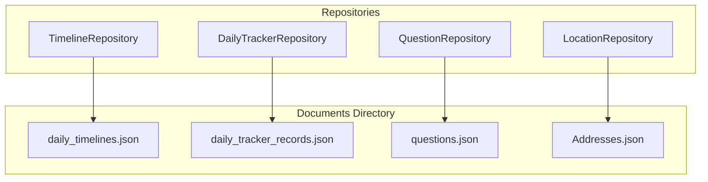
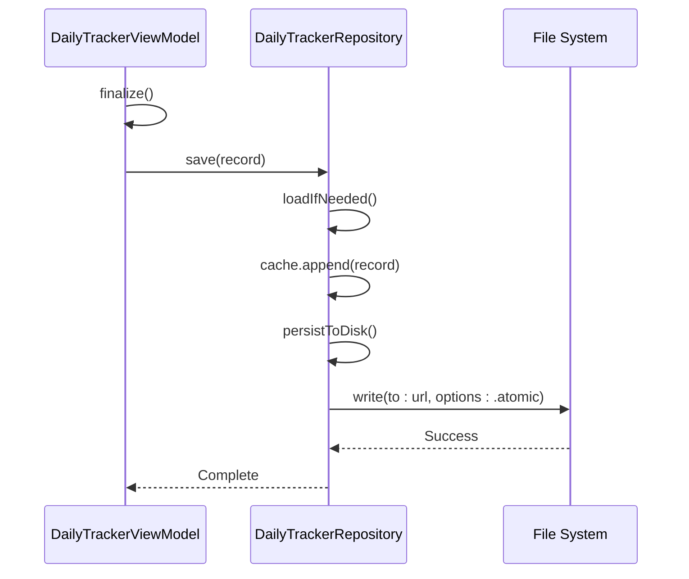

# 仓库模式实现

<cite>
**本文档引用文件**  
- [repositories.md](file://Docs/api/repositories.md)
- [TimelineRepository.swift](file://guanji0.34/DataLayer/Repositories/TimelineRepository.swift)
- [DailyTrackerRepository.swift](file://guanji0.34/DataLayer/Repositories/DailyTrackerRepository.swift)
- [MindStateRepository.swift](file://guanji0.34/DataLayer/Repositories/MindStateRepository.swift)
- [DailyTimeline.swift](file://guanji0.34/Core/Models/DailyTimeline.swift)
- [MindStateRecord.swift](file://guanji0.34/Core/Models/MindStateRecord.swift)
- [DailyTrackerModels.swift](file://guanji0.34/Core/Models/DailyTrackerModels.swift)
- [TimelineViewModel.swift](file://guanji0.34/Features/Timeline/TimelineViewModel.swift)
- [DailyTrackerViewModel.swift](file://guanji0.34/Features/DailyTracker/DailyTrackerViewModel.swift)
</cite>

## 目录
1. [概述](#概述)
2. [核心仓库类职责划分](#核心仓库类职责划分)
3. [数据源抽象与文件持久化](#数据源抽象与文件持久化)
4. [单例模式与线程安全](#单例模式与线程安全)
5. [关键方法实现分析](#关键方法实现分析)
6. [与ViewModel的依赖关系](#与viewmodel的依赖关系)
7. [调用链示例](#调用链示例)
8. [未来扩展性](#未来扩展性)

## 概述

观己应用的数据仓库层（Repository Layer）遵循仓库模式，为上层 ViewModel 提供统一的数据访问接口。仓库层负责数据的持久化、内存缓存管理和业务数据访问，其核心设计原则包括单例模式、内存缓存与异步持久化、通过 NotificationCenter 发送数据变更通知，以及使用 JSON 文件在 Documents 目录下进行存储。

**仓库层设计原则**
- **单例模式 (Singleton Pattern)**: 所有仓库类均通过 `public static let shared` 实现单例，确保全局唯一实例。
- **内存缓存 + 异步持久化**: 数据在内存中缓存以提高访问速度，所有写入操作均在后台线程异步执行，避免阻塞主线程。
- **数据变更通知**: 通过 `NotificationCenter` 在数据更新时发送通知，如 `gj_timeline_updated` 和 `gj_tracker_updated`。
- **JSON 文件存储**: 所有数据最终以 JSON 格式持久化到设备的 Documents 目录中。

**Section sources**
- [repositories.md](file://Docs/api/repositories.md#L7-L14)

## 核心仓库类职责划分

仓库层包含多个具体的仓库类，每个类负责管理特定领域的数据。其中，`TimelineRepository` 和 `DailyTrackerRepository` 是两个核心实现。

### TimelineRepository

`TimelineRepository` 负责管理每日时间轴数据，包括场景块（SceneGroup）和旅程块（JourneyBlock）。其主要职责是提供对 `DailyTimeline` 容器的创建、获取、保存和更新操作。

**核心方法**
- `getDailyTimeline(for:)`: 获取指定日期的时间轴，若不存在则创建新的骨架。
- `save(timeline:)`: 保存或更新一个 `DailyTimeline` 对象。
- `appendItem(_:for:)`: 向指定日期的时间轴追加一个时间轴项目。
- `getAllTimelines()`: 获取所有时间轴数据，并按日期降序排列。

**Section sources**
- [repositories.md](file://Docs/api/repositories.md#L33-L69)
- [TimelineRepository.swift](file://guanji0.34/DataLayer/Repositories/TimelineRepository.swift#L28-L176)

### DailyTrackerRepository

`DailyTrackerRepository` 负责管理每日追踪数据，存储用户每日的身体能量、心情天气和活动记录。它提供对 `DailyTrackerRecord` 对象的增删改查操作。

**核心方法**
- `save(_:)`: 保存一个每日追踪记录，若同日期记录已存在则覆盖。
- `load(for:)`: 加载指定日期的追踪记录。
- `loadAll()`: 加载所有追踪记录。
- `delete(for:)`: 删除指定日期的追踪记录。

**Section sources**
- [repositories.md](file://Docs/api/repositories.md#L254-L272)
- [DailyTrackerRepository.swift](file://guanji0.34/DataLayer/Repositories/DailyTrackerRepository.swift#L22-L59)

### MindStateRepository

`MindStateRepository` 负责管理心境记录数据，其持久化方式与其他仓库不同，使用 `UserDefaults` 存储所有心境记录的数组。

**核心方法**
- `save(_:)`: 保存一条心境记录，将其追加到现有列表中并重新编码存储。
- `loadAll()`: 从 `UserDefaults` 中加载所有心境记录。
- `load(for:)`: 加载指定日期的心境记录。

**Section sources**
- [repositories.md](file://Docs/api/repositories.md#L154-L169)
- [MindStateRepository.swift](file://guanji0.34/DataLayer/Repositories/MindStateRepository.swift#L6-L18)

## 数据源抽象与文件持久化

仓库模式作为数据源（DataSource）的抽象层，统一处理本地文件存储（JSON）的读写操作。每个仓库类都封装了文件路径的管理、数据的序列化与反序列化，以及错误处理逻辑。

### 文件存储策略

所有仓库的持久化文件均存储在应用的 Documents 目录下，具体路径如下：
- `TimelineRepository`: `Documents/TimelineData_v2/daily_timelines.json`
- `DailyTrackerRepository`: `Documents/daily_tracker_records.json`
- `QuestionRepository`: `Documents/TimelineData/questions.json`



**Diagram sources**
- [TimelineRepository.swift](file://guanji0.34/DataLayer/Repositories/TimelineRepository.swift#L7-L19)
- [DailyTrackerRepository.swift](file://guanji0.34/DataLayer/Repositories/DailyTrackerRepository.swift#L7-L17)
- [QuestionRepository.swift](file://guanji0.34/DataLayer/Repositories/QuestionRepository.swift#L10-L12)

### 持久化实现

持久化操作在后台线程异步执行，以避免阻塞 UI。例如，`TimelineRepository` 的 `persistToDisk()` 方法使用 `DispatchQueue.global(qos: .background)` 来执行文件写入。

```swift
private func persistToDisk() {
    DispatchQueue.global(qos: .background).async {
        do {
            let data = try JSONEncoder().encode(self.timelineCache)
            try data.write(to: self.dailyTimelinesURL)
        } catch {
            print("Timeline Persistence Error: \(error)")
        }
    }
}
```

**Section sources**
- [repositories.md](file://Docs/api/repositories.md#L456-L464)
- [TimelineRepository.swift](file://guanji0.34/DataLayer/Repositories/TimelineRepository.swift#L155-L164)

## 单例模式与线程安全

所有仓库类均采用单例模式设计，通过 `public static let shared` 创建全局唯一的实例。这种设计确保了数据的一致性和全局可访问性。

### 线程安全策略

仓库层通过以下方式保证线程安全：
1. **内存缓存**: 数据在内存中缓存，读取操作是线程安全的。
2. **异步写入**: 所有持久化操作在后台线程执行，避免了主线程阻塞。
3. **原子操作**: 文件写入使用 `.atomic` 选项（如 `DailyTrackerRepository`），确保写入过程的完整性。

`DailyTrackerRepository` 在 `persistToDisk()` 中使用了原子写入，防止数据损坏。

```swift
try data.write(to: url, options: .atomic)
```

**Section sources**
- [TimelineRepository.swift](file://guanji0.34/DataLayer/Repositories/TimelineRepository.swift#L4)
- [DailyTrackerRepository.swift](file://guanji0.34/DataLayer/Repositories/DailyTrackerRepository.swift#L5)
- [DailyTrackerRepository.swift](file://guanji0.34/DataLayer/Repositories/DailyTrackerRepository.swift#L94)

## 关键方法实现分析

### fetchTimeline(for:) 的等效实现

虽然仓库中没有名为 `fetchTimeline(for:)` 的方法，但 `getDailyTimeline(for:)` 实现了相同的功能。该方法首先检查内存缓存，若存在则直接返回；若不存在，则创建一个新的 `DailyTimeline` 骨架并持久化。

```swift
public func getDailyTimeline(for date: String) -> DailyTimeline {
    if let existing = timelineCache[date] {
        return existing
    }
    
    // 创建新骨架
    let newId = "day_" + date.replacingOccurrences(of: ".", with: "")
    let newTimeline = DailyTimeline(id: newId, date: date)
    timelineCache[date] = newTimeline
    persistToDisk()
    return newTimeline
}
```

**Section sources**
- [TimelineRepository.swift](file://guanji0.34/DataLayer/Repositories/TimelineRepository.swift#L30-L41)

### saveMindStateRecord(_:) 的实现

`MindStateRepository` 的 `save(_:)` 方法将新的心境记录追加到从 `UserDefaults` 加载的列表中，然后将整个列表重新编码并存储回去。

```swift
public func save(_ record: MindStateRecord) {
    var all = loadAll()
    all.append(record)
    if let data = try? JSONEncoder().encode(all) {
        UserDefaults.standard.set(data, forKey: key)
    }
}
```

此方法利用了 `UserDefaults` 的线程安全特性，但频繁的读写操作可能影响性能。

**Section sources**
- [MindStateRepository.swift](file://guanji0.34/DataLayer/Repositories/MindStateRepository.swift#L6-L11)

### Combine 框架的使用

`TimelineViewModel` 使用 Combine 框架来响应数据变化。例如，它通过 `Publishers.CombineLatest` 监听 `items` 和 `todayQuestions` 的变化，并在主线程上更新显示项。

```swift
Publishers.CombineLatest($items, $todayQuestions)
    .receive(on: RunLoop.main)
    .sink { [weak self] (items, questions) in
        self?.updateDisplayItems(items: items, questions: questions)
    }
    .store(in: &cancellables)
```

**Section sources**
- [TimelineViewModel.swift](file://guanji0.34/Features/Timeline/TimelineViewModel.swift#L19-L24)

## 与ViewModel的依赖关系

仓库通过全局单例实例为 ViewModel 提供数据服务，实现了依赖注入的一种简化形式。

### TimelineViewModel 依赖

`TimelineViewModel` 直接依赖 `TimelineRepository.shared` 来加载和保存时间轴数据。它在 `load(date:)` 方法中调用 `TimelineRepository.shared.getDailyTimeline(for: targetDate)` 来获取数据。

```swift
let timeline = TimelineRepository.shared.getDailyTimeline(for: targetDate)
```

同时，`TimelineViewModel` 监听 `gj_timeline_updated` 通知，以便在数据变更时刷新 UI。

**Section sources**
- [TimelineViewModel.swift](file://guanji0.34/Features/Timeline/TimelineViewModel.swift#L56)
- [TimelineViewModel.swift](file://guanji0.34/Features/Timeline/TimelineViewModel.swift#L28-L30)

### DailyTrackerViewModel 依赖

`DailyTrackerViewModel` 在 `save()` 方法中调用 `DailyTrackerRepository.shared.save(record)` 来持久化数据。

```swift
DailyTrackerRepository.shared.save(record)
```

**Section sources**
- [DailyTrackerViewModel.swift](file://guanji0.34/Features/DailyTracker/DailyTrackerViewModel.swift#L239)

## 调用链示例

以下展示了从 ViewModel 到 Repository 再到文件 I/O 的完整调用链。

### ViewModel → Repository → 文件I/O

当用户在 `DailyTrackerFlowScreen` 中完成每日追踪并点击保存时，调用链如下：



1.  **ViewModel**: `DailyTrackerViewModel` 调用 `finalize()` 创建 `DailyTrackerRecord`，然后调用 `DailyTrackerRepository.shared.save(record)`。
2.  **Repository**: `DailyTrackerRepository` 将记录添加到内存缓存 `cache` 中，然后调用 `persistToDisk()`。
3.  **文件I/O**: `persistToDisk()` 在后台线程将整个缓存数组编码为 JSON 并原子性地写入文件。

**Diagram sources**
- [DailyTrackerViewModel.swift](file://guanji0.34/Features/DailyTracker/DailyTrackerViewModel.swift#L237-L239)
- [DailyTrackerRepository.swift](file://guanji0.34/DataLayer/Repositories/DailyTrackerRepository.swift#L22-L30)
- [DailyTrackerRepository.swift](file://guanji0.34/DataLayer/Repositories/DailyTrackerRepository.swift#L89-L94)

## 未来扩展性

仓库模式的设计具有良好的扩展性，可以轻松适配 CoreData 或 CloudKit 等其他数据存储方案。

### 接口适配策略

为了支持多种数据源，可以定义一个 `DataSource` 协议，让 `TimelineRepository` 依赖于该协议而非具体的实现。

```swift
protocol TimelineDataSource {
    func load() throws -> [String: DailyTimeline]
    func save(_ data: [String: DailyTimeline]) throws
}

class TimelineRepository {
    private let dataSource: TimelineDataSource
    
    init(dataSource: TimelineDataSource = JSONTimelineDataSource()) {
        self.dataSource = dataSource
        loadFromDisk()
    }
    
    private func loadFromDisk() {
        // 使用 dataSource 而非直接文件操作
        self.timelineCache = try? dataSource.load() ?? [:]
    }
    
    private func persistToDisk() {
        DispatchQueue.global(qos: .background).async {
            try? self.dataSource.save(self.timelineCache)
        }
    }
}
```

通过此策略，可以创建 `CoreDataTimelineDataSource` 或 `CloudKitTimelineDataSource` 来实现不同的持久化逻辑，而无需修改 `TimelineRepository` 的核心逻辑，从而实现无缝切换。

**Section sources**
- [TimelineRepository.swift](file://guanji0.34/DataLayer/Repositories/TimelineRepository.swift#L148-L164)