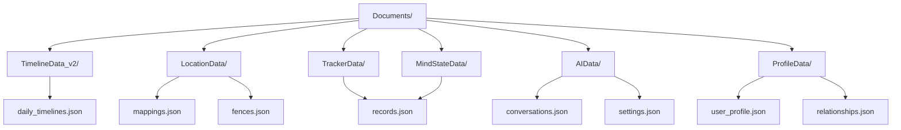
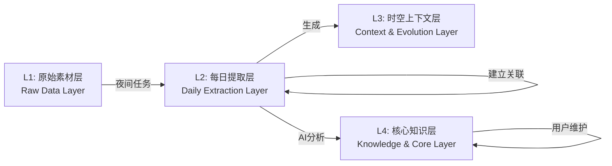

# 持久化策略

<cite>
**本文档引用的文件**  
- [data-architecture.md](file://Docs/architecture/data-architecture.md)
- [DAILY_EXPORT_GUIDE.md](file://Docs/DAILY_EXPORT_GUIDE.md)
- [DailyDataExporter.swift](file://guanji0.34/Core/Utilities/DailyDataExporter.swift)
- [TimelineRepository.swift](file://guanji0.34/DataLayer/Repositories/TimelineRepository.swift)
- [DailyTrackerRepository.swift](file://guanji0.34/DataLayer/Repositories/DailyTrackerRepository.swift)
- [MindStateRepository.swift](file://guanji0.34/DataLayer/Repositories/MindStateRepository.swift)
- [DailyExtractionService.swift](file://guanji0.34/DataLayer/SystemServices/DailyExtractionService.swift)
- [DailyTimeline.swift](file://guanji0.34/Core/Models/DailyTimeline.swift)
- [DailyTrackerModels.swift](file://guanji0.34/Core/Models/DailyTrackerModels.swift)
- [MindStateModels.swift](file://guanji0.34/Core/Models/MindStateModels.swift)
</cite>

## 目录
1. [引言](#引言)
2. [存储结构设计](#存储结构设计)
3. [数据分片与组织策略](#数据分片与组织策略)
4. [数据完整性保障机制](#数据完整性保障机制)
5. [未来分层存储迁移路径](#未来分层存储迁移路径)
6. [性能优化建议](#性能优化建议)
7. [数据导出与导入安全](#数据导出与导入安全)
8. [结论](#结论)

## 引言

本系统采用基于文件系统的JSON持久化方案，旨在为用户提供安全、可靠且可扩展的数据存储体验。当前系统以L1原始素材层为核心，将日记、追踪、AI对话等数据按日期分片存储于沙盒文档目录中。系统通过`DailyDataExporter`等工具将内存模型序列化为结构化JSON，并通过原子写入和后台持久化机制保障数据完整性。未来规划向L1-L4四层记忆系统迁移，实现从扁平结构到分层目录的演进，以支持更复杂的AI分析与知识提取功能。

**本文档引用的文件**
- [data-architecture.md](file://Docs/architecture/data-architecture.md)

## 存储结构设计

系统当前采用功能分目录的扁平化存储结构，所有数据均存储在应用沙盒的`Documents/`目录下。每个功能模块拥有独立的子目录，如`TimelineData_v2/`、`TrackerData/`、`AIData/`等，分别存放对应类型的数据。核心数据模型如`DailyTimeline`、`DailyTrackerRecord`等通过JSON序列化后存储在各自的JSON文件中。

**图示来源**
- [data-architecture.md](file://Docs/architecture/data-architecture.md#L1)

## 数据分片与组织策略

系统采用按日期组织的数据分片策略，以优化读取性能并简化数据管理。对于日记、追踪等每日生成的数据，系统以`yyyy.MM.dd`格式的日期字符串作为主键，将数据聚合在单个`DailyTimeline`对象中。`TimelineRepository`维护一个内存缓存，将日期映射到对应的`DailyTimeline`实例，避免频繁的磁盘I/O。

对于`DailyTrackerRecord`，系统采用数组缓存模式，将所有记录加载到内存中，并通过日期进行索引。`DailyTrackerRepository`在首次访问时从`daily_tracker_records.json`文件加载所有数据，后续操作均在内存中进行，最后通过原子写入持久化到磁盘。这种策略平衡了读取性能与内存占用。

**本文档引用的文件**
- [TimelineRepository.swift](file://guanji0.34/DataLayer/Repositories/TimelineRepository.swift#L10-L21)
- [DailyTrackerRepository.swift](file://guanji0.34/DataLayer/Repositories/DailyTrackerRepository.swift#L8-L10)

## 数据完整性保障机制

系统通过多重机制保障数据完整性。首先，所有写入操作均在后台线程执行，避免阻塞主线程。`TimelineRepository`使用`DispatchQueue.global(qos: .background)`将序列化和写入操作异步化，确保UI流畅。

其次，系统采用原子写入（atomic write）策略。`DailyTrackerRepository`在写入`daily_tracker_records.json`时使用`Data.write(to:options: .atomic)`，确保文件写入的原子性，防止因应用崩溃导致文件损坏。

此外，系统在写入前会进行数据验证和状态更新。例如，`TimelineRepository`在保存`DailyTimeline`时会自动调用`regenerateTags()`方法重新计算标签，并更新`updatedAt`时间戳，确保数据一致性。

**本文档引用的文件**
- [TimelineRepository.swift](file://guanji0.34/DataLayer/Repositories/TimelineRepository.swift#L157-L164)
- [DailyTrackerRepository.swift](file://guanji0.34/DataLayer/Repositories/DailyTrackerRepository.swift#L94)

## 未来分层存储迁移路径

系统规划了从当前扁平结构向L1-L4四层记忆系统的迁移路径。未来存储结构将重构为层级分目录，如`L1_RawData/`、`L2_DailyExtraction/`等。`L1_RawData`将按年月组织日记文件，如`days/YYYY-MM/YYYY-MM-DD.json`，以支持更高效的时间范围查询。

`DailyExtractionService`是实现L2层的关键组件，它负责从L1数据生成脱敏后的数据包，供AI分析使用。该服务已实现，但相关功能待开发。未来，系统将通过夜间任务自动执行数据提取，生成`DailySummary`并建立`EvidenceLink`，实现L1到L2的数据流转。

**图示来源**
- [data-architecture.md](file://Docs/architecture/data-architecture.md#L2)
- [DailyExtractionService.swift](file://guanji0.34/DataLayer/SystemServices/DailyExtractionService.swift)

## 性能优化建议

为提升系统性能，建议采用以下优化策略：

1. **缓存策略**：对于频繁访问的数据，如`DailyTimeline`，应维持内存缓存。`TimelineRepository`的缓存设计已有效减少磁盘I/O，可进一步优化缓存大小和淘汰策略。

2. **批量读写**：对于`DailyTrackerRecord`等数据，采用批量加载和写入模式，减少文件打开/关闭的开销。当前`DailyTrackerRepository`的实现已采用此策略。

3. **异步I/O**：所有文件读写操作必须在后台线程执行，避免阻塞主线程。`TimelineRepository`和`DailyTrackerRepository`均已实现异步持久化。

4. **数据分片**：按日期分片数据，避免单个文件过大。未来向`L1_RawData/days/YYYY-MM/`结构迁移，可进一步优化按月查询性能。

**本文档引用的文件**
- [TimelineRepository.swift](file://guanji0.34/DataLayer/Repositories/TimelineRepository.swift#L157-L164)
- [DailyTrackerRepository.swift](file://guanji0.34/DataLayer/Repositories/DailyTrackerRepository.swift#L89-L97)

## 数据导出与导入安全

`DailyDataExporter`提供数据导出功能，将指定日期的所有数据导出为纯文本格式。导出内容包含日记、AI对话、心境记录等，但不包含媒体文件和L4常量数据。导出过程通过`DailyDataExporter.exportDay(_:)`方法实现，该方法从各`Repository`获取数据并格式化为文本。

安全方面，系统建议用户对导出文件进行加密存储，并仅在可信环境中分享。导出功能不包含文件加密，需由用户或系统级安全机制处理。未来可集成文件加密API，提供端到端加密导出。

**本文档引用的文件**
- [DAILY_EXPORT_GUIDE.md](file://Docs/DAILY_EXPORT_GUIDE.md)
- [DailyDataExporter.swift](file://guanji0.34/Core/Utilities/DailyDataExporter.swift)

## 结论

当前系统的JSON持久化方案通过功能分目录和按日期分片的策略，实现了数据的有序存储和高效访问。通过内存缓存、异步I/O和原子写入等机制，保障了数据完整性和系统性能。未来向L1-L4四层架构的迁移，将为AI驱动的知识提取和用户画像构建奠定坚实基础。建议持续优化缓存策略和批量处理能力，以应对数据量增长的挑战。