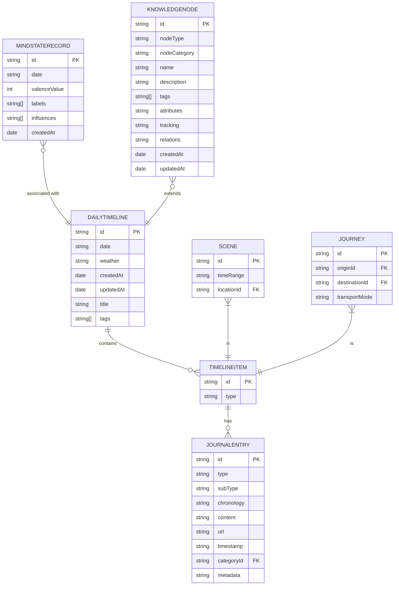

# 数据模型与持久化

<cite>
**本文档引用的文件**   
- [JournalEntry.swift](file://guanji0.34/Core/Models/JournalEntry.swift)
- [MindStateRecord.swift](file://guanji0.34/Core/Models/MindStateRecord.swift)
- [DailyTimeline.swift](file://guanji0.34/Core/Models/DailyTimeline.swift)
- [models-overview.md](file://Docs/data/models-overview.md)
- [timeline-models.md](file://Docs/data/timeline-models.md)
- [tracker-models.md](file://Docs/data/tracker-models.md)
- [user-profile-models.md](file://Docs/data/user-profile-models.md)
- [L4-PROFILE-EXPANSION-PLAN.md](file://Docs/architecture/L4-PROFILE-EXPANSION-PLAN.md)
- [TimelinePersistenceModels.swift](file://guanji0.34/Core/Models/TimelinePersistenceModels.swift)
- [DailyTrackerModels.swift](file://guanji0.34/Core/Models/DailyTrackerModels.swift)
- [MindStateModels.swift](file://guanji0.34/Core/Models/MindStateModels.swift)
- [NarrativeProfileModels.swift](file://guanji0.34/Core/Models/NarrativeProfileModels.swift)
- [NarrativeRelationshipModels.swift](file://guanji0.34/Core/Models/NarrativeRelationshipModels.swift)
- [KnowledgeNodeModels.swift](file://guanji0.34/Core/Models/KnowledgeNodeModels.swift)
- [AIPreferencesModels.swift](file://guanji0.34/Core/Models/AIPreferencesModels.swift)
</cite>

## 目录
1. [核心数据模型](#核心数据模型)
2. [数据分层结构](#数据分层结构)
3. [数据持久化机制](#数据持久化机制)
4. [实体关系图（ER图）](#实体关系图（er图）)
5. [数据生命周期管理（CRUD）](#数据生命周期管理（crud）)
6. [时序特性与扩展性设计](#时序特性与扩展性设计)

## 核心数据模型

本文档详细描述观己应用中的核心数据模型，包括 `JournalEntry`、`MindStateRecord` 和 `DailyTimeline` 等主要实体。这些模型定义了应用的领域对象，是数据存储和业务逻辑的基础。

### JournalEntry（日记原子）

`JournalEntry` 是应用中最小的记录单元，代表一条日记条目。它支持多种内容类型，包括文本、图片、视频、音频和文件。

**字段定义与业务含义**:
- `id`: 唯一标识符，使用 UUID 生成。
- `type`: 日记类型，枚举值包括 `text`、`image`、`video`、`audio`、`file` 和 `mixed`。
- `subType`: 子类型，用于区分特殊日记，如 `love_received`（收到的爱）、`pending_question`（待回答的时间胶囊）和 `normal`（普通日记）。
- `chronology`: 时间维度，表示记录的时间属性，包括 `past`（过去）、`present`（现在）和 `future`（未来）。
- `content`: 文本内容，对于非文本类型可能为空。
- `url`: 媒体资源的 URL。
- `timestamp`: 时间戳，记录创建时间。
- `category`: 日记分类，枚举值包括 `dream`（梦想）、`health`（健康）、`emotion`（情绪）、`work`（工作）、`social`（社交）、`media`（媒体）和 `life`（生活）。
- `metadata`: 元数据，包含更详细的附加信息。

**元数据结构（Metadata）**:
- `blocks`: 内容块数组，用于混合内容（`mixed` 类型），每个块包含类型、内容和可选的持续时间。
- `reviewDate`: 回顾日期，用于时间胶囊功能。
- `createdDate`: 创建日期。
- `questionId`: 关联的问题 ID，用于待回答的问题。
- `duration`: 持续时间，适用于音频和视频。
- `sender`: 发送者，用于“收到的爱”记录。

**Section sources**
- [JournalEntry.swift](file://guanji0.34/Core/Models/JournalEntry.swift#L1-L62)

### MindStateRecord（心境记录）

`MindStateRecord` 用于记录用户每日的心境状态，支持情绪分析和趋势追踪。

**字段定义与业务含义**:
- `id`: 唯一标识符。
- `date`: 日期字符串，格式为 "yyyy.MM.dd"，作为主索引。
- `valenceValue`: 情绪效价值，范围为 0-6，表示从非常不愉快到非常愉快。
- `labels`: 情绪标签数组，如 "happy"、"anxious" 等。
- `influences`: 影响因素数组，表示影响情绪的生活领域，如 "work"、"health" 等。
- `createdAt`: 创建时间。

**Section sources**
- [MindStateRecord.swift](file://guanji0.34/Core/Models/MindStateRecord.swift#L1-L32)

### DailyTimeline（每日时间轴）

`DailyTimeline` 是某一天所有记录的容器，采用三层架构设计：每日主表 → 时间节点 → 日记原子。

**字段定义与业务含义**:
- `id`: 唯一标识，格式为 "day_YYYYMMDD"。
- `date`: 日期字符串，格式为 "yyyy.MM.dd"。
- `weather`: 天气描述。
- `createdAt`: 创建时间。
- `updatedAt`: 更新时间。
- `title`: 标题。
- `items`: 时间节点数组，包含场景块（`SceneGroup`）和旅程块（`JourneyBlock`）。
- `tags`: 日记分类标签的去重总和。

**关键方法**:
- `regenerateTags()`: 重新计算当天所有日记的分类标签，去重后更新 `tags` 字段。

**Section sources**
- [DailyTimeline.swift](file://guanji0.34/Core/Models/DailyTimeline.swift#L1-L59)

## 数据分层结构

观己应用的数据架构采用分层设计，包括核心模型（Core Models）、仓库（Repositories）和数据源（DataSources）。

### Core Models（核心模型）

核心模型定义了应用的领域对象，位于 `Core/Models` 目录。所有模型均实现 `Codable` 协议，支持 JSON 序列化和反序列化。主要模型包括：
- **时间轴相关模型**: `DailyTimeline`、`JournalEntry`、`LocationVO` 等。
- **AI 相关模型**: `Conversation`、`AIRequest`、`AISettings` 等。
- **用户画像模型**: `NarrativeUserProfile`、`NarrativeRelationship`、`KnowledgeNode` 等。
- **追踪器模型**: `DailyTrackerRecord`、`MindStateRecord` 等。

### Repositories（仓库）

仓库提供数据访问接口，实现 Repository 模式。它们位于 `DataLayer/Repositories` 目录，负责协调数据源并提供统一的 API。例如：
- `TimelineRepository`: 管理时间轴数据的读写。
- `MindStateRepository`: 管理心境记录的读写。
- `NarrativeUserProfileRepository`: 管理用户画像的读写。

### DataSources（数据源）

数据源处理具体的存储逻辑，位于 `DataLayer/DataSources` 目录。当前实现包括 `MockDataService`，未来可扩展为 CoreData 或 FileManager。数据源负责：
- 从持久化存储中读取数据。
- 将数据写入持久化存储。
- 处理数据的缓存和同步。

**Section sources**
- [models-overview.md](file://Docs/data/models-overview.md#L1-L161)
- [timeline-models.md](file://Docs/data/timeline-models.md#L1-L349)

## 数据持久化机制

### 持久化策略

所有模型均实现 `Codable` 协议，支持以下持久化特性：
- JSON 序列化/反序列化。
- 文件系统存储（Documents 目录）。
- 内存缓存 + 异步写入。
- Repository 模式访问。

### 分表存储策略

为了优化存储和查询性能，时间轴采用分表存储策略：

#### DailyTimelineRecord（每日索引表）
- `date`: 日期。
- `itemIds`: 场景/旅程 ID 列表。
- **用途**: 存储某一天的时间节点 ID 索引，避免加载完整数据。

#### SceneRecord（场景/旅程记录表）
- `id`: 唯一标识。
- `type`: 类型（"scene" 或 "journey"）。
- `timeRange`: 时间范围（场景）。
- `location`: 地点信息（场景）。
- `origin`: 起点（旅程）。
- `destination`: 终点（旅程）。
- `transportMode`: 交通方式（旅程）。
- `entryIds`: 日记原子引用列表。
- **用途**: 存储场景/旅程的元数据，通过 `entryIds` 引用日记原子。

#### AtomRecord（原子记录表）
- 直接使用 `JournalEntry` 作为原子记录，存储在独立的原子表中。

**Section sources**
- [TimelinePersistenceModels.swift](file://guanji0.34/Core/Models/TimelinePersistenceModels.swift#L1-L80)

## 实体关系图（ER图）

**Diagram sources **
- [DailyTimeline.swift](file://guanji0.34/Core/Models/DailyTimeline.swift#L1-L59)
- [JournalEntry.swift](file://guanji0.34/Core/Models/JournalEntry.swift#L1-L62)
- [MindStateRecord.swift](file://guanji0.34/Core/Models/MindStateRecord.swift#L1-L32)
- [KnowledgeNodeModels.swift](file://guanji0.34/Core/Models/KnowledgeNodeModels.swift#L1-L707)

## 数据生命周期管理（CRUD）

### 创建（Create）
- **时间轴创建**: 用户创建 `DailyTimeline` 实例，添加 `SceneGroup` 或 `JourneyBlock`，并关联 `JournalEntry`。
- **心境记录创建**: 用户通过 `MindStateRecord` 初始化方法创建记录，设置日期、效价值、标签和影响因素。

### 读取（Read）
- **时间轴加载**: `TimelineRepository` 从 `DailyTimelineRecord` 读取 `itemIds`，然后根据 `entryIds` 从 `AtomRecord` 读取日记原子，重建 `DailyTimeline`。
- **心境记录查询**: `MindStateRepository` 提供按日期范围查询的方法。

### 更新（Update）
- **时间轴更新**: 修改 `DailyTimeline` 的 `title` 或 `weather`，调用 `regenerateTags()` 重新计算标签。
- **心境记录更新**: 创建新的 `MindStateRecord` 实例，因为记录是不可变的。

### 删除（Delete）
- **日记原子删除**: 从 `DailyTimeline` 的 `items` 中移除对应的 `JournalEntry`，并更新持久化存储。

**Section sources**
- [timeline-models.md](file://Docs/data/timeline-models.md#L191-L236)
- [tracker-models.md](file://Docs/data/tracker-models.md#L216-L248)

## 时序特性与扩展性设计

### 时间线模型与追踪模型的时序特性

时间线模型和追踪模型都具有明确的时序特性：
- `DailyTimeline` 按日期组织，`items` 数组按时间顺序排列。
- `MindStateRecord` 和 `DailyTrackerRecord` 都包含 `date` 字段，用于按时间查询和分析。
- `JournalEntry` 包含 `timestamp`，支持精确到秒的时间记录。

### 用户画像模型的扩展性设计

用户画像模型采用**通用知识节点（KnowledgeNode）** 结构，支持高度扩展性。

#### 设计理念
- **通用节点 vs 固定 Schema**: 使用通用结构而非固定 Schema，允许自由扩展维度。
- **共有 + 独特**: 区分系统预定义的共有维度和用户/AI 创建的独特维度。
- **溯源可追**: 每个知识点都能追溯到原始数据来源。
- **置信度驱动**: AI 提取的信息有置信度，随时间衰减或增强。

#### 核心结构
- `nodeType`: 维度类型，如 "skill"（技能）、"value"（价值观）、"goal"（目标）。
- `nodeCategory`: 节点分类，`common`（共有）或 `personal`（个人独特）。
- `attributes`: 动态属性，支持字符串、整数、浮点数、布尔值、数组和日期。
- `tracking`: 追踪信息，包括来源、置信度和变化历史。
- `relations`: 节点关联，描述节点之间的关系。

#### 扩展性示例
- **用户画像**: 可添加 "collection"（收藏）等个人独特维度。
- **关系画像**: 可添加 "ritual"（仪式）等由 AI 发现的独特维度。

**Section sources**
- [user-profile-models.md](file://Docs/data/user-profile-models.md#L1-L428)
- [L4-PROFILE-EXPANSION-PLAN.md](file://Docs/architecture/L4-PROFILE-EXPANSION-PLAN.md#L1-L1156)