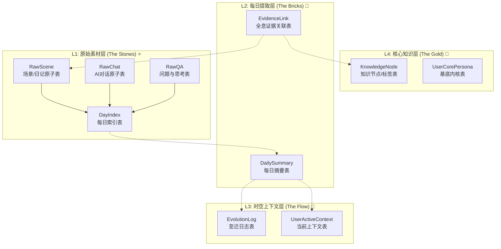

# 数据模型定义

<cite>
**本文档引用文件**  
- [JournalEntry.swift](file://guanji0.34/Core/Models/JournalEntry.swift)
- [MindStateRecord.swift](file://guanji0.34/Core/Models/MindStateRecord.swift)
- [DailyTimeline.swift](file://guanji0.34/Core/Models/DailyTimeline.swift)
- [NarrativeProfileModels.swift](file://guanji0.34/Core/Models/NarrativeProfileModels.swift)
- [NarrativeRelationshipModels.swift](file://guanji0.34/Core/Models/NarrativeRelationshipModels.swift)
- [KnowledgeNodeModels.swift](file://guanji0.34/Core/Models/KnowledgeNodeModels.swift)
- [LocationModel.swift](file://guanji0.34/Core/Models/LocationModel.swift)
- [models-overview.md](file://Docs/data/models-overview.md)
- [data-architecture.md](file://Docs/architecture/data-architecture.md)
- [AppState.swift](file://guanji0.34/App/AppState.swift)
</cite>

## 目录
1. [引言](#引言)
2. [四层记忆系统架构](#四层记忆系统架构)
3. [核心数据模型详解](#核心数据模型详解)
4. [模型关系与ER图](#模型关系与er图)
5. [L4层扩展性设计](#l4层扩展性设计)
6. [Swift模型定义与属性包装器](#swift模型定义与属性包装器)
7. [结论](#结论)

## 引言

本文档全面阐述观己应用的核心数据模型，聚焦于JournalEntry、MindStateRecord、DailyTimeline、NarrativeUserProfile和NarrativeRelationship等关键实体。结合数据架构文档，详细说明这些模型在四层记忆系统（L1-L4）中的归属与作用，解析模型间的关联机制，并展示其在Swift中的实现方式。

## 四层记忆系统架构

观己应用采用创新的四层数据架构设计，将数据从原始记录逐步提炼为高价值知识。

| 层级 | 名称 | 隐喻 | 核心职责 | 当前状态 |
|------|------|------|----------|----------|
| **L1** | 原始素材层 | The Stones | 全量存储，隐私最高，溯源的终点 | ⭐ 已实现 |
| **L2** | 每日提取层 | The Bricks | 每日结算产物，连接原子数据与知识的桥梁 | 🔮 部分实现 |
| **L3** | 时空上下文层 | The Flow | 包含"当前状态"与"变迁日志"，处理时间维度 | 🔮 未来 |
| **L4** | 核心知识层 | The Gold | 高度抽象的画像、标签节点与事实 | ⭐ 部分实现 |

**数据分类**：
- **流水数据**：每天产生的原始记录（如日记、对话、追踪），属于L1层。
- **常量数据**：相对稳定的配置或结论（如地点映射、用户画像），属于L4层。



**Diagram sources**
- [data-architecture.md](file://Docs/architecture/data-architecture.md)

**Section sources**
- [data-architecture.md](file://Docs/architecture/data-architecture.md)

## 核心数据模型详解

### JournalEntry (日记原子)

JournalEntry是L1层的最小记录单元，代表一次具体的记录行为。

**字段定义**：
- `id`: 唯一标识符 (String)
- `type`: 记录类型 (EntryType: text, image, video, audio, file, mixed)
- `subType`: 子类型 (EntrySubType: love_received, pending_question, normal)
- `chronology`: 时间维度 (EntryChronology: past, present, future)
- `content`: 内容文本 (String?)
- `url`: 媒体文件URL (String?)
- `timestamp`: 时间戳 (String)
- `category`: 分类 (EntryCategory: dream, health, emotion, work, social, media, life)
- `metadata`: 元数据 (Metadata结构体)

**业务含义**：JournalEntry是构成用户每日生活的“原子”，所有日记、图片、音频等都以该模型存储。

**Section sources**
- [JournalEntry.swift](file://guanji0.34/Core/Models/JournalEntry.swift)

### MindStateRecord (心境记录)

MindStateRecord用于记录用户在特定日期的心境状态，属于L1层的流水数据。

**字段定义**：
- `id`: 唯一标识符 (String)
- `date`: 关联的日期 (String, 格式为"yyyy.MM.dd")
- `valenceValue`: 情绪值 (Int)
- `labels`: 情绪标签 ([String])
- `influences`: 影响因素 ([String])
- `createdAt`: 创建时间 (Date)
- `dayId`: 计算属性，等同于`date`，用于关联到每日索引

**业务含义**：该模型用于量化用户的情绪波动，支持情绪追踪和分析。

**Section sources**
- [MindStateRecord.swift](file://guanji0.34/Core/Models/MindStateRecord.swift)

### DailyTimeline (每日主表)

DailyTimeline是L1层的根目录，作为每日数据的主表，聚合了当天的所有时间线项目。

**字段定义**：
- `id`: 唯一标识符 (String, 格式为"day_YYYYMMDD")
- `date`: 日期 (String, 格式为"yyyy.MM.dd")
- `weather`: 天气描述 (String?)
- `createdAt`: 创建时间 (Date)
- `updatedAt`: 更新时间 (Date)
- `title`: 标题 (String?)
- `items`: 时间节点列表 ([TimelineItem])
- `tags`: 去重后的分类标签 ([EntryCategory])

**业务含义**：DailyTimeline是每日数据的容器，通过`items`字段关联到具体的场景(Scenes)和旅程(Journeys)。

**Section sources**
- [DailyTimeline.swift](file://guanji0.34/Core/Models/DailyTimeline.swift)

### NarrativeUserProfile (叙事用户画像)

NarrativeUserProfile是L4层的核心知识模型，代表用户的静态内核和动态画像。

**字段定义**：
- `id`: 唯一标识符 (String)
- `staticCore`: 静态内核 (StaticCore结构体，包含性别、出生年月、职业等)
- `recentPortrait`: 近期画像 (RecentPortrait结构体，由AI生成)
- `knowledgeNodes`: 知识节点 ([KnowledgeNode])
- `aiPreferences`: AI对话偏好 (AIPreferences)
- `relationshipIds`: 关联的关系ID列表 ([String])

**业务含义**：该模型是用户长期画像的存储中心，包含用户手动维护的静态信息和未来由AI生成的动态洞察。

**Section sources**
- [NarrativeProfileModels.swift](file://guanji0.34/Core/Models/NarrativeProfileModels.swift)

### NarrativeRelationship (叙事关系)

NarrativeRelationship是L4层的另一核心模型，用于描述用户的人际关系。

**字段定义**：
- `id`: 唯一标识符 (String)
- `type`: 关系类型 (CompanionType)
- `displayName`: 显示名称 (String)
- `realName`: 真实姓名 (String?, 可加密)
- `avatar`: 头像 (String?)
- `aliases`: 别名 ([String])，用于AI识别
- `narrative`: 叙事描述 (String?)
- `factAnchors`: 事实锚点 (RelationshipFactAnchors，包含相识日期、纪念日等)
- `mentions`: 提及记录 ([RelationshipMention])
- `attributes`: 属性 ([KnowledgeNode])，用于存储关系状态、互动模式等动态信息

**业务含义**：该模型超越了简单的联系人管理，通过叙事和事实锚点构建了丰富的人际关系图谱。

**Section sources**
- [NarrativeRelationshipModels.swift](file://guanji0.34/Core/Models/NarrativeRelationshipModels.swift)

## 模型关系与ER图

各核心模型之间通过明确的关联机制相互连接。

```mermaid
erDiagram
    DAILYTIMELINE ||--o{ TIMELINEITEM : "contains"
    TIMELINEITEM ||--o{ JOURNALENTRY : "contains"
    MINDSTATERECORD }o--|| DAILYTIMELINE : "by date"
    NARRATIVEUSERPROFILE ||--o{ KNOWLEDGENODE : "has"
    NARRATIVERELATIONSHIP ||--o{ KNOWLEDGENODE : "has attributes"
    LOCATIONVO }o--|| ADDRESSMAPPING : "maps to"
    ADDRESSMAPPING ||--o{ ADDRESSFENCE : "has"

    class DAILYTIMELINE {
        id: String PK
        date: String
        weather: String?
        title: String?
    }
    class TIMELINEITEM {
        id: String PK
        type: String
    }
    class JOURNALENTRY {
        id: String PK
        type: EntryType
        content: String?
        timestamp: String
        category: EntryCategory?
    }
    class MINDSTATERECORD {
        id: String PK
        date: String FK
        valenceValue: Int
        labels: [String]
    }
    class NARRATIVEUSERPROFILE {
        id: String PK
        staticCore: StaticCore
        knowledgeNodes: [KnowledgeNode]
    }
    class NARRATIVERELATIONSHIP {
        id: String PK
        displayName: String
        factAnchors: RelationshipFactAnchors
    }
    class KNOWLEDGENODE {
        id: String PK
        nodeType: String
        name: String
        description: String?
    }
    class LOCATIONVO {
        status: LocationStatus
        mappingId: String?
        displayText: String
    }
    class ADDRESSMAPPING {
        id: String PK
        name: String
        icon: String?
    }
    class ADDRESSFENCE {
        id: String PK
        mappingId: String FK
        lat: Double
        lng: Double
        radius: Double
    }
```

**Diagram sources**
- [DailyTimeline.swift](file://guanji0.34/Core/Models/DailyTimeline.swift)
- [LocationModel.swift](file://guanji0.34/Core/Models/LocationModel.swift)
- [NarrativeProfileModels.swift](file://guanji0.34/Core/Models/NarrativeProfileModels.swift)
- [NarrativeRelationshipModels.swift](file://guanji0.34/Core/Models/NarrativeRelationshipModels.swift)
- [KnowledgeNodeModels.swift](file://guanji0.34/Core/Models/KnowledgeNodeModels.swift)

**Section sources**
- [DailyTimeline.swift](file://guanji0.34/Core/Models/DailyTimeline.swift)
- [LocationModel.swift](file://guanji0.34/Core/Models/LocationModel.swift)

## L4层扩展性设计

L4层的设计具有高度的扩展性，为未来的AI功能奠定了基础。

### 知识节点 (KnowledgeNode)

`KnowledgeNode`是L4层的核心扩展模型，采用通用结构存储各种维度的知识。

**核心特性**：
- `nodeType`: 节点类型 (String)，可扩展为"skill", "value", "goal"等。
- `nodeCategory`: 节点分类 (NodeCategory: common, personal)。
- `attributes`: 动态属性 ([String: AttributeValue])，支持多种数据类型。
- `relations`: 节点间关系 ([NodeRelation])，可构建知识网络。

### 证据链 (EvidenceLink)

系统规划了`EvidenceLink`机制，用于建立L4知识与L1原始数据的关联。

```
EvidenceLink {
    nodeId: "妈妈的关系ID"      // L4 关系节点
    sourceTable: "raw_scenes"   // L1 表名
    sourceRecordId: "日记ID"    // L1 记录ID
}
```

此设计允许用户点击一个L4标签（如"妈妈"），即可追溯到所有相关的原始日记和对话记录，实现完整的知识溯源。

**Section sources**
- [KnowledgeNodeModels.swift](file://guanji0.34/Core/Models/KnowledgeNodeModels.swift)
- [data-architecture.md](file://Docs/architecture/data-architecture.md)

## Swift模型定义与属性包装器

所有核心模型均采用Swift结构体定义，并遵循`Codable`协议以支持JSON序列化。

### Codable协议

`Codable`协议是Swift中用于数据序列化的标准，它结合了`Encodable`和`Decodable`。例如，`JournalEntry`结构体通过实现`Codable`，可以轻松地将其转换为JSON格式进行存储或网络传输。

### @Published属性包装器

`@Published`是Combine框架中的一个属性包装器，用于实现响应式编程。当被`@Published`标记的属性值发生变化时，会自动发布一个事件，通知所有订阅者。

```swift
public final class AppState: ObservableObject {
    @Published public var selectedDate: String = DateUtilities.today
    @Published public var currentMode: AppMode = .journal
    @Published public var isAIStreaming: Bool = false
}
```

在上述`AppState`示例中，`selectedDate`、`currentMode`和`isAIStreaming`都是被观察的属性。当`selectedDate`改变时，所有绑定到此属性的UI组件（如视图）会自动刷新，确保了应用状态与用户界面的一致性。

**Section sources**
- [AppState.swift](file://guanji0.34/App/AppState.swift)

## 结论

观己应用的数据模型设计体现了从原始数据到高价值知识的演进路径。L1层确保了数据的完整性和可追溯性，而L4层则通过`NarrativeUserProfile`、`NarrativeRelationship`和`KnowledgeNode`等模型，为构建用户的核心画像和关系图谱提供了坚实的基础。未来，随着AI功能的引入，L2和L3层将被激活，实现从数据到洞察的自动化转换，而L4层的扩展性设计确保了系统能够持续进化，支持更复杂的知识提取和关联。