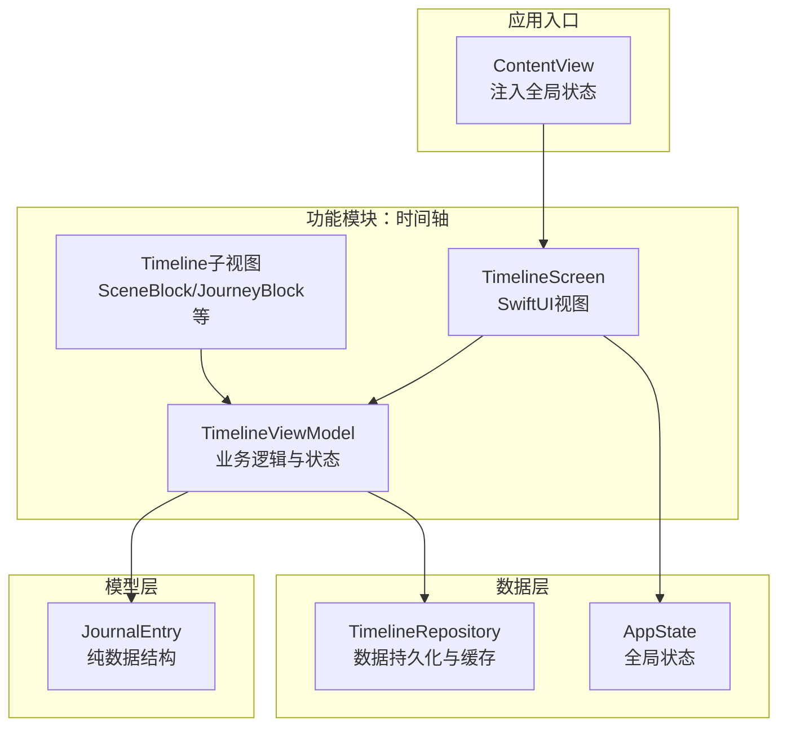
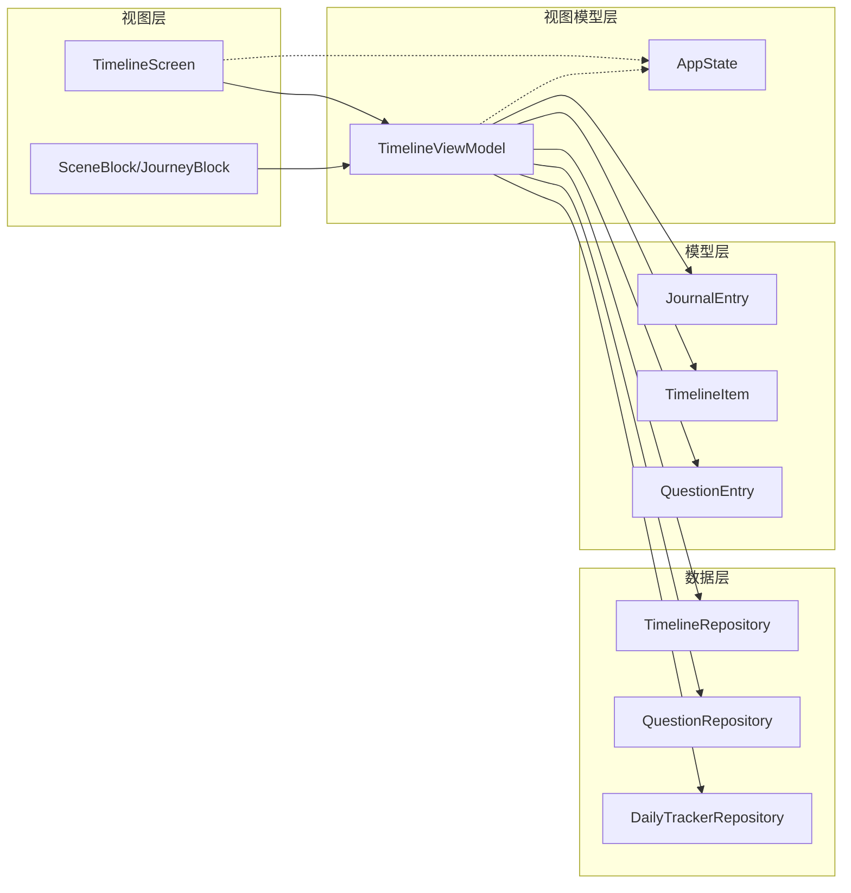
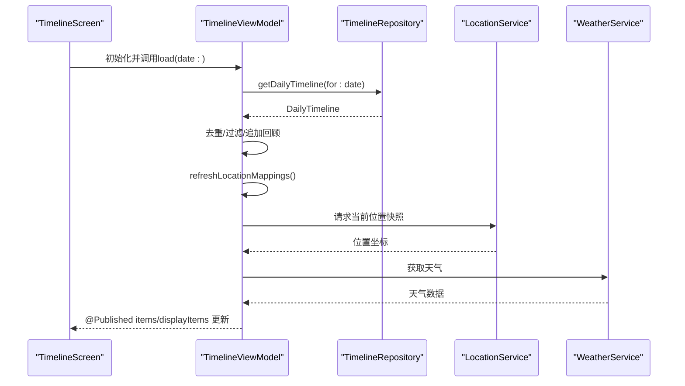
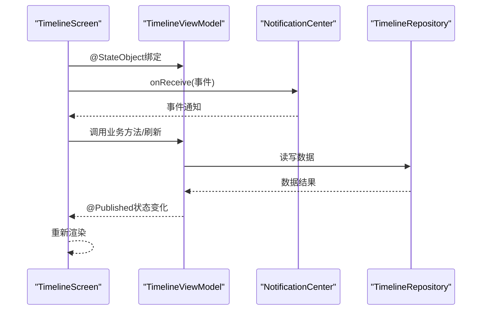
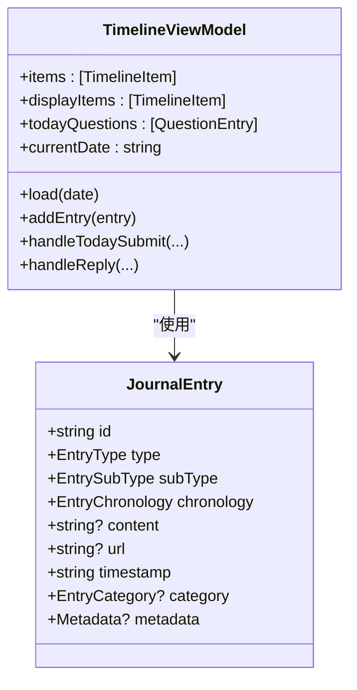
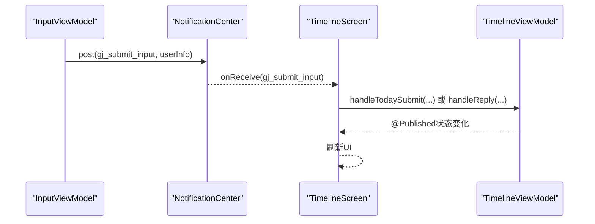
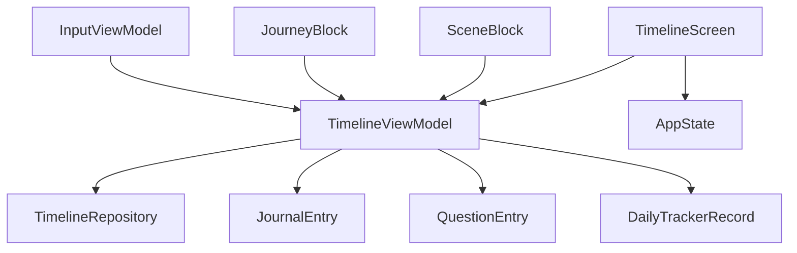

# MVVM架构详解

<cite>
**本文档引用的文件**
- [mvvm-pattern.md](file://Docs/architecture/mvvm-pattern.md)
- [TimelineViewModel.swift](file://guanji0.34/Features/Timeline/TimelineViewModel.swift)
- [TimelineScreen.swift](file://guanji0.34/Features/Timeline/TimelineScreen.swift)
- [JournalEntry.swift](file://guanji0.34/Core/Models/JournalEntry.swift)
- [TimelineRepository.swift](file://guanji0.34/DataLayer/Repositories/TimelineRepository.swift)
- [AppState.swift](file://guanji0.34/App/AppState.swift)
- [InputViewModel.swift](file://guanji0.34/Features/Input/InputViewModel.swift)
- [ProfileViewModel.swift](file://guanji0.34/Features/Profile/ProfileViewModel.swift)
- [SceneBlock.swift](file://guanji0.34/UI/Organisms/SceneBlock.swift)
- [JourneyBlock.swift](file://guanji0.34/UI/Organisms/JourneyBlock.swift)
</cite>

## 目录
1. [引言](#引言)
2. [项目结构](#项目结构)
3. [核心组件](#核心组件)
4. [架构总览](#架构总览)
5. [组件详细分析](#组件详细分析)
6. [依赖关系分析](#依赖关系分析)
7. [性能考量](#性能考量)
8. [故障排查指南](#故障排查指南)
9. [结论](#结论)
10. [附录](#附录)

## 引言
本文件围绕观己（Guanji）应用的MVVM架构展开，系统阐述View、ViewModel与Model三者的职责边界与交互机制。重点覆盖以下方面：
- SwiftUI视图通过@StateObject绑定ViewModel，并利用@Published属性实现响应式更新
- ViewModel封装业务逻辑、处理用户输入、调用Repository进行数据读写，并将原始数据转换为适合UI展示的格式
- 结合mvvm-pattern.md中的代码示例，分析TimelineViewModel中Combine框架的使用方式，包括CombineLatest的发布者链与订阅管理
- Model作为纯数据结构（如JournalEntry）的设计原则，禁止在其中包含业务逻辑
- 最佳实践指南：ViewModel初始化时机、避免内存泄漏的[weak self]使用、异步任务的@MainActor调度等
- 跨组件通信中NotificationCenter的使用场景与事件命名规范（如gj_timeline_updated），并说明其与@EnvironmentObject的协同机制

## 项目结构
观己采用按功能模块化的文件组织方式，每个功能模块包含独立的View、ViewModel与子视图目录，确保关注点分离与高内聚低耦合。

图表来源
- [TimelineScreen.swift](file://guanji0.34/Features/Timeline/TimelineScreen.swift#L1-L40)
- [TimelineViewModel.swift](file://guanji0.34/Features/Timeline/TimelineViewModel.swift#L1-L31)
- [TimelineRepository.swift](file://guanji0.34/DataLayer/Repositories/TimelineRepository.swift#L1-L60)
- [AppState.swift](file://guanji0.34/App/AppState.swift#L1-L52)
- [JournalEntry.swift](file://guanji0.34/Core/Models/JournalEntry.swift#L1-L62)

章节来源
- [mvvm-pattern.md](file://Docs/architecture/mvvm-pattern.md#L213-L238)

## 核心组件
- View（视图层）
  - 职责：仅负责UI布局与数据绑定，不包含业务逻辑判断、直接调用Repository或进行数据转换
  - 示例：TimelineScreen通过@StateObject绑定TimelineViewModel，使用@EnvironmentObject访问AppState
- ViewModel（视图模型层）
  - 职责：业务逻辑、状态管理、数据转换；通过Repository读写数据；使用@Published发布状态变化
  - 示例：TimelineViewModel使用CombineLatest组合多个@Published属性，驱动displayItems的生成
- Model（模型层）
  - 职责：纯数据结构定义，不包含业务逻辑
  - 示例：JournalEntry仅包含字段与枚举类型，无方法

章节来源
- [mvvm-pattern.md](file://Docs/architecture/mvvm-pattern.md#L35-L72)
- [mvvm-pattern.md](file://Docs/architecture/mvvm-pattern.md#L74-L123)
- [mvvm-pattern.md](file://Docs/architecture/mvvm-pattern.md#L125-L138)

## 架构总览
下图展示了MVVM在观己中的整体交互：View通过@StateObject持有ViewModel，ViewModel通过Repository访问数据并转换为UI可用格式，同时通过@Published向View推送状态变化；全局状态通过@EnvironmentObject在各层共享。

图表来源
- [TimelineScreen.swift](file://guanji0.34/Features/Timeline/TimelineScreen.swift#L1-L40)
- [TimelineViewModel.swift](file://guanji0.34/Features/Timeline/TimelineViewModel.swift#L1-L31)
- [TimelineRepository.swift](file://guanji0.34/DataLayer/Repositories/TimelineRepository.swift#L1-L60)
- [JournalEntry.swift](file://guanji0.34/Core/Models/JournalEntry.swift#L1-L62)

## 组件详细分析

### TimelineViewModel：Combine发布者链与订阅管理
- 初始化阶段
  - 使用CombineLatest组合@Published属性items与todayQuestions，接收主线程回调，触发updateDisplayItems以生成displayItems
  - 启动时加载当前日期数据，并注册多个NotificationCenter观察者以响应外部事件
- 数据加载与转换
  - load(date:)从TimelineRepository获取DailyTimeline，去重后设置items；查询QuestionRepository并过滤出目标日期的问题集合
  - 对于历史页面，额外追加“回顾”场景以增强体验
- 位置与实时上下文
  - refreshLocationMappings刷新位置映射；fetchRealtimeContext根据权限请求天气信息
- 用户输入处理
  - handleTodaySubmit与handleReply将富媒体内容保存到本地并生成JournalEntry，随后通过Repository持久化
- 通知驱动的刷新
  - onTrackerUpdated、onDayEndTimeChanged、onAddressesChanged分别处理追踪器更新、日切时间变更与地址映射变更

图表来源
- [TimelineViewModel.swift](file://guanji0.34/Features/Timeline/TimelineViewModel.swift#L48-L135)
- [TimelineRepository.swift](file://guanji0.34/DataLayer/Repositories/TimelineRepository.swift#L28-L67)

章节来源
- [TimelineViewModel.swift](file://guanji0.34/Features/Timeline/TimelineViewModel.swift#L17-L31)
- [TimelineViewModel.swift](file://guanji0.34/Features/Timeline/TimelineViewModel.swift#L48-L135)

### SwiftUI视图绑定与响应式更新
- @StateObject绑定
  - TimelineScreen通过@StateObject私有属性创建并持有TimelineViewModel，确保生命周期与视图一致
  - 通过@EnvironmentObject访问AppState，实现全局状态共享
- 响应式更新
  - ViewModel通过@Published属性对外发布状态变化，View自动重新渲染
  - 视图侧使用onReceive监听NotificationCenter事件，实现跨组件通信与联动

图表来源
- [TimelineScreen.swift](file://guanji0.34/Features/Timeline/TimelineScreen.swift#L3-L19)
- [TimelineScreen.swift](file://guanji0.34/Features/Timeline/TimelineScreen.swift#L244-L318)

章节来源
- [TimelineScreen.swift](file://guanji0.34/Features/Timeline/TimelineScreen.swift#L3-L19)
- [TimelineScreen.swift](file://guanji0.34/Features/Timeline/TimelineScreen.swift#L244-L318)

### Model设计原则：JournalEntry为纯数据结构
- 设计要点
  - JournalEntry仅包含字段与枚举类型，不包含任何业务逻辑方法
  - 所有业务规则由ViewModel处理，Model保持纯粹的数据载体角色
- 与ViewModel协作
  - ViewModel负责将Repository返回的原始数据转换为适合UI展示的格式（如displayItems）

图表来源
- [JournalEntry.swift](file://guanji0.34/Core/Models/JournalEntry.swift#L42-L61)
- [TimelineViewModel.swift](file://guanji0.34/Features/Timeline/TimelineViewModel.swift#L6-L13)

章节来源
- [mvvm-pattern.md](file://Docs/architecture/mvvm-pattern.md#L125-L138)
- [JournalEntry.swift](file://guanji0.34/Core/Models/JournalEntry.swift#L1-L62)

### 跨组件通信：NotificationCenter与事件命名规范
- 事件命名规范
  - gj_submit_input：用户提交输入
  - gj_timeline_updated：时间轴数据变更
  - gj_addresses_changed：地址映射变更
  - gj_tracker_updated：追踪器数据更新
  - gj_day_end_time_changed：日切时间变更
  - gj_edit_entry / gj_delete_entry：编辑/删除日记条目
  - gj_initiate_reply：发起回复
- 使用场景
  - InputViewModel在提交时发送gj_submit_input，TimelineScreen接收并调用相应业务方法
  - TimelineRepository在保存后发送gj_timeline_updated，TimelineScreen在今日视图时触发reload
  - ProfileViewModel在日切时间变更时发送gj_day_end_time_changed，TimelineViewModel据此刷新“今日”定义
  - SceneBlock/JourneyBlock在发起回复或删除条目时发送gj_initiate_reply/gj_delete_entry，TimelineViewModel统一处理

图表来源
- [InputViewModel.swift](file://guanji0.34/Features/Input/InputViewModel.swift#L132-L151)
- [TimelineScreen.swift](file://guanji0.34/Features/Timeline/TimelineScreen.swift#L294-L312)
- [TimelineRepository.swift](file://guanji0.34/DataLayer/Repositories/TimelineRepository.swift#L52-L54)

章节来源
- [mvvm-pattern.md](file://Docs/architecture/mvvm-pattern.md#L180-L212)
- [InputViewModel.swift](file://guanji0.34/Features/Input/InputViewModel.swift#L132-L151)
- [TimelineScreen.swift](file://guanji0.34/Features/Timeline/TimelineScreen.swift#L294-L312)
- [ProfileViewModel.swift](file://guanji0.34/Features/Profile/ProfileViewModel.swift#L33-L39)
- [SceneBlock.swift](file://guanji0.34/UI/Organisms/SceneBlock.swift#L72-L79)
- [JourneyBlock.swift](file://guanji0.34/UI/Organisms/JourneyBlock.swift#L127-L135)

### ViewModel初始化时机与内存安全
- 初始化时机
  - 使用@StateObject在视图初始化时创建ViewModel，避免在body中创建导致每次渲染都重建实例
- 内存安全
  - Combine订阅中广泛使用[weak self]防止循环引用
  - 使用store(in: &cancellables)管理订阅生命周期，避免泄漏
- 异步任务调度
  - ViewModel内部使用@MainActor确保UI更新在主线程执行

章节来源
- [mvvm-pattern.md](file://Docs/architecture/mvvm-pattern.md#L239-L288)
- [TimelineViewModel.swift](file://guanji0.34/Features/Timeline/TimelineViewModel.swift#L17-L31)

## 依赖关系分析
- 视图对ViewModel的依赖
  - TimelineScreen通过@StateObject依赖TimelineViewModel，通过@EnvironmentObject依赖AppState
- ViewModel对数据层的依赖
  - TimelineViewModel依赖TimelineRepository、QuestionRepository、DailyTrackerRepository等
- ViewModel对模型的依赖
  - TimelineViewModel使用JournalEntry、TimelineItem、QuestionEntry等模型类型
- 通知系统的依赖
  - 多个ViewModel与UI组件通过NotificationCenter进行解耦通信

图表来源
- [TimelineScreen.swift](file://guanji0.34/Features/Timeline/TimelineScreen.swift#L3-L19)
- [TimelineViewModel.swift](file://guanji0.34/Features/Timeline/TimelineViewModel.swift#L1-L31)
- [TimelineRepository.swift](file://guanji0.34/DataLayer/Repositories/TimelineRepository.swift#L1-L60)
- [JournalEntry.swift](file://guanji0.34/Core/Models/JournalEntry.swift#L1-L62)

## 性能考量
- 数据去重与缓存
  - TimelineViewModel在加载时对重复ID进行去重，减少渲染开销
- 异步持久化
  - TimelineRepository在后台线程进行JSON序列化与磁盘写入，避免阻塞UI
- 位置与天气请求
  - 仅在具备权限且需要时才请求位置快照与天气，降低不必要的网络与计算开销
- 通知驱动的局部刷新
  - 通过gj_timeline_updated等事件精确触发刷新，避免全量重载

章节来源
- [TimelineViewModel.swift](file://guanji0.34/Features/Timeline/TimelineViewModel.swift#L58-L68)
- [TimelineRepository.swift](file://guanji0.34/DataLayer/Repositories/TimelineRepository.swift#L155-L165)

## 故障排查指南
- 观察者未释放
  - 症状：内存泄漏或重复触发
  - 排查：确认Combine订阅是否使用[weak self]，是否正确存储至cancellables
- 通知未收到
  - 症状：跨组件通信失效
  - 排查：检查事件名称拼写、发送与接收端是否在同一进程、是否在正确的生命周期内注册
- UI未更新
  - 症状：状态变化后界面不刷新
  - 排查：确认@Published属性是否在主线程更新，是否通过ViewModel暴露给View绑定
- 数据不一致
  - 症状：历史视图与今日视图显示异常
  - 排查：检查TimelineViewModel在历史页面是否正确追加“回顾”场景，以及日期过滤逻辑

章节来源
- [mvvm-pattern.md](file://Docs/architecture/mvvm-pattern.md#L279-L288)
- [TimelineScreen.swift](file://guanji0.34/Features/Timeline/TimelineScreen.swift#L267-L318)
- [TimelineViewModel.swift](file://guanji0.34/Features/Timeline/TimelineViewModel.swift#L17-L31)

## 结论
观己的MVVM架构通过清晰的职责划分与严格的依赖控制，实现了视图、业务逻辑与数据层的有效解耦。TimelineViewModel作为核心协调者，利用Combine构建响应式状态流，借助Repository完成数据读写，并通过NotificationCenter实现跨组件通信。JournalEntry等Model保持纯数据结构，确保业务规则集中于ViewModel，便于测试与维护。遵循本文的最佳实践，可进一步提升系统的稳定性与可扩展性。

## 附录
- 事件命名规范速查
  - gj_submit_input：用户提交输入
  - gj_timeline_updated：时间轴数据变更
  - gj_addresses_changed：地址映射变更
  - gj_tracker_updated：追踪器数据更新
  - gj_day_end_time_changed：日切时间变更
  - gj_edit_entry / gj_delete_entry：编辑/删除日记条目
  - gj_initiate_reply：发起回复

章节来源
- [mvvm-pattern.md](file://Docs/architecture/mvvm-pattern.md#L202-L212)