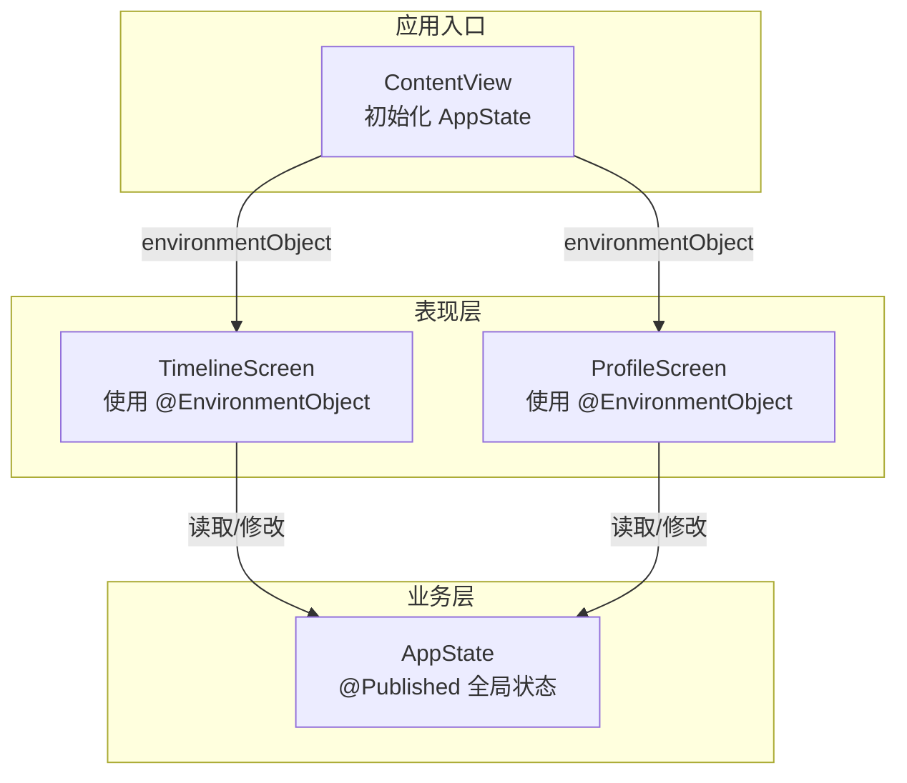
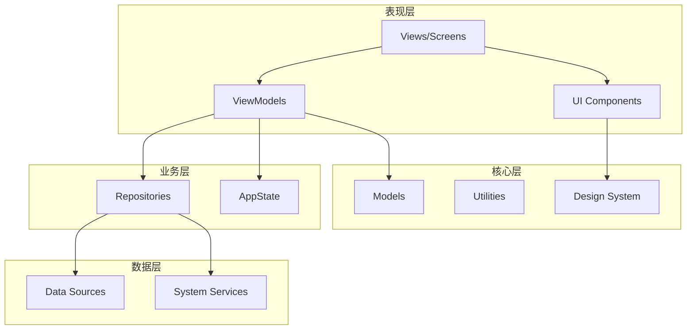
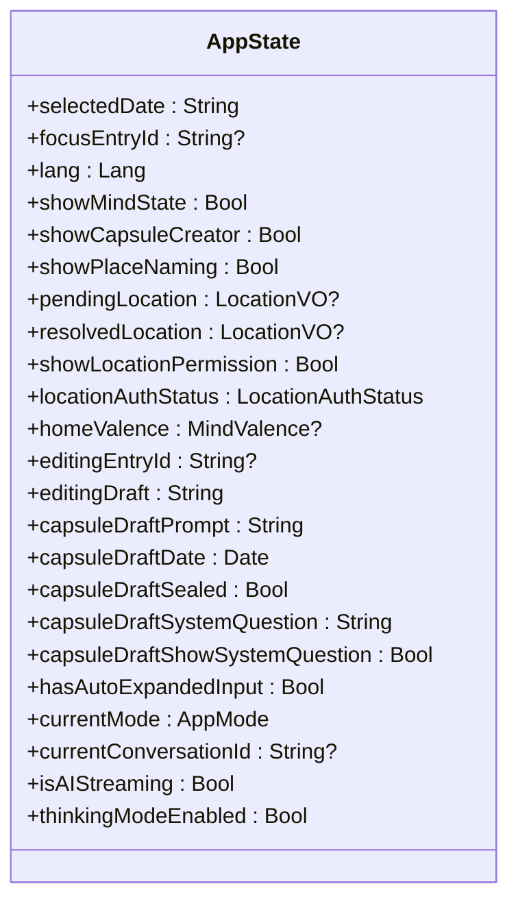
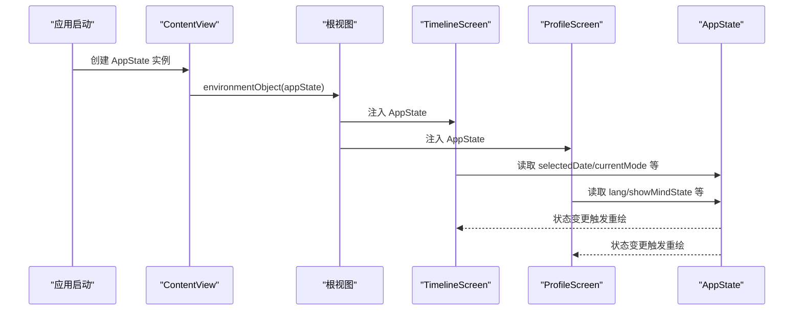
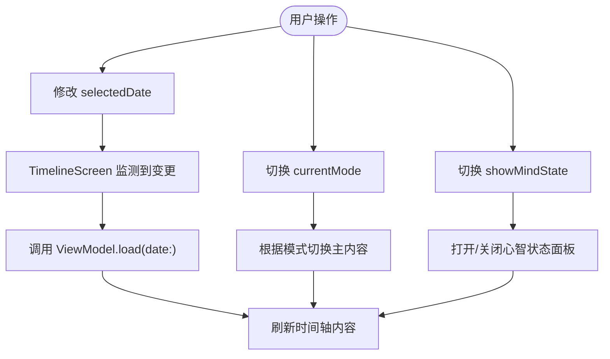
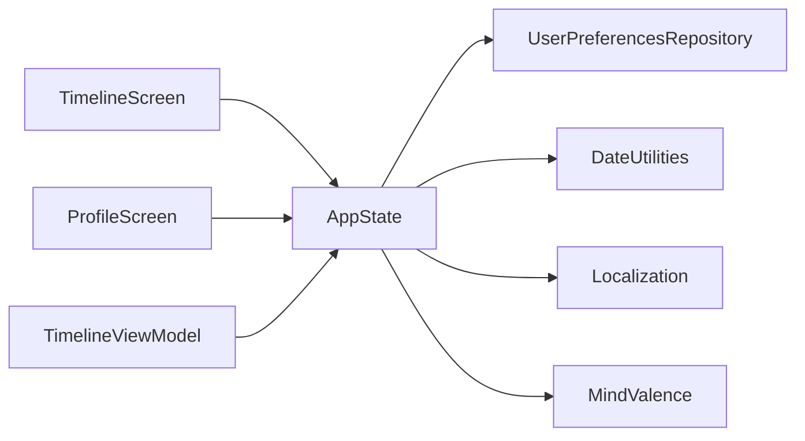

# 全局状态管理

<cite>
**本文引用的文件列表**
- [AppState.swift](file://guanji0.34/App/AppState.swift)
- [ContentView.swift](file://guanji0.34/ContentView.swift)
- [system-architecture.md](file://Docs/architecture/system-architecture.md)
- [mvvm-pattern.md](file://Docs/architecture/mvvm-pattern.md)
- [TimelineScreen.swift](file://guanji0.34/Features/Timeline/TimelineScreen.swift)
- [ProfileScreen.swift](file://guanji0.34/Features/Profile/ProfileScreen.swift)
- [TimelineViewModel.swift](file://guanji0.34/Features/Timeline/TimelineViewModel.swift)
- [UserPreferencesRepository.swift](file://guanji0.34/DataLayer/Repositories/UserPreferencesRepository.swift)
- [AIConversationModels.swift](file://guanji0.34/Core/Models/AIConversationModels.swift)
- [MindStateModels.swift](file://guanji0.34/Core/Models/MindStateModels.swift)
</cite>

## 目录
1. [简介](#简介)
2. [项目结构](#项目结构)
3. [核心组件](#核心组件)
4. [架构总览](#架构总览)
5. [详细组件分析](#详细组件分析)
6. [依赖关系分析](#依赖关系分析)
7. [性能考量](#性能考量)
8. [故障排查指南](#故障排查指南)
9. [结论](#结论)
10. [附录](#附录)

## 简介
本文件围绕 AppState 全局状态管理器进行系统化文档化，重点解释以下方面：
- @Published 属性（如 selectedDate、currentMode、showMindState 等）如何作为单一数据源驱动应用状态同步；
- AppState 如何通过 @EnvironmentObject 注入到视图层级，使所有子视图能够实时响应状态变更；
- 结合系统架构图，阐述 AppState 在表现层与业务层之间的桥梁作用，特别是在日期切换、模式切换（日记/AI）等跨模块场景下的协调；
- 提供在 View 中安全访问 AppState 的代码模板（初始化位置与子视图引用方式）；
- 明确 AppState 与 ViewModel 局部状态的边界划分：何时使用 AppState 共享状态，何时保留在 ViewModel 内部；
- 分析潜在风险（如过度依赖全局状态导致的耦合），并给出监控与调试建议。

## 项目结构
AppState 位于应用入口目录，是全局状态容器；通过 ContentView 在应用启动时初始化并通过 @EnvironmentObject 注入到整个视图树。系统采用 MVVM + 原子设计，表现层（Views/ViewModels/UI）与业务层（AppState/Repositories）清晰分层。

图表来源
- [ContentView.swift](file://guanji0.34/ContentView.swift#L10-L16)
- [TimelineScreen.swift](file://guanji0.34/Features/Timeline/TimelineScreen.swift#L3-L19)
- [ProfileScreen.swift](file://guanji0.34/Features/Profile/ProfileScreen.swift#L4-L11)
- [AppState.swift](file://guanji0.34/App/AppState.swift#L4-L51)

章节来源
- [system-architecture.md](file://Docs/architecture/system-architecture.md#L19-L53)
- [mvvm-pattern.md](file://Docs/architecture/mvvm-pattern.md#L11-L33)

## 核心组件
- AppState：ObservableObject，集中管理跨模块共享的状态，如当前日期、应用模式、心智状态显示开关、编辑态、胶囊创作草稿、AI 对话相关状态等。
- ContentView：应用入口，创建并注入 AppState。
- TimelineScreen / ProfileScreen：多个业务屏幕，通过 @EnvironmentObject 获取 AppState 并在视图中读取/绑定状态。
- TimelineViewModel：局部状态管理，负责时间轴数据加载与展示逻辑，与 AppState 协同工作。

章节来源
- [AppState.swift](file://guanji0.34/App/AppState.swift#L4-L51)
- [ContentView.swift](file://guanji0.34/ContentView.swift#L10-L16)
- [TimelineScreen.swift](file://guanji0.34/Features/Timeline/TimelineScreen.swift#L3-L19)
- [ProfileScreen.swift](file://guanji0.34/Features/Profile/ProfileScreen.swift#L4-L11)
- [TimelineViewModel.swift](file://guanji0.34/Features/Timeline/TimelineViewModel.swift#L5-L31)

## 架构总览
AppState 位于业务层，向上为表现层（Views/ViewModels）提供统一状态源；向下与数据层（Repositories/SystemServices）协作。系统通过 @EnvironmentObject 实现全局状态在视图树中的透明传递，同时通过 Combine 的 @Published 机制实现响应式更新。

图表来源
- [system-architecture.md](file://Docs/architecture/system-architecture.md#L19-L53)

章节来源
- [system-architecture.md](file://Docs/architecture/system-architecture.md#L19-L53)
- [mvvm-pattern.md](file://Docs/architecture/mvvm-pattern.md#L11-L33)

## 详细组件分析

### AppState 类与状态字段
- 角色定位：全局状态容器，集中管理跨模块共享的数据与行为开关。
- 关键字段（节选）：
  - selectedDate：当前选择日期（用于时间轴加载与导航）。
  - currentMode：应用模式（journal 或 ai），驱动主内容切换。
  - showMindState：心智状态面板显示控制。
  - editingEntryId / editingDraft：编辑态标识与草稿文本。
  - showCapsuleCreator / capsuleDraft*：胶囊创作面板及其草稿状态。
  - showPlaceNaming / pendingLocation / resolvedLocation：地点命名/解析流程状态。
  - showLocationPermission / locationAuthStatus：定位授权提示与状态。
  - homeValence：首页心境值，影响背景渐变。
  - hasAutoExpandedInput：输入自动展开标记。
  - currentConversationId / isAIStreaming / thinkingModeEnabled：AI 对话相关状态。
- 初始化逻辑：从用户偏好仓库加载默认模式与思考模式开关，体现“全局状态驱动业务偏好”。

图表来源
- [AppState.swift](file://guanji0.34/App/AppState.swift#L4-L51)

章节来源
- [AppState.swift](file://guanji0.34/App/AppState.swift#L4-L51)

### @EnvironmentObject 注入与使用
- 初始化位置：ContentView 在构造时创建 AppState，并通过 .environmentObject(appState) 注入到视图树根节点。
- 子视图引用：各业务屏幕（如 TimelineScreen、ProfileScreen）通过 @EnvironmentObject 私有属性访问 AppState，实现状态共享与响应式刷新。
- 安全访问模板（路径参考）：
  - 初始化：[ContentView.swift](file://guanji0.34/ContentView.swift#L10-L16)
  - 子视图使用：[TimelineScreen.swift](file://guanji0.34/Features/Timeline/TimelineScreen.swift#L5-L5)
  - 子视图使用：[ProfileScreen.swift](file://guanji0.34/Features/Profile/ProfileScreen.swift#L9-L9)

图表来源
- [ContentView.swift](file://guanji0.34/ContentView.swift#L10-L16)
- [TimelineScreen.swift](file://guanji0.34/Features/Timeline/TimelineScreen.swift#L3-L19)
- [ProfileScreen.swift](file://guanji0.34/Features/Profile/ProfileScreen.swift#L4-L11)
- [AppState.swift](file://guanji0.34/App/AppState.swift#L4-L51)

章节来源
- [mvvm-pattern.md](file://Docs/architecture/mvvm-pattern.md#L157-L178)
- [system-architecture.md](file://Docs/architecture/system-architecture.md#L141-L147)

### 跨模块协调：日期切换与模式切换
- 日期切换（selectedDate）：
  - TimelineScreen 监听 appState.selectedDate 的变化，触发 ViewModel.load(date:) 重新加载时间轴数据。
  - 导航栏“回到今天”按钮直接设置 appState.selectedDate 为今日，实现快速跳转。
- 模式切换（currentMode）：
  - TimelineScreen 根据 appState.currentMode 切换主内容（日记或 AI 对话界面）。
  - ProfileScreen 通过 Picker 读写 UserPreferencesRepository.shared.defaultMode，影响 AppState 初始化时的默认模式。
- 心智状态（showMindState）：
  - TimelineScreen 与 DailyTrackerFlowScreen 通过 appState.showMindState 控制心智状态面板的打开/关闭。
  - 编辑态（editingEntryId/editingDraft）与心智状态联动，保证编辑与面板状态一致。

图表来源
- [TimelineScreen.swift](file://guanji0.34/Features/Timeline/TimelineScreen.swift#L171-L191)
- [TimelineScreen.swift](file://guanji0.34/Features/Timeline/TimelineScreen.swift#L21-L30)
- [TimelineScreen.swift](file://guanji0.34/Features/Timeline/TimelineScreen.swift#L278-L278)
- [ProfileScreen.swift](file://guanji0.34/Features/Profile/ProfileScreen.swift#L66-L80)
- [AppState.swift](file://guanji0.34/App/AppState.swift#L30-L41)

章节来源
- [TimelineScreen.swift](file://guanji0.34/Features/Timeline/TimelineScreen.swift#L171-L191)
- [TimelineScreen.swift](file://guanji0.34/Features/Timeline/TimelineScreen.swift#L21-L30)
- [TimelineScreen.swift](file://guanji0.34/Features/Timeline/TimelineScreen.swift#L278-L278)
- [ProfileScreen.swift](file://guanji0.34/Features/Profile/ProfileScreen.swift#L66-L80)
- [AppState.swift](file://guanji0.34/App/AppState.swift#L30-L41)

### AppState 与 ViewModel 的边界划分
- 全局共享状态（AppState）：
  - 适用于跨模块共享且需要“全局可见”的状态，如 selectedDate、currentMode、showMindState、editingEntryId 等。
  - 适合在多个屏幕之间保持一致的状态，避免重复维护。
- 局部状态（ViewModel）：
  - 适用于屏幕内专用的状态，如 TimelineViewModel 的 items、displayItems、todayQuestions 等。
  - ViewModel 通过 Repository 访问数据，使用 @Published 发布 UI 绑定所需的状态。
- 边界建议：
  - 当状态只在单个屏幕或一组紧密协作的屏幕中使用时，优先放入 ViewModel。
  - 当状态需要在多个业务模块之间同步（如日期、模式、心智状态面板开关）时，放入 AppState。

章节来源
- [mvvm-pattern.md](file://Docs/architecture/mvvm-pattern.md#L35-L72)
- [TimelineViewModel.swift](file://guanji0.34/Features/Timeline/TimelineViewModel.swift#L5-L31)
- [AppState.swift](file://guanji0.34/App/AppState.swift#L4-L51)

### 与系统架构的桥梁作用
- 表现层（Views/ViewModels/UI）通过 @EnvironmentObject 访问 AppState，实现跨模块状态同步。
- 业务层（AppState/Repositories）承接来自数据层（SystemServices/DataSources）的数据，为表现层提供统一状态。
- 在日期切换、模式切换等场景下，AppState 作为“单一数据源”，确保 UI 与业务逻辑的一致性。

章节来源
- [system-architecture.md](file://Docs/architecture/system-architecture.md#L19-L53)
- [system-architecture.md](file://Docs/architecture/system-architecture.md#L141-L147)

## 依赖关系分析
- AppState 依赖：
  - UserPreferencesRepository：用于加载默认模式与思考模式配置。
  - DateUtilities/Localization：用于初始化默认日期与语言。
  - MindValence：用于首页背景渐变。
- AppState 被依赖：
  - 多个屏幕（如 TimelineScreen、ProfileScreen）通过 @EnvironmentObject 访问。
  - ViewModel 在必要时读取 AppState 的状态以驱动 UI 行为。

图表来源
- [AppState.swift](file://guanji0.34/App/AppState.swift#L42-L50)
- [UserPreferencesRepository.swift](file://guanji0.34/DataLayer/Repositories/UserPreferencesRepository.swift#L36-L38)
- [AIConversationModels.swift](file://guanji0.34/Core/Models/AIConversationModels.swift#L6-L9)
- [MindStateModels.swift](file://guanji0.34/Core/Models/MindStateModels.swift#L3-L47)
- [TimelineScreen.swift](file://guanji0.34/Features/Timeline/TimelineScreen.swift#L3-L19)
- [ProfileScreen.swift](file://guanji0.34/Features/Profile/ProfileScreen.swift#L4-L11)
- [TimelineViewModel.swift](file://guanji0.34/Features/Timeline/TimelineViewModel.swift#L5-L31)

章节来源
- [AppState.swift](file://guanji0.34/App/AppState.swift#L42-L50)
- [UserPreferencesRepository.swift](file://guanji0.34/DataLayer/Repositories/UserPreferencesRepository.swift#L36-L38)
- [AIConversationModels.swift](file://guanji0.34/Core/Models/AIConversationModels.swift#L6-L9)
- [MindStateModels.swift](file://guanji0.34/Core/Models/MindStateModels.swift#L3-L47)
- [TimelineScreen.swift](file://guanji0.34/Features/Timeline/TimelineScreen.swift#L3-L19)
- [ProfileScreen.swift](file://guanji0.34/Features/Profile/ProfileScreen.swift#L4-L11)
- [TimelineViewModel.swift](file://guanji0.34/Features/Timeline/TimelineViewModel.swift#L5-L31)

## 性能考量
- 响应式更新成本：@Published 字段过多会增加 Combine 发布链路的开销。建议：
  - 合并相关状态，减少不必要的 @Published 字段数量；
  - 将仅在特定场景使用的状态放入 ViewModel，避免全局广播。
- 视图重绘优化：通过 .onChange 或 .onReceive 精准监听 AppState 的关键字段，避免对无关状态的监听。
- 跨模块通信：使用 NotificationCenter 处理模块间事件（如输入提交、地址变更），减少 AppState 的耦合范围。

章节来源
- [system-architecture.md](file://Docs/architecture/system-architecture.md#L149-L159)

## 故障排查指南
- 症状：状态变更后 UI 不刷新
  - 排查要点：确认 @EnvironmentObject 是否正确注入；确认状态是否在 AppState 上使用 @Published；确认视图是否在正确的绑定上下文中。
  - 参考路径：[ContentView.swift](file://guanji0.34/ContentView.swift#L10-L16)、[TimelineScreen.swift](file://guanji0.34/Features/Timeline/TimelineScreen.swift#L3-L19)
- 症状：日期切换无效
  - 排查要点：检查 TimelineScreen 是否监听 appState.selectedDate 的变化；确认 ViewModel.load(date:) 是否被调用。
  - 参考路径：[TimelineScreen.swift](file://guanji0.34/Features/Timeline/TimelineScreen.swift#L278-L278)
- 症状：模式切换未生效
  - 排查要点：检查 appState.currentMode 的读写；确认 TimelineScreen 的主内容分支逻辑。
  - 参考路径：[TimelineScreen.swift](file://guanji0.34/Features/Timeline/TimelineScreen.swift#L21-L30)
- 症状：心智状态面板无法打开/关闭
  - 排查要点：检查 appState.showMindState 的读写；确认面板关闭时是否清理了 editingTrackerRecord。
  - 参考路径：[TimelineScreen.swift](file://guanji0.34/Features/Timeline/TimelineScreen.swift#L200-L223)

章节来源
- [TimelineScreen.swift](file://guanji0.34/Features/Timeline/TimelineScreen.swift#L21-L30)
- [TimelineScreen.swift](file://guanji0.34/Features/Timeline/TimelineScreen.swift#L200-L223)
- [TimelineScreen.swift](file://guanji0.34/Features/Timeline/TimelineScreen.swift#L278-L278)

## 结论
AppState 作为全局状态容器，在观己应用中承担着“单一数据源”的角色，通过 @EnvironmentObject 与 @Published 机制实现了跨模块的状态同步与响应式更新。它在日期切换、模式切换、心智状态面板等跨模块场景中发挥关键桥梁作用。合理划分 AppState 与 ViewModel 的边界，有助于降低耦合、提升可维护性与性能。建议在实际开发中：
- 仅将真正需要跨模块共享的状态放入 AppState；
- 将屏幕内专用状态保留在 ViewModel；
- 使用 .onChange/.onReceive 精准监听关键状态，避免过度广播；
- 通过单元测试与日志输出验证状态一致性与边界划分的有效性。

## 附录
- 安全访问模板（路径参考）
  - 初始化位置：[ContentView.swift](file://guanji0.34/ContentView.swift#L10-L16)
  - 子视图引用（读取）：[TimelineScreen.swift](file://guanji0.34/Features/Timeline/TimelineScreen.swift#L5-L5)、[ProfileScreen.swift](file://guanji0.34/Features/Profile/ProfileScreen.swift#L9-L9)
  - 子视图引用（修改）：[TimelineScreen.swift](file://guanji0.34/Features/Timeline/TimelineScreen.swift#L187-L189)、[ProfileScreen.swift](file://guanji0.34/Features/Profile/ProfileScreen.swift#L70-L79)
- 相关枚举与模型
  - AppMode：[AIConversationModels.swift](file://guanji0.34/Core/Models/AIConversationModels.swift#L6-L9)
  - MindValence：[MindStateModels.swift](file://guanji0.34/Core/Models/MindStateModels.swift#L3-L47)