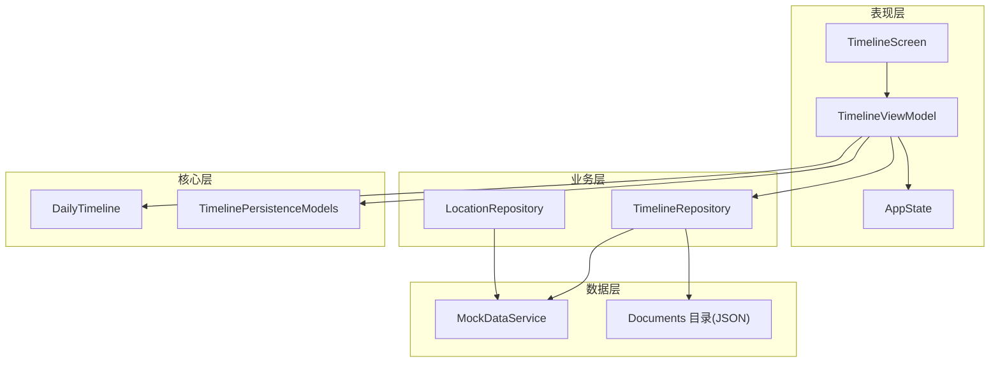
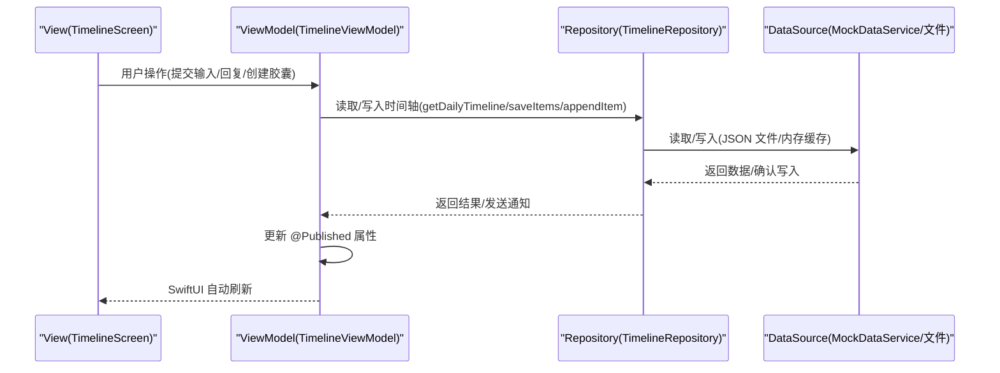
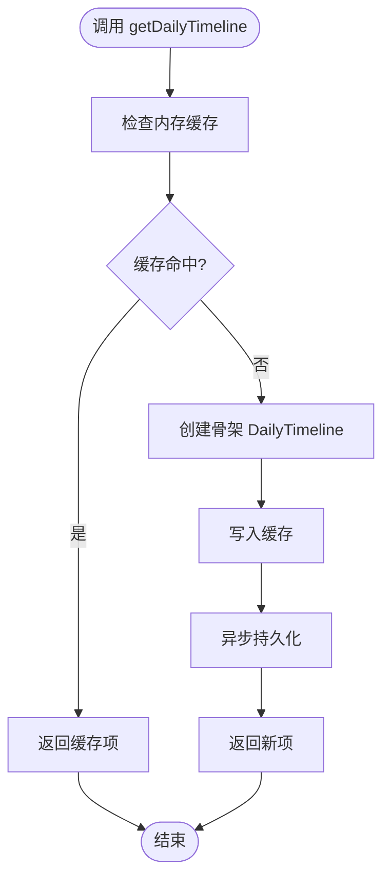
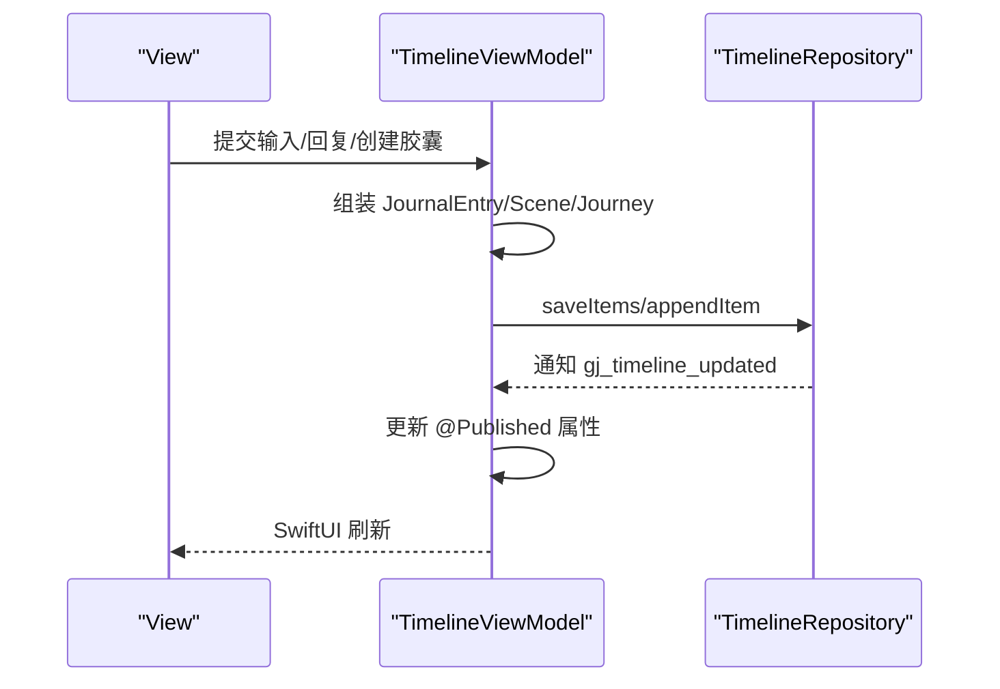
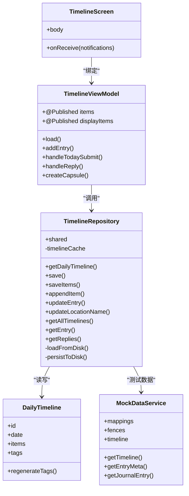

# 数据流设计

<cite>
**本文引用的文件列表**
- [Docs/architecture/system-architecture.md](file://Docs/architecture/system-architecture.md)
- [guanji0.34/DataLayer/Repositories/TimelineRepository.swift](file://guanji0.34/DataLayer/Repositories/TimelineRepository.swift)
- [guanji0.34/DataLayer/DataSources/MockDataService.swift](file://guanji0.34/DataLayer/DataSources/MockDataService.swift)
- [guanji0.34/Features/Timeline/TimelineViewModel.swift](file://guanji0.34/Features/Timeline/TimelineViewModel.swift)
- [guanji0.34/Features/Timeline/TimelineScreen.swift](file://guanji0.34/Features/Timeline/TimelineScreen.swift)
- [guanji0.34/Core/Models/DailyTimeline.swift](file://guanji0.34/Core/Models/DailyTimeline.swift)
- [guanji0.34/Core/Models/TimelinePersistenceModels.swift](file://guanji0.34/Core/Models/TimelinePersistenceModels.swift)
- [guanji0.34/DataLayer/Repositories/LocationRepository.swift](file://guanji0.34/DataLayer/Repositories/LocationRepository.swift)
- [guanji0.34/App/AppState.swift](file://guanji0.34/App/AppState.swift)
</cite>

## 目录
1. [引言](#引言)
2. [项目结构](#项目结构)
3. [核心组件](#核心组件)
4. [架构总览](#架构总览)
5. [详细组件分析](#详细组件分析)
6. [依赖关系分析](#依赖关系分析)
7. [性能考量](#性能考量)
8. [故障排查指南](#故障排查指南)
9. [结论](#结论)

## 引言
本文件围绕“从用户操作到数据持久化的端到端数据流”进行系统性梳理，依据系统架构文档中的序列图，完整描述 View → ViewModel → Repository → DataSource 的数据流动路径，并重点解析 TimelineRepository 的读写实现、MockDataService 在测试中的作用、@Published 驱动的响应式 UI 刷新链路，以及错误处理、数据一致性保障与 JSON 序列化/反序列化的边界条件。同时给出性能优化建议与最佳实践。

## 项目结构
- 表现层：Features/Timeline（屏幕 + ViewModel），UI 原子/分子/有机体组件，App/AppState 全局状态
- 业务层：Repositories（数据仓库，封装数据访问逻辑）
- 数据层：DataSources（本地 JSON 文件存储 + Mock 数据），SystemServices（系统服务）
- 核心层：Models（数据模型），Utilities（工具函数）

图表来源
- [Docs/architecture/system-architecture.md](file://Docs/architecture/system-architecture.md#L21-L53)
- [guanji0.34/Features/Timeline/TimelineScreen.swift](file://guanji0.34/Features/Timeline/TimelineScreen.swift#L1-L40)
- [guanji0.34/Features/Timeline/TimelineViewModel.swift](file://guanji0.34/Features/Timeline/TimelineViewModel.swift#L1-L31)
- [guanji0.34/DataLayer/Repositories/TimelineRepository.swift](file://guanji0.34/DataLayer/Repositories/TimelineRepository.swift#L1-L24)
- [guanji0.34/DataLayer/DataSources/MockDataService.swift](file://guanji0.34/DataLayer/DataSources/MockDataService.swift#L1-L20)
- [guanji0.34/Core/Models/DailyTimeline.swift](file://guanji0.34/Core/Models/DailyTimeline.swift#L1-L59)
- [guanji0.34/Core/Models/TimelinePersistenceModels.swift](file://guanji0.34/Core/Models/TimelinePersistenceModels.swift#L1-L80)

章节来源
- [Docs/architecture/system-architecture.md](file://Docs/architecture/system-architecture.md#L55-L90)

## 核心组件
- TimelineRepository：单例，负责每日时间轴的读取、保存、缓存与历史查询；异步持久化至 Documents/TimelineData_v2/daily_timelines.json；通过 NotificationCenter 广播数据变更。
- TimelineViewModel：订阅 @Published 属性，组合数据（时间轴项、问题、追踪记录、位置映射），响应用户输入并调用 Repository 完成读写；监听系统事件以保持 UI 一致。
- TimelineScreen：绑定 ViewModel，接收全局通知，驱动 UI 刷新与交互。
- MockDataService：提供测试/演示用的模拟数据（地址映射、围栏、时间轴、问答、爱的表达等），用于开发与测试阶段的数据填充。
- AppState：全局状态容器，承载当前模式、日期、编辑态、位置授权等跨模块共享状态。
- DailyTimeline 与 TimelinePersistenceModels：定义时间轴主表、场景/旅程 DTO 与原子条目，支撑序列化/反序列化与数据结构一致性。

章节来源
- [guanji0.34/DataLayer/Repositories/TimelineRepository.swift](file://guanji0.34/DataLayer/Repositories/TimelineRepository.swift#L3-L24)
- [guanji0.34/Features/Timeline/TimelineViewModel.swift](file://guanji0.34/Features/Timeline/TimelineViewModel.swift#L5-L31)
- [guanji0.34/Features/Timeline/TimelineScreen.swift](file://guanji0.34/Features/Timeline/TimelineScreen.swift#L3-L20)
- [guanji0.34/DataLayer/DataSources/MockDataService.swift](file://guanji0.34/DataLayer/DataSources/MockDataService.swift#L11-L20)
- [guanji0.34/App/AppState.swift](file://guanji0.34/App/AppState.swift#L4-L51)
- [guanji0.34/Core/Models/DailyTimeline.swift](file://guanji0.34/Core/Models/DailyTimeline.swift#L5-L39)
- [guanji0.34/Core/Models/TimelinePersistenceModels.swift](file://guanji0.34/Core/Models/TimelinePersistenceModels.swift#L5-L79)

## 架构总览
系统采用 MVVM + Atomic Design，数据流遵循“View 触发事件 → ViewModel 调用业务方法 → Repository 执行数据访问 → DataSource 完成存储”的闭环。Repository 作为单例封装数据访问逻辑，隔离上层与存储细节；@Published 驱动的响应式链路确保 UI 自动刷新。

图表来源
- [Docs/architecture/system-architecture.md](file://Docs/architecture/system-architecture.md#L125-L139)
- [guanji0.34/Features/Timeline/TimelineScreen.swift](file://guanji0.34/Features/Timeline/TimelineScreen.swift#L294-L317)
- [guanji0.34/Features/Timeline/TimelineViewModel.swift](file://guanji0.34/Features/Timeline/TimelineViewModel.swift#L48-L135)
- [guanji0.34/DataLayer/Repositories/TimelineRepository.swift](file://guanji0.34/DataLayer/Repositories/TimelineRepository.swift#L28-L61)

## 详细组件分析

### TimelineRepository：单例封装与读写实现
- 单例与缓存：通过静态 shared 实例化，内部维护内存缓存 timelineCache，首次访问时从磁盘加载，后续读写优先命中缓存，最后异步落盘。
- 读取接口：getDailyTimeline(for:) 若缓存不存在则创建骨架并持久化；getAllTimelines/getEntry/getReplies 提供历史检索能力。
- 写入接口：save(saveItems/appendItem/updateEntry/更新地点名称等) 统一更新缓存并异步持久化；完成后通过 NotificationCenter 广播“gj_timeline_updated”。
- 持久化细节：loadFromDisk 使用 JSONDecoder 解码字典；persistToDisk 使用 JSONEncoder 编码并在后台队列写入 Documents 目录，异常打印日志。

图表来源
- [guanji0.34/DataLayer/Repositories/TimelineRepository.swift](file://guanji0.34/DataLayer/Repositories/TimelineRepository.swift#L30-L41)
- [guanji0.34/DataLayer/Repositories/TimelineRepository.swift](file://guanji0.34/DataLayer/Repositories/TimelineRepository.swift#L148-L165)

章节来源
- [guanji0.34/DataLayer/Repositories/TimelineRepository.swift](file://guanji0.34/DataLayer/Repositories/TimelineRepository.swift#L3-L24)
- [guanji0.34/DataLayer/Repositories/TimelineRepository.swift](file://guanji0.34/DataLayer/Repositories/TimelineRepository.swift#L28-L61)
- [guanji0.34/DataLayer/Repositories/TimelineRepository.swift](file://guanji0.34/DataLayer/Repositories/TimelineRepository.swift#L148-L165)

### TimelineViewModel：业务编排与响应式刷新
- 初始化与订阅：构造函数中组合 items 与 todayQuestions，使用 CombineLatest 计算 displayItems；监听“gj_addresses_changed”“gj_day_end_time_changed”“gj_tracker_updated”等通知以保持 UI 一致。
- 加载流程：load(date:) 获取当日追踪记录，调用 Repository 获取 DailyTimeline，去重 deduplicate 后赋值 @Published 属性；补充今日问题与回溯 Review。
- 用户输入处理：addEntry/handleTodaySubmit/handleReply/createCapsule 等方法根据输入生成 JournalEntry/Scene/Journey，调用 Repository 保存；必要时刷新位置映射。
- 响应式链路：@Published 属性变更自动触发 SwiftUI 刷新；通过 NotificationCenter 接收“gj_timeline_updated”在今日视图中主动 reload。

图表来源
- [guanji0.34/Features/Timeline/TimelineViewModel.swift](file://guanji0.34/Features/Timeline/TimelineViewModel.swift#L152-L196)
- [guanji0.34/Features/Timeline/TimelineViewModel.swift](file://guanji0.34/Features/Timeline/TimelineViewModel.swift#L363-L495)
- [guanji0.34/Features/Timeline/TimelineViewModel.swift](file://guanji0.34/Features/Timeline/TimelineViewModel.swift#L528-L671)
- [guanji0.34/Features/Timeline/TimelineViewModel.swift](file://guanji0.34/Features/Timeline/TimelineViewModel.swift#L673-L737)
- [guanji0.34/DataLayer/Repositories/TimelineRepository.swift](file://guanji0.34/DataLayer/Repositories/TimelineRepository.swift#L44-L54)

章节来源
- [guanji0.34/Features/Timeline/TimelineViewModel.swift](file://guanji0.34/Features/Timeline/TimelineViewModel.swift#L17-L31)
- [guanji0.34/Features/Timeline/TimelineViewModel.swift](file://guanji0.34/Features/Timeline/TimelineViewModel.swift#L48-L135)
- [guanji0.34/Features/Timeline/TimelineViewModel.swift](file://guanji0.34/Features/Timeline/TimelineViewModel.swift#L152-L196)
- [guanji0.34/Features/Timeline/TimelineViewModel.swift](file://guanji0.34/Features/Timeline/TimelineViewModel.swift#L363-L495)
- [guanji0.34/Features/Timeline/TimelineViewModel.swift](file://guanji0.34/Features/Timeline/TimelineViewModel.swift#L528-L671)
- [guanji0.34/Features/Timeline/TimelineViewModel.swift](file://guanji0.34/Features/Timeline/TimelineViewModel.swift#L673-L737)

### MockDataService：测试与演示数据
- 提供地址映射、围栏、时间轴、问答、成就等模拟数据，支持 buildLocation 基于围栏与映射生成位置 VO。
- Timeline 字典按日期组织，getTimeline/getEntryMeta/getJournalEntry 支持快速检索。
- 用于开发/测试阶段的种子数据与占位数据，避免无数据场景。

章节来源
- [guanji0.34/DataLayer/DataSources/MockDataService.swift](file://guanji0.34/DataLayer/DataSources/MockDataService.swift#L11-L20)
- [guanji0.34/DataLayer/DataSources/MockDataService.swift](file://guanji0.34/DataLayer/DataSources/MockDataService.swift#L98-L167)
- [guanji0.34/DataLayer/DataSources/MockDataService.swift](file://guanji0.34/DataLayer/DataSources/MockDataService.swift#L169-L205)

### 数据模型与序列化
- DailyTimeline：每日时间轴主表，包含 id/date/items/tags 等字段，提供 regenerateTags 辅助方法。
- TimelinePersistenceModels：SceneRecord/AtomRecord 等 DTO，用于将复杂嵌套结构拆分为可序列化的轻量结构，便于跨模块传输与持久化。
- JSON 序列化：Repository 使用 JSONEncoder/JSONDecoder；MockDataService 中也涉及 JSON 解码/编码用于迁移或兼容。

章节来源
- [guanji0.34/Core/Models/DailyTimeline.swift](file://guanji0.34/Core/Models/DailyTimeline.swift#L5-L59)
- [guanji0.34/Core/Models/TimelinePersistenceModels.swift](file://guanji0.34/Core/Models/TimelinePersistenceModels.swift#L5-L79)
- [guanji0.34/DataLayer/Repositories/TimelineRepository.swift](file://guanji0.34/DataLayer/Repositories/TimelineRepository.swift#L148-L165)

### LocationRepository：地址与围栏管理
- 与 TimelineRepository 协作，提供位置映射与围栏建议；变更后通过 NotificationCenter 广播“gj_addresses_changed”，驱动 ViewModel 刷新显示。
- validate 提供数据完整性校验，确保围栏坐标范围、半径、映射关联等有效。

章节来源
- [guanji0.34/DataLayer/Repositories/LocationRepository.swift](file://guanji0.34/DataLayer/Repositories/LocationRepository.swift#L3-L37)
- [guanji0.34/DataLayer/Repositories/LocationRepository.swift](file://guanji0.34/DataLayer/Repositories/LocationRepository.swift#L128-L146)

### AppState：全局状态与跨模块通信
- 承载当前日期、编辑态、位置授权、AI 模式等状态；TimelineScreen 通过环境对象注入，驱动 UI 与行为切换。

章节来源
- [guanji0.34/App/AppState.swift](file://guanji0.34/App/AppState.swift#L4-L51)
- [guanji0.34/Features/Timeline/TimelineScreen.swift](file://guanji0.34/Features/Timeline/TimelineScreen.swift#L3-L20)

## 依赖关系分析

图表来源
- [guanji0.34/DataLayer/Repositories/TimelineRepository.swift](file://guanji0.34/DataLayer/Repositories/TimelineRepository.swift#L3-L24)
- [guanji0.34/Features/Timeline/TimelineViewModel.swift](file://guanji0.34/Features/Timeline/TimelineViewModel.swift#L5-L31)
- [guanji0.34/Features/Timeline/TimelineScreen.swift](file://guanji0.34/Features/Timeline/TimelineScreen.swift#L3-L20)
- [guanji0.34/DataLayer/DataSources/MockDataService.swift](file://guanji0.34/DataLayer/DataSources/MockDataService.swift#L11-L20)
- [guanji0.34/Core/Models/DailyTimeline.swift](file://guanji0.34/Core/Models/DailyTimeline.swift#L5-L59)

## 性能考量
- 缓存策略
  - 内存缓存：Repository 使用 timelineCache 减少重复 IO；建议在应用生命周期内尽量复用同一实例，避免多实例导致的缓存不一致。
  - 磁盘持久化：异步写入，避免主线程阻塞；建议在高频写入场景下合并多次变更后再统一持久化。
- 批量更新
  - ViewModel 中对 items 的修改（新增/追加/更新）应尽量减少多次 saveItems 调用，可在批处理结束后一次性保存。
- JSON 序列化
  - 大体量数据时，考虑分页/增量序列化；避免一次性编码/解码超大字典。
- 去重与一致性
  - ViewModel 对 items 去重（按 id 最后出现为准）以应对并发/竞态；Repository 在保存前统一 regenerateTags，确保标签一致性。
- I/O 优化
  - 仅在必要时触发持久化（如用户离开页面或定时任务）；避免每次小改动都写盘。

[本节为通用性能建议，无需特定文件引用]

## 故障排查指南
- JSON 读写失败
  - 现象：持久化异常或数据丢失。
  - 排查：检查 Documents 目录是否存在；查看 Repository 的持久化日志；确认 JSONEncoder/JSONDecoder 的日期策略与模型一致性。
- 数据不一致
  - 现象：UI 与磁盘数据不一致。
  - 排查：确认 Repository 是否正确更新缓存与磁盘；检查 ViewModel 是否在收到“gj_timeline_updated”后及时 reload。
- 通知未生效
  - 现象：位置变更或地址映射更新后 UI 未刷新。
  - 排查：确认 LocationRepository 是否广播“gj_addresses_changed”；TimelineViewModel 是否注册监听并调用 refreshLocationMappings。
- 模拟数据冲突
  - 现象：测试数据与真实数据混杂。
  - 排查：确认 MockDataService 仅在开发/测试环境启用；生产环境应使用真实数据源。

章节来源
- [guanji0.34/DataLayer/Repositories/TimelineRepository.swift](file://guanji0.34/DataLayer/Repositories/TimelineRepository.swift#L148-L165)
- [guanji0.34/DataLayer/Repositories/LocationRepository.swift](file://guanji0.34/DataLayer/Repositories/LocationRepository.swift#L34-L37)
- [guanji0.34/Features/Timeline/TimelineViewModel.swift](file://guanji0.34/Features/Timeline/TimelineViewModel.swift#L28-L46)

## 结论
该系统通过 Repository 单例封装数据访问，结合内存缓存与异步持久化，实现了从用户操作到数据落地的清晰端到端流程。@Published 驱动的响应式链路确保 UI 实时刷新；NotificationCenter 保障跨模块状态同步。配合 MockDataService 的测试数据与 DailyTimeline/TimelinePersistenceModels 的结构化模型，系统在可维护性、可测试性与性能方面均具备良好基础。建议在高频写入场景下进一步优化批量更新与持久化时机，以获得更佳用户体验。