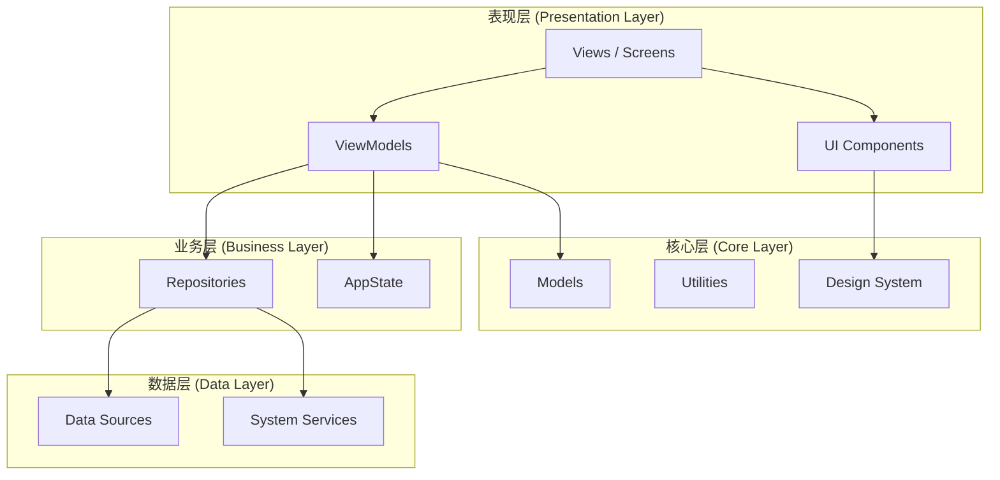
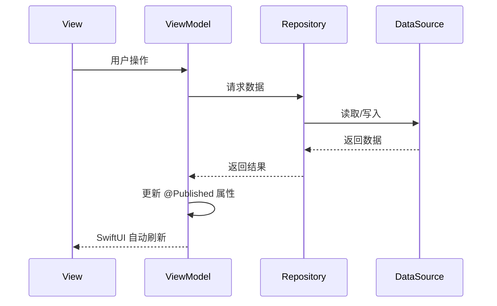
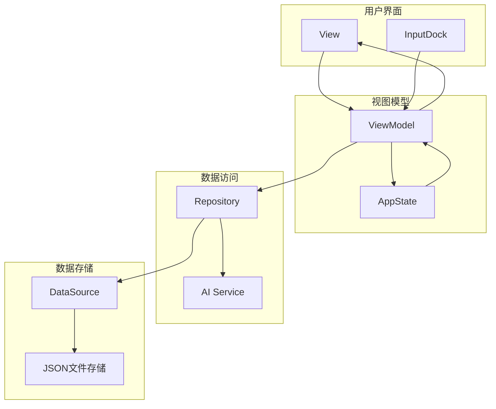
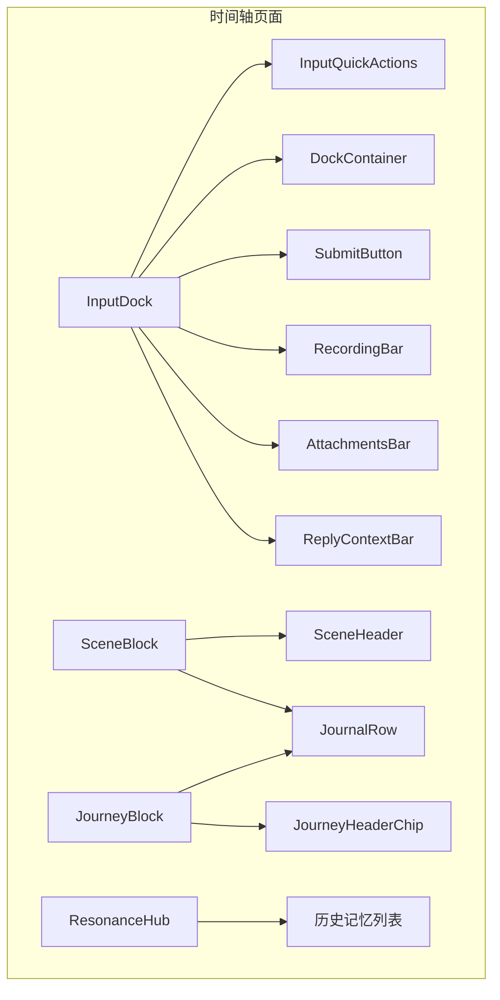

# 架构设计

<cite>
**本文档引用的文件**   
- [system-architecture.md](file://Docs/architecture/system-architecture.md)
- [mvvm-pattern.md](file://Docs/architecture/mvvm-pattern.md)
- [atoms.md](file://Docs/components/atoms.md)
- [molecules.md](file://Docs/components/molecules.md)
- [organisms.md](file://Docs/components/organisms.md)
- [AppState.swift](file://guanji0.34/App/AppState.swift)
- [TimelineViewModel.swift](file://guanji0.34/Features/Timeline/TimelineViewModel.swift)
- [AIConversationViewModel.swift](file://guanji0.34/Features/AIConversation/AIConversationViewModel.swift)
- [AIConversationRepository.swift](file://guanji0.34/DataLayer/Repositories/AIConversationRepository.swift)
- [AIService.swift](file://guanji0.34/DataLayer/SystemServices/AIService.swift)
- [InputDock.swift](file://guanji0.34/UI/Organisms/InputDock.swift)
- [InputAtoms.swift](file://guanji0.34/UI/Atoms/InputAtoms.swift)
- [ContextCard.swift](file://guanji0.34/UI/Molecules/ContextCard.swift)
- [TimelineScreen.swift](file://guanji0.34/Features/Timeline/TimelineScreen.swift)
- [AIConversationScreen.swift](file://guanji0.34/Features/AIConversation/AIConversationScreen.swift)
</cite>

## 目录
1. [系统架构概览](#系统架构概览)
2. [MVVM设计模式](#mvvm设计模式)
3. [分层架构与数据流](#分层架构与数据流)
4. [全局状态管理](#全局状态管理)
5. [Atomic Design组件体系](#atomic-design组件体系)
6. [跨模块通信机制](#跨模块通信机制)
7. [架构优势与优化方向](#架构优势与优化方向)

## 系统架构概览

观己(Guanji)应用采用MVVM（Model-View-ViewModel）架构模式，结合Atomic Design组件设计理念，构建了一个具有"生命感"的iOS应用。系统严格遵循Apple人机界面指南(HIG)，确保流畅的原生体验。



**Diagram sources**
- [system-architecture.md](file://Docs/architecture/system-architecture.md)

**Section sources**
- [system-architecture.md](file://Docs/architecture/system-architecture.md)

## MVVM设计模式

观己应用采用MVVM（Model-View-ViewModel）架构模式，实现关注点分离。View负责UI展示，ViewModel负责业务逻辑和状态管理，Model负责数据定义。

```mermaid
graph LR
subgraph "View Layer"
V[SwiftUI View]
end
subgraph "ViewModel Layer"
VM[ViewModel]
AS[AppState]
end
subgraph "Model Layer"
M[Models]
R[Repositories]
end
V --> |用户操作| VM
VM --> |@Published| V
VM --> |读写数据| R
R --> |返回| M
V -.->|@EnvironmentObject| AS
VM -.->|访问| AS
```

### 职责划分

#### View (视图层)
- **职责**: 仅负责UI布局和数据绑定
- **允许**: 使用`@StateObject` / `@ObservedObject`绑定ViewModel，使用`@EnvironmentObject`访问全局状态，响应用户交互并调用ViewModel方法
- **禁止**: 包含业务逻辑判断，直接调用Repository，进行数据转换或格式化，硬编码字符串或数字

#### ViewModel (视图模型层)
- **职责**: 业务逻辑、状态管理、数据转换
- **核心功能**: 处理用户操作，执行业务规则，使用`@Published`发布状态变化，通过Repository访问数据，将Model数据转换为View可用格式

#### Model (模型层)
- **职责**: 数据结构定义，不包含业务逻辑
- **特点**: 纯数据结构，无业务方法，遵循Codable协议实现数据序列化

**Section sources**
- [mvvm-pattern.md](file://Docs/architecture/mvvm-pattern.md)

## 分层架构与数据流

### 数据流路径

系统遵循清晰的数据流路径：View → ViewModel → Repository → DataSource，确保数据流动的单向性和可预测性。



### 组件交互图

从用户操作到数据持久化的完整链条展示了各组件间的交互关系。



**Diagram sources**
- [system-architecture.md](file://Docs/architecture/system-architecture.md)
- [mvvm-pattern.md](file://Docs/architecture/mvvm-pattern.md)

**Section sources**
- [TimelineViewModel.swift](file://guanji0.34/Features/Timeline/TimelineViewModel.swift)
- [AIConversationViewModel.swift](file://guanji0.34/Features/AIConversation/AIConversationViewModel.swift)
- [AIConversationRepository.swift](file://guanji0.34/DataLayer/Repositories/AIConversationRepository.swift)
- [AIService.swift](file://guanji0.34/DataLayer/SystemServices/AIService.swift)

## 全局状态管理

### AppState设计原理

AppState作为全局应用状态容器，通过`@EnvironmentObject`在整个应用中共享，实现跨模块通信。

```swift
// 文件路径: App/AppState.swift
public final class AppState: ObservableObject {
    @Published public var selectedDate: String = DateUtilities.today
    @Published public var currentMode: AppMode = .journal
    @Published public var showMindState: Bool = false
    @Published public var editingEntryId: String? = nil
    // ... 其他状态属性
}
```

### 跨模块通信

AppState在跨模块通信中扮演核心角色，主要体现在：
- **模式切换**: 管理应用在日记模式和AI模式之间的切换
- **状态同步**: 共享选中日期、编辑状态等全局信息
- **UI控制**: 控制弹窗、抽屉等UI组件的显示状态
- **数据关联**: 连接不同功能模块的数据状态

**Section sources**
- [AppState.swift](file://guanji0.34/App/AppState.swift)

## Atomic Design组件体系

### Atoms（基础控件）

原子组件是UI系统中最基础的构建单元，遵循Atomic Design设计方法论。这些组件是不可再分的最小UI元素，用于构建更复杂的分子组件和有机体组件。

| 组件名称 | 用途 |
|---------|------|
| CapsuleTextEditor | 胶囊样式文本编辑器 |
| GrowingTextEditor | 自动增长文本编辑器 |
| RoundIconButton | 圆形图标按钮 |
| SelectableChip | 可选择标签组件 |
| ThickSlider | 粗滑块组件 |

**Section sources**
- [atoms.md](file://Docs/components/atoms.md)

### Molecules（复合组件）

分子组件是由多个原子组件组合而成的复合UI元素，实现了特定的功能单元，可以在不同的有机体组件和页面中复用。

| 组件名称 | 用途 |
|---------|------|
| AchievementCard | 成就卡片 |
| ActivityGroupSection | 活动分组区块 |
| CapsuleCard | 时间胶囊卡片 |
| ContextCard | 活动上下文卡片 |
| DailyTrackerSummaryCard | 每日追踪摘要卡片 |

**Section sources**
- [molecules.md](file://Docs/components/molecules.md)

### Organisms（业务模块）

有机体组件是由多个分子组件和原子组件组合而成的复杂UI结构，实现了完整的功能区块，通常对应应用中的主要交互区域。

| 组件名称 | 用途 |
|---------|------|
| InputDock | 输入停靠栏 |
| JourneyBlock | 旅程区块 |
| MorningBriefing | 晨间简报 |
| ResonanceHub | 共鸣中心 |
| SceneBlock | 场景区块 |



**Diagram sources**
- [organisms.md](file://Docs/components/organisms.md)

**Section sources**
- [organisms.md](file://Docs/components/organisms.md)
- [InputDock.swift](file://guanji0.34/UI/Organisms/InputDock.swift)
- [ContextCard.swift](file://guanji0.34/UI/Molecules/ContextCard.swift)

## 跨模块通信机制

### 状态传递

系统采用多种机制实现跨模块通信：

| 机制 | 用途 |
|------|------|
| `@EnvironmentObject` | 全局状态(AppState)通过环境对象传递 |
| `@StateObject / @ObservedObject` | ViewModel与View绑定 |
| `@Published` | ViewModel发布状态变化 |

### 事件通知

跨模块通信使用`NotificationCenter`，关键事件包括：

| 事件名 | 触发场景 |
|--------|----------|
| `gj_submit_input` | 用户提交输入 |
| `gj_addresses_changed` | 地址映射变更 |
| `gj_timeline_updated` | 时间轴数据更新 |
| `gj_tracker_updated` | 追踪器数据更新 |
| `gj_day_end_time_changed` | 日结束时间变更 |

**Section sources**
- [system-architecture.md](file://Docs/architecture/system-architecture.md)
- [mvvm-pattern.md](file://Docs/architecture/mvvm-pattern.md)

## 架构优势与优化方向

### 架构优势

#### 可测试性
- **ViewModel隔离**: 业务逻辑与UI分离，便于单元测试
- **依赖注入**: Repository和Service通过属性注入，可轻松替换为测试桩
- **纯函数**: Model层为纯数据结构，测试简单

#### 可维护性
- **关注点分离**: MVVM模式确保各层职责清晰
- **组件复用**: Atomic Design实现UI组件的高复用性
- **单向数据流**: 数据流动路径清晰，易于追踪和调试

#### 扩展性
- **模块化设计**: 功能模块独立，便于添加新功能
- **松耦合**: 通过Repository和NotificationCenter解耦组件
- **配置驱动**: 系统服务和API配置可动态调整

### 潜在瓶颈及优化方向

#### 性能瓶颈
- **内存占用**: 大量@Published属性可能导致内存占用过高
- **UI刷新**: 频繁的状态更新可能影响UI性能
- **数据同步**: 多模块同时访问数据可能导致竞争条件

#### 优化方向
- **状态优化**: 合并相关状态，减少@Published属性数量
- **异步处理**: 将耗时操作移至后台线程
- **缓存策略**: 增强数据缓存机制，减少重复计算
- **懒加载**: 对非关键组件实现懒加载

**Section sources**
- [system-architecture.md](file://Docs/architecture/system-architecture.md)
- [mvvm-pattern.md](file://Docs/architecture/mvvm-pattern.md)