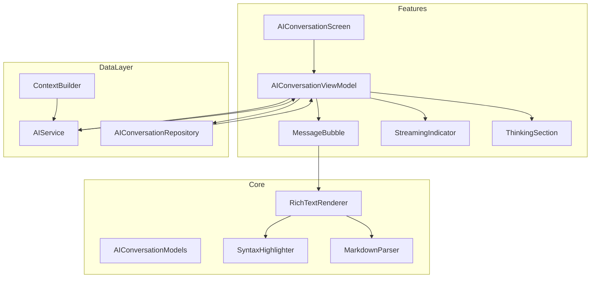
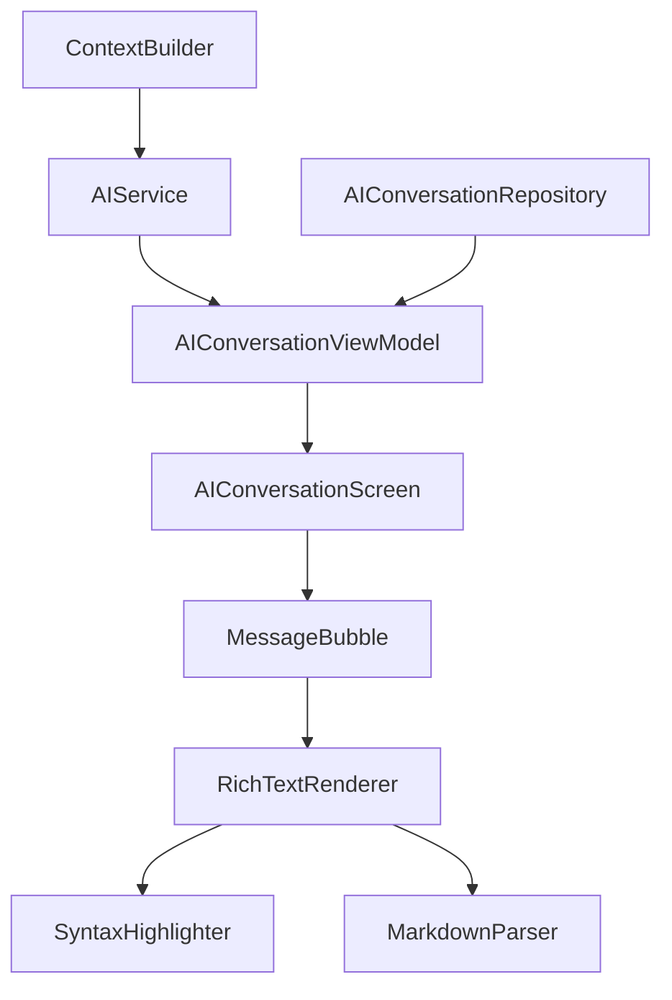
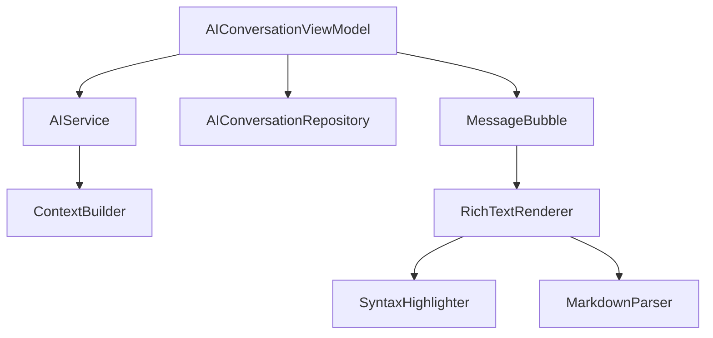

# AI对话功能

<cite>
**本文档引用文件**   
- [AIConversationViewModel.swift](file://guanji0.34/Features/AIConversation/AIConversationViewModel.swift)
- [AIConversationModels.swift](file://guanji0.34/Core/Models/AIConversationModels.swift)
- [AIService.swift](file://guanji0.34/DataLayer/SystemServices/AIService.swift)
- [MessageBubble.swift](file://guanji0.34/Features/AIConversation/Views/MessageBubble.swift)
- [RichTextRenderer.swift](file://guanji0.34/UI/Molecules/RichTextRenderer.swift)
- [SyntaxHighlighter.swift](file://guanji0.34/Core/Utilities/SyntaxHighlighter.swift)
- [ThinkingSection.swift](file://guanji0.34/Features/AIConversation/Views/ThinkingSection.swift)
- [StreamingIndicator.swift](file://guanji0.34/Features/AIConversation/Views/StreamingIndicator.swift)
- [ContextBuilder.swift](file://guanji0.34/DataLayer/SystemServices/ContextBuilder.swift)
- [MarkdownParser.swift](file://guanji0.34/Core/Utilities/MarkdownParser.swift)
- [AIConversationRepository.swift](file://guanji0.34/DataLayer/Repositories/AIConversationRepository.swift)
- [ai-conversation.md](file://Docs/features/ai-conversation.md)
</cite>

## 目录
1. [简介](#简介)
2. [项目结构](#项目结构)
3. [核心组件](#核心组件)
4. [架构概述](#架构概述)
5. [详细组件分析](#详细组件分析)
6. [依赖分析](#依赖分析)
7. [性能考虑](#性能考虑)
8. [故障排除指南](#故障排除指南)
9. [结论](#结论)

## 简介
AI对话功能为用户提供了一个与AI助手进行自然语言交流的智能对话模块。该功能支持流式响应、思考过程展示、对话历史管理以及富文本渲染等特性，旨在为用户提供流畅且沉浸式的AI交互体验。通过流式传输机制，用户可以实时看到AI的回复内容，而思考模式则允许用户查看AI的推理过程，从而更好地理解回答的逻辑。此外，系统还支持消息的持久化存储、多会话管理以及Markdown格式的富文本渲染，包括代码高亮和表格展示等功能。

## 项目结构
AI对话功能的代码组织遵循清晰的模块化结构，主要分为以下几个部分：
- **Features/AIConversation/**: 包含AI对话功能的核心视图和视图模型。
  - `AIConversationScreen.swift`: 主视图，负责展示消息列表和空状态。
  - `AIConversationViewModel.swift`: 视图模型，处理业务逻辑和流式响应。
  - `Views/`: 子组件目录，包含消息气泡、流式指示器和思考过程展示等UI组件。
- **Core/Models/**: 定义了AI对话相关的数据模型，如`AIConversation`和`AIMessage`。
- **DataLayer/SystemServices/**: 提供系统服务，如`AIService`用于AI API调用和流式处理。
- **UI/Molecules/**: 包含富文本渲染器`RichTextRenderer`，用于解析和渲染Markdown内容。
- **Core/Utilities/**: 工具类，如`MarkdownParser`和`SyntaxHighlighter`，用于解析Markdown和语法高亮。

**图源**
- [AIConversationScreen.swift](file://guanji0.34/Features/AIConversation/AIConversationScreen.swift)
- [AIConversationViewModel.swift](file://guanji0.34/Features/AIConversation/AIConversationViewModel.swift)
- [AIService.swift](file://guanji0.34/DataLayer/SystemServices/AIService.swift)
- [AIConversationRepository.swift](file://guanji0.34/DataLayer/Repositories/AIConversationRepository.swift)
- [ContextBuilder.swift](file://guanji0.34/DataLayer/SystemServices/ContextBuilder.swift)

## 核心组件
AI对话功能的核心组件包括`AIConversationViewModel`、`AIService`、`MessageBubble`和`RichTextRenderer`。这些组件协同工作，实现了从用户输入到AI响应的完整流程。

**组件源**
- [AIConversationViewModel.swift](file://guanji0.34/Features/AIConversation/AIConversationViewModel.swift#L8-L227)
- [AIService.swift](file://guanji0.34/DataLayer/SystemServices/AIService.swift#L5-L384)
- [MessageBubble.swift](file://guanji0.34/Features/AIConversation/Views/MessageBubble.swift#L9-L403)
- [RichTextRenderer.swift](file://guanji0.34/UI/Molecules/RichTextRenderer.swift#L9-L805)

## 架构概述
AI对话功能采用MVVM（Model-View-ViewModel）架构模式，将UI逻辑与业务逻辑分离。`AIConversationScreen`作为视图层，负责展示UI和用户交互；`AIConversationViewModel`作为视图模型层，处理业务逻辑和状态管理；`AIService`和`AIConversationRepository`作为数据层，分别负责AI API调用和对话持久化。

**图源**
- [AIConversationViewModel.swift](file://guanji0.34/Features/AIConversation/AIConversationViewModel.swift#L8-L227)
- [AIService.swift](file://guanji0.34/DataLayer/SystemServices/AIService.swift#L5-L384)
- [AIConversationRepository.swift](file://guanji0.34/DataLayer/Repositories/AIConversationRepository.swift#L6-L201)
- [ContextBuilder.swift](file://guanji0.34/DataLayer/SystemServices/ContextBuilder.swift#L7-L147)
- [MessageBubble.swift](file://guanji0.34/Features/AIConversation/Views/MessageBubble.swift#L9-L403)
- [RichTextRenderer.swift](file://guanji0.34/UI/Molecules/RichTextRenderer.swift#L9-L805)

## 详细组件分析

### AIConversationViewModel分析
`AIConversationViewModel`是AI对话功能的核心，负责管理对话状态、协调`AIService`和`AIConversationRepository`，并处理流式响应回调。它通过`@Published`属性暴露状态，供视图层订阅和更新。

#### 状态管理
`AIConversationViewModel`通过以下`@Published`属性管理状态：
- `conversation`: 当前对话
- `messages`: 当前对话的消息列表
- `isStreaming`: AI是否正在流式响应
- `streamingContent`: 当前流式响应的内容
- `streamingReasoning`: 当前流式响应的推理内容
- `errorMessage`: 错误消息
- `thinkingModeEnabled`: 思考模式是否启用
- `inputText`: 输入文本

#### 公共API
`AIConversationViewModel`提供了以下公共方法：
- `loadConversation(id:)`: 加载指定ID的对话
- `createNewConversation()`: 创建新对话
- `sendMessage(_:)`: 发送用户消息并获取AI响应
- `retryLastMessage()`: 重试最后一次失败的请求
- `cancelStreaming()`: 取消当前流式请求
- `toggleThinkingMode()`: 切换思考模式
- `deleteConversation()`: 删除当前对话
- `regenerateMessage(_:)`: 重新生成指定的AI消息

#### 流式响应处理
`startStreamingResponse()`方法启动流式响应，调用`AIService.sendMessage`并传递回调函数，处理内容更新、推理更新和完成事件。`handleStreamingComplete(_:)`方法在流式响应完成后处理结果，成功时将AI消息添加到对话中，失败时更新错误消息。

**组件源**
- [AIConversationViewModel.swift](file://guanji0.34/Features/AIConversation/AIConversationViewModel.swift#L8-L227)

### AIService分析
`AIService`负责与SiliconFlow API集成，支持流式响应和思考模式。它通过`URLSession`实现流式数据接收，并解析SSE（Server-Sent Events）格式的数据。

#### 请求构建
`sendMessage`方法构建请求，设置`stream: true`以启用流式响应，并配置回调函数处理内容更新、推理更新和完成事件。

#### 流式数据处理
`AIService`实现了`URLSessionDataDelegate`协议，通过`urlSession(_:dataTask:didReceive:)`方法接收数据流。`processStreamBuffer()`方法解析SSE格式的数据，提取JSON内容并调用`processStreamChunk(_:)`处理每个数据块。`processStreamChunk(_:)`方法累加内容和推理内容，并通过回调函数更新视图模型。

#### 错误处理与重试
`AIService`提供了`sendMessageWithRetry`方法，支持在请求失败时进行重试。它使用指数退避策略，避免频繁重试导致服务器压力过大。

**组件源**
- [AIService.swift](file://guanji0.34/DataLayer/SystemServices/AIService.swift#L5-L384)

### MessageBubble分析
`MessageBubble`是消息气泡组件，负责渲染用户和AI消息，并支持富文本渲染和交互功能。

#### 富文本渲染
`MessageBubble`使用`RichTextRenderer`解析和渲染Markdown内容。对于长消息（超过5000字符），它在后台线程异步解析，避免阻塞主线程。

#### 交互功能
`MessageBubble`支持以下交互功能：
- **长按上下文菜单**：复制消息、重新生成（AI消息）、复制含思考过程
- **消息操作按钮**：快速复制、重新生成
- **文本选择**：支持选择和复制任意文本内容

#### 思考过程展示
当`showThinking`为`true`且AI消息包含推理内容时，`MessageBubble`会显示`ThinkingSection`组件，展示AI的推理过程。

**组件源**
- [MessageBubble.swift](file://guanji0.34/Features/AIConversation/Views/MessageBubble.swift#L9-L403)

### RichTextRenderer分析
`RichTextRenderer`是富文本渲染器，负责将Markdown文档转换为SwiftUI视图。它通过递归遍历Markdown AST（抽象语法树），将不同类型的节点转换为相应的SwiftUI组件。

#### 组件映射
`RichTextRenderer`将Markdown节点映射为以下SwiftUI组件：
- `Heading`: 标题
- `Paragraph`: 段落
- `CodeBlock`: 代码块
- `UnorderedList`/`OrderedList`: 无序/有序列表
- `BlockQuote`: 引用
- `Table`: 表格
- `ThematicBreak`: 分隔线

#### 代码高亮
`CodeBlockView`使用`SyntaxHighlighter`对代码块进行语法高亮。它支持多种语言，如Swift、Python、JavaScript等，并提供复制功能。

#### 表格渲染
`MarkdownTableView`支持表格的水平滚动和单元格对齐。它通过`ScrollView(.horizontal)`实现水平滚动，并根据`columnAlignments`属性设置单元格对齐方式。

**组件源**
- [RichTextRenderer.swift](file://guanji0.34/UI/Molecules/RichTextRenderer.swift#L9-L805)

## 依赖分析
AI对话功能依赖于多个组件和服务，包括`AIService`、`AIConversationRepository`、`ContextBuilder`和`RichTextRenderer`。这些依赖关系确保了功能的完整性和可维护性。

**图源**
- [AIConversationViewModel.swift](file://guanji0.34/Features/AIConversation/AIConversationViewModel.swift#L8-L227)
- [AIService.swift](file://guanji0.34/DataLayer/SystemServices/AIService.swift#L5-L384)
- [AIConversationRepository.swift](file://guanji0.34/DataLayer/Repositories/AIConversationRepository.swift#L6-L201)
- [ContextBuilder.swift](file://guanji0.34/DataLayer/SystemServices/ContextBuilder.swift#L7-L147)
- [MessageBubble.swift](file://guanji0.34/Features/AIConversation/Views/MessageBubble.swift#L9-L403)
- [RichTextRenderer.swift](file://guanji0.34/UI/Molecules/RichTextRenderer.swift#L9-L805)

**组件源**
- [AIService.swift](file://guanji0.34/DataLayer/SystemServices/AIService.swift#L5-L384)
- [AIConversationRepository.swift](file://guanji0.34/DataLayer/Repositories/AIConversationRepository.swift#L6-L201)
- [ContextBuilder.swift](file://guanji0.34/DataLayer/SystemServices/ContextBuilder.swift#L7-L147)
- [RichTextRenderer.swift](file://guanji0.34/UI/Molecules/RichTextRenderer.swift#L9-L805)

## 性能考虑
AI对话功能在性能方面进行了多项优化，以确保流畅的用户体验。

### 异步解析
对于长消息，`MessageBubble`在后台线程异步解析Markdown内容，避免阻塞主线程。这通过`Task.detached`实现，确保UI的响应性。

### 增量解析
`StreamingMessageBubble`支持增量解析，处理流式传输中的不完整语法。`MarkdownParser.parseIncremental`方法检查语法完整性，并在语法完整时使用`RichTextRenderer`渲染，否则显示纯文本。

### 缓存机制
`AIConversationRepository`使用内存缓存存储对话，减少磁盘I/O操作。`conversationCache`字典缓存已加载的对话，提高访问速度。

### 背景持久化
`AIConversationRepository`在后台线程持久化对话和索引，避免阻塞主线程。`DispatchQueue.global(qos: .background)`用于执行持久化操作。

## 故障排除指南
### 流式传输中断
如果流式传输中断，检查网络连接和API密钥配置。确保`AIService.isConfigured`返回`true`，并且网络请求未被防火墙或代理阻止。

### 内容解析错误
如果Markdown内容解析错误，检查输入的Markdown语法是否正确。`MarkdownParser.hasIncompleteSyntax`方法可以检测不完整的语法，如未闭合的代码块。

### 长响应卡顿
如果长响应导致卡顿，确保`MessageBubble`在后台线程异步解析长消息。检查`asyncParsingThreshold`是否设置合理，避免在主线程解析过长的内容。

### 连接超时控制
`AIService`的`buildHTTPRequest`方法设置`timeoutInterval`为60秒，防止请求无限等待。可以根据需要调整超时时间。

### 错误重试机制
`AIService.sendMessageWithRetry`方法支持重试机制，使用指数退避策略。确保`maxRetries`设置合理，避免频繁重试导致服务器压力过大。

**组件源**
- [AIService.swift](file://guanji0.34/DataLayer/SystemServices/AIService.swift#L5-L384)
- [MarkdownParser.swift](file://guanji0.34/Core/Utilities/MarkdownParser.swift#L6-L46)

## 结论
AI对话功能通过流式响应、思考模式、富文本渲染和消息交互增强，为用户提供了流畅且沉浸式的AI交互体验。其模块化架构和清晰的依赖关系确保了功能的可维护性和可扩展性。通过异步解析、增量解析和背景持久化等性能优化，系统能够高效处理长消息和流式传输。故障排除指南提供了针对常见问题的解决方案，帮助开发者快速定位和解决问题。