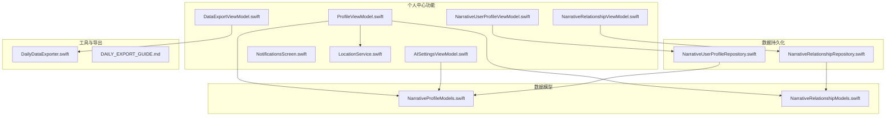
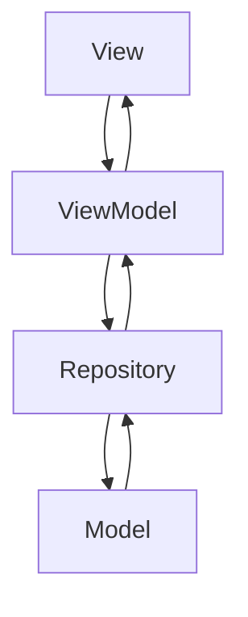
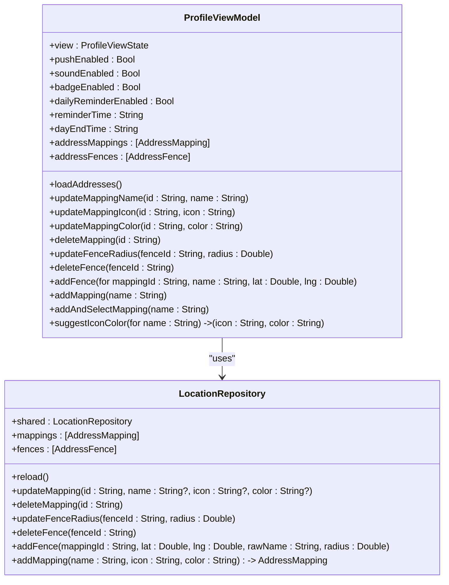
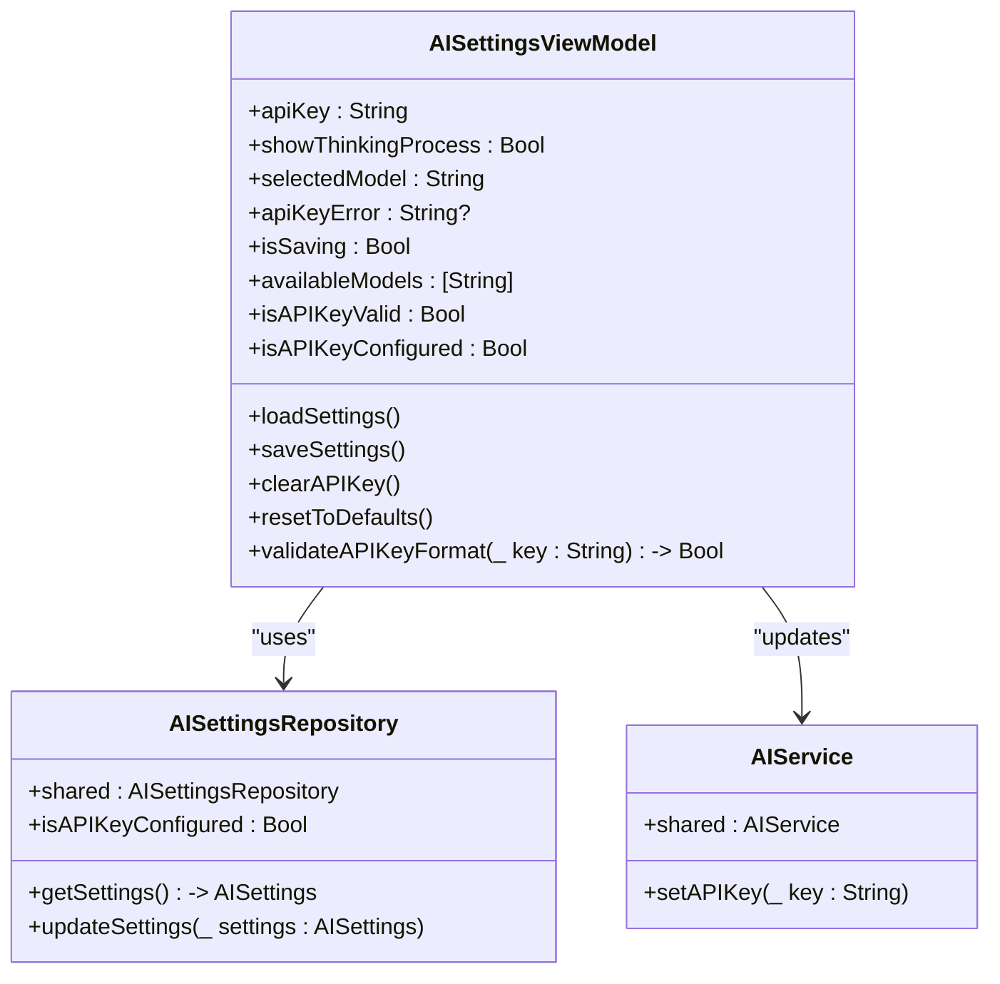
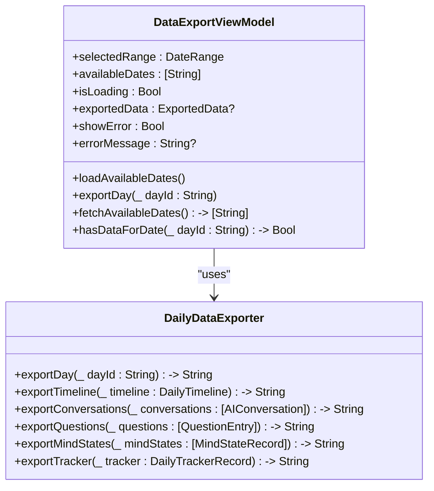
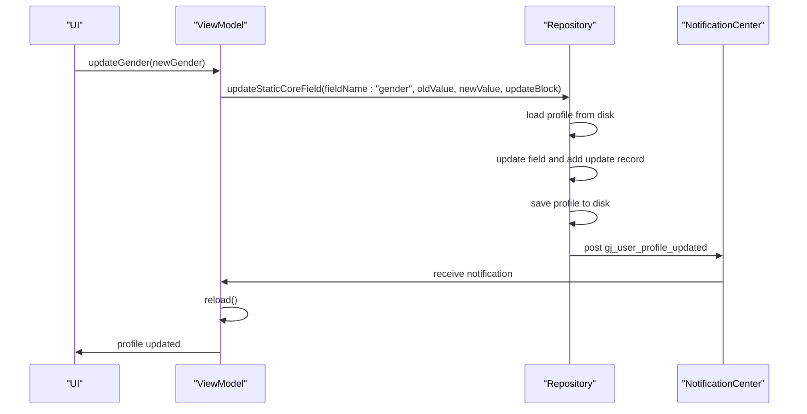
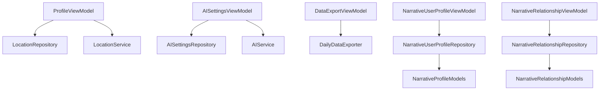

# 个人中心功能

<cite>
**本文档引用文件**  
- [ProfileViewModel.swift](file://guanji0.34/Features/Profile/ProfileViewModel.swift)
- [AISettingsViewModel.swift](file://guanji0.34/Features/Profile/AISettingsViewModel.swift)
- [DataExportViewModel.swift](file://guanji0.34/Features/Profile/DataExportViewModel.swift)
- [NarrativeUserProfileViewModel.swift](file://guanji0.34/Features/Profile/NarrativeUserProfileViewModel.swift)
- [NarrativeRelationshipViewModel.swift](file://guanji0.34/Features/Profile/NarrativeRelationshipViewModel.swift)
- [NarrativeProfileModels.swift](file://guanji0.34/Core/Models/NarrativeProfileModels.swift)
- [NarrativeRelationshipModels.swift](file://guanji0.34/Core/Models/NarrativeRelationshipModels.swift)
- [LocationService.swift](file://guanji0.34/DataLayer/SystemServices/LocationService.swift)
- [NotificationsScreen.swift](file://guanji0.34/Features/Profile/NotificationsScreen.swift)
- [DailyDataExporter.swift](file://guanji0.34/Core/Utilities/DailyDataExporter.swift)
- [NarrativeUserProfileRepository.swift](file://guanji0.34/DataLayer/Repositories/NarrativeUserProfileRepository.swift)
- [NarrativeRelationshipRepository.swift](file://guanji0.34/DataLayer/Repositories/NarrativeRelationshipRepository.swift)
- [DAILY_EXPORT_GUIDE.md](file://Docs/DAILY_EXPORT_GUIDE.md)
</cite>

## 目录
1. [简介](#简介)
2. [项目结构](#项目结构)
3. [核心组件](#核心组件)
4. [架构概览](#架构概览)
5. [详细组件分析](#详细组件分析)
6. [依赖分析](#依赖分析)
7. [性能考虑](#性能考虑)
8. [故障排除指南](#故障排除指南)
9. [结论](#结论)

## 简介
本文档详细阐述了“观己”应用中个人中心功能的技术实现，涵盖设置、数据管理、用户画像与关系网络等子模块。文档重点解析了ProfileViewModel如何协调多个子页面的状态同步，AISettingsViewModel对AI偏好配置的存储与更新机制，DataExportViewModel如何打包日记、情绪、位置等数据为可迁移格式，以及NarrativeUserProfile与NarrativeRelationship的编辑流程及其数据模型关联。同时，文档说明了位置管理（LocationService）与通知设置（NotificationsScreen）的系统集成方式，并提供了数据导出加密、隐私保护与权限控制的最佳实践。

## 项目结构
个人中心功能主要分布在`guanji0.34/Features/Profile/`目录下，包含多个ViewModel和View文件，用于管理用户设置、AI配置、数据导出、位置管理、通知设置等。数据模型定义在`guanji0.34/Core/Models/`目录下，而数据持久化逻辑则由`guanji0.34/DataLayer/Repositories/`中的Repository类处理。系统服务如位置服务则位于`guanji0.34/DataLayer/SystemServices/`。

**图源**
- [ProfileViewModel.swift](file://guanji0.34/Features/Profile/ProfileViewModel.swift)
- [AISettingsViewModel.swift](file://guanji0.34/Features/Profile/AISettingsViewModel.swift)
- [DataExportViewModel.swift](file://guanji0.34/Features/Profile/DataExportViewModel.swift)
- [NarrativeUserProfileViewModel.swift](file://guanji0.34/Features/Profile/NarrativeUserProfileViewModel.swift)
- [NarrativeRelationshipViewModel.swift](file://guanji0.34/Features/Profile/NarrativeRelationshipViewModel.swift)
- [NarrativeProfileModels.swift](file://guanji0.34/Core/Models/NarrativeProfileModels.swift)
- [NarrativeRelationshipModels.swift](file://guanji0.34/Core/Models/NarrativeRelationshipModels.swift)
- [LocationService.swift](file://guanji0.34/DataLayer/SystemServices/LocationService.swift)
- [DailyDataExporter.swift](file://guanji0.34/Core/Utilities/DailyDataExporter.swift)
- [NarrativeUserProfileRepository.swift](file://guanji0.34/DataLayer/Repositories/NarrativeUserProfileRepository.swift)
- [NarrativeRelationshipRepository.swift](file://guanji0.34/DataLayer/Repositories/NarrativeRelationshipRepository.swift)

## 核心组件
个人中心的核心组件包括ProfileViewModel、AISettingsViewModel、DataExportViewModel、NarrativeUserProfileViewModel和NarrativeRelationshipViewModel。这些ViewModel负责管理UI状态、处理用户交互，并与Repository层进行数据交换。数据模型如NarrativeUserProfile和NarrativeRelationship定义了用户画像和关系网络的结构，而DailyDataExporter则负责将数据导出为可读的文本格式。

**组件源**
- [ProfileViewModel.swift](file://guanji0.34/Features/Profile/ProfileViewModel.swift)
- [AISettingsViewModel.swift](file://guanji0.34/Features/Profile/AISettingsViewModel.swift)
- [DataExportViewModel.swift](file://guanji0.34/Features/Profile/DataExportViewModel.swift)
- [NarrativeUserProfileViewModel.swift](file://guanji0.34/Features/Profile/NarrativeUserProfileViewModel.swift)
- [NarrativeRelationshipViewModel.swift](file://guanji0.34/Features/Profile/NarrativeRelationshipViewModel.swift)

## 架构概览
个人中心功能采用MVVM（Model-View-ViewModel）架构模式。View负责UI展示和用户交互，ViewModel管理UI状态和业务逻辑，Model定义数据结构。Repository层负责数据的持久化和检索，与ViewModel解耦。这种分层架构确保了代码的可维护性和可测试性。

**图源**
- [mvvm-pattern.md](file://Docs/architecture/mvvm-pattern.md)

## 详细组件分析

### ProfileViewModel 状态同步
ProfileViewModel作为个人中心的主ViewModel，协调多个子页面的状态。它通过`@Published`属性暴露UI状态，如`view`（当前显示的页面）、`pushEnabled`（推送通知开关）等。当用户在不同设置页面间切换时，`view`属性的变化会驱动UI更新。通知设置等偏好通过`UserDefaults`持久化，并在`didSet`观察器中自动保存。

**图源**
- [ProfileViewModel.swift](file://guanji0.34/Features/Profile/ProfileViewModel.swift)
- [LocationRepository.swift](file://guanji0.34/DataLayer/Repositories/LocationRepository.swift)

**组件源**
- [ProfileViewModel.swift](file://guanji0.34/Features/Profile/ProfileViewModel.swift)

### AISettingsViewModel 配置管理
AISettingsViewModel负责管理AI相关的偏好设置，如API密钥、是否显示思考过程、选择的AI模型等。它通过`AISettingsRepository`获取和保存设置，并在`saveSettings()`方法中验证API密钥格式后更新`AIService`的API密钥，确保AI服务使用最新的配置。

**图源**
- [AISettingsViewModel.swift](file://guanji0.34/Features/Profile/AISettingsViewModel.swift)
- [AISettingsRepository.swift](file://guanji0.34/DataLayer/Repositories/AISettingsRepository.swift)
- [AIService.swift](file://guanji0.34/DataLayer/SystemServices/AIService.swift)

**组件源**
- [AISettingsViewModel.swift](file://guanji0.34/Features/Profile/AISettingsViewModel.swift)

### DataExportViewModel 数据导出
DataExportViewModel负责管理数据导出流程。它提供`exportDay(_ dayId: String)`方法，该方法调用`DailyDataExporter.exportDay(dayId)`来生成指定日期的文本报告。导出内容包括时间轴、AI对话、问题与思考、心境记录和每日追踪等。导出格式遵循`DAILY_EXPORT_GUIDE.md`中的规范。

**图源**
- [DataExportViewModel.swift](file://guanji0.34/Features/Profile/DataExportViewModel.swift)
- [DailyDataExporter.swift](file://guanji0.34/Core/Utilities/DailyDataExporter.swift)

**组件源**
- [DataExportViewModel.swift](file://guanji0.34/Features/Profile/DataExportViewModel.swift)

### NarrativeUserProfile 与 NarrativeRelationship 编辑流程
NarrativeUserProfileViewModel和NarrativeRelationshipViewModel分别管理用户画像和关系网络的编辑。它们通过Repository加载和保存数据，并在数据变更时通过`NotificationCenter`发布通知，触发UI更新。编辑操作如更新性别、添加关系标签等，都会调用Repository的相应方法，并更新本地缓存。

**图源**
- [NarrativeUserProfileViewModel.swift](file://guanji0.34/Features/Profile/NarrativeUserProfileViewModel.swift)
- [NarrativeUserProfileRepository.swift](file://guanji0.34/DataLayer/Repositories/NarrativeUserProfileRepository.swift)

**组件源**
- [NarrativeUserProfileViewModel.swift](file://guanji0.34/Features/Profile/NarrativeUserProfileViewModel.swift)
- [NarrativeRelationshipViewModel.swift](file://guanji0.34/Features/Profile/NarrativeRelationshipViewModel.swift)

### 位置管理与通知设置集成
位置管理由`LocationService`实现，它使用`CLLocationManager`获取位置信息，并通过`LocationRepository`管理位置映射和地理围栏。通知设置在`NotificationsScreen`中通过`ProfileViewModel`的`@Published`属性进行绑定，实现UI与状态的双向同步。

**组件源**
- [LocationService.swift](file://guanji0.34/DataLayer/SystemServices/LocationService.swift)
- [NotificationsScreen.swift](file://guanji0.34/Features/Profile/NotificationsScreen.swift)

## 依赖分析
个人中心功能的组件间依赖关系清晰。ViewModel依赖于Repository进行数据持久化，Repository依赖于具体的Model定义。`DailyDataExporter`作为一个工具类，被`DataExportViewModel`调用。系统服务如`LocationService`和`AIService`被相应的ViewModel直接或间接使用。

**图源**
- [go.mod](file://guanji0.34.xcodeproj/project.pbxproj)
- [ProfileViewModel.swift](file://guanji0.34/Features/Profile/ProfileViewModel.swift)

**依赖源**
- [ProfileViewModel.swift](file://guanji0.34/Features/Profile/ProfileViewModel.swift)
- [AISettingsViewModel.swift](file://guanji0.34/Features/Profile/AISettingsViewModel.swift)
- [DataExportViewModel.swift](file://guanji0.34/Features/Profile/DataExportViewModel.swift)
- [NarrativeUserProfileViewModel.swift](file://guanji0.34/Features/Profile/NarrativeUserProfileViewModel.swift)
- [NarrativeRelationshipViewModel.swift](file://guanji0.34/Features/Profile/NarrativeRelationshipViewModel.swift)
- [LocationService.swift](file://guanji0.34/DataLayer/SystemServices/LocationService.swift)
- [DailyDataExporter.swift](file://guanji0.34/Core/Utilities/DailyDataExporter.swift)

## 性能考虑
数据导出操作在后台线程执行，避免阻塞主线程。`DataExportViewModel`使用`DispatchQueue.global(qos: .userInitiated)`进行异步处理。Repository的加载操作也进行了优化，通过缓存避免重复读取磁盘。对于大量数据的导出，建议分批处理或提供进度反馈。

## 故障排除指南
针对配置丢失问题，建议在`AISettingsViewModel`中增加本地备份机制，定期将关键配置同步到iCloud或服务器。对于导出失败，应在`DailyDataExporter`中捕获异常并记录错误日志，同时在`DataExportViewModel`中通过`errorMessage`属性向用户反馈。权限控制方面，应遵循最小权限原则，仅在需要时请求位置或通知权限。

**故障排除源**
- [AISettingsViewModel.swift](file://guanji0.34/Features/Profile/AISettingsViewModel.swift)
- [DataExportViewModel.swift](file://guanji0.34/Features/Profile/DataExportViewModel.swift)
- [LocationService.swift](file://guanji0.34/DataLayer/SystemServices/LocationService.swift)

## 结论
本文档全面解析了“观己”应用个人中心功能的技术实现。通过MVVM架构，实现了UI与业务逻辑的分离，确保了代码的可维护性。各ViewModel职责明确，Repository层提供了稳定的数据访问接口。未来可进一步优化数据导出的性能，并增强错误处理和日志记录能力。