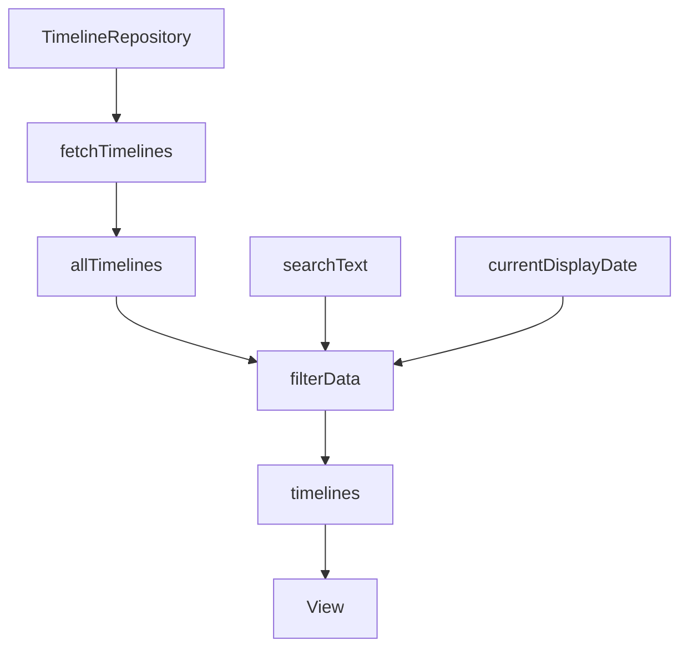
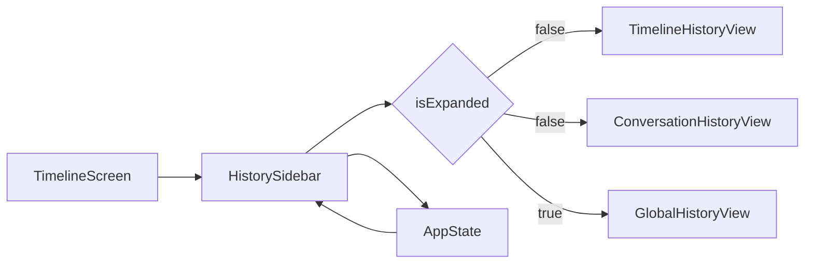
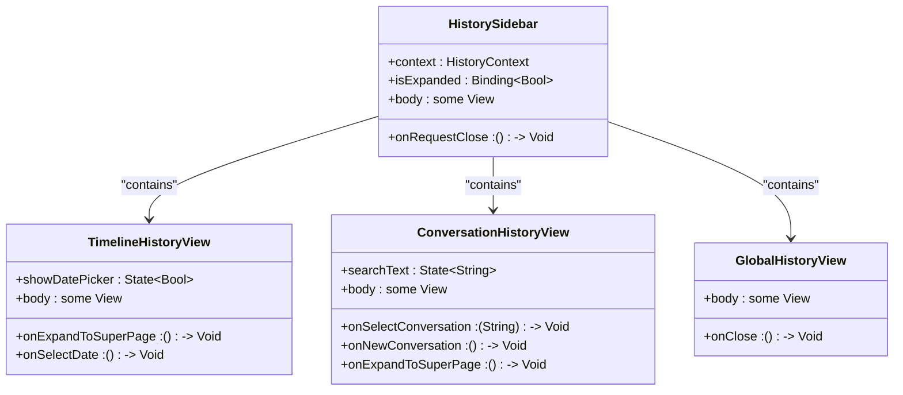
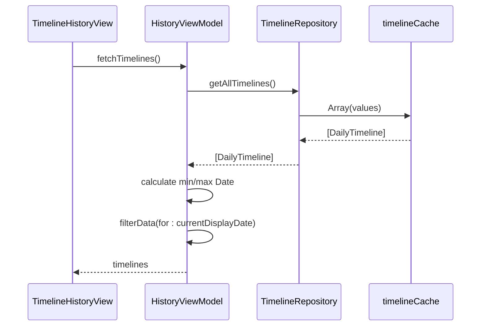

# 历史记录功能

<cite>
**本文档引用文件**   
- [HistoryViewModel.swift](file://guanji0.34/Features/History/HistoryViewModel.swift)
- [HistorySidebar.swift](file://guanji0.34/Features/History/HistorySidebar.swift)
- [TimelineHistoryView.swift](file://guanji0.34/Features/History/Views/TimelineHistoryView.swift)
- [ConversationHistoryView.swift](file://guanji0.34/Features/History/Views/ConversationHistoryView.swift)
- [GlobalHistoryView.swift](file://guanji0.34/Features/History/Views/GlobalHistoryView.swift)
- [YearMonthPickerSheet.swift](file://guanji0.34/Features/History/Views/YearMonthPickerSheet.swift)
- [TimelineRepository.swift](file://guanji0.34/DataLayer/Repositories/TimelineRepository.swift)
- [AIConversationRepository.swift](file://guanji0.34/DataLayer/Repositories/AIConversationRepository.swift)
- [DailyTimeline.swift](file://guanji0.34/Core/Models/DailyTimeline.swift)
- [AIConversationModels.swift](file://guanji0.34/Core/Models/AIConversationModels.swift)
- [AppState.swift](file://guanji0.34/App/AppState.swift)
- [DateUtilities.swift](file://guanji0.34/Core/Utilities/DateUtilities.swift)
- [history.md](file://Docs/features/history.md)
</cite>

## 目录
1. [架构设计与用户交互逻辑](#架构设计与用户交互逻辑)
2. [HistoryViewModel数据组织机制](#historyviewmodel数据组织机制)
3. [HistorySidebar导航结构](#historysidebar导航结构)
4. [三种视图模式解析](#三种视图模式解析)
5. [YearMonthPickerSheet时间选择](#yearmonthpickersheet时间选择)
6. [数据查询与分页策略](#数据查询与分页策略)
7. [性能优化建议](#性能优化建议)

## 架构设计与用户交互逻辑

历史记录功能采用MVVM架构模式，通过`HistorySidebar`作为容器组件管理不同模式下的历史视图展示。系统根据`AppState.currentMode`状态自动切换显示内容：在时间轴模式下显示`TimelineHistoryView`，在AI模式下显示`ConversationHistoryView`。用户可通过右滑手势或点击展开按钮进入全屏的`GlobalHistoryView`，实现从侧边栏到超级页面的平滑过渡。

该功能的核心交互流程包括：模式感知、月份筛选、全局搜索和日期跳转。`HistoryViewModel`负责管理时间轴历史数据，而`ConversationHistoryViewModel`则专门处理AI对话历史。两个视图模型分别从`TimelineRepository`和`AIConversationRepository`获取数据，确保数据访问的单一职责。

**Section sources**
- [HistorySidebar.swift](file://guanji0.34/Features/History/HistorySidebar.swift#L1-L71)
- [history.md](file://Docs/features/history.md#L1-L234)

## HistoryViewModel数据组织机制

`HistoryViewModel`采用三层数据结构管理历史记录：`allTimelines`存储所有时间轴数据，`timelines`保存当前月份的过滤结果，`currentDisplayDate`记录当前显示的月份。初始化时，通过`TimelineRepository.shared.getAllTimelines()`获取全部数据，并计算数据的时间范围`minDate`和`maxDate`。

数据过滤采用双重维度：首先按年月筛选，然后根据是否为当前月份应用不同的排序策略。对于当前月份采用降序排列（新→旧），对于历史月份则采用升序排列（旧→新），这种智能排序策略优化了用户的浏览体验。



**Diagram sources**
- [HistoryViewModel.swift](file://guanji0.34/Features/History/HistoryViewModel.swift#L1-L82)
- [TimelineRepository.swift](file://guanji0.34/DataLayer/Repositories/TimelineRepository.swift#L1-L207)

**Section sources**
- [HistoryViewModel.swift](file://guanji0.34/Features/History/HistoryViewModel.swift#L1-L82)
- [TimelineRepository.swift](file://guanji0.34/DataLayer/Repositories/TimelineRepository.swift#L1-L207)

## HistorySidebar导航结构

`HistorySidebar`作为历史功能的入口容器，通过`@Binding var isExpanded`管理侧边栏的展开状态。当`isExpanded`为`true`时显示`GlobalHistoryView`，否则根据`appState.currentMode`显示相应的侧边栏内容。这种设计实现了单入口多模式的导航架构。

状态同步机制依赖于`AppState`全局状态管理器，通过`@EnvironmentObject`注入。`onExpandToSuperPage`回调触发展开动画，使用`spring`弹性动画提供流畅的视觉反馈。侧边栏支持右滑手势展开，增强了交互的自然性。



**Diagram sources**
- [HistorySidebar.swift](file://guanji0.34/Features/History/HistorySidebar.swift#L1-L71)
- [AppState.swift](file://guanji0.34/App/AppState.swift#L1-L52)

**Section sources**
- [HistorySidebar.swift](file://guanji0.34/Features/History/HistorySidebar.swift#L1-L71)
- [AppState.swift](file://guanji0.34/App/AppState.swift#L1-L52)

## 三种视图模式解析

### TimelineHistoryView

`TimelineHistoryView`专用于时间轴历史浏览，显示按日期组织的过往记录。每个日期卡片展示日期、标题（或首段文字）、标签图标等信息。支持搜索过滤和点击跳转，通过`onSelectDate`回调更新`appState.selectedDate`。

### ConversationHistoryView

`ConversationHistoryView`针对AI对话历史设计，将对话按天分组显示。每个对话卡片包含标题、预览文本、更新时间和关联天数等信息。支持新建对话、选择对话和展开到全屏等操作，满足AI交互场景的需求。

### GlobalHistoryView

`GlobalHistoryView`作为"超级页面"提供全局历史浏览功能。包含统计卡片和完整的历史列表，支持跨时间范围的搜索。该视图独立于当前模式，为用户提供统一的历史访问入口。



**Diagram sources**
- [TimelineHistoryView.swift](file://guanji0.34/Features/History/Views/TimelineHistoryView.swift#L1-L187)
- [ConversationHistoryView.swift](file://guanji0.34/Features/History/Views/ConversationHistoryView.swift#L1-L311)
- [GlobalHistoryView.swift](file://guanji0.34/Features/History/Views/GlobalHistoryView.swift#L1-L150)

**Section sources**
- [TimelineHistoryView.swift](file://guanji0.34/Features/History/Views/TimelineHistoryView.swift#L1-L187)
- [ConversationHistoryView.swift](file://guanji0.34/Features/History/Views/ConversationHistoryView.swift#L1-L311)
- [GlobalHistoryView.swift](file://guanji0.34/Features/History/Views/GlobalHistoryView.swift#L1-L150)

## YearMonthPickerSheet时间选择

`YearMonthPickerSheet`实现高效的时间范围选择，采用`Picker`组件的滚轮样式提供直观的年月选择界面。年份范围根据数据的`minDate`和`maxDate`动态生成，确保选择范围的合理性。

组件通过`@Binding var selectedDate`与父视图同步状态，选择完成后调用`onSelect`回调。采用`.presentationDetents([.height(300)])`设置合适的展示高度，优化了弹窗的用户体验。月份显示使用系统本地化的月份名称，确保国际化支持。

```mermaid
flowchart TD
A[YearMonthPickerSheet] --> B[years]
A --> C[months]
B --> D[generateYears]
C --> E[Calendar.current.monthSymbols]
D --> F[Array(startYear...endYear)]
F --> G[reversed]
H[selectedYear] --> I[State~Int~]
J[selectedMonthIndex] --> K[State~Int~]
L[onSelect] --> M[create Date]
M --> N[dismiss]
```

**Diagram sources**
- [YearMonthPickerSheet.swift](file://guanji0.34/Features/History/Views/YearMonthPickerSheet.swift#L1-L97)
- [DateUtilities.swift](file://guanji0.34/Core/Utilities/DateUtilities.swift#L1-L55)

**Section sources**
- [YearMonthPickerSheet.swift](file://guanji0.34/Features/History/Views/YearMonthPickerSheet.swift#L1-L97)
- [DateUtilities.swift](file://guanji0.34/Core/Utilities/DateUtilities.swift#L1-L55)

## 数据查询与分页策略

历史数据查询通过`TimelineRepository`和`AIConversationRepository`两个数据仓库实现。`TimelineRepository.getAllTimelines()`返回所有时间轴数据，按日期降序排列；`AIConversationRepository.getConversationsGroupedByDay()`返回按天分组的对话数据。

分页策略采用全量加载而非分页加载，因为历史记录数据量通常不会过大。通过`HistoryViewModel`的`filterData`方法实现客户端过滤，结合`LazyVStack`实现列表的懒加载，平衡了性能和用户体验。搜索功能在内存中进行，通过`filter`操作实现快速检索。



**Diagram sources**
- [TimelineRepository.swift](file://guanji0.34/DataLayer/Repositories/TimelineRepository.swift#L1-L207)
- [AIConversationRepository.swift](file://guanji0.34/DataLayer/Repositories/AIConversationRepository.swift#L1-L201)

**Section sources**
- [TimelineRepository.swift](file://guanji0.34/DataLayer/Repositories/TimelineRepository.swift#L1-L207)
- [AIConversationRepository.swift](file://guanji0.34/DataLayer/Repositories/AIConversationRepository.swift#L1-L201)

## 性能优化建议

### 时间索引建立

建议在`DailyTimeline`模型中增加时间索引字段，如`yearMonth`（格式：YYYYMM），避免每次过滤时都进行日期解析。可修改`TimelineRepository`的内存缓存结构为`[String: [DailyTimeline]]`，以年月为键组织数据。

### 懒加载阈值设置

当前使用`LazyVStack`已实现基本的懒加载，可进一步优化阈值。建议设置`LazyVStack(spacing: 12, pinnedViews: .sectionHeaders)`并控制预加载数量，减少内存占用。

### 内存缓存策略

`TimelineRepository`和`AIConversationRepository`均已实现内存缓存，但可增加缓存淘汰机制。建议实现LRU（最近最少使用）缓存策略，限制缓存大小，防止内存溢出。

### 搜索性能优化

当前搜索在每次输入变化时重新过滤，可增加防抖机制。建议使用`DispatchQueue.main.asyncAfter`延迟搜索操作，避免频繁的UI更新。

### 数据持久化优化

数据持久化采用JSON文件存储，对于大量数据可能影响性能。建议对`daily_timelines.json`进行分片存储，按年月拆分为多个文件，提高读写效率。

**Section sources**
- [TimelineRepository.swift](file://guanji0.34/DataLayer/Repositories/TimelineRepository.swift#L1-L207)
- [AIConversationRepository.swift](file://guanji0.34/DataLayer/Repositories/AIConversationRepository.swift#L1-L201)
- [DailyTimeline.swift](file://guanji0.34/Core/Models/DailyTimeline.swift#L1-L59)