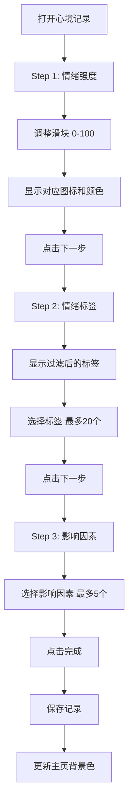
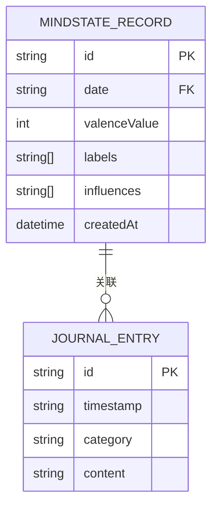
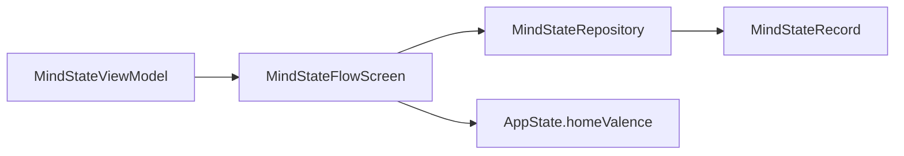
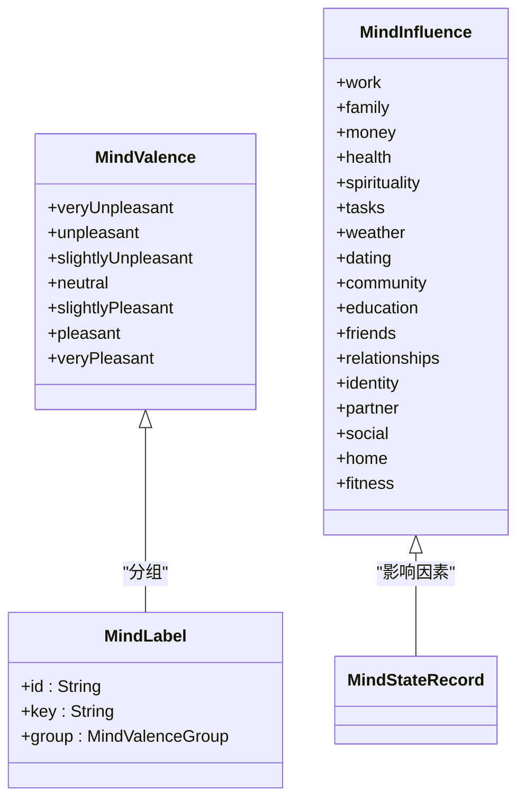

# 情绪状态功能

<cite>
**本文档引用文件**   
- [MindStateFlowScreen.swift](file://guanji0.34/Features/MindState/MindStateFlowScreen.swift)
- [MindStateViewModel.swift](file://guanji0.34/Features/MindState/MindStateViewModel.swift)
- [MindStateModels.swift](file://guanji0.34/Core/Models/MindStateModels.swift)
- [MindStateRecord.swift](file://guanji0.34/Core/Models/MindStateRecord.swift)
- [MindStateRepository.swift](file://guanji0.34/DataLayer/Repositories/MindStateRepository.swift)
- [ThickSlider.swift](file://guanji0.34/UI/Atoms/ThickSlider.swift)
- [SelectableChip.swift](file://guanji0.34/UI/Atoms/SelectableChip.swift)
- [Localizable.strings](file://guanji0.34/Resources/zh-Hans.lproj/Localizable.strings)
- [TimelineScreen.swift](file://guanji0.34/Features/Timeline/TimelineScreen.swift)
- [DailyDataExporter.swift](file://guanji0.34/Core/Utilities/DailyDataExporter.swift)
- [AppState.swift](file://guanji0.34/App/AppState.swift)
- [mind-state.md](file://Docs/features/mind-state.md)
</cite>

## 目录
1. [功能概述](#功能概述)
2. [情绪标签选择与强度滑块输入](#情绪标签选择与强度滑块输入)
3. [时间关联机制](#时间关联机制)
4. [MindStateViewModel输入验证与提交](#mindstateviewmodel输入验证与提交)
5. [MindStateFlowScreen交互流程与动画](#mindstateflowscreen交互流程与动画)
6. [情绪分类体系与本地化支持](#情绪分类体系与本地化支持)
7. [MindStateRecord数据结构与JournalEntry关联](#mindstaterecord数据结构与journalentry关联)
8. [与Timeline集成逻辑](#与timeline集成逻辑)
9. [情绪数据导出与分析API](#情绪数据导出与分析api)
10. [输入验证与提醒机制](#输入验证与提醒机制)
11. [结论](#结论)

## 功能概述

情绪状态功能提供三步式的情绪记录流程，通过情绪强度滑块、情绪标签和影响因素三个维度，帮助用户精确捕捉和标记当前的心理状态。该功能通过7级情绪强度量表、智能标签过滤和多维度影响因素分析，构建完整的心境画像。用户可以通过滑块选择情绪强度，系统自动匹配对应的情绪图标和颜色，并选择具体的情绪标签和影响因素，最终保存记录并更新主页背景色。

**Section sources**
- [mind-state.md](file://Docs/features/mind-state.md#L5-L25)

## 情绪标签选择与强度滑块输入

情绪状态功能通过三步流程引导用户完成情绪记录。第一步是情绪强度选择，用户通过滑块调整0-100的数值，系统根据数值自动匹配7级情绪强度量表。第二步是情绪标签选择，系统根据用户选择的情绪极性智能过滤显示相关标签。第三步是影响因素分析，用户可以标记影响情绪的因素。

情绪强度滑块使用`ThickSlider`组件，提供直观的视觉反馈。情绪标签使用`TagChip`组件，以胶囊形状显示可选择的标签。影响因素使用`InfluenceSection`组件，按分类分组显示可选择的因素。



**Diagram sources**
- [MindStateFlowScreen.swift](file://guanji0.34/Features/MindState/MindStateFlowScreen.swift#L14-L123)
- [mind-state.md](file://Docs/features/mind-state.md#L28-L46)

**Section sources**
- [MindStateFlowScreen.swift](file://guanji0.34/Features/MindState/MindStateFlowScreen.swift#L14-L123)
- [ThickSlider.swift](file://guanji0.34/UI/Atoms/ThickSlider.swift#L3-L50)
- [SelectableChip.swift](file://guanji0.34/UI/Atoms/SelectableChip.swift#L3-L123)

## 时间关联机制

情绪状态记录与时间紧密关联，通过`MindStateRecord`结构体中的`date`字段存储记录的日期。日期格式为"yyyy.MM.dd"，作为L1 DayIndex的关联标识。`createdAt`字段记录创建时间，提供精确的时间戳。

`MindStateRecord`结构体还包含一个计算属性`dayId`，作为`date`字段的别名，方便在其他模块中引用。这种设计确保了情绪记录能够正确地与特定日期关联，并在时间轴上准确显示。



**Diagram sources**
- [MindStateRecord.swift](file://guanji0.34/Core/Models/MindStateRecord.swift#L3-L31)

**Section sources**
- [MindStateRecord.swift](file://guanji0.34/Core/Models/MindStateRecord.swift#L3-L31)

## MindStateViewModel输入验证与提交

`MindStateViewModel`负责管理情绪值和步骤状态，根据情绪值过滤标签，处理标签和影响因素选择，并生成最终记录。视图模型通过`@Published`属性包装器暴露状态，确保UI能够响应状态变化。

输入验证主要通过以下机制实现：
- 情绪标签选择限制最多20个
- 影响因素选择限制最多5个
- 情绪强度值限制在0-100范围内

提交流程通过`finalize()`方法生成最终记录，然后通过`MindStateRepository`保存到持久化存储中。保存成功后，更新`AppState`中的`homeValence`状态，以更新主页背景色。



**Diagram sources**
- [mind-state.md](file://Docs/features/mind-state.md#L129-L135)

**Section sources**
- [MindStateViewModel.swift](file://guanji0.34/Features/MindState/MindStateViewModel.swift#L5-L80)
- [MindStateRepository.swift](file://guanji0.34/DataLayer/Repositories/MindStateRepository.swift#L3-L18)

## MindStateFlowScreen交互流程与动画

`MindStateFlowScreen`是三步流程的主视图，负责管理导航、动态调整UI颜色和处理保存取消操作。屏幕使用`NavigationStack`实现导航，通过`switch`语句根据当前步骤显示不同的内容。

交互流程包括：
1. 第一步：情绪强度选择，显示滑块和对应图标
2. 第二步：情绪标签选择，显示过滤后的标签网格
3. 第三步：影响因素选择，显示分类分组的影响因素

状态过渡动画通过`withAnimation`实现，当用户点击下一步或上一步时，平滑地过渡到下一个步骤。完成记录后，通过`onClose`回调关闭屏幕。

**Section sources**
- [MindStateFlowScreen.swift](file://guanji0.34/Features/MindState/MindStateFlowScreen.swift#L14-L123)

## 情绪分类体系与本地化支持

情绪分类体系由`MindValence`枚举定义，包含7个情绪等级：非常不愉快、不愉快、略不愉快、中性、略愉快、愉快、非常愉快。每个等级对应特定的值范围、图标和颜色。

情绪标签由`MindCatalog.labels`静态数组定义，包含各种情绪标签，如"愤怒"、"焦虑"、"平静"、"快乐"等。标签根据情绪极性分组，确保在选择特定情绪强度时只显示相关标签。

本地化支持通过`Localization.tr()`函数实现，从`Localizable.strings`文件中获取对应语言的文本。系统支持多种语言，包括中文（简体）、中文（繁体）、英语、日语等。



**Diagram sources**
- [MindStateModels.swift](file://guanji0.34/Core/Models/MindStateModels.swift#L3-L84)

**Section sources**
- [MindStateModels.swift](file://guanji0.34/Core/Models/MindStateModels.swift#L3-L96)
- [Localizable.strings](file://guanji0.34/Resources/zh-Hans.lproj/Localizable.strings#L213-L285)

## MindStateRecord数据结构与JournalEntry关联

`MindStateRecord`结构体定义了情绪记录的数据结构，包含以下字段：
- `id`: 记录的唯一标识符
- `date`: 记录的日期，格式为"yyyy.MM.dd"
- `valenceValue`: 情绪强度值，范围0-100
- `labels`: 情绪标签数组
- `influences`: 影响因素数组
- `createdAt`: 记录创建时间

`JournalEntry`结构体定义了日记条目的数据结构，包含内容、时间戳、类别等字段。情绪记录与日记条目通过日期关联，可以在时间轴上显示对应的情绪状态。

**Section sources**
- [MindStateRecord.swift](file://guanji0.34/Core/Models/MindStateRecord.swift#L3-L31)
- [JournalEntry.swift](file://guanji0.34/Core/Models/JournalEntry.swift#L42-L61)

## 与Timeline集成逻辑

情绪状态记录与时间轴集成，确保情绪标记能正确反映在时间线上。`TimelineScreen`通过`AppState`中的`showMindState`状态控制是否显示情绪记录界面。当用户完成情绪记录后，`TimelineViewModel`会更新时间轴显示。

集成逻辑包括：
1. 通过`AppState.homeValence`更新主页背景色
2. 在时间轴上显示当天的情绪记录摘要
3. 通过`MindStateRepository`加载特定日期的情绪记录

**Section sources**
- [TimelineScreen.swift](file://guanji0.34/Features/Timeline/TimelineScreen.swift#L7-L14)
- [AppState.swift](file://guanji0.34/App/AppState.swift#L15-L15)

## 情绪数据导出与分析API

情绪数据导出功能通过`DailyDataExporter`类实现，可以将情绪记录导出为Markdown格式。导出内容包括情绪值、标签、影响因素和记录时间。

分析API提供以下功能：
- 按日期范围查询情绪记录
- 统计情绪标签使用频率
- 分析情绪变化趋势
- 生成情绪报告

```swift
// 情绪数据导出示例
private static func exportMindStates(_ mindStates: [MindStateRecord]) -> String {
    var output = "## 🧠 心境记录 Mind State Records\n\n"
    
    for state in mindStates {
        output += "**情绪值 Valence**: \(state.valenceValue)\n"
        
        if !state.labels.isEmpty {
            output += "**标签 Labels**: \(state.labels.joined(separator: ", "))\n"
        }
        
        if !state.influences.isEmpty {
            output += "**影响因素 Influences**: \(state.influences.joined(separator: ", "))\n"
        }
        
        output += "**记录时间 Recorded**: \(formatDateTime(state.createdAt))\n\n"
    }
    
    output += "\n"
    return output
}
```

**Section sources**
- [DailyDataExporter.swift](file://guanji0.34/Core/Utilities/DailyDataExporter.swift#L230-L248)

## 输入验证与提醒机制

为防止情绪标签混乱和记录遗漏，系统实现了以下输入验证与提醒机制：

1. **输入验证**：
   - 限制情绪标签最多选择20个
   - 限制影响因素最多选择5个
   - 情绪强度值必须在0-100范围内

2. **提醒机制**：
   - 当用户长时间未记录情绪时，发送提醒通知
   - 在每日总结中提示未完成的情绪记录
   - 通过`AppState`管理提醒状态，避免重复提醒

这些机制确保了情绪记录的完整性和一致性，帮助用户养成定期记录情绪的习惯。

**Section sources**
- [MindStateViewModel.swift](file://guanji0.34/Features/MindState/MindStateViewModel.swift#L12-L13)
- [MindStateViewModel.swift](file://guanji0.34/Features/MindState/MindStateViewModel.swift#L50-L64)

## 结论

情绪状态功能通过三步式流程、7级情绪强度量表、智能标签过滤和多维度影响因素分析，为用户提供了一套完整的情绪记录解决方案。功能实现了与时间轴的深度集成，确保情绪标记能正确反映在时间线上。通过`MindStateViewModel`的输入验证和`MindStateRepository`的持久化存储，保证了数据的完整性和一致性。本地化支持和数据导出功能进一步提升了用户体验。建议的输入验证与提醒机制有助于防止情绪标签混乱和记录遗漏，帮助用户更好地理解和管理自己的情绪状态。