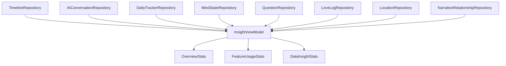
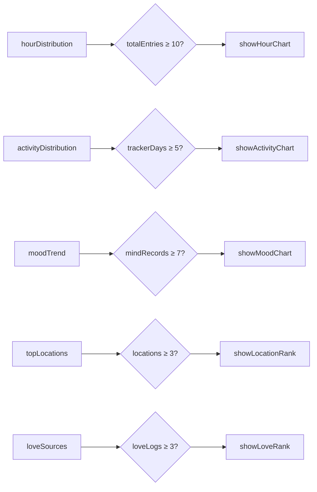
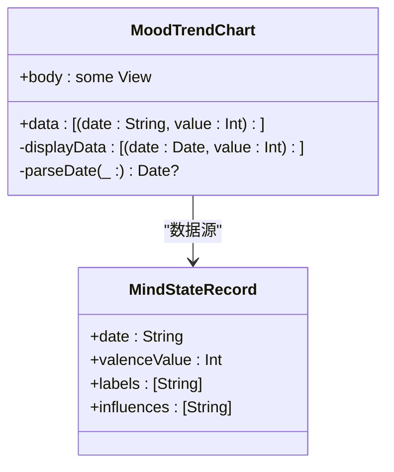
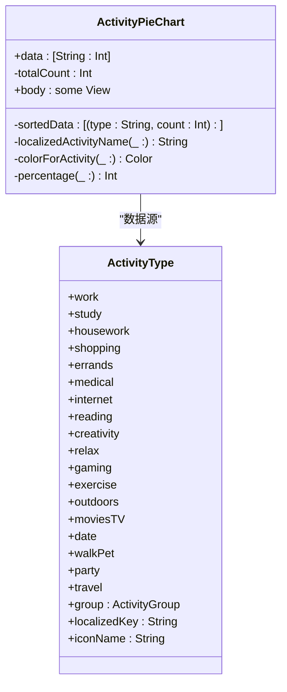
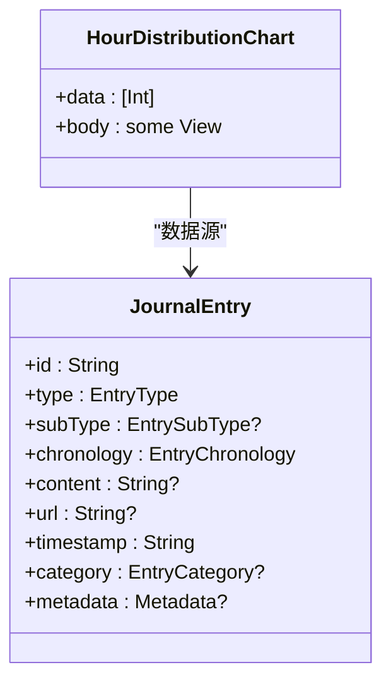
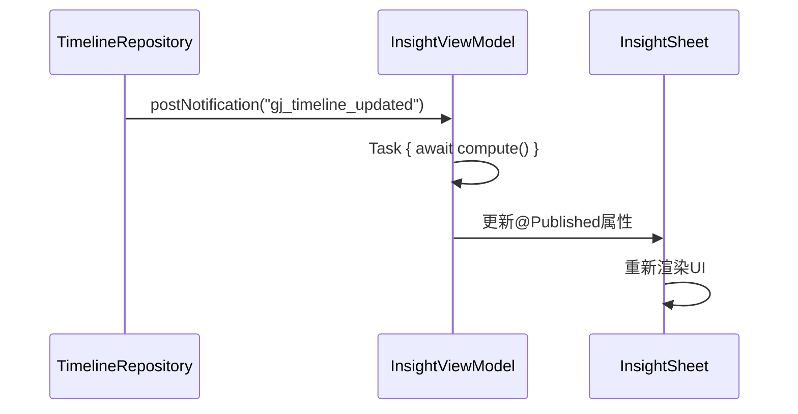

# 数据洞察功能

<cite>
**本文档引用的文件**  
- [InsightViewModel.swift](file://guanji0.34/Features/Insight/InsightViewModel.swift)
- [InsightSheet.swift](file://guanji0.34/Features/Insight/InsightSheet.swift)
- [OverviewSection.swift](file://guanji0.34/Features/Insight/Views/OverviewSection.swift)
- [FeatureUsageSection.swift](file://guanji0.34/Features/Insight/Views/FeatureUsageSection.swift)
- [DataInsightSection.swift](file://guanji0.34/Features/Insight/Views/DataInsightSection.swift)
- [MoodTrendChart.swift](file://guanji0.34/Features/Insight/Views/Charts/MoodTrendChart.swift)
- [ActivityPieChart.swift](file://guanji0.34/Features/Insight/Views/Charts/ActivityPieChart.swift)
- [HourDistributionChart.swift](file://guanji0.34/Features/Insight/Views/Charts/HourDistributionChart.swift)
- [InsightModels.swift](file://guanji0.34/Core/Models/InsightModels.swift)
- [DailyTrackerModels.swift](file://guanji0.34/Core/Models/DailyTrackerModels.swift)
- [MindStateModels.swift](file://guanji0.34/Core/Models/MindStateModels.swift)
- [JournalEntry.swift](file://guanji0.34/Core/Models/JournalEntry.swift)
- [ChartAtoms.swift](file://guanji0.34/UI/Atoms/ChartAtoms.swift)
- [insight.md](file://Docs/features/insight.md)
</cite>

## 目录
1. [简介](#简介)
2. [数据聚合与统计计算](#数据聚合与统计计算)
3. [可视化图表实现原理](#可视化图表实现原理)
4. [信息层级与交互逻辑](#信息层级与交互逻辑)
5. [性能优化策略](#性能优化策略)
6. [扩展新图表类型指南](#扩展新图表类型指南)
7. [常见问题与解决方案](#常见问题与解决方案)
8. [结论](#结论)

## 简介

数据洞察功能是应用程序的核心分析模块，通过三个层级的可视化区域展示用户的记录行为、功能使用情况和深层数据模式。该功能采用MVVM架构模式，以`InsightViewModel`为核心，聚合来自时间线、情绪记录、AI交互等多源数据，生成统计结果并驱动UI展示。系统根据数据量自动控制各区域的显示状态，确保用户体验的连贯性和信息的相关性。

**Section sources**
- [InsightSheet.swift](file://guanji0.34/Features/Insight/InsightSheet.swift#L3-L7)
- [InsightViewModel.swift](file://guanji0.34/Features/Insight/InsightViewModel.swift#L4-L25)

## 数据聚合与统计计算

### InsightViewModel数据聚合机制

`InsightViewModel`作为数据聚合中心，通过异步计算任务从多个数据仓库获取原始数据，并将其转换为三个层级的统计模型：`OverviewStats`（概览统计）、`FeatureUsageStats`（功能使用统计）和`DataInsightStats`（数据洞察统计）。计算过程在后台线程执行，避免阻塞主线程，完成后在主队列更新UI状态。



**Diagram sources**
- [insight.md](file://Docs/features/insight.md#L186-L196)
- [InsightViewModel.swift](file://guanji0.34/Features/Insight/InsightViewModel.swift#L57-L76)

### 概览统计计算

概览区域始终显示，包含连续记录天数（streak）、总记录天数、总条目数和总字数四个核心指标。这些数据直接从`TimelineRepository`获取，通过遍历所有时间线数据进行聚合计算。

| 指标 | 数据来源 | 计算逻辑 |
|------|----------|----------|
| streak | DailyTimeline | 从今天向前遍历，有 JournalEntry 则计入 |
| totalDays | DailyTimeline | 统计所有包含 JournalEntry 的天数 |
| totalEntries | JournalEntry | 统计所有 Scene/Journey 中的 JournalEntry 总数 |
| totalWords | JournalEntry.content | 累加所有 content 的字符数 |

```swift
struct OverviewStats {
    let streak: Int           // 连续天数
    let totalDays: Int        // 总天数
    let totalEntries: Int     // 总条目
    let totalWords: Int       // 总字数
}
```

**Section sources**
- [InsightModels.swift](file://guanji0.34/Core/Models/InsightModels.swift#L5-L20)
- [InsightViewModel.swift](file://guanji0.34/Features/Insight/InsightViewModel.swift#L168-L284)

### 功能使用统计

功能使用区域根据用户是否使用过相关功能来决定是否显示。统计包括AI对话次数、每日追踪天数、心情记录次数、时光胶囊数量、爱心日志数量和关系数量。当任一功能有使用记录时，整个区域才会显示。

```swift
public var hasAnyData: Bool {
    return aiConversations > 0 ||
           trackerDays > 0 ||
           mindRecords > 0 ||
           capsuleTotal > 0 ||
           loveLogCount > 0 ||
           relationshipCount > 0
}
```

**Section sources**
- [InsightModels.swift](file://guanji0.34/Core/Models/InsightModels.swift#L24-L66)
- [InsightViewModel.swift](file://guanji0.34/Features/Insight/InsightViewModel.swift#L302-L392)

### 数据洞察统计

数据洞察区域根据预设阈值决定是否显示特定图表。系统通过`updateZone3Visibility`方法检查各数据集是否达到显示门槛，如情绪记录需≥7条才显示情绪趋势图。



**Diagram sources**
- [InsightViewModel.swift](file://guanji0.34/Features/Insight/InsightViewModel.swift#L569-L589)
- [InsightModels.swift](file://guanji0.34/Core/Models/InsightModels.swift#L98-L104)

## 可视化图表实现原理

### MoodTrendChart情绪趋势图

`MoodTrendChart`使用SwiftUI Charts框架绘制情绪随时间变化的趋势线。数据源为`MindStateRecord.valenceValue`，按日期排序后通过`LineMark`和`AreaMark`组合展示趋势和面积填充效果。



**Diagram sources**
- [MoodTrendChart.swift](file://guanji0.34/Features/Insight/Views/Charts/MoodTrendChart.swift#L6-L103)
- [MindStateModels.swift](file://guanji0.34/Core/Models/MindStateModels.swift#L1-L47)

### ActivityPieChart活动占比图

`ActivityPieChart`使用`SectorMark`绘制环形图展示活动类型分布。对于iOS 17+设备显示环形图，iOS 16则降级为水平条形图。活动类型来自`DailyTrackerRecord.activities`，通过`ActivityType`枚举的`group`属性进行颜色分类。



**Diagram sources**
- [ActivityPieChart.swift](file://guanji0.34/Features/Insight/Views/Charts/ActivityPieChart.swift#L6-L120)
- [DailyTrackerModels.swift](file://guanji0.34/Core/Models/DailyTrackerModels.swift#L138-L198)

### HourDistributionChart每日行为分布图

`HourDistributionChart`使用`BarMark`绘制24小时柱状图，展示用户在一天中各时段的记录活跃度。数据源为`JournalEntry.timestamp`的小时部分，通过遍历所有时间线条目进行统计。



**Diagram sources**
- [HourDistributionChart.swift](file://guanji0.34/Features/Insight/Views/Charts/HourDistributionChart.swift#L6-L44)
- [JournalEntry.swift](file://guanji0.34/Core/Models/JournalEntry.swift#L42-L61)

## 信息层级与交互逻辑

### 三区布局架构

数据洞察功能采用三区布局架构，各区域具有不同的显示策略：

1. **Zone 1: 概览区域** - 始终显示
2. **Zone 2: 功能使用区域** - 当任一功能有使用记录时显示
3. **Zone 3: 数据洞察区域** - 当特定数据达到阈值时显示相应图表

```swift
// InsightSheet.swift
OverviewSection(stats: vm.overview)  // 始终显示
if vm.showZone2 { FeatureUsageSection(stats: vm.featureUsage) }  // 条件显示
if vm.showZone3 { DataInsightSection(...) }  // 条件显示
```

**Section sources**
- [InsightSheet.swift](file://guanji0.34/Features/Insight/InsightSheet.swift#L33-L51)
- [InsightViewModel.swift](file://guanji0.34/Features/Insight/InsightViewModel.swift#L10-L25)

### 组件交互流程

各组件通过`@StateObject`和`@Published`属性进行数据绑定，形成响应式更新链。当数据源发生变化时，通过`NotificationCenter`通知`InsightViewModel`重新计算统计结果。



**Diagram sources**
- [InsightViewModel.swift](file://guanji0.34/Features/Insight/InsightViewModel.swift#L126-L163)
- [InsightSheet.swift](file://guanji0.34/Features/Insight/InsightSheet.swift#L8)

## 性能优化策略

### 异步计算与线程管理

`InsightViewModel`使用`Task.detached`在后台线程执行计算任务，避免阻塞主线程。计算完成后通过主队列更新UI状态，确保界面流畅。

```swift
let computedData = await Task.detached(priority: .userInitiated) { [weak self] () -> (OverviewStats, FeatureUsageStats, DataInsightStats) in
    // 后台计算
}.value

// 主线程更新UI
overview = computedData.0
featureUsage = computedData.1
dataInsight = computedData.2
```

**Section sources**
- [InsightViewModel.swift](file://guanji0.34/Features/Insight/InsightViewModel.swift#L61-L83)

### 数据采样与缓存

系统通过`MockDataService`进行数据采样，仅处理最近的几个日期（今天、昨天、三天前、一年前、两年前），避免全量数据计算带来的性能开销。

```swift
let allDates = [ChronologyAnchor.TODAY_DATE, ChronologyAnchor.YESTERDAY_DATE, ChronologyAnchor.THREE_DAYS_AGO, ChronologyAnchor.ONE_YEAR_AGO_DATE, ChronologyAnchor.TWO_YEARS_AGO_DATE]
```

**Section sources**
- [InsightViewModel.swift](file://guanji0.34/Features/Insight/InsightViewModel.swift#L88-L108)

### 条件渲染与懒加载

通过条件渲染机制，仅在数据达到阈值时才显示相应图表，减少不必要的UI渲染。同时使用`LazyVGrid`等懒加载容器优化列表性能。

```swift
if showHourChart { HourDistributionChartView(...) }
if showActivityChart { ActivityDistributionChartView(...) }
if showMoodChart { MoodTrendChartView(...) }
```

**Section sources**
- [DataInsightSection.swift](file://guanji0.34/Features/Insight/Views/DataInsightSection.swift#L22-L44)

## 扩展新图表类型指南

### 创建新图表组件

要扩展新图表类型，需遵循以下步骤：

1. 创建新的SwiftUI View组件，遵循`Chart`框架规范
2. 在`DataInsightStats`中添加相应数据字段
3. 在`InsightViewModel`中实现数据计算逻辑
4. 在`DataInsightSection`中添加条件渲染逻辑

```swift
// 示例：添加新的SleepTrendChart
struct SleepTrendChart: View {
    let data: [(date: String, hours: Double)]
    var body: some View { /* Chart implementation */ }
}
```

### 数据绑定规范

新图表的数据源应通过`DataInsightStats`结构体传递，确保数据流的统一性和可预测性。避免直接访问数据仓库，保持MVVM架构的清晰边界。

```swift
struct DataInsightStats {
    public let hourDistribution: [Int]
    public let activityDistribution: [String: Int]
    public let moodTrend: [(date: String, value: Int)]
    public let topLocations: [(name: String, count: Int)]
    public let loveSources: [(name: String, count: Int)]
    // 添加新字段
    public let sleepTrend: [(date: String, hours: Double)]
}
```

**Section sources**
- [InsightModels.swift](file://guanji0.34/Core/Models/InsightModels.swift#L70-L93)
- [DataInsightSection.swift](file://guanji0.34/Features/Insight/Views/DataInsightSection.swift#L7-L13)

## 常见问题与解决方案

### 图表渲染模糊问题

**问题原因**：图表在高DPI屏幕上渲染时可能出现模糊。

**解决方案**：
1. 确保图表容器使用合适的frame尺寸
2. 避免对图表进行缩放变换
3. 使用矢量图形而非位图

```swift
Chart(data) { /* ... */ }
    .frame(height: 200) // 使用固定高度而非比例
```

### 数据延迟更新问题

**问题原因**：数据源更新后，图表未能及时刷新。

**解决方案**：
1. 确保`InsightViewModel`正确订阅所有相关通知
2. 检查`NotificationCenter`的观察者是否被意外释放
3. 在调试模式下验证通知是否正常发送

```swift
// 确保在setupNotifications中订阅所有相关通知
NotificationCenter.default.publisher(for: Notification.Name("gj_timeline_updated"))
    .sink { [weak self] _ in
        Task { await self?.compute() }
    }
    .store(in: &cancellables)
```

**Section sources**
- [InsightViewModel.swift](file://guanji0.34/Features/Insight/InsightViewModel.swift#L126-L163)
- [InsightSheet.swift](file://guanji0.34/Features/Insight/InsightSheet.swift#L8)

## 结论

数据洞察功能通过精心设计的三区架构，实现了从基础统计到深层分析的渐进式信息展示。系统采用MVVM模式分离关注点，通过异步计算和条件渲染优化性能，确保在不同数据量下都能提供流畅的用户体验。图表组件遵循统一的设计规范，便于扩展和维护。未来可进一步优化数据采样策略，引入更智能的阈值判断算法，提升洞察的准确性和实用性。