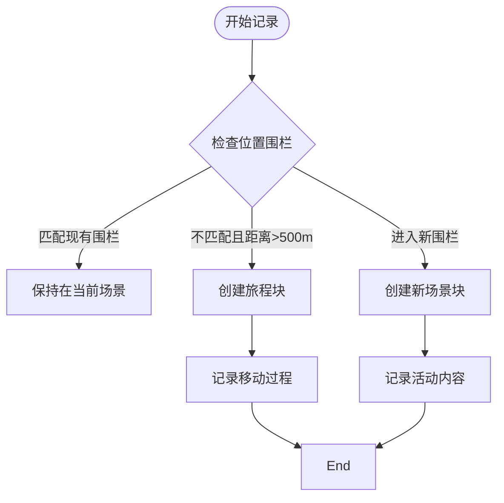
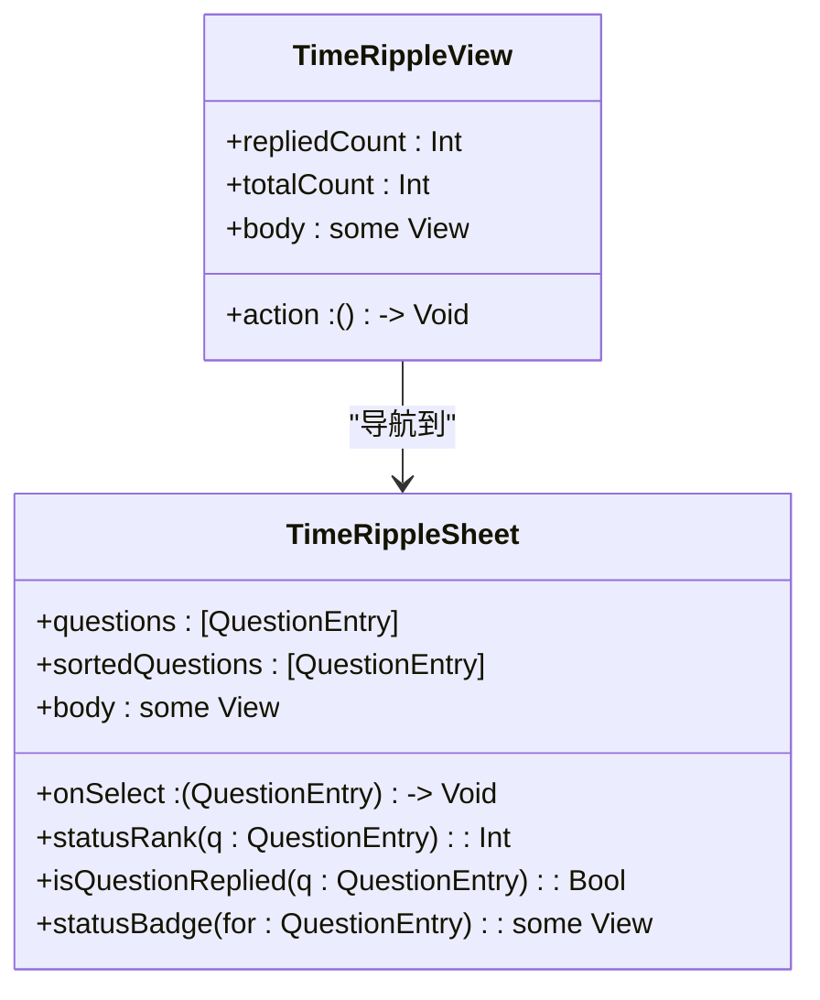
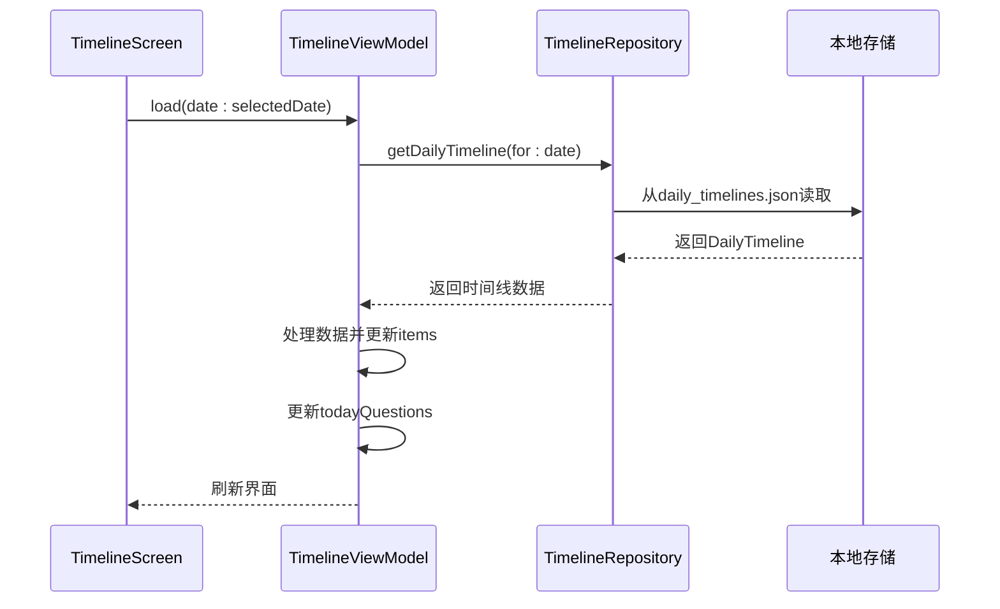
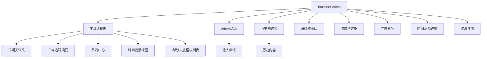

# 时间线功能

<cite>
**本文档引用的文件**  
- [TimelineScreen.swift](file://guanji0.34/Features/Timeline/TimelineScreen.swift)
- [TimelineViewModel.swift](file://guanji0.34/Features/Timeline/TimelineViewModel.swift)
- [CapsuleDetailSheet.swift](file://guanji0.34/Features/Timeline/Views/CapsuleDetailSheet.swift)
- [TimeRippleSheet.swift](file://guanji0.34/Features/Timeline/Views/TimeRippleSheet.swift)
- [TimeRippleView.swift](file://guanji0.34/Features/Timeline/Views/TimeRippleView.swift)
- [SceneBlock.swift](file://guanji0.34/UI/Organisms/SceneBlock.swift)
- [JourneyBlock.swift](file://guanji0.34/UI/Organisms/JourneyBlock.swift)
- [TimelineRepository.swift](file://guanji0.34/DataLayer/Repositories/TimelineRepository.swift)
- [AppState.swift](file://guanji0.34/App/AppState.swift)
- [DailyTimeline.swift](file://guanji0.34/Core/Models/DailyTimeline.swift)
- [JournalEntry.swift](file://guanji0.34/Core/Models/JournalEntry.swift)
- [MindStateRecord.swift](file://guanji0.34/Core/Models/MindStateRecord.swift)
- [SceneHeader.swift](file://guanji0.34/UI/Molecules/SceneHeader.swift)
- [JourneyHeaderChip.swift](file://guanji0.34/UI/Molecules/JourneyHeaderChip.swift)
</cite>

## 目录
1. [简介](#简介)
2. [核心组件](#核心组件)
3. [场景块与旅程块](#场景块与旅程块)
4. [时间涟漪组件](#时间涟漪组件)
5. [胶囊详情页](#胶囊详情页)
6. [数据流与状态管理](#数据流与状态管理)
7. [主界面布局与导航](#主界面布局与导航)
8. [性能优化与问题解决方案](#性能优化与问题解决方案)
9. [结论](#结论)

## 简介
时间线功能作为应用的核心信息流，通过场景块（SceneBlock）和旅程块（JourneyBlock）的智能生成，构建了用户日常生活的可视化叙事。该功能结合地理位置感知、时间密度分析和情感共鸣可视化，为用户提供了一个动态且富有洞察力的信息展示平台。时间线不仅记录用户的输入内容，还通过时间涟漪（TimeRipple）组件展示时间胶囊的交互状态，形成一个完整的记忆闭环。

## 核心组件

时间线功能的核心由多个协同工作的组件构成。`TimelineScreen`作为主视图，负责整体布局和用户交互；`TimelineViewModel`作为数据中枢，管理时间线的数据加载、刷新和状态更新；`TimelineRepository`作为数据持久层，负责数据的存储和检索。这些组件通过MVVM架构模式紧密协作，确保了数据的一致性和界面的响应性。

**本节来源**
- [TimelineScreen.swift](file://guanji0.34/Features/Timeline/TimelineScreen.swift#L3-L475)
- [TimelineViewModel.swift](file://guanji0.34/Features/Timeline/TimelineViewModel.swift#L5-L1005)
- [TimelineRepository.swift](file://guanji0.34/DataLayer/Repositories/TimelineRepository.swift#L3-L207)

## 场景块与旅程块

### 生成逻辑
场景块和旅程块的生成基于用户的地理位置变化和时间间隔。当用户处于一个固定位置时，系统创建场景块；当检测到用户移动时，系统创建旅程块。这种智能分组机制通过`shouldCreateNewBlock`方法实现，该方法综合考虑地理位置围栏匹配、距离阈值（500米）和时间因素来决定是否创建新的信息块。

**图表来源**
- [TimelineViewModel.swift](file://guanji0.34/Features/Timeline/TimelineViewModel.swift#L200-L224)
- [SceneBlock.swift](file://guanji0.34/UI/Organisms/SceneBlock.swift#L3-L115)
- [JourneyBlock.swift](file://guanji0.34/UI/Organisms/JourneyBlock.swift#L3-L137)

### 视觉区分与交互行为
场景块通过`SceneHeader`组件展示位置名称和图标，提供位置编辑功能；旅程块通过`JourneyHeaderChip`组件展示交通方式和目的地信息。两者都支持条目编辑、分类标记和删除操作，但仅限于当天的内容。这种设计既保证了信息的可管理性，又防止了历史数据被意外修改。

**本节来源**
- [SceneBlock.swift](file://guanji0.34/UI/Organisms/SceneBlock.swift#L30-L114)
- [JourneyBlock.swift](file://guanji0.34/UI/Organisms/JourneyBlock.swift#L30-L39)
- [SceneHeader.swift](file://guanji0.34/UI/Molecules/SceneHeader.swift)
- [JourneyHeaderChip.swift](file://guanji0.34/UI/Molecules/JourneyHeaderChip.swift)

## 时间涟漪组件

### 可视化时间密度与情感共鸣
时间涟漪组件通过`TimeRippleView`和`TimeRippleSheet`两个部分实现。`TimeRippleView`在时间线顶部显示一个简洁的状态条，展示当天时间胶囊的回复进度（已回复/总数）；`TimeRippleSheet`则提供一个完整的列表视图，按优先级排序显示所有时间胶囊，包括过期、待回复、已回复和锁定状态。

**图表来源**
- [TimeRippleView.swift](file://guanji0.34/Features/Timeline/Views/TimeRippleView.swift#L3-L59)
- [TimeRippleSheet.swift](file://guanji0.34/Features/Timeline/Views/TimeRippleSheet.swift#L3-L151)

## 胶囊详情页

### 内容结构与编辑流程
胶囊详情页（`CapsuleDetailSheet`）展示了时间胶囊的完整信息，包括创建时间、原始内容和所有回复。页面分为五个主要区域：创建时间信息、问题/提示、上下文（源条目）、回复列表和输入区域。用户可以在同一界面查看历史记录并直接回复，形成了一个封闭的互动循环。

回复类型根据回复时间自动分类：在交付日期当天回复标记为"当日回复"，之后回复标记为"后续跟进"。这种时间感知的分类机制增强了用户对时间流动的感知。

**本节来源**
- [CapsuleDetailSheet.swift](file://guanji0.34/Features/Timeline/Views/CapsuleDetailSheet.swift#L3-L265)

## 数据流与状态管理

### TimelineViewModel中的实现机制
`TimelineViewModel`作为MVVM架构中的视图模型，承担着数据加载、刷新和状态管理的核心职责。它通过`@Published`属性包装器暴露可观察的数据，包括时间线项目、当天问题、当前日期等。数据加载通过`load`方法实现，该方法根据目标日期从`TimelineRepository`获取数据，并智能处理历史页面的特殊需求。

**图表来源**
- [TimelineViewModel.swift](file://guanji0.34/Features/Timeline/TimelineViewModel.swift#L48-L135)
- [TimelineRepository.swift](file://guanji0.34/DataLayer/Repositories/TimelineRepository.swift#L30-L41)

### 与AppState和TimelineRepository的集成
`TimelineViewModel`与`AppState`通过环境对象（`@EnvironmentObject`）集成，监听应用状态的变化，如日期选择、位置更新等。当`AppState`中的`selectedDate`发生变化时，`TimelineViewModel`自动加载相应日期的数据。与`TimelineRepository`的集成则通过直接方法调用实现，确保数据的一致性和持久化。

**本节来源**
- [TimelineScreen.swift](file://guanji0.34/Features/Timeline/TimelineScreen.swift#L5-L28)
- [TimelineViewModel.swift](file://guanji0.34/Features/Timeline/TimelineViewModel.swift#L17-L31)
- [AppState.swift](file://guanji0.34/App/AppState.swift#L5-L52)

## 主界面布局与导航

### TimelineScreen的布局结构
`TimelineScreen`采用分层布局设计，包含主滚动视图、底部输入坞、历史侧边栏和多个模态视图。主视图使用`ScrollViewReader`实现条目聚焦功能，当`focusEntryId`变化时自动滚动到指定条目。底部的`InputDock`仅在非编辑模式和非历史模式下显示，确保界面的简洁性。

**图表来源**
- [TimelineScreen.swift](file://guanji0.34/Features/Timeline/TimelineScreen.swift#L26-L413)

### 导航与过渡动画
时间线功能实现了流畅的导航和过渡动画。历史侧边栏通过拖动手势控制展开和收起，使用`.transition(.move(edge: .leading))`实现平滑的滑动效果。各种模态视图（如胶囊创建器、位置命名）使用`.sheet`和`.fullScreenCover`修饰符，并配置了`.presentationDetents`和`.presentationDragIndicator`，提供了现代化的抽屉式交互体验。

**本节来源**
- [TimelineScreen.swift](file://guanji0.34/Features/Timeline/TimelineScreen.swift#L42-L76)
- [TimelineScreen.swift](file://guanji0.34/Features/Timeline/TimelineScreen.swift#L78-L112)

## 性能优化与问题解决方案

### 渲染性能优化
为优化渲染性能，时间线采用`LazyVStack`替代`VStack`，实现列表项的懒加载。`TimelineRepository`使用内存缓存（`timelineCache`）避免频繁的磁盘I/O操作，并在后台线程执行数据持久化，防止UI卡顿。数据去重机制通过`uniqueMap`和`order`确保时间线项目的一致性。

### 时间重叠处理与动态布局卡顿
时间重叠问题通过智能块生成逻辑解决，系统根据地理位置和时间间隔自动分组条目。动态布局卡顿通过减少不必要的状态更新和使用`onChange`修饰符的精确控制来缓解。`TimelineViewModel`中的`Publishers.CombineLatest`确保`displayItems`仅在必要时重新计算。

### 分页加载与懒加载优化策略
虽然当前实现未采用分页加载，但`TimelineRepository`的`getAllTimelines`方法返回排序后的数组，为实现分页提供了基础。建议的优化策略包括：实现基于滚动位置的分页加载、使用`@FetchRequest`（Core Data）或类似的高效数据获取机制、对大型媒体文件实施延迟加载。

**本节来源**
- [TimelineViewModel.swift](file://guanji0.34/Features/Timeline/TimelineViewModel.swift#L58-L67)
- [TimelineRepository.swift](file://guanji0.34/DataLayer/Repositories/TimelineRepository.swift#L157-L164)
- [TimelineScreen.swift](file://guanji0.34/Features/Timeline/TimelineScreen.swift#L321-L322)

## 结论
时间线功能通过创新的场景块和旅程块设计，成功地将用户的日常活动转化为可视化的故事流。时间涟漪组件增强了时间胶囊的互动性，而胶囊详情页则提供了完整的对话历史。MVVM架构确保了代码的可维护性和可测试性，`TimelineViewModel`与`AppState`和`TimelineRepository`的紧密集成实现了高效的数据流管理。尽管存在一些性能优化空间，但整体设计体现了对用户体验的深刻理解和技术创新。