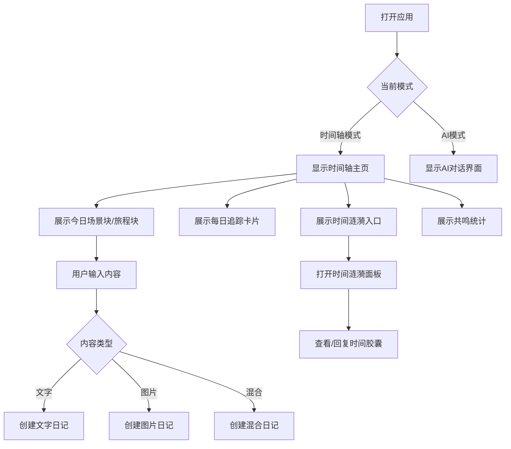
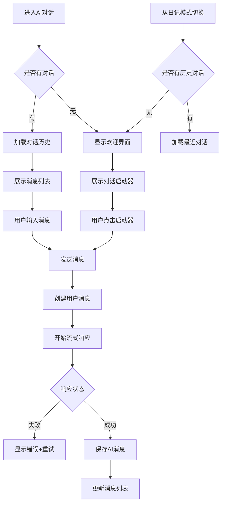
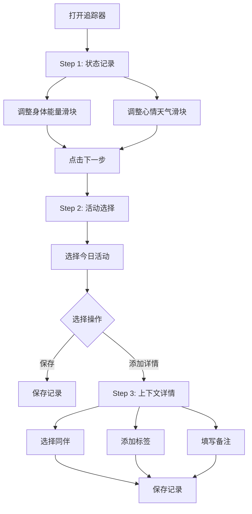
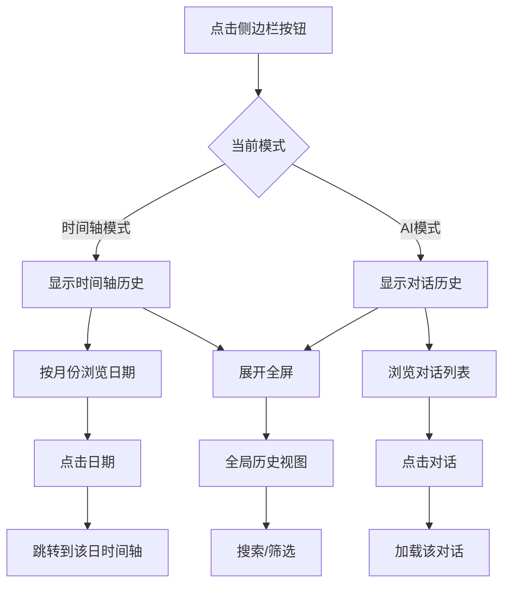
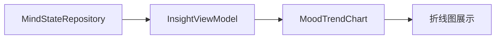
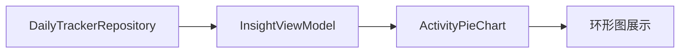
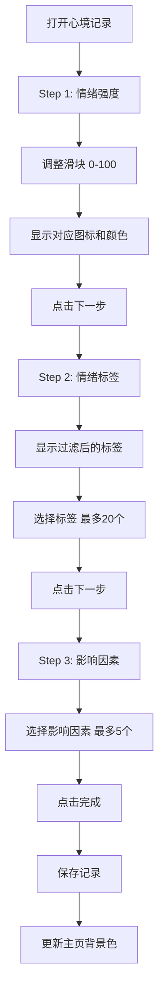

# 核心功能

<cite>
**本文档引用的文件**  
- [timeline.md](file://Docs/features/timeline.md)
- [ai-conversation.md](file://Docs/features/ai-conversation.md)
- [daily-tracker.md](file://Docs/features/daily-tracker.md)
- [history.md](file://Docs/features/history.md)
- [insight.md](file://Docs/features/insight.md)
- [mind-state.md](file://Docs/features/mind-state.md)
- [profile.md](file://Docs/features/profile.md)
- [input.md](file://Docs/features/input.md)
- [SceneBlock.swift](file://guanji0.34/UI/Organisms/SceneBlock.swift)
- [JourneyBlock.swift](file://guanji0.34/UI/Organisms/JourneyBlock.swift)
- [MoodTrendChart.swift](file://guanji0.34/Features/Insight/Views/Charts/MoodTrendChart.swift)
- [ActivityPieChart.swift](file://guanji0.34/Features/Insight/Views/Charts/ActivityPieChart.swift)
- [DailyTrackerModels.swift](file://guanji0.34/Core/Models/DailyTrackerModels.swift)
- [MindStateModels.swift](file://guanji0.34/Core/Models/MindStateModels.swift)
</cite>

## 目录
1. [时间线功能](#时间线功能)
2. [AI对话功能](#ai对话功能)
3. [每日追踪功能](#每日追踪功能)
4. [历史记录功能](#历史记录功能)
5. [数据洞察功能](#数据洞察功能)
6. [心境记录功能](#心境记录功能)
7. [个人中心功能](#个人中心功能)
8. [输入功能](#输入功能)

## 时间线功能

时间线功能是观己应用的核心主页，负责按时间与地点自动组织用户的多媒体记录。通过场景块（SceneBlock）和旅程块（JourneyBlock）的智能划分，实现沉浸式的生活记录体验。

### 业务目标
- 按时间与地理位置自动聚合用户的文字、图片、音频、视频等多模态内容。
- 提供“时间胶囊”与“时间涟漪”功能，支持未来开启的记忆封存与提醒。
- 实现“往年今日”式的历史回顾，增强用户的情感共鸣。

### 用户交互流程

### 界面构成
- **时间轴主页**：主视图，根据应用模式切换内容。
- **场景块（SceneBlock）**：表示用户在固定地点（如家、公司）的记录集合。
- **旅程块（JourneyBlock）**：表示用户在移动过程中的记录集合。
- **输入栏（InputDock）**：底部输入区域，支持文字、图片、录音、文件等多媒体输入。
- **时间涟漪入口**：用于查看即将到期的时间胶囊。

### 技术实现
#### 场景块与旅程块的区别
- **场景块（SceneBlock）**：当用户处于已定义的地理围栏（Fence）内时，系统创建或追加场景块。适用于固定地点的连续记录。
- **旅程块（JourneyBlock）**：当用户离开围栏或处于移动状态时，系统创建旅程块。适用于通勤、旅行等移动场景。

#### 渲染逻辑
- **SceneBlock.swift** 负责渲染场景块，包含场景标题、位置信息及内部的日记条目（JournalRow）。
- **JourneyBlock.swift** 负责渲染旅程块，包含旅程模式（mode）、目的地信息及条目列表。
- 两者均通过 `TimelineViewModel` 获取数据，并根据 `TimelineRepository` 提供的时间轴数据进行渲染。
- 条目过滤逻辑：隐藏封印记忆（`subType == .pending_question`）、未来条目、问题回复及时间胶囊源条目。

**Section sources**
- [timeline.md](file://Docs/features/timeline.md)
- [SceneBlock.swift](file://guanji0.34/UI/Organisms/SceneBlock.swift)
- [JourneyBlock.swift](file://guanji0.34/UI/Organisms/JourneyBlock.swift)

## AI对话功能

AI对话功能提供与AI助手的自然语言交互能力，支持流式响应、思考过程可视化和富文本渲染。

### 业务目标
- 提供流畅的AI对话体验，支持日常交流、问题解答和深度思考。
- 展示AI的推理过程，增强用户对回答逻辑的理解。
- 支持对话历史的持久化管理，便于回顾与继续。

### 用户交互流程

### 界面构成
- **欢迎界面**：当无历史对话时显示，提供对话启动建议。
- **消息列表**：展示用户与AI的对话历史。
- **消息气泡（MessageBubble）**：区分用户与AI消息，支持富文本渲染。
- **流式响应指示器**：显示AI正在生成回复的动画。
- **思考过程区域**：可折叠展示AI的推理步骤。

### 技术实现
- **流式响应机制**：通过 `AIService` 的流式API，实时接收AI的响应片段，并通过 `onContentUpdate` 和 `onReasoningUpdate` 回调更新界面。
- **思考过程可视化**：当启用思考模式时，AI返回的推理内容通过 `ThinkingSection` 组件以折叠形式展示，用户可展开查看完整逻辑。
- **Markdown语法高亮**：使用 `RichTextRenderer` 组件解析Markdown内容，并通过 `SyntaxHighlighter` 实现代码块的语法高亮。

**Section sources**
- [ai-conversation.md](file://Docs/features/ai-conversation.md)

## 每日追踪功能

每日追踪功能通过三步流程帮助用户快速记录身体能量、心情天气和活动情况。

### 业务目标
- 以极简交互让用户在几秒内完成每日状态记录。
- 记录活动上下文（同伴、标签、备注），丰富数据维度。
- 支持历史记录的编辑与修改。

### 用户交互流程

### 界面构成
- **三步流程界面**：分步引导用户完成记录。
- **状态滑块卡片**：使用连续滑块精确捕捉身体能量与心情天气。
- **活动选择区**：可多选的活动标签。
- **上下文详情面板**：用于添加同伴、标签和备注。

### 技术实现
- **数据采集方式**：
  - **身体能量**：0-100连续滑块，映射为7个等级（如筋疲力尽、精力充沛）。
  - **心情天气**：0-100连续滑块，映射为7个情绪等级（如非常不愉快、非常愉快）。
  - **活动维度**：支持22种预设活动类型，分为“生存与产出”、“探索与身心”、“连接与情感”三大类。
  - **上下文信息**：记录同伴类型（独自、家人、朋友等）、自定义标签和备注。

**Section sources**
- [daily-tracker.md](file://Docs/features/daily-tracker.md)
- [DailyTrackerModels.swift](file://guanji0.34/Core/Models/DailyTrackerModels.swift)

## 历史记录功能

历史记录功能提供按年月日浏览过往时间轴与AI对话的能力。

### 业务目标
- 提供统一的历史浏览入口，支持跨时间维度回顾。
- 根据当前模式自动切换内容（时间轴或AI对话）。
- 支持按月份筛选和全局搜索。

### 用户交互流程

### 界面构成
- **侧边栏**：默认显示，根据 `AppState.currentMode` 切换为时间轴历史或对话历史。
- **全屏历史视图**：支持全局搜索和高级筛选。
- **年月选择器**：快速跳转到指定月份。

### 技术实现
- **按年月日浏览的实现策略**：
  - 使用 `HistoryViewModel` 从 `TimelineRepository` 获取所有时间轴数据。
  - 按月份分组，当前月份按降序排列，历史月份按升序排列。
  - 通过 `YearMonthPickerSheet` 实现年月快速选择。
  - 标题显示逻辑：优先显示 `DailyTimeline.title`，否则提取第一条文字内容。

**Section sources**
- [history.md](file://Docs/features/history.md)

## 数据洞察功能

数据洞察功能通过可视化图表展示用户的行为模式与情绪趋势。

### 业务目标
- 提供三区布局：记录概览（始终显示）、功能使用（有数据显示）、数据洞察（足够数据显示）。
- 基于真实数据动态计算统计结果，支持内存缓存与快速响应。
- 通过图表帮助用户发现记录习惯与情绪规律。

### 图表类型与数据源
| 图表类型 | 数据源 | 显示条件 |
|--------|--------|--------|
| 情绪趋势图 | MindStateRecord.valenceValue | ≥7次记录 |
| 活动分布图 | DailyTrackerRecord.activities | ≥5次追踪 |
| 记录时间分布图 | JournalEntry.timestamp | ≥10条记录 |
| 常去地点排行 | LocationVO | ≥3个地点 |
| 爱的来源排行 | LoveLog.sender | ≥3条记录 |

### 技术实现
#### 情绪趋势图

- 使用 `MoodTrendChart.swift` 实现，数据格式为 `[(date: String, value: Int)]`。
- X轴为时间，Y轴为情绪值（-3到+3），使用渐变填充增强视觉效果。

#### 活动分布图

- 使用 `ActivityPieChart.swift` 实现，数据格式为 `[ActivityType: Int]`。
- 按活动类型分组，使用不同颜色区分三大类活动。

**Diagram sources**
- [MoodTrendChart.swift](file://guanji0.34/Features/Insight/Views/Charts/MoodTrendChart.swift)
- [ActivityPieChart.swift](file://guanji0.34/Features/Insight/Views/Charts/ActivityPieChart.swift)

**Section sources**
- [insight.md](file://Docs/features/insight.md)

## 心境记录功能

心境记录功能通过三步流程帮助用户精确捕捉当前心理状态。

### 业务目标
- 通过情绪强度、情绪标签和影响因素三个维度构建完整的心境画像。
- 支持智能标签过滤，根据情绪极性推荐相关标签。
- 将心境数据与主页背景色联动，增强沉浸感。

### 用户交互流程

### 技术实现
- **情绪强度量表**：0-100映射为7个等级，每个等级对应特定图标与颜色。
- **智能标签过滤**：根据情绪极性（不愉快、中性、愉快）动态过滤可选标签。
- **影响因素分类**：分为身份认同、社交关系、环境因素三大类。
- **主页背景联动**：保存记录后，通过 `AppState.homeValence` 更新主页背景渐变色。

**Section sources**
- [mind-state.md](file://Docs/features/mind-state.md)
- [MindStateModels.swift](file://guanji0.34/Core/Models/MindStateModels.swift)

## 个人中心功能

个人中心功能是应用的设置与管理中心，涵盖AI配置、地点管理、用户画像等。

### 业务目标
- 提供统一的系统设置入口。
- 支持AI API密钥配置与默认模式选择。
- 管理用户常用地点与关系网络。
- 提供数据导出与维护工具。

### 主要子功能
- **AI设置**：配置API密钥、选择模型、设置默认模式。
- **地点管理**：创建、编辑地点，设置地理围栏。
- **用户画像**：支持结构化与叙事式两种画像模式。
- **关系管理**：管理人际关系，支持传统与叙事式关系。
- **数据维护**：导出数据、清理缓存、重置应用。

**Section sources**
- [profile.md](file://Docs/features/profile.md)

## 输入功能

输入功能提供统一的多媒体内容输入入口。

### 业务目标
- 支持文字、图片、音频、文件等多种媒体类型的输入。
- 集成录音功能，支持语音记录。
- 提供时间胶囊创建器，支持封印记忆。

### 技术实现
- **录音功能**：使用 `AVAudioRecorder` 实现，录音格式为M4A。
- **附件管理**：支持图片与文件附件，文件自动复制到Documents目录。
- **时间胶囊创建**：通过 `CapsuleCreatorSheet` 设置解锁日期与内容，支持系统问题模板。

**Section sources**
- [input.md](file://Docs/features/input.md)