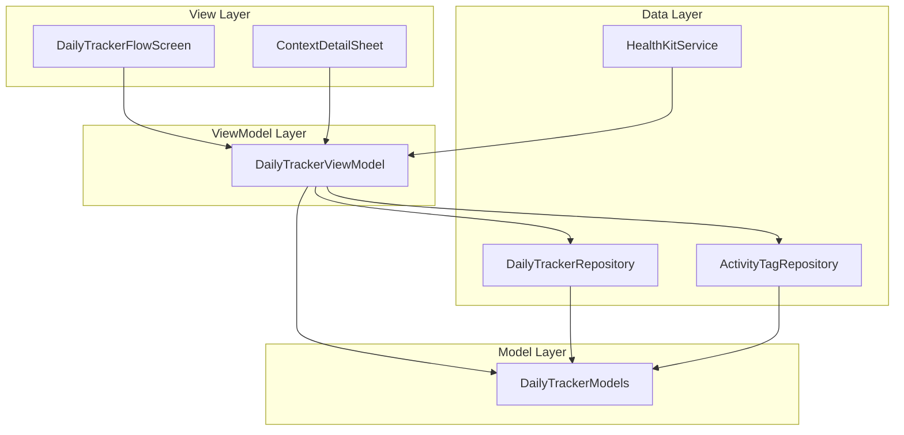
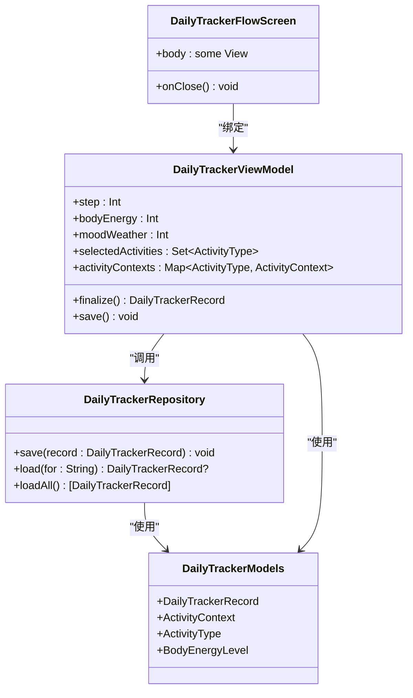
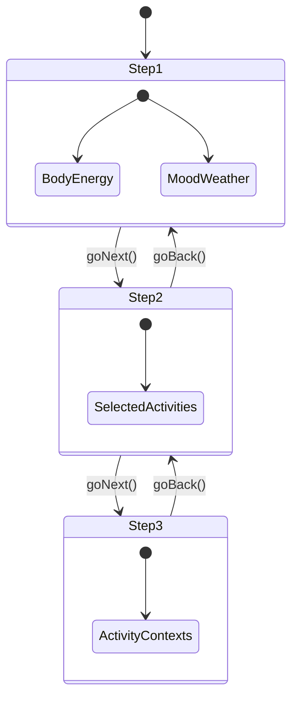
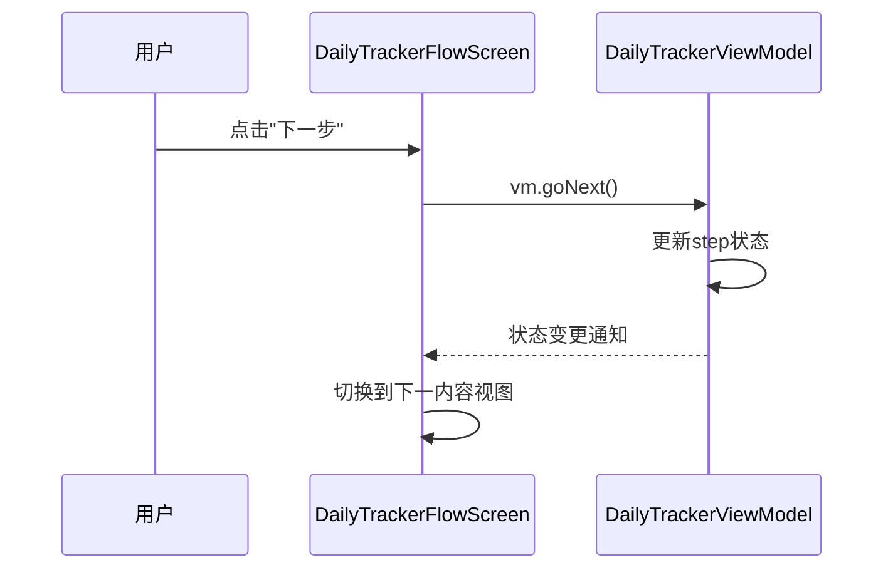
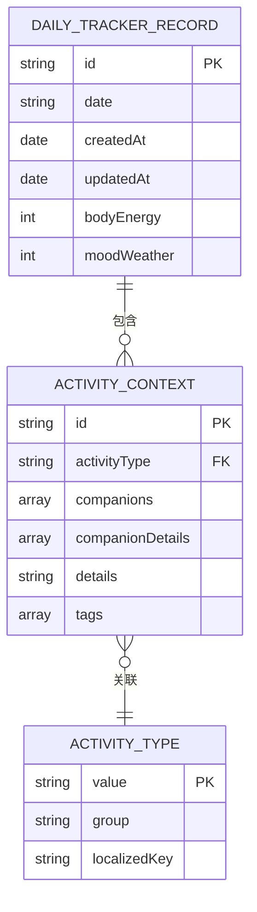
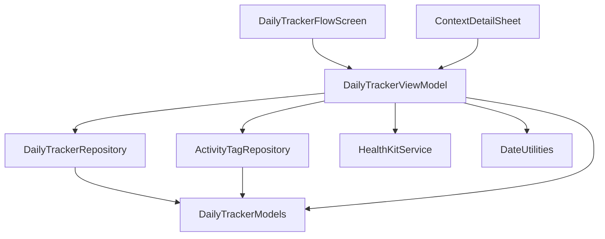

# 每日追踪功能

<cite>
**本文档引用文件**  
- [DailyTrackerViewModel.swift](file://guanji0.34/Features/DailyTracker/DailyTrackerViewModel.swift)
- [DailyTrackerFlowScreen.swift](file://guanji0.34/Features/DailyTracker/DailyTrackerFlowScreen.swift)
- [DailyTrackerModels.swift](file://guanji0.34/Core/Models/DailyTrackerModels.swift)
- [DailyTrackerRepository.swift](file://guanji0.34/DataLayer/Repositories/DailyTrackerRepository.swift)
- [HealthKitService.swift](file://guanji0.34/DataLayer/SystemServices/HealthKitService.swift)
- [ActivityTagRepository.swift](file://guanji0.34/DataLayer/Repositories/ActivityTagRepository.swift)
- [ContextDetailSheet.swift](file://guanji0.34/UI/Molecules/ContextDetailSheet.swift)
- [DateUtilities.swift](file://guanji0.34/Core/Utilities/DateUtilities.swift)
</cite>

## 目录
1. [简介](#简介)
2. [项目结构](#项目结构)
3. [核心组件](#核心组件)
4. [架构概览](#架构概览)
5. [详细组件分析](#详细组件分析)
6. [依赖分析](#依赖分析)
7. [性能考虑](#性能考虑)
8. [故障排除指南](#故障排除指南)
9. [结论](#结论)

## 简介
每日追踪功能允许用户记录睡眠、运动、饮食及自定义标签等多维度健康数据。该功能采用三步流程引导用户完成数据录入，通过MVVM架构实现状态管理与界面分离，并利用本地持久化存储保障数据安全。系统支持与HealthKit的数据同步，提供智能预填与个性化标签功能，确保用户体验流畅且数据完整。

## 项目结构
每日追踪功能的代码组织遵循清晰的分层架构，主要包含视图、视图模型、数据模型与数据服务四个层级。视图层负责界面展示与用户交互，视图模型层管理状态与业务逻辑，数据模型层定义结构与约束，数据服务层处理持久化与外部集成。

**图表来源**  
- [DailyTrackerFlowScreen.swift](file://guanji0.34/Features/DailyTracker/DailyTrackerFlowScreen.swift)
- [DailyTrackerViewModel.swift](file://guanji0.34/Features/DailyTracker/DailyTrackerViewModel.swift)
- [DailyTrackerModels.swift](file://guanji0.34/Core/Models/DailyTrackerModels.swift)
- [DailyTrackerRepository.swift](file://guanji0.34/DataLayer/Repositories/DailyTrackerRepository.swift)
- [ActivityTagRepository.swift](file://guanji0.34/DataLayer/Repositories/ActivityTagRepository.swift)
- [HealthKitService.swift](file://guanji0.34/DataLayer/SystemServices/HealthKitService.swift)

**本节来源**  
- [DailyTrackerFlowScreen.swift](file://guanji0.34/Features/DailyTracker/DailyTrackerFlowScreen.swift)
- [DailyTrackerViewModel.swift](file://guanji0.34/Features/DailyTracker/DailyTrackerViewModel.swift)
- [DailyTrackerModels.swift](file://guanji0.34/Core/Models/DailyTrackerModels.swift)

## 核心组件
每日追踪功能的核心组件包括DailyTrackerViewModel、DailyTrackerFlowScreen、DailyTrackerModels和DailyTrackerRepository。这些组件协同工作，实现数据录入、状态管理、持久化存储与界面展示。

**本节来源**  
- [DailyTrackerViewModel.swift](file://guanji0.34/Features/DailyTracker/DailyTrackerViewModel.swift)
- [DailyTrackerFlowScreen.swift](file://guanji0.34/Features/DailyTracker/DailyTrackerFlowScreen.swift)
- [DailyTrackerModels.swift](file://guanji0.34/Core/Models/DailyTrackerModels.swift)
- [DailyTrackerRepository.swift](file://guanji0.34/DataLayer/Repositories/DailyTrackerRepository.swift)

## 架构概览
系统采用MVVM架构模式，将用户界面与业务逻辑分离。DailyTrackerFlowScreen作为视图层，通过绑定DailyTrackerViewModel的状态驱动UI更新；DailyTrackerViewModel作为视图模型层，管理多步骤表单状态并验证输入合法性；DailyTrackerRepository作为数据层，负责与本地文件系统的交互，实现数据的持久化存储。

**图表来源**  
- [DailyTrackerFlowScreen.swift](file://guanji0.34/Features/DailyTracker/DailyTrackerFlowScreen.swift)
- [DailyTrackerViewModel.swift](file://guanji0.34/Features/DailyTracker/DailyTrackerViewModel.swift)
- [DailyTrackerRepository.swift](file://guanji0.34/DataLayer/Repositories/DailyTrackerRepository.swift)
- [DailyTrackerModels.swift](file://guanji0.34/Core/Models/DailyTrackerModels.swift)

## 详细组件分析
本节深入分析每日追踪功能的各个关键组件，包括其设计原理、实现细节与交互逻辑。

### DailyTrackerViewModel 分析
DailyTrackerViewModel 是每日追踪功能的核心状态管理器，负责维护三步流程中的所有用户输入状态。它通过@Published属性包装器暴露可观察状态，使视图能够响应式更新。

#### 状态管理机制
ViewModel采用分步式状态管理，将数据录入过程划分为三个阶段：日常状态（Step 1）、活动选择（Step 2）和上下文详情（Step 3）。每个阶段的状态变更均通过goToStep、goBack和goNext方法进行导航控制。

**图表来源**  
- [DailyTrackerViewModel.swift](file://guanji0.34/Features/DailyTracker/DailyTrackerViewModel.swift)

#### 输入验证与数据处理
ViewModel提供了一系列计算属性来验证输入合法性，如canProceedToStep2、canProceedToStep3和canSave。在保存数据时，finalize方法会将当前状态转换为DailyTrackerRecord对象，确保数据结构的完整性。

**本节来源**  
- [DailyTrackerViewModel.swift](file://guanji0.34/Features/DailyTracker/DailyTrackerViewModel.swift)

### DailyTrackerFlowScreen 分析
DailyTrackerFlowScreen 是用户界面的主要载体，通过NavigationStack实现三步流程的导航与标题切换。它根据当前步骤动态渲染不同的内容视图，并通过工具栏按钮提供导航与保存功能。

#### 导航流程与表单交互
屏幕的导航标题根据当前步骤动态变化，使用navTitle计算属性返回本地化字符串。确认按钮（confirmButton）根据当前步骤显示不同行为：在步骤1显示"下一步"，在步骤2提供"保存"或"添加详情"的菜单选项，在步骤3显示"保存"按钮。

**图表来源**  
- [DailyTrackerFlowScreen.swift](file://guanji0.34/Features/DailyTracker/DailyTrackerFlowScreen.swift)
- [DailyTrackerViewModel.swift](file://guanji0.34/Features/DailyTracker/DailyTrackerViewModel.swift)

**本节来源**  
- [DailyTrackerFlowScreen.swift](file://guanji0.34/Features/DailyTracker/DailyTrackerFlowScreen.swift)

### DailyTrackerModels 分析
DailyTrackerModels 定义了每日追踪功能所需的所有数据结构，包括DailyTrackerRecord、ActivityContext、ActivityType等。这些模型采用Swift的枚举与结构体特性，确保类型安全与数据完整性。

#### 数据结构与持久化
DailyTrackerRecord作为根实体，包含日期、体能、情绪及活动上下文数组。所有模型均遵循Codable协议，支持JSON序列化，便于本地文件存储。日期格式统一为"yyyy.MM.dd"，由DateUtilities.today提供。

**图表来源**  
- [DailyTrackerModels.swift](file://guanji0.34/Core/Models/DailyTrackerModels.swift)

**本节来源**  
- [DailyTrackerModels.swift](file://guanji0.34/Core/Models/DailyTrackerModels.swift)

## 依赖分析
每日追踪功能依赖多个内部与外部组件，形成复杂的依赖网络。核心依赖包括数据持久化、标签管理、健康数据同步与用户界面组件。

**图表来源**  
- [DailyTrackerViewModel.swift](file://guanji0.34/Features/DailyTracker/DailyTrackerViewModel.swift)
- [DailyTrackerRepository.swift](file://guanji0.34/DataLayer/Repositories/DailyTrackerRepository.swift)
- [ActivityTagRepository.swift](file://guanji0.34/DataLayer/Repositories/ActivityTagRepository.swift)
- [HealthKitService.swift](file://guanji0.34/DataLayer/SystemServices/HealthKitService.swift)
- [DateUtilities.swift](file://guanji0.34/Core/Utilities/DateUtilities.swift)

**本节来源**  
- [DailyTrackerViewModel.swift](file://guanji0.34/Features/DailyTracker/DailyTrackerViewModel.swift)
- [DailyTrackerRepository.swift](file://guanji0.34/DataLayer/Repositories/DailyTrackerRepository.swift)
- [ActivityTagRepository.swift](file://guanji0.34/DataLayer/Repositories/ActivityTagRepository.swift)
- [HealthKitService.swift](file://guanji0.34/DataLayer/SystemServices/HealthKitService.swift)

## 性能考虑
为优化性能，系统采用本地缓存策略减少磁盘I/O操作。DailyTrackerRepository和ActivityTagRepository均维护内存缓存，仅在首次访问时从磁盘加载数据。数据保存采用原子写入，确保文件完整性。对于大型数据集，建议实施分页加载与后台同步机制，避免主线程阻塞。

## 故障排除指南
针对数据丢失、同步延迟与界面卡顿等问题，建议采取以下措施：
- 实施定期自动备份，防止意外数据丢失
- 使用OperationQueue管理后台同步任务，避免影响UI响应
- 在低内存设备上限制缓存大小，及时释放非必要资源
- 添加详细的错误日志记录，便于问题诊断

**本节来源**  
- [DailyTrackerRepository.swift](file://guanji0.34/DataLayer/Repositories/DailyTrackerRepository.swift)
- [ActivityTagRepository.swift](file://guanji0.34/DataLayer/Repositories/ActivityTagRepository.swift)

## 结论
每日追踪功能通过清晰的架构设计与模块化实现，提供了稳定可靠的健康数据录入体验。未来可扩展方向包括增强HealthKit集成、引入机器学习预测模型与跨设备同步功能，进一步提升用户价值。