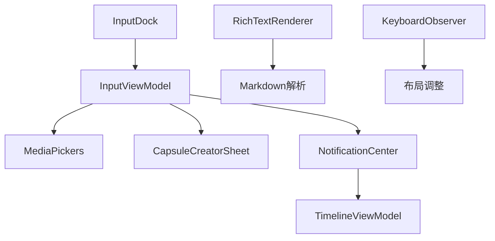
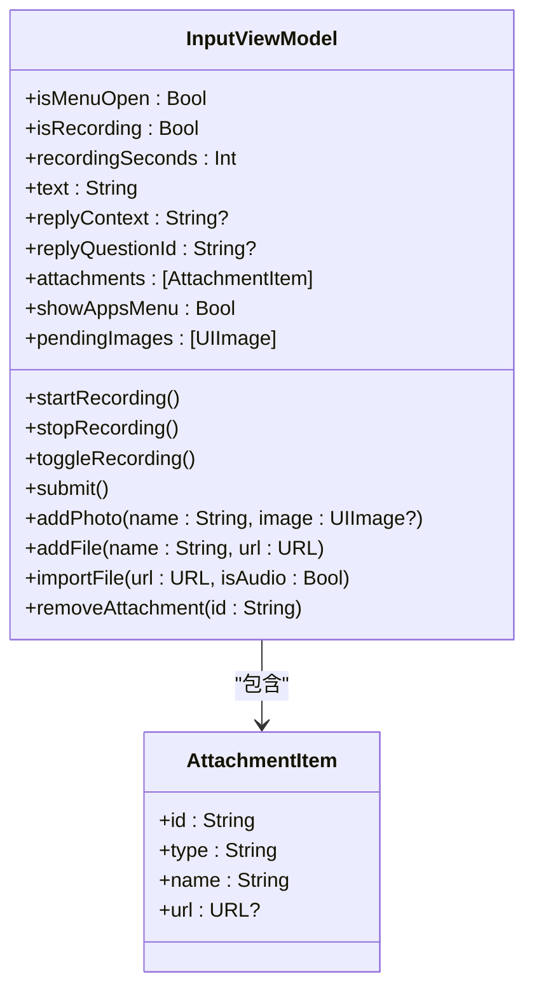
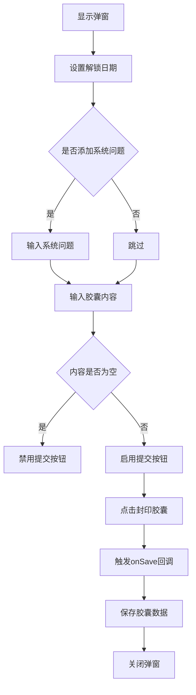
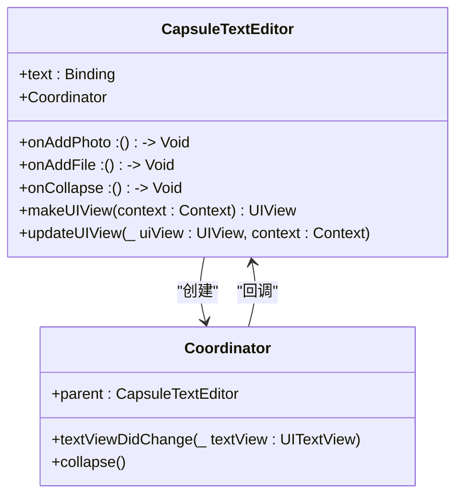
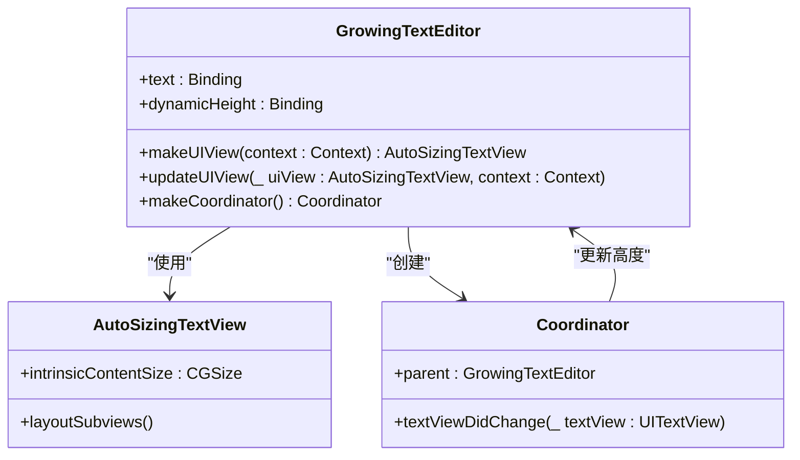
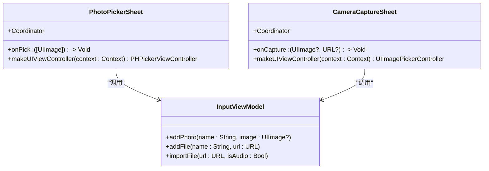
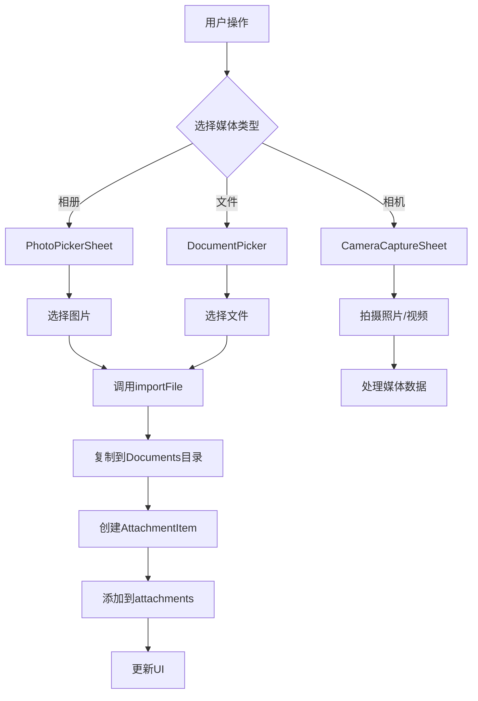
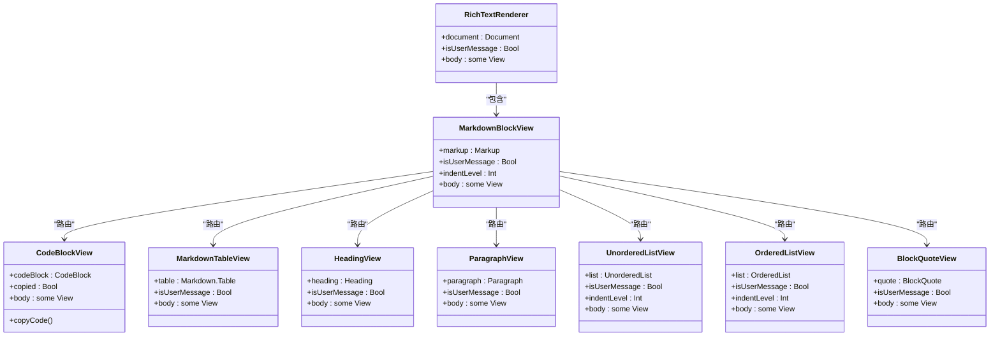
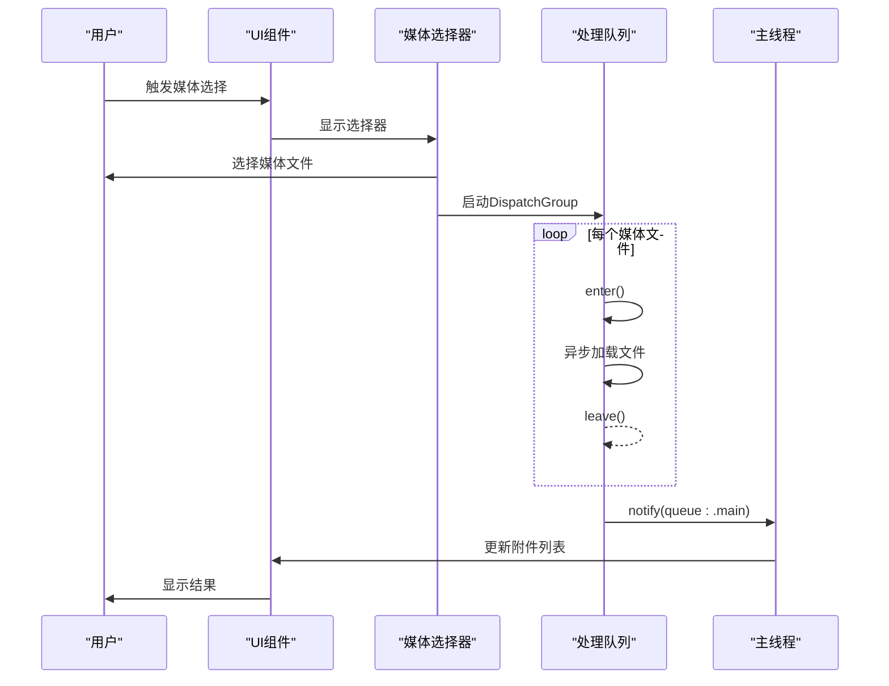

# 输入系统功能

<cite>
**本文档引用的文件**   
- [InputViewModel.swift](file://guanji0.34/Features/Input/InputViewModel.swift)
- [CapsuleCreatorSheet.swift](file://guanji0.34/Features/Input/CapsuleCreatorSheet.swift)
- [CapsuleTextEditor.swift](file://guanji0.34/UI/Atoms/CapsuleTextEditor.swift)
- [GrowingTextEditor.swift](file://guanji0.34/UI/Atoms/GrowingTextEditor.swift)
- [MediaPickers.swift](file://guanji0.34/Utils/MediaPickers.swift)
- [RichTextRenderer.swift](file://guanji0.34/UI/Molecules/RichTextRenderer.swift)
- [InputDock.swift](file://guanji0.34/UI/Organisms/InputDock.swift)
- [KeyboardObserver.swift](file://guanji0.34/App/KeyboardObserver.swift)
- [input.md](file://Docs/features/input.md)
</cite>

## 目录
1. [输入系统架构概述](#输入系统架构概述)
2. [InputViewModel状态管理](#inputviewmodel状态管理)
3. [CapsuleCreatorSheet弹窗逻辑](#capsulecreatorsheet弹窗逻辑)
4. [文本编辑器实现差异](#文本编辑器实现差异)
5. [媒体上传流程](#媒体上传流程)
6. [富文本渲染集成](#富文本渲染集成)
7. [布局优化与异步加载策略](#布局优化与异步加载策略)
8. [自定义输入组件开发指南](#自定义输入组件开发指南)

## 输入系统架构概述

输入系统采用MVVM架构模式，通过`InputViewModel`管理输入状态，`InputDock`作为输入容器组件，`CapsuleCreatorSheet`处理时间胶囊创建，`MediaPickers`负责媒体选择，`RichTextRenderer`实现富文本渲染。系统通过`NotificationCenter`进行跨组件通信，实现了文本、媒体、语音等多种输入源的统一管理。



**图示来源**
- [InputDock.swift](file://guanji0.34/UI/Organisms/InputDock.swift#L7-L331)
- [InputViewModel.swift](file://guanji0.34/Features/Input/InputViewModel.swift#L6-L215)
- [MediaPickers.swift](file://guanji0.34/Utils/MediaPickers.swift#L7-L74)
- [CapsuleCreatorSheet.swift](file://guanji0.34/Features/Input/CapsuleCreatorSheet.swift#L9-L170)
- [RichTextRenderer.swift](file://guanji0.34/UI/Molecules/RichTextRenderer.swift#L9-L805)
- [KeyboardObserver.swift](file://guanji0.34/App/KeyboardObserver.swift#L5-L25)

## InputViewModel状态管理

`InputViewModel`作为输入系统的状态管理中心，协调管理文本、媒体、语音等多种输入源的状态。该视图模型实现了`ObservableObject`协议，通过`@Published`属性包装器暴露可观察的状态属性。

核心状态属性包括：
- `text`: 管理输入文本内容
- `isRecording`: 跟踪录音状态
- `recordingSeconds`: 记录录音时长
- `attachments`: 管理附件列表
- `pendingImages`: 存储待处理的图片
- `replyContext`: 处理回复上下文



**图示来源**
- [InputViewModel.swift](file://guanji0.34/Features/Input/InputViewModel.swift#L6-L215)

**本节来源**
- [InputViewModel.swift](file://guanji0.34/Features/Input/InputViewModel.swift#L6-L215)
- [input.md](file://Docs/features/input.md#L70-L98)

## CapsuleCreatorSheet弹窗逻辑

`CapsuleCreatorSheet`是时间胶囊创建的模态视图组件，提供解锁日期设置、内容输入和系统问题添加等功能。该组件通过绑定属性与父视图进行数据交互，实现了完整的提交流程。

### 弹窗逻辑流程



### 核心功能实现

1. **日期选择**: 使用`DatePicker`组件结合快捷选项按钮，提供灵活的日期设置方式
2. **系统问题**: 可选添加系统问题，通过`showSystemQuestion`控制显示状态
3. **内容输入**: 使用`TextEditor`实现多行文本输入，支持占位符显示
4. **提交验证**: 通过`disabled`修饰符确保内容不为空时才能提交

**本节来源**
- [CapsuleCreatorSheet.swift](file://guanji0.34/Features/Input/CapsuleCreatorSheet.swift#L9-L170)
- [input.md](file://Docs/features/input.md#L101-L121)

## 文本编辑器实现差异

系统实现了两种文本编辑器组件：`CapsuleTextEditor`和`GrowingTextEditor`，分别用于不同的使用场景，具有不同的实现特性和功能差异。

### CapsuleTextEditor

`CapsuleTextEditor`是基于`UIViewRepresentable`的文本编辑器，主要用于输入框场景，具有以下特点：



**核心特性**:
- 使用`UITextView`实现，提供完整的文本编辑功能
- 集成输入辅助视图（`inputAccessoryView`），包含添加照片、文件和收起键盘的按钮
- 通过`Coordinator`处理文本变化和按钮点击事件
- 在macOS平台上降级为简单的`TextEditor`

**本节来源**
- [CapsuleTextEditor.swift](file://guanji0.34/UI/Atoms/CapsuleTextEditor.swift#L8-L49)

### GrowingTextEditor

`GrowingTextEditor`是支持自动高度调整的文本编辑器，主要用于需要动态调整高度的场景：



**核心特性**:
- 自定义`AutoSizingTextView`重写`intrinsicContentSize`实现自动高度调整
- 通过`dynamicHeight`绑定属性将内容高度传递给父视图
- 在文本变化时异步更新高度，避免布局循环
- 使用`GeometryReader`在macOS平台上实现类似的高度检测

**本节来源**
- [GrowingTextEditor.swift](file://guanji0.34/UI/Atoms/GrowingTextEditor.swift#L18-L94)

### 实现差异对比

| 特性 | CapsuleTextEditor | GrowingTextEditor |
|------|------------------|------------------|
| **主要用途** | 输入框场景 | 动态高度场景 |
| **高度调整** | 固定高度 | 自动高度调整 |
| **输入辅助** | 自定义工具栏 | 无 |
| **平台适配** | iOS/Android | iOS/Android/macOS |
| **焦点控制** | 通过工具栏按钮 | 依赖父视图 |
| **占位符** | 无 | 通过ZStack实现 |

**本节来源**
- [CapsuleTextEditor.swift](file://guanji0.34/UI/Atoms/CapsuleTextEditor.swift#L8-L49)
- [GrowingTextEditor.swift](file://guanji0.34/UI/Atoms/GrowingTextEditor.swift#L18-L94)

## 媒体上传流程

媒体上传流程通过`MediaPickers`工具类和`InputViewModel`协同工作，实现了图片、视频等媒体文件的选择与处理。

### 媒体选择器实现



**图示来源**
- [MediaPickers.swift](file://guanji0.34/Utils/MediaPickers.swift#L7-L74)
- [InputViewModel.swift](file://guanji0.34/Features/Input/InputViewModel.swift#L162-L204)

### 媒体上传流程



**本节来源**
- [MediaPickers.swift](file://guanji0.34/Utils/MediaPickers.swift#L7-L74)
- [InputViewModel.swift](file://guanji0.34/Features/Input/InputViewModel.swift#L171-L204)
- [InputDock.swift](file://guanji0.34/UI/Organisms/InputDock.swift#L114-L173)

## 富文本渲染集成

`RichTextRenderer`组件实现了富文本内容的预览与编辑功能，通过解析Markdown语法生成相应的UI组件。

### 富文本渲染架构



**图示来源**
- [RichTextRenderer.swift](file://guanji0.34/UI/Molecules/RichTextRenderer.swift#L9-L805)

### 集成方式

1. **Markdown解析**: 使用Swift Markdown库解析输入的Markdown文本
2. **组件路由**: `MarkdownBlockView`根据不同的Markup类型路由到相应的渲染组件
3. **样式定制**: 每个渲染组件实现特定的样式和交互逻辑
4. **语法高亮**: `CodeBlockView`集成`SyntaxHighlighter`实现代码语法高亮
5. **交互功能**: 支持代码复制、链接跳转等交互功能

**本节来源**
- [RichTextRenderer.swift](file://guanji0.34/UI/Molecules/RichTextRenderer.swift#L9-L805)

## 布局优化与异步加载策略

为解决键盘遮挡、文本截断、媒体加载缓慢等问题，系统采用了多种布局优化与异步加载策略。

### 键盘遮挡解决方案

通过`KeyboardObserver`监听键盘状态变化，动态调整布局：

```swift
// KeyboardObserver.swift
public final class KeyboardObserver: ObservableObject {
    @Published public private(set) var height: CGFloat = 0
    
    public init() {
        NotificationCenter.default.publisher(for: UIResponder.keyboardWillChangeFrameNotification)
            .compactMap { $0.userInfo?[UIResponder.keyboardFrameEndUserInfoKey] as? CGRect }
            .map { $0.height }
            .sink { [weak self] h in self?.height = h }
            .store(in: &cancellables)
            
        NotificationCenter.default.publisher(for: UIResponder.keyboardWillHideNotification)
            .sink { [weak self] _ in self?.height = 0 }
            .store(in: &cancellables)
    }
}
```

**本节来源**
- [KeyboardObserver.swift](file://guanji0.34/App/KeyboardObserver.swift#L5-L18)

### 异步加载策略

1. **媒体加载**: 使用`DispatchGroup`确保所有图片加载完成后再回调
2. **UI更新**: 在主线程异步更新UI，避免阻塞主线程
3. **资源释放**: 及时释放不再使用的资源，减少内存占用



**本节来源**
- [MediaPickers.swift](file://guanji0.34/Utils/MediaPickers.swift#L25-L35)
- [InputViewModel.swift](file://guanji0.34/Features/Input/InputViewModel.swift#L162-L165)

## 自定义输入组件开发指南

开发自定义输入组件时，应遵循以下指南和最佳实践。

### 基本结构

```swift
public struct CustomInputView: View {
    @Binding var text: String
    var onAction: () -> Void
    
    public init(text: Binding<String>, onAction: @escaping () -> Void) {
        self._text = text
        self.onAction = onAction
    }
    
    public var body: some View {
        // 实现UI
    }
}
```

### 最佳实践

1. **状态管理**: 使用`@Binding`或`@ObservedObject`进行状态管理
2. **平台适配**: 使用`#if canImport(UIKit)`进行平台条件编译
3. **性能优化**: 避免在`body`中执行复杂计算
4. **可访问性**: 确保组件对辅助功能友好
5. **本地化**: 使用`Localization.tr()`进行文本本地化

### 常见问题解决方案

| 问题 | 解决方案 |
|------|----------|
| 键盘遮挡 | 使用`KeyboardObserver`监听键盘高度 |
| 文本截断 | 使用`ZStack`和`GeometryReader`检测文本高度 |
| 媒体加载慢 | 使用`DispatchGroup`异步加载，显示加载状态 |
| 内存泄漏 | 及时释放`Timer`和`NotificationCenter`观察者 |
| 布局错乱 | 使用`@FocusState`正确管理焦点状态 |

**本节来源**
- [InputViewModel.swift](file://guanji0.34/Features/Input/InputViewModel.swift#L213-L214)
- [KeyboardObserver.swift](file://guanji0.34/App/KeyboardObserver.swift#L7-L17)
- [GrowingTextEditor.swift](file://guanji0.34/UI/Atoms/GrowingTextEditor.swift#L70-L83)