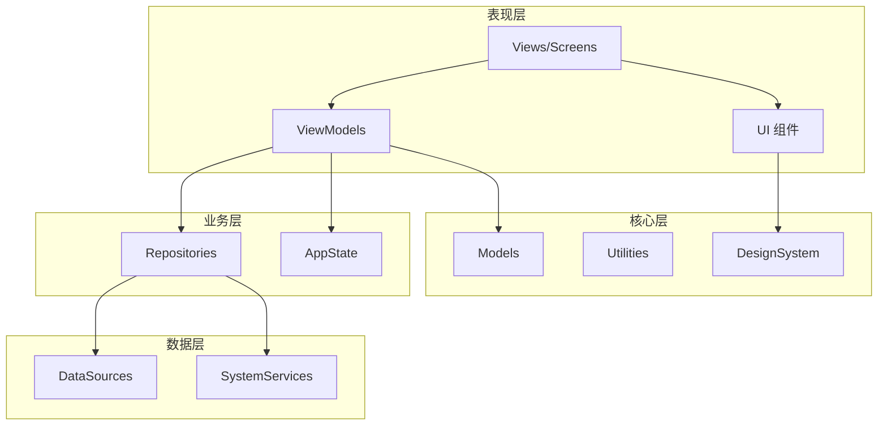
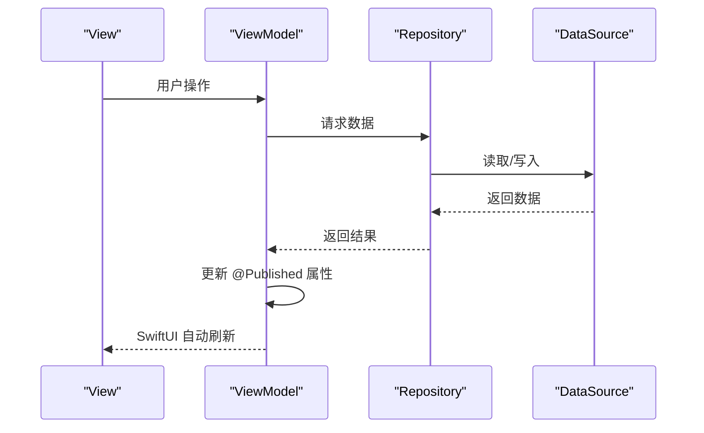
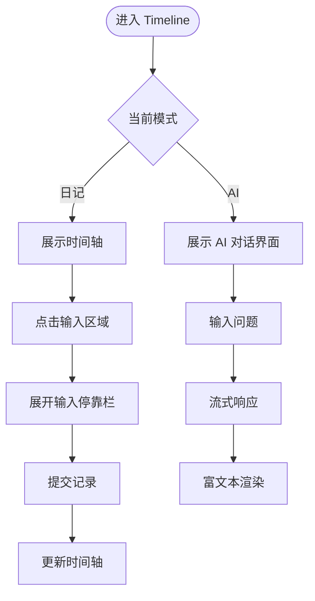
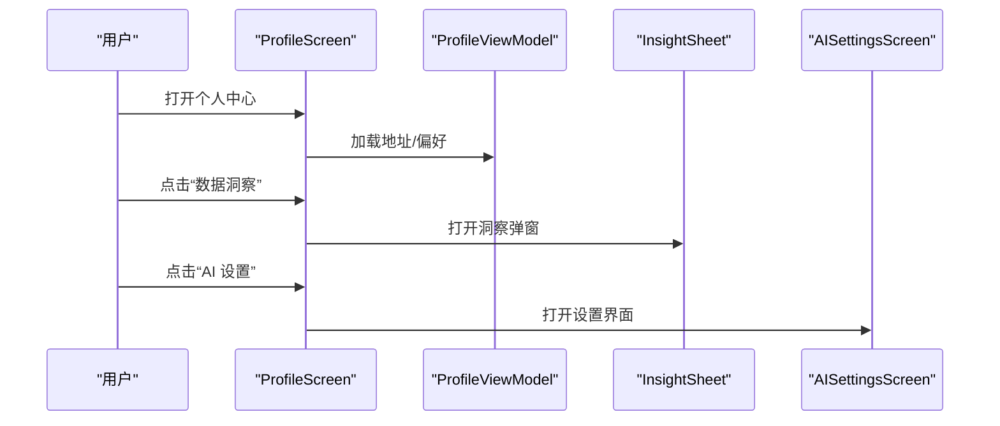
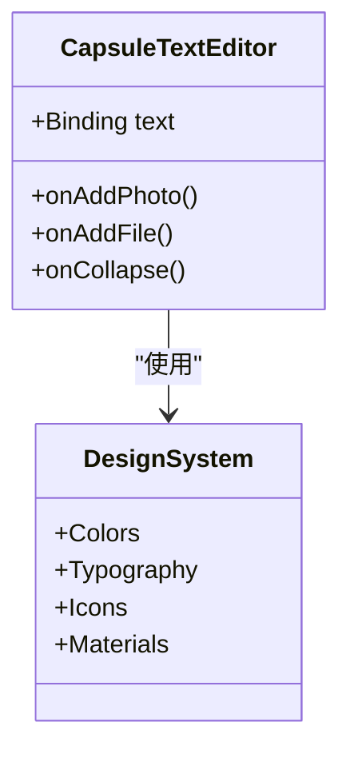
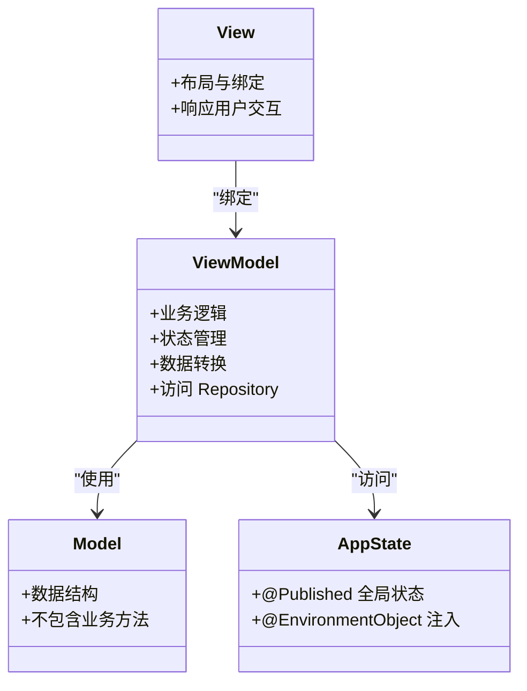
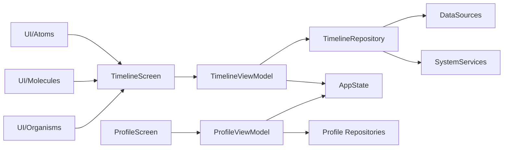

# 项目概述

<cite>
**本文引用的文件**
- [README.md](file://README.md)
- [guanji0.34/guanji0_34App.swift](file://guanji0.34/guanji0_34App.swift)
- [guanji0.34/ContentView.swift](file://guanji0.34/ContentView.swift)
- [guanji0.34/App/AppState.swift](file://guanji0.34/App/AppState.swift)
- [Docs/overview/product-overview.md](file://Docs/overview/product-overview.md)
- [Docs/overview/user-journey.md](file://Docs/overview/user-journey.md)
- [Docs/architecture/system-architecture.md](file://Docs/architecture/system-architecture.md)
- [Docs/architecture/mvvm-pattern.md](file://Docs/architecture/mvvm-pattern.md)
- [Docs/components/INDEX.md](file://Docs/components/INDEX.md)
- [guanji0.34/Features/Timeline/TimelineScreen.swift](file://guanji0.34/Features/Timeline/TimelineScreen.swift)
- [guanji0.34/Features/Profile/ProfileScreen.swift](file://guanji0.34/Features/Profile/ProfileScreen.swift)
- [guanji0.34/UI/Atoms/CapsuleTextEditor.swift](file://guanji0.34/UI/Atoms/CapsuleTextEditor.swift)
</cite>

## 目录
1. [简介](#简介)
2. [项目结构](#项目结构)
3. [核心组件](#核心组件)
4. [架构总览](#架构总览)
5. [详细组件分析](#详细组件分析)
6. [依赖关系分析](#依赖关系分析)
7. [性能考量](#性能考量)
8. [故障排查指南](#故障排查指南)
9. [结论](#结论)
10. [附录](#附录)

## 简介
Guanji 是一款原生 iOS 日记与生活记录应用，核心目标是以“流畅原生体验”为设计哲学，借助 SwiftUI 提供动画丰富、响应迅速的界面，帮助用户记录日常时刻、追踪心境状态、回顾个人历史，并通过 AI 对话获得个性化洞察。项目采用 MVVM 架构与 Atomic Design 组件体系，严格遵循 Apple Human Interface Guidelines，确保一致且自然的交互体验。

平台要求与技术栈
- 平台：iOS 16.1+
- 语言：Swift 5.0
- 框架：SwiftUI
- 架构：MVVM + Atomic Design
- 设计系统：Colors、Typography、Icons、Materials

## 项目结构
项目采用模块化的分层目录结构，职责清晰、边界明确：
- Features：业务模块（每个模块包含 Screen + ViewModel），如 Timeline、AIConversation、DailyTracker、History、Input、Insight、MindState、Profile
- UI：可复用 UI 组件（Atoms、Molecules、Organisms）
- Core：核心基础（Models、DesignSystem、Utilities）
- DataLayer：数据层（Repositories、SystemServices、DataSources）
- Shared：扩展共享代码
- Resources：本地化字符串与 Assets

图表来源
- [Docs/architecture/system-architecture.md](file://Docs/architecture/system-architecture.md#L21-L53)

章节来源
- [README.md](file://README.md#L13-L46)
- [Docs/overview/product-overview.md](file://Docs/overview/product-overview.md#L26-L36)

## 核心组件
- 应用入口与根视图
  - 应用入口：guanji0_34App，WindowGroup 中承载 ContentView
  - 根视图：ContentView，注入 AppState，使用 NavigationStack 承载 TimelineScreen
- 全局状态：AppState，集中管理日期、模式、编辑态等跨模块共享状态
- 核心屏幕：TimelineScreen 为主屏，提供时间轴、输入停靠栏、历史侧边栏、编辑覆盖层等能力
- 个人中心：ProfileScreen 提供通知、数据维护、洞察、AI 设置、语言切换、订阅信息等入口

章节来源
- [guanji0.34/guanji0_34App.swift](file://guanji0.34/guanji0_34App.swift#L10-L17)
- [guanji0.34/ContentView.swift](file://guanji0.34/ContentView.swift#L10-L16)
- [guanji0.34/App/AppState.swift](file://guanji0.34/App/AppState.swift#L148-L155)
- [guanji0.34/Features/Timeline/TimelineScreen.swift](file://guanji0.34/Features/Timeline/TimelineScreen.swift#L3-L19)
- [guanji0.34/Features/Profile/ProfileScreen.swift](file://guanji0.34/Features/Profile/ProfileScreen.swift#L4-L11)

## 架构总览
系统采用 MVVM + Atomic Design 的分层架构，数据流清晰、模块解耦良好：
- View 层：仅负责布局与绑定，不包含业务逻辑
- ViewModel 层：封装业务逻辑、状态管理与数据转换，通过 Repository 访问数据
- Model 层：纯数据结构，不包含业务方法
- 通信机制：@EnvironmentObject 注入全局状态；@StateObject/@ObservedObject 绑定 ViewModel；@Published 发布状态变化；NotificationCenter 实现跨模块事件通知

图表来源
- [Docs/architecture/system-architecture.md](file://Docs/architecture/system-architecture.md#L125-L139)

章节来源
- [Docs/architecture/system-architecture.md](file://Docs/architecture/system-architecture.md#L9-L17)
- [Docs/architecture/mvvm-pattern.md](file://Docs/architecture/mvvm-pattern.md#L35-L83)

## 详细组件分析

### 时间轴（Timeline）
- 定位：应用主页，展示日记条目、天气信息与“共鸣”（过去记忆）
- 能力：区分静止时刻（SceneBlock）与移动时刻（JourneyBlock），支持输入停靠栏、历史侧边栏、编辑覆盖层、时间胶囊创建、地点解析与权限提示
- 交互：底部 InputDock 提供快速入口；侧滑展开历史；点击条目进入编辑；支持 AI 模式切换

图表来源
- [guanji0.34/Features/Timeline/TimelineScreen.swift](file://guanji0.34/Features/Timeline/TimelineScreen.swift#L22-L29)
- [guanji0.34/Features/Timeline/TimelineScreen.swift](file://guanji0.34/Features/Timeline/TimelineScreen.swift#L35-L39)

章节来源
- [guanji0.34/Features/Timeline/TimelineScreen.swift](file://guanji0.34/Features/Timeline/TimelineScreen.swift#L1-L200)
- [README.md](file://README.md#L49-L52)

### 个人中心（Profile）
- 定位：用户设置与个人中心，包含通知、数据维护、洞察、AI 设置、语言、关于、订阅信息等
- 能力：列表式导航，支持语言切换、默认模式设置（日记/AI）、洞察弹窗、AI 设置弹窗

图表来源
- [guanji0.34/Features/Profile/ProfileScreen.swift](file://guanji0.34/Features/Profile/ProfileScreen.swift#L11-L118)

章节来源
- [guanji0.34/Features/Profile/ProfileScreen.swift](file://guanji0.34/Features/Profile/ProfileScreen.swift#L1-L154)
- [README.md](file://README.md#L59-L62)

### 原子组件（UI/Atoms）
- 定位：基础 UI 构建单元，不可再分
- 典型组件：CapsuleTextEditor（胶囊样式文本编辑器）、GrowingTextEditor、RoundIconButton、SelectableChip、TagInputChip、ThickSlider 等
- 设计原则：优先使用 SwiftUI 原生组件，避免过度自定义；统一使用 DesignSystem 的 Colors、Typography、Icons、Materials

图表来源
- [guanji0.34/UI/Atoms/CapsuleTextEditor.swift](file://guanji0.34/UI/Atoms/CapsuleTextEditor.swift#L8-L48)
- [Docs/components/INDEX.md](file://Docs/components/INDEX.md#L112-L135)

章节来源
- [Docs/components/INDEX.md](file://Docs/components/INDEX.md#L41-L61)
- [guanji0.34/UI/Atoms/CapsuleTextEditor.swift](file://guanji0.34/UI/Atoms/CapsuleTextEditor.swift#L1-L71)

### MVVM 模式与全局状态
- View：仅负责布局与绑定，不包含业务逻辑
- ViewModel：封装业务逻辑、状态管理与数据转换，通过 Repository 访问数据
- Model：纯数据结构，不包含业务方法
- 全局状态：AppState 通过 @EnvironmentObject 在全应用共享，包括日期、模式、编辑态等

图表来源
- [Docs/architecture/mvvm-pattern.md](file://Docs/architecture/mvvm-pattern.md#L11-L33)
- [guanji0.34/App/AppState.swift](file://guanji0.34/App/AppState.swift#L148-L155)

章节来源
- [Docs/architecture/mvvm-pattern.md](file://Docs/architecture/mvvm-pattern.md#L35-L83)
- [guanji0.34/App/AppState.swift](file://guanji0.34/App/AppState.swift#L148-L155)

## 依赖关系分析
- 模块耦合与内聚
  - Features 与 UI：通过 UI 组件提升内聚，降低重复实现
  - ViewModel 与 Repository：通过接口隔离，便于测试与替换
  - AppState 与各模块：通过环境对象共享状态，避免深层参数传递
- 外部依赖与集成点
  - 系统服务：LocationService、WeatherService、HealthKitService、AIService 等
  - 数据源：本地 JSON 文件存储 + 内存缓存
- 事件通知
  - NotificationCenter 用于跨模块解耦通信，如“提交输入”“时间轴更新”“追踪器更新”等

图表来源
- [Docs/architecture/system-architecture.md](file://Docs/architecture/system-architecture.md#L55-L90)
- [Docs/architecture/system-architecture.md](file://Docs/architecture/system-architecture.md#L141-L160)

章节来源
- [Docs/architecture/system-architecture.md](file://Docs/architecture/system-architecture.md#L92-L122)
- [Docs/architecture/system-architecture.md](file://Docs/architecture/system-architecture.md#L141-L160)

## 性能考量
- 原生优先：优先使用 SwiftUI 原生组件，减少自定义绘制与布局计算
- 状态发布：合理使用 @Published 与 Combine，避免不必要的重绘
- 组件复用：通过 Atomic Design 降低重复实现，提升渲染一致性
- 数据流：Repository 封装数据访问，配合内存缓存减少 IO 压力
- 动画与过渡：使用系统动画与过渡，保证流畅性与可预测性

## 故障排查指南
- 启动与运行
  - 确保 Xcode 14+，部署目标 iOS 16.1+
  - 打开项目工程文件，构建并运行
- 本地化问题
  - 新增字符串需同步添加至 Resources/Localizable.strings
- 组件使用
  - 遵循 Native First 原则，避免硬编码颜色与尺寸
  - 使用 DesignSystem 的 Colors、Typography、Icons、Materials
- 状态与通信
  - 全局状态通过 @EnvironmentObject 注入，避免深层传递
  - 跨模块通信使用 NotificationCenter，注意事件命名规范

章节来源
- [README.md](file://README.md#L68-L81)
- [Docs/components/INDEX.md](file://Docs/components/INDEX.md#L26-L39)

## 结论
Guanji 以“流畅原生体验”为核心理念，通过 MVVM 架构与 Atomic Design 组件体系，构建了清晰、可维护、可扩展的 iOS 日记与生活记录应用。其模块化结构与严格的职责划分，既适合初学者快速上手，也为高级开发者提供了稳健的技术基座。结合用户旅程文档，可以更好地理解典型工作流与关键触点，从而优化产品体验与开发效率。

## 附录
- 典型用户工作流示例
  - 日常记录：打开应用 → 点击输入区域 → 展开输入面板 → 输入内容 → 选择分类 → 提交记录 → 查看结果
  - AI 对话：进入对话界面 → 输入问题 → 查看思考过程 → 观看流式输出 → 阅读富文本回复
  - 心境追踪：进入心境模块 → 设置情绪值 → 选择情绪标签 → 添加影响因素 → 保存记录 → 查看分析
  - 每日追踪：进入追踪模块 → 记录睡眠/运动 → 添加标签 → 保存记录 → 查看今日汇总
  - 历史回顾：打开历史侧边栏 → 选择查看方式 → 选择日期 → 浏览记录 → 查看详情
  - 时间胶囊：打开胶囊创建器 → 输入内容 → 设置开启日期 → 保存胶囊 → 等待开启 → 阅读胶囊内容

章节来源
- [Docs/overview/user-journey.md](file://Docs/overview/user-journey.md#L11-L180)