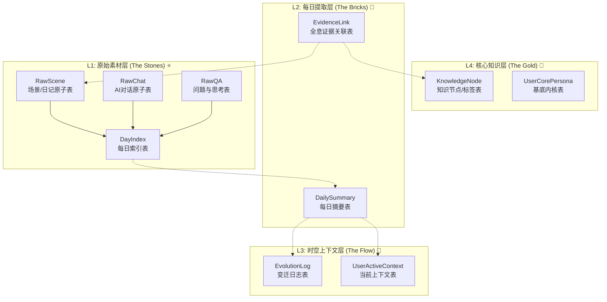

# 数据架构 - 四层记忆系统

> 返回 [文档中心](../INDEX.md)

## 🗺️ 整体层级预览 (The Hierarchy)

观己(Guanji)采用四层数据架构设计，基于"石头→砖块→流水→黄金"的隐喻：

| 层级 | 名称 | 隐喻 | 核心职责 | 状态 |
|------|------|------|----------|------|
| **L1** | 原始素材层 | The Stones | 全量存储，隐私最高，溯源的终点 | ⭐ 当前实现 |
| **L2** | 每日提取层 | The Bricks | 每日结算产物，连接原子数据与知识的桥梁 | 🔮 未来 |
| **L3** | 时空上下文层 | The Flow | 包含"当前状态"与"变迁日志"，处理时间维度 | 🔮 未来 |
| **L4** | 核心知识层 | The Gold | 高度抽象的画像、标签节点与事实 | ⭐ 部分实现 |

> **当前状态**: 
> - L1 原始素材层：完整实现（日记、对话、追踪等）
> - L2 每日提取层：⭐ 数据提取服务已实现（DailyExtractionService），AI 分析功能待开发
> - L4 核心知识层：⭐ 数据结构已实现（KnowledgeNode、AIPreferences），AI 提取功能待开发
> - L3：尚未实现（需要AI分析功能）

### 数据分类说明

系统中的数据可以分为两大类：

| 类型 | 说明 | 来源 | 示例 |
|------|------|------|------|
| **流水数据** | 每天产生的原始记录 | 用户输入 | 日记、对话、追踪 |
| **常量数据** | 相对稳定的配置/结论 | 用户维护 / AI分析 | 地点映射、关系、用户画像 |

- **流水数据** → L1 原始素材层
- **常量数据** → L4 核心知识层（目前由用户手动维护，未来可由AI分析更新）

### L1 数据层级关系

```
Day (每日索引)
├── Scene (场景块)
│   └── JournalEntry (日记原子)
├── Journey (旅程块)
│   └── JournalEntry (日记原子)
├── AIConversation (AI对话)
│   └── AIMessage (对话消息)
├── Question (问题/时间胶囊)
├── DailyTracker (每日追踪)
└── MindState (心境记录)
```

**设计决策**：
- 原子数据（JournalEntry, AIMessage）通过其父容器（Scene, Conversation）间接关联到 Day
- 不在原子层直接存储 dayId，避免数据冗余
- 查询"某天所有日记"通过遍历场景实现，本地存储场景下性能可接受

### L4 关联机制 (EvidenceLink) 🔮 未来

当 AI 功能实现后，系统将自动建立 L4 常量数据与 L1 流水数据的关联：

```
EvidenceLink {
    nodeId: "妈妈的关系ID"      // L4 关系节点
    sourceTable: "raw_scenes"   // L1 表名
    sourceRecordId: "日记ID"    // L1 记录ID
}
```

**当前状态**：暂不实现，等待 AI 功能开发时一并实现。



---

## 🧱 L1: 原始素材层 (Raw Data Layer) ⭐ 当前实现

**核心职责**: 记录一切发生的"原样"。不做删减，只做归档。

**溯源锚点**: 所有上层数据的来源，最终都会指向这一层的主键 ID。

### 1.1 每日索引表 (DayIndex)

整个 L1 层的根目录。

**概念定义**:
```
DayIndex {
    id: String               // UUID
    userId: String           // 用户ID
    date: String             // YYYY-MM-DD (业务日期)
    metaInfo: {              // 元数据
        weather: String?
        locationRange: {...}?
        timezone: String?
    }
    createdAt: Date
}
```

**现有模型映射**: `DailyTimeline` → `DayIndex`

| DailyTimeline 字段 | DayIndex 概念 | 说明 |
|-------------------|---------------|------|
| id | id | 保持不变 |
| date | date | 格式从 yyyy.MM.dd 改为 YYYY-MM-DD |
| weather | metaInfo.weather | 移入元数据 |
| items | (关联 RawScene) | 通过 day_id 关联 |
| tags | (计算字段) | 从关联的 RawScene 聚合 |

### 1.2 场景/日记原子表 (RawScene)

用户记录的核心内容，包含场景块、旅程块、日记原子。

**概念定义**:
```
RawScene {
    id: String               // UUID
    dayId: String            // 归属于哪一天 (DayIndex.id)
    
    mediaType: MediaType     // TEXT, IMAGE, VIDEO, AUDIO, MIXED, TRACKER
    content: String?         // 原始内容 (文本直接存，媒体存 URL)
    transcriptText: String?  // 媒体转译 (OCR/Whisper) - 未来AI功能
    
    journeyTag: String?      // 所属旅程/话题
    sceneContext: {          // 场景上下文
        timeRange: String?
        location: LocationVO?
        category: EntryCategory?
        chronology: EntryChronology?
    }
    journeyContext: {        // 旅程上下文 (如果是旅程块)
        origin: LocationVO?
        destination: LocationVO?
        transportMode: TransportMode?
        duration: String?
    }
    
    createdAt: Date
}

MediaType = TEXT | IMAGE | VIDEO | AUDIO | MIXED | TRACKER
```

**现有模型映射**:

| 现有模型 | RawScene 映射 | 说明 |
|---------|---------------|------|
| JournalEntry | RawScene | 日记原子 |
| SceneGroup | RawScene + sceneContext | 场景块 (包含多个日记) |
| JourneyBlock | RawScene + journeyContext | 旅程块 |
| DailyTrackerRecord | RawScene (mediaType=TRACKER) | 每日追踪记录 |

### 1.3 AI对话原子表 (RawChat)

用户与 AI 的完整交互流。

**概念定义**:
```
RawChat {
    id: String               // UUID
    dayId: String            // 归属于哪一天 (DayIndex.id)
    conversationId: String   // 所属对话 (AIConversation.id)
    
    role: MessageRole        // user | assistant | system
    content: String          // 消息内容
    reasoningContent: String? // AI思考过程 (仅assistant)
    
    attachments: [{          // 附件
        type: AttachmentType
        url: String
        name: String?
        duration: String?
    }]?
    
    refNodeIds: [String]?    // 上下文引用 (未来AI功能)
    createdAt: Date
}
```

**现有模型映射**: `AIMessage` → `RawChat`

| AIMessage 字段 | RawChat 概念 | 说明 |
|---------------|--------------|------|
| id | id | 保持不变 |
| role | role | 保持不变 |
| content | content | 保持不变 |
| reasoningContent | reasoningContent | 保持不变 |
| timestamp | createdAt | 保持不变 |
| attachments | attachments | 保持不变 |
| (新增) | dayId | 关联到当天 |
| (新增) | conversationId | 关联到对话 |

### 1.4 问题与思考表 (RawQA)

用户提出的问题或时间胶囊。

**概念定义**:
```
RawQA {
    id: String               // UUID
    dayId: String            // 归属于哪一天 (DayIndex.id)
    
    questionText: String     // 问题文本
    answerText: String?      // 用户的回答
    
    sourceType: QASourceType // USER_ASKED | AI_PROMPTED | TIME_CAPSULE
    
    deliveryDate: String?    // 投递日期 (时间胶囊)
    intervalDays: Int?       // 间隔天数
    
    createdAt: Date
}
```

**现有模型映射**: `QuestionEntry` → `RawQA`

### 1.5 其他 L1 流水数据

以下现有模型属于 L1 原始素材层（流水数据）：

| 现有模型 | 类型 | 说明 |
|---------|------|------|
| LocationVO | 地点快照 | 场景/旅程的地点坐标快照 |
| MindStateRecord | 心境记录 | 用户的心境状态记录 |

> **注意**: 地点映射、关系画像、用户画像属于 L4 常量数据，见下文。

---

## 🏗️ L2: 每日提取层 (Daily Extraction Layer) ⭐ 部分实现

**核心职责**: 将 L1 的碎石打包成 L2 的砖块。**处理器无关** —— 本地 NLP 和云端 AI 都写入此层。

### 当前实现状态 (2024-12-22)

| 组件 | 状态 | 说明 |
|------|------|------|
| `DailyExtractionService` | ⭐ 已实现 | 每日数据提取服务，生成脱敏后的数据包 |
| `DailyExtractionModels` | ⭐ 已实现 | 数据提取包结构定义 |
| `TextSanitizer` | ⭐ 已实现 | 文本脱敏工具（统一人物标识符 + 敏感数字） |
| `DailySummary` | 🔮 未实现 | AI 分析后的每日摘要 |
| `EvidenceLink` | 🔮 未实现 | L4 知识节点与 L1 原始数据的关联 |

**已实现功能**：
- 按日聚合所有 L1 数据（日记、追踪、爱表、AI对话）
- 统一人物标识符：`[REL_ID:displayName]` 格式
- 敏感数字脱敏：手机号、身份证、邮箱、银行卡
- 提供已知关系上下文供 AI 匹配

**使用示例**：
```swift
let package = try await DailyExtractionService.shared.extractDailyPackage(for: "2024.12.22")
// package.journalEntries - 脱敏后的日记
// package.trackerRecord - 脱敏后的追踪记录
// package.loveLogs - 脱敏后的爱表
// package.aiConversations - AI对话摘要（无需脱敏）
// package.knownRelationships - 已知关系上下文
```

**相关文档**：
- [AI 知识提取流程规划](AI-KNOWLEDGE-EXTRACTION-PLAN.md)
- [Service 接口文档](../api/services.md#dailyextractionservice-)

### 设计原则：处理器无关 (Processor-Agnostic)

L2 层不关心数据由谁生成，只关心数据的结构和质量：

| 处理器 | 能力 | 生成内容 | 成本 |
|--------|------|----------|------|
| **本地 NLP** (iOS NLTagger) | 分词、情感、实体识别 | `stats` 字段 | 免费 |
| **云端 AI** (Claude/GPT) | 语义理解、叙事生成 | `stats` + `narrative` 字段 | 付费 |

**字段分组策略**：按来源/用途分组，而非平铺

```
┌─────────────────────────────────────────────────────┐
│                   DailySummary                       │
├─────────────────────────────────────────────────────┤
│  stats: DailyStats?        ← 本地 NLP 可生成        │
│  narrative: DailyNarrative? ← 云端 AI 才能生成      │
│  processedBy: ProcessingSource                       │
└─────────────────────────────────────────────────────┘
```

### 2.1 每日摘要表 (DailySummary)

```
DailySummary {
    dayId: String            // 与 DayIndex 1:1 关联
    userId: String
    
    // ===== 基础统计 (本地 NLP 可生成) =====
    stats: DailyStats?
    
    // ===== 叙事内容 (云端 AI 生成) =====
    narrative: DailyNarrative?
    
    // ===== 处理元数据 =====
    processedBy: ProcessingSource
    processedAt: Date?
}

// 基础统计 - 本地 NLP (iOS NLTagger) 可完成
DailyStats {
    wordCount: Int?              // 总字数
    sentimentScore: Double?      // 情感倾向 -1.0 ~ 1.0
    keywords: [String]?          // 关键词 (TF-IDF 或频率)
    entityMentions: [String]?    // 识别的实体 (人名、地名)
    emotionTags: [String]?       // 情绪标签
}

// 叙事内容 - 需要云端 AI
DailyNarrative {
    summaryText: String?         // AI 叙事总结
    vectorEmbedding: [Float]?    // 768维向量 (语义搜索)
    insights: [String]?          // AI 洞察点
}

// 处理来源标记
ProcessingSource {
    type: "local" | "cloud"
    version: String              // "iOS-NLTagger-1.0" 或 "claude-3-sonnet"
    confidence: Double?          // 仅云端 AI 有
}
```

### 2.2 全息证据关联表 (EvidenceLink) ⭐ 核心溯源表

连接 L4 的"标签"和 L1 的"原子数据"。本地 NLP 和云端 AI 都可写入。

```
EvidenceLink {
    id: String
    userId: String
    
    // ===== 实体信息 =====
    entityName: String           // 识别到的实体名 ("妈妈", "北京")
    entityType: EntityType?      // person | place | activity | topic
    
    // ===== L4 匹配 (可选) =====
    matchedNodeId: String?       // 匹配到的 L4 KnowledgeNode (可能为空)
    matchConfidence: Double?     // 匹配置信度
    
    // ===== L1 来源定位 =====
    sourceDayId: String          // 粗粒度：哪一天
    sourceTable: String          // 细粒度表名: raw_scenes, raw_chats, raw_qa
    sourceRecordId: String       // 细粒度ID
    
    segmentLocation: {           // 精准定位
        charStart: Int?
        charEnd: Int?
        timeStart: Double?       // 音频/视频秒数
        timeEnd: Double?
    }?
    
    // ===== 处理元数据 =====
    processedBy: ProcessingSource
    createdAt: Date
}
```

**本地 NLP vs 云端 AI 的 EvidenceLink 差异**：

| 字段 | 本地 NLP | 云端 AI |
|------|----------|---------|
| `entityName` | ✅ 有 | ✅ 有 |
| `matchedNodeId` | ⚠️ 简单匹配 (精确字符串) | ✅ 语义匹配 (别名识别) |
| `matchConfidence` | 1.0 或 0 | 0.0 ~ 1.0 |

> **关键设计**: `matchedNodeId` 是 Optional。本地 NLP 只做实体提取，不一定能匹配到 L4 节点。云端 AI 可以利用 `NarrativeRelationship.aliases` 做语义匹配。

---

## ⏳ L3: 时空上下文层 (Context & Evolution Layer) 🔮 未来

**核心职责**: 处理"时间"的影响。包含当下的显存和过去的变化。

### 3.1 当前上下文表 (UserActiveContext)

AI 的热数据。每天更新，只存一行（每用户）。

```
UserActiveContext {
    userId: String           // 主键
    
    currentScript: String?   // 当前剧本/人设
    activeKeywords: {String: Int}?  // 近期热词 TOP 20
    pendingTopics: [String]? // 遗留话题栈
    currentMood: String?
    currentEnergy: Int?
    
    lastUpdated: Date
}
```

### 3.2 变迁日志表 (EvolutionLog)

成长的轨迹。每周/每月生成。

```
EvolutionLog {
    id: String
    userId: String
    
    startDate: String        // YYYY-MM-DD
    endDate: String
    
    narrativeText: String    // 变化叙事
    changeType: ChangeType   // stateFluctuation | kernelEvolution | newDiscovery | correction
    dimension: DimensionTag? // identity | personality | social | competence | lifestyle
    
    sourceDayIds: [String]   // 触发源
    createdAt: Date
}
```

---

## 🏆 L4: 核心知识层 (Knowledge & Core Layer) ⭐ 数据结构已实现

**核心职责**: 沉淀下来的黄金。标签、实体、长期画像。

**当前状态**: 
- ⭐ 数据结构已实现：`KnowledgeNode`、`AIPreferences` 模型
- ⭐ 用户手动维护的常量数据已实现
- 🔮 AI 自动提取功能待开发

### 4.0 当前已实现的常量数据

以下数据属于 L4 核心知识层，目前由用户手动维护：

| 现有模型 | L4 概念 | 说明 | 来源 |
|---------|---------|------|------|
| AddressMapping | 地点节点 | 用户命名的地点 | 用户维护 |
| AddressFence | 地点围栏 | 地点的坐标范围 | 用户维护 |
| NarrativeRelationship | 关系节点 | 用户的人际关系 | 用户维护 |
| NarrativeUserProfile | 用户内核 | 用户的基础画像 | 用户维护 |

**特点**:
- 相对稳定，不会频繁变化
- 由用户主动创建和维护
- 未来可由 AI 分析 L1 数据后自动更新
- 是展示给用户的"结论性"数据

### 4.1 地点知识 (Place Knowledge) ⭐ 已实现

用户定义的地点映射和围栏。

**现有模型**: `AddressMapping` + `AddressFence`

```
AddressMapping {
    id: String
    userId: String
    name: String             // "家", "公司", "健身房"
    icon: String?
    color: String?
}

AddressFence {
    id: String
    mappingId: String        // 关联 AddressMapping
    lat: Double
    lng: Double
    radius: Double
    originalRawName: String  // 原始地址名
}
```

### 4.2 关系知识 (Relationship Knowledge) ⭐ 已实现

用户定义的人际关系。

**现有模型**: `NarrativeRelationship`

```
NarrativeRelationship {
    id: String
    name: String             // "妈妈", "小明"
    relationshipType: RelationshipType
    narrativeDescription: String  // 叙事描述
    keyMemories: [String]    // 关键记忆
    ...
}
```

### 4.3 用户内核 (User Core) ⭐ 已实现

用户的基础画像信息。

**现有模型**: `NarrativeUserProfile`

```
NarrativeUserProfile {
    id: String
    basicInfo: BasicInfo     // 基础信息
    lifeContext: LifeContext // 生活背景
    personalityTraits: PersonalityTraits  // 性格特征
    currentState: CurrentState  // 当前状态
}
```

> **扩展规划**: 详见 [L4 层画像数据扩展规划](L4-PROFILE-EXPANSION-PLAN.md)，计划添加通用知识节点 (KnowledgeNode) 支持技能、价值观、目标等动态维度。

### 4.4 知识节点表 (KnowledgeNode) 🔮 未来

系统的 DNS 解析服务器。由 AI 从 L1 数据中自动提取。

```
KnowledgeNode {
    id: String
    userId: String
    
    nodeName: String         // "妈妈", "Java", "观己App"
    nodeType: NodeType       // person | place | activity | topic | emotion | event | object | concept
    description: String?     // AI 动态维护的描述
    
    totalMentions: Int       // 历史总提及次数
    status: NodeStatus       // SYSTEM_PRESET | USER_CONFIRMED | AI_EXTRACTED
    
    relationshipId: String?  // 关联的关系ID (人物节点)
    
    createdAt: Date
    updatedAt: Date
}
```

### 4.5 基底内核表 (UserCorePersona) 🔮 未来

五维模型的最终归宿。由 AI 分析后生成。

```
UserCorePersona {
    userId: String           // 主键
    
    identityKernel: {        // 身份内核
        role: String?        // 职业角色
        mbti: String?
        familyStatus: String?
        birthYear: Int?
        gender: String?
        location: String?
    }
    
    lifeFacts: [String]      // 核心事实库 (不容篡改)
    
    longTermPreferences: {   // 长期偏好
        hobbies: [String]
        values: [String]
        goals: [String]
        fears: [String]
    }
    
    coreRelationshipIds: [String]
    updatedAt: Date
}
```

---

## 🔄 数据流转全景 (The Flow)

### 1. 存储路径 (Write Path)

```
用户写日记 → 存入 L1 (DayIndex + RawScene)
    ↓ (夜间任务 - 未来)
AI 读取 L1 → 生成 L2 (DailySummary)
    ↓
提取实体 → 更新 L4 (KnowledgeNode)
    ↓
建立连接 → 插入 L2 (EvidenceLink)
```

### 2. 查询路径 (Chat Path)

```
用户发消息
    ↓
读取 L3 (UserActiveContext) → 获取"当前剧本"
    ↓
AI 回复 (个性化)
    ↓
保存为 L1 (RawChat)
```

### 3. 溯源路径 (Trace Path)

```
用户点击标签"妈妈"
    ↓
查询 L4 (KnowledgeNode) → 获取描述
    ↓
查询 L2 (EvidenceLink) → 获取所有来源
    ↓
查询 L1 (RawScene/RawChat) → 获取原始内容
```

---

## 📁 存储结构

### 当前结构 (L1)

```
Documents/
├── TimelineData_v2/
│   └── daily_timelines.json     # DailyTimeline (→ DayIndex)
├── LocationData/
│   ├── mappings.json            # AddressMapping
│   └── fences.json              # AddressFence
├── TrackerData/
│   └── records.json             # DailyTrackerRecord (→ RawScene)
├── AIData/
│   ├── conversations.json       # AIConversation (→ RawChat)
│   └── settings.json
├── MindStateData/
│   └── records.json             # MindStateRecord
└── ProfileData/
    ├── user_profile.json        # NarrativeUserProfile
    └── relationships.json       # NarrativeRelationship
```

### 未来结构 (L1-L4)

```
Documents/
├── L1_RawData/
│   ├── days/YYYY-MM/YYYY-MM-DD.json
│   ├── scenes/YYYY-MM/{id}.json
│   ├── chats/YYYY-MM/{conversation_id}.json
│   └── qa/questions.json
├── L2_DailyExtraction/
│   ├── summaries/YYYY-MM/YYYY-MM-DD.json
│   └── evidence_links.json
├── L3_Context/
│   ├── active_context.json
│   └── evolution_logs.json
└── L4_Knowledge/
    ├── knowledge_nodes.json
    └── user_core_persona.json
```

---

## 🔗 现有模型映射总览

### L1 流水数据 (原始素材层)

| 现有模型 | L1 概念 | Day 关联 | 说明 |
|---------|---------|----------|------|
| DailyTimeline | DayIndex | `id` (day_YYYYMMDD) | 每日索引 |
| JournalEntry | RawScene | 通过父容器 | 日记原子 |
| SceneGroup | RawScene + sceneContext | 通过 DailyTimeline | 场景块 |
| JourneyBlock | RawScene + journeyContext | 通过 DailyTimeline | 旅程块 |
| LocationVO | (嵌入 RawScene) | 通过父容器 | 地点坐标快照 |
| AIConversation | (容器) | `dayId` ✅ | 对话容器 |
| AIMessage | RawChat | 通过 AIConversation | 对话消息 |
| QuestionEntry | RawQA | `dayId` ✅ | 问题/时间胶囊 |
| DailyTrackerRecord | RawScene (TRACKER) | `date` (yyyy.MM.dd) ✅ | 每日追踪 |
| MindStateRecord | RawScene (MINDSTATE) | `date` (= dayId) ✅ | 心境记录 |

### L4 常量数据 (核心知识层)

| 现有模型 | L4 概念 | 说明 | 维护方式 |
|---------|---------|------|----------|
| AddressMapping | 地点节点 | 用户命名的地点 | 用户手动 |
| AddressFence | 地点围栏 | 地点的坐标范围 | 用户手动 |
| NarrativeRelationship | 关系节点 | 人际关系画像 | 用户手动 |
| NarrativeUserProfile | 用户内核 | 用户基础画像 | 用户手动 |

> **未来**: L4 常量数据可由 AI 分析 L1 流水数据后自动更新，用户确认后生效。

---

---

## 📊 本地统计功能策略 (2024-12-18)

### 设计决策：纯计算，不存储

本地统计功能（免费版）全部采用 **L1 实时计算**，不需要额外存储层。

| 功能 | 实现方式 | 数据来源 |
|------|----------|----------|
| 总条目数 | `L1.count()` | L1 实时计算 |
| 总字数 | `L1.map { content.count }.sum()` | L1 实时计算 |
| 连续天数 (Streak) | 遍历日期判断 | L1 实时计算 |
| 日历热力图 | 按日期分组 | L1 实时计算 |
| 按月/周/年统计 | 按时间聚合 | L1 实时计算 |
| 写作时间分布 | 按小时分组 | L1 实时计算 |
| 标签/分类统计 | 按 `EntryCategory` 分组 | L1 已有字段 |
| 情绪追踪 | `MindStateRecord` 聚合 | L1 已有 |
| 地点统计 | `LocationVO` 聚合 | L1 已有 |

### 架构影响

- ✅ **L1 保持不变** - 只存原始数据
- ✅ **L2 暂不实现** - 等 AI 功能时再建
- ✅ **不需要本地 NLP** - 关键词云等功能暂不做
- ✅ **不需要新数据模型** - 统计全部实时计算

### 产品策略

| 版本 | 功能 | 实现方式 |
|------|------|----------|
| **免费版** | 基础统计 (Tier 1-3) | L1 实时计算 |
| **付费版** | AI 洞察 (Tier 4) | L2/L3 云端生成 |

> **核心理念**: 本地统计是"锦上添花"，AI 洞察才是"主战场"。

---

## ⚠️ 待实现事项 (Implementation Notes)

### ✅ 已完成 (2024-12-18)

| 事项 | 说明 | 状态 |
|------|------|------|
| **Day 索引关联** | 所有 L1 容器已与 Day 索引关联 | ✅ 完成 |
| **统一 dayId 字段** | 所有 L1 容器已添加 dayId 字段 | ✅ 完成 |
| **本地统计策略** | 确定纯计算方案，不需要额外存储 | ✅ 完成 |

**已完成的模型修改**:
- ✅ `AIConversation`: 添加了 `dayId` 字段（主日期），保留 `associatedDays` 用于跨天对话
- ✅ `QuestionEntry`: 添加了 `dayId` 字段关联创建日期
- ✅ `MindStateRecord`: 确认 `date` 字段作为 dayId，添加了 `dayId` 计算属性

### 🔴 高优先级 (影响底层架构)

_当前无高优先级待实现事项_

### 🟡 中优先级 (功能完善)

| 事项 | 说明 | 依赖 |
|------|------|------|
| **L2 每日摘要** | AI 分析 L1 数据生成每日摘要 | AI 服务 |
| **L2 EvidenceLink** | 建立 L4 常量与 L1 流水的关联 | AI 实体识别 |
| **L3 当前上下文** | 维护用户当前状态供 AI 使用 | L2 完成 |
| **L3 变迁日志** | 记录用户成长轨迹 | L2 完成 |

### 🟢 低优先级 (优化项)

| 事项 | 说明 |
|------|------|
| **存储目录重构** | 从功能分目录改为层级分目录 |
| **L4 变更追踪** | 记录常量数据的修改历史 |
| **向量索引** | 为 L2 摘要添加语义搜索能力 |

---

## 相关文档

- [系统架构](system-architecture.md)
- [MVVM 模式说明](mvvm-pattern.md)
- [数据模型详情](../data/)

---
**版本**: v2.1.0  
**作者**: Kiro AI Assistant  
**更新日期**: 2024-12-22  
**状态**: 已发布

**更新记录**:
- v2.1.0 (2024-12-22): 更新 L2 层状态，添加 DailyExtractionService 实现说明
- v2.0.0 (2024-12-17): 初始版本

