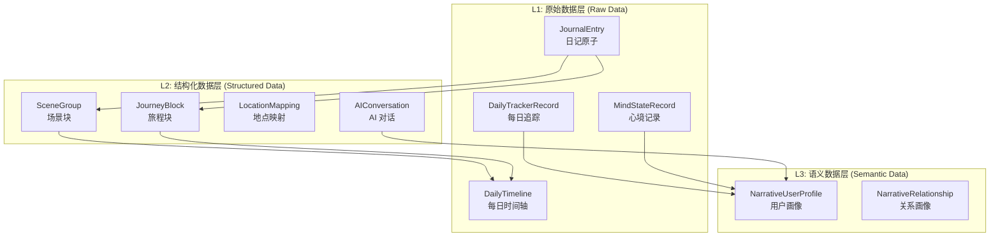
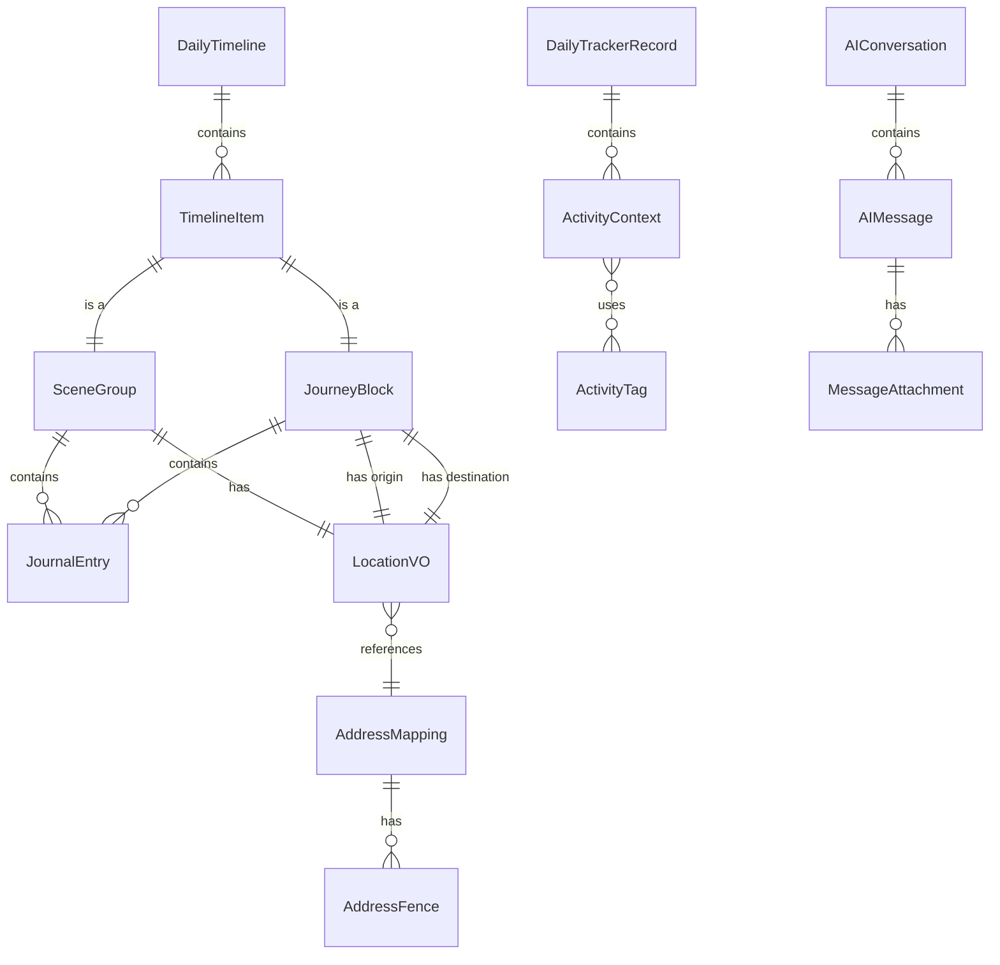

# 数据架构

> 返回 [文档中心](../INDEX.md)

## 概述

观己(Guanji)采用三层数据架构设计，从原始记录到语义理解逐层抽象。数据通过 JSON 文件持久化存储，结合内存缓存实现高效访问。

## 数据层级



## 核心模型

### L1: 原始数据层

#### JournalEntry (日记原子)

最小记录单元，支持多种内容类型。

```swift
// 文件路径: Core/Models/JournalEntry.swift
public struct JournalEntry: Codable, Identifiable {
    public let id: String
    public let type: EntryType          // text, image, video, audio, file, mixed
    public let subType: EntrySubType?   // love_received, pending_question, normal
    public let chronology: EntryChronology  // past, present, future
    public let content: String?
    public let url: String?
    public let timestamp: String        // HH:mm
    public let category: EntryCategory? // dream, health, emotion, work, social, media, life
    public let metadata: Metadata?
}
```

#### DailyTimeline (每日时间轴)

每日主表，包含所有场景和旅程。

```swift
// 文件路径: Core/Models/DailyTimeline.swift
public struct DailyTimeline: Codable, Identifiable {
    public let id: String               // day_YYYYMMDD
    public let date: String             // yyyy.MM.dd
    public var weather: String?
    public var items: [TimelineItem]    // 场景和旅程
    public var tags: [EntryCategory]    // 自动聚合的标签
}
```

#### DailyTrackerRecord (每日追踪)

快速记录每日状态和活动。

```swift
// 文件路径: Core/Models/DailyTrackerModels.swift
public struct DailyTrackerRecord: Codable, Identifiable {
    public let id: String
    public let date: String             // YYYY-MM-DD
    public let bodyEnergy: Int          // 0-100 (50 = normal)
    public let moodWeather: Int         // 0-100 (50 = neutral)
    public let activities: [ActivityContext]
}
```

### L2: 结构化数据层

#### SceneGroup (场景块)

同一地点的日记集合。

```swift
// 文件路径: Core/Models/LocationModel.swift
public struct SceneGroup: Codable, Identifiable {
    public let type: String
    public let id: String
    public let timeRange: String
    public let location: LocationVO
    public let entries: [JournalEntry]
}
```

#### JourneyBlock (旅程块)

两地之间的移动记录。

```swift
// 文件路径: Core/Models/LocationModel.swift
public struct JourneyBlock: Codable, Identifiable {
    public let id: String
    public let origin: LocationVO
    public let destination: LocationVO
    public let mode: TransportMode      // car, walk, subway, bicycle
    public let duration: String
    public let entries: [JournalEntry]
}
```

#### AIConversation (AI 对话)

AI 对话会话记录。

```swift
// 文件路径: Core/Models/AIConversationModels.swift
public struct AIConversation: Codable, Identifiable {
    public let id: String
    public var title: String?
    public var messages: [AIMessage]
    public var associatedDays: [String]
    public let createdAt: Date
    public var updatedAt: Date
}
```

### L3: 语义数据层

#### NarrativeUserProfile (用户画像)

基于叙事的用户画像，从日记中提取。

```swift
// 文件路径: Core/Models/NarrativeProfileModels.swift
public struct NarrativeUserProfile: Codable, Identifiable {
    public let id: String
    public var basicInfo: BasicInfo
    public var lifeContext: LifeContext
    public var personalityTraits: PersonalityTraits
    public var currentState: CurrentState
}
```

#### NarrativeRelationship (关系画像)

基于叙事的关系描述。

```swift
// 文件路径: Core/Models/NarrativeRelationshipModels.swift
public struct NarrativeRelationship: Codable, Identifiable {
    public let id: String
    public var name: String
    public var relationshipType: RelationshipType
    public var narrativeDescription: String
    public var keyMemories: [String]
}
```

## 数据关系图



## 数据仓库

| Repository | 职责 | 数据模型 |
|------------|------|----------|
| TimelineRepository | 时间轴 CRUD | DailyTimeline, TimelineItem |
| LocationRepository | 地点映射和围栏 | AddressMapping, AddressFence |
| DailyTrackerRepository | 每日追踪记录 | DailyTrackerRecord |
| MindStateRepository | 心境记录 | MindStateRecord |
| AIConversationRepository | AI 对话管理 | AIConversation |
| AISettingsRepository | AI 设置 | AISettings |
| NarrativeUserProfileRepository | 用户画像 | NarrativeUserProfile |
| NarrativeRelationshipRepository | 关系画像 | NarrativeRelationship |
| QuestionRepository | 时间胶囊问题 | QuestionEntry |
| ActivityTagRepository | 活动标签 | ActivityTag |
| AddressRepository | 地址管理 | AddressMapping |
| UserPreferencesRepository | 用户偏好 | UserPreferences |

## 持久化策略

### 存储位置

```
Documents/
├── TimelineData_v2/
│   └── daily_timelines.json
├── LocationData/
│   ├── mappings.json
│   └── fences.json
├── TrackerData/
│   └── records.json
├── AIData/
│   ├── conversations.json
│   └── settings.json
└── ProfileData/
    ├── user_profile.json
    └── relationships.json
```

### 缓存策略

- **内存缓存**: 所有 Repository 维护内存缓存
- **异步写入**: 数据变更后在后台线程持久化
- **通知机制**: 数据变更后发送 NotificationCenter 通知

```swift
// 示例: TimelineRepository 持久化
private func persistToDisk() {
    DispatchQueue.global(qos: .background).async {
        do {
            let data = try JSONEncoder().encode(self.timelineCache)
            try data.write(to: self.dailyTimelinesURL)
        } catch {
            print("Timeline Persistence Error: \(error)")
        }
    }
}
```

## 关键枚举

### EntryType (内容类型)

| 值 | 说明 |
|----|------|
| text | 文本 |
| image | 图片 |
| video | 视频 |
| audio | 音频 |
| file | 文件 |
| mixed | 混合内容 |

### EntryCategory (内容分类)

| 值 | 说明 |
|----|------|
| dream | 梦境 |
| health | 健康 |
| emotion | 情感 |
| work | 工作 |
| social | 社交 |
| media | 媒体 |
| life | 生活 |

### LocationStatus (地点状态)

| 值 | 说明 |
|----|------|
| no_permission | 无权限 |
| raw | 原始坐标 |
| mapped | 已映射 |

## 相关文档

- [系统架构](system-architecture.md)
- [MVVM 模式说明](mvvm-pattern.md)
- [数据模型详情](../data/)

---
**版本**: v1.0.0  
**作者**: Kiro AI Assistant  
**更新日期**: 2024-12-17  
**状态**: 已发布
