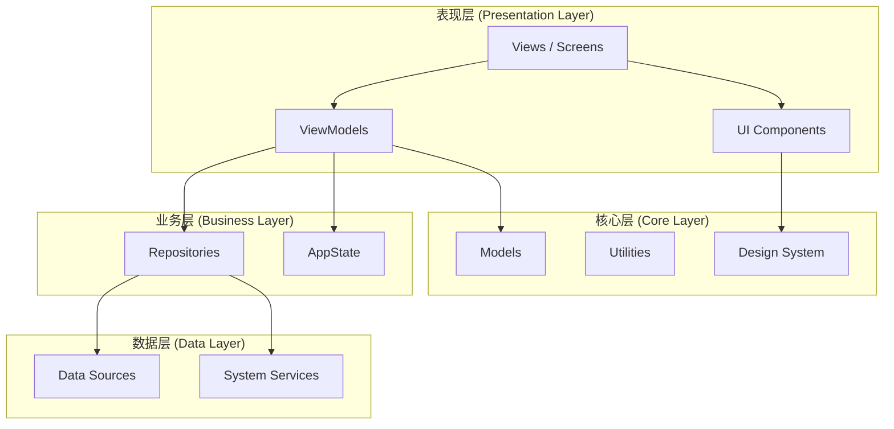
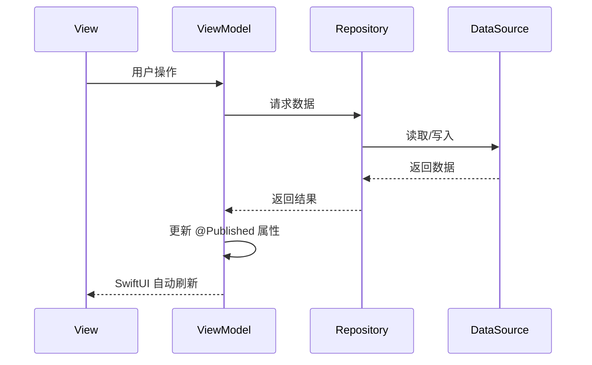

# 系统架构

> 返回 [文档中心](../INDEX.md)

## 概述

观己(Guanji)采用 MVVM (Model-View-ViewModel) 架构模式，结合 Atomic Design 组件设计理念，构建一个"有生命感"的 iOS 应用。系统严格遵循 Apple Human Interface Guidelines (HIG)，确保流畅的原生体验。

## 技术栈

| 项目 | 值 |
|------|-----|
| 平台 | iOS 16.1+ |
| 语言 | Swift 5.0 / SwiftUI |
| 架构 | MVVM + Atomic Design |
| 数据持久化 | JSON 文件存储 + 内存缓存 |
| 状态管理 | Combine + @Published |

## 分层架构



## 目录结构

```
guanji/guanji0.34/guanji0.34/
├── App/                   # 应用入口和全局状态
│   ├── AppState.swift     # 全局状态管理
│   └── KeyboardObserver.swift
│
├── Features/              # 业务模块 (Screen + ViewModel)
│   ├── Timeline/          # 时间轴主页
│   ├── AIConversation/    # AI 对话
│   ├── DailyTracker/      # 每日追踪
│   ├── History/           # 历史记录
│   ├── Input/             # 输入
│   ├── Insight/           # 数据洞察
│   ├── MindState/         # 心境记录
│   └── Profile/           # 个人中心
│
├── UI/                    # 可复用组件 (Atomic Design)
│   ├── Atoms/             # 基础组件
│   ├── Molecules/         # 复合组件
│   └── Organisms/         # 复杂组件
│
├── Core/
│   ├── DesignSystem/      # 设计系统 (颜色、字体、图标)
│   ├── Models/            # 数据模型
│   └── Utilities/         # 工具函数
│
├── DataLayer/
│   ├── Repositories/      # 数据仓库
│   ├── SystemServices/    # 系统服务
│   └── DataSources/       # 数据源
│
├── Shared/                # 扩展共享代码
└── Resources/             # 本地化字符串、Assets
```

## 模块职责

### 表现层 (Presentation Layer)

| 模块 | 职责 |
|------|------|
| Features/ | 业务功能模块，每个模块包含 Screen (View) 和 ViewModel |
| UI/ | 可复用 UI 组件，遵循 Atomic Design 原则 |

### 业务层 (Business Layer)

| 模块 | 职责 |
|------|------|
| AppState | 全局应用状态，跨模块共享数据 |
| Repositories | 数据仓库，封装数据访问逻辑 |

### 数据层 (Data Layer)

| 模块 | 职责 |
|------|------|
| SystemServices | 系统服务集成 (定位、天气、权限、AI) |
| DataSources | 数据源，包括本地存储和 Mock 数据 |

### 核心层 (Core Layer)

| 模块 | 职责 |
|------|------|
| Models | 数据模型定义 |
| Utilities | 工具函数 (日期处理、Markdown 解析等) |
| DesignSystem | 设计系统 (颜色、字体、图标) |

## 数据流



## 通信机制

### 状态传递

- **@EnvironmentObject**: 全局状态 (AppState) 通过环境对象传递
- **@StateObject / @ObservedObject**: ViewModel 与 View 绑定
- **@Published**: ViewModel 发布状态变化

### 事件通知

跨模块通信使用 `NotificationCenter`，关键事件包括：

| 事件名 | 触发场景 |
|--------|----------|
| `gj_submit_input` | 用户提交输入 |
| `gj_addresses_changed` | 地址映射变更 |
| `gj_timeline_updated` | 时间轴数据更新 |
| `gj_tracker_updated` | 追踪器数据更新 |
| `gj_day_end_time_changed` | 日结束时间变更 |

## 相关文档

- [MVVM 模式说明](mvvm-pattern.md)
- [数据架构](data-architecture.md)
- [功能模块文档](../features/)

---
**版本**: v1.0.0  
**作者**: Kiro AI Assistant  
**更新日期**: 2024-12-17  
**状态**: 已发布
